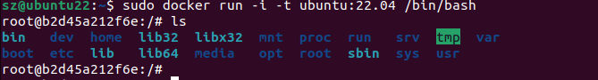
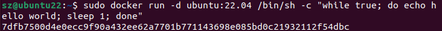
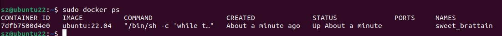
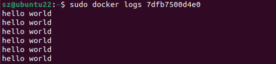
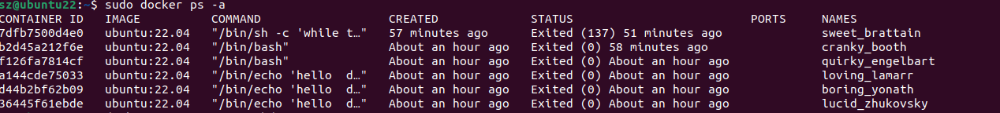
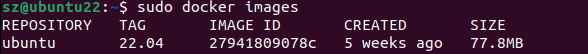
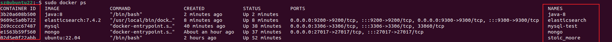
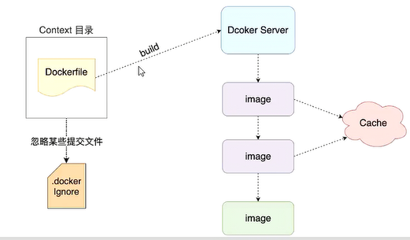

# Docker 架构

- **镜像（Image）**：Docker 镜像（Image），就相当于是一个 root 文件系统。比如官方镜像 ubuntu:16.04 就包含了完整的一套 Ubuntu16.04 最小系统的 root 文件系统。
- **容器（Container）**：镜像（Image）和容器（Container）的关系，就像是面向对象程序设计中的类和实例一样，镜像是静态的定义，容器是镜像运行时的实体。容器可以被创建、启动、停止、删除、暂停等。
- **仓库（Repository）**：仓库可看成一个代码控制中心，用来保存镜像。


- **Docker 镜像(Images)**:Docker 镜像是用于创建 Docker 容器的模板，比如 Ubuntu 系统
- **Docker 容器(Container)**:容器是独立运行的一个或一组应用，是镜像运行时的实体。
- **Docker 客户端(Client)**:Docker 客户端通过命令行或者其他工具使用 Docker SDK (https://docs.docker.com/develop/sdk/) 与 Docker 的守护进程通信。
- **Docker 主机(Host)**:一个物理或者虚拟的机器用于执行 Docker 守护进程和容器。
- **Docker Registry**：Docker 仓库用来保存镜像，可以理解为代码控制中的代码仓库。Docker Hub([https://hub.docker.com](https://hub.docker.com/)) 提供了庞大的镜像集合供使用。一个 Docker Registry 中可以包含多个仓库（Repository）；每个仓库可以包含多个标签（Tag）；每个标签对应一个镜像。
- **Docker Machine**：Docker Machine是一个简化Docker安装的命令行工具，通过一个简单的命令行即可在相应的平台上安装Docker，比如VirtualBox、 Digital Ocean、Microsoft Azure。

# Ubuntu安装Docker

## 使用官方的脚本安装

```linux
curl -fsSL https://get.docker.com | bash -s docker --mirror Aliyun
```

### 使用国内 daocloud 一键安装命令

```linux
curl -sSL https://get.daocloud.io/docker | sh
```

### 设置仓库

```java
sudo apt-get install \
    apt-transport-https \
    ca-certificates \
    curl \
    gnupg-agent \
    software-properties-common
```

### 安装 Docker Engine-Community

```java
sudo apt-get install docker-ce docker-ce-cli containerd.io
```

### 测试安装成功

```java
 sudo docker run hello-world
```


### 卸载

Docker 的旧版本被称为 docker，docker.io 或 docker-engine 

```java
//卸载旧版本
sudo apt-get remove docker docker-engine docker.io containerd runc
//删除安装包：
sudo apt-get purge docker-ce
//删除镜像、容器、配置文件等内容：
sudo rm -rf /var/lib/docker
```


# 亲测有效的卸载

```shell
#将docker相关应用容器杀死：
docker kill $(docker ps -a -q)
#删除所有docker容器：
docker rm $(docker ps -a -q)
#删除所有docker镜像：
docker rmi $(docker images -q)
#停止 docker 服务：
systemctl stop docker
#进行umount操作：
umount /var/lib/docker/devicemapper
#删除docker相关存储目录：
rm -rf /etc/docker
rm -rf /run/docker
rm -rf /var/lib/dockershim
rm -rf /var/lib/docker
#删除docker、卸载相关包：
sudo apt-get purge docker-ce docker-ce-cli containerd.io
#检查卸载结果：返回空则为成功卸载
docker version

```


# Docker Hello World

## 获取镜像

如果我们本地没有 ubuntu 镜像，我们可以使用 docker pull 命令来载入 ubuntu 镜像：

```
$ docker pull ubuntu
```

## 运行容器（自动下载创建容器）

```
docker run ubuntu:22.04 /bin/echo "Hello world"
```

- **docker:** Docker 的二进制执行文件。
- **run:** 与前面的 docker 组合来运行一个容器。
- **ubuntu:22.04** 指定要运行的镜像，Docker 首先从本地主机上查找镜像是否存在，如果不存在，Docker 就会从镜像仓库 Docker Hub 下载公共镜像。
- **/bin/echo "Hello world":** 在启动的容器里执行的命令

## 运行交互式的容器

我们通过 docker 的两个参数 -i -t，让 docker 运行的容器实现**"对话"**的能力：

```
docker run -i -t ubuntu:22.04 /bin/bash
```



exit：退出docker容器

## 启动容器（后台模式）

使用以下命令创建一个以进程方式运行的容器

```
docker run -d ubuntu:22.04 /bin/sh -c "while true; do echo hello world; sleep 1; done"
```




**docker ps** 查看正在运行的容器



**CONTAINER ID:** 容器 ID。

**IMAGE:** 使用的镜像。

**COMMAND:** 启动容器时运行的命令。

**CREATED:** 容器的创建时间。

**STATUS:** 容器状态。

状态有7种：

- created（已创建）
- restarting（重启中）
- running 或 Up（运行中）
- removing（迁移中）
- paused（暂停）
- exited（停止）
- dead（死亡）

**PORTS:** 容器的端口信息和使用的连接类型（tcp\udp）。

**NAMES:** 自动分配的容器名称。


在宿主主机内使用 **docker logs** 命令，查看容器内的标准输出：

\

## 停止容器

```xml
sudo docker stop 7dfb7500d4e0
```

## 查看所有的容器命令如下

```
 docker ps -a
```



## docker start 启动一个已停止的容器

```
docker start b750bbbcfd88 
```

## 进入容器

在使用 **-d** 参数时，容器启动后会进入后台。此时想要进入容器，可以通过以下指令进入：

- **docker attach**
- **docker exec**：推荐大家使用 docker exec 命令，因为此命令会退出容器终端，但不会导致容器的停止。

```java
docker attach 1e560fca3906 //  不知道为啥 ubuntu 可以  mysql使用时 不可以
docker exec -it 243c32535da7 /bin/bash   //通过容器id或者名字
```

## 退出容器，并且不关闭

**ctrl+p+q**

## 导出和导入容器

```java
//导出到本地 ubuntu.tar
docker export 1e560fca3906 > ubuntu.tar
//可以使用 docker import 从容器快照文件中再导入为镜像，以下实例将快照文件 ubuntu.tar 导入到镜像 test/ubuntu:v1:
cat docker/ubuntu.tar | docker import - test/ubuntu:v1
```

## 删除容器

```
docker rm -f 1e560fca3906
```

## 查看容器日志

通过docker logs命令可以查看容器的日志。

```xml
$ docker logs [OPTIONS] CONTAINER
  Options:
        --details        显示更多的信息
    -f, --follow         跟踪实时日志
        --since string   显示自某个timestamp之后的日志，或相对时间，如42m（即42分钟）
        --tail string    从日志末尾显示多少行日志， 默认是all
    -t, --timestamps     显示时间戳
        --until string   显示自某个timestamp之前的日志，或相对时间，如42m（即42分钟）
```

例：

```java
//查看指定时间后的日志，只显示最后100行：
$ docker logs -f -t --since="2018-02-08" --tail=100 CONTAINER_ID
//查看最近30分钟的日志:
$ docker logs --since 30m CONTAINER_ID
//查看某时间之后的日志：
$ docker logs -t --since="2018-02-08T13:23:37" CONTAINER_ID
//查看某时间段日志：
$ docker logs -t --since="2018-02-08T13:23:37" --until "2018-02-09T12:23:37" CONTAINER_ID
```

### 查看容器的相关配置

```shell
docker inspect container_name
```


## 运行一个 web 应用

```java
docker pull training/webapp  // 载入镜像
docker run -d -P training/webapp python app.py//Docker 开放了 5000 端口（默认 Python Flask 端口）映射到主机端口 32769 上。
docker run -d -p 5000:5000 training/webapp python app.py//我们也可以通过 -p 参数来设置不一样的端口：
```

- **-d:**让容器在后台运行。
- **-P:**将容器内部使用的网络端口随机映射到我们使用的主机上。


# 镜像

## 列出镜像列表,列出本地主机上的镜像

```java
docker images
```




## 获取一个新的镜像

```java
docker pull ubuntu:13.10
```


## 使用版本为 14.04 的 ubuntu 系统镜像来运行容器

```java
docker run -t -i ubuntu:14.04 /bin/bash 
```

## 查找镜像

```java
docker search xxx //比如httpd
```


## 删除镜像

```
docker rmi hello-world
```


## 创建镜像

**1、从已经创建的容器中更新镜像，并且提交这个镜像**

```
docker commit -m="has update" -a="runoob" e218edb10161 runoob/ubuntu:v2
```

- **-m:** 提交的描述信息
- **-a:** 指定镜像作者
- **e218edb10161：**容器 ID
- **runoob/ubuntu:v2:** 指定要创建的目标镜像名

```java
docker run -t -i runoob/ubuntu:v2 /bin/bash          //使用我们的新镜像 runoob/ubuntu 来启动一个容器
```

- **-i**  交互式，但是，比如创建了两个mysql容器，就会出现端口冲突，需要更改端口映射。（会打包配置，数据不会复制）

- **-P :**是容器内部端口**随机**映射到主机的端口。
- **-p :** 是容器内部端口绑定到**指定**的主机端口。

```linux
sudo docker run -d -p 3307:3306 new_mysql
# 3307  主机端口
# 3306  容器端口
# new_mysql 镜像名
```


**2、使用 Dockerfile 指令来创建一个新的镜像**

另一种比较麻烦  通过dockerfile   不介绍了

# Docker 容器连接

<font color="red" size="5px"><u>创建容器时指定!!!</u></font>

## 端口映射

- **-P :**是容器内部端口**随机**映射到主机的端口。
- **-p :** 是容器内部端口绑定到**指定**的主机端口。

```linux
sudo docker run -d -p 3307:3306 new_mysql
```

## 网络地址映射

指定容器绑定的网络地址

```linux
docker run -d -p 127.0.0.1:3307:3306 new_mysql
```

这样主机可以通过127.0.0.1:3307访问

## 目录映射

-v参数

-v  主机路径:容器路径

<font color="red"> 这里的映射，目的是让容器可以访问到主机里的该路径，不要理解反了。所以进行设置配置文件的时候，一般需要在主机的这个路径搞个配置文件。</font>

比如：https://blog.csdn.net/Ber_Bai/article/details/116572207

```shell
#将容器内部的配置文件复制到主机的目录中，然后重新启动容器
docker cp mysql:/etc/mysql /usr/local/mysql/conf
```


# Docker 安装 MongoDB

### 取最新版的 MongoDB 镜像

```
docker pull mongo:latest
```

### 运行容器

```
docker run -itd --name mongo -p 27017:27017 mongo --auth
```

```xml
docker exec -it mongo mongo admin
# 创建一个名为 admin，密码为 123456 的用户。
>  db.createUser({ user:'admin',pwd:'123456',roles:[ { role:'userAdminAnyDatabase', db: 'admin'},"readWriteAnyDatabase"]});
# 尝试使用上面创建的用户信息进行连接。
> db.auth('admin', '123456')
```


# Docker 安装 Mysql

## 获取镜像

```
docker pull mysql:latest
```

## 运行容器

```
docker run -itd --name mysql-test -p 3306:3306 -e MYSQL_ROOT_PASSWORD=123456 mysql
```

- **-p 3306:3306** ：映射容器服务的 3306 端口到宿主机的 3306 端口，外部主机可以直接通过 **宿主机ip:3306** 访问到 MySQL 的服务。
- **MYSQL_ROOT_PASSWORD=123456**：设置 MySQL 服务 root 用户的密码。
- **--name**： 指定容器名称
- **最后参数**：使用的镜像

## 启动容器

```xml
docker exec -it  id   /bin/bash
```

- -i: 交互式
- -t: 终端
- -d: 默认不会进入容器，想要进入容器需要使用指令 **docker exec**。


# docker安装ES(elasticsearch:7.4.2)

## 获取镜像

```xml
docker pull elasticsearch:7.4.2
```

## 启动容器

```xml
docker run --name elasticsearch -p 9200:9200 -p 9300:9300 -e "discovery.type=single-node" -e ES_JAVA_OPTS="-Xms512m -Xmx512m" -d elasticsearch:7.4.2
```


# docker安装jdk(jdk:8)

## 获取镜像

```java
docker pull java:8
```

## 运行容器

```java
docker run -d -it --name java-8 java:8
```


## 进入容器（通过容器名字）

```xml
docker exec -it java-8 /bin/bash
```




# docker安装rabbitmq

## 获取最新镜像

```xml
docker pull docker.io/rabbitmq:3.8-management//latest有问题 
```

## 创建/运行容器

```xml
sudo docker run -d -it --name rabbitmq -p 15672:15672 -p 5672:5672 xxxx(镜像id)
```

## 新增用户

```xml
docker exec -i -t rabbitmq bin/bash  //进入mq容器
rabbitmqctl add_user root 123456 //添加用户，用户名为root,密码为123456
rabbitmqctl set_permissions -p / root ".*" ".*" ".*"   // 赋予root用户所有权限
rabbitmqctl set_user_tags root administrator    //赋予root用户administrator角色
rabbitmqctl list_users   //查看所有用户即可看到root用户已经添加成功
```


# Dockerfile

- Dockerfile，是一个用来构建镜像的文本文件，文本内容包含了一条条构建镜像所需的指令和说明
- 用于构建自己的应用的镜像



## 构建镜像

- ###### 构建过程

  - 创建一个目录（构建上下文目录），目录中创建`Dockerfile`文件，名字推荐用`Dockerfile`
  - 在执行`build`命令之后，会将内容打包发送到server端，进行层层镜像创建
  - 中间创建的镜像会保存到缓存中，方便修改后快速构建

- ###### 相关命令

  - `FROM`，当前镜像基于哪个镜像
  - `RUN`，构建镜像时需要运行的命令
  - `EXPOSE`，当前容器对外暴露出的端口
  - `WORKDIR`，指定在创建容器后，终端默认登录进来的工作目录，一个落脚点
    - 如果`WORKDIR`不存在，即使它在没有任何后续`Dockerfile`指令中使用，他也将被创建
    - `WORKDIR`可以在`Docker`中多次使用，如果提供了相对路径，则该路径将与先前`WORKDIR`指令的路径相对
  - `ENV`,用来在构建过程中设置环境变量
    - 以后可以复用
    - 在运行容器的时候可以设置环境变量
  - `ADD`，将宿主机目录下的文件拷贝进镜像且`ADD`命令会自动处理URL和解压tar包（**下载的压缩包不能解压**）
  - `COPY`，类似于`ADD`，拷贝文件和目录到镜像中，将从构建上下文目录中<原路径>的文件或目录复制到新的一层的镜像内的<目标路径>位置
  - `VOLUME`，容器数据卷，用于数据保存和持久化工作，`-v`的容器端

- `CMD`，指定一个容器启动时要运行的命令，`Dockerfile`中可以有多个`CMD`命令，但只有**最后一个生效**，`CMD`会被`docker run` 之后的参数替换

- `ENTRYPOINT`，指定一个容器启动时要运行的命令，`ENTRYPOINT`的目的和`CMD`一样，都是在指定容器启动程序及其参数


## 使用案例

- `mkdir mydocker && cd mydocker`

- `vim Dockerfile`

  - ```
    FROM centos:7
    RUN yum install -y vim
    EXPOSE 8080
    EXPOSE 15672
    WORKDIR /data
    ENV CORE_DATA_DIR /data/coredata
    COPY a.txt /data/files
    ADD https://mirrors.bfsu.edu.cn/apache/tomcat/tomcat-10/v10.0.2/bin/apache-tomcat-10.0.2.tar.gz /data/packages
    ADD pandas‑1.2.2‑cp39‑cp39‑win_amd64.whl /data/pylibs
    ADD apache-tomcat-10.0.2.tar.gz /data/softwares
    RUN cd /data/softwares && mv apache-tomcat-10.0.2 tomcat
    VOLUMN $CORE_DATA_DIR
    ENTRYPOINT ["ls"]
    CMD ["/data/coredata"]
    ```

- `docker build -t mycentos7:01 .`

  - -t，指定仓库名称和版本（镜像名称和版本）
  - `.`，当前目录，`Dockerfile`所在目录

- `COPY a.txt /data/files`，拷贝当前目录下的a.txt到 镜像的/data/files目录下

- ```
  ADD apache-tomcat-10.0.2.tar.gz /data/softwares
  RUN cd /data/softwares && mv apache-tomcat-10.0.2 tomcat
  ```

  - 在解压之后，重命名

- ```
  ENTRYPOINT ["ls"]
  CMD ["/data/coredata"]
  ```

  - 在`docker run mycentos7:2`时，会默认打印`/data/coredata`下的对象
  - 同时，CMD后面的内容可由run后边的参数覆盖，如
    - `docker run mycentos7:2 /data/packages`，`/data/packages`会覆盖CMD后边的内容，执行的时候会打印`/data/packages`下的对象


# `Docker Compose`

- ##### 简述

  - `Compose` 项目是`Docker`官方的开源项目，负责实现对`Docker`集群的快速编排
    - 通过一个单独的`docker-compose.yml`
  - 定位，定义和运行多个`docker`容器的应用，同时可以对多个容器进行编排

- ##### `Compose`两个重要概念

  - 服务（`service`）：一个容器，实际上可以包括若干运行相同镜像的容器实例
  - 项目（`project`）：由一组关联的应用容器组成的一个完整业务单元，在`docker-compose.yml`文件中定义

- ##### `Docker-compose`安装(`LINUX`)

  - ```
    sudo curl -L "https://github.com/docker/compose/releases/download/1.28.4/docker-compose-$(uname -s)-$(uname -m)" -o /usr/local/bin/docker-compose
    ```

  - ```
    sudo chmod +x /usr/local/bin/docker-compose
    ```

  - ```
    sudo ln -s /usr/local/bin/docker-compose /usr/bin/docker-compose
    ```

  - ###### 检测是否安装成功

    - `docker-compose -v`
      - 成功后显示：`docker-compose version 1.28.4, build cabd5cfb`

- ##### `Docker_compose`使用

  - 创建`docker-compose.yml`文件

  - 配置文件（这里边的格式，尤其是缩进，由于种种原因可能掺杂`tab`和空格，所以，这里主要关键功能就好）

    - ```
      version:"3.8" # 指定项目版本（目前最高版本3.8）
      
      services:
      	web_build_test:
      		build:
      			context: demo # 指定上下文目录(要打包的Dockerfile所在的目录, 相对目录和绝对目录都行)
      			dockfile: Dockerfile
      		container_name: c_demo
      		
      		ports:
      			- "8083:8083"
      
              networks:
              	- hello
      
              depends_on:
              	- tomcat01
      		
      	tomcat01:	# 服务名唯一
      		container_name: tomcat01
      		image: tomcat:9.0-jre9 # 创建当前这个服务使用的镜像
      		ports:
      			- 8080:8080 # 宿主机端口:容器端口，最好用引号包起来，<60的端口，在yml中会解析成60进制
              volumes:
              	# - /root/apps:/usr/local/tomcat/apps
              	- tomcatdata01:/usr/local/tomcat/apps
              
               networks: # 代表当前服务使用哪个网络
               	- hello
          	
          	depends_on:
          		- redis
          		- mysql
          
       	tomcat02:
       		container_name: tomcat02
           	image: tomcat:9.0-jre9 # 创建当前这个服务使用的镜像
           	ports:
      			- 8081:8080 # 宿主机端口:容器端口，最好用引号包起来，<60的端口，在yml中会解析成60进制
              volumes:
              	# - /root/apps:/usr/local/tomcat/apps
              	- tomcatdata02:/usr/local/tomcat/apps
              	
      		networks: # 代表当前服务使用哪个网络
      			- hello
      		
           mysql:
           	image: mysql:8.0.23
           	container_name: mysql
           	
           	ports:
           		- "3306:3306"
           		
           	volumes:
           		- mysqldata:/var/lib/mysql
           		- mysqlconfig:/etc/mysql
           		
              # environment:
              	# - MYSQL_ROOT_PASSWORD=root
            
             	env_file:
             		- mysql.env
              
              networks:
              	- hello
              
              healthcheck:
              	test: ["CMD", "curl", "-f", "http://localhost"]
              	interval: 1m30s
              	timeout: 10s
              	retries: 3
           
             redis:
              image: redis:6.2.0
              container_name: redis
      
              ports:
                - "6379:6379"
      
                volume:
                  - redisdata:/data
      
                networks:
                  - hello
      
                command: "redis-server --appendonly yes" # run镜像之后，覆盖容器内部命令
           
       volumes: # 声明上面服务所使用的的自动创建的卷名
       	tomcatdata01: # 声明指定的卷名
       				  # compose自动创建该卷名但是会在之前加入项目名称，如 hello_tomcatdata
          	external: # 使用自定义卷名
          		false # 确定是否使用自定义卷名，如果为true，则需要在服务启动前先手动创建该卷
         	
         	mysqldata:
         	mysqlconf:
       	redisdata:
       	
       networks:
       	hello: # 定义上面服务用到的网桥名称，默认创建就是 bridge
       		external:
       			true	# 使用外部指定的网桥，网桥必须在服务启动前手动创建
       
      ```

    - `mysql.env`

      ```
      MYSQL_ROOT_PASSWORD=root
      ```

  - ###### 启动项目

    - `docker-compose up`（默认前台启动）
      - 必须保证运行命令所在的目录中存在`docker-compose.yml`文件

# `docker-compose`模板指令

- `version`，`compose`版本，
  - 最高支持的版本可以在这里查到：[传送门](https://docs.docker.com/compose/compose-file/compose-file-v3/)
- `volumes`，数据卷，等价于 `run -v`
- `networks`，网络，等价于 `run --network`
- `container_name`，给容器指定名字，等价于 `run --name`
- `command`，`docker run` 启动容器时，运行的一些命令，用来覆盖程序默认启动指令
- `environment`，用于指定容器启动时的环境参数
- `env_file`，环境变量保存的文件路径，用于从文件中获取环境变量
  - 要求文件必须以`.env`结尾
- `depends_on`，解决容器的依赖、启动顺序问题
  - 表示这个服务启动需要依赖于哪些其它服务
  - 后边写**服务**`ID`而不是**容器名称**
  - 该服务不会等到所依赖的服务完全启动后才启动，而是等到所依赖的服务启动到一定程度就启动
- `healthcheck`，用于告诉`Docker`引擎应该如何进行判断容器的状态是否正常
- `sysctls`，修改容器中系统内部参数
  - 非必须，有些服务启动受到容器内操作系统参数限制可能会无法启动，必须通过修改容器中参数才能启动
- `ulimits`，用来修改容器内部系统的最大进程数，使用时可根据当前容器运行服务要求进行修改
- `build`，用来将指定的`Dockerfile`打包成镜像，然后再运行该镜像

- ##### `compose` 模板指令和`compose` 指令区别(**本文件中所提及的“指令”和“命令”指的均为同一个东西** )

  - **模板指令**，用于书写在`docker-compose.yml`文件中的指令
  - **指令**，用于对整个`docker-compose.yml`对应的这个项目操作，写在`docker-compose`命令之后的命令

- ##### `compose `命令选项

  - `-f， --file`，指定使用的`compose`模板文件，默认为`docker-compose.yml`，可以多次指定
  - `-p,--project-name`，指定项目名称，默认将使用所在目录名称作为项目名称
  - `--x-networking`，使用`Docker`的可插拔网络后端特性
  - `--verbose`，输出更多调试信息
  - `-v,--version`，打印版本并退出

- `Docker-compose`命令

  - `up`
    - 它将尝试自动完成包括构建镜像，（重新）创建服务，并关联服务相关容器的一系列操作
    - 关联的服务都将会自动启动，除非已处于运行状态
    - `docker-compose up`启动的容器在前台运行，控制台将打印所有容器的输出信息
    - `Ctrl+C`停止命令时，所有容器将会停止
    - 如果使用`docker-compose up -d`，将会在后台启动并运行所有的容器
    - 默认下，如果容器已经存在，将会尝试停止容器，然后重新创建（保持使用`volume-from`挂载的卷），以保证新服务以`docker-compose.yml`文件的最新内容启动
  - `down`
    - 关闭所有`docker-compose.yml`中的服务，并移除网络（会移除自动创建的网络，不会移除外部网络）
    - 不会移除数据卷
  - `exec`
    - 进入指定的容器
    - 类似`docker exec`但有些不同
      - 例如，`docker`进入`23fdd00a692b`容器内并使用`shell`，`docker exec -it 23fdd00a692b bash`
      - `docker-compose`要用服务`ID`（也就是服务名）进入，`docker-compose exec redis bash`
  - `ps`
    - 展示当前`docker-compose`运行的所有容器
  - `restart`
    - 重启项目中的服务
  - `rm`
    - 删除所有（停止状态的）服务容器。推荐先执行`docker-compose stop`命令来停止容器
    - `-f`，前置直接删除，包括非停止状态的容器服务
    - `-v`，删除容器所挂载的数据卷，**谨慎使用**
  - `start`
    - 启动已经存在的容器服务
  - `stop`
    - 停止已处于运行状态的容器但不删除它
    - `-t`，停止容器时的超时时间
  - `top`
    - 查看各个服务容器内运行的进程
  - `unpause`
    - 恢复处于暂停状态的服务
  - `logs`
    - 查看服务日志，默认查看所有服务日志
    - `docker-compose logs redis`


