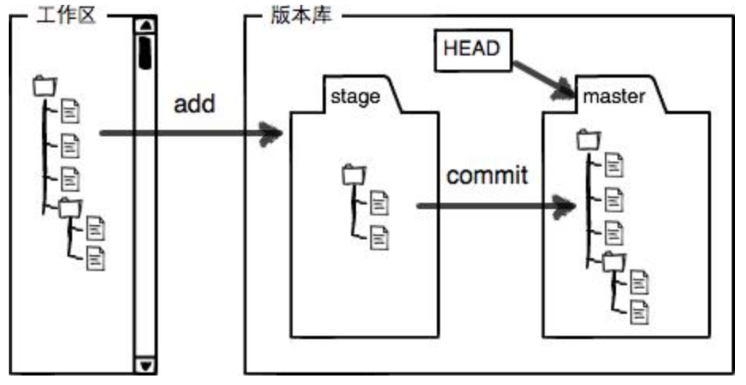
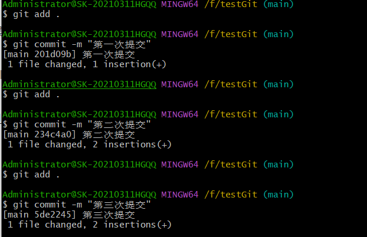
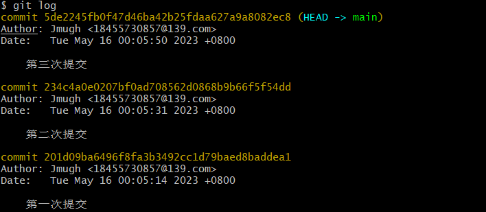
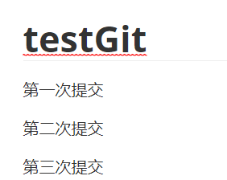
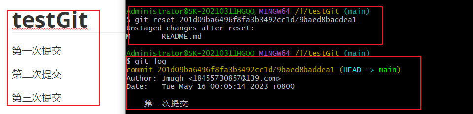
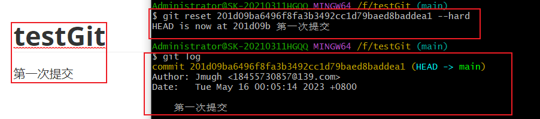
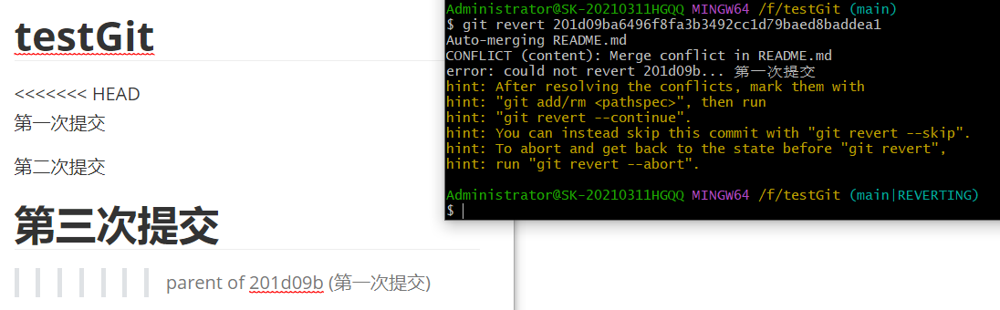

#  总体介绍

## 直接快照，而非比较差异


## 三种状态

对于任何一个文件，在 Git 内都只有三种状态：

**已提交（committed）**：已提交表示该文件已经被安全地保存在本地数据库中了；-------对应commit,保存到本地仓库

**已修改（modified）**：已修改表示修改了某个文件，但还没有提交保存；	            -------对应保存仓库之后，又修改了

**已暂存（staged）**：已暂存表示把已修改的文件放在下次提交时要保存的清单中。  -------对应add之后，放到暂存区

### 工作区和暂存区



#### 

# 初始化

## git配置

### 配置文件位置

• /etc/gitconfig文件：系统中对所有用户都普遍适用的配置。若使用 git config 时用 --system 选项，读写的就是这个文件。

• ~/.gitconfig文件：用户目录下的配置文件只适用于该用户。若使用 git config 时用 --global 选项，读写的就是这个文件。

• 当前项目的 git 目录中的配置文件（也就是工作目录中的 .git/config 文件）：这里的配置仅仅针对当前项目有效。每一个级别的配置都会覆盖上层的相同配置，所以 .git/config 里的配置会覆盖 /etc/gitconfig中的同名变量。


在 Windows 系统上，Git 会找寻用户主目录下的 .gitconfig 文件。主目录即 $HOME 变量指定的目录，一般都是 C:\Documents and Settings\$USER。此外，Git 还会尝试找寻 /etc/gitconfig 文件，只不过看当初 Git 装在什么目录，就以此作为根目录来定位。

### 配置用户

用户名和邮箱：每次 Git 提交时都会引用这两条信息，说明是谁提交了更新，所以会随更新内容一起被永久纳入历史记录

```git
git config --global user.name "Jmugh"
git config --global user.email 18455730857@139.com
```

<font color="red">参数：如果用了 --global 选项，那么更改的配置文件就是位于你用户主目录下的那个，以后你所有的项目都会默认使用这里配置的用户信息。如果要在某个特定的项目中使用其他名字或者电邮，只要去掉 --global 选项重新配置即可，新的设定保存在当前项目的 .git/config 文件里。</font>

### 查看配置

```git
git config -l   或 git config --list   #全局配置 加参数 --global
git config user.name # 查看某一属性的配置
```

有时候会看到重复的变量名，那就说明它们来自不同的配置文件（比如 /etc/gitconfig 和 ~/.gitconfig），不过最终 Git 实际采用的是最后一个。

## 克隆项目

```git
 git clone git://github.com/schacon/grit.git  #直接使用项目名作为文件夹
 git clone git://github.com/schacon/grit.git myprojectname #指定文件夹名 
```


# 常用命令

## 跟踪/暂存

```mysql
git add . //将工作区（本地能看到的）加入暂存区staged
```

**相反操作**

```	git
git reset filename//这个命令与add相反，但它还有其他功能，后文介绍。git reset [path]会改变path指定的文件或目录的stage状态，到非stage状态。git reset 会将所有stage的文件状态，都改变成非stage状态
```

有时候看到git reset HEAD filename也是一样的，一般HEAD代表当前版本。HEAD^表示上一个已经commit的版本（暂时不确定算不算push）


## 取消/删除/放弃对文件的修改

有时候，我们修改了文件,但是没有commit到仓库，又不想要了这次的修改，想要恢复到上一次commit的状态

```git
git checkout -- filename  //这个命令还是有点危险的，相当于用之前的覆盖了自己修改的文件。即 修改都丢失了。后续stashing更好
```


命令`git checkout -- filename`意思就是，把`filename文件在工作区的修改全部撤销，这里有两种情况：

- 一种是`filename`自修改后还没有被放到暂存区，现在，撤销修改就回到和版本库一模一样的状态；

- 一种是`filename`已经添加到暂存区后，又作了修改，现在，撤销修改就回到添加到暂存区后的状态。

总之，就是让这个文件回到最近一次`git commit`或`git add`时的状态。


## 提交

```git
git commit -m "xxx"  //提交数据到本地仓库
```

### 撤退提交:git reset和git revert

首先用git log查看想要恢复的版本，可以看到提交时对应的id xxx

- git reset xxx 会撤销之前的commit，重新查看git log时候发现这个id后面提交的  都没了，但是工作目录没有任何变化。中间的记录（提交对象）都没了，丢失数据
- git reset xxx --hard 会撤销之前的commit，重新查看git log时候发现这个id后面提交的  都没了，但是工作目录恢复到了xxx提交之后的状态。中间的记录（提交对象）都没了，丢失数据
- git revert xxx  会回到这次提交之前的状态，但是这是创建新的提交树，不会丢失数据。

举例：

1. 分别写三次文件，分别提交三次



2. 查看日志



此时的文件数据：




2. git reset 201d09ba6496f8fa3b3492cc1d79baed8baddea1 恢复到第一次提交之后的状态：日志可以看到，第一次提交之后的丢了，但是本地文件没变



2. git reset 201d09ba6496f8fa3b3492cc1d79baed8baddea1  --hard



3. git revert 201d09ba6496f8fa3b3492cc1d79baed8baddea1  出现冲突...



### 何时使用 git reset 和 git revert

当你在本地仓库上工作时，如果变化尚未被远程推送，你应该使用 `git reset`。这是因为在从远程仓库拉取修改后运行该命令会改变项目的 commit 历史，导致在该项目上工作的每个人发生合并冲突。

当你意识到对某一本地分支所做的修改应该在其他地方时，`git reset` 是一个不错的选择。你可以重置并移动到想要的分支，而不会丢失你的文件修改。

对于恢复推送到远程仓库的改动，`git revert` 是一个很好的选项。因为这个命令会创建一个新的提交，而不会改变其他人的提交历史。

## 查看文件状态

```git
git status
```

- 查看仓库状态，当全部加入到本地仓库之后（commit），会显示 work tree clean
- 如果有修改，不管是有没有add到暂存区， 都会提示modified的文件。没有add到暂存区是红色，add到暂存区是绿色。
- 如果是新创建的，不是修改的，那么会显示是untracked的  未被跟踪的文件，需要使用git add . 追踪文件
  


<font color="red">举例：比如一个文件在add之后，没有commit提交，我又修改了这个文件，git status显示这个文件modified，但是是红色的，表示修改了文件，但是没有放到暂存区。可以使用git add filename 来重新跟踪 放到暂存区。这时候会变成绿色的modified</font>

git stage filename 好像与git add相同作用，都是用来跟踪文件放到暂存区，但是查到的stage是个工作区不是命令....

## 查看已暂存和未暂存的更新内容

实际上 git status 的显示比较简单，仅仅是列出了修改过的文件，如果要查看具体修改了什么地方，可以用git diff 命令

```git
git diff //查看当前目录的所有已暂存和未暂存的区别
git diff filename //查看某个文件已暂存和未暂存的区别
git diff --cached  //可以看已经暂存起来的文件和上次提交时的快照之间的差异
```


## 删除已暂存的文件/删除仓库文件

删除已暂存的文件：

```	git
git rm -f filename  //暂存区和工作目录就删除了这个文件，但是本地仓库还是有的
---------------------------------------------------------------
删过没有commit 就后悔了，怎么办
git reset HEAD filename
git checkout -- filename
这样就恢复到删除之前的状态了，使用git status：显示clean tree
```


想要删除本地仓库文件，需要commit

```git
git commit -m "..."  //本地仓库就保存了当前快照，即:删除了文件
git push   //远程仓库同时也会删除该文件
```

如果只想删除暂存区的，不想删除工作目录的，使用git rm --cached

```git
git rm --cached filename  //想要加回来，使用git add filename
```


## git log

查看每次提交的日志


## 版本回退

```msyql
git reset --hard HEAD^  // 回到上一个版本。几个^表示回退几个版本
git reset --hard cimmit_id  //回到指定版本
git reflog // 查看每次提交日志  可以看到commit id,
```


#### 

# 远程仓库的使用

## 查看当前的远程仓库

可以用 git remote 命令，它会列出每个远程库的简短名字（如果需要看具体地址，可以加-v参数）。在克隆完某个项目后，至少可以看到一个名为 origin 的远程库，Git 默认使用这个名字来标识你所克隆的原始仓库。


## 添加远程分支

```mysql
git remote add newRepo https://github.com/Jmugh/testGit1.git
git remote -v
git remote rm origin
```


现在可以用字串 newRepo 指代对应的仓库地址了。但本地仓库没有的信息，可以运行 git fetch newRepo ：


暂时没懂有什么用，仿佛还是同一项目不同分支的，可以用来合并分支。


# 分支

## 何为分支

提交对象：每次提交会创建一个提交对象，它包含了指向上一次提交对象的指针，提交信息，和树对象

树对象概念：当前所有目录构成的树，为了以后能够看到这次的快照。

提交对象的关系：每次后提交的指向之前提交创建的提交对象


如图：在f30ab提交对象上，创建了testing分支，切换testing,并提交，创建了c2b9e对象

**master和testing表示分支，指向提交对象，<font color="red">并且始终指向该分支创建的最后一个提交对象。</font>**

**HEAD指针指向哪个分支对象，表示当前工作在哪个分支。**

比如master也进行一次提交，就是这样：


## 创建、切换分支

```git
git branch   //仅仅创建分支，行为如下图。
git checkout branchname  //切换分支
git chckout -b branchname //创建并切换分支
 git branch -d branchname //删除分支
```


## 分支合并

1 只有一个祖先时候的合并


2 有不同祖先时候的合并


# 常见问题解决


## 新建分支无法推送

直接git push出现问题，无法推送


如何解决呢？


## push  没有权限

```java
git push
fatal: The current branch sunzhong has no upstream branch.
To push the current branch and set the remote as upstream, use

git push --set-upstream origin sunzhong
To have this happen automatically for branches without a tracking
upstream, see 'push.autoSetupRemote' in 'git help config'.
```


## unable to access ...10054 errno

fatal: unable to access 'https://github.com/Jmugh/testGit.git/': OpenSSL SSL_read: Connection was reset, errno 10054

```git
git config --global http.sslVerify "false"
git config --global https.sslVerify "false"
# 使用命令时，注意是http还是https
```


