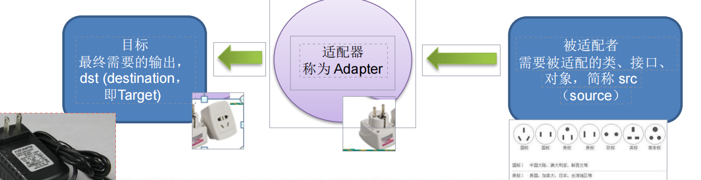

# 设计模式七大原则

单一职责原则


# UML类图


 


# 单例模式

# 工厂模式

# 原型模式

# 建造者模式

## 需求

1. 需要建房子：这一过程为打桩、砌墙、封顶

2. 房子有各种各样的，比如普通房，高楼，别墅，各种房子的过程虽然一样，但是要求不要相同的.

3) 请编写程序，完成需求.


## 传统方式


### 类图


### 代码

AbstractHouse.java

```java
public abstract class AbstractHouse {
    public abstract void buildBasic();
    public abstract void buildWall();
    public abstract void roofed();
    public void build(){
        buildBasic();
        buildWall();
        roofed();
    }
}
```

CommonHouse.java

```java
public class CommonHouse extends AbstractHouse{
    @Override
    public void buildBasic() {
        System.out.println("给普通房子打地基");
    }
    @Override
    public void buildWall() {
        System.out.println("给普通房子砌墙");
    }
    @Override
    public void roofed() {
        System.out.println("给普通房子封顶");
    }
}
```


Client.java

```java
public class Client {
    public static void main(String[] args) {
        CommonHouse commonHouse = new CommonHouse();
        commonHouse.build();
    }
}
```


## 优缺点

1. 优点是比较好理解，简单易操作。

2) 设计的程序结构，过于简单，没有设计缓存层对象，程序的扩展和维护不好. 也就是说，这种设计方案，把产品(即：房子) 和 创建产品的过程(即：建房子流程) 封装在一起，耦合性增强了。

3) 解决方案：将产品和产品建造过程解耦 => 建造者模式.


## 建造者模式

### 基本介绍

**1)** 建造者模式（Builder Pattern）又叫生成器模式，是一种对象构建模式。它可以将复杂对象的建造过程抽象出来（抽象类别），使这个抽象过程的不同实现方

法可以构造出不同表现（属性）的对象。

**2)** **建造者模式** 是一步一步创建一个复杂的对象，它允许用户只通过指定复杂对象的类型和内容就可以构建它们，用户不需要知道内部的具体构建细节。


### 四个角色

建造者模式的四个角色

**1) Product**（产品角色）：一个具体的产品对象。

**2) Builder**（抽象建造者）：*创建一个Product对象的各个部件指定的 接口/抽象类。

**3) ConcreteBuilder**（具体建造者）： 实现接口，构建和装配各个部件。

**4) Director**（指挥者）： 构建一个使用Builder接口的对象。它主要是用于创建一个复杂的对象。它主要有两个作用，

​	一是：隔离了客户与对象的生产过程

​	二是：负责控制产品对象的生产过程

### 类图


### 代码

**House.java   产品**

```java
public class House {
    private String basic;//地基
    private String wall;
    private String roof;
    public String getBasic() {
        return basic;
    }
    public void setBasic(String basic) {
        this.basic = basic;
    }
    public String getWall() {
        return wall;
    }
    public void setWall(String wall) {
        this.wall = wall;
    }
    public String getRoof() {
        return roof;
    }
    public void setRoof(String roof) {
        this.roof = roof;
    }

    @Override
    public String toString() {
        return "House{" +
                "basic='" + basic + '\'' +
                ", wall='" + wall + '\'' +
                ", roof='" + roof + '\'' +
                '}';
    }
}
```

**HouseBuilder.java 抽象建造者**

```java
public abstract class HouseBuilder {
    House house = new House();
    public abstract void buildBasic();
    public abstract void buildWall();
    public abstract void roof();
    public House build(){
        return house;
    }
}
```


**CommonHouse.java  具体建造者（取个CommonHouseBuilder更好些）**

```java
public class CommonHouse extends HouseBuilder{
    @Override
    public void buildBasic() {
        this.house.setBasic("普通地基");
    }
    @Override
    public void buildWall() {
        this.house.setWall("普通砌墙");
    }
    @Override
    public void roof() {
        this.house.setRoof("普通封顶");
    }
}
```


**HouseDirector.java 指挥者，组合了建造者，传进来什么类型的建造者就建造什么样的房子**

```java
public class HouseDirector {
    HouseBuilder houseBuilder;
    public HouseDirector(HouseBuilder houseBuilder) {
        this.houseBuilder = houseBuilder;
    }
    public House constructHouse(){
        houseBuilder.buildBasic();
        houseBuilder.buildWall();
        houseBuilder.roof();
        return houseBuilder.house;
    }
}
```

Client.java

```java
public class Client {
    public static void main(String[] args) {
        HouseDirector houseDirector = new HouseDirector(new CommonHouse());
        House house = houseDirector.constructHouse();
        System.out.println(house);
    }
}
```


# 适配器模式

## 基本介绍

1) 适配器模式(Adapter Pattern)将某个类的接口转换成客户端期望的另一个接口表示，主的目的是兼容性，让原本因接口不匹配不能一起工作的两个类可以协同

工作。其别名为包装器(Wrapper)

2) 适配器模式属于结构型模式

3) 主要分为三类：**类适配器模式、对象适配器模式、接口适配器模式**

## 工作原理

1. 适配器模式：将一个类的接口转换成另一种接口.让原本接口不兼容的类可以兼容

2. 从用户的角度看不到被适配者，是解耦的

3) 用户调用适配器转化出来的目标接口方法，适配器再调用被适配者的相关接方法

4) 用户收到反馈结果，感觉只是和目标接口交互，如图




## 类适配器模式

基本介绍：Adapter类，通过继承src类，实现dst 类接口，完成src->dst的适配。

### 举例

以生活中充电器的例子来讲解适配器，充电器本身相当于Adapter，220V交流电。相当于src (即被适配者)，我们的目dst(即目标)是5V直流电

### 类图


### 代码

Voltage220v.java  被适配类

```java
public class Voltage220v {
    public int output220v(){
        System.out.println("这是220v电压");
        return 220;
    }
}
```

Voltage5v 目标类

```java
public interface Voltage5v {
    public int output5v();
}
```

VoltageAdapter 适配器类

```java
public class VoltageAdapter extends Voltage220v implements Voltage5v{
    @Override
    public int output5v() {
        int src = output220v();
        int dst = src/44;//变压器变压
        System.out.println("转成5v电压...");
        return dst;
    }
}
```

使用者

```java
public class Phone {
    public void charge(Voltage5v voltage5v){
        if(voltage5v.output5v() == 5){
            System.out.println("可以充电....");
        }
    }
}
```

缺点：继承了src  被适配器类，不好

## 对象适配器模式

<font color="red">**使用关联关系，替代继承**</font>

### 类图


### 代码

只需要改适配器类

```java
public class VoltageAdapter implements Voltage5v{
    private Voltage220v voltage220v;
    public VoltageAdapter(Voltage220v voltage220v) {
        this.voltage220v = voltage220v;
    }
    @Override
    public int output5v() {
        int src = voltage220v.output220v();
        int dst = src/44;//变压器变压
        System.out.println("转成5v电压...");
        return dst;
    }
}
```


## 接口适配器模式

### 原理理解

**类适配器模式中，适配器是一个类，被适配的是类，适配器继承了被适配的类**

**对象适配器中，适配器也是一个类，被适配的是对象，适配器聚合了被适配类型的对象**
<font color="red">**接口适配器中，适配器是抽象类，被适配的是接口，适配器类继承了被适配的这个接口。但是因为是接口，并不是所有的方法都需要适配怎么办？那就是适配器类是一个抽象类，使用时候可以通过匿名内部类方式。**</font>

### 类图


### 代码

被适配的接口

```java
public interface BeAdaptedInterface {
    public void m1();
    public void m2();
    public void m3();
    public void m4();
}
```


适配器类，抽象类，默认实现所有的方法。没有方法内容

```java
public class AbstractAdapter implements BeAdaptedInterface{
    @Override
    public void m1() {}
    @Override
    public void m2() {}
    @Override
    public void m3() {}
    @Override
    public void m4() {}
}
```

目标其实就是这个匿名类创建的对象，只想适配m1就只重写m1方法，

```java
public class Client {
    public static void main(String[] args) {
        AbstractAdapter adapter = new AbstractAdapter() {
            @Override
            public void m1() {
                System.out.println("适配方法...");
            }
        };
        adapter.m1();
    }
}
```


# 桥接模式

## 需求


实现手机的多种款式和品牌。

## 传统方式


1. 扩展性问题(类爆炸)，如果我们再增加手机的样式(旋转式)，就需要增加各个品牌手机的类，同样如果我们增加一个手机品牌，也要在各个手机样式类下增加。

2) 违反了单一职责原则，当我们增加手机样式时，要同时增加所有品牌的手机，这样增加了代码维护成本.

3) 解决方案-使用桥接模式

## 桥接模式

### 基本介绍

1) 桥接模式(Bridge模式)是指：将**实现**与**抽象**放在两个不同的类层次中，使两个层次可以独立改变。

2) 是一种结构型设计模式

3) Bridge模式基于**类的最小设计原则**，通过使用封装、聚合及继承等行为让不同的类承担不同的职责。它的主要特点是把抽象(Abstraction)与行为实现

(Implementation)分离开来，从而可以保持各部分的独立性以及应对他们的功能扩展

### 类图

抽象版


1. Client类：桥接模式的调用者

2) 抽象类(Abstraction) :维护了 Implementor / 即它的实现类ConcreteImplementorA.., 二者是聚合关系, Abstraction 充当桥接类


具体版


### 代码

Brand.java 品牌 接口

```java
public interface Brand {
    public void call();
}
```

XiaoMi.java 具体品牌的手机

```java
public class XiaoMi implements Brand{
    @Override
    public void call() {
        System.out.println("XiaoMi手机call...");
    }
}
```

抽象手机，聚合了具体的品牌手机（品牌手机不是完整的手机，因为没有款式）

```java
public abstract class Phone {
    private Brand brand;
    public Phone(Brand brand) {
        this.brand = brand;
    }
    public void call(){
        this.brand.call();
    }
}
```

具体的完整的手机

```java
public class FoldPhone extends Phone{
    public FoldPhone(Brand brand) {
        super(brand);
    }

    @Override
    public void call() {
        super.call();
        System.out.println("这是折叠手机...");
    }
}
```

调用

```java
public class Client {
    public static void main(String[] args) {
        Phone foldPhone = new FoldPhone(new XiaoMi());
        foldPhone.call();
    }
}
```


**核心：Phone充当了桥的作用，调用Phone的call方法时候，实际调用的Brand类型手机的call方法。**

**实现方式 就是聚合。因为所有手机都有这样一个call方法，所以减少了类。只需要传入一个接口（父类）就行**

这样的方式，在添加新的手机品牌或者款式的时候都非常方便


# 装饰着模式

## 需求

星巴克咖啡订单项目（咖啡馆）：

1) 咖啡种类/单品咖啡：Espresso(意大利浓咖啡)、ShortBlack、LongBlack(美式咖啡)、Decaf(无因咖啡)

2) 调料：Milk、Soy(豆浆)、Chocolate

3) 要求在扩展**新的咖啡种类**时，具有良好的扩展性、改动方便、维护方便

4) 使用OO的来计算不同种类咖啡的费用客户可以点**单品咖啡**，也可以**单品**+**调料组合**。

## 类图


比如:装饰者模式下的订单：2份巧克力+一份牛奶的LongBlack


1) Milk包含了LongBlack

2) 一份Chocolate包含了(Milk+LongBlack)

3) 一份Chocolate包含了(Chocolate+Milk+LongBlack)

4) 这样不管是什么形式的单品咖啡+调料组合，通过递归方式可以方便的组合和维护。

<font color="red">就像包装一样，真正的东西放最里边儿，外面套多种多样的包装，包装也收钱。包装和物品具有公共特性（价格，描述属性）</font>

## 代码

Drink总的类，是装饰器和被装饰者的公共父类

```java
public abstract class Drink {
    public String des;
    public float price;
    public void setDes(String des) {
        this.des = des;
    }
    public void setPrice(float price) {
        this.price = price;
    }
    public String getDes() {
        return des;
    }
    public float getPrice() {
        return price;
    }
    public abstract float cost();
}
```

Coffe 加个缓冲，物品里不会有物品

```java
public class Coffe extends Drink{
    @Override
    public float cost() {
        return super.getPrice();
    }
}
```

具体的物品 咖啡

```java
public class LongBlackCoffe extends Coffe{
    public LongBlackCoffe() {
        setDes("LongBlackCoffe");
        setPrice(20.0f);
    }
}
```

Decorator装饰器，里面有物品的。**注意这里的计算细节**

```java
public class Decorator extends Drink{
    public Drink drink;
    public Decorator(Drink drink) {
        this.drink = drink;
    }
    @Override
    public float cost() {
        return getPrice()+drink.cost();
    }
}
```

巧克力装饰

```java
public class ChocolateDecorator extends Decorator{
    public ChocolateDecorator(Drink drink) {
        super(drink);
        setDes(drink.getDes() + "加巧克力");
        setPrice(5.00f);
    }
}
```

牛奶装饰

```java
public class MilkDecorator extends Decorator{
    public MilkDecorator(Drink drink) {
        super(drink);
        setDes(drink.getDes() + "加牛奶");
        setPrice(2.0f);
    }
}
```


Client  套娃

```java
public class Client {
    public static void main(String[] args) {
        MilkDecorator milkChocolateLongBlackCoffe = new MilkDecorator(new ChocolateDecorator(new LongBlackCoffe()));
        System.out.println(milkChocolateLongBlackCoffe.getDes());
        System.out.println(milkChocolateLongBlackCoffe.cost());
    }
}
```


# 组合模式

## 需求

编写程序展示一个学校院系结构：需求是这样，要在一个页面中展示出学校的院系组成，一个学校有多个学院，一个学院有多个系。如图：


## 介绍

1) 组合模式（Composite Pattern），又叫部分整体模式，它创建了对象组的树形结构，将对象组合成树状结构以表示“整体-部分”的层次关系。

2) 组合模式依据树形结构来组合对象，用来表示部分以及整体层次。

3) 这种类型的设计模式属于结构型模式。

4) 组合模式使得用户对单个对象和组合对象的访问具有一致性，**即**：组合能让客户以一致的方式处理个别对象以及组合对象


## 组合模式三个部分组成

1. Component :这是组合中对象声明接口，在适当情况下，实现所有类共有的接口默认行为，用于访问和管理Component子部件, Component可以是抽象类或者接口

2. Composite :非叶子节点，用于存储子部件，在Component接口中实现子部件的相关操作，比如增加(add)删除。

3. Leaf : 在组合中表示叶子节点，叶子节点没有子节点


## 类图


## 代码

公共父类 component组件（底下名字取错了）

```java
public abstract class OrgComposition {
    public String name;
    public String des;

    public OrgComposition(String name, String des) {
        this.name = name;
        this.des = des;
    }
    public String getName() {return name;}
    public void setName(String name) {this.name = name;}
    public String getDes() {return des;}
    public void setDes(String des) {this.des = des;}
    public void add(OrgComposition orgComposition){
        throw new UnsupportedOperationException();
    };
    public void delete(OrgComposition orgComposition){
        throw new UnsupportedOperationException();
    }
    public abstract void print();
}
```

University.java 大学  非叶节点

```java
public class University extends OrgComposition{
    public List<OrgComposition> orgCompositionList = new ArrayList<>();
    public University(String name, String des) {
        super(name, des);
    }
    @Override
    public void add(OrgComposition orgComposition) {
        orgCompositionList.add(orgComposition);
    }
    @Override
    public void delete(OrgComposition orgComposition) {
        orgCompositionList.remove(orgComposition);
    }
    @Override
    public void print() {
        System.out.println("=============" + this.getName()+"=============");
        orgCompositionList.forEach((e)->e.print());
    }
}
```

学院 非叶节点

```java
public class Colleage extends OrgComposition{
    public List<OrgComposition> orgCompositionList = new ArrayList<>();
    public Colleage(String name, String des) {
        super(name, des);
    }
    @Override
    public void add(OrgComposition orgComposition) {
        orgCompositionList.add(orgComposition);
    }
    @Override
    public void delete(OrgComposition orgComposition) {
        orgCompositionList.remove(orgComposition);
    }
    @Override
    public void print() {
        System.out.println("=============" + this.getName()+"=============");
        orgCompositionList.forEach((e)->e.print());
    }
}
```

专业 叶节点

```java
public class Department extends OrgComposition{
    public List<OrgComposition> orgCompositionList = new ArrayList<>();
    public Department(String name, String des) {
        super(name, des);
    }
    @Override
    public void print() {
        System.out.println(this.getName());
    }
}
```

Client客户端

```java
public class Client {
    public static void main(String[] args) {
        University university = new University("东华大学","原名中国纺织大学");
        Colleage colleage1 = new Colleage("计算机学院", "不咋滴的学院");
        Colleage colleage2 = new Colleage("纺织学院", "听起来nb的学院");
        Department department1 = new Department("计算机专业", "计算机");
        Department department2 = new Department("软件工程专业", "软件工程");
        Department department3 = new Department("卖衣服专业", "卖衣服");
        Department department4 = new Department("造衣服专业", "造衣服");
        university.orgCompositionList.add(colleage1);
        university.orgCompositionList.add(colleage2);
        colleage1.orgCompositionList.add(department1);
        colleage1.orgCompositionList.add(department2);
        colleage2.orgCompositionList.add(department3);
        colleage2.orgCompositionList.add(department4);
        university.print();
    }
}
```


## 总结

跟多叉树差不多，父节点包含子节点list, 只不过树是同一种类型，这里通过公共父类来实现，但是由于不同子类具有不同业务，所以不同层级可以有不同类型来实现，特有部分逻辑就可以隔离开来。


# 外观模式

## 需求


# 享元模式

## 需求

小型的外包项目，给客户A做一个产品展示网站，客户A的朋友感觉效果不错，也希望做这样的产品展示网站，但是要求都有些不同：

1) 有客户要求以新闻的形式发布

2) 有客户人要求以博客的形式发布

3) 有客户希望以微信公众号的形式发布

## 传统方案

直接复制粘贴一份，然后根据客户不同要求，进行定制修改。

需要的网站结构**相似度很高**，而且都不是高访问量网站，如果分成多个虚拟空间来处理，相当于一个相同网站的实例对象很多，造成服务器的资源浪费

解决思路：整合到一个网站中，共享其相关的代码和数据，对于硬盘、内存、CPU、数据库空间等服务器资源都可以达成共享，减少服务器资源，对于代码来说，由于是一份实例，维护和扩展都更加容易


## 享元模式基本介绍

1. 享元模式（Flyweight Pattern）: 运用共享技术有效地支持大量细粒度的对象

2) 常用于系统底层开发，解决系统的性能问题。像数据库连接池，里面都是创建好的连接对象，在这些连接对象中有我们需要的则直接拿来用，避免重新创建，如果没有我们需要的，则创建一个。

3) 享元模式能够解决**重复对象的内存浪费的问题**，当系统中有大量相似对象，需要缓冲池时。不需总是创建新对象，可以从缓冲池里拿。这样可以降低系统内存，同时提高效率

4) 享元模式**经典的应用场景**就是池技术了，String常量池、数据库连接池、缓冲池等等都是享元模式的应用，享元模式是池技术的重要实现方式

## 类图


这里包含了不共享的资源。

 

1. FlyWeight 是抽象的享元角色, 他是产品的抽象类, 同时定义出对象的外部状态和内部状态(后面介绍) 的接口或实现

2) ConcreteFlyWeight 是具体的享元角色，是具体的产品类，实现抽象角色定义相关业务

3) UnSharedConcreteFlyWeight 是不可共享的角色，一般不会出现在享元工厂
4) FlyWeightFactory 享元工厂类，用于构建一个池容器（可以是集合队列map，类似于缓存）。


## 内部状态和外部状态

比如围棋、五子棋、跳棋，它们都有大量的棋子对象，围棋和五子棋只有黑白两色，跳棋颜色多一点，所以棋子颜色就是棋子的内部状态；而各个棋子之间的差别就是位置的不同，当我们落子后，落子颜色是定的，但位置是变化的，所以棋子坐标就是棋子的外部状态

1) 享元模式提出了两个要求：细粒度和共享对象。这里就涉及到内部状态和外部状态了，即将对象的信息分为两个部分：**内部状态**和**外部状态**

2) **内部状态**指对象共享出来的信息，存储在享元对象内部且不会随环境的改变而改变

3) **外部状态**指对象得以依赖的一个标记，是随环境改变而改变的、不可共享的状态。

4) 举个例子：围棋理论上有361个空位可以放棋子，每盘棋都有可能有两三百个棋子对象产生，因为内存空间有限，一台服务器很难支持更多的玩家玩围棋游戏，如果用享元模式来处理棋子，那么棋子对象就可以减少到只有两个实例，这样就很好的解决了对象的开销问题


## 代码

例子的类图


抽象的享元角色

```java
public abstract class WebSite {
    public String type;
    public WebSite(String type) {
        this.type = type;
    }
    public abstract void use(User user);
}
```

具体的享元角色

```java
public class ConcreteWebsite extends WebSite{
    public ConcreteWebsite(String type) {
        super(type);
    }
    @Override
    public void use(User user) {
        System.out.println("用户:"+user.getName()+",使用了<"+type+">类型的网站...");
    }
}
```

不共享的角色（外部状态），一般不出现在享元工厂。

```java
public class User {
    private String name;
    public User(String name) {
        this.name = name;
    }
    public String getName() {
        return name;
    }
    public void setName(String name) {
        this.name = name;
    }
}
```

享元工厂类（根据内部状态获取享元角色）

```java
public class ConcreteWebsiteFactory {
    Map<String, ConcreteWebsite> map = new HashMap<>();
    public WebSite getConcreteWebsite(String type){
        if(!map.containsKey(type)){
            map.put(type,new ConcreteWebsite(type));
        }
        return (WebSite) map.get(type);
    }
}
```

client

```java
public class Client {
    public static void main(String[] args) {
        ConcreteWebsiteFactory concreteWebsiteFactory = new ConcreteWebsiteFactory();
        WebSite webSite = concreteWebsiteFactory.getConcreteWebsite("新闻版");
        webSite.use(new User("tom"));
        WebSite webSite1 = concreteWebsiteFactory.getConcreteWebsite("公众号版");
        webSite1.use(new User("tom1"));
    }
}
```

# 代理模式


# 模板模式


# 命令模式


# 访问者模式


# 迭代器模式


# 观察者模式


# 中介者模式


# 备忘录模式


# 解释器模式


# 状态模式


# 策略模式


# 职责链模式
