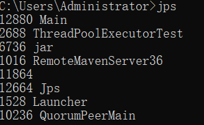
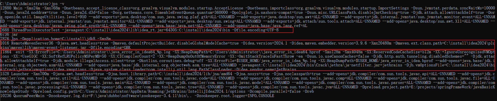
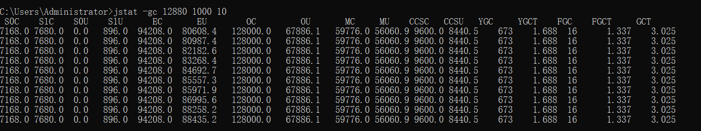
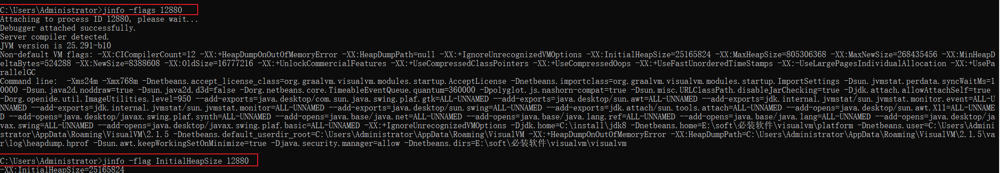

# jps:虚拟机进程状况工具 

| 参数 | 含义                                                     |
| :--: | :------------------------------------------------------- |
|  -q  | 只输出LVMID,省略主类的名称                               |
|  -m  | 输出虚拟机进程启动时传递给主类main()函数的参数           |
|  -l  | 输出主类的全名，如果进程执行的是jar包，则输出jar包全路径 |
|  -v  | 输出虚拟机进程启动时的JVM参数                            |

**jps:常用的就是直接输入jps 看哪个线程id。**




jps -v:




# jstat:虚拟机统计信息监视工具

jstat是用于监视虚拟机各种运行状态信息的命令行工具。它可以显示本地或者远程虚拟机进程中的**类加载、内存、垃圾收集、即时编译等运行时数据.**

命令格式：

```xml
jstat [ option vmid [interval[s|ms] [count]] ]
```


如:参数interval和count代表查询间隔和次数，如果省略这2个参数，说明只查询一次。假设需要每250毫秒查询一次进程2764垃圾收集状况，一共查询20次，那命令应当是

```xml
jstat -gc 12880 250 10
```



**S0C**: Survivor Space 0 Capacity, 表示 Survivor Space 0 的总容量（以字节为单位）。Survivor Spaces 是年轻代内存的一部分，GC 会在这些区域之间复制对象。

**S1C**: Survivor Space 1 Capacity,表示 Survivor Space 1 的总容量。

**S0U**: Survivor Space 0 Usage,表示 Survivor Space 0 的当前使用量（以字节为单位）。

**S1U**: Survivor Space 1 Usage,表示 Survivor Space 1 的当前使用量。

**EC**: Eden Space Capacity,表示 Eden 区域的总容量。Eden 区域是年轻代的一部分，GC 会在这里分配新创建的对象。

**EU**: Eden Space Usage,表示 Eden 区域的当前使用量。

**OC**: Old Gen Capacity,表示老年代（Old Generation）的总容量。老年代用于存储经过多次 GC 仍然存活的对象。

**OU**: Old Gen Usage,表示老年代的当前使用量。

**MC**: Metaspace Capacity,表示 Metaspace 的总容量。Metaspace 用于存储类的元数据。

**MU**: Metaspace Usage,表示 Metaspace 的当前使用量。

**CCSC**: Compressed Class Space Capacity,表示压缩类空间（Compressed Class Space）的总容量。它用于存储类元数据的压缩信息（在使用压缩指针时）。

**CCSU**: Compressed Class Space Usage,表示压缩类空间的当前使用量。

**YGC**: Young Generation GC Count,表示年轻代发生垃圾回收的次数。

**YGCT**: Young Generation GC Time,表示年轻代垃圾回收所花费的总时间（以毫秒为单位）。

**FGC**: Full GC Count,表示老年代（或整个堆）发生完全垃圾回收（Full GC）的次数。

**FGCT**: Full GC Time,表示完全垃圾回收所花费的总时间（以毫秒为单位）。

**GCT**: Total GC Time,表示所有垃圾回收（包括年轻代 GC 和完全 GC）所花费的总时间（以毫秒为单位）。


常见参数

| 选项              | 作用                                                       |
| ----------------- | :--------------------------------------------------------- |
| -class            | 监视类加载、卸载数量、总空间 以及类装载所耗费的时间        |
| -gc               | 监视java堆状况，包括容量，已用空间，收集时间等信息         |
| -gccapcity        | 内容与gc基本相同，但输出关注各个区域使用到的最大与最小空间 |
| -gcutil           | 内容与-gc基本相同，但是关注已使用空间百分比                |
| -gccause          | 与-gcutil一样，但是额外输出上一次垃圾收集产生的原因        |
| -gcnew            | 监视新生代                                                 |
| -gcnewcapcity     | 与-gcnew一样，但是关注使用到的最大、最小空间               |
| -gcold            | 监视老年代                                                 |
| -gcoldcapcity     | 关注使用到的最大、最小空间                                 |
| -gcpermcapcity    | 监视永生代                                                 |
| -compiler         | 输出即时编译器编译过的方法、耗时信息                       |
| -printcompilation | 输出已经被即时编译的方法                                   |


# jinfo:Java配置信息工具 

jinfo（Configuration Info for Java）的作用是实时查看和调整虚拟机各项参数。使用jps命令的-v参数可以查看虚拟机启动时显式指定的参数列表，但如果想知道未被显式指定的参数的系统默认值，除了去找资料外，就只能使用jinfo的-flag选项进行查询了

命令格式：

```xml
jinfo [ option ] pid
```

例如：

```xml
jinfo -flags 12880
jinfo -flag InitialHeapSize 12880
```




```text
Attaching to process ID 12880, please wait...
Debugger attached successfully.
Server compiler detected.
JVM version is 25.291-b10
Non-default VM flags: -XX:CICompilerCount=12 -XX:+HeapDumpOnOutOfMemoryError -XX:HeapDumpPath=null -XX:+IgnoreUnrecognizedVMOptions -XX:InitialHeapSize=25165824 -XX:MaxHeapSize=805306368 -XX:MaxNewSize=268435456 -XX:MinHeapDeltaBytes=524288 -XX:NewSize=8388608 -XX:OldSize=16777216 -XX:+UnlockCommercialFeatures -XX:+UseCompressedClassPointers -XX:+UseCompressedOops -XX:+UseFastUnorderedTimeStamps -XX:-UseLargePagesIndividualAllocation -XX:+UseParallelGC
Command line:  -Xms24m -Xmx768m -Dnetbeans.accept_license_class=org.graalvm.visualvm.modules.startup.AcceptLicense -Dnetbeans.importclass=org.graalvm.visualvm.modules.startup.ImportSettings -Dsun.jvmstat.perdata.syncWaitMs=10000 -Dsun.java2d.noddraw=true -Dsun.java2d.d3d=false -Dorg.netbeans.core.TimeableEventQueue.quantum=360000 -Dpolyglot.js.nashorn-compat=true -Dsun.misc.URLClassPath.disableJarChecking=true -Djdk.attach.allowAttachSelf=true -Dorg.openide.util.ImageUtilities.level=950 --add-exports=java.desktop/com.sun.java.swing.plaf.gtk=ALL-UNNAMED --add-exports=java.desktop/sun.awt=ALL-UNNAMED --add-exports=jdk.internal.jvmstat/sun.jvmstat.monitor.event=ALL-UNNAMED --add-exports=jdk.internal.jvmstat/sun.jvmstat.monitor=ALL-UNNAMED --add-exports=java.desktop/sun.swing=ALL-UNNAMED --add-exports=jdk.attach/sun.tools.attach=ALL-UNNAMED --add-opens=java.desktop/sun.awt.X11=ALL-UNNAMED --add-opens=java.desktop/javax.swing.plaf.synth=ALL-UNNAMED --add-opens=java.base/java.net=ALL-UNNAMED --add-opens=java.base/java.lang.ref=ALL-UNNAMED --add-opens=java.base/java.lang=ALL-UNNAMED --add-opens=java.desktop/javax.swing=ALL-UNNAMED --add-opens=java.desktop/javax.swing.plaf.basic=ALL-UNNAMED -XX:+IgnoreUnrecognizedVMOptions -Djdk.home=C:\install\jdk8 -Dnetbeans.home=E:\soft\必装软件\visualvm\platform -Dnetbeans.user=C:\Users\Administrator\AppData\Roaming\VisualVM\2.1.5 -Dnetbeans.default_userdir_root=C:\Users\Administrator\AppData\Roaming\VisualVM -XX:+HeapDumpOnOutOfMemoryError -XX:HeapDumpPath=C:\Users\Administrator\AppData\Roaming\VisualVM\2.1.5\var\log\heapdump.hprof -Dsun.awt.keepWorkingSetOnMinimize=true -Djava.security.manager=allow -Dnetbeans.dirs=E:\soft\必装软件\visualvm\visualvm
```


# jmap:Java内存映像工具

jmap的作用并不仅仅是为了获取堆转储快照，它还可以查询finalize执行队列、Java堆和方法区的详细信息，如空间使用率、当前用的是哪种收集器等。

命令格式

```xml
jmap [ option ] vmid 
```


|      选项      | 作用                                                         |
| :------------: | ------------------------------------------------------------ |
|     -dump      | 生成java堆转储快照，格式：-dump:[live,] format=b,file=<filename>, live参数说明是否只dump出存活的对象 |
| -finalizerinfo | 显示F-Queue中等待Filnalizer线程执行finalize方法的对象        |
|     -heap      | 显示堆详细信息，如：哪种收集器，参数配置，分代状况           |
|     -histo     | 显示及堆中对象统计信息，如：类、实例数量、合计容量           |
|   -permstat    | 以ClassLoader为统计口径显示永久代内存状态                    |
|       -F       | -dump没响应时，强制生成dump快照                              |


# jstack:Java堆栈跟踪工具 

jstack（Stack Trace for Java）命令用于生成虚拟机当前时刻的线程快照（一般称为threaddump或者javacore文件）。线程快照就是当前虚拟机内每一条线程正在执行的方法堆栈的集合，生成线程快照的目的通常是定位线程出现长时间停顿的原因，如线程间死锁、死循环、请求外部资源导致的长时间挂起等，都是导致线程长时间停顿的常见原因。线程出现停顿时通过jstack来查看各个线程的调用堆栈，就可以获知没有响应的线程到底在后台做些什么事情，或者等待着什么资源。

命令格式

```xml
jstack [ option ] vmid
```

| 选项 | 作用                              |
| :--: | --------------------------------- |
|  -F  | 没响应时强制输出线程堆栈          |
|  -l  | 除堆栈信息，额外显示锁的附加信息  |
|  -m  | 如果调用本地方法，可以显示C++堆栈 |


# jconsole


