# <font color='#096ec2'>第一部分：自动内存管理</font>

# <font color='#096ec2'>Java内存区域与内存溢出异常</font>

## <font color='#096ec2'>运行时数据区域</font>

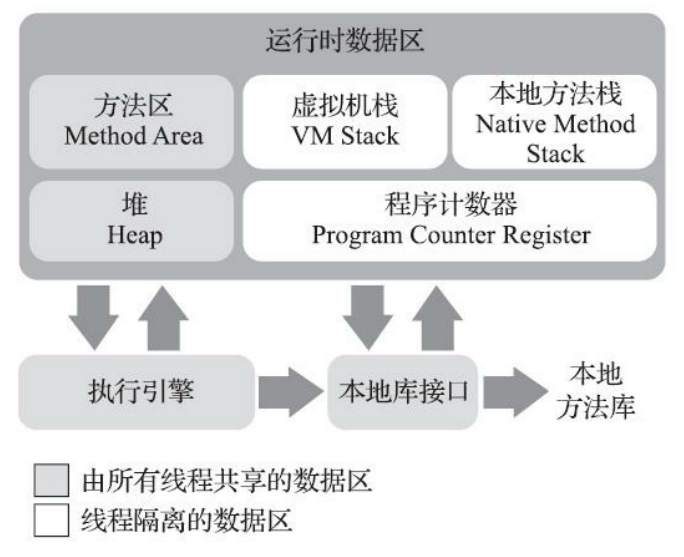


### <font color='#096ec2'>程序计数器</font>

​		程序计数器（Program Counter Register）是一块较小的内存空间，它可以看作是当前线程所执行的字节码的**行号指示器**。在Java虚拟机的概念模型里[1]，字节码解释器工作时就是通过改变这个计数器的值来选取下一条需要执行的字节码指令，它是程序控制流的指示器，**分支、循环、跳转、异常处理、线程恢复**等基础功能都需要依赖这个计数器来完成。

特点：

- 线程私有

- 如果线程正在执行的是一个Java方法，这个计数器记录的是正在执行的虚拟机字节码指令的地址；

- 如果正在执行的是本地（Native）方法，这个计数器值则应为空（Undefined）。

- 此内存区域是唯一一个在《Java虚拟机规范》中没有规定任何OutOfMemoryError情况的区域。


### <font color='#096ec2'>Java虚拟机栈</font>

​		虚拟机栈描述的是Java方法执行的线程内存模型：每个方法被执行的时候，Java虚拟机都会同步创建一个栈帧[1]（Stack Frame）用于存储**局部变量表、操作数栈、动态连接、方法出口**等信息。每一个方法被调用直至执行完毕的过程，就对应着一个栈帧在虚拟机栈中从入栈到出栈的过程。

​		**局部变量表**存放了编译期可知的各种Java虚拟机基本数据类型（boolean、byte、char、short、int、float、long、double）、**对象引用**（reference类型，**它并不等同于对象本身**，可能是一个指向对象起始地址的引用指针，也可能是指向一个代表对象的句柄或者其他与此对象相关的位置）和returnAddress类型（指向了一条字节码指令的地址）。

 

### <font color='#096ec2'>本地方法栈</font>

​		本地方法栈（Native Method Stacks）与虚拟机栈所发挥的作用是非常相似的，其区别只是虚拟机栈为虚拟机执行Java方法（也就是字节码）服务，而本地方法栈则是为虚拟机使用到的本地（Native）方法服务。


### <font color='#096ec2'>Java堆</font>

​		Java堆（Java Heap）是虚拟机所管理的内存中**最大的一块**。Java堆是被所有**线程共享**的一块内存区域，**在虚拟机启动时创建**。此内存区域的唯一目的就是存放**对象实例**，Java世界里“几乎”所有的对象实例都在这里分配内存。在《Java虚拟机规范》中对Java堆的描述是：“所有的**对象实例以及数组**都应当在堆上分配”。


### <font color='#096ec2'>方法区</font>

​		方法区（Method Area）与Java堆一样，是各个线程共享的内存区域，它用于存储已被虚**拟机加载的类信息、常量、静态变量、即时编译器编译后的代码缓存**等数据。虽然《Java虚拟机规范》中把方法区描述为堆的一个逻辑部分，但是它却有一个别名叫作“非堆”（Non-Heap），目的是与Java堆区分开来。


### <font color='#096ec2'>运行时常量池</font>

​		**运行时常量池（Runtime Constant Pool）是方法区的一部分**。Class文件中除了有类的版本、字段、方法、接口等描述信息外，还有一项信息是**常量池表**（Constant Pool Table），**用于存放编译期生成的各种字面量与符号引用**，这部分内容将在类加载后存放到方法区的运行时常量池中。

​		运行时常量池相对于Class文件常量池的另外一个重要特征是具备动态性，**Java语言并不要求常量一定只有编译期才能产生**，也就是说，并非预置入Class文件中常量池的内容才能进入方法区运行时常量池，**运行期间也可以将新的常量放入池中**，这种特性被开发人员利用得比较多的便是String类的**intern()**方法。


### <font color='#096ec2'>直接内存</font>

​		**直接内存（Direct Memory）并不是虚拟机运行时数据区的一部分，也不是《Java虚拟机规范》中定义的内存区域。**但是这部分内存也被频繁地使用，而且也可能导致OutOfMemoryError异常出现，所以我们放到这里一起讲解。

​		在JDK 1.4中新加入了NIO（New Input/Output）类，<u>引入了一种基于通道（Channel）与缓冲区（Buffer）的I/O方式，它可以使用Native函数库直接分配堆外内存，然后通过一个存储在Java堆里面的DirectByteBuffer对象作为这块内存的引用进行操作。</u>这样能在一些场景中显著提高性能，因为避免了在Java堆和Native堆中来回复制数据。

​		显然，本机直接内存的分配不会受到Java堆大小的限制，但是，既然是内存，则肯定还是会受到本机总内存（包括物理内存、SWAP分区或者分页文件）大小以及处理器寻址空间的限制，一般服务器管理员配置虚拟机参数时，会根据实际内存去设置-Xmx等参数信息，但经常忽略掉直接内存，使得各个内存区域总和（**java运行时内存+直接内存**）大于物理内存限制（包括物理的和操作系统级的限制），从而导致动态扩展时出现OutOfMemoryError异常。


## <font color='#096ec2'>Hotspot虚拟机对象揭密</font>

### <font color='#096ec2'>对象的创建</font>

​		文中讨论的对象限于普通Java对象，不包括数组和Class对象等。

​		当Java虚拟机遇到一条字节码new指令时，首先将去检查这个指令的参数是否能在常量池中定位到一个类的符号引用，并且检查这个符号引用代表的类是否已被加载、解析和初始化过。如果没有，那必须先执行相应的类加载过程，本书第7章将探讨这部分细节。

1. 划分空间：指针碰撞 vs 空闲列表

​		在类加载检查通过后，接下来虚拟机将为新生对象分配内存。对象所需内存的大小在类加载完成后便可完全确定（如何确定将在2.3.2节中介绍），为对象分配空间的任务实际上便等同于把一块确定大小的内存块从Java堆中划分出来。假设Java堆中内存是绝对规整的，所有被使用过的内存都被放在一边，空闲的内存被放在另一边，中间放着一个指针作为分界点的指示器，那所分配内存就仅仅是把那个指针向空闲空间方向挪动一段与对象大小相等的距离，这种分配方式称为“指针碰撞”（Bump The Pointer）。但如果Java堆中的内存并不是规整的，已被使用的内存和空闲的内存相互交错在一起，那就没有办法简单地进行指针碰撞了，虚拟机就必须维护一个列表，记录上哪些内存块是可用的，在分配的时候从列表中找到一块足够大的空间划分给对象实例，并更新列表上的记录，这种分配方式称

为“空闲列表”（Free List）。选择哪种分配方式由Java堆是否规整决定，而Java堆是否规整又由所采用的垃圾收集器是否带有空间压缩整理（Compact）的能力决定。因此，当使用Serial、ParNew等带压缩整理过程的收集器时，系统采用的分配算法是指针碰撞，既简单又高效；而当使用CMS这种基于清除（Sweep）算法的收集器时，理论上[1]就只能采用较为复杂的空闲列表来分配内存。

2. 分配空间的线程安全问题：同步 vs 线程隔离

​		对象创建在虚拟机中是非常频繁的行为，即使仅仅修改一个指针所指向的位置，在并发情况下也并不是线程安全的，可能出现正在给对象A分配内存，指针还没来得及修改，对象B又同时使用了原来的指针来分配内存的情况。解决这个问题有两种可选方案：一种是对分配内存空间的动作进行同步处理——实际上虚拟机是采用CAS配上失败重试的方式保证更新操作的原子性；另外一种是把内存分配的动作按照线程划分在不同的空间之中进行，即每个线程在Java堆中预先分配一小块内存，称为本地线程分配缓冲（Thread Local AllocationBuffer，TLAB），哪个线程要分配内存，就在哪个线程的本地缓冲区中分配，只有本地缓冲区用完了，分配新的缓存区时才需要同步锁定。虚拟机是否使用TLAB，可以通过-XX：+/-UseTLAB参数来设定。

3. 初始化零值，设置对象头

​		内存分配完成之后，虚拟机必须将分配到的内存空间（但不包括对象头）都初始化为零值，如果使用了TLAB的话，这一项工作也可以提前至TLAB分配时顺便进行。这步操作保证了对象的实例字段在Java代码中可以不赋初始值就直接使用，使程序能访问到这些字段的数据类型所对应的零值。接下来，Java虚拟机还要对对象进行必要的设置，例如这个对象是哪个类的实例、如何才能找到类的元数据信息、对象的哈希码（实际上对象的哈希码会延后到真正调用Object::hashCode()方法时才计算）、对象的GC分代年龄等信息。这些信息存放在对象的对象头（Object Header）之中。根据虚拟机当前运行状态的不同，如是否启用偏向锁等，对象头会有不同的设置方式。关于对象头的具体内容，稍后会详细介绍。

4. 执行init方法，初始化对象。

​		在上面工作都完成之后，从虚拟机的视角来看，一个新的对象已经产生了。但是从Java程序的视角看来，对象创建才刚刚开始——构造函数，即Class文件中的<init>()方法还没有执行，所有的字段都为默认的零值，对象需要的其他资源和状态信息也还没有按照预定的意图构造好。一般来说（由字节码流中new指令后面是否跟随invokespecial指令所决定，Java编译器会在遇到new关键字的地方同时生成这两条字节码指令，但如果直接通过其他方式产生的则不一定如此），new指令之后会接着执行<init>()方法，按照程序员的意愿对对象进行初始化，这样一个真正可用的对象才算完全被构造出来。


### <font color='#096ec2'>对象的内存布局</font>

​		对象在堆内存中的存储布局可以划分为三个部分：

- 对象头（Header）：的对象头部分包括两类信息
  - 第一类是用于存储**对象自身的运行时数据**，如**哈希码（HashCode）、GC分代年龄、锁状态标志、线程持有的锁、偏向线程ID、偏向时间戳**等，这部分数据的长度在32位和64位的虚拟机（未开启压缩指针）中分别为32个比特和64个比特，官方称它为“**Mark Word**”。对象需要存储的运行时数据很多，其实已经超出了32、64位Bitmap结构所能记录的最大限度，但对象头里的信息是与对象自身定义的数据无关的额外存储成本，考虑到虚拟机的空间效率，**Mark Word被设计成一个有着动态定义的数据结构**，以便在极小的空间内存储尽量多的数据，根据对象的状态复用自己的存储空间。
  - 第二类是**类型指针，即对象指向它的类型元数据的指针，Java虚拟机通过这个指针来确定该对象是哪个类的实例。**并不是所有的虚拟机实现都必须在对象数据上保留类型指针，换句话说，查找对象的元数据信息并不一定要经过对象本身。此外，如果对象是一个Java数组，那在对象头中还必须有一块用于记录数组长度的数据，因为虚拟机可以通过普通Java对象的元数据信息确定Java对象的大小，但是如果数组的长度是不确定的，将无法通过元数据中的信息推断出数组的大小。
- 实例数据（Instance Data）
  - 实例数据部分是对象真正存储的有效信息，即我们在程序代码里面所定义的各种类型的字段内容，**无论是从父类继承下来的，还是在子类中定义的字段都必须记录起来。**这部分的存储顺序会受到虚拟机分配策略参数（-XX：FieldsAllocationStyle参数）和字段在Java源码中定义顺序的影响。HotSpot虚拟机默认的分配顺序为longs/doubles、ints、shorts/chars、bytes/booleans、oops（OrdinaryObject Pointers，OOPs），从以上默认的分配策略中可以看到，相同宽度的字段总是被分配到一起存放，在满足这个前提条件的情况下，在父类中定义的变量会出现在子类之前。
- 对齐填充（Padding）
  - **仅仅起着占位符的作用**。由于HotSpot虚拟机的自动内存管理系统要求对象起始地址必须是8字节的整数倍，换句话说就是任何对象的大小都必须是8字节的整数倍。对象头部分已经被精心设计成正好是8字节的倍数（1倍或者2倍），因此如果对象实例数据部分没有对齐的话，就需要通过对齐填充来补全。

### <font color='#096ec2'>对象的访问定位</font>

​		Java程序会通过**栈上的reference数据来**操作堆上的具体对象。由于reference类型在《Java虚拟机规范》里面只规定了它是一个指向对象的引用，并没有定义

这个引用应该通过什么方式去定位、访问到堆中对象的具体位置，所以对象访问方式也是由虚拟机实现而定的，主流的访问方式主要有使用**句柄**和**直接指针**两种：

- 句柄访问：Java堆中将可能会划分出一块内存来作为句柄池，reference中存储的就是对象的句柄地址，而句柄中包含了对象实例数据与类型数据各自具体的地址信息
- 直接指针访问：Java堆中对象的内存布局就必须考虑如何放置访问类型数据的相关信息，reference中存储的直接就是对象地址，如果只是访问对象本身的话，就不需要多一次间接访问的开销

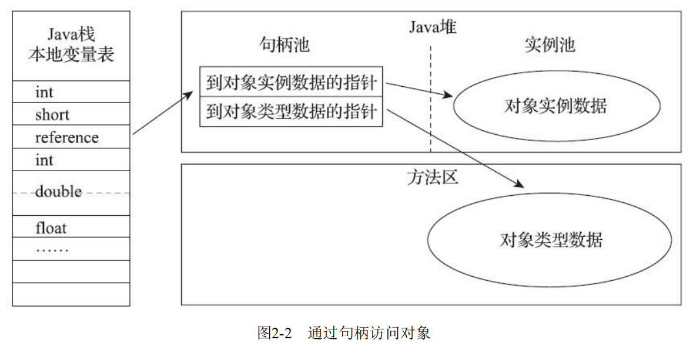


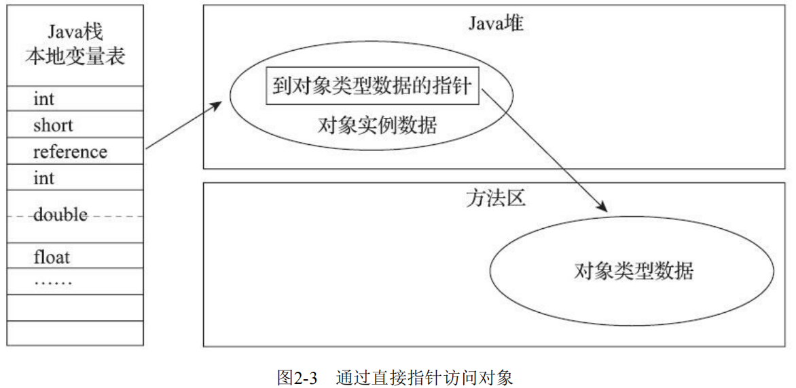

优劣势对比：

- 句柄访问：reference中存储的是稳定句柄地址，在对象被移动（垃圾收集时移动对象是非常普遍的行为）时只会改变句柄中的实例数据指针，而

  reference本身不需要被修改。

- 直接指针访问：好处就是速度更快，它节省了一次指针定位的时间开销，由于对象访问在Java中非常频繁，因此这类开销积少成多也是一项极为可观的执行成本

## <font color='#096ec2'>实战：OutOfMemory异常</font>

### <font color='#096ec2'>Java堆溢出</font>

```java
import java.util.ArrayList;

/**
 * 中代码限制Java堆的大小为20MB，不可扩展（将堆的最小值-Xms参数与最大值-Xmx参数设置为一样即可避免堆自动扩展），
 * 通过参数- XX:+HeapDumpOnOutOfMemoryError可以让虚拟机在出现内存溢出异常时Dump出当前的内存堆转储快照以便事后进行分析
 */
public class HeapOOM {
    static class OOMObject{
    }
    public static void main(String[] args) {
        ArrayList<OOMObject> oomObjects = new ArrayList<>();
        while (true){
            oomObjects.add(new OOMObject());
        }
    }
}
```

运行结果：

```error
java.lang.OutOfMemoryError: Java heap space
Dumping heap to java_pid3404.hprof ...
Heap dump file created [22045981 bytes in 0.663 secs]
```


排查方式：

​		要解决这个内存区域的异常，常规的处理方法是首先通过内存映像分析工具（如Eclipse Memory Analyzer）对Dump出来的堆转储快照进行分析。第一步首先应确认内存中导致OOM的对象是否是必要的，也就是要先分清楚到底是出现了内存泄漏（Memory Leak）还是内存溢出（Memory Overflow）。

- 如果是内存泄漏，可进一步通过工具查看泄漏对象到GC Roots的引用链，找到泄漏对象是通过怎样的引用路径、与哪些GC Roots相关联，才导致垃圾收集器无法回收它们，根据泄漏对象的类型信息以及它到GC Roots引用链的信息，一般可以比较准确地定位到这些对象创建的位置，进而找出产生内存泄漏的代码的具体位置。
- 如果不是内存泄漏，换句话说就是内存中的对象确实都是必须存活的，那就应当检查Java虚拟机的堆参数（-Xmx与-Xms）设置，与机器的内存对比，看看是否还有向上调整的空间。再从代码上检查是否存在某些对象生命周期过长、持有状态时间过长、存储结构设计不合理等情况，尽量减少程序运行期的内存消耗。

### <font color='#096ec2'>虚拟机栈和本地方法栈溢出</font>

1. 如果线程请求的栈深度大于虚拟机所允许的最大深度，将抛出StackOverflowError异常。
2. 如果虚拟机的栈内存允许动态扩展，当扩展栈容量无法申请到足够的内存时，将抛出OutOfMemoryError异常。

​		《Java虚拟机规范》明确允许Java虚拟机实现自行选择是否支持栈的动态扩展，**而HotSpot虚拟机的选择是不支持扩展，所以除非在创建线程申请内存时就因无法获得足够内存而出现OutOfMemoryError异常，否则在线程运行时是不会因为扩展而导致内存溢出的**，只会因为栈容量无法容纳新的栈帧而导致StackOverflowError异常。

```java
//-Xss 128k
public class JavaVMStackSOF {
    private int stackLength = 1;

    public void stackLeak() {
        stackLength++;
        stackLeak();
    }

    public static void main(String[] args) throws Throwable {
        JavaVMStackSOF oom = new JavaVMStackSOF();
        try {
            oom.stackLeak();
        } catch (Throwable e) {
            System.out.println("stack length:" + oom.stackLength);
            throw e;
        }
    }
}
```

运行结果：

```error
stack length:2402
Exception in thread "main" java.lang.StackOverflowError
at org.fenixsoft.oom. JavaVMStackSOF.leak(JavaVMStackSOF.java:20)
at org.fenixsoft.oom. JavaVMStackSOF.leak(JavaVMStackSOF.java:21)
at org.fenixsoft.oom. JavaVMStackSOF.leak(JavaVMStackSOF.java:21)
```

### <font color='#096ec2'>方法区和运行时常量池溢出</font>

​		由于运行时常量池是方法区的一部分，所以这两个区域的溢出测试可以放到一起进行。前面曾经提到HotSpot从JDK 7开始逐步“去永久代”的计划，并在JDK 8中完全使用元空间来代替永久代的背景故事，在此我们就以测试代码来观察一下，使用“永久代”还是“元空间”来实现方法区，对程序有什么实际的影响。

​		**String::intern()是一个本地方法，它的作用是如果字符串常量池中已经包含一个等于此String对象的字符串，则返回代表池中这个字符串的String对象的引用；否则，会将此String对象包含的字符串添加到常量池中，并且返回此String对象的引用。**在JDK 6或更早之前的HotSpot虚拟机中，常量池都是分配在永久代中，我们可以通过-XX：PermSize和-XX：MaxPermSize限制永久代的大小，即可间接限制其中常量池的容量，具体实现如代码所示，请读者测试时首先以<font color='red'>**JDK 6**</font>来运行代码

```java
public class RuntimeConstantPoolOOM {
    public static void main(String[] args) { //使用List保持着常量池引用，避免Full GC回收常量池行为
        List<String> list = new ArrayList<String>();
        //10MB的PermSize在integer范围内足够产生OOM了
        int i = 0;
        while (true) {
            list.add(String.valueOf(i++).intern());
        }
    }
}
```

运行结果：

```error
Exception in thread "main" java.lang.OutOfMemoryError: PermGen space
at java.lang.String.intern(Native Method)
at org.fenixsoft.oom.RuntimeConstantPoolOOM.main(RuntimeConstantPoolOOM.java: 18)
```

​		而使用<font color='red'>**JDK 7或更高版本的JDK**</font>来运行这段程序并不会得到相同的结果，无论是在JDK 7中继续使用-XX：MaxPermSize参数或者在JDK 8及以上版本使用-XX：MaxMeta-spaceSize参数把方法区容量同样限制在6MB，也都不会重现JDK 6中的溢出异常，循环将一直进行下去，永不停歇[1]。出现这种变化，是因为自JDK 7起，原本存放在永久代的字符串常量池被移至Java堆之中，所以在JDK 7及以上版本，限制方法区的容量对该测试用例来说是毫无意义的。这时候使用-Xmx参数限制最大堆到6MB就能够看到以下两种运行结果之一，具体取决于哪里的对象分配时产生了溢出：

```error
// OOM异常一：
Exception in thread "main" java.lang.OutOfMemoryError: Java heap space
at java.base/java.lang.Integer.toString(Integer.java:440)
at java.base/java.lang.String.valueOf(String.java:3058)
at RuntimeConstantPoolOOM.main(RuntimeConstantPoolOOM.java:12)
// OOM异常二：
Exception in thread "main" java.lang.OutOfMemoryError: Java heap space
at java.base/java.util.HashMap.resize(HashMap.java:699)
at java.base/java.util.HashMap.putVal(HashMap.java:658)
at java.base/java.util.HashMap.put(HashMap.java:607)
at java.base/java.util.HashSet.add(HashSet.java:220)
at RuntimeConstantPoolOOM.main(RuntimeConstantPoolOOM.java from InputFile-Object:14)
```

### <font color='#096ec2'>本机直接内存溢出</font>

​		直接内存（Direct Memory）的容量大小可通过-XX：MaxDirectMemorySize参数来指定，如果不去指定，则默认与Java堆最大值（由-Xmx指定）一致，代码清单2-10越过了DirectByteBuffer类直接通过反射获取Unsafe实例进行内存分配（Unsafe类的getUnsafe()方法指定只有引导类加载器才会返回实例，体现了设计者希望只有虚拟机标准类库里面的类才能使用Unsafe的功能，在JDK 10时才将Unsafe的部分功能通过VarHandle开放给外部使用），因为虽然使用DirectByteBuffer分配内存也会抛出内存溢出异常，但它抛出异常时并没有真正向操作系统申请分配内存，而是通过计算得知内存无法分配就会在代码里手动抛出溢出异常，真正申请分配内存的方法是Unsafe::allocateMemory()。

```java
public class DirectMemoryOOM {
    private static final int _1MB = 1024 * 1024;
    public static void main(String[] args) throws Exception {
        Field unsafeField = Unsafe.class.getDeclaredFields()[0];
        unsafeField.setAccessible(true);
        Unsafe unsafe = (Unsafe) unsafeField.get(null);
        while (true) {
            unsafe.allocateMemory(_1MB);
        }
    }
}
```

运行结果：

```error
Exception in thread "main" java.lang.OutOfMemoryError
at sun.misc.Unsafe.allocateMemory(Native Method)
at org.fenixsoft.oom.DMOOM.main(DMOOM.java:20)
```


# <font color='#096ec2'>垃圾收集器与内存分配策略</font>

## <font color='#096ec2'>对象已死？</font>

​		在堆里面存放着Java世界中几乎所有的对象实例，垃圾收集器在对堆进行回收前，第一件事情就是要确定这些对象之中哪些还“存活”着，哪些已经“死去”（“死去”即不可能再被任何途径使用的对象）了。

### <font color='#096ec2'>引用计数算法</font>

​		在对象中添加一个引用计数器，每当有一个地方引用它时，计数器值就加一；当引用失效时，计数器值就减一；任何时刻计数器为零的对象就是不可能再被使用的。

缺陷：

​		对象objA和objB都有字段instance，赋值令objA.instance=objB及objB.instance=objA，除此之外，这两个对象再无任何引用，实际上这两个对象已

经不可能再被访问，但是它们因为互相引用着对方，导致它们的引用计数都不为零，引用计数算法也就无法回收它们。

```java
public class ReferenceCountingGC {
    public Object instance = null;
    private static final int _1MB = 1024 * 1024;
    /**
     * 这个成员属性的唯一意义就是占点内存，以便能在GC日志中看清楚是否有回收过
     */
    private byte[] bigSize = new byte[2 * _1MB];
    public static void testGC() {
        ReferenceCountingGC objA = new ReferenceCountingGC();
        ReferenceCountingGC objB = new ReferenceCountingGC();
        objA.instance = objB;
        objB.instance = objA;
        objA = null;
        objB = null;
// 假设在这行发生GC，objA和objB是否能被回收？
        System.gc();
    }
    public static void main(String[] args) {
        new ReferenceCountingGC().testGC();
    }
}
```

运行日志：

```text
Java HotSpot(TM) 64-Bit Server VM (25.131-b11) for windows-amd64 JRE (1.8.0_131-b11), built on Mar 15 2017 01:23:53 by "java_re" with MS VC++ 10.0 (VS2010)
Memory: 4k page, physical 67019768k(51629000k free), swap 69641208k(44811884k free)
CommandLine flags: -XX:InitialHeapSize=1072316288 -XX:MaxHeapSize=17157060608 -XX:+PrintGC -XX:+PrintGCTimeStamps -XX:+UseCompressedClassPointers -XX:+UseCompressedOops -XX:-UseLargePagesIndividualAllocation -XX:+UseParallelGC 
0.106: [GC (System.gc())  19824K->992K(1005056K), 0.0007647 secs]
0.106: [Full GC (System.gc())  992K->660K(1005056K), 0.0038862 secs]
```

​		虚拟机参数：`-verbose:gc -Xloggc:F:\java\jvm\other\gc.log `

​		19824K->992K(1005056K)意味着虚拟机并没有因为这两个对象互相引用就放弃回收它们，这也从侧面说明了Java虚拟机并不是通过引用计数算法来判断对象

是否存活的。

### <font color='#096ec2'>可达性分析算法</font>

​		这个算法的基本思路就是通过一系列称为“GC Roots”的根对象作为起始节点集，从这些节点开始，根据引用关系向下搜索，搜索过程所走过的路径称为“引用链”（Reference Chain），如果某个对象到GC Roots间没有任何引用链相连，或者用图论的话来说就是从GC Roots到这个对象不可达时，则证明此对象是不可能再被使用的。

​		如图3-1所示，对象object 5、object 6、object 7虽然互有关联，但是它们到GC Roots是不可达的，因此它们将会被判定为可回收的对象。

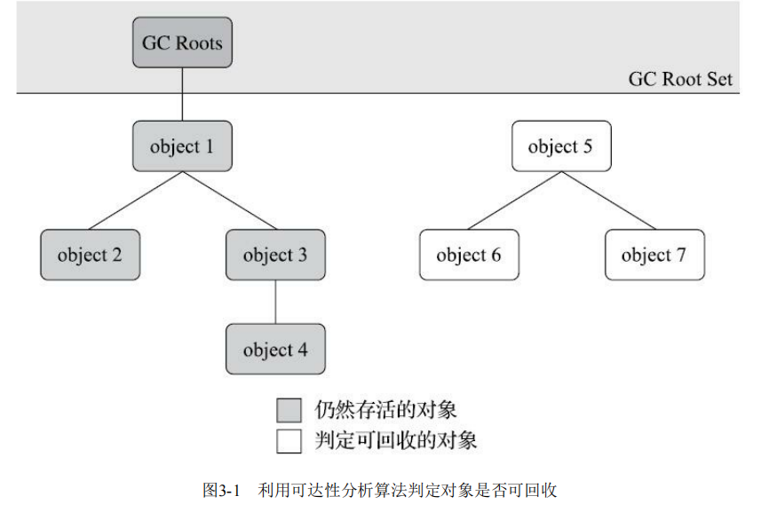

​		在Java技术体系里面，固定可作为**GC Roots的对象**包括以下几种：

- 在虚拟机栈（栈帧中的本地变量表）中引用的对象，譬如各个线程被调用的方法堆栈中使用到的参数、局部变量、临时变量等。
- 在方法区中类静态属性引用的对象，譬如Java类的引用类型静态变量。
- 在方法区中常量引用的对象，譬如字符串常量池（String Table）里的引用。
- 在本地方法栈中JNI（即通常所说的Native方法）引用的对象。
- Java虚拟机内部的引用，如基本数据类型对应的Class对象，一些常驻的异常对象（比如NullPointExcepiton、OutOfMemoryError）等，还有系统类加载器。
- 所有被同步锁（synchronized关键字）持有的对象。
- 反映Java虚拟机内部情况的JMXBean、JVMTI中注册的回调、本地代码缓存等。

### <font color='#096ec2'>再谈引用</font>

- **强引用**：强引用是最传统的“引用”的定义，是指在程序代码之中普遍存在的引用赋值，即类似“Object obj=new Object()”这种引用关系。无论任何情况下，只要强引用关系还存在，垃圾收集器就永远不会回收掉被引用的对象。
- **软引用**：软引用是用来描述一些还有用，但非必须的对象。只被软引用关联着的对象，在系统将要发生内存溢出异常前，会把这些对象列进回收范围之中进行第二次回收，如果这次回收还没有足够的内存，才会抛出内存溢出异常。在JDK 1.2版之后提供了SoftReference类来实现软引用。
- **弱引用**：弱引用也是用来描述那些非必须对象，但是它的强度比软引用更弱一些，被弱引用关联的对象只能生存到下一次垃圾收集发生为止。当垃圾收集器开始工作，无论当前内存是否足够，都会回收掉只被弱引用关联的对象。在JDK 1.2版之后提供了WeakReference类来实现弱引用。
- **虚引用**：虚引用也称为“幽灵引用”或者“幻影引用”，它是最弱的一种引用关系。一个对象是否有虚引用的存在，完全不会对其生存时间构成影响，也无法通过虚引用来取得一个对象实例。为一个对象设置虚引用关联的唯一目的只是为了能在这个对象被收集器回收时收到一个系统通知。在JDK 1.2版之后提供了PhantomReference类来实现虚引用。

### <font color='#096ec2'>生存还是死亡？</font>

​		**即使在可达性分析算法中判定为不可达的对象，也不是“非死不可”的，**这时候它们暂时还处于“缓刑”阶段，要真正宣告一个对象死亡，至少要经历两次标记过程：**如果对象在进行可达性分析后发现没有与GC Roots相连接的引用链，那它将会被第一次标记，随后进行一次筛选，筛选的条件是此对象是否有必要执行finalize()方法。**假如对象没有覆盖finalize()方法，或者finalize()方法已经被虚拟机调用过，那么虚拟机将这两种情况都视为“没有必要执行”。

​		<u>如果这个对象被判定为确有必要执行finalize()方法，那么该对象将会被放置在一个名为F-Queue的队列之中，并在稍后由一条由虚拟机自动建立的、低调度优先级的Finalizer线程去执行它们的finalize()方法。</u>这里所说的“执行”是指虚拟机会触发这个方法开始运行，但并不承诺一定会等待它运行结束。

​		这样做的原因是，如果某个对象的finalize()方法执行缓慢，或者更极端地发生了死循环，将很可能导致F-Queue队列中的其他对象永久处于等待，甚至导致整个内存回收子系统的崩溃。finalize()方法是对象逃脱死亡命运的最后一次机会，稍后收集器将对F-Queue中的对象进行第二次小规模的标记，**如果对象要在finalize()中成功拯救自己——只要重新与引用链上的任何一个对象建立关联即可，**譬如把自己（this关键字）赋值给某个类变量或者对象的成员变量，那在第二次标记时它将被移出“即将回收”的集合；如果对象这时候还没有逃脱，那基本上它就真的要被回收了。从代码清单3-2中我们可以看到一个对象的finalize()被执行，但是它仍然可以存活。

```java
/**
 * 此代码演示了两点： *1.对象可以在被GC时自我拯救。 *2.这种自救的机会只有一次，因为一个对象的finalize()方法最多只会被系统自动调用一次 *@author zzm
 */
public class FinalizeEscapeGC {
    public static FinalizeEscapeGC SAVE_HOOK = null;
    public void isAlive() {
        System.out.println("yes,i am still alive:");
    }
    @Override
    protected void finalize() throws Throwable {
        super.finalize();
        System.out.println("finalize mehtod executed!");
        FinalizeEscapeGC.SAVE_HOOK = this;
    }
    public static void main(String[] args)throws Throwable {
        SAVE_HOOK = new FinalizeEscapeGC();
        //对象第一次成功拯救自己
        SAVE_HOOK=null;
        System.gc(); //因为finalize方法优先级很低，所以暂停0.5秒以等待它
        Thread.sleep(500);
        if(SAVE_HOOK!=null){
            SAVE_HOOK.isAlive();
        }else{
            System.out.println("no,i am dead:");
        }
        //下面这段代码与上面的完全相同，但是这次自救却失败了
        SAVE_HOOK=null;
        System.gc(); //因为finalize方法优先级很低，所以暂停0.5秒以等待它
        Thread.sleep(500);
        if(SAVE_HOOK!=null){
            SAVE_HOOK.isAlive();
        }else{
            System.out.println("no,i am dead:");
        }
    }
}
```

​		SAVE_HOOK对象的finalize()方法确实被垃圾收集器触发过，并且在被收集前成功逃脱了。

​		另外一个值得注意的地方就是，代码中有两段完全一样的代码片段，执行结果却是一次逃脱成功，一次失败了。这是因为任何一个对象的finalize()方法都只会被系统自动调用一次，如果对象面临下一次回收，它的finalize()方法不会被再次执行，因此第二段代码的自救行动失败了。

### <font color='#096ec2'>回收方法区</font>

​		方法区的垃圾收集主要回收两部分内容：废弃的常量和不再使用的类型。

​		判定一个常量是否“废弃”还是相对简单(已经没有任何字符串对象引用常量池中的这个常量，且虚拟机中也没有其他地方引用这个字面量)，而要判定一个类型是否属于“不再被使用的类”的条件就比较苛刻了。需要同时满足下面三个条件：

- 该类所有的实例都已经被回收，也就是Java堆中不存在该类及其任何派生子类的实例。
- 加载该类的类加载器已经被回收，这个条件除非是经过精心设计的可替换类加载器的场景，如OSGi、JSP的重加载等，否则通常是很难达成的。
- 该类对应的java.lang.Class对象没有在任何地方被引用，无法在任何地方通过反射访问该类的方法。

`用-verbose:class以及-XX:+TraceClass-Loading、-XX:+TraceClassUnLoading查看类加载和卸载信息`


## <font color='#096ec2'>垃圾收集算法</font>

### <font color='#096ec2'>分代收集理论</font>

- 弱分代假说（Weak Generational Hypothesis）：绝大多数对象都是朝生夕灭的。
- 强分代假说（Strong Generational Hypothesis）：熬过越多次垃圾收集过程的对象就越难以消亡。

​		这两个分代假说共同奠定了多款常用的垃圾收集器的一致的设计原则：收集器应该将Java堆划分出不同的区域，然后将回收对象依据其年龄（年龄即对象熬过垃圾收集过程的次数）分配到不同的区域之中存储。显而易见，如果一个区域中大多数对象都是朝生夕灭，难以熬过垃圾收集过程的话，那么把它们集中放在一起，每次回收时只关注如何保留少量存活而不是去标记那些大量将要被回收的对象，就能以较低代价回收到大量的空间；如果剩下的都是难以消亡的对象，那把它们集中放在一块，虚拟机便可以使用较低的频率来回收这个区域，这就同时兼顾了垃圾收集的时间开销和内存的空间有效利用。

​		其实我们只要仔细思考一下，也很容易发现分代收集并非只是简单划分一下内存区域那么容易，它至少存在一个明显的困难：对象不是孤立的，对象之间会存在跨代引用。

​		**假如要现在进行一次只局限于新生代区域内的收集（Minor GC），但新生代中的对象是完全有可能被老年代所引用的，为了找出该区域中的存活对象，不得不在固定的GC Roots之外，再额外遍历整个老年代中所有对象来确保可达性分析结果的正确性，反过来也是一样（通常能单独发生收集行为的只是新生代，所以这里“反过来”的情况只是理论上允许，实际上除了CMS收集器，其他都不存在只针对老年代的收集。）。遍历整个老年代所有对象的方案虽然理论上可行，但无疑会为内存回收带来很大的性能负担。**为了解决这个问题，就需要对分代收集理论添加第三条经验法则：

- 跨代引用假说（Intergenerational Reference Hypothesis）：跨代引用相对于同代引用来说仅占极少数。

​		<font color='red'>这其实是可根据前两条假说逻辑推理得出的隐含推论：存在互相引用关系的两个对象，是应该倾向于同时生存或者同时消亡的。举个例子，如果某个新生代对象存在跨代引用，由于老年代对象难以消亡，该引用会使得新生代对象在收集时同样得以存活，进而在年龄增长之后晋升到老年代中，这时跨代引用也随即被消除了。</font>

​				<font color='red'>依据这条假说，我们就不应再为了少量的跨代引用去扫描整个老年代，也不必浪费空间专门记录每一个对象是否存在及存在哪些跨代引用，只需**在新生代上建立一个全局的数据结构**（该结构被称为“记忆集”，Remembered Set），**这个结构把老年代划分成若干小块，标识出老年代的哪一块内存会存在跨代引用。此后当发生Minor GC时，只有包含了跨代引用的小块内存里(老年代)的对象才会被加入到GC Roots进行扫描。**虽然这种方法需要在对象改变引用关系（如将自己或者某个属性赋值）时维护记录数据的正确性，会增加一些运行时的开销，但比起收集时扫描整个老年代来说仍然是划算的。</font>

名词统一定义：

**部分收集**（Partial GC）：指目标不是完整收集整个Java堆的垃圾收集，其中又分为：

- 新生代收集（Minor GC/Young GC）：指目标只是新生代的垃圾收集。

- 老年代收集（Major GC/Old GC）：指目标只是老年代的垃圾收集。目前只有CMS收集器会有单独收集老年代的行为。另外请注意“Major GC”这个说法现在有点混淆，在不同资料上常有不同所指，读者需按上下文区分到底是指老年代的收集还是整堆收集。

- 混合收集（Mixed GC）：指目标是收集整个新生代以及部分老年代的垃圾收集。目前只有G1收集器会有这种行为。

**整堆收集**（Full GC）：收集整个Java堆和方法区的垃圾收集。

### <font color='#096ec2'>标记-清除算法</font>

​		如名字一样，**算法分为“标记”和“清除”两个阶段**：首先标记出所有需要回收的对象，在标记完成后，统一回收掉所有被标记的对象，也可以反过来，标记存活的对象，统一回收所有未被标记的对象。标记过程就是对象是否属于垃圾的判定过程，

​		它的主要缺点有两个：

1. 第一个是**标记-复制算法**。如果Java堆中包含大量对象，而且其中大部分是需要被回收的，这时必须进行大量标记和清除的动作，导致标记和清除两个过程的执行效率都随对象数量增长而降低；

2. 第二个是**内存空间的碎片化问题**。标记、清除之后会产生大量不连续的内存碎片，空间碎片太多可能会导致当以后在程序运行过程中需要分配较大对象时无法找到足够的连续内存而不得不提前触发另一次垃圾收集动作。

​		标记-清除算法的执行过程如图3-2所示。

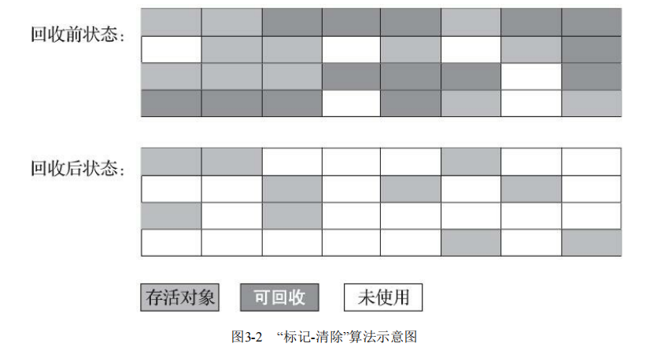

### <font color='#096ec2'>复制算法</font>

为了解决标记-清除算法面对大量可回收对象时执行效率低的问题，该算法将可用内存按容量划分为大小相等的两块，每次只使用其中的一块。当这一块的内存用完了，就将还存活着的对象复制到另外一块上面，然后再把已使用过的内存空间一次清理掉。

- 优点：如果内存中多数对象都是存活的，这种算法将会产生大量的内存间复制的开销，但对于多数对象都是可回收的情况，算法需要复制的就是占少数的存活对象，而且每次都是针对整个半区进行内存回收，分配内存时也就不用考虑有空间碎片的复杂情况，只要移动堆顶指针，按顺序分配即可。这样实现简单，运行高效。

- 缺点：这种复制回收算法的代价是将可用内存缩小为了原来的一半，空间浪费未免太多了一点。

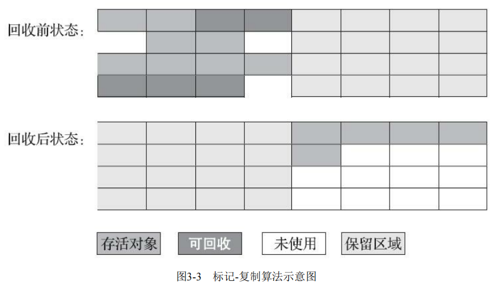

​		**HotSpot虚拟机默认Eden和Survivor的大小比例是8∶1**，也即每次新生代中可用内存空间为整个新生代容量的90%（Eden的80%加上一个Survivor的10%），只有一个Survivor空间，即10%的新生代是会被“浪费”的。当然，98%的对象可被回收仅仅是“普通场景”下测得的数据，任何人都没有办法百分百保证每次回收都只有不多于10%的对象存活，因此Appel式回收还有一个充当罕见情况的“逃生门”的安全设计，当Survivor空间不足以容纳一次Minor GC之后存活的对象时，就需要依赖其他内存区域（实际上大多就是老年代）进行分配担保（Handle Promotion）。

​		小结：**标记-复制算法在对象存活率较高时就要进行较多的复制操作，效率将会降低。更关键的是，如果不想浪费50%的空间（基础的复制算法），就需要有额外的空间进行分配担保（8:1方式的进阶复制算法），以应对被使用的内存中所有对象都100%存活的极端情况**，<font color='red'>所以在老年代一般不能直接选用这种算法。</font>


### <font color='#096ec2'>标记-整理算法</font>

​		针对老年代对象的存亡特征提出了另外一种有针对性的“标记-整理”（Mark-Compact）算法，其中的**标记过程仍然与“标记-清除”算法一样，但后续步骤不是直接对可回收对象进行清理，而是让所有存活的对象都向内存空间一端移动，然后直接清理掉边界以外的内存**，“标记-整理”算法的示意图如图3-4所示。

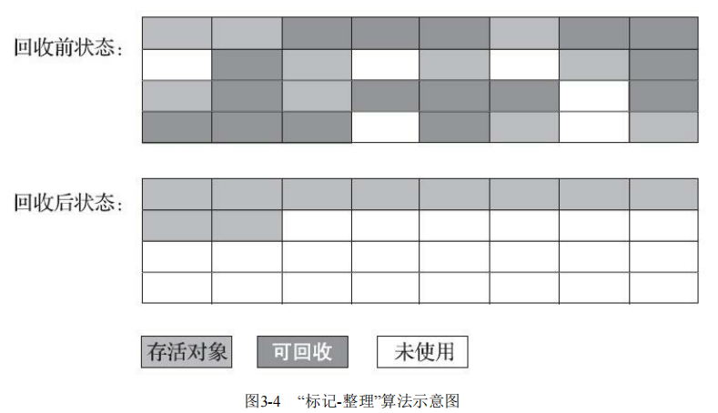


​		**如果移动存活对象，尤其是在老年代这种每次回收都有大量对象存活区域，移动存活对象并更新所有引用这些对象的地方将会是一种极为负重的操作，而且这种对象移动操作必须全程暂停用户应用程序才能进行**(最新的ZGC和Shenandoah收集器使用读屏障 Read Barrier 技术实现了整理过程与用户线程的并发执行，稍后将会介绍这种收集器的工作原理)，这就更加让使用者不得不小心翼翼地权衡其弊端了，像这样的停顿被最初的虚拟机设计者形象地描述为**“Stop The World”**。

​		**但如果跟标记-清除算法那样完全不考虑移动和整理存活对象的话，弥散于堆中的存活对象导致的空间碎片化问题就只能依赖更为复杂的内存分配器和内存访问器来解决。**譬如通过“分区空闲分配链表”来解决内存分配问题（计算机硬盘存储大文件就不要求物理连续的磁盘空间，能够在碎片化的硬盘上存储和访问就是通过硬盘分区表实现的）。内存的访问是用户程序最频繁的操作，甚至都没有之一，假如在这个环节上增加了额外的负担，势必会直接影响应用程序的吞吐量。

​		基于以上两点，是否移动对象都存在弊端，**移动则内存回收时会更复杂，不移动则内存分配时会更复杂。**从垃圾收集的停顿时间来看，不移动对象停顿时间会更短，甚至可以不需要停顿，但是从整个程序的吞吐量来看，移动对象会更划算。此语境中，吞吐量的实质是赋值器（Mutator，可以理解为使用垃圾收集的用户程序，本书为便于理解，多数地方用“用户程序”或“用户线程”代替）与收集器的效率总和。即使不移动对象会使得收集器的效率提升一些，但因内存分配和访问相比垃圾收集频率要高得多，这部分的耗时增加，总吞吐量仍然是下降的。HotSpot虚拟机里面关注吞吐量的Parallel  Scavenge收集器是基于标记-整理算法的，而关注延迟的CMS收集器则是基于标记-清除算法的，这也从侧面印证这点。

​		另外，**还有一种“和稀泥式”解决方案可以不在内存分配和访问上增加太大额外负担，做法是让虚拟机平时多数时间都采用标记-清除算法，暂时容忍内存碎片的存在，直到内存空间的碎片化程度已经大到影响对象分配时，再采用标记-整理算法收集一次，以获得规整的内存空间。前面提到的基于标记-清除算法的CMS收集器面临空间碎片过多时采用的就是这种处理办法。**


## <font color='#096ec2'>HotSpot的算法细节实现</font>

### <font color='#096ec2'>根节点枚举</font>

<font color='gray'>解决如果快速枚举gc roots问题？</font>

​		我们以可达性分析算法中从GC Roots集合找引用链这个操作作为介绍虚拟机高效实现的第一个例子。固定可作为GC Roots的节点主要在全局性的引用（例如常量或类静态属性）与执行上下文（例如栈帧中的本地变量表）中，尽管目标明确，但查找过程要做到高效并非一件容易的事情，现在Java应用越做越庞大，光是方法区的大小就常有数百上千兆，里面的类、常量等更是恒河沙数，若要逐个检查以这里为起源的引用肯定得消耗不少时间。

​		迄今为止，**所有收集器在根节点枚举这一步骤时都是必须暂停用户线程的，因此毫无疑问根节点枚举与之前提及的整理内存碎片一样会面临相似的“Stop The World”的困扰。**现在可达性分析算法耗时最长的查找引用链的过程已经可以做到与用户线程一起并发（具体见3.4.6节），但根节点枚举始终还是必须在一个能保障一致性的快照中才得以进行——这里“一致性”的意思是整个枚举期间执行子系统看起来就像被冻结在某个时间点上，不会出现分析过程中，根节点集合的对象引用关系还在不断变化的情况，若这点不能满足的话，分析结果准确性也就无法保证。这是导致垃圾收集过程必须停顿所有用户线程的其中一个重要原因，即使是号称停顿时间可控，或者（几乎）不会发生停顿的CMS、G1、ZGC等收集器，枚举根节点时也是必须要停顿的。

​		由于目前主流Java虚拟机使用的都是准确式垃圾收集（这个概念在第1章介绍Exact VM相对于Classic VM的改进时介绍过），**所以当用户线程停顿下来之后，其实并不需要一个不漏地检查完所有执行上下文和全局的引用位置，虚拟机应当是有办法直接得到哪些地方存放着对象引用的。**在HotSpot的解决方案里，是使用一组称为OopMap的数据结构来达到这个目的。一旦类加载动作完成的时候，HotSpot就会把对象内什么偏移量上是什么类型的数据计算出来，在即时编译（见第11章）过程中，也会在特定的位置记录下栈里和寄存器里哪些位置是引用。这样收集器在扫描时就可以直接得知这些信息了，并不需要真正一个不漏地从方法区等GC Roots开始查找。

​		下面代码清单3-3是HotSpot虚拟机客户端模式下生成的一段String::hashCode()方法的本地代码，可以看到在0x026eb7a9处的call指令有OopMap记录，它指明了EBX寄存器和栈中偏移量为16的内存区域中各有一个普通对象指针（Ordinary Object Pointer，OOP）的引用，有效范围为从call指令开始直到0x026eb730（指令流的起始位置）+142（OopMap记录的偏移量）=0x026eb7be，即hlt指令为止。

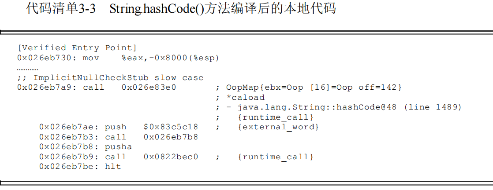


### <font color='#096ec2'>安全点</font>

<font color='gray'>有了gc roots，回答何时停下进行垃圾收集问题？</font>

​		在OopMap的协助下，HotSpot可以快速准确地完成GC Roots枚举，但一个很现实的问题随之而来：**可能导致引用关系变化，或者说导致OopMap内容变化的指令非常多，如果为每一条指都生成对应的OopMap(简单理解为一行代码就是一条指令，如果执行一行代码就收集一次gc roots 代价巨大，所以需要考虑什么时候停顿 收集gc roots)，那将会需要大量的额外存储空间，这样垃圾收集伴随而来的空间成本就会变得无法忍受的高昂。**

​		实际上HotSpot也的确没有为每条指令都生成OopMap，前面已经提到，**只是在“特定的位置”记录了这些信息，这些位置被称为安全点（Safepoint）。**有了安全点的设定，也就决定了用户程序执行时并非在代码指令流的任意位置都能够停顿下来开始垃圾收集，而是强制要求必须执行到达安全点后才能够暂停。因此，安全点的选定既不能太少以至于让收集器等待时间过长，也不能太过频繁以至于过分增大运行时的内存负荷。安全点位置的选取基本上是以“是否具有让程序长时间执行的特征”为标准进行选定的，因为每条指令执行的时间都非常短暂，程序不太可能因为**指令流长度**太长这样的原因而长时间执行，**“长时间执行”的最明显特征就是指令序列的复用，例如方法调用、循环跳转、异常跳转等都属于指令序列复用，所以只有具有这些功能的指令才会产生安全点。**`(指令流长度是指程序执行过程中，如方法、条件、循环会让代码逻辑结构从一块转移到另一块，转移过程构成了指令流。如 main()中包含func1  func2, 或者有分支，会形成一条或多条路径。具体路径是动态的，随程序运行变化的，与输入有关)`

​		对于安全点，另外一个需要考虑的问题是，如何在垃圾收集发生时让所有线程（这里其实不包括执行JNI调用的线程）都跑到最近的安全点，然后停顿下来。这里有两种方案可供选择：**抢先式中断**（Preemptive Suspension）和**主动式中断**（Voluntary Suspension），抢先式中断不需要线程的执行代码主动去配合，在垃圾收集发生时，系统首先把所有用户线程全部中断，如果发现有用户线程中断的地方不在安全点上，就恢复这条线程执行，让它一会再重新中断，直到跑到安全点上。现在几乎没有虚拟机实现采用抢先式中断来暂停线程响应GC事件。

​		而主动式中断的思想是当垃圾收集需要中断线程的时候，不直接对线程操作，仅仅简单地设置一个标志位，各个线程执行过程时会不停地主动去轮询这个标志，一旦发现中断标志为真时就自己在最近的安全点上主动中断挂起。轮询标志的地方和安全点是重合的，另外还要加上所有创建对象和其他需要在Java堆上分配内存的地方，这是为了检查是否即将要发生垃圾收集，避免没有足够内存分配新对象。

​		由于轮询操作在代码中会频繁出现，这要求它必须足够高效。HotSpot使用内存保护陷阱的方式，把轮询操作精简至只有一条汇编指令的程度。下面代码清单3-4中的test指令就是HotSpot生成的轮询指令，当需要暂停用户线程时，虚拟机把0x160100的内存页设置为不可读，那线程执行到test指令时就会产生一个自陷异常信号，然后在预先注册的异常处理器中挂起线程实现等待，这样仅通过一条汇编指令便完成安全点轮询和触发线程中断了。

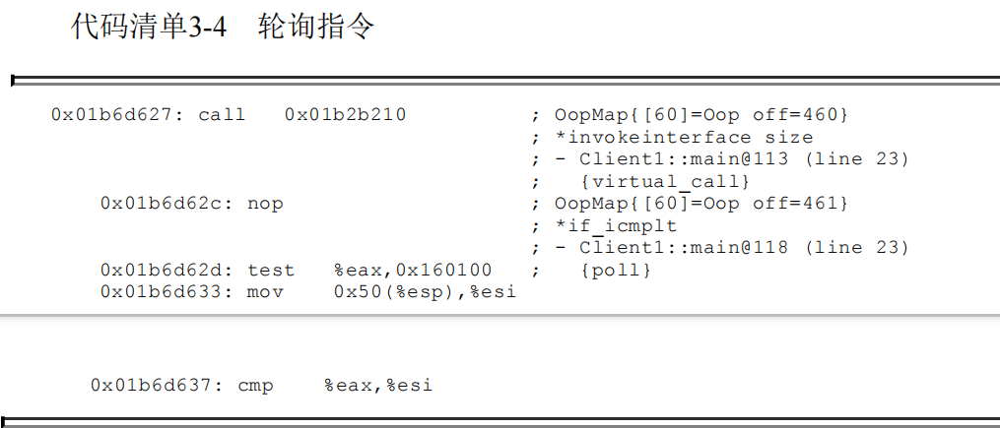


### <font color='#096ec2'>安全区域</font>

<font color='gray'>对于走不到安全点的情况如何处理？</font>

​		使用安全点的设计似乎已经完美解决如何停顿用户线程，让虚拟机进入垃圾回收状态的问题了，但实际情况却并不一定。安全点机制保证了程序执行时，在不太长的时间内就会遇到可进入垃圾收集过程的安全点。但是，程序“不执行”的时候呢？所谓的程序不执行就是没有分配处理器时间，典型的场景便是用户线程处于Sleep状态或者Blocked状态，这时候线程无法响应虚拟机的中断请求，不能再走到安全的地方去中断挂起自己，虚拟机也显然不可能持续等待线程重新被激活分配处理器时间。对于这种情况，就必须引入安全区域（Safe Region）来解决。**(走到安全点，才可以进行收集gc roots 到OopMap, 这里考虑的是被阻塞或者没分配处理器的线程，走不到安全点，怎么收集gc roots的问题)**

​		**安全区域是指能够确保在某一段代码片段之中，引用关系不会发生变化，因此，在这个区域中任意地方开始垃圾收集都是安全的。我们也可以把安全区域看作被扩展拉伸了的安全点。**

​		<font color='brown'>当用户线程执行到安全区域里面的代码时，首先会标识自己已经进入了安全区域，那样当这段时间里虚拟机要发起垃圾收集时就不必去管这些已声明自己在安全区域内的线程了。当线程要离开安全区域时，它要检查虚拟机是否已经完成了根节点枚举（或者垃圾收集过程中其他需要暂停用户线程的阶段），如果完成了，那线程就当作没事发生过，继续执行；否则它就必须一直等待，直到收到可以离开安全区域的信号为止。</font>

### <font color='#096ec2'>记忆集与卡表</font>

<font color='gray'>如何解决快速扫描跨代引用对象的问题？</font>

​		讲解分代收集理论的时候，提到了为解决对象跨代引用所带来的问题，垃圾收集器在新生代中建立了名为记忆集（Remembered Set）的数据结构，用以避免把整个老年代加进GC Roots扫描范围。事实上并不只是新生代、老年代之间才有跨代引用的问题，所有涉及部分区域收集（Partial GC）行为的垃圾收集器，典型的如G1、ZGC和Shenandoah收集器，都会面临相同的问题，因此我们有必要进一步理清记忆集的原理和实现方式，以便在后续章节里介绍几款最新的收集器相关知识时能更好地理解。

​		记忆集是一种用于记录从非收集区域指向收集区域的指针集合的抽象数据结构。如果我们不考虑效率和成本的话，最简单的实现可以用非收集区域中所有含跨代引用的对象数组来实现这个数据结构，如代码清单3-5所示：

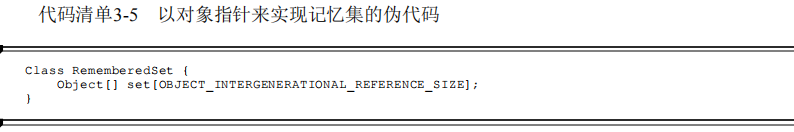

​		这种记录全部含跨代引用对象的实现方案，无论是空间占用还是维护成本都相当高昂。而在垃圾收集的场景中，收集器只需要通过记忆集判断出某一块非收集区域是否存在有指向了收集区域的指针就可以了，并不需要了解这些跨代指针的全部细节。那设计者在实现记忆集的时候，便可以选择更为粗犷的记录粒度来节省记忆集的存储和维护成本，下面列举了一些可供选择（当然也可以选择这个范围以外的）的记录精度：

- **字长精度**：每个记录精确到一个机器字长（就是处理器的寻址位数，如常见的32位或64位，这个精度决定了机器访问物理内存地址的指针长度），该字包含跨代指针。

- **对象精度**：每个记录精确到一个对象，该对象里有字段含有跨代指针。

- **卡精度**：每个记录精确到一块内存区域，该区域内有对象含有跨代指针。

​		其中，第三种“卡精度”所指的是用一种称为“卡表”（Card Table）的方式去实现记忆集，这也是目前最常用的一种记忆集实现形式，一些资料中甚至直接把它和记忆集混为一谈。前面定义中提到记忆集其实是一种“抽象”的数据结构，抽象的意思是只定义了记忆集的行为意图，并没有定义其行为的具体实现。卡表就是记忆集的一种具体实现，它定义了记忆集的记录精度、与堆内存的映射关系等。关于卡表与记忆集的关系，读者不妨按照Java语言中HashMap与Map的关系来类比理解。

​		卡表最简单的形式可以只是一个字节数组，而HotSpot虚拟机确实也是这样做的。以下这行代码是HotSpot默认的卡表标记逻辑：


​		**字节数组CARD_TABLE的每一个元素都对应着其标识的内存区域中一块特定大小的内存块，这个内存块被称作“卡页”（Card Page）。**一般来说，卡页大小都是以2的N次幂的字节数，通过上面代码可以看出HotSpot中使用的卡页是2的9次幂，即512字节（地址右移9位，相当于用地址除以512）。那如果卡表标识内存区域的起始地址是0x0000的话，数组CARD_TABLE的第0、1、2号元素，分别对应了地址范围为0x0000～0x01FF、0x0200～0x03FF、0x0400～0x05FF的卡页内存块，如图3-5所示。

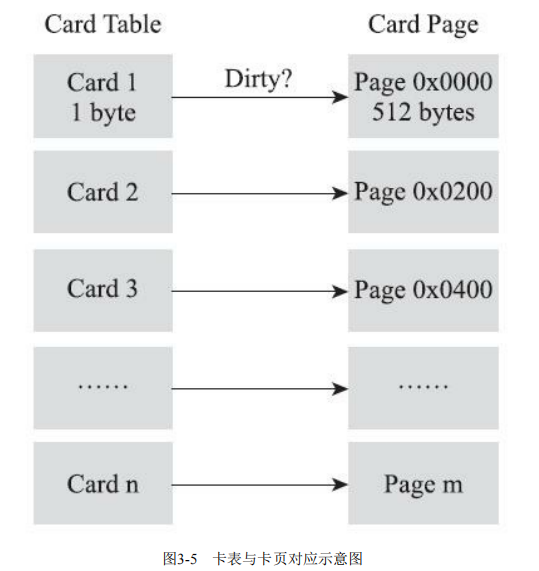

​		<font color='red'>一个卡页的内存中通常包含不止一个对象，只要卡页内有一个（或更多）对象的字段存在着跨代指针，那就将对应**卡表的数组元素的值标识为1**，称为这个元素变脏（Dirty），没有则标识为0。在垃圾收集发生时，只要筛选出卡表中变脏的元素，就能轻易得出哪些卡页内存块中包含跨代指针，把它们加入GC Roots中一并扫描。（卡页记录在新生代，但是记录的内容是老年代的内存的对象，有没有存在跨代引用,这样收集新生代不收集老年代的时候，判断新生代对象有没有被老年代引用，就不需要遍历整个老年代的对象了）</font>

### <font color='#096ec2'>写屏障</font>

​		我们已经解决了如何使用记忆集来缩减GC Roots扫描范围的问题，但还没有解决卡表元素如何维护的问题，例如它们何时变脏、谁来把它们变脏等。卡表元素何时变脏的答案是很明确的——有其他分代区域中对象引用了本区域对象时，其对应的卡表元素就应该变脏，变脏时间点原则上应该发生在引用类型字段赋值的那一刻。但问题是如何变脏，即如何在对象赋值的那一刻去更新维护卡表呢？假如是解释执行的字节码，那相对好处理，虚拟机负责每条字节码指令的执行，有充分的介入空间；但在编译执行的场景中呢？经过即时编译后的代码已经是纯粹的机器指令流了，这就必须找到一个在机器码层面的手段，把维护卡表的动作放到每一个赋值操作之中。

​		在HotSpot虚拟机里是通过写屏障（Write Barrier）技术维护卡表状态的。先请读者注意将这里提到的“写屏障”，以及后面在低延迟收集器中会提到的“读屏障”与解决并发乱序执行问题中的“内存屏障” [1]区分开来，避免混淆。写屏障可以看作在虚拟机层面对“引用类型字段赋值”这个动作的AOP切面[2]，在引用对象赋值时会产生一个环形（Around）通知，供程序执行额外的动作，也就是说赋值的前后都在写屏障的覆盖范畴内。在赋值前的部分的写屏障叫作写前屏障（Pre-Write Barrier），在赋值后的则叫作写后屏障（Post-Write Barrier）。HotSpot虚拟机的许多收集器中都有使用到写屏障，但直至G1收集器出现之前，其他收集器都只用到了写后屏障。下面这段代码清单3-6是一段更新卡表状态的简化逻辑：

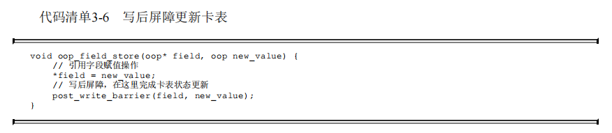

​		应用写屏障后，虚拟机就会为所有赋值操作生成相应的指令，一旦收集器在写屏障中增加了更新卡表操作，无论更新的是不是老年代对新生代对象的引用，每次只要对引用进行更新，就会产生额外的开销，不过这个开销与Minor GC时扫描整个老年代的代价相比还是低得多的。

​		除了写屏障的开销外，卡表在高并发场景下还面临着“伪共享”（False Sharing）问题。伪共享是处理并发底层细节时一种经常需要考虑的问题，现代中央处理器的缓存系统中是以缓存行（Cache Line）为单位存储的，当多线程修改互相独立的变量时，如果这些变量恰好共享同一个缓存行，就会彼此影响（写回、无效化或者同步）而导致性能降低，这就是伪共享问题。

​		假设处理器的缓存行大小为64字节，由于一个卡表元素占1个字节，64个卡表元素将共享同一个缓存行。这64个卡表元素对应的卡页总的内存为32KB（64×512字节），也就是说如果不同线程更新的对象正好处于这32KB的内存区域内，就会导致更新卡表时正好写入同一个缓存行而影响性能。为了避免伪共享问题，一种简单的解决方案是不采用无条件的写屏障，而是先检查卡表标记，只有当该卡表元素未被标记过时才将其标记为变脏，即将卡表更新的逻辑变为以下代码所示：

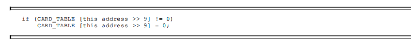

​		在JDK 7之后，HotSpot虚拟机增加了一个新的参数-XX：+UseCondCardMark，用来决定是否开启卡表更新的条件判断。开启会增加一次额外判断的开销，但能够避免伪共享问题，两者各有性能损耗，是否打开要根据应用实际运行情况来进行测试权衡。

### <font color='#096ec2'>并发的可达性分析</font>

​		在3.2节中曾经提到了当前主流编程语言的垃圾收集器基本上都是依靠可达性分析算法来判定对象是否存活的，可达性分析算法理论上要求全过程都基于一个能保障一致性的快照中才能够进行分析，这意味着必须全程冻结用户线程的运行。在根节点枚举（见3.4.1节）这个步骤中，由于GC Roots相比起整个Java堆中全部的对象毕竟还算是极少数，且在各种优化技巧（如OopMap）的加持下，它带来的停顿已经是非常短暂且相对固定（不随堆容量而增长）的了。可从GC Roots再继续往下遍历对象图，这一步骤的停顿时间就必定会与Java堆容量直接成正比例关系了：堆越大，存储的对象越多，对象图结构越复杂，要标记更多对象而产生的停顿时间自然就更长，这听起来是理所当然的事情。

​		要知道包含“标记”阶段是所有追踪式垃圾收集算法的共同特征，如果这个阶段会随着堆变大而等比例增加停顿时间，其影响就会波及几乎所有的垃圾收集器，同理可知，如果能够削减这部分停顿时

间的话，那收益也将会是系统性的。

​		想解决或者降低用户线程的停顿，就要先搞清楚为什么必须在一个能保障一致性的快照上才能进行对象图的遍历？为了能解释清楚这个问题，我们引入三色标记（Tri-color Marking）[1]作为工具来辅助推导，把遍历对象图过程中遇到的对象，按照“是否访问过”这个条件标记成以下三种颜色：

- <font color='red'>白色：表示对象尚未被垃圾收集器访问过。显然在可达性分析刚刚开始的阶段，所有的对象都是白色的，若在分析结束的阶段，仍然是白色的对象，即代表不可达。</font>

- <font color='red'>黑色：表示对象已经被垃圾收集器访问过，且这个对象的所有引用都已经扫描过。黑色的对象代表已经扫描过，它是安全存活的，如果有其他对象引用指向了黑色对象，无须重新扫描一遍。黑色对象不可能直接（不经过灰色对象）指向某个白色对象。</font>

- <font color='red'>灰色：表示对象已经被垃圾收集器访问过，但这个对象上至少存在一个引用还没有被扫描过。</font>

​		关于可达性分析的扫描过程，读者不妨发挥一下想象力，把它看作对象图上一股以灰色为波峰的波纹从黑向白推进的过程，如果用户线程此时是冻结的，只有收集器线程在工作，那不会有任何问题。但如果用户线程与收集器是并发工作呢？收集器在对象图上标记颜色，同时用户线程在修改引用关系——即修改对象图的结构，这样可能出现两种后果。**一种是把原本消亡的对象错误标记为存活，这不是好事，但其实是可以容忍的，只不过产生了一点逃过本次收集的浮动垃圾而已，下次收集清理掉就好。另一种是把原本存活的对象错误标记为已消亡，这就是非常致命的后果了，程序肯定会因此发生错误，下面表3-1演示了这样的致命错误具体是如何产生的。**

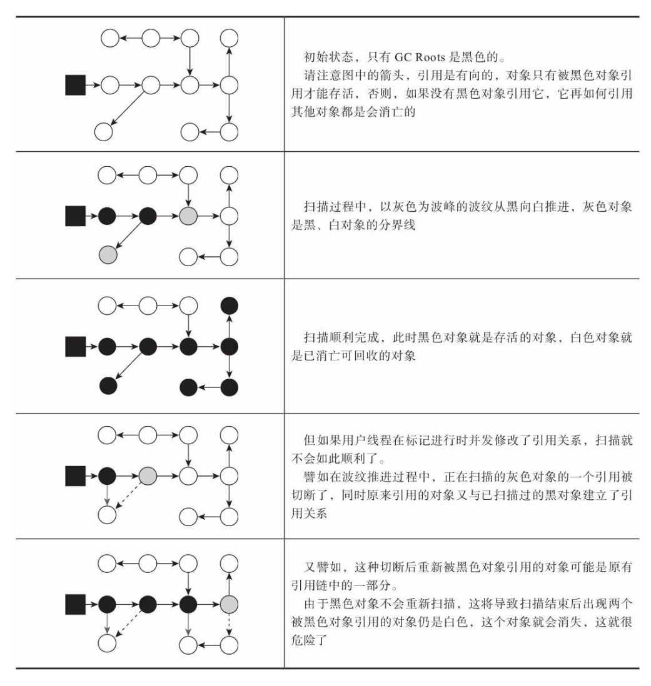


​		Wilson于1994年在理论上证明了，当且仅当以下两个条件同时满足时，会产生“对象消失”的问题，即原本应该是黑色的对象被误标为白色：

- <font color='red'>赋值器插入了一条或多条从黑色对象到白色对象的新引用；</font>

- <font color='red'>赋值器删除了全部从灰色对象到该白色对象的直接或间接引用。</font>

​		因此，我们要解决并发扫描时的对象消失问题，只需破坏这两个条件的任意一个即可。由此分别产生了两种解决方案：增量更新（Incremental Update）和原始快照（Snapshot At The Beginning，SATB）。

​		**增量更新**要破坏的是第一个条件，当黑色对象插入新的指向白色对象的引用关系时，就将这个新插入的引用记录下来，等并发扫描结束之后，再将这些记录过的引用关系中的黑色对象为根，重新扫描一次。这可以简化理解为，黑色对象一旦新插入了指向白色对象的引用之后，它就变回灰色对象了。

​		**原始快照**要破坏的是第二个条件，当灰色对象要删除指向白色对象的引用关系时，就将这个要删除的引用记录下来，在并发扫描结束之后，再将这些记录过的引用关系中的灰色对象为根，重新扫描一次。这也可以简化理解为，无论引用关系删除与否，都会按照刚刚开始扫描那一刻的对象图快照来进行搜索。

​		以上无论是对引用关系记录的插入还是删除，虚拟机的记录操作都是通过写屏障实现的。在HotSpot虚拟机中，增量更新和原始快照这两种解决方案都有实际应用，譬如，CMS是基于增量更新来做并发标记的，G1、Shenandoah则是用原始快照来实现。

​		到这里，笔者简要介绍了HotSpot虚拟机如何发起内存回收、如何加速内存回收，以及如何保证回收正确性等问题，但是虚拟机如何具体地进行内存回收动作仍然未涉及。因为内存回收如何进行是由虚拟机所采用哪一款垃圾收集器所决定的，而通常虚拟机中往往有多种垃圾收集器，下面笔者将逐一介绍HotSpot虚拟机中出现过的垃圾收集器。

## <font color='#096ec2'>经典垃圾收集器</font>

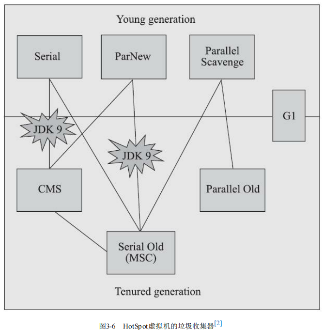

​		图3-6展示了七种作用于不同分代的收集器，如果两个收集器之间存在连线，就说明它们可以搭配使用[3]，图中收集器所处的区域，则表示它是属于新生代收集器抑或是老年代收集器。接下来笔者将逐一介绍这些收集器的目标、特性、原理和使用场景，并重点分析CMS和G1这两款相对复杂而又广泛使用的收集器，深入了解它们的部分运作细节。

### <font color='#096ec2'>Serial收集器</font>

​		大家只看名字就能够猜到，这个收集器是一个单线程工作的收集器，**(缺点)但它的“单线程”的意义并不仅仅是说明它只会使用一个处理器或一条收集线程去完成垃圾收集工作，更重要的是强调在它进行垃圾收集时，必须暂停其他所有工作线程，直到它收集结束。**“Stop The World”这个词语也许听起来很酷，但这项工作是由虚拟机在后台自动发起和自动完成的，在用户不可知、不可控的情况下把用户的正常工作的线程全部停掉，这对很多应用来说都是不能接受的。

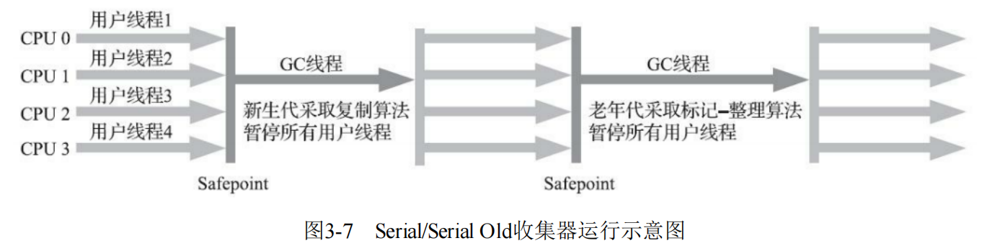

​		但事实上，迄今为止，它依然是HotSpot虚拟机运行在客户端模式下的默认新生代收集器，**有着优于其他收集器的地方，那就是简单而高效（与其他收集器的单线程相比），对于内存资源受限的环境，它是所有收集器里额外内存消耗（Memory Footprint）最小的；对于单核处理器或处理器核心数较少的环境来说，Serial收集器由于没有线程交互的开销，专心做垃圾收集自然可以获得最高的单线程收集效率。在用户桌面的应用场景以及近年来流行的部分微服务应用中，分配给虚拟机管理的内存一般来说并不会特别大，收集几十兆甚至一两百兆的新生代（仅仅是指新生代使用的内存，桌面应用甚少超过这个容量），垃圾收集的停顿时间完全可以控制在十几、几十毫秒，最多一百多毫秒以内，只要不是频繁发生收集，这点停顿时间对许多用户来说是完全可以接受的。**所以，Serial收集器对于运行在客户端模式下的虚拟机来说是一个很好的选择。

### <font color='#096ec2'>ParNew收集器</font>

​		**ParNew收集器实质上是Serial收集器的多线程并行版本**，除了同时使用多条线程进行垃圾收集之外，其余的行为包括Serial收集器可用的所有控制参数（例如：-XX：SurvivorRatio、-XX：PretenureSizeThreshold、-XX：HandlePromotionFailure等）、收集算法、Stop The World、对象分配规则、回收策略等**都与Serial收集器完全一致**，在实现上这两种收集器也共用了相当多的代码。ParNew收集器的工作过程如图3-8所示。

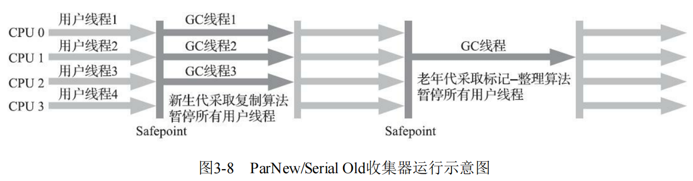

​		ParNew收集器除了支持多线程并行收集之外，其他与Serial收集器相比并没有太多创新之处，但它却是不少运行在服务端模式下的HotSpot虚拟机，尤其是JDK 7之前的遗留系统中首选的新生代收集器，其中有一个与功能、性能无关但其实很重要的原因是：<font color='red'>除了Serial收集器外，目前只有它能与CMS收集器配合工作。(Parallel Scavenge 无法搭配CMS)</font>

### <font color='#096ec2'>Parallel Scavenge收集器</font>

​		Parallel Scavenge收集器也是一款新生代收集器，它同样是基于标记-复制算法实现的收集器，也是能够并行收集的多线程收集器。

​	Parallel Scavenge收集器的特点是它的关注点与其他收集器不同，CMS等收集器的关注点是尽可能地缩短垃圾收集时用户线程的停顿时间，而Parallel Scavenge收集器的目标则是达到一个可控制的吞吐量（Throughput）。所谓吞吐量就是处理器用于运行用户代码的时间与处理器总消耗时间的比值：
$$
\mathbf{吞吐量} = \frac{\mathbf{用户运行代码时间}}{\mathbf{用户运行代码时间+运行垃圾收集时间}}
$$
​		如果虚拟机完成某个任务，用户代码加上垃圾收集总共耗费了100分钟，其中垃圾收集花掉1分钟，那吞吐量就是99%。停顿时间越短就越适合需要与用户交互或需要保证服务响应质量的程序，良好的响应速度能提升用户体验；**而高吞吐量则可以最高效率地利用处理器资源，尽快完成程序的运算任务，主要适合在后台运算而不需要太多交互的分析任务。**

​		Parallel Scavenge收集器提供了两个参数用于精确控制吞吐量，分别是控制最大垃圾收集停顿时间的-XX：MaxGCPauseMillis参数以及直接设置吞吐量大小的-XX：GCTimeRatio参数。

- -XX：MaxGCPauseMillis参数允许的值是一个大于0的毫秒数，收集器将尽力保证内存回收花费的时间不超过用户设定值。不过大家不要异想天开地认为如果把这个参数的值设置得更小一点就能使得系统的垃圾收集速度变得更快，垃圾收集停顿时间缩短是以牺牲吞吐量和新生代空间为代价换取的：系统把新生代调得小一些，收集300MB新生代肯定比收集500MB快，但这也直接导致垃圾收集发生得更频繁，原来10秒收集一次、每次停顿100毫秒，现在变成5秒收集一次、每次停顿70毫秒。停顿时间的确在下降，但吞吐量也降下来了。

- -XX：GCTimeRatio参数的值则应当是一个大于0小于100的整数，也就是垃圾收集时间占总时间的比率，相当于吞吐量的倒数。譬如把此参数设置为19，那允许的最大垃圾收集时间就占总时间的5%（即1/(1+19)），默认值为99，即允许最大1%（即1/(1+99)）的垃圾收集时间。

​		由于与吞吐量关系密切，Parallel Scavenge收集器也经常被称作“吞吐量优先收集器”。除上述两个参数之外，Parallel Scavenge收集器还有一个参数-XX：<font color='red'>**+UseAdaptiveSizePolicy**值得我们关注。</font>这是一个开关参数，当这个参数被激活之后，就不需要人工指定新生代的大小（-Xmn）、Eden与Survivor区的比例（-XX：SurvivorRatio）、晋升老年代对象大小（-XX：PretenureSizeThreshold）等细节参数了，虚拟机会根据当前系统的运行情况收集性能监控信息，动态调整这些参数以提供最合适的停顿时间或者最大的吞吐量。这种调节方式称为垃圾收集的自适应的调节策略（GC Ergonomics）[1]。如果读者对于收集器运作不太了解，手工优化存在困难的话，使用Parallel Scavenge收集器配合自适应调节策略，把内存管理的调优任务交给虚拟机去完成也许是一个很不错的选择。**只需要把基本的内存数据设置好（如-Xmx设置最大堆），然后使用-XX：MaxGCPauseMillis参数（更关注最大停顿时间）或-XX：GCTimeRatio（更关注吞吐量）参数给虚拟机设立一个优化目标，那具体细节参数的调节工作就由虚拟机完成了。**自适应调节策略也是Parallel Scavenge收集器区别于ParNew收集器的一个重要特性。

### <font color='#096ec2'>Serial Old收集器</font>

​		Serial Old是Serial收集器的老年代版本，它同样是一个单线程收集器，使用标记-整理算法。这个收集器的主要意义也是供客户端模式下的HotSpot虚拟机使用。如果在服务端模式下，它也可能有两种用途：**一种是在JDK 5以及之前的版本中与Parallel Scavenge收集器搭配使用[1]，另外一种就是作为CMS收集器发生失败时的后备预案，在并发收集发生Concurrent Mode Failure时使用。**这两点都将在后面的内容中继续讲解。

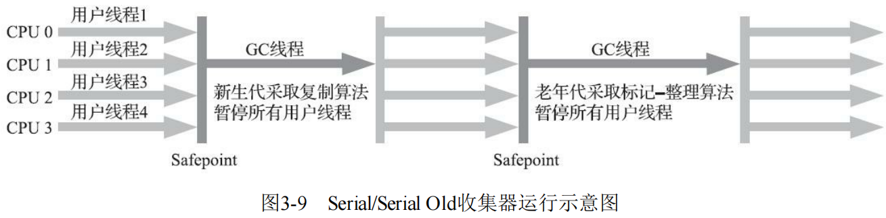


### <font color='#096ec2'>Parallel Old收集器</font>

​		(背景：Parallel Old出现之前Parallel Scavenge的尴尬地位)Parallel Old是Parallel Scavenge收集器的老年代版本，支持多线程并发收集，基于标记-整理算法实现。这个收集器是直到JDK 6时才开始提供的，在此之前，新生代的Parallel Scavenge收集器一直处于相当尴尬的状态，原因是如果新生代选择了Parallel Scavenge收集器，老年代除了Serial Old（PS MarkSweep）收集器以外别无选择，其他表现良好的老年代收集器，如CMS无法与它配合工作。由于老年代Serial Old收集器在服务端应用性能上的“拖累”，使用Parallel Scavenge收集器也未必能在整体上获得吞吐量最大化的效果。同样，由于单线程的老年代收集中无法充分利用服务器多处理器的并行处理能力，在老年代内存空间很大而且硬件规格比较高级的运行环境中，这种组合的总吞吐量甚至不一定比ParNew加CMS的组合来得优秀。

​		直到Parallel Old收集器出现后，“吞吐量优先”收集器终于有了比较名副其实的搭配组合，在注重吞吐量或者处理器资源较为稀缺的场合，都可以优先考虑Parallel Scavenge加Parallel Old收集器这个组合。Parallel Old收集器的工作过程如图3-10所示。

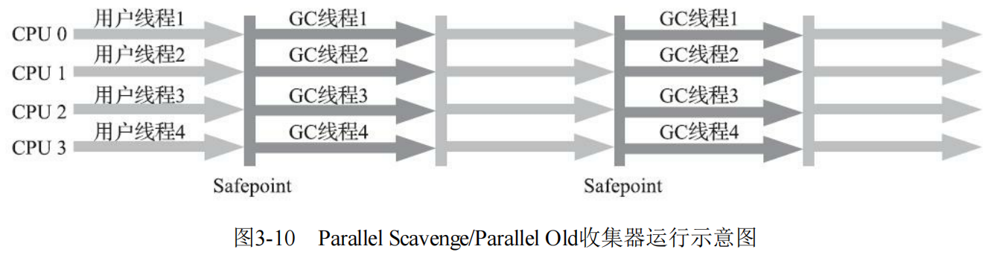


### <font color='#096ec2'>CMS收集器</font>

​		CMS（Concurrent Mark Sweep）收集器是一种以获取最短回收停顿时间为目标的收集器。目前很大一部分的Java应用集中在互联网网站或者基于浏览器的B/S系统的服务端上，这类应用通常都会较为关注服务的响应速度，希望系统停顿时间尽可能短，以给用户带来良好的交互体验。CMS收集器就非常符合这类应用的需求。从名字（包含“Mark Sweep”）上就可以看出CMS收集器是基于标记-清除算法实现的，它的运作过程相对于前面几种收集器来说要更复杂一些，整个过程分为四个步骤，包括：

- **初始标记（CMS initial mark）**：仅仅只是标记一下GC Roots能直接关联到的对象，速度很快；
- **并发标记阶段（CMS concurrent mark）**：就是从GC Roots的直接关联对象开始遍历整个对象图的过程，这个过程耗时较长但是不需要停顿用户线程，可以与垃圾收集线程一起并发运行；
- **重新标记阶段（CMS remark）**：则是为了修正并发标记期间，因用户程序继续运作而导致标记产生变动的那一部分对象的标记记录（详见3.4.6节中关于增量更新的讲解），这个阶段的停顿时间通常会比初始标记阶段稍长一些，但也远比并发标记阶段的时间短；
- **并发清除阶段（CMS concurrent sweep）**：清理删除掉标记阶段判断的已经死亡的对象，由于不需要移动存活对象，所以这个阶段也是可以与用户线程同时并发的。

​		其中初始标记、重新标记这两个步骤仍然需要“Stop The World”。

​		由于在整个过程中耗时最长的并发标记和并发清除阶段中，垃圾收集器线程都可以与用户线程一起工作，所以从总体上来说，CMS收集器的内存回收过程是与用户线程一起并发执行的。通过图3-11可以比较清楚地看到CMS收集器的运作步骤中并发和需要停顿的阶段。

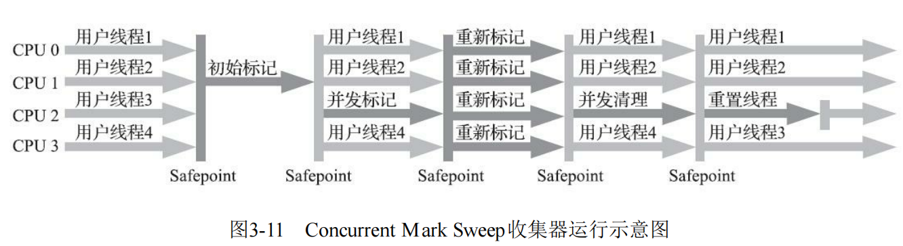

​		CMS是一款优秀的收集器，它最主要的优点在名字上已经体现出来：并发收集、低停顿，一些官方公开文档里面也称之为“并发低停顿收集器”（Concurrent Low Pause Collector）。CMS收集器是HotSpot虚拟机追求低停顿的第一次成功尝试，但是它还远达不到完美的程度，至少有以下三个明显的缺点：

​		**首先，CMS收集器对处理器资源非常敏感。**事实上，面向并发设计的程序都对处理器资源比较敏感。在并发阶段，它虽然不会导致用户线程停顿，但却会因为占用了一部分线程（或者说处理器的计算能力）而导致应用程序变慢，降低总吞吐量。CMS默认启动的回收线程数是（处理器核心数量+3）/4，也就是说，如果处理器核心数在四个或以上，并发回收时垃圾收集线程只占用不超过25%的处理器运算资源，并且会随着处理器核心数量的增加而下降。但是当处理器核心数量不足四个时，CMS对用户程序的影响就可能变得很大。如果应用本来的处理器负载就很高，还要分出一半的运算能力去执行收集器线程，就可能导致用户程序的执行速度忽然大幅降低。为了缓解这种情况，虚拟机提供了一种称为“增量式并发收集器”（Incremental Concurrent Mark Sweep/i-CMS）的CMS收集器变种，所做的事情和以前单核处理器年代PC机操作系统靠抢占式多任务来模拟多核并行多任务的思想一样，是在并发标记、清理的时候让收集器线程、用户线程交替运行，尽量减少垃圾收集线程的独占资源的时间，这样整个垃圾收集的过程会更长，但对用户程序的影响就会显得较少一些，直观感受是速度变慢的时间更多了，但速度下降幅度就没有那么明显。实践证明增量式的CMS收集器效果很一般，从JDK 7开始，i-CMS模式已经被声明为“deprecated”，即已过时不再提倡用户使用，到JDK 9发布后i-CMS模式被完全废弃。

​		**然后，由于CMS收集器无法处理“浮动垃圾”（Floating Garbage），有可能出现“Con-current Mode Failure”失败进而导致另一次完全“Stop The World”的Full GC的产生。**在CMS的并发标记和并发清理阶段，用户线程是还在继续运行的，程序在运行自然就还会伴随有新的垃圾对象不断产生，但这一部分垃圾对象是出现在标记过程结束以后，CMS无法在当次收集中处理掉它们，只好留待下一次垃圾收集时再清理掉。这一部分垃圾就称为“浮动垃圾”。同样也是由于在垃圾收集阶段用户线程还需要持续运行，那就还需要预留足够内存空间提供给用户线程使用，因此CMS收集器不能像其他收集器那样等待到老年代几乎完全被填满了再进行收集，必须预留一部分空间供并发收集时的程序运作使用。在JDK 5的默认设置下，CMS收集器当老年代使用了68%的空间后就会被激活，这是一个偏保守的设置，如果在实际应用中老年代增长并不是太快，可以适当调高参数-XX:CMSInitiatingOccu-pancyFraction的值来提高CMS的触发百分比，降低内存回收频率，获取更好的性能。到了JDK 6时，CMS收集器的启动阈值就已经默认提升至92%。但这又会更容易面临另一种风险：要是CMS运行期间预留的内存无法满足程序分配新对象的需要，就会出现一次“并发失败”（Concurrent Mode Failure），这时候虚拟机将不得不启动后备预案：冻结用户线程的执行，临时启用Serial Old收集器来重新进行老年代的垃圾收集，但这样停顿时间就很长了。所以参数-XX:CMSInitiatingOccupancyFraction设置得太高将会很容易导致大量的并发失败产生，性能反而降低，用户应在生产环境中根据实际应用情况来权衡设置。

​		**还有最后一个缺点，在本节的开头曾提到，CMS是一款基于“标记-清除”算法实现的收集器，如果读者对前面这部分介绍还有印象的话，就可能想到这意味着收集结束时会有大量空间碎片产生。**空间碎片过多时，将会给大对象分配带来很大麻烦，往往会出现老年代还有很多剩余空间，但就是无法找到足够大的连续空间来分配当前对象，而不得不提前触发一次Full GC的情况。为了解决这个问题，CMS收集器提供了一个-XX:+UseCMS-CompactAtFullCollection开关参数（默认是开启的，此参数从JDK 9开始废弃），用于在CMS收集器不得不进行Full GC时开启内存碎片的合并整理过程，由于这个内存整理必须移动存活对象，（在Shenandoah和ZGC出现前）是无法并发的。这样空间碎片问题是解决了，但停顿时间又会变长，因此虚拟机设计者们还提供了另外一个参数-XX:CMSFullGCsBeforeCompaction（此参数从JDK 9开始废弃），这个参数的作用是要求CMS收集器在执行过若干次（数量由参数值决定）不整理空间的Full GC之后，下一次进入Full GC前会先进行碎片整理（默认值为0，表示每次进入Full GC时都进行碎片整理）。

​		**问题：**浮动垃圾是在哪个阶段产生的？为什么重新标记的过程没有处理掉之前的浮动垃圾？


### Garbage First收集器


## <font color='#096ec2'>选择合适的垃圾收集器</font>

### <font color='#096ec2'>Epsilon收集器</font>


<font color='#096ec2'>收集器的权衡</font>

​		我们应该如何选择一款适合自己应用的收集器呢？这个问题的答案主要受以下三个因素影响：

- 应用程序的主要关注点是什么？如果是数据分析、科学计算类的任务，目标是能尽快算出结果，那吞吐量就是主要关注点；如果是SLA应用，那停顿时间直接影响服务质量，严重的甚至会导致事务超时，这样延迟就是主要关注点；而如果是客户端应用或者嵌入式应用，那垃圾收集的内存占用则是不可忽视的。

- 运行应用的基础设施如何？譬如硬件规格，要涉及的系统架构是x86-32/64、SPARC还是ARM/Aarch64；处理器的数量多少，分配内存的大小；选择的操作系统是Linux、Solaris还是Windows等。

- 使用JDK的发行商是什么？版本号是多少？是ZingJDK/Zulu、OracleJDK、Open-JDK、OpenJ9抑或是其他公司的发行版？该JDK对应了《Java虚拟机规范》的哪个版本？


​		一般来说，收集器的选择就从以上这几点出发来考虑。举个例子，假设某个直接面向用户提供服务的**B/S系统**准备选择垃圾收集器，一般来说延迟时间是这类应用的主要关注点，那么：

- 如果你有充足的预算但没有太多调优经验，那么一套带商业技术支持的专有硬件或者软件解决方案是不错的选择，Azul公司以前主推的Vega系统和现在主推的Zing VM是这方面的代表，这样你就可以使用传说中的C4收集器了。

- 如果你虽然没有足够预算去使用商业解决方案，但能够掌控软硬件型号，使用较新的版本，同时又特别注重延迟，那ZGC很值得尝试。

- 如果你对还处于实验状态的收集器的稳定性有所顾虑，或者应用必须运行在Win-dows操作系统下，那ZGC就无缘了，试试Shenandoah吧。

- 如果你接手的是遗留系统，软硬件基础设施和JDK版本都比较落后，那就根据内存规模衡量一下，对于大概4GB到6GB以下的堆内存，CMS一般能处理得比较好，而对于更大的堆内存，可重点考察一下G1。


<font color='#096ec2'>虚拟机及垃圾收集器日志</font>

​		阅读分析虚拟机和垃圾收集器的日志是处理Java虚拟机内存问题必备的基础技能，垃圾收集器日志是一系列人为设定的规则，多少有点随开发者编码时的心情而定，没有任何的“业界标准”可言，换句话说，每个收集器的日志格式都可能不一样。除此以外还有一个麻烦，在JDK 9以前，HotSpot并没有提供统一的日志处理框架，虚拟机各个功能模块的日志开关分布在不同的参数上，日志级别、循环日志大小、输出格式、重定向等设置在不同功能上都要单独解决。直到JDK 9，这种混乱不堪的局面才终于消失，HotSpot所有功能的日志都收归到了“-Xlog”参数上，这个参数的能力也相应被极大拓展了：

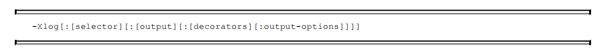

​		命令行中最关键的参数是选择器（Selector），它由标签（Tag）和日志级别（Level）共同组成。标签可理解为虚拟机中某个功能模块的名字，它告诉日志框架用户希望得到虚拟机哪些功能的日志输出。垃圾收集器的标签名称为“gc”，由此可见，垃圾收集器日志只是HotSpot众多功能日志的其中一项，全部支持的功能模块标签名如下所示：

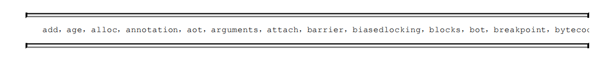

​		日志级别从低到高，共有Trace，Debug，Info，Warning，Error，Off六种级别，日志级别决定了输出信息的详细程度，默认级别为Info，HotSpot的日志规则与Log4j、SLF4j这类Java日志框架大体上是一致的。另外，还可以使用修饰器（Decorator）来要求每行日志输出都附加上额外的内容，支持附加在日志行上的信息包括：

- time：当前日期和时间。
- uptime：虚拟机启动到现在经过的时间，以秒为单位。
- timemillis：当前时间的毫秒数，相当于System.currentTimeMillis()的输出。
- uptimemillis：虚拟机启动到现在经过的毫秒数。
- timenanos：当前时间的纳秒数，相当于System.nanoTime()的输出。
- uptimenanos：虚拟机启动到现在经过的纳秒数。
- pid：进程ID。
- tid：线程ID。
- level：日志级别。
- tags：日志输出的标签集。

​		如果不指定，默认值是uptime、level、tags这三个，此时日志输出类似于以下形式：

<font color='#096ec2'></font>

<font color='#096ec2'></font>


