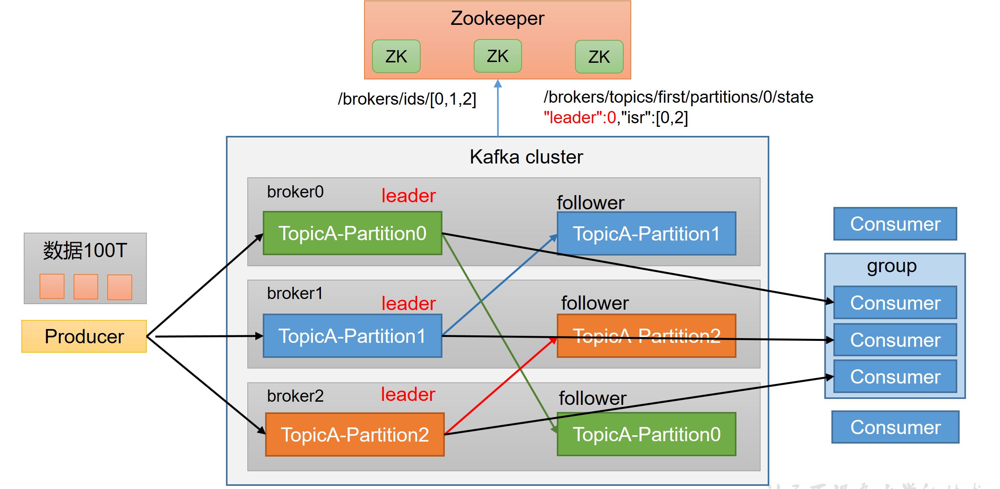

# 安装

https://kafka.apache.org/downloads

## jdk

**jdk一定要设置JAVA_HOME**

## zookeeper

```sh
tar -zxvf zookeeper-3.4.14.tar.gz
cd zookeeper-3.4.14 
cd conf/
cp zoo_sample.cfg zoo.cfg
cd ../bin
bash zkServer.sh start

# 关闭
bash zkServer.sh stop
```

## kafka

```sh
cd ./config
```

### 修改server.properties

```sh
# broker的全局唯一编号，不能重复
broker.id=0
#用来监听链接的端口，producer或consumer将在此端口建立连接
port=9092
#处理网络请求的线程数量
num.network.threads=3
#用来处理磁盘IO的线程数量
num.io.threads=8
#发送套接字的缓冲区大小
socket.send.buffer.bytes=102400
#接受套接字的缓冲区大小
socket.receive.buffer.bytes=102400
#请求套接字的缓冲区大小
socket.request.max.bytes=104857600
#kafka消息存放的路径
log.dirs=/home/servers-kafka/logs/kafka
#topic在当前broker上的分片个数
num.partitions=2
#用来恢复和清理data下数据的线程数量
num.recovery.threads.per.data.dir=1
#segment文件保留的最长时间，超时将被删除
log.retention.hours=168
#滚动生成新的segment文件的最大时间
log.roll.hours=168
#日志文件中每个segment的大小，默认为1G
log.segment.bytes=1073741824
#周期性检查文件大小的时间
log.retention.check.interval.ms=300000
#日志清理是否打开
log.cleaner.enable=true
#broker需要使用zookeeper保存meta数据
zookeeper.connect=hadoop02:2181,hadoop03:2181,hadoop04:2181
#zookeeper链接超时时间
zookeeper.connection.timeout.ms=6000
#partion buffer中，消息的条数达到阈值，将触发flush到磁盘
log.flush.interval.messages=10000
#消息buffer的时间，达到阈值，将触发flush到磁盘
log.flush.interval.ms=3000
#删除topic需要server.properties中设置delete.topic.enable=true否则只是标记删除
delete.topic.enable=true
#此处的host.name为本机IP(重要),如果不改,则客户端会抛出:Producerconnection to localhost:9092 unsuccessful 错误!
host.name=hadoop02
```


 

### 修改producer.properties

 

```sh
#指定kafka节点列表，用于获取metadata，不必全部指定
metadata.broker.list=hadoop02:9092,hadoop03:9092
# 指定分区处理类。默认kafka.producer.DefaultPartitioner，表通过key哈希到对应分区
#partitioner.class=kafka.producer.DefaultPartitioner
# 是否压缩，默认0表示不压缩，1表示用gzip压缩，2表示用snappy压缩。压缩后消息中会有头来指明消息压缩类型，故在消费者端消息解压是透明的无需指定。
compression.codec=none
# 指定序列化处理类
serializer.class=kafka.serializer.DefaultEncoder
# 如果要压缩消息，这里指定哪些topic要压缩消息，默认empty，表示不压缩。
#compressed.topics=
# 设置发送数据是否需要服务端的反馈,有三个值0,1,-1
# 0: producer不会等待broker发送ack
# 1: 当leader接收到消息之后发送ack
# -1: 当所有的follower都同步消息成功后发送ack.
request.required.acks=0
#在向producer发送ack之前,broker允许等待的最大时间 ，如果超时,broker将会向producer发送一个error ACK.意味着上一次消息因为某种原因未能成功(比如follower未能同步成功)
request.timeout.ms=10000
# 同步还是异步发送消息，默认“sync”表同步，"async"表异步。异步可以提高发送吞吐量,也意味着消息将会在本地buffer中,并适时批量发送，但是也可能导致丢失未发送过去的消息
producer.type=sync
# 在async模式下,当message被缓存的时间超过此值后,将会批量发送给broker,默认为5000ms
# 此值和batch.num.messages协同工作.
queue.buffering.max.ms = 5000
# 在async模式下,producer端允许buffer的最大消息量
# 无论如何,producer都无法尽快的将消息发送给broker,从而导致消息在producer端大量沉积
# 此时,如果消息的条数达到阀值,将会导致producer端阻塞或者消息被抛弃，默认为10000
queue.buffering.max.messages=20000
# 如果是异步，指定每次批量发送数据量，默认为200
batch.num.messages=500
# 当消息在producer端沉积的条数达到"queue.buffering.max.meesages"后
# 阻塞一定时间后,队列仍然没有enqueue(producer仍然没有发送出任何消息)
# 此时producer可以继续阻塞或者将消息抛弃,此timeout值用于控制"阻塞"的时间
# -1: 无阻塞超时限制,消息不会被抛弃
# 0:立即清空队列,消息被抛弃
queue.enqueue.timeout.ms=-1
# 当producer接收到error ACK,或者没有接收到ACK时,允许消息重发的次数
# 因为broker并没有完整的机制来避免消息重复,所以当网络异常时(比如ACK丢失)
# 有可能导致broker接收到重复的消息,默认值为3.
message.send.max.retries=3
# producer刷新topicmetada的时间间隔,producer需要知道partitionleader的位置,以及当前topic的情况
# 因此producer需要一个机制来获取最新的metadata,当producer遇到特定错误时,将会立即刷新
#(比如topic失效,partition丢失,leader失效等),此外也可以通过此参数来配置额外的刷新机制，默认值600000
topic.metadata.refresh.interval.ms=60000
```

### 修改consumer.properties

 ```sh
 # zookeeper连接服务器地址
 zookeeper.connect=hadoop02:2181,hadoop03:2181,hadoop04:2181
 # zookeeper的session过期时间，默认5000ms，用于检测消费者是否挂掉
 zookeeper.session.timeout.ms=5000
 #当消费者挂掉，其他消费者要等该指定时间才能检查到并且触发重新负载均衡
 zookeeper.connection.timeout.ms=10000
 # 指定多久消费者更新offset到zookeeper中。注意offset更新时基于time而不是每次获得的消息。一旦在更新zookeeper发生异常并重启，将可能拿到已拿到过的消息
 zookeeper.sync.time.ms=2000
 #指定消费组
 group.id=xxx
 # 当consumer消费一定量的消息之后,将会自动向zookeeper提交offset信息
 # 注意offset信息并不是每消费一次消息就向zk提交一次,而是现在本地保存(内存),并定期提交,默认为true
 auto.commit.enable=true
 # 自动更新时间。默认60 * 1000
 auto.commit.interval.ms=1000
 # 当前consumer的标识,可以设定,也可以有系统生成,主要用来跟踪消息消费情况,便于观察
 conusmer.id=xxx
 # 消费者客户端编号，用于区分不同客户端，默认客户端程序自动产生
 client.id=xxxx
 # 最大取多少块缓存到消费者(默认10)
 queued.max.message.chunks=50
 # 当有新的consumer加入到group时,将会reblance,此后将会有partitions的消费端迁移到新 的consumer上,如果一个consumer获得了某个partition的消费权限,那么它将会向zk注册"Partition Owner registry"节点信息,但是有可能此时旧的consumer尚没有释放此节点, 此值用于控制,注册节点的重试次数.
 rebalance.max.retries=5
 # 获取消息的最大尺寸,broker不会像consumer输出大于此值的消息chunk 每次feth将得到多条消息,此值为总大小,提升此值,将会消耗更多的consumer端内存
 fetch.min.bytes=6553600
 # 当消息的尺寸不足时,server阻塞的时间,如果超时,消息将立即发送给consumer
 fetch.wait.max.ms=5000
 socket.receive.buffer.bytes=655360
 # 如果zookeeper没有offset值或offset值超出范围。那么就给个初始的offset。有smallest、largest、anything可选，分别表示给当前最小的offset、当前最大的offset、抛异常。默认largest
 auto.offset.reset=smallest
 # 指定序列化处理类
 derializer.class=kafka.serializer.DefaultDecoder
 ```


 

### 分发安装包到其他节点

  以上的步骤我们操作了一个节点，还有两个节点，我们可以直接将刚刚配置好的直接分发到其它两个节点。因为配置文件都是一样的，唯一不同的是 borker.id不同就行。（以下的命令中，hadoop03和hadoop04是我另外两个节点的别名，如果你们没起别名，可以用节点的ip代替。）

 ```bash
 scp –r /usr/local/ kafka_2.11-0.9.0.1 hadoop03:/usr/local
 scp –r /usr/local/ kafka_2.11-0.9.0.1 hadoop04:/usr/local
 ```


修改其他两个节点中的server.properties中的 broker.id,分别设置为 0,1,2

 

### 配置启动

 a. 启动zookeeper 

```bash
#启动zookeeper 指定 zookeeper 配置文件
./bin/zookeeper-server-start.sh ./config/zookeeper.properties
```

b. 启动kafka

```bash
#打开kafka配置文件，开启监听端口
vim server.properties
listeners=PLAINTEXT://localhost:9092
#启动kafka 服务
./bin/kafka-server-start.sh ./config/server.properties
#注意 kafka基于zookeeper，必须先启动zookeeper ，再启动kafka
```

c.启动消费者

```bash
./bin/kafka-console-consumer.sh --bootstrap-server localhost:9092 --topic test --from-beginning
```

d.启动生产者
```bash
./bin/kafka-console-producer.sh --broker-list localhost:9092 --topic test
```


## 命令行操作




### 主题命令行操作

- 查看操作主题命令参数

```sh
[atguigu@hadoop102 kafka]$ bin/kafka-topics.sh
```

| 参数                                              | 描述                                 |
| ------------------------------------------------- | ------------------------------------ |
| --bootstrap-server <String: server  toconnect to> | 连接的Kafka Broker主机名称和端口号。 |
| --topic <String: topic>                           | 操作的topic名称。                    |
| --create                                          | 创建主题。                           |
| --delete                                          | 删除主题。                           |
| --alter                                           | 修改主题。                           |
| --list                                            | 查看所有主题。                       |
| --describe                                        | 查看主题详细描述。                   |
| --partitions <Integer: # of  partitions>          | 设置分区数。                         |
| --replication-factor<Integer: replication factor> | 设置分区副本。                       |
| --config <String: name=value>                     | 更新系统默认的配置。                 |

- 查看当前服务器中的所有topic

```sh
[atguigu@hadoop102 kafka]$ bin/kafka-topics.sh --bootstrap-server localhost:9092 --list
```

- 创建first topic

```sh
[atguigu@hadoop102 kafka]$ bin/kafka-topics.sh --bootstrap-server hadoop102:9092 --create --partitions 1 --replication-factor 3 --topic first
```

选项说明：

--topic 定义topic名

--replication-factor 定义副本数

--partitions 定义分区数

- 查看first主题的详情

```sh
[atguigu@hadoop102 kafka]$ bin/kafka-topics.sh --bootstrap-server hadoop102:9092 --describe --topic first
```

- 修改分区数（注意：分区数只能增加，不能减少）

```sh
[atguigu@hadoop102 kafka]$ bin/kafka-topics.sh --bootstrap-server hadoop102:9092 --alter --topic first --partitions 3
```

- 再次查看first主题的详情

```sh
[atguigu@hadoop102 kafka]$ bin/kafka-topics.sh --bootstrap-server hadoop102:9092 --describe --topic first
```

- 删除topic（学生自己演示）

```sh
[atguigu@hadoop102 kafka]$ bin/kafka-topics.sh --bootstrap-server hadoop102:9092 --delete --topic first
```

### 生产者命令行操作

- 查看操作生产者命令参数

```sh
[atguigu@hadoop102 kafka]$ bin/kafka-console-producer.sh
```

| 参数                                              | 描述                                 |
| ------------------------------------------------- | ------------------------------------ |
| --bootstrap-server <String: server  toconnect to> | 连接的Kafka Broker主机名称和端口号。 |
| --topic <String: topic>                           | 操作的topic名称。                    |

- 发送消息

```bash
[atguigu@hadoop102 kafka]$ bin/kafka-console-producer.sh --bootstrap-server hadoop102:9092 --topic first
\>hello world
\>atguigu atguigu
```

### 消费者命令行操作

- 查看操作消费者命令参数

```bash
[atguigu@hadoop102 kafka]$ bin/kafka-console-consumer.sh
```

| 参数                                              | 描述                                 |
| ------------------------------------------------- | ------------------------------------ |
| --bootstrap-server <String: server  toconnect to> | 连接的Kafka Broker主机名称和端口号。 |
| --topic <String: topic>                           | 操作的topic名称。                    |
| --from-beginning                                  | 从头开始消费。                       |
| --group <String: consumer group id>               | 指定消费者组名称。                   |

- 消费消息

1. 消费first主题中的数据。

```sh
[atguigu@hadoop102 kafka]$ bin/kafka-console-consumer.sh --bootstrap-server hadoop102:9092 --topic first
```


2. 把主题中所有的数据都读取出来（包括历史数据）。

```sh
[atguigu@hadoop102 kafka]$ bin/kafka-console-consumer.sh --bootstrap-server hadoop102:9092 --from-beginning --topic first
```


# 基础架构


1. Producer：消息生产者，就是向Kafka broker发消息的客户端。

2. Consumer：消息消费者，向Kafka broker取消息的客户端。

3. Consumer Group（CG）：**消费者组，由多个consumer组成。**消费者组内每个消费者负责消费不同分区的数据，一个分区只能由一个组内消费者消费；消费者组之间互不影响。**所有的消费者都属于某个消费者组，即**消费者组是逻辑上的一个订阅者。

4. Broker：一台Kafka服务器就是一个broker。一个集群由多个broker组成。一个broker可以容纳多个topic。

5. Topic：**可以理解为一个队列，**生产者和消费者面向的都是一个topic。
6. Partition：**为了实现扩展性，一个非常大的topic可以分布到多个broker（即服务器）上，**一个topic可以分为多个partition，每个partition是一个有序的队列。
7. Replica：副本。一个topic的每个分区都有若干个副本，一个Leader和若干个Follower。
8. Leader：每个分区多个副本的“主”，生产者发送数据的对象，以及消费者消费数据的对象都是Leader。
9. Follower：每个分区多个副本中的“从”，实时从Leader中同步数据，保持和Leader数据的同步。Leader发生故障时，某个Follower会成为新的Leader。


# 生产者

## 生产者消息发送流程

### 发送原理

在消息发送的过程中，涉及到了两个线程——main线程和Sender线程。在main线程中创建了一个双端队列RecordAccumulator。main线程将消息发送给RecordAccumulator，Sender线程不断从RecordAccumulator中拉取消息发送到Kafka Broker。


### <font color = 'red'>生产者重要参数列表</font>

| 参数名称                                           | 描述                                                         |
| -------------------------------------------------- | ------------------------------------------------------------ |
| <font color = 'red'>**bootstrap.servers**  </font> | 生产者连接集群所需的broker地址清单。例如hadoop102:9092,hadoop103:9092,hadoop104:9092，可以设置1个或者多个，中间用逗号隔开。注意这里并非需要所有的broker地址，因为生产者从给定的broker里查找到其他broker信息。 |
| key.serializer和value.serializer                   | 指定发送消息的key和value的序列化类型。一定要写全类名。       |
| buffer.memory                                      | RecordAccumulator缓冲区总大小，默认32m。                     |
| batch.size                                         | 缓冲区一批数据最大值，默认16k。适当增加该值，可以提高吞吐量，但是如果该值设置太大，会导致数据传输延迟增加。 |
| linger.ms                                          | 如果数据迟迟未达到batch.size，sender等待linger.time之后就会发送数据。单位ms，默认值是0ms，表示没有延迟。生产环境建议该值大小为5-100ms之间。 |
| <font color = 'red'>acks  </font>                  | 0：生产者发送过来的数据，不需要等数据落盘应答。  1：生产者发送过来的数据，Leader收到数据后应答。  -1（all）：生产者发送过来的数据，Leader+和isr队列里面的所有节点收齐数据后应答。默认值是-1，-1和all是等价的。 |
| max.in.flight.requests.per.connection              | 允许最多没有返回ack的次数，默认为5，开启幂等性要保证该值是 1-5的数字。 |
| <font color = 'red'>retries  </font>               | 当消息发送出现错误的时候，系统会重发消息。retries表示重试次数。默认是int最大值，2147483647。  如果设置了重试，还想保证消息的有序性，需要设置  MAX_IN_FLIGHT_REQUESTS_PER_CONNECTION=1否则在重试此失败消息的时候，其他的消息可能发送成功了。 |
| retry.backoff.ms                                   | 两次重试之间的时间间隔，默认是100ms。                        |
| enable.idempotence                                 | 是否开启幂等性，默认true，开启幂等性。                       |
| <font color = 'red'>compression.type</font>        | 生产者发送的所有数据的压缩方式。默认是none，也就是不压缩。   支持压缩类型：none、gzip、snappy、lz4和zstd。 |

## 异步发送API

### 普通异步发送

需求：创建Kafka生产者，采用异步的方式发送到Kafka Broker


```java
private KafkaProducer<String, String> producer;
public static void main(String[] args) throws InterruptedException {
    // 1. 创建kafka生产者的配置对象
    Properties properties = new Properties();
    // 2. 给kafka配置对象添加配置信息：bootstrap.servers
    properties.put(ProducerConfig.BOOTSTRAP_SERVERS_CONFIG, KafkaConfig.server);
    // key,value序列化（必须）：key.serializer，value.serializer
    properties.put(ProducerConfig.KEY_SERIALIZER_CLASS_CONFIG, "org.apache.kafka.common.serialization.StringSerializer");
    properties.put(ProducerConfig.VALUE_SERIALIZER_CLASS_CONFIG, "org.apache.kafka.common.serialization.StringSerializer");
    // 3. 创建kafka生产者对象
    KafkaProducer<String, String> kafkaProducer = new KafkaProducer<>(properties);
    // 4. 调用send方法,发送消息
    for (int i = 0; i < 5; i++) {
        String msg = "sz-msg:" + i;
        ProducerRecord<String, String> record = new ProducerRecord<>(KafkaConfig.topic, msg);
        kafkaProducer.send(record);
        System.out.println("Sent message " + msg);
    }
    // 5. 关闭资源
    kafkaProducer.close();
}
```


### 3.2.2 带回调函数的异步发送

回调函数会在producer收到ack时调用，为异步调用，该方法有两个参数，分别是元数据信息（RecordMetadata）和异常信息（Exception），如果Exception为null，说明消息发送成功，如果Exception不为null，说明消息发送失败。


<font color = 'red'>**注意：消息发送失败会自动重试，不需要我们在回调函数中手动重试。**</font>

```java
public static void main(String[] args) throws InterruptedException {
    // 1. 创建kafka生产者的配置对象
    Properties properties = new Properties();
    // 2. 给kafka配置对象添加配置信息
    properties.put(ProducerConfig.BOOTSTRAP_SERVERS_CONFIG, KafkaConfig.server);
    // key,value序列化（必须）：key.serializer，value.serializer
    properties.put(ProducerConfig.KEY_SERIALIZER_CLASS_CONFIG, StringSerializer.class.getName());
    properties.put(ProducerConfig.VALUE_SERIALIZER_CLASS_CONFIG, StringSerializer.class.getName());
    // 3. 创建kafka生产者对象
    KafkaProducer<String, String> kafkaProducer = new KafkaProducer<>(properties);
    // 4. 调用send方法,发送消息
    for (int i = 0; i < 5; i++) {
        // 添加回调
        kafkaProducer.send(new ProducerRecord<>(KafkaConfig.topic, "atguigu " + i), new Callback() {
            // 该方法在Producer收到ack时调用，为异步调用
            @Override
            public void onCompletion(RecordMetadata metadata, Exception exception) {
                if (exception == null) {
                    // 没有异常,输出信息到控制台
                    System.out.println("主题：" + metadata.topic() + "->"  + "分区：" + metadata.partition());
                } else {
                    // 出现异常打印
                    exception.printStackTrace();
                }
            }
        });
        // 延迟一会会看到数据发往不同分区
        Thread.sleep(2);
    }
    // 5. 关闭资源
    kafkaProducer.close();
}
```


## 同步发送API


只需在异步发送的基础上，再调用一下get()方法即可。

```java
public static void main(String[] args) throws InterruptedException, ExecutionException {
    // 1. 创建kafka生产者的配置对象
    Properties properties = new Properties();
    // 2. 给kafka配置对象添加配置信息
    properties.put(ProducerConfig.BOOTSTRAP_SERVERS_CONFIG, KafkaConfig.server);
    // key,value序列化（必须）：key.serializer，value.serializer
    properties.put(ProducerConfig.KEY_SERIALIZER_CLASS_CONFIG, StringSerializer.class.getName());
    properties.put(ProducerConfig.VALUE_SERIALIZER_CLASS_CONFIG, StringSerializer.class.getName());
    // 3. 创建kafka生产者对象
    KafkaProducer<String, String> kafkaProducer = new KafkaProducer<String, String>(properties);
    // 4. 调用send方法,发送消息
    for (int i = 0; i < 10; i++) {
        // 异步发送 默认
        //            kafkaProducer.send(new ProducerRecord<>("first","kafka" + i));
        // 同步发送
        kafkaProducer.send(new ProducerRecord<>(KafkaConfig.topic, "kafka" + i)).get();
    }
    // 5. 关闭资源
    kafkaProducer.close();
}
```


## 生产者分区

### 分区好处

1. <font color = 'red'>便于合理使用存储资源，每个Partition在一个broker上存储，可以把海量数据按照分区切割成一块一块数据存储在多台Broker上。合理控制分区的任务，可以实现负载均衡的效果</font>
2. <font color = 'red'>提高并行度，生产者可以以分区为单位发送数据；消费者可以以分区为单位消费数据。</font>


### 生产者发送消息的分区策略

1默认的分区器 DefaultPartitioner

```java
/**
 * The default partitioning strategy:
 * <ul>
 * <li>If a partition is specified in the record, use it
 * <li>If no partition is specified but a key is present choose a partition based on a hash of the key
 * <li>If no partition or key is present choose the sticky partition that changes when the batch is full.
 * 
 * See KIP-480 for details about sticky partitioning.
 */
public class DefaultPartitioner implements Partitioner {}
```


