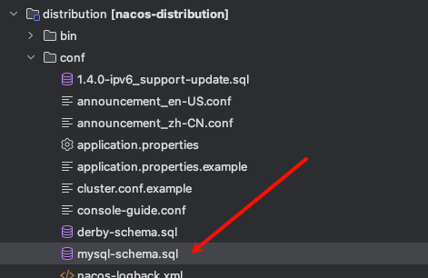
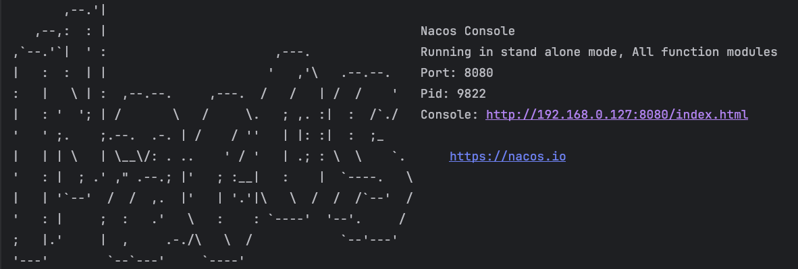
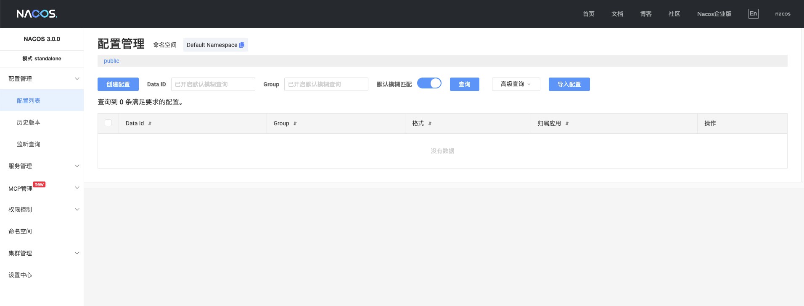
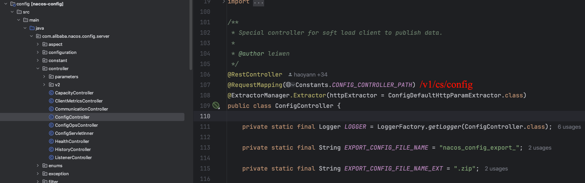

# 本地运行

## 下载源码

https://github.com/alibaba/nacos.git 

切换3.0.0分支

## docker安装mysql

```sh
docker pull mysql #下载最新镜像
docker run -itd --name=mysql -v mysql-config:/etc/mysql/conf.d  -v mysql-log:/logs -v mysql-data:/var/lib/mysql -p 3306:3306 -e MYSQL_ROOT_PASSWORD=123456 -e LANG=C.UTF-8 mysql #启动镜像
#创建数据库nacos
```

执行sql



## docker安装nacos

nacos自带数据库，这种安装不用指定数据库

```bash
docker pull nacos/nacos-server:v2.4.2
docker run -d   --name nacos-standalone   
-e MODE=standalone  
-e NACOS_AUTH_ENABLE=true 
-e NACOS_CORE_AUTH_ENABLE_USERAGENTAUTHWHITE=true # 没有这个参数，就得设置key  value
-e NACOS_AUTH_TOKEN=YWFhYmJiY2NjZGRkZWVlZmZmMDAwMDEyMzQ1Njc4OTA=    # 没有这个参数，无法启动
-e NACOS_APPLICATION_PORT=8848  
-v nacos-data:/home/nacos/data  
-p 8848:8848  
nacos/nacos-server:v2.4.2
```


## 修改配置

application.properties

```properties
spring.sql.init.platform=mysql
### Count of DB:
db.num=1

### Connect URL of DB:
db.url.0=jdbc:mysql://127.0.0.1:3306/nacos?characterEncoding=utf8&connectTimeout=1000&socketTimeout=3000&autoReconnect=true&useUnicode=true&useSSL=false&serverTimezone=UTC
db.user=root
db.password=sz962464
 
nacos.core.auth.server.identity.key=SecretKey012345678901234567890123456789012345678901234567890123456789
nacos.core.auth.server.identity.value=VGhpc0lzTXlDdXN0b21TZWNyZXRLZXkwMTIzNDU2Nzg=
nacos.core.auth.plugin.nacos.token.secret.key=VGhpc0lzTXlDdXN0b21TZWNyZXRLZXkwMTIzNDU2Nzg=
```

## 常见问题

如果启动报错，提示找不到protoc-3.8.0-osx-x86_64

下载地址：https://github.com/protocolbuffers/protobuf/releases

```sh
mvn install:install-file  -DgroupId=com.google.protobuf  -DartifactId=protoc -Dversion=3.8.0    -Dclassifier=osx-aarch_64     -Dpackaging=exe -Dfile=/Users/sunzhong/Downloads/protoc-3.8.0-osx-x86_64/bin/protoc
```


## 访问






# 使用

## Java SDK

### Maven坐标

```xml
<dependency>
    <groupId>com.alibaba.nacos</groupId>
    <artifactId>nacos-client</artifactId>
    <version>${version}</version>
</dependency>
```

## 配置管理

### 获取配置

#### 描述

用于服务启动的时候从 Nacos 获取配置。

```java
public String getConfig(String dataId, String group, long timeoutMs) throws NacosException
```

#### 请求参数

| 参数名  | 参数类型 | 描述                                                         |
| ------- | -------- | ------------------------------------------------------------ |
| dataId  | string   | 配置 ID，采用类似 package.class（如com.taobao.tc.refund.log.level）的命名规则保证全局唯一性，class 部分建议是配置的业务含义。全部字符小写。只允许英文字符和 4 种特殊字符（"."、":"、"-"、"_"），不超过 256 字节。 |
| group   | string   | 配置分组，建议填写产品名:模块名（Nacos:Test）保证唯一性，只允许英文字符和4种特殊字符（"."、":"、"-"、"_"），不超过128字节。 |
| timeout | long     | 读取配置超时时间，单位 ms，推荐值 3000。                     |

#### 返回值

| 参数类型 | 描述   |
| -------- | ------ |
| string   | 配置值 |


#### 异常说明

读取配置超时或网络异常，抛出 NacosException 异常。

### 监听配置

#### 描述

如果希望 Nacos 推送配置变更，可以使用 Nacos 动态监听配置接口来实现。

```java
public void addListener(String dataId, String group, Listener listener) 
```


#### 请求参数

| 参数名   | 参数类型 | 描述                                                         |
| -------- | -------- | ------------------------------------------------------------ |
| dataId   | string   | 配置 ID，采用类似 package.class（如com.taobao.tc.refund.log.level）的命名规则保证全局唯一性，class 部分建议是配置的业务含义。 全部字符小写。只允许英文字符和 4 种特殊字符（"."、":"、"-"、"_"）。不超过 256 字节。 |
| group    | string   | 配置分组，建议填写**产品名：模块名**（如 Nacos:Test）保证唯一性。 只允许英文字符和4种特殊字符（"."、":"、"-"、"_"），不超过128字节。 |
| listener | Listener | 监听器，配置变更进入监听器的回调函数。                       |

#### 返回值

| 参数类型 | 描述                                                   |
| -------- | ------------------------------------------------------ |
| string   | 配置值，初始化或者配置变更的时候通过回调函数返回该值。 |

#### 请求示例

```java
public static void main(String[] args) {
        SpringApplication.run(MvnwebApplication.class, args);
        try {
            String serverAddr = "127.0.0.1:8848";
            //初始化配置中心的Nacos Java SDK
            String dataId = "dataId-nacos";
            String group = "DEFAULT-GROUP";
            ConfigService configService = NacosFactory.createConfigService(serverAddr);

            String config = configService.getConfig(dataId, group, 2000L);
            System.out.println("config=====" + config);

            configService.addListener(dataId, group, new Listener() {
                @Override
                public Executor getExecutor() {
                    return null;
                }
                @Override
                public void receiveConfigInfo(String configInfo) {
                    System.out.println("configInfo======" + configInfo);
                }
            });
        } catch (Exception e) {
        }
    }
```

### 发布配置

#### 描述

用于通过程序自动发布 Nacos 配置，以便通过自动化手段降低运维成本。

注意：创建和修改配置时使用的同一个发布接口，当配置不存在时会创建配置，当配置已存在时会更新配置。

```java
public boolean publishConfig(String dataId, String group, String content) throws NacosException;
public boolean publishConfig(String dataId, String group, String content, String type) throws NacosException;
```

#### 请求参数

| 参数名  | 参数类型 | 描述                                                         |
| ------- | -------- | ------------------------------------------------------------ |
| dataId  | string   | 配置 ID，采用类似 `package.class`（如 `com.taobao.tc.refund.log.level`）的命名规则保证全局唯一性。建议根据配置的业务含义来定义 class 部分。全部字符均为小写。只允许英文字符和 4 种特殊字符（“.”、“:”、“-”、“_”），不超过 256 字节。 |
| group   | string   | 配置分组，建议填写`产品名:模块名`（如 Nacos`:Test`）来保证唯一性。只允许英文字符和 4 种特殊字符（“.”、“:”、“-”、“_”），不超过 128 字节。 |
| content | string   | 配置内容，不超过 100K 字节。                                 |
| type    | string   | @Since 1.4.1. 配置类型，见 `com.alibaba.nacos.api.config.ConfigType`，默认为TEXT |

#### 返回参数

| 参数类型 | 描述         |
| -------- | ------------ |
| boolean  | 是否发布成功 |

#### 请求示例

```java
try {
    // 初始化配置服务，控制台通过示例代码自动获取下面参数
    String serverAddr = "{serverAddr}";
    String dataId = "{dataId}";
    String group = "{group}";
    Properties properties = new Properties();
    properties.put("serverAddr", serverAddr);
    ConfigService configService = NacosFactory.createConfigService(properties);
    boolean isPublishOk = configService.publishConfig(dataId, group, "content");
    System.out.println(isPublishOk);
} catch (NacosException e) {
    e.printStackTrace();
}
```

#### 异常说明

读取配置超时或网络异常，抛出 NacosException 异常。

## 服务发现API

### <font color="red">注册实例</font>

#### 描述

注册一个实例到服务。

> 由于同一个Nacos Client实例，仅能向一个服务注册一个实例；若同一个Nacos Client实例多次向同一个服务注册实例，后注册的实例将会覆盖先注册的实例。 若有存在代理注册的场景，请使用[批量注册服务实例](https://nacos.io/docs/v2.4/manual/user/java-sdk/usage/?spm=5238cd80.3a4808a9.0.0.32bf411dHvXz6l#48-批量注册服务实例)

```java
void registerInstance(String serviceName, String ip, int port) throws NacosException;
void registerInstance(String serviceName, String groupName, String ip, int port) throws NacosException;
void registerInstance(String serviceName, String ip, int port, String clusterName) throws NacosException;
void registerInstance(String serviceName, String groupName, String ip, int port, String clusterName) throws NacosException;
void registerInstance(String serviceName, Instance instance) throws NacosException;
void registerInstance(String serviceName, String groupName, Instance instance) throws NacosException;
```

#### 请求参数

| 名称        | 类型         | 描述         | 默认值        |
| ----------- | ------------ | ------------ | ------------- |
| serviceName | 字符串       | 服务名       | 无，必填      |
| groupName   | 字符串       | 分组名       | DEFAULT_GROUP |
| ip          | 字符串       | 服务实例IP   | 无，必填      |
| port        | int          | 服务实例port | 无，必填      |
| clusterName | 字符串       | 集群名       | DEFAULT       |
| instance    | 参见代码注释 | 实例属性     | 无，必填      |

#### 返回参数

无

#### 请求示例

```java
NamingService naming = NamingFactory.createNamingService(System.getProperty("serveAddr"));
//以下注册请求所造成的结果均一致, 注册分组名为`DEFAULT_GROUP`, 服务名为`nacos.test.service`的实例，实例的ip为`127.0.0.1`, port为`8848`, clusterName为`DEFAULT`.
naming.registerInstance("nacos.test.service", "127.0.0.1", 8848);
naming.registerInstance("nacos.test.service", "DEFAULT_GROUP", "127.0.0.1", 8848);
naming.registerInstance("nacos.test.service", "127.0.0.1", 8848, "DEFAULT");
naming.registerInstance("nacos.test.service", "DEFAULT_GROUP", "127.0.0.1", 8848, "DEFAULT");
Instance instance = new Instance();
instance.setIp("127.0.0.1");
instance.setPort(8848);
instance.setClusterName("DEFAULT");
naming.registerInstance("nacos.test.service", instance);
naming.registerInstance("nacos.test.service", "DEFAULT_GROUP", instance);
```

### 注销实例

#### 描述

删除服务下的一个实例。

> 若该服务是通过[批量注册服务实例](https://nacos.io/docs/v2.4/manual/user/java-sdk/usage/?spm=5238cd80.3a4808a9.0.0.32bf411dHvXz6l#48-批量注册服务实例)进行注册，使用注销实例进行注销时，将注销所有批量注册的实例。 若仅希望注销部分批量注册的实例，请使用[批量注销服务实例](https://nacos.io/docs/v2.4/manual/user/java-sdk/usage/?spm=5238cd80.3a4808a9.0.0.32bf411dHvXz6l#49-批量注销服务实例)

```java
void deregisterInstance(String serviceName, String ip, int port) throws NacosException;
void deregisterInstance(String serviceName, String groupName, String ip, int port) throws NacosException;
void deregisterInstance(String serviceName, String ip, int port, String clusterName) throws NacosException;
void deregisterInstance(String serviceName, String groupName, String ip, int port, String clusterName) throws NacosException;
void deregisterInstance(String serviceName, Instance instance) throws NacosException;
void deregisterInstance(String serviceName, String groupName, Instance instance);
```

#### 请求参数

| 名称        | 类型         | 描述         | 默认值        |
| ----------- | ------------ | ------------ | ------------- |
| serviceName | 字符串       | 服务名       | 无，必填      |
| groupName   | 字符串       | 分组名       | DEFAULT_GROUP |
| ip          | 字符串       | 服务实例IP   | 无，必填      |
| port        | int          | 服务实例port | 无，必填      |
| clusterName | 字符串       | 集群名       | DEFAULT       |
| instance    | 参见代码注释 | 实例属性     | 无，必填      |

#### 返回参数

无

#### 请求示例

```java
NamingService naming = NamingFactory.createNamingService(System.getProperty("serveAddr"));
//以下注销请求所造成的结果均一致, 注销分组名为`DEFAULT_GROUP`, 服务名为`nacos.test.service`的实例，实例的ip为`127.0.0.1`, port为`8848`, clusterName为`DEFAULT`.
naming.deregisterInstance("nacos.test.service", "127.0.0.1", 8848);
naming.deregisterInstance("nacos.test.service", "DEFAULT_GROUP", "127.0.0.1", 8848);
naming.deregisterInstance("nacos.test.service", "127.0.0.1", 8848, "DEFAULT");
naming.deregisterInstance("nacos.test.service", "DEFAULT_GROUP", "127.0.0.1", 8848, "DEFAULT");
Instance instance = new Instance();
instance.setIp("127.0.0.1");
instance.setPort(8848);
instance.setClusterName("DEFAULT");
naming.deregisterInstance("nacos.test.service", instance);
naming.deregisterInstance("nacos.test.service", "DEFAULT_GROUP", instance);
```

### 获取全部实例

#### 描述

获取服务下的所有实例。

```java
List<Instance> getAllInstances(String serviceName) throws NacosException;
List<Instance> getAllInstances(String serviceName, String groupName) throws NacosException;
List<Instance> getAllInstances(String serviceName, boolean subscribe) throws NacosException;
List<Instance> getAllInstances(String serviceName, String groupName, boolean subscribe) throws NacosException;
List<Instance> getAllInstances(String serviceName, List<String> clusters) throws NacosException;
List<Instance> getAllInstances(String serviceName, String groupName, List<String> clusters) throws NacosException;
List<Instance> getAllInstances(String serviceName, List<String> clusters, boolean subscribe) throws NacosException;
List<Instance> getAllInstances(String serviceName, String groupName, List<String> clusters, boolean subscribe) throws NacosException;
```

#### 请求参数

| 名称        | 类型       | 描述                                                         | 默认值        |
| ----------- | ---------- | ------------------------------------------------------------ | ------------- |
| serviceName | 字符串     | 服务名                                                       | 无，必填      |
| groupName   | 字符串     | 分组名                                                       | DEFAULT_GROUP |
| subscribe   | Boolean    | 是否订阅服务，为true时将会订阅该服务，同时查询优先通过内存缓存；为false时将直接查询Nacos Server | true          |
| clusters    | 字符串列表 | 实例的clusterName，空列表时将查询所有实例。                  | 空列表        |

#### 返回参数

List<Instance> 实例列表。

#### 请求示例

```java
NamingService naming = NamingFactory.createNamingService(System.getProperty("serveAddr"));
# 以下查询请求所造成的结果均一致.
System.out.println(naming.getAllInstances("nacos.test.service"));
System.out.println(naming.getAllInstances("nacos.test.service", "DEFAULT_GROUP"));
System.out.println(naming.getAllInstances("nacos.test.service", true));
System.out.println(naming.getAllInstances("nacos.test.service", "DEFAULT_GROUP", true));
System.out.println(naming.getAllInstances("nacos.test.service", new ArrayList<>()));
System.out.println(naming.getAllInstances("nacos.test.service", "DEFAULT_GROUP", new ArrayList<>()));
System.out.println(naming.getAllInstances("nacos.test.service", new ArrayList<>(), true));
System.out.println(naming.getAllInstances("nacos.test.service", "DEFAULT_GROUP", new ArrayList<>(), true));
```

### 获取健康或不健康实例列表

#### 描述

根据条件获取过滤后的实例列表。

```java
List<Instance> selectInstances(String serviceName, boolean healthy) throws NacosException;
List<Instance> selectInstances(String serviceName, String groupName, boolean healthy) throws NacosException;
List<Instance> selectInstances(String serviceName, boolean healthy, boolean subscribe) throws NacosException;
List<Instance> selectInstances(String serviceName, String groupName, boolean healthy, boolean subscribe) throws NacosException;
List<Instance> selectInstances(String serviceName, List<String> clusters, boolean healthy) throws NacosException;
List<Instance> selectInstances(String serviceName, String groupName, List<String> clusters, boolean healthy) throws NacosException;
List<Instance> selectInstances(String serviceName, List<String> clusters, boolean healthy, boolean subscribe) throws NacosException;
List<Instance> selectInstances(String serviceName, String groupName, List<String> clusters, boolean healthy, boolean subscribe) throws NacosException;
```

#### 请求参数

| 名称        | 类型       | 描述                                                         | 默认值        |
| ----------- | ---------- | ------------------------------------------------------------ | ------------- |
| serviceName | 字符串     | 服务名                                                       | 无，必填      |
| groupName   | 字符串     | 分组名                                                       | DEFAULT_GROUP |
| subscribe   | Boolean    | 是否订阅服务，为true时将会订阅该服务，同时查询优先通过内存缓存；为false时将直接查询Nacos Server | true          |
| clusters    | 字符串列表 | 实例的clusterName，空列表时将查询所有实例。                  | 空列表        |
| healthy     | boolean    | 是否健康，为true时仅会返回健康的实例列表，反之则返回不健康的实例列表。 | true          |

#### 返回参数

List<Instance> 实例列表。

#### 请求示例

```
NamingService naming = NamingFactory.createNamingService(System.getProperty("serveAddr"));
# 以下查询请求所造成的结果均一致.
System.out.println(naming.selectInstances("nacos.test.service", true));
System.out.println(naming.selectInstances("nacos.test.service", "DEFAULT_GROUP", true));
System.out.println(naming.selectInstances("nacos.test.service", true, true));
System.out.println(naming.selectInstances("nacos.test.service", "DEFAULT_GROUP", true, true));
System.out.println(naming.selectInstances("nacos.test.service", new ArrayList<>(), true));
System.out.println(naming.selectInstances("nacos.test.service", "DEFAULT_GROUP", new ArrayList<>(), true));
System.out.println(naming.selectInstances("nacos.test.service", new ArrayList<>(), true, true));
System.out.println(naming.selectInstances("nacos.test.service", "DEFAULT_GROUP", new ArrayList<>(), true, true));
```

### <font color="red">获取一个健康实例</font>

#### 描述

根据负载均衡算法随机获取一个健康实例。

```java
Instance selectOneHealthyInstance(String serviceName) throws NacosException;
Instance selectOneHealthyInstance(String serviceName, String groupName) throws NacosException;
Instance selectOneHealthyInstance(String serviceName, boolean subscribe) throws NacosException;
Instance selectOneHealthyInstance(String serviceName, String groupName, boolean subscribe) throws NacosException;
Instance selectOneHealthyInstance(String serviceName, List<String> clusters) throws NacosException;
Instance selectOneHealthyInstance(String serviceName, String groupName, List<String> clusters) throws NacosException;
Instance selectOneHealthyInstance(String serviceName, List<String> clusters, boolean subscribe) throws NacosException;
Instance selectOneHealthyInstance(String serviceName, String groupName, List<String> clusters, boolean subscribe) throws NacosException;
```

#### 请求参数

| 名称        | 类型       | 描述                                                         | 默认值        |
| ----------- | ---------- | ------------------------------------------------------------ | ------------- |
| serviceName | 字符串     | 服务名                                                       | 无，必填      |
| groupName   | 字符串     | 分组名                                                       | DEFAULT_GROUP |
| subscribe   | Boolean    | 是否订阅服务，为true时将会订阅该服务，同时查询优先通过内存缓存；为false时将直接查询Nacos Server | true          |
| clusters    | 字符串列表 | 实例的clusterName，空列表时将查询所有实例。                  | 空列表        |

#### 返回参数

Instance 实例。

#### 请求示例

```java
NamingService naming = NamingFactory.createNamingService(System.getProperty("serveAddr"));
# 以下查询请求所造成的结果均一致.
System.out.println(naming.selectOneHealthyInstance("nacos.test.service"));
System.out.println(naming.selectOneHealthyInstance("nacos.test.service", "DEFAULT_GROUP"));
System.out.println(naming.selectOneHealthyInstance("nacos.test.service", true));
System.out.println(naming.selectOneHealthyInstance("nacos.test.service", "DEFAULT_GROUP", true));
System.out.println(naming.selectOneHealthyInstance("nacos.test.service", new ArrayList<>()));
System.out.println(naming.selectOneHealthyInstance("nacos.test.service", "DEFAULT_GROUP", new ArrayList<>()));
System.out.println(naming.selectOneHealthyInstance("nacos.test.service", new ArrayList<>(), true));
System.out.println(naming.selectOneHealthyInstance("nacos.test.service", "DEFAULT_GROUP", new ArrayList<>(), true));
```

### <font color="red">监听服务</font>

#### 描述

监听服务下的实例列表变化。

```java
void subscribe(String serviceName, EventListener listener) throws NacosException;
void subscribe(String serviceName, String groupName, EventListener listener) throws NacosException;
void subscribe(String serviceName, List<String> clusters, EventListener listener) throws NacosException;
void subscribe(String serviceName, String groupName, List<String> clusters, EventListener listener) throws NacosException;
```

#### 请求参数

| 名称        | 类型          | 描述                                        | 默认值        |
| ----------- | ------------- | ------------------------------------------- | ------------- |
| serviceName | 字符串        | 服务名                                      | 无，必填      |
| groupName   | 字符串        | 分组名                                      | DEFAULT_GROUP |
| clusters    | 字符串列表    | 实例的clusterName，空列表时将查询所有实例。 | 空列表        |
| listener    | EventListener | 回调listener                                | 无，必填      |

#### 返回参数

无

#### 请求示例

```java
NamingService naming = NamingFactory.createNamingService(System.getProperty("serveAddr"));
EventListener serviceListener = event -> {
    if (event instanceof NamingEvent) {
        System.out.println(((NamingEvent) event).getServiceName());
        System.out.println(((NamingEvent) event).getInstances());
    }
};
naming.subscribe("nacos.test.service", serviceListener);
naming.subscribe("nacos.test.service", "DEFAULT_GROUP", serviceListener);
naming.subscribe("nacos.test.service", new ArrayList<>(), serviceListener);
naming.subscribe("nacos.test.service", "DEFAULT_GROUP", new ArrayList<>(), serviceListener);
```

#### 使用自定义线程池进行异步监听

Nacos 支持使用自定义线程池进行异步监听回调，只需要将`EventListener`更换为`AbstractEventListener`，并实现`Executor getExecutor()`方法来返回自定义的线程池，Nacos Client将在服务发生变更时使用该线程池进行异步回调。

```java
NamingService naming = NamingFactory.createNamingService(System.getProperty("serveAddr"));
ExecutorService executorService = Executors.newFixedThreadPool(1);
EventListener serviceListener = new AbstractEventListener() {
    @Override
    public void onEvent(Event event) {
        if (event instanceof NamingEvent) {
            System.out.println(((NamingEvent) event).getServiceName());
            System.out.println(((NamingEvent) event).getInstances());
        }
    }


    @Override
    public Executor getExecutor() {
        return executorService;
    }
};
naming.subscribe("nacos.test.service", serviceListener);
```

#### 监听服务变化的差值

Nacos 从2.4.0版本你开始，支持监听服务变化的差值，即和之前相比，有哪些实例被新增，移除和修改，只需要将`EventListener`更换为`AbstractNamingChangeListener`，实现`onChange`方法即可。`onChange`中会传入`NamingChangeEvent`,其中`InstancesDiff`记录了此次通知和之前相比的实例变化。

同时为了防止差值的错误和异常，`NamingChangeEvent`仍然可以通过`getInstances`方法获取最终的服务实例列表。

```java
NamingService naming = NamingFactory.createNamingService(System.getProperty("serveAddr"));
ExecutorService executorService = Executors.newFixedThreadPool(1);
EventListener serviceListener = new AbstractNamingChangeListener() {
    @Override
    public void onChange(NamingChangeEvent event) {
        if (event.isAdded()) {
            System.out.println(event.getAddedInstances());
        }
        if (event.isRemoved()) {
            System.out.println(event.getRemovedInstances());
        }
        if (event.isModified()) {
            System.out.println(event.getModifiedInstances());
        }
    }


    @Override
    public Executor getExecutor() {
        return executorService;
    }
};
naming.subscribe("nacos.test.service", serviceListener);
```

### 取消监听服务

#### 描述

取消监听服务下的实例列表变化。

```java
void unsubscribe(String serviceName, EventListener listener) throws NacosException;
void unsubscribe(String serviceName, String groupName, EventListener listener) throws NacosException;
void unsubscribe(String serviceName, List<String> clusters, EventListener listener) throws NacosException;
void unsubscribe(String serviceName, String groupName, List<String> clusters, EventListener listener) throws NacosException;
```

#### 请求参数

| 名称        | 类型          | 描述                                        | 默认值        |
| ----------- | ------------- | ------------------------------------------- | ------------- |
| serviceName | 字符串        | 服务名                                      | 无，必填      |
| groupName   | 字符串        | 分组名                                      | DEFAULT_GROUP |
| clusters    | 字符串列表    | 实例的clusterName，空列表时将查询所有实例。 | 空列表        |
| listener    | EventListener | 回调listener                                | 无，必填      |

> 注意：取消监听服务时，需要使用进行订阅时的`listener`进行取消监听，否则可能造成取消监听失败。

#### 返回参数

无

#### 请求示例

```java
NamingService naming = NamingFactory.createNamingService(System.getProperty("serveAddr"));
EventListener serviceListener = event -> {};
naming.subscribe("nacos.test.service", serviceListener);
naming.unsubscribe("nacos.test.service", serviceListener);
naming.unsubscribe("nacos.test.service", "DEFAULT_GROUP", serviceListener);
naming.unsubscribe("nacos.test.service", new ArrayList<>(), serviceListener);
naming.unsubscribe("nacos.test.service", "DEFAULT_GROUP", new ArrayList<>(), serviceListener);
```

### 批量注册服务实例

#### 描述

注册一系列实例到指定服务。

> 由于同一个Nacos Client实例，仅能向一个服务注册一个实例；若同一个Nacos Client实例多次向同一个服务注册实例，后注册的实例将会覆盖先注册的实例。 考虑到社区存在代理注册的场景：如Nacos-Sync， Proxy-Registry等，需要在一个客户端中注册同一个服务的不同实例，社区新增了批量注册服务实例的功能。

```java
void batchRegisterInstance(String serviceName, String groupName, List<Instance> instances) throws NacosException;
```

#### 请求参数

| 名称        | 类型           | 描述         | 默认值        |
| ----------- | -------------- | ------------ | ------------- |
| serviceName | 字符串         | 服务名       | 无，必填      |
| groupName   | 字符串         | 分组名       | DEFAULT_GROUP |
| instances   | Instance的List | 服务实例列表 | 无，必填      |

#### 返回参数

无

#### 请求示例

```java
NamingService naming = NamingFactory.createNamingService(System.getProperty("serveAddr"));
Instance instance1 = new Instance();
instance1.setIp("127.0.0.1");
instance1.setPort(8848);
instance1.setClusterName("DEFAULT");

Instance instance2 = new Instance();
instance2.setIp("127.0.0.1");
instance2.setPort(9848);
instance2.setClusterName("DEFAULT");

List<Instance> instances = new ArrayList<>(2);
instances.add(instance1);
instances.add(instance2);

naming.batchRegisterInstance("nacos.test.service", "DEFAULT_GROUP", instances);
```

### 批量注销服务实例

#### 描述

从指定服务中注销一系列实例。

> 针对使用了批量注册服务实例的用户设计，允许用户选择一部分或全部批量注册的实例进行注销。

```
void batchDeregisterInstance(String serviceName, String groupName, List<Instance> instances) throws NacosException;
```

#### 请求参数

| 名称        | 类型           | 描述         | 默认值        |
| ----------- | -------------- | ------------ | ------------- |
| serviceName | 字符串         | 服务名       | 无，必填      |
| groupName   | 字符串         | 分组名       | DEFAULT_GROUP |
| instances   | Instance的List | 服务实例列表 | 无，必填      |

#### 返回参数

无

#### 请求示例

```java
NamingService naming = NamingFactory.createNamingService(System.getProperty("serveAddr"));

Instance instance1 = new Instance();
instance1.setIp("127.0.0.1");
instance1.setPort(8848);
instance1.setClusterName("DEFAULT");

Instance instance2 = new Instance();
instance2.setIp("127.0.0.1");
instance2.setPort(9848);
instance2.setClusterName("DEFAULT");

List<Instance> instances = new ArrayList<>(2);
instances.add(instance1);
instances.add(instance2);

naming.batchRegisterInstance("nacos.test.service", "DEFAULT_GROUP", instances);
naming.batchDeregisterInstance("nacos.test.service", "DEFAULT_GROUP", instances);
```

### 带选择器的监听服务

#### 描述

使用自定义逻辑的选择器，监听服务下的实例列表变化，当服务列表发生变化时，会使用自定义的选择器进行过滤，当过滤后的数据仍然有变化时，才会进行回调通知。

```java
void subscribe(String serviceName, NamingSelector selector, EventListener listener) throws NacosException;
void subscribe(String serviceName, String groupName, NamingSelector selector, EventListener listener) throws NacosException;
```

#### 请求参数

| 名称        | 类型           | 描述                                        | 默认值        |
| ----------- | -------------- | ------------------------------------------- | ------------- |
| serviceName | 字符串         | 服务名                                      | 无，必填      |
| groupName   | 字符串         | 分组名                                      | DEFAULT_GROUP |
| clusters    | 字符串列表     | 实例的clusterName，空列表时将查询所有实例。 | 空列表        |
| selector    | NamingSelector | 自定义的数据选择器                          | 无，必填      |
| listener    | EventListener  | 回调listener                                | 无，必填      |

#### 返回参数

无

#### 请求示例

```java
NamingService naming = NamingFactory.createNamingService(System.getProperty("serveAddr"));
EventListener serviceListener = event -> {
    if (event instanceof NamingEvent) {
        System.out.println(((NamingEvent) event).getServiceName());
        System.out.println(((NamingEvent) event).getInstances());
    }
};
# 只会选择订阅ip为`127.0`开头的实例。
NamingSelector selector = NamingSelectorFactory.newIpSelector("127.0.*");
naming.subscribe("nacos.test.service", "DEFAULT_GROUP", selector, serviceListener);
```

#### 预设提供的数据选择器

Nacos Client 提供了预设的多种数据选择器以供默认场景下使用：

1. Cluster选择器，`NamingSelectorFactory.newClusterSelector(Collection<String> clusters)`, 当订阅服务时传入了`clusters`参数，Nacos Client将自动使用该数据选择器。
2. Ip选择器，`NamingSelectorFactory.newClusterSelector(String ipRegex)`，当实例的ip满足传入的ipRegex时，才会被通知回调。
3. 元数据选择器，`NamingSelectorFactory.newMetadataSelector(Map<String, String> metadata)`，当实例的元数据包含**所有**传入选择器的metadata时，才会被通知回调。
4. 任意元数据选择器，`NamingSelectorFactory.newMetadataSelector(Map<String, String> metadata, false)`,当实例的元数据包含**任意一对**传入选择器的metadata时，才会被通知回调。

#### 开发自定义数据选择器

多数情况下， 开发自定义数据选择器只需要创建`DefaultNamingSelector`即可，在构建时传入一个`Predicate<Instance> filter`作为单个实例是否满足您过滤条件的结果，类似Java中stream的filter方法，如此您仅需要考虑单个实例的过滤条件即可。

若是`DefaultNamingSelector`无法满足需求，您需要实现`NamingSelector`接口，根据传入的`NamingContext`进行复杂的逻辑校验，最后输出`NamingResult`给Nacos Client。

### 取消带选择器的监听服务

#### 描述

使用自定义逻辑的选择器进行监听服务下的实例列表变化，那么在取消监听时需要使用`取消带选择器的监听服务`的API才能正确取消监听。

> 注意：取消监听时需要传入监听时使用的selector和listener，否则可能导致取消监听失败。

```java
void unsubscribe(String serviceName, NamingSelector selector, EventListener listener) throws NacosException;
void unsubscribe(String serviceName, String groupName, NamingSelector selector, EventListener listener) throws NacosException;
```

#### 请求参数

| 名称        | 类型           | 描述                                        | 默认值        |
| ----------- | -------------- | ------------------------------------------- | ------------- |
| serviceName | 字符串         | 服务名                                      | 无，必填      |
| groupName   | 字符串         | 分组名                                      | DEFAULT_GROUP |
| clusters    | 字符串列表     | 实例的clusterName，空列表时将查询所有实例。 | 空列表        |
| selector    | NamingSelector | 自定义的数据选择器                          | 无，必填      |
| listener    | EventListener  | 回调listener                                | 无，必填      |

#### 返回参数

无

#### 请求示例

```java
NamingService naming = NamingFactory.createNamingService(System.getProperty("serveAddr"));
EventListener serviceListener = event -> {
    if (event instanceof NamingEvent) {
        System.out.println(((NamingEvent) event).getServiceName());
        System.out.println(((NamingEvent) event).getInstances());
    }
};
# 只会选择订阅ip为`127.0`开头的实例。
NamingSelector selector = NamingSelectorFactory.newIpSelector("127.0.*");
naming.subscribe("nacos.test.service", "DEFAULT_GROUP", selector, serviceListener);
naming.unsubscribe("nacos.test.service", "DEFAULT_GROUP", selector, serviceListener);
```

### 分页获取服务列表

#### 描述

通过分页的方式获取当前客户端所在命名空间的服务列表

```java
ListView<String> getServicesOfServer(int pageNo, int pageSize) throws NacosException;


ListView<String> getServicesOfServer(int pageNo, int pageSize, String groupName) throws NacosException;
```

> 注意，使用`AbstractSelector`的`getServicesOfServer`方法已废弃，请勿继续使用。

#### 请求参数

| 名称      | 类型   | 描述                 | 默认值        |
| --------- | ------ | -------------------- | ------------- |
| pageNo    | int    | 分页序号             | 无，必填      |
| pageSize  | int    | 分页中每页的服务个数 | 无，必填      |
| groupName | 字符串 | 分组名               | DEFAULT_GROUP |

#### 返回参数

服务名列表: ListView

#### 请求示例

```java
NamingService naming = NamingFactory.createNamingService(System.getProperty("serveAddr"));
# 等价于`naming.getServicesOfServer(1, 10, "DEFAULT_GROUP");`
ListView<String> result = naming.getServicesOfServer(1, 10);
System.out.println(result.getCount());
System.out.println(result.getData());
```

### 获取当前客户端所监听的服务列表

#### 描述

获取当前客户端所的所有服务列表

```java
List<ServiceInfo> getSubscribeServices() throws NacosException;
```

#### 请求参数

无

#### 返回参数

服务列表: List

#### 请求示例

```java
NamingService naming = NamingFactory.createNamingService(System.getProperty("serveAddr"));
System.out.println(naming.getSubscribeServices());
```


# 源码解析

## 发布配置

http接口

```java
com.alibaba.nacos.config.server.controller.ConfigController#publishConfig
  
public interface ConfigService {
    boolean publishConfig(String dataId, String group, String content) throws NacosException;
    boolean publishConfig(String dataId, String group, String content, String type) throws NacosException;
    boolean publishConfigCas(String dataId, String group, String content, String casMd5) throws NacosException;
    boolean publishConfigCas(String dataId, String group, String content, String casMd5, String type) throws NacosException;
    boolean removeConfig(String dataId, String group) throws NacosException;
}
```





## 获取配置

接口

```java
public interface ConfigService {
    String getConfig(String dataId, String group, long timeoutMs) throws NacosException;
    String getConfigAndSignListener(String dataId, String group, long timeoutMs, Listener listener)
    void addListener(String dataId, String group, Listener listener) throws NacosException;//config变更时接收变更信息
    void removeListener(String dataId, String group, Listener listener);
}

com.alibaba.nacos.client.config.NacosConfigService#getConfig
#后面应该走的是configController里面的getConfig但是断点没打到~~~
```


## 服务注册

```java
public interface NamingService {
    void registerInstance(String serviceName, String ip, int port) throws NacosException;
    void registerInstance(String serviceName, String groupName, String ip, int port) throws NacosException;
    void registerInstance(String serviceName, String ip, int port, String clusterName) throws NacosException;
    void deregisterInstance(String serviceName, String ip, int port) throws NacosException;
}
```


## 服务发现

NamingService实例相关接口

```java
public interface NamingService {
    List<Instance> getAllInstances(String serviceName) throws NacosException;
    List<Instance> selectInstances(String serviceName, boolean healthy) throws NacosException;
    List<Instance> selectInstances(String serviceName, String groupName, boolean healthy) throws NacosException;
    List<Instance> selectInstances(String serviceName, boolean healthy, boolean subscribe) throws NacosException;
    List<Instance> selectInstances(String serviceName, String groupName, boolean healthy, boolean subscribe)
            throws NacosException;
    List<Instance> selectInstances(String serviceName, List<String> clusters, boolean healthy) throws NacosException;
    List<Instance> selectInstances(String serviceName, String groupName, List<String> clusters, boolean healthy)
            throws NacosException;
    List<Instance> selectInstances(String serviceName, List<String> clusters, boolean healthy, boolean subscribe)
            throws NacosException;
    List<Instance> selectInstances(String serviceName, String groupName, List<String> clusters, boolean healthy,
            boolean subscribe) throws NacosException;
    void subscribe(String serviceName, String groupName, EventListener listener) throws NacosException;
}
```

服务注册之后不一定会订阅其他服务，只有自己请求查询其他服务时，才可能会成为该服务的订阅者，后序订阅的服务变更时会通知自己。


## 心跳检测

### 心跳机制是什么

心跳机制是一种用于监测和管理微服务可用性的机制，它用来维护注册中心和服务提供者之间的连接状态，并及时更新服务实例的状态信息。

心跳机制包括两个主要组件：心跳发送方（客户端）和心跳接收方（服务端）。

在[微服务架构](https://cloud.tencent.com/product/tse?from_column=20065&from=20065)中，心跳机制是一种用于监测和管理微服务可用性的机制。由于微服务架构通常由多个相互独立的微服务组成，每个微服务都有自己的生命周期和状态，因此需要一种方法来实时检测和通知微服务的健康状况。

微服务的心跳机制包括两个主要组件：心跳发送方和心跳接收方。

1. **心跳发送方（Heartbeat Sender）**：每个微服务都会定期发送称为心跳消息的请求到一个中央位置（例如注册中心或[负载均衡器](https://cloud.tencent.com/product/clb?from_column=20065&from=20065)）。这个心跳消息包含有关该微服务的健康信息，如服务是否正常运行、负载情况、资源消耗等。心跳消息的频率可以根据需求进行配置，通常是以固定的时间间隔发送。
2. **心跳接收方（Heartbeat Receiver）**：中央位置上的组件（如注册中心或[负载均衡](https://cloud.tencent.com/product/clb?from_column=20065&from=20065)器）负责接收并处理微服务发送的心跳消息。它会记录每个微服务的心跳，并根据心跳消息的到达情况和内容来判断微服务的可用性。如果心跳消息超过一定时间没有到达，或者心跳消息中报告了错误状态，中央位置可以采取相应的措施，如将该微服务标记为不可用、重新分配负载或发送警报通知等。

通过心跳机制，微服务架构可以实时监测微服务的健康状态，从而实现故障检测和自动恢复。当某个微服务出现故障或不可用时，其他微服务可以感知到并做出相应的处理，以确保整个系统的稳定性和可用性。此外，心跳机制还可以协助进行负载均衡、容量规划和资源管理等任务，提高整体系统的效率和性能。


### Nacos心跳机制

<font color='red'>思路是：当一个服务注册到Nacos注册中心时，它会开启一个定时任务，向Nacos发送一个心跳包，告诉Nacos它仍然处于活动状态</font>。服务提供者定期发送心跳包，以保证其状态信息是最新的。如果一个服务提供者在指定的时间段内没有发送心跳包，Nacos就会将该服务提供者的状态设置为不可用，并将其从可用服务列表中移除。

对于超过15s没有发送客户端心跳的实例会将它的`healthy`属性置为`false`(客户端服务发现时不会发现)，如果某个实例超过30秒没有收到心跳，直接剔除该实例(被剔除的实例如果恢复发送心跳则会重新注册)。

在 Nacos 2.4.2 中，临时实例的健康状态主要通过以下方式维持：

- **gRPC 长连接**：客户端在注册临时实例时，会与服务端建立一个 gRPC 长连接。该连接本身具有心跳机制，用于检测连接的活跃状态。
- **服务端的连接监控**：服务端会定期检查与客户端的连接状态。如果在一定时间内（如 20 秒）未检测到客户端的活动，服务端会主动发送探测请求（如 `ClientDetectionRequest`）以确认客户端是否仍然在线。
- **连接断开处理**：如果服务端在探测后仍未收到客户端的响应，或者检测到连接已断开，则会将对应的临时实例从注册列表中移除。[CSDN博客](https://blog.csdn.net/u012060033/article/details/135690573?utm_source=chatgpt.com)[鸿蒙开发者社区](https://ost.51cto.com/posts/12619?utm_source=chatgpt.com)

这种机制相比于 1.x 版本的定时 HTTP 心跳请求，更加高效和实时，减少了网络开销，并提高了服务的可用性。


**客户端**：

- `NamingGrpcClientProxy`：负责与服务端建立和维护 gRPC 连接。

**服务端**：

- `ConnectionManager`：管理所有客户端的连接，并定期检查连接的活跃状态。
- `ClientConnectionEventListener`：处理连接事件，如接收到探测请求、连接断开等。


