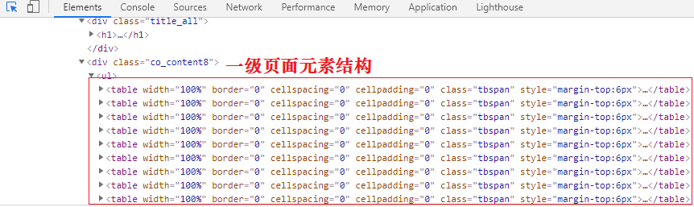
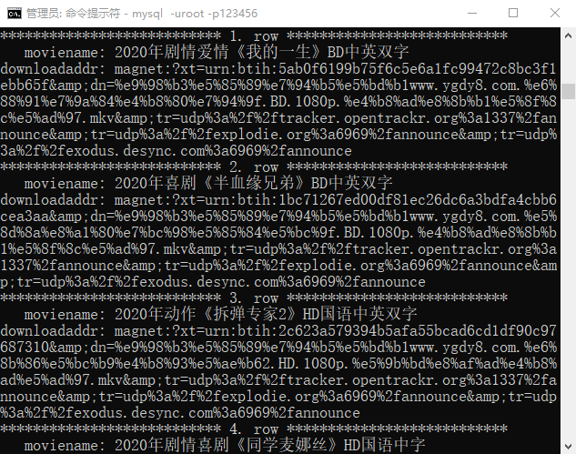

# 第一个Python爬虫程序

## 获取网页html信息

```python
import urllib.request
# urlopen()向URL发请求,返回响应对象
response=urllib.request.urlopen('http://www.baidu.com/')
# 提取响应内容
html = response.read().decode('utf-8')
# 打印响应内容
print(html)
```

## 常用方法

在本节您认识了第一个爬虫库 urllib，下面关于 urllib 做简单总结。

### 1. urlopen()

表示向网站发起请求并获取响应对象，如下所示：

```
urllib.request.urlopen(url,timeout)
```

urlopen() 有两个参数，说明如下：

- url：表示要爬取数据的 url 地址。
- timeout：设置等待超时时间，指定时间内未得到响应则抛出超时异常。

### 2. Request()

该方法用于创建请求对象、包装请求头，比如重构 User-Agent（即用户代理，指用户使用的浏览器）使程序更像人类的请求，而非机器。重构 User-Agent 是爬虫和反爬虫斗争的第一步。在下一节会做详细介绍。

```
urllib.request.Request(url,headers)
```

参数说明如下：

- url：请求的URL地址。
- headers：重构请求头。

### 3. html响应对象方法

```
bytes = response.read() # read()返回结果为 bytes 数据类型string = response.read().decode() # decode()将字节串转换为 string 类型url = response.geturl() # 返回响应对象的URL地址code = response.getcode() # 返回请求时的HTTP响应码
```

### 4. 编码解码操作

```
#字符串转换为字节码
string.encode("utf-8") 
#字节码转换为字符串
bytes.decode("utf-8") 
```


# User-Agent用户代理

User-Agent 即用户代理，简称“UA”，它是一个特殊字符串头。网站服务器通过识别 “UA”来确定用户所使用的操作系统版本、CPU 类型、浏览器版本等信息。而网站服务器则通过判断 UA 来给客户端发送不同的页面。

我们知道，网络爬虫使用程序代码来访问网站，而非人类亲自点击访问，因此爬虫程序也被称为“网络机器人”。绝大多数网站都具备一定的反爬能力，禁止网爬虫大量地访问网站，以免给网站服务器带来压力。本节即将要讲解的 User-Agent 就是反爬策略的第一步。

网站通过识别请求头中 User-Agent 信息来判断是否是爬虫访问网站。如果是，网站首先对该 IP 进行预警，对其进行重点监控，当发现该 IP 超过规定时间内的访问次数， 将在一段时间内禁止其再次访问网站。

| 系统    | 浏览器  | User-Agent字符串                                             |
| ------- | ------- | ------------------------------------------------------------ |
| Mac     | Chrome  | Mozilla/5.0 (Macintosh; Intel Mac OS X 10_12_6) AppleWebKit/537.36 (KHTML, like Gecko) Chrome/73.0.3683.75 Safari/537.36 |
| Mac     | Firefox | Mozilla/5.0 (Macintosh; Intel Mac OS X 10.12; rv:65.0) Gecko/20100101 Firefox/65.0 |
| Mac     | Safari  | Mozilla/5.0 (Macintosh; Intel Mac OS X 10_12_6) AppleWebKit/605.1.15 (KHTML, like Gecko) Version/12.0.3 Safari/605.1.15 |
| Windows | Edge    | Mozilla/5.0 (Windows NT 10.0; Win64; x64) AppleWebKit/537.36 (KHTML, like Gecko) Chrome/64.0.3282.140 Safari/537.36 Edge/18.17763 |
| Windows | IE      | Mozilla/5.0 (Windows NT 10.0; WOW64; Trident/7.0; rv:11.0) like Gecko |
| Windows | Chrome  | Mozilla/5.0 (Windows NT 10.0; Win64; x64) AppleWebKit/537.36 (KHTML, like Gecko) Chrome/72.0.3626.121 Safari/537.36 |
| iOS     | Chrome  | Mozilla/5.0 (iPhone; CPU iPhone OS 7_0_4 like Mac OS X) AppleWebKit/537.51.1 (KHTML, like Gecko) CriOS/31.0.1650.18 Mobile/11B554a Safari/8536.25 |
| iOS     | Safari  | Mozilla/5.0 (iPhone; CPU iPhone OS 8_3 like Mac OS X) AppleWebKit/600.1.4 (KHTML, like Gecko) Version/8.0 Mobile/12F70 Safari/600.1.4 |
| Android | Chrome  | Mozilla/5.0 (Linux; Android 4.2.1; M040 Build/JOP40D) AppleWebKit/537.36 (KHTML, like Gecko) Chrome/31.0.1650.59 Mobile Safari/537.36 |
| Android | Webkit  | Mozilla/5.0 (Linux; U; Android 4.4.4; zh-cn; M351 Build/KTU84P) AppleWebKit/534.30 (KHTML, like Gecko) Version/4.0 Mobile Safari/534.30 |


## 爬虫程序UA信息

```python
#导入模块
import urllib.request
#向网站发送get请求
response=urllib.request.urlopen('http://httpbin.org/get')
html = response.read().decode()
print(html)
```

获取的结果

```json
{
  "args": {},
  #请求头信息
  "headers": {
    "Accept-Encoding": "identity",
    "Host": "httpbin.org",
    "User-Agent": "Python-urllib/3.7", #UserAgent信息包含在请求头中！
    "X-Amzn-Trace-Id": "Root=1-6034954b-1cb061183308ae920668ec4c"
  },
  "origin": "121.17.25.194",
  "url": "http://httpbin.org/get"
}
```

<font color="red">从输出结果可以看出，User-Agent 竟然是 Python-urllib/3.7，这显然是爬虫程序访问网站。因此就需要重构 User-Agent，将其伪装成“浏览器”访问网站。</font>


## 重构爬虫UA信息

下面使用`urllib.request.Request()`方法重构 User-Agent 信息，代码如下所示：

```python
from urllib import request
# 定义变量：URL 与 headers
url = 'http://httpbin.org/get' #向测试网站发送请求
#重构请求头，伪装成 Mac火狐浏览器访问，可以使用上表中任意浏览器的UA信息
headers = {'User-Agent':'Mozilla/5.0 (Windows NT 10.0; Win64; x64) AppleWebKit/537.36 (KHTML, like Gecko) Chrome/72.0.3626.121 Safari/537.36'}
# 1、创建请求对象，包装ua信息
req = request.Request(url=url,headers=headers)
# 2、发送请求，获取响应对象
res = request.urlopen(req)
# 3、提取响应内容
html = res.read().decode('utf-8')
print(html)
```


```json
{
  "args": {}, 
  "headers": {
    "Accept-Encoding": "identity", 
    "Host": "httpbin.org", 
    "User-Agent": "Mozilla/5.0 (Windows NT 10.0; Win64; x64) AppleWebKit/537.36 (KHTML, like Gecko) Chrome/72.0.3626.121 Safari/537.36", 
    "X-Amzn-Trace-Id": "Root=1-64953413-519e6ff2072ac1646f437221"
  }, 
  "origin": "120.244.190.160", 
  "url": "http://httpbin.org/get"
}
```

# User-Agnet代理池

## 自定义UA代理池

在编写爬虫程序时，<font color="red">一般都会构建一个 User-Agent （用户代理）池，就是把多个浏览器的 UA 信息放进列表中，然后再从中随机选择。</font>构建用户代理池，能够避免总是使用一个 UA 来访问网站，因为短时间内总使用一个 UA 高频率访问的网站，可能会引起网站的警觉，从而封杀掉 IP。

构建代理池的方法也非常简单，在您的 Pycharm 工作目录中定义一个 ua_info.py 文件，并将以下 UA 信息以列表的形式粘贴到该文件中，如下所示：

```python
ua_list = [
    'Mozilla/4.0 (compatible; MSIE 7.0; Windows NT 5.1; Maxthon 2.0',
    'Mozilla/5.0 (Macintosh; Intel Mac OS X 10_7_0) AppleWebKit/535.11 (KHTML, like Gecko) Chrome/17.0.963.56 Safari/535.11',
    'User-Agent:Opera/9.80 (Windows NT 6.1; U; en) Presto/2.8.131 Version/11.11',
    'Mozilla/5.0 (Windows NT 6.1; rv:2.0.1) Gecko/20100101 Firefox/4.0.1',
    'Mozilla/4.0 (compatible; MSIE 7.0; Windows NT 6.0)',
    'Mozilla/5.0 (Windows; U; Windows NT 6.1; en-us) AppleWebKit/534.50 (KHTML, like Gecko) Version/5.1 Safari/534.50',
    'Mozilla/5.0 (compatible; MSIE 9.0; Windows NT 6.1; Trident/5.0',
    ' Mozilla/4.0 (compatible; MSIE 7.0; Windows NT 5.1',
    'Mozilla/4.0 (compatible; MSIE 6.0; Windows NT 5.1',
    ' Mozilla/5.0 (Macintosh; Intel Mac OS X 10.6; rv:2.0.1) Gecko/20100101 Firefox/4.0.1',
]
```


## 模块随机获取UA

您也可以使用专门第三方的模块来随机获取浏览器 UA 信息，不过该模块需要单独安装，安装方式如下：

```cmd
pip install fake-useragent
```

演示如下代码：

```python
from fake_useragent import UserAgent
#实例化一个对象
ua=UserAgent()
#随机获取一个ie浏览器ua
print(ua.ie)
print(ua.ie)
#随机获取一个火狐浏览器ua
print(ua.firefox)
print(ua.firefox)
#随机获取一个任意的
print(ua.random())
```

# URL编码和解码


# 正则表达式基本语法

在使用 Python 编写爬虫的过程中，re 模块通常做为一种解析方法来使用。通过审查网页元素来获取网页的大体结构，然后使用解析模块来提取你想要的网页信息，最终实现数据的抓取。本节对正则表达式基本语法做简单讲解。


## 正则表达式元字符

下表列出了常用的正则表达式元字符：

### 1. 元字符

| 元字符 | 匹配内容                                                 |
| ------ | -------------------------------------------------------- |
| .      | 匹配除换行符以外的任意字符                               |
| \w     | 匹配所有普通字符(数字、字母或下划线)                     |
| \s     | 匹配任意的空白符                                         |
| \d     | 匹配数字                                                 |
| \n     | 匹配一个换行符                                           |
| \t     | 匹配一个制表符                                           |
| \b     | 匹配一个单词的结尾                                       |
| ^      | 匹配字符串的开始位置                                     |
| $      | 匹配字符串的结尾位置                                     |
| \W     | 匹配非字母或数字或下划线                                 |
| \D     | 匹配非数字                                               |
| \S     | 匹配非空白符                                             |
| a\|b   | 匹配字符 a 或字符 b                                      |
| ()     | 正则表达式分组所用符号，匹配括号内的表达式，表示一个组。 |
| [...]  | 匹配字符组中的字符                                       |
| [^...] | 匹配除了字符组中字符的所有字符                           |


### 2. 量词

| 量词  | 用法说明           |
| ----- | ------------------ |
| *     | 重复零次或者更多次 |
| +     | 重复一次或者更多次 |
| ？    | 重复0次或者一次    |
| {n}   | 重复n次            |
| {n,}  | 重复n次或者更多次  |
| {n,m} | 重复n到m次         |


### 3. 字符组

有时也会出现各种字符组成的字符组，这在正则表达式中使用`[]`表示，如下所示：

| 正则         | 待匹配字符 | 匹配结果 | 说明                                                         |
| ------------ | ---------- | -------- | ------------------------------------------------------------ |
| [0123456789] | 8          | True     | 在一个字符组里枚举所有字符，字符组里的任意一个字符 和"待匹配字符"相同都视为可以匹配。 |
| [0123456789] | a          | False    | 由于字符组中没有 "a" 字符，所以不能匹配。                    |
| [0-9]        | 7          | True     | 也可以用-表示范围，[0-9] 就和 [0123456789] 是一个意思。      |
| [a-z]        | s          | True     | 同样的如果要匹配所有的小写字母，直接用 [a-z] 就可以表示。    |
| [A-Z]        | B          | True     | [A-Z] 就表示所有的大写字母。                                 |
| [0-9a-fA-F]  | e          | True     | 可以匹配数字，大小写形式的 a～f，用来验证十六进制字符。      |


## 贪婪模式非贪婪模式

正则表达式默认为贪婪匹配，也就是尽可能多的向后匹配字符，比如 {n,m} 表示匹配前面的内容出现 n 到 m 次（n 小于 m），在贪婪模式下，首先以匹配 m 次为目标，而在非贪婪模式是尽可能少的向后匹配内容，也就是说匹配 n 次即可。

贪婪模式转换为非贪婪模式的方法很简单，在元字符后添加“?”即可实现，如下所示：

| 元字符(贪婪模式) | 非贪婪模式 |
| ---------------- | ---------- |
| *                | *?         |
| +                | +？        |
| ？               | ??         |
| {n,m}            | {n,m}？    |

## 正则表达式转义

如果使用正则表达式匹配特殊字符时，则需要在字符前加`\`表示转意。常见的特殊字符如下：

```
* + ? ^ $ [] () {} | \
```


## re模块常用方法

#### 1. re.compile()

该方法用来生成正则表达式对象，其语法格式如下：

```python
regex=re.compile(pattern,flags=0)
```

参数说明：

- pattern：正则表达式对象。
- flags：代表功能标志位，扩展正则表达式的匹配。

#### 2. re.findall()

根据正则表达式匹配目标字符串内容。

```python
re.findall(pattern,string,flags=0)
```

该函数的返回值是匹配到的内容列表，如果正则表达式有子组，则只能获取到子组对应的内容。参数说明如下：

- pattern：正则表达式对象。
- string：目标字符串
- flags：代表功能标志位，扩展正则表达式的匹配。

#### 3. regex.findall()

该函数根据正则表达式对象匹配目标字符串内容。其语法格式如下：

```python
regex.findall(string,pos,endpos)
```

参数说明：

- string 目标字符串。
- pos 截取目标字符串的开始匹配位置。
- endpos 截取目标字符串的结束匹配位置。

#### 4. re.split()

该函数使用正则表达式匹配内容，切割目标字符串。返回值是切割后的内容列表。参数说明：

```python
re.split(pattern,string,flags = 0)
```

参数说明：

- pattern：正则表达式。
- string：目标字符串。
- flags：功能标志位,扩展正则表达式的匹配。

\5) re.sub
该函数使用一个字符串替换正则表达式匹配到的内容。返回值是替换后的字符串。其语法格式如下：

```python
re.sub(pattern,replace,string,max,flags = 0)
```

其参数说明：

- pattern：正则表达式。
- replace：替换的字符串。
- string：目标字符串。
- max：最多替换几处，默认替换全部，
- flags：功能标志位,扩展正则表达式的匹配。

#### 5. re.search()

匹配目标字符串第一个符合的内容，返回值为匹配的对象。语法格式如下：

```python
re.search(pattern,string,flags=0)
```

参数说明：

- pattern：正则表达式
- string：目标字符串

## flags功能标志位

功能标志位的作用是扩展正则表达的匹配功能。常用的 flag 如下所示：


| 缩写元字符 | 说明                                    |
| ---------- | --------------------------------------- |
| A          | 元字符只能匹配 ASCII码。                |
| I          | 匹配忽略字母大小写。                    |
| S          | 使得`.`元字符可以匹配换行符。           |
| M          | 使 ^ $ 可以匹配每一行的开头和结尾位置。 |


注意：可以同时使用福多个功能标志位，比如 flags=re.I|re.S。

下面使用贪婪和非贪婪两种模式来匹配 HTML 元素，分别，如下所示：

```python
import re
html="""<div><p>www.biancheng.net</p></div><div><p>编程帮</p></div>"""

#贪婪匹配，re.S可以匹配换行符
#创建正则表达式对象
pattern=re.compile('<div><p>.*</p></div>',re.S)#匹配HTMLX元素，提取信息
re_list=pattern.findall(html)
print(re_list)

#非贪婪模式匹配，re.S可以匹配换行符
pattern=re.compile('<div><p>.*?</p></div>',re.S)
re_list=pattern.findall(html)
print(re_list)
```

输出结果：

```
['<div><p>www.biancheng.net</p></div>\n<div><p>编程帮</p></div>']
['<div><p>www.biancheng.net</p></div>', '<div><p>编程帮</p></div>']
```

从上述输出结果可以得出非贪婪模式比适合提取 HTML 信息。

## 正则表达式分组

通过正则表达式分组可以从匹配的信息中提取出想要的信息。示例演示：

```python
#正则表达式分组website="编程帮 www.biancheng.net"
#提取所有信息#注意此时正则表达式的 "." 需要转义因此使用\.
pattern_1=re.compile('\w+\s+\w+\.\w+\.\w+')
print(pattern_1.findall(website))

#提取匹配信息的第一项
pattern_2=re.compile('(\w+)\s+\w+\.\w+\.\w+')
print(pattern_2.findall(website))

#有两个及以上的()则以元组形式显示
pattern_3=re.compile('(\w+)\s+(\w+\.\w+\.\w+)')
print(pattern_3.findall(website))
```

输出结果：

```
['编程帮 www.biancheng.net']
['编程帮']
[('编程帮', 'www.biancheng.net')]
```

正则表达式分组是提取信息的常用方式。当需要哪个特定信息的时候，就可以通过分组(也就是加括号)的方式获得。

## 网页信息提取

实战演练：从下面的 HTML 代码中使用 re 模块提取出两部影片的名称和主演信息。

```python
html="""
<div class="movie-item-info">
<p class="name">
<a title="你好，李焕英">你好，李焕英</a>
</p>
<p class="star">
主演：贾玲,张小斐,沈腾
</p>    
</div>
<div class="movie-item-info">
<p class="name">
<a title="刺杀，小说家">刺杀，小说家</a>
</p>
<p class="star">
主演：雷佳音,杨幂,董子健,于和伟
</p>    
</div> 
"""
# 寻找HTML规律，书写正则表达式，使用正则表达式分组提取信息
pattern=re.compile(r'<div.*?<a title="(.*?)".*?star">(.*?)</p.*?div>',re.S)
r_list=pattern.findall(html)
print(r_list)
# 整理数据格式并输出
if  r_list:
    for r_info in  r_list:
        print("影片名称：",r_info[0])
        print("影片主演：",r_info[1].strip())
        print(20*"*")
```

输出结果如下：

```xml
[('你好，李焕英', '\n主演：贾玲,张小斐,沈腾\n'), ('刺杀，小说家', '\n主演：雷佳音,杨幂,董子健,于和伟\n')]

影片名称： 你好，李焕英
影片主演： 主演：贾玲,张小斐,沈腾
********************
影片名称： 刺杀，小说家
影片主演： 主演：雷佳音,杨幂,董子健,于和伟
********************
```

# Python csv模块（读写文件）

CSV 文件又称为逗号分隔值文件，是一种通用的、相对简单的文件格式，用以存储表格数据，包括数字或者字符。CSV 是电子表格和数据库中最常见的输入、输出文件格式，可参考《[CSV介绍](https://baike.baidu.com/item/CSV/10739?fr=aladdin)》。

通过爬虫将数据抓取的下来，然后把数据保存在文件，或者数据库中，这个过程称为数据的持久化存储。本节介绍 Python 内置模块 CSV 的读写操作。

## CSV文件写入

#### 1) csv.writer()

csv 模块中的 writer 类可用于读写序列化的数据，其语法格式如下：

```python
writer(csvfile, dialect='excel', **fmtparams)
```

参数说明：

- csvfile：必须是支持迭代(Iterator)的对象，可以是文件(file)对象或者列表(list)对象。
- dialect：编码风格，默认为 excel 的风格，也就是使用逗号`,`分隔。
- fmtparam：格式化参数，用来覆盖之前 dialect 对象指定的编码风格。


示例如下：

```python
import csv
# 操作文件对象时，需要添加newline参数逐行写入，否则会出现空行现象
with open('eggs.csv', 'w', newline='') as csvfile:
    # delimiter 指定分隔符，默认为逗号，这里指定为空格
    # quotechar 表示引用符
    # writerow 单行写入，列表格式传入数据
    spamwriter = csv.writer(csvfile, delimiter=' ',quotechar='|')
    spamwriter.writerow(['www.biancheng.net'] * 5 + ['how are you'])
    spamwriter.writerow(['hello world', 'web site', 'www.biancheng.net'])
```

eggs.csv 文件内容如下：

```
www.biancheng.net www.biancheng.net www.biancheng.net www.biancheng.net www.biancheng.net |how are you|
|hello world| |web site| www.biancheng.net
```

其中，quotechar 是引用符，当一段话中出现分隔符的时候，用引用符将这句话括起来，以能排除歧义。

如果想同时写入多行数据，需要使用 writerrows() 方法，代码如下所示：

```python
import csv
with open('aggs.csv', 'w', newline='') as f:
    writer = csv.writer(f)
    # 注意传入数据的格式为列表元组格式
    writer.writerows([('hello','world'), ('I','love','you')])
```

aggs.csv文件内容：

```
hello,world
I,love,you
```

#### 2) csv.DictWriter()

当然也可使用 DictWriter 类以字典的形式读写数据，使用示例如下：

```python
import csv
with open('names.csv', 'w', newline='') as csvfile:
    #构建字段名称，也就是key
    fieldnames = ['first_name', 'last_name']
    writer = csv.DictWriter(csvfile, fieldnames=fieldnames)
    # 写入字段名，当做表头
    writer.writeheader()
    # 多行写入
    writer.writerows([{'first_name': 'Baked', 'last_name': 'Beans'},{'first_name': 'Lovely', 'last_name': 'Spam'}])
    # 单行写入
    writer.writerow({'first_name': 'Wonderful', 'last_name': 'Spam'})
```

name.csv 文件内容，如下所示：

```
first_name,last_name
Baked,Beans
Lovely,Spam
Wonderful,Spam
```

## CSV文件读取

#### 1) csv.reader()

csv 模块中的 reader 类和 DictReader 类用于读取文件中的数据，其中 reader() 语法格式如下：

```
csv.reader(csvfile, dialect='excel', **fmtparams)
```

应用示例如下：

```python
import csv
with open('eggs.csv', 'r', newline='') as csvfile:
    spamreader = csv.reader(csvfile, delimiter=' ', quotechar='|')
    for row in spamreader:
        print(', '.join(row))
```

输出结果：

```
www.biancheng.net, www.biancheng.net, www.biancheng.net, www.biancheng.net, www.biancheng.net, how are you
hello world, web site, www.biancheng.net
```

#### 2) csv.DictReader()

应用示例如下：

```python
import csv
with open('names.csv', newline='') as csvfile:
    reader = csv.DictReader(csvfile)
    for row in reader:
        print(row['first_name'], row['last_name'])
```

输出结果：

```
Baked Beans
Lovely Spam
Wonderful Spam
```

# Python Pymysql实现数据存储

Python 连接并操作 MySQL 数据库，主要通过 Pymysql 模块实现。本节讲解如何将抓取的数据存储至 MySQL 数据库。


## 创建存储数据表

首先您应该确定您的计算机上已经安装了 MySQL 数据库，然后再进行如下操作：

```
# 1. 连接到mysql数据库
mysql -h127.0.0.1 -uroot -p123456
# 2. 建库
create database maoyandb charset utf8;
# 3. 切换数据库
use maoyandb;
# 4. 创建数据表
create table filmtab(
name varchar(100),
star varchar(400),
time varchar(30)
);
```

## Pymysql基本使用

### 1) 连接数据库

```
db = pymysql.connect('localhost','root','123456','maoyandb')
```

参数说明：

- localhost：本地 MySQL 服务端地址，也可以是远程数据库的 IP 地址。
- root：连接数据所使用的用户名。
- password：连接数据库使用的密码，本机 MySQL 服务端密码“123456”。
- db：连接的数据库名称。

### 2) 创建cursor对象

```
cursor = db.cursor()
```

### 3) 执行sql命令

execute() 方法用来执行 SQL 语句。如下所示：

```python
#第一种方法：编写sql语句，使用占位符传入相应数据
sql = "insert into filmtab values('%s','%s','%s')" % ('刺杀,小说家','雷佳音','2021')
cursor.excute(sql)
第二种方法：编写sql语句，使用列表传参方式
sql = 'insert into filmtab values(%s,%s,%s)'
cursor.execute(sql,['刺杀,小说家','雷佳音','2021'])
```

### 4) 提交数据

```
db.commit()
```

### 5) 关闭数据库

```
cursor.close()
db.close()
```

完整的代码如下所示：

```python
# -*-coding:utf-8-*-
import pymysql
#创建对象
db = pymysql.connect('localhost','root','123456','maoyandb')
cursor = db.cursor()
# sql语句执性，单行插入
info_list = ['刺杀,小说家','雷佳音,杨幂','2021-2-12']
sql = 'insert into movieinfo values(%s,%s,%s)'
#列表传参
cursor.execute(sql,info_list)
db.commit()
# 关闭
cursor.close()
db.close()
```

查询数据结果，如下所示：

```
mysql> select * from movieinfo;
+-------------+-------------------+-----------+
| name        | star              | time      |
+-------------+-------------------+-----------+
| 刺杀,小说家   | 雷佳音,杨幂         | 2021-2-12 |
+-------------+-------------------+-----------+
1 rows in set (0.01 sec)
```

还有一种效率较高的方法，使用 executemany() 可以同时插入多条数据。示例如下：

```python
db = pymysql.connect('localhost','root','123456','maoyandb',charset='utf8')
cursor = db.cursor()
# sql语句执性，列表元组
info_list = [('我不是药神','徐峥','2018-07-05'),('你好,李焕英','贾玲','2021-02-12')]
sql = 'insert into movieinfo values(%s,%s,%s)'
cursor.executemany(sql,info_list)
db.commit()
# 关闭
cursor.close()
db.close()
```

查询插入结果，如下所示：

```
mysql> select * from movieinfo;
+-------------+-------------------+------------+
| name        | star              | time       |
+-------------+-------------------+------------+
| 我不是药神  | 徐峥              | 2018-07-05 |
| 你好,李焕英 | 贾玲              | 2021-02-12 |
+-------------+-------------------+------------+
2 rows in set (0.01 sec)
```

## 修改爬虫程序

下面修改上一节《[Python爬虫抓取猫眼电影排行榜](http://c.biancheng.net/python_spider/case02.html)》中的爬虫程序，将抓取下来的数据存储到 MySQL 数据库。如下所示：

```python
# coding=gbk
from urllib import request
import re
import time
import random
from ua_info import ua_list
import pymysql
class MaoyanSpider(object):
    def __init__(self):
        #初始化属性对象
        self.url = 'https://maoyan.com/board/4?offset={}'
        #数据库连接对象
        self.db = pymysql.connect(
            'localhost','root','123456','maoyandb',charset='utf8')
        #创建游标对象
        self.cursor = self.db.cursor()
    def get_html(self,url):
        headers = {'User-Agent':random.choice(ua_list)}
        req = request.Request(url=url,headers=headers)
        res = request.urlopen(req)
        html = res.read().decode()
        # 直接解析
        self.parse_html(html)
    def parse_html(self,html):
        re_bds = '<div class="movie-item-info">.*?title="(.*?)".*?<p class="star">(.*?)</p>.*?class="releasetime">(.*?)</p>'
        pattern = re.compile(re_bds,re.S)
        r_list = pattern.findall(html)
        self.save_html(r_list)
    def save_html(self, r_list):
        L = []
        sql = 'insert into movieinfo values(%s,%s,%s)'
        # 整理数据
        for r in r_list:
            t = (
                r[0].strip(),
                r[1].strip()[3:],
                r[2].strip()[5:15]
            )
            L.append(t)
            print(L)
        # 一次性插入多条数据 L:[(),(),()]
        try:
            self.cursor.executemany(sql,L)
            # 将数据提交数据库
            self.db.commit()
        except:
            # 发生错误则回滚
            self.db.rollback()
    def run(self):
        for offset in range(0,11,10):
            url = self.url.format(offset)
            self.get_html(url)
            time.sleep(random.uniform(1,3))
        # 断开游标与数据库连接
        self.cursor.close()
        self.db.close()
if __name__ == '__main__':
    start=time.time()
    spider = MaoyanSpider()
    spider.run()
    end=time.time()
    print("执行时间:%.2f" % (end-start))
```

数据库查询存储结果，如下所示：

```
mysql> select * from movieinfo;
+----------------+----------------------------------------------------------+------------+
| name           | star                                                     | time       |
+----------------+----------------------------------------------------------+------------+
| 我不是药神     | 徐峥,周一围,王传君                                               | 2018-07-05 |
| 肖申克的救赎   | 蒂姆·罗宾斯,摩根·弗里曼,鲍勃·冈顿                                  | 1994-09-10 |
| 绿皮书         | 维果·莫腾森,马赫沙拉·阿里,琳达·卡德里尼                            | 2019-03-01 |
| 海上钢琴师     | 蒂姆·罗斯,比尔·努恩,克兰伦斯·威廉姆斯三世                           | 2019-11-15 |
| 小偷家族       | 中川雅也,安藤樱,松冈茉优                                          | 2018-08-03 |
| 霸王别姬       | 张国荣,张丰毅,巩俐                                               | 1993-07-26 |
| 哪吒之魔童降世 | 吕艳婷,囧森瑟夫,瀚墨                                              | 2019-07-26 |
| 美丽人生       | 罗伯托·贝尼尼,朱斯蒂诺·杜拉诺,赛尔乔·比尼·布斯特里克                  | 2020-01-03 |
| 这个杀手不太冷 | 让·雷诺,加里·奥德曼,娜塔莉·波特曼                                   | 1994-09-14 |
| 盗梦空间       | 莱昂纳多·迪卡普里奥,渡边谦,约瑟夫·高登-莱维特                        | 2010-09-01 |
+----------------+----------------------------------------------------------+------------+
10 rows in set (0.01 sec)
```


# Python爬虫：抓取多级页面数据

前面讲解的爬虫案例都是单级页面数据抓取，但有些时候，只抓取一个单级页面是无法完成数据提取的。本节讲解如何使用爬虫抓取多级页面的数据。

在爬虫的过程中，多级页面抓取是经常遇见的。下面以抓取二级页面为例，对每级页面的作用进行说明：

- 一级页面提供了获取二级页面的访问链接。
- 二级页面作为详情页用来提取所需数据。


一级页面以`<a>`标签的形式链接到二级页面，只有在二级页面才可以提取到所需数据。

## 多级页面分析

下面以电影天堂（[点击访问](https://www.dytt8.net/index.htm)） 2020 新片精品为案例进行讲解，将每部影片的名称，以及下载链接抓取下来。首先点击“更多”进入一级页面，如下图所示：


### 1. 寻找url规律

通过简单分析可以得知一级与二级页面均为静态页面，接下来分析 url 规律，通过点击第 1 页，第 2 页 ...，其规律如下：

```
第1页 ：https://www.dytt8.net/html/gndy/dyzz/list_23_1.html
第2页 ：https://www.dytt8.net/html/gndy/dyzz/list_23_2.html
第n页 ：https://www.dytt8.net/html/gndy/dyzz/list_23_n.html
```

### 2. 确定正则表达式

通过元素审查可知一级页面的元素结构如下：


图2：页面元素分析

其正则表达式如下：

```html
 <table width="100%".*?<td width="5%".*?<a href="(.*?)".*?ulink">.*?</table>
```


点击二级页面进入详情页，通过开发者工具分析想要数据的网页元素，即电影名称，和下载链接，其正则表达式如下：

```html
<div class="title_all"><h1><font color=#07519a>(.*?)</font></h1></div>.*?<div><a href="(.*?)">.*?</a>
```

## 爬虫增量抓取

爬虫是一种效率很低的程序，非常消耗计算机资源。对于聚焦爬虫程序而言，需要每天对特定的网站进行数据抓取，如果每次都去抓取之前已经抓取过的数据，就会白白消耗了时间和资源。而增量爬虫是指通过监测网站更新的情况，只抓取最新数据的一种方式，这样就大大降低了资源的消耗。

对于本节案例来说，电影天堂网站每天都会更新内容，因此编写一个增量抓取的爬虫程序是非常合适的。

那么要如何判断爬虫程序是否已抓取过二级页面的 url 呢？其实，当您第一次运行爬虫程序时，爬虫会将所有的 url 抓取下来，然后将这些 url 放入数据库中。为了提高数据库的查询效率，您可以为每一个 url 生成专属的“指纹”。当网站更新后，第二次运行爬虫程序时，程序只会对数据库中不存在的指纹进行抓取。

## 程序代码实现

### 1) 建库建表

将抓取的数据的存放至 MySQL 数据库，需要先进行建库建表操作。注意，这里需要将 url 指纹单独存放在一张表中，如下所示：

```sql
create database movieskydb charset utf8;
use movieskydb;
create table request_finger(
finger char(60)
)charset=utf8;
create table movieinfo(
moviename varchar(300),
downloadaddr varchar(600)
)charset=utf8;
```

### 2) url指纹生成

您可以使用 Python 内置模块 md5 来生成加密“指纹”，如下所示。 

```python
#导入模块
from hashlib import md5
#待加密的url
url="https://www.dytt8.net/html/gndy/dyzz/20210226/61131.html"
# 生成MD5对象
secret = md5()
# 加密url
secret.update(url.encode())
# 提取十六进制的加密串
finger = secret.hexdigest()
print(finger)
```

输出结果：

```
2d5e46ee52756e8ae59c9ba42230b883
```

### 3) 程序完整代码

```python
# -*- coding: utf-8 -*-
from urllib import request
import re
import time
import random
import pymysql
from hashlib import md5
from ua_info import ua_list
import sys
class MovieSkySpider(object):
    def __init__(self):
        self.url = 'https://www.dytt8.net/html/gndy/dyzz/list_23_{}.html'
        self.db = pymysql.connect(
            'localhost','root','123456','movieskydb',
            charset='utf8'
        )
        self.cursor = self.db.cursor()
    # 1.请求函数
    def get_html(self, url):
        headers = {'User-Agent': random.choice(ua_list)}
        req = request.Request(url=url, headers=headers)
        res = request.urlopen(req)
        # 本网站使用gb2312的编码格式
        html = res.read().decode('gb2312', 'ignore')
        return html
    # 2.正则解析函数
    def re_func(self,re_bds,html):
        pattern = re.compile(re_bds,re.S)
        r_list = pattern.findall(html)
        return r_list
    # 3.提取数据函数
    def parse_html(self,one_url):
        # 调用请求函数，获取一级页面
        one_html = self.get_html(one_url)
        re_bds = '<table width="100%".*?<td width="5%".*?<a href="(.*?)".*?ulink">.*?</table>'
        # 获取二级页面链接
        # link_list: ['/html//html/gndy/dyzz/20210226/61131.html','/html/xxx','','']
        link_list = self.re_func(re_bds,one_html)
        for link in link_list:
            # 判断是否需要爬取此链接
            # 1.获取指纹
            # 拼接二级页面url
            two_url = 'https://www.dytt8.net' + link
            s = md5()
            #加密url，需要是字节串
            s.update(two_url.encode())
            # 生成指纹，获取十六进制加密字符串，
            finger = s.hexdigest()
            # 2.通过函数判断指纹在数据库中是否存在
            if self.is_hold_on(finger):
                # 抓取二级页面数据
                self.save_html(two_url)
                time.sleep(random.randint(1,2))
                # 抓取后，把想用的url专属指纹存入数据库
                ins = 'insert into request_finger values (%s)'
                self.cursor.execute(ins,[finger])
                self.db.commit()
            else:
                sys.exit('更新完成')
    # 4.判断链接是否已经抓取过
    def is_hold_on(self,finger):
        # 查询数据库
        sql='select finger from request_finger where finger=%s'
        # execute()函数返回值为受影响的行数（即0或者非0）
        r = self.cursor.execute(sql,[finger])
        # 如果为0表示没有抓取过
        if not r:
            return True
    # 5.解析二级页面，获取数据（名称与下载链接）
    def save_html(self,two_url):
        two_html = self.get_html(two_url)
        re_bds = '<div class="title_all"><h1><font color=#07519a>(.*?)</font></h1> \
        </div>.*?<a.*?href="(.*?)".*?>.*?style="BACKGROUND-COLOR:.*?</a>'
        # film_list: [('name','downloadlink'),(),(),()]
        film_list = self.re_func(re_bds,two_html)
        print(film_list)
        # 插入数据库
        sql = 'insert into movieinfo values(%s,%s)'
        #L = list(film_list[0])
        self.cursor.executemany(sql,film_list)
        self.db.commit()
    
    #主函数 
    def run(self):
        # 二级页面后四页的正则表达式略有不同，需要重新分析
        for i in range(1,4):
            url = self.url.format(i)
            self.parse_html(url)
if __name__ == '__main__':
    spider = MovieSkySpider()
    spider.run()
```

若要查询数据库存储数据，执行以下命令即可：

```
mysql> select * from movieinfo\G
```

输出如下，如下图所示：




 

在二级页面提取数据时要注意该页面的类型。该网站在二级页面使用了两种类型的网页结构，另外一种页面结构的正则表达式如下所示：

```html
<div class="title_all"><h1><font color=#07519a>(.*?)</font></h1></div>.*?<td style="WORD-WRAP.*?>.*?>(.*?)</a> 
```

若要抓取此类页面的数据，需要更换二级页面正则表达式。


# Python Requests库安装和使用

Python 提供了多个用来编写爬虫程序的库，除了前面已经介绍的 urllib 库之外，还有一个很重的 Requests 库，这个库的宗旨是“让 HTTP 服务于人类”。


Requests 是 Python 的第三方库，它的安装非常简便，如下所示：

```cmd
python -m pip install requests
```

Requests 库是在 urllib 的基础上开发而来，它使用 Python 语言编写，并且采用了 Apache2 Licensed（一种开源协议）的 HTTP 库。与 urllib 相比，Requests 更加方便、快捷，因此在编写爬虫程序时 Requests 库使用较多。

## 常用请求方法

### 1) requests.get()

该方法用于 GET 请求，表示向网站发起请求，获取页面响应对象。语法如下：

```python
res = requests.get(url,headers=headers,params,timeout)
```

参数说明如下：

- url：要抓取的 url 地址。
- headers：用于包装请求头信息。
- params：请求时携带的查询字符串参数。
- timeout：超时时间，超过时间会抛出异常。


具体使用示例如下：

```py
import requests
url = 'http://baidu.com'
response = requests.get(url)
print(response)
```

输出结果：

```
<Response [200]>
```

获取带查询字符串参数的响应对象，如下所示：

```py
import requests
data = {
    'name': '编程帮',
    'url': "www.biancheng.net"
}
response = requests.get('http://httpbin.org/get', params=data)
#直接拼接参数也可以
#response = requests.get(http://httpbin.org/get?name=gemey&age=22)
#调用响应对象text属性，获取文本信息
print(response.text)
```

输出结果：

```
{
  "args": {
    "name": "\u7f16\u7a0b\u5e2e",
    "url": "www.biancheng.net"
  },
  "headers": {
    "Accept": "*/*",
    "Accept-Encoding": "gzip, deflate",
    "Host": "httpbin.org",
    "User-Agent": "python-requests/2.23.0",
    "X-Amzn-Trace-Id": "Root=1-60420026-236f9205646b68706d0fafa7"
  },
  "origin": "121.17.25.194",
  "url": "http://httpbin.org/get?name=\u7f16\u7a0b\u5e2e&url=www.biancheng.net"
}
```

### 2) requests.post()

该方法用于 POST 请求，先由用户向目标 url 提交数据，然后服务器返回一个 HttpResponse 响应对象，语法如下：

```
response=requests.post(url,data={请求体的字典})
```

示例如下所示：

```py
import requests
#百度翻译
url = 'https://fanyi.baidu.com'
#post请求体携带的参数，可通过开发者调试工具查看
#查看步骤：NetWork选项->Headers选项->Form Data
data = {'from': 'zh',
        'to': 'en',
        'query': '编程帮www.biancheng.net你好'
        }
response = requests.post(url, data=data)
print(response)
```

输出结果：

```
<Response [200]>
```

查看 Form Data 的步骤，如下图所示：


图1：Chrome开发者调试工具（[点击看高清图](http://c.biancheng.net/uploads/allimg/210819/9-210Q9131356309.gif)）

## 对象属性

当我们使用 Requests 模块向一个 URL 发起请求后会返回一个 HttpResponse 响应对象，该对象具有以下常用属性：


| 常用属性    | 说明                                             |
| ----------- | ------------------------------------------------ |
| encoding    | 查看或者指定响应字符编码                         |
| status_code | 返回HTTP响应码                                   |
| url         | 查看请求的 url 地址                              |
| headers     | 查看请求头信息                                   |
| cookies     | 查看cookies 信息                                 |
| text        | 以字符串形式输出                                 |
| content     | 以字节流形式输出，若要保存下载图片需使用该属性。 |


使用示例如下所示：

```py
import requests
response = requests.get('http://www.baidu.com')
print(response.encoding)
response.encoding="utf-8"    #更改为utf-8编码
print(response.status_code)  # 打印状态码
print(response.url)          # 打印请求url
print(response.headers)      # 打印头信息
print(response.cookies)      # 打印cookie信息
print(response.text)  #以字符串形式打印网页源码
print(response.content) #以字节流形式打印
```

输出结果：

```
#编码格式
ISO-8859-1
#响应码
200
#url地址
http://www.baidu.com/
#请求头信息
{'Cache-Control': 'private, no-cache, no-store, proxy-revalidate, no-transform', 'Connection': 'keep-alive', 'Content-Encoding': 'gzip', 'Content-Type': 'text/html', 'Date': 'Mon, 08 Mar 2021 05:19:33 GMT', 'Last-Modified': 'Mon, 23 Jan 2017 13:27:29 GMT', 'Pragma': 'no-cache', 'Server': 'bfe/1.0.8.18', 'Set-Cookie': 'BDORZ=27315; max-age=86400; domain=.baidu.com; path=/', 'Transfer-Encoding': 'chunked'}
#查看cookies信息
<RequestsCookieJar[<Cookie BDORZ=27315 for .baidu.com/>]>
...内容过长，此处省略后两项输出
```

## Requests库应用

示例应用：使用 Requsets 库下载百度图片。

首先打开百度图片（https://image.baidu.com/），并在输入框搜索 “python logo”，然后使用 Chrome 开发者工具查看第一张图片的源地址，即 data-imgurl 所对应的 url 地址，如下所示：

```
data-imgurl="https://ss2.bdstatic.com/70cFvnSh_Q1YnxGkpoWK1HF6hhy/it/u=38785274,1357847304&fm=26&gp=0.jpg"
```

可以将上述 url 粘贴至浏览器地址栏进行验证。当我们确定图片地址后，就可以使用 requests 库进行编码了：

```py
import requests
url = 'https://ss2.bdstatic.com/70cFvnSh_Q1YnxGkpoWK1HF6hhy/it/u=38785274,1357847304&fm=26&gp=0.jpg'
#简单定义浏览器ua信息
headers = {'User-Agent':'Mozilla/4.0'}
​#读取图片需要使用content属性
html = requests.get(url=url,headers=headers).content
#以二进制的方式下载图片
with open('C:/Users/Administrator/Desktop/image/python_logo.jpg','wb') as f:
    f.write(html)
```

最后，您会在桌面文件夹中找到已经下载好的图片，如下所示：


# Python爬虫抓取网络照片

## 分析url规律

打开百度图片翻页版（[点击访问](http://image.baidu.com/search/flip?tn=baiduimage&ie=utf-8&word=python&pn=0&gsm=50&ct=&ic=0&lm=-1&width=0&height=0)），该翻页版网址要妥善保留。其 url 规律如下：

```
第一页：https://image.baidu.com/search/flip?tn=baiduimage&word=python&pn=0
第二页：https://image.baidu.com/search/flip?tn=baiduimage&word=python&pn=20
第三页：https://image.baidu.com/search/flip?tn=baiduimage&word=python&pn=40
第n页：https://image.baidu.com/search/flip?tn=baiduimage&word=python&pn=20*（n-1)
```

百度为了限制爬虫，将原来的翻页版变为了“瀑布流”浏览形式，也就是通过滚动滑轮自动加载图片，此种方式在一定程度上限制了爬虫程序。

## 写正则表达式

通过上一节可以得知每一张图片有一个源地址如下所示：

```
data-imgurl="图片源地址"
```

复制图片源地址，并检查网页源代码，使用 Ctrl+F 搜索该地址，如下图所示：


使用上述方式依次检查几张图片，您会发现每张图片源地址，有如下三种匹配结果：

```
"thumbURL":"https://ss2.bdstatic.com/70cFvnSh_Q1YnxGkpoWK1HF6hhy/it/u=38785274,1357847304&fm=26&gp=0.jpg"
"middleURL":"https://ss2.bdstatic.com/70cFvnSh_Q1YnxGkpoWK1HF6hhy/it/u=38785274,1357847304&fm=26&gp=0.jpg"
"hoverURL":"https://ss2.bdstatic.com/70cFvnSh_Q1YnxGkpoWK1HF6hhy/it/u=38785274,1357847304&fm=26&gp=0.jpg"
```

任选其一，写出图片源地址正则表达式，如下所示：

```
re_bds='"hoverURL":"(.*?)"'
```


<font color="red">注：有时候不显示全路径，鼠标放上去</font>


## 编写程序代码

下面使用 Requests 库的相应方法和属性编写程序代码，最终实现一个快速下载照片的小程序。

```py
# -*- coding:utf8 -*-
import requests
import re
from urllib import parse
import os
class BaiduImageSpider(object):
    def __init__(self):
        self.url = 'https://image.baidu.com/search/flip?tn=baiduimage&word={}'
        self.headers = {'User-Agent':'Mozilla/4.0'}
    # 获取图片
    def get_image(self,url,word):
        #使用 requests模块得到响应对象
        res= requests.get(url,headers=self.headers)
        # 更改编码格式
        res.encoding="utf-8"
        # 得到html网页
        html=res.text
        print(html)
        #正则解析
        pattern = re.compile('"hoverURL":"(.*?)"',re.S)
        img_link_list = pattern.findall(html)
        #存储图片的url链接 
        print(img_link_list)
        # 创建目录，用于保存图片
        directory = 'C:/Users/Administrator/Desktop/image/{}/'.format(word)
        # 如果目录不存在则创建，此方法常用
        if not os.path.exists(directory):
            os.makedirs(directory)
        
        #添加计数 
        i = 1
        for img_link in img_link_list:
            filename = '{}{}_{}.jpg'.format(directory, word, i)
            self.save_image(img_link,filename)
            i += 1
    #下载图片
    def save_image(self,img_link,filename):
        html = requests.get(url=img_link,headers=self.headers).content
        with open(filename,'wb') as f:
            f.write(html)
        print(filename,'下载成功')
    # 入口函数 
    def run(self):
        word = input("您想要谁的照片？")
        word_parse = parse.quote(word)
        url = self.url.format(word_parse)
        self.get_image(url,word)
if __name__ == '__main__':
    spider = BaiduImageSpider()
    spider.run()
```

程序执行结果如下图：


目录文件下载图如下所示：


# Requests库常用方法及参数介绍

Requests 库中定义了七个常用的请求方法，这些方法各自有着不同的作用，在这些请求方法中 requests.get() 与 requests.post() 方法最为常用。请求方法如下所示：


| 方法               | 说明                                                   |
| ------------------ | ------------------------------------------------------ |
| requests.request() | 构造一个请求对象，该方法是实现以下各个方法的基础。     |
| requests.get()     | 获取HTML网页的主要方法，对应于 HTTP 的 GET 方法。      |
| requests.head()    | 获取HTML网页头信息的方法，对应于 HTTP 的 HEAD 方法。   |
| requests.post()    | 获取 HTML 网页提交 POST请求方法，对应于 HTTP 的 POST。 |
| requests.put()     | 获取HTML网页提交PUT请求方法，对应于 HTTP 的 PUT。      |
| requests.patch()   | 获取HTML网页提交局部修改请求，对应于 HTTP 的 PATCH。   |
| requests.delete()  | 获取HTML页面提交删除请求，对应于 HTTP 的 DELETE。      |


上述方法都提供了相同的参数，其中某些参数已经使用过，比如`headers`和`params`，前者用来构造请求头，后者用来构建查询字符串。这些参数对于编写爬虫程序有着至关重要的作用。本节对其他常用参数做重点介绍。

## SSL认证-verify参数

SSL 证书是数字证书的一种，类似于驾驶证、护照和营业执照。因为配置在服务器上，也称为 SSL 服务器证书。SSL 证书遵守 SSL 协议，由受信任的数字证书颁发机构 CA（电子认证服务）颁发。 SSL 具有服务器身份验证和数据传输加密功能。

`verify`参数的作用是检查 SSL 证书认证，参数的默认值为 True，如果设置为 False 则表示不检查 SSL证书，此参数适用于没有经过 CA 机构认证的 HTTPS 类型的网站。其使用格式如下：

```
response = requests.get(  url=url,  params=params,  headers=headers,  verify=False)
```

## 代理IP-proxies参数

**可以参考这个链接，自己搭建获取ip代理。**

https://github.com/jhao104/proxy_pool


一些网站为了限制爬虫从而设置了很多反爬策略，其中一项就是针对 IP 地址设置的。比如，访问网站超过规定次数导致流量异常，或者某个时间段内频繁地更换浏览器访问，存在上述行为的 IP 极有可能被网站封杀掉。

代理 IP 就是解决上述问题的，它突破了 IP 地址的访问限制，隐藏了本地网络的真实 IP，而使用第三方 IP 代替自己去访问网站。

### 1) 代理IP池

通过构建代理 IP 池可以让你编写的爬虫程序更加稳定，从 IP 池中随机选择一个 IP 去访问网站，而不使用固定的真实 IP。总之将爬虫程序伪装的越像人，它就越不容易被网站封杀。当然代理 IP 也不是完全不能被察觉，通过端口探测技等术识仍然可以辨别。其实爬虫与反爬虫永远相互斗争的，就看谁的技术更加厉害。

### 2) proxies参数

Requests 提供了一个代理 IP 参数`proxies`，该参数的语法结构如下：

```
proxies = {
      '协议类型(http/https)':'协议类型://IP地址:端口号'
    }
```

下面构建了两个协议版本的代理 IP，示例如下：

```
proxies = {
   'http':'http://IP:端口号',
   'https':'https://IP:端口号'
}
```

### 3) 代理IP使用

下面通过简单演示如何使用`proxies`参数，示例如下：

```py
import requests
​
url = 'http://httpbin.org/get'
headers = {
    'User-Agent':'Mozilla/5.0'
}
# 网上找的免费代理ip
proxies = {
    'http':'http://191.231.62.142:8000',
    'https':'https://191.231.62.142:8000'
}
html = requests.get(url,proxies=proxies,headers=headers,timeout=5).text
print(html)
```

输出结果：

```
{
  "args": {},
  "headers": {
    "Accept": "*/*",
    "Accept-Encoding": "gzip, deflate",
    "Cache-Control": "max-age=259200",
    "Host": "httpbin.org",
    "User-Agent": "Mozilla/5.0",
    "X-Amzn-Trace-Id": "Root=1-605073b0-4f54db1b2d2cfc0c074a1193"
  },

  # 注意此处显示两个IP，第一个是你自己的真实IP，另外一个是对外展示的IP
  "origin": "121.17.25.194, 191.235.72.144", 
  "url": "http://httpbin.org/get"
}
```

由于上述示例使用的是免费代理 IP，因此其质量、稳定性较差，可能会随时失效。如果想构建一个稳定的代理 IP 池，就需要花费成本。

### 4) 付费代理IP

网上有许多提供代理 IP 服务的网 站，比如快代理、代理精灵、齐云代理等。这些网站也提供了相关文档说明，以及 API 接口，爬虫程序通过访问 API 接口，就可以构建自己的代理 IP 池。

付费代理 IP 按照资源类型可划分为：开发代理、私密代理、隧道代理、独享代理，其中最常使用的是开放代理与私密代理。

**开放代理：**开放代理是从公网收集的代理服务器，具有 IP 数量大，使用成本低的特点，全年超过 80% 的时间都能有 3000 个以上的代理 IP 可供提取使用。

**私密代理：**私密代理是基于云主机构建的高品质代理服务器，为您提供高速、可信赖的网络代理服务。私密代理每天可用 IP 数量超过 20 万个，可用率在 95 %以上，1 次可提取 IP 数量超过 700 个，可以为爬虫业务提供强大的助力。

付费代理的收费标准根据 IP 使用的时间长短，以及 IP 的质量高低，从几元到几百元不等。89 免费代理（http://www.89ip.cn/）是一个专门提供免费代理 IP 的网站，不过想找到一个质量较高的免费代理好比大海捞针。

## 用户认证-auth参数

Requests 提供了一个`auth`参数，该参数的支持用户认证功能，也就是适合那些需要验证用户名、密码的网站。auth 的参数形式是一个元组，其格式如下：

```
auth = ('username','password')
```

其使用示例如下所示：

```python
class xxxSpider(object):
  def __init__(self):
    self.url = 'http://code.tarena.com.cn/AIDCode/aid1906/13Redis/'
    # 网站使用的用户名，密码
    self.auth = ('c语言中文网','c.biancheng.net')

  def get_headers(self):
      headers = {'User-Agent':"Mozilla/5.0"}
      return headers

  def get_html(self,url):
      res = requests.get(url,headers=self.get_headers(),auth=self.auth)
      html = res.content
      return html
```

如果想更多地了解关于 Requests 库的参数，可以参考官方文档：https://requests.readthedocs.io/zh_CN/latest/


# Xpath简明教程

在编写爬虫程序的过程中提取信息是非常重要的环节，但是有时使用正则表达式无法匹配到想要的信息，或者书写起来非常麻烦，此时就需要用另外一种数据解析方法，也就是本节要介绍的 Xpath 表达式。

## Xpath表达式

XPath（全称：XML Path Language）即 XML 路径语言，它是一门在 XML 文档中查找信息的语言，最初被用来搜寻 XML 文档，同时它也适用于搜索 HTML 文档。因此，在爬虫过程中可以使用 XPath 来提取相应的数据。

提示：XML 是一种遵守 W3C 标椎的标记语言，类似于 HTML，但两者的设计目的是不同，XML 通常被用来传输和存储数据，而 HTML 常用来显示数据。

您可以将 Xpath 理解为在`XML/HTML`文档中检索、匹配元素节点的工具。

Xpath 使用路径表达式来选取`XML/HTML`文档中的节点或者节点集。Xpath 的功能十分强大，它除了提供了简洁的路径表达式外，还提供了100 多个内建函数，包括了处理字符串、数值、日期以及时间的函数。因此 Xpath 路径表达式几乎可以匹配所有的元素节点。

Python 第三方解析库 lxml 对 Xpath 路径表达式提供了良好的支持，能够解析 XML 与 HTML 文档。

## Xpath节点

XPath 提供了多种类型的节点，常用的节点有：元素、属性、文本、注释以及文档节点。如下所示：

```html
<?xml version="1.0" encoding="utf-8"?>
<website>
<site>
  <title lang="zh-CN">website name</title>
  <name>编程帮</name>
  <year>2010</year>
  <address>www.biancheng.net</address>
</site>
</website>
```

上面的 XML 文档中的节点例子：

```
<website></website> （文档节点）
<name></name> （元素节点）
lang="zh-CN" （属性节点） 
```

## 节点关系

XML 文档的节点关系和 HTML 文档相似，同样有父、子、同代、先辈、后代节点。如下所示：

```html
<?xml version="1.0" encoding="utf-8"?>
<website>
<site>
  <title lang="zh-CN">website name</title>
  <name>编程帮</name>
  <year>2010</year>
  <address>www.biancheng.net</address>
</site>
</website>
```

上述示例分析后，会得到如下结果：

```
title name year address 都是 site 的子节点
site 是 title name year address  父节点
title name year address  属于同代节点
title 元素的先辈节点是 site website
website 的后代节点是 site title name year address
```

## Xpath基本语法

#### 1) 基本语法使用

Xpath 使用路径表达式在文档中选取节点，下表列出了常用的表达式规则：


| 表达式    | 描述                                                         |
| --------- | ------------------------------------------------------------ |
| node_name | 选取此节点的所有子节点。                                     |
| /         | 绝对路径匹配，从根节点选取。                                 |
| //        | 相对路径匹配，从所有节点中查找当前选择的节点，包括子节点和后代节点，其第一个 / 表示根节点。 |
| .         | 选取当前节点。                                               |
| ..        | 选取当前节点的父节点。                                       |
| @         | 选取属性值，通过属性值选取数据。常用元素属性有 @id 、@name、@type、@class、@tittle、@href。 |


下面以下述代码为例讲解 Xpath 表达式的基本应用，代码如下所示：

```html
<ul class="BookList">
  <li class="book1" id="book_01" href="http://www.biancheng.net/">
        <p class="name">c语言小白变怪兽</p>
        <p class="model">纸质书</p>
        <p class="price">80元</p>
        <p class="color">红蓝色封装</p>
    </li>
  
    <li class="book2" id="book_02" href="http://www.biancheng.net/">
        <p class="name">Python入门到精通</p>
        <p class="model">电子书</p>
        <p class="price">45元</p>
        <p class="color">蓝绿色封装</p>
    </li>
</ul>
```

路径表达式以及相应的匹配内容如下：

```
xpath表达式：//li

匹配内容：
c语言小白变怪兽
纸质书
80元
红蓝色封装
   

Python入门到精通
电子书
45元
蓝绿色封装

xpath表达式：//li/p[@class="name"]
匹配内容：
c语言小白变怪兽
Python入门到精通


xpath表达式：//li/p[@class="model"]
匹配内容：
纸质书
电子书

xpath表达式：//ul/li/@href
匹配内容：
http://www.biancheng.net/
http://www.biancheng.net/

xpath表达式：//ul/li
匹配内容：
c语言小白变怪兽
纸质书
80元
红蓝色封装
  
Python入门到精通
电子书
45元
蓝绿色封装
```

注意：当需要查找某个特定的节点或者选取节点中包含的指定值时需要使用`[]`方括号。如下所示：

```
xpath表达式：//ul/li[@class="book2"]/p[@class="price"]
匹配结果：45元
```

#### 2) xpath通配符

Xpath 表达式的通配符可以用来选取未知的节点元素，基本语法如下：


| 通配符 | 描述说明           |
| ------ | ------------------ |
| *      | 匹配任意元素节点   |
| @*     | 匹配任意属性节点   |
| node() | 匹配任意类型的节点 |

示例如下：

```
xpath表达式：//li/*

匹配内容：
c语言小白变怪兽
纸质书
80元
红蓝色封装
Python入门到精通
电子书
45元
蓝绿色封装
```

#### 3) 多路径匹配

多个 Xpath 路径表达式可以同时使用，其语法如下：

```
xpath表达式1 | xpath表达式2 | xpath表达式3
```

示例应用：

```
表达式：//ul/li[@class="book2"]/p[@class="price"]|//ul/li/@href

匹配内容：
45元
http://www.biancheng.net/
http://www.biancheng.net/
```

## Xpath内建函数

Xpath 提供 100 多个内建函数，这些函数给我们提供了很多便利，比如实现文本匹配、模糊匹配、以及位置匹配等，下面介绍几个常用的内建函数。


| 函数名称                | xpath表达式示例                                 | 示例说明                                            |
| ----------------------- | ----------------------------------------------- | --------------------------------------------------- |
| text()                  | ./text()                                        | 文本匹配，表示值取当前节点中的文本内容。            |
| contains()              | //div[contains(@id,'stu')]                      | 模糊匹配，表示选择 id 中包含“stu”的所有 div 节点。  |
| last()                  | //*[@class='web'][last()]                       | 位置匹配，表示选择@class='web'的最后一个节点。      |
| position()              | //*[@class='site'][position()<=2]               | 位置匹配，表示选择@class='site'的前两个节点。       |
| start-with()            | "//input[start-with(@id,'st')]"                 | 匹配 id 以 st 开头的元素。                          |
| ends-with()             | "//input[ends-with(@id,'st')]"                  | 匹配 id 以 st 结尾的元素。                          |
| concat(string1,string2) | concat('C语言中文网',.//*[@class='stie']/@href) | C语言中文与标签类别属性为"stie"的 href 地址做拼接。 |


想要了解更多关于 Xpath 的知识可访问官方网站：https://www.w3.org/TR/xpath/


# Python lxml库的安装和使用


## 安装lxml库

lxml 属于 Python 第三方库，因此需要使用如下方法安装：

```
pip3 install lxml
```

在 CMD 命令行验证是否安装成功。若引入模块，不返回错误则说明安装成功。

```
>>> import lxml
>>>
```

## lxml使用流程

lxml 库提供了一个 etree 模块，该模块专门用来解析 HTML/XML 文档，下面我们简单介绍一下 lxml 库的使用流程，如下所示：

#### 1) 导入模块

```
from lxml import etree
```

#### 2) 创建解析对象

调用 etree 模块的 HTML() 方法来创建 HTML 解析对象。如下所示：

```
parse_html = etree.HTML(html)
```

HTML() 方法能够将 HTML 标签字符串解析为 HTML 文件，该方法可以自动修正 HTML 文本。示例如下：

```python
from lxml import etree
html_str = '''
<div>
    <ul>
         <li class="item1"><a href="link1.html">Python</a></li>
         <li class="item2"><a href="link2.html">Java</a></li>
         <li class="site1"><a href="c.biancheng.net">C语言中文网</a>
         <li class="site2"><a href="www.baidu.com">百度</a></li>
         <li class="site3"><a href="www.jd.com">京东</a></li>
     </ul>
</div>
'''
html = etree.HTML(html_str)
# tostring()将标签元素转换为字符串输出，注意：result为字节类型
result = etree.tostring(html)
print(result.decode('utf-8'))
```

输出结果如下：

```html
<html><body><div>
    <ul>
         <li class="item1"><a href="link1.html">Python</a></li>
         <li class="item2"><a href="link2.html">Java</a></li>
         <li class="site1"><a href="c.biancheng.net">C&#35821;&#35328;&#20013;&#25991;&#32593;</a></li>
         <li class="site2"><a href="www.baidu.com">&#30334;&#24230;</a></li>
         <li class="site3"><a href="www.jd.com">&#20140;&#19996;</a>
     </li></ul>
</div>
</body></html>

```

上述 HTML 字符串存在缺少标签的情况，比如“C语言中文网”缺少一个 </li> 闭合标签，当使用了 HTML() 方法后，会将其自动转换为符合规范的 HTML 文档格式。

#### 3) 调用xpath表达式

最后使用第二步创建的解析对象调用 xpath() 方法，完成数据的提取，如下所示：

```
r_list = parse_html.xpath('xpath表达式')
```

## lxml库数据提取

下面通过一段 HTML 代码实例演示如何使用 lxml 库提取想要的数据。HTML 代码如下所示：

```html
<div class="wrapper">
    <a href="www.biancheng.net/product/" id="site">website product</a>
    <ul id="sitename">
    <li><a href="http://www.biancheng.net/" title="编程帮">编程</a></li>
    <li><a href="http://world.sina.com/" title="新浪娱乐">微博</a></li>
    <li><a href="http://www.baidu.com" title="百度">百度贴吧</a></li>
    <li><a href="http://www.taobao.com" title="淘宝">天猫淘宝</a></li>
    <li><a href="http://www.jd.com/" title="京东">京东购物</a></li>
    <li><a href="http://c.bianchneg.net/" title="C语言中文网">编程</a></li>
    <li><a href="http://www.360.com" title="360科技">安全卫士</a></li>
    <li><a href="http://www.bytesjump.com/" title=字节">视频娱乐</a></li>
    <li><a href="http://bzhan.com/" title="b站">年轻娱乐</a></li>
    <li><a href="http://hao123.com/" title="浏览器">搜索引擎</a></li>
    </ul>
</div>
```

#### 1) 提取所有a标签内的文本信息

```python
from lxml import etree
# 创建解析对象
parse_html=etree.HTML(html)
# 书写xpath表达式,提取文本最终使用text()
xpath_bds='//a/text()'
# 提取文本数据，以列表形式输出
r_list=parse_html.xpath(xpath_bds)
# 打印数据列表
print(r_list)
```

输出结果：

```
['website product', '编程', '微博', '百度贴吧', '天猫淘宝', '京东购物', '编程', '安全卫士', '视频娱乐', '年轻娱乐', '搜索引擎']
```

#### 2) 获取所有href的属性值

```python
from lxml import etree
# 创建解析对象
parse_html=etree.HTML(html)
# 书写xpath表达式,提取文本最终使用text()
xpath_bds='//a/@href'
# 提取文本数据，以列表形式输出
r_list=parse_html.xpath(xpath_bds)
# 打印数据列表
print(r_list)
```

输出结果：

```
['http://www.biancheng.net/product/', 'http://www.biancheng.net/', 'http://world.sina.com/', 'http://www.baidu.com', 'http://www.taobao.com', 'http://www.jd.com/', 'http://c.bianchneg.net/', 'http://www.360.com', 'http://www.bytesjump.com/', 'http://bzhan.com/', 'http://hao123.com/']
```

#### 3) 不匹配href=" www.biancheng.net/priduct"

```python
from lxml import etree
# 创建解析对象
parse_html=etree.HTML(html)
# 书写xpath表达式,提取文本最终使用text()
xpath_bds='//a/@href'
# 提取文本数据，以列表形式输出
xpath_bds='//ul[@id="sitename"]/li/a/@href'
# 打印数据列表
print(r_list)
```

输出结果：

```
['http://www.biancheng.net/', 'http://world.sina.com/', 'http://www.baidu.com', 'http://www.taobao.com', 'http://www.jd.com/', 'http://c.bianchneg.net/', 'http://www.360.com', 'http://www.bytesjump.com/', 'http://bzhan.com/', 'http://hao123.com/']
```

# Python lxml解析库实战应用

## 确定信息元素结构

首先明确要抓取信息的网页元素结构，比如电影名称、主演演员、上映时间。通过简单分析可以得知，每一部影片的信息都包含在`<dd>`标签中，而每一`<dd>`标签又包含在`<dl>`标签中，因此对于`dd`标签而言，`dl`标签是一个更大的节点，也就是它的父辈节点，如下所示：


 

当一个`<dd>`标签内的影片信息提取完成时，您需要使用同样的 Xpath 表达式提取下一影片信息，直到所有影片信息提取完成，这种方法显然很繁琐。那么有没有更好的方法呢？

## 基准表达式

因为每一个节点对象都使用相同 Xpath 表达式去匹配信息，所以很容易想到 for 循环。我们将 10 个`<dd>`节点放入一个列表中，然后使用 for 循环的方式去遍历每一个节点对象，这样就大大提高了编码的效率。

通过`<dd>`节点的父节点`<dl>`可以同时匹配 10 个`<dd>`节点，并将这些节点对象放入列表中。我们把匹配 10个`<dd>`节点的 Xpath 表达式称为“基准表达式”。如下所示：

```
xpath_bds='//dl[@class="board-wrapper"]/dd'
```

下面通过基准表达式匹配 <dd> 节点对象，代码如下：

```
# 匹配10个dd节点对象xpath_bds='//dl[@class="board-wrapper"]/dd'dd_list=parse_html.xpath(xpath_bds)
```

输出结果：

```note
[<Element dd at 0x36c7f80>, <Element dd at 0x36c7d50>, <Element dd at 0x36c7940>, <Element dd at 0x36c7d28>, <Element dd at 0x36c7bc0>, <Element dd at 0x36c7f58>, <Element dd at 0x36c7f30>, <Element dd at 0x36cc468>, <Element dd at 0x36cc170>, <Element dd at 0x37382b0>]
```

## 提取数据表达式

因为我们想要抓取的信息都包含在`<dd>`节点中，接下来开始分析<dd>节点包含的 HTML 代码，下面随意选取的一段<dd>节点包含的影片信息，如下所示：

```html
<dd>
    <i class="board-index board-index-4">4</i>
    <a href="/films/1292" title="海上钢琴师" class="image-link" data-act="boarditem-click" data-val="{movieId:1292}">
      
      
    </a>
    <div class="board-item-main">
      <div class="board-item-content">
              <div class="movie-item-info">
        <p class="name"><a href="/films/1292" title="海上钢琴师" data-act="boarditem-click" data-val="{movieId:1292}">海上钢琴师</a></p>
        <p class="star">
                主演：蒂姆·罗斯,比尔·努恩,克兰伦斯·威廉姆斯三世
        </p>
<p class="releasetime">上映时间：2019-11-15</p>    </div>
    <div class="movie-item-number score-num">
<p class="score"><i class="integer">9.</i><i class="fraction">3</i></p>       
    </div>
      </div>
    </div>
</dd>
```

分析上述代码段，写出待抓取信息的 Xpath 表达式，如下所示：

```note
提取电影名信息：xpath('.//p[@class="name"]/a/text()')
提取主演信息：xpath('.//p[@class="star"]/text()')
提取上映时间信息：xpath('.//p[@class="releasetime"]/text()')
```

## 完整程序代码

上述内容介绍了编写程序时用到的 Xpath 表达式，下面正式编写爬虫程序，代码如下所示：

```python
# coding:utf8
import requests
from lxml import etree
from ua_info import ua_list
import random
class MaoyanSpider(object):
    def __init__(self):
        self.url='https://maoyan.com/board/4?offset=50'
        self.headers={'User-Agent':random.choice(ua_list)}
    def save_html(self):
        html=requests.get(url=self.url,headers=self.headers).text
        #jiexi
        parse_html=etree.HTML(html)
        # 基准 xpath 表达式，匹配10个<dd>节点对象
        dd_list=parse_html.xpath('//dl[@class="board-wrapper"]/dd') #列表放10个dd
        print(dd_list)
        # .// 表示dd节点的所有子节点后代节点
        # 构建item空字典将提取的数据放入其中
        item={}
        for dd in dd_list:
            # 处理字典数据，注意xpath表达式匹配结果是一个列表，因此需要索引[0]提取数据
            item['name']=dd.xpath('.//p[@class="name"]/a/text()')[0].strip()
            item['star']=dd.xpath('.//p[@class="star"]/text()')[0].strip()
            item['time']=dd.xpath('.//p[@class="releasetime"]/text()')[0].strip()
            #输出数据
            print(item)
    def run(self):
        self.save_html()
if __name__ == '__main__':
    spider=MaoyanSpider()
    spider.run()
```

输出结果如下：

```
{'name': '飞屋环游记', 'star': '主演：爱德华·阿斯纳,乔丹·长井,鲍勃·彼德森', 'time': '上映时间：2009-08-04'}
{'name': '窃听风暴', 'star': '主演：乌尔里希·穆埃,塞巴斯蒂安·科赫,马蒂娜·格德克', 'time': '上映时间：2006-03-23(德国)'}
{'name': '美国往事', 'star': '主演：罗伯特·德尼罗,詹姆斯·伍兹,伊丽莎白·麦戈文', 'time': '上映时间：2015-04-23'}
{'name': '乱世佳人', 'star': '主演：费雯·丽,克拉克·盖博,奥利维娅·德哈维兰', 'time': '上映时间：1939-12-15(美国)'}
{'name': '大话西游之大圣娶亲', 'star': '主演：周星驰,朱茵,莫文蔚', 'time': '上映时间：2014-10-24'}
{'name': '美丽心灵', 'star': '主演：罗素·克劳,詹妮弗·康纳利,艾德·哈里斯', 'time': '上映时间：2001-12-13(美国)'}
{'name': '消失的爱人', 'star': '主演：本·阿弗莱克,裴淳华,尼尔·帕特里克·哈里斯', 'time': '上映时间：2014-09-26(美国)'}
{'name': '罗马假日', 'star': '主演：格利高里·派克,奥黛丽·赫本,埃迪·艾伯特', 'time': '上映时间：1953-08-20(意大利)'}
{'name': '一一', 'star': '主演：吴念真,金燕玲,李凯莉', 'time': '上映时间：2017-07-28(中国台湾)'}
{'name': '蝴蝶效应', 'star': '主演：约翰·帕特里克·阿梅多利,罗根·勒曼,卡梅隆·布莱特', 'time': '上映时间：2004-01-23(美国)'}
```


http://c.biancheng.net/python_spider/bs4.html


# BeautifulSoup参考文档

https://www.crummy.com/software/BeautifulSoup/bs4/doc/index.html#


