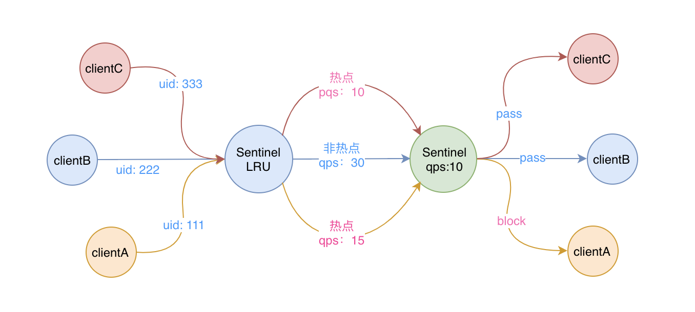
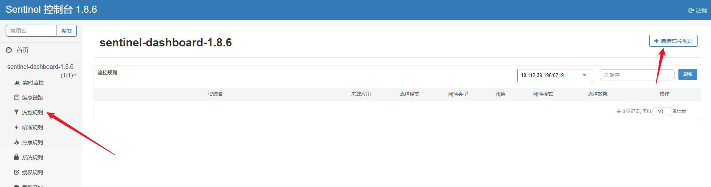

sentinal官网文档：https://sentinelguard.io/zh-cn/docs/introduction.html

博客：https://www.cnblogs.com/zzyang/p/17352306.html

github:https://github.com/all4you/sentinel-tutorial/tree/master?tab=readme-ov-file


# 核心概念

## **资源**

资源是Sentinel中一个非常重要的概念，资源就是Sentinel所保护的对象。

资源可以是一段代码，又或者是一个接口，Sentinel中并没有什么强制规定，但是实际项目中一般以一个接口为一个资源，比如说一个http接口，又或者是rpc接口，它们就是资源，可以被保护。

资源是通过Sentinel的API定义的，每个资源都有一个对应的名称，比如对于一个http接口资源来说，Sentinel默认的资源名称就是请求路径。

假设我们有一个 UserService ：

```java
public class UserService {
 /**
  * 根据uid获取用户信息
  * @param uid uid
  * @return 用户信息
  */
 public User getUser(Long uid){
     // 业务代码
     User user = new User();
     user.setUid(uid);
     user.setName("user-" + uid);
        return user;
 }
 public static class User {
     private Long uid;
     private String name;
     // 省略getter、setter
 
```

现在我们要对 getUser 方法进行限流，那首先我们要定义一个资源，在 sentinel 中资源是抽象出来做具体的操作的，用资源来保护我们的代码和服务。

用户只需要为受保护的代码或服务定义一个资源，然后定义规则就可以了，剩下的都交给sentinel来处理了。定义完资源后，就可以通过在程序中埋点来保护你自己的服务了，埋点的方式有两种：抛出异常和返回布尔值。

下面我用抛出异常的方式进行埋点：

```java

// 定义的资源
public static final String USER_RES = "userResource";
public User getUser(Long uid){
    Entry entry = null;
    try {
        // 流控代码
        entry = SphU.entry(USER_RES);
        // 业务代码
        User user = new User();
        user.setUid(uid);
        user.setName("user-" + uid);
        return user;
    }catch(BlockException e){
        // 被限流了
        System.out.println("[getUser] has been protected! Time="+System.currentTimeMillis());
    }finally {
        if(entry!=null){
            entry.exit();
        }
    }
    return null;
}
```

除了通过抛出异常的方式定义资源外，返回布尔值的方式也是一样的，这里不具体展开了。

PS：如果你不想对原有的业务代码进行侵入，也可以通过注解 SentinelResource 来进行资源埋点。

## **规则**

规则也是一个重要的概念，规则其实比较好理解，比如说要对一个资源进行限流，那么限流的条件就是规则，后面在限流的时候会基于这个规则来判定是否需要限流。

Sentinel的规则分为流量控制规则、熔断降级规则以及系统保护规则，不同的规则实现的效果不一样。

一条FlowRule有以下几个重要的属性组成：

- resource：规则的资源名

- grade：限流阈值类型，qps 或线程数

- count：限流的阈值

- limitApp：被限制的应用，授权时候为逗号分隔的应用集合，限流时为单个应用

- strategy：基于调用关系的流量控制

- controlBehavior：流控策略

前三个属性比较好理解，最后三个比较难理解，让我们来详细看下最后三个属性：

### **limitApp**

首先让我们来看下limitApp，从字面上看是指要限制哪个应用的意思，主要是用于根据调用方进行流量控制。

他有三种情况可以选择：

- default

表示不区分调用者，来自任何调用者的请求都将进行限流统计。

- {origin}

表示针对特定的调用者，只有来自这个调用者的请求才会进行流量控制。该特定调用者的名称是通过 ContextUtil.entry(origin) 来设置的。

例如：资源 `NodeA` 配置了一条针对调用者 **caller1** 的规则，那么当且仅当来自 **caller1** 对 `NodeA` 的请求才会触发流量控制。

- other

表示除 {origin} 以外的其余调用方的流量进行流量控制。

例如：资源 `NodeA` 配置了一条针对调用者 **caller1** 的限流规则，同时又配置了一条调用者为 **other** 的规则，那么任意来自非 **caller1** 对 `NodeA` 的调用，都不能超过 **other** 这条规则定义的阈值。

### **strategy**

基于调用关系的流量控制，也有三种情况可以选择：

- STRATEGY_DIRECT

根据调用方进行限流。ContextUtil.enter(resourceName, origin) 方法中的 origin 参数标明了调用方的身份。

如果 strategy 选择了DIRECT ，则还需要根据限流规则中的 limitApp 字段根据调用方在不同的场景中进行流量控制，包括有：“所有调用方default”、“特定调用方origin”、“除特定调用方origin之外的调用方”。

- STRATEGY_RELATE

根据关联流量限流。当两个资源之间具有资源争抢或者依赖关系的时候，这两个资源便具有了关联，可使用关联限流来避免具有关联关系的资源之间过度的争抢。

比如对数据库同一个字段的读操作和写操作存在争抢，读的速度过高会影响写得速度，写的速度过高会影响读的速度。

举例来说：read_db 和 write_db 这两个资源分别代表数据库读写，我们可以给 read_db 设置限流规则来达到写优先的目的：设置 FlowRule.strategy 为 RuleConstant.STRATEGY_RELATE，同时设置 FlowRule.refResource 为 write_db。这样当写库操作过于频繁时，读数据的请求会被限流。

- STRATEGY_CHAIN

根据调用链路入口限流。假设来自入口 Entrance1 和 Entrance2 的请求都调用到了资源 NodeA，Sentinel 允许根据某个入口的统计信息对资源进行限流。

举例来说：我们可以设置 FlowRule.strategy 为 RuleConstant.CHAIN，同时设置 FlowRule.refResource 为 Entrance1 来表示只有从入口 Entrance1 的调用才会记录到 NodeA 的限流统计当中，而对来自 Entrance2 的调用可以放行。

为什么要了解 limitApp 和 strategy 呢？主要是因为进行流控阈值判断时所需要用到的 Node 就是通过这两个字段确定的，具体来说可以用下面的表格来表示：

| **strategy** | **limitApp**       | **selectedNode**                                       |
| ------------ | ------------------ | ------------------------------------------------------ |
| direct       | default            | clusterNode                                            |
| direct       | {origin}           | originNode                                             |
| direct       | other && !{origin} | originNode                                             |
| relate       | -                  | 特定refRes下的clusterNode                              |
| chain        | -                  | 特定context下的defaultNode，需满足：refRes=contextName |

### **controlBehavior**

流控策略，主要是发生拦截后具体的流量整形和控制策略，目前有三种策略，分别是：

- CONTROL_BEHAVIOR_DEFAULT

这种方式是：**直接拒绝**，该方式是默认的流量控制方式，当 qps 超过任意规则的阈值后，新的请求就会被立即拒绝，拒绝方式为抛出FlowException。

这种方式适用于对系统处理能力确切已知的情况下，比如通过压测确定了系统的准确水位。

- CONTROL_BEHAVIOR_WARM_UP

这种方式是：**排队等待** ，又称为 **冷启动**。该方式主要用于当系统长期处于低水位的情况下，流量突然增加时，直接把系统拉升到高水位可能瞬间把系统压垮。

通过"冷启动"，让通过的流量缓慢增加，在一定时间内逐渐增加到阈值上限，给冷系统一个预热的时间，避免冷系统被压垮的情况。

- CONTROL_BEHAVIOR_RATE_LIMITER

这种方式是：**慢启动**，又称为 **匀速器模式**。这种方式严格控制了请求通过的间隔时间，也即是让请求以均匀的速度通过，对应的是漏桶算法。

这种方式主要用于处理间隔性突发的流量，例如消息队列。想象一下这样的场景，在某一秒有大量的请求到来，而接下来的几秒则处于空闲状态，我们希望系统能够在接下来的空闲期间逐渐处理这些请求，而不是在第一秒直接拒绝多余的请求。

具体的 FlowRule 可以用下面这张图表示：


规则定义好了之后，启动应用后，就会自动对我们的业务代码进行保护了。

## 规则持久化

当然实际生产环境中不可能通过硬编码的方式来定义规则的，sentinel 为我们提供了 DataSource 接口，通过实现该接口可以自定义规则的存储数据源。

通过 DataSource 接口可以有很多种方式对规则进行持久化，例如：

- 整合动态配置系统，如 ZooKeeper、[Nacos](https://github.com/alibaba/Nacos) 等，动态地实时刷新配置规则

- 结合 RDBMS、NoSQL、VCS 等来实现该规则

- 配合 Sentinel Dashboard 使用


# demo

## **1、基本使用**

引入依赖

```xml
<dependency>
    <groupId>com.alibaba.csp</groupId>
    <artifactId>sentinel-core</artifactId>
    <version>1.8.6</version>
</dependency>
```

测试代码

```java
  public class SentinelSimpleDemo {
    public static void main(String[] args) {
        //加载流控规则
        initFlowRules();
        for (int i = 0; i < 5; i++) {
            Entry entry = null;
            try {
                entry = SphU.entry("sayHello");
                //被保护的逻辑
                System.out.println("访问sayHello资源");
            } catch (BlockException ex) {
                System.out.println("被流量控制了，可以进行降级处理");
            } finally {
                if (entry != null) {
                    entry.exit();
                }
            }
        }
    }
    private static void initFlowRules() {
        List<FlowRule> rules = new ArrayList<>();
        //创建一个流控规则
        FlowRule rule = new FlowRule();
        //对sayHello这个资源限流
        rule.setResource("sayHello");
        //基于qps限流
        rule.setGrade(RuleConstant.FLOW_GRADE_QPS);
        //qps最大为2，超过2就要被限流
        rule.setCount(2);
        rules.add(rule);
        //设置规则
        FlowRuleManager.loadRules(rules);
    }

}
```

解释一下上面这段代码的意思

- initFlowRules方法就是加载一个限流的规则，这个规则作用于`sayHello`这个资源，基于qps限流，当qps超过2之后就会触发限流。

- `SphU.entry("sayHello")`这行代码是Sentinel最最核心的源码，这行代码表面看似风平浪静，实则暗流涌动。这行代码表明接下来需要访问某个资源（参数就是资源名称），会去检查需要被访问的资源是否达到设置的流控、熔断等规则。对于demo来说，就是检查`sayHello`这个资源是否达到了设置的流量控制规则。

- catch BlockException也很重要，当抛出BlockException这个异常，说明触发了一些设置的保护规则，比如限流了，这里面就可以进行降级操作。

- `System.out.println("访问sayHello资源")`这行代码表面是一个打印语句，实则就是前面一直在说的需要被保护的资源。

所以上面这段代码的整体意思就是对`sayHello`这个需要访问的资源设置了一个流控规则，规则的内容是当qps到达2的时候触发限流，之后循环5次访问`sayHello`这个资源，在访问之前通过`SphU.entry("sayHello")`这行代码进行限流规则的检查，如果达到了限流的规则的条件，会抛出BlockException。

测试结果


从结果可以看出，当前两次访问`sayHello`成功之后，qps达到了2，之后再访问就被限流了，失败了。

## **2、集成Spring**

在实际的项目使用中一般不会直接写上面的那段demo代码，而是集成到Spring环境底下。

引入依赖

```xml
<dependency>
    <groupId>org.springframework.boot</groupId>
    <artifactId>spring-boot-starter-web</artifactId>
    <version>2.2.5.RELEASE</version>
</dependency>
<dependency>
    <groupId>com.alibaba.cloud</groupId>
    <artifactId>spring-cloud-starter-alibaba-sentinel</artifactId>
    <version>2.2.5.RELEASE</version>
</dependency>
```

之后提供一个`/sayHello`接口

```java
@RestController
public class SentinelDemoController {
    @GetMapping("/sayHello")
    public String sayHello() throws InterruptedException {
        return "hello";
    }
}
```

配置文件

```yaml
server:
  port: 9527
spring:
  application:
    name: SentinelDemo
```

到这demo就搭建完成了。

此时你心理肯定有疑问，那前面提到的资源和对应的规则去哪了？

前面在说资源概念的时候，我提到Sentinel中默认一个http接口就是一个资源，并且资源的名称就是接口的请求路径。

而真正的原因是Sentinel实现了SpringMVC中的`HandlerInterceptor`接口，在调用Controller接口之前，会将一个调用接口设置为一个资源，代码如下


而`getResourceName`方法就是获取资源名，其实就是接口的请求路径，比如前面提供的接口路径是`/sayHello`，那么资源名就是`/sayHello`。

再后面的代码就是调用上面demo中提到表面风平浪静，实则暗流涌动的`SphU.entry(..)`方法，检查被调用的资源是否达到了设置的规则。

好了，既然资源默认是接口，已经有了，那么规则呢？

规则当然可以按照第一个demo的方式来做，比如在Controller接口中加载，代码如下。

```java
@RestController
public class SentinelDemoController {
    static {
        List<FlowRule> rules = new ArrayList<>();
        //创建一个流控规则
        FlowRule rule = new FlowRule();
        //对/sayHello这个资源限流
        rule.setResource("/sayHello");
        //基于qps限流
        rule.setGrade(RuleConstant.FLOW_GRADE_QPS);
        //qps最大为2，超过2就要被限流
        rule.setCount(2);
        rules.add(rule);
        //设置规则
        FlowRuleManager.loadRules(rules);
    }
    @GetMapping("/sayHello")
    public String sayHello() throws InterruptedException {
        return "hello";
    }
}
```

此时启动项目，在浏览器输入以下链接

> http://localhost:9527/sayHello

疯狂快速使劲地多点几次，就出现下面这种情况


可以看出规则生效了，接口被Sentinel限流了，至于为什么出现这个提示，是因为Sentinel有默认的处理`BlockException`的机制，就在前面提到的进入资源的后面。


当然，你也可以自定义处理的逻辑，实现`BlockExceptionHandler`接口就可以了。

虽然上面这种硬编码规则的方式可以使用，但是在实际的项目中，肯定希望能够基于系统当期那运行的状态来动态调整规则，所以Sentinel提供了一个叫Dashboard应用的控制台，可以通过控制台来动态修改规则。


控制台其实就是一个jar包，可以从Sentinel的github仓库上下载。

之后通过java -jar命令启动就可以了，端口默认8080，浏览器访问[`http://ip:8080/#/login`](http://ip:8080/#/login)就可以登录控制台了，用户名和密码默认都是sentinel。

此时服务要接入控制台，只需要在配置文件上加上控制台的ip和端口即可

```yaml
spring:
  cloud:
    sentinel:
      transport:
        # 指定控制台的ip和端口
        dashboard: localhost:8080
```

项目刚启动的时候控制台默认是没有数据的，需要访问一下接口，之后就有了。


之后就可以看到`/sayHello`这个资源，后面就可以通过页面设置规则。


# 核心原理

demo之后，看下原理，主要是前面提到暗流涌动的`SphU.entry(..)`这行代码背后的逻辑。

Sentinel会为每个资源创建一个处理链条，就是一个责任链，第一次访问这个资源的时候创建，之后就一直复用，所以这个处理链条每个资源有且只有一个。

`SphU.entry(..)`这行代码背后就会调用责任链来完成对资源的检查逻辑。

这个责任链条中每个处理节点被称为`ProcessorSlot`，中文意思就是处理器槽


这个`ProcessorSlot`有很多实现，但是Sentinel的核心就下面这8个：

- NodeSelectorSlot

- ClusterBuilderSlot

- LogSlot

- StatisticSlot

- AuthoritySlot

- SystemSlot

- FlowSlot

- DegradeSlot

这些实现会通过SPI机制加载，然后按照一定的顺序组成一个责任链。

默认情况下，节点是按照如下的顺序进行排序的


虽然默认就8个，但是如果你想扩展，只要实现`ProcessorSlot`，按照SPI的规定配置一下就行。

下面就来按照上面节点的处理顺序来好好扒一扒这8个`ProcessorSlot`。

## **1、NodeSelectorSlot**

这个节点的作用是来设置当前资源**对应的入口**的**统计Node**。

首先什么是统计Node？

比如就拿上面的例子来说，当`/sayHello`这个资源的qps超过2的时候，要触发限流。

但是有个疑问，Sentinel是怎么知道`/sayHello`这个资源的qps是否达到2呢？

当然是需要进行数据统计的，只有通过统计，才知道qps是否达到2，这个进行数据统计的类在Sentinel中叫做Node。


通过Node这个统计的类就知道有多少请求，成功多少个，失败多少个，qps是多少之类的。底层其实是使用到了滑动窗口算法。

那么什么叫对应的入口？

在Sentinel中，支持同一个资源有不同的访问入口。

举个例子，这个例子后面会反复提到。

假设把杭州看做是服务，西湖看做是一个资源，到达西湖有两种方式，地铁和公交。


所以要想访问西湖这个资源，就可以通过公交和地铁两种方式，而公交和地铁就对应前面说的入口的意思。

只不过一般一个资源就一个入口，比如一个http接口一般只能通过http访问，但是Sentinel支持多入口，你可以不用，但是Sentinel有。

所以NodeSelectorSlot的作用就是选择资源在当前调用入口的统计Node，这样就实现了统计同一个资源在不同入口访问数据，用上面的例子解释，就可以实现分别统计通过公交和地铁访问西湖的人数。

资源的入口可以在进入资源之前通过`ContextUtil.enter("入口名", origin)`来指定，如果不指定，那么入口名称默认就是`sentinel_default_context`。

在SpringMVC环境底下，所有的http接口资源，默认的入口都是`sentinel_spring_web_context `


入口名称也可以通过控制台看到


那么为什么要搞一个入口的概念呢？这里咱先留个悬念，后面再说。

## **2、ClusterBuilderSlot**

ClusterBuilderSlot的作用跟NodeSelectorSlot其实是差不多的，也是用来选择统计Node，但是选择的Node的统计维护跟NodeSelectorSlot不一样。

ClusterBuilderSlot会选择两个统计Node：

- 第一个统计Node是资源的所有入口的统计数据之和，就是资源访问的总数据

- 第二个统计Node就是统计资源调用者对资源访问数据

资源调用者很好理解，比如一个http接口资源肯定会被调用，那么调用这个接口的服务或者应用其实就是资源的调用者，但是一般资源的调用者就是指某个服务，后面调用者我可能会以服务来代替。

一个接口可以被很多服务调用，所以一个资源可以很多调用者，而不同调用者都会有单独的一个统计Node，用来分别统计不同调用者对资源的访问数据。

举个例子，现在访问西湖这个资源的大兄弟来自上海，那么就会为上海创建一个统计Node，用来统计所有来自上海的人数，如果是北京，那么就会为北京创建一个统计Node。

那么如何知道访问资源来自哪个服务（调用者）呢？

也是通过`ContextUtil.enter("入口名", origin)`来指定，这个方法的第二个参数`origin`就是代表服务名的意思，默认是空。

> 所以`ContextUtil.enter(..)`可以同时指定资源的入口和调用者，一个资源一定有入口，因为不指定入口默认就是`sentinel_default_context`，但是调用者不指定就会没有。

对于一个http请求来说，Sentinel默认服务名需要放到`S-user`这个请求头中，所以如果你想知道接口的调用服务，需要在调用方发送请求的时候将服务名设置到`S-user`请求头中。

当资源所在的服务接收到请求时，Sentinel就会从`S-user`请求头获取到服务名，之后再通过`ContextUtil.enter("入口名", "调用者名")`来设置当前资源的调用者


> 这里我原以为Sentinel会适配比如OpenFeign之类的框架，会自动将服务名携带到请求头中，但是我翻了一下源码，发现并没有去适配，不知道是出于什么情况的考虑。

所以这一节加上上一节，我们知道了一个资源其实有三种维度的统计Node：

- 分别统计不同入口的访问数据

- 统计所有入口访问数据之和

- 分别统计来自某个服务的访问数据

为了方便区分，我来给这三个统计Node取个响亮的名字

不同入口的访问数据就叫他DefaultNode，统计所有入口访问数据之和就叫他ClusterNode，来自某个服务的访问数据就叫他OriginNode。

是不是够响亮！

那么他们的关系就可以用下面这个图来表示


## **3、LogSlot**

这个Slot没什么好说的，通过名字可以看出来，其实就是用来打印日志的。


当发生异常，就会打印日志。

## **4、StatisticSlot**

这个Slot就比较重要了，就是用来统计数据的。

前面说的NodeSelectorSlot和ClusterBuilderSlot，他们的作用就是根据资源当前的入口和调用来源来选择对应的统计Node。

而StatisticSlot就是对这些统计Node进行实际的统计，比如加一下资源的访问线程数，资源的请求数量等等。


> 前几个Slot其实都是准备、统计的作用，并没有涉及限流降级之类的，他们是为限流降级提供数据支持的。

## **5、AuthoritySlot**

Authority是授权的意思，这个Slot的作用是对资源调用者进行授权，就是黑白名单控制。

可以通过控制台来添加授权规则。


在AuthoritySlot中会去获取资源的调用者，之后会跟授权规则中的资源应用这个选项进行匹配，之后就会出现有以下2种情况：

- 授权类型是黑名单，匹配上了，说明在黑名单内，那么这个服务就不能访问这个资源，没匹配上就可以访问

- 授权类型是白名单。匹配上了，说明在白名单内，那么这个服务就可以访问这个资源，没匹配上就不可以访问

## **6、SystemSlot**

这个的作用是根据整个系统运行的统计数据来限流的，防止当前系统负载过高。

它支持入口qps、线程数、响应时间、cpu使用率、负载5个限流的维度。


对于系统的入口qps、线程数、平均响应时间这些指标，也会有一个统计Node专门去统计，所以这个统计Node的作用就好比会去统计所有访问西湖的人数，统计也在StatisticSlot代码中，前面说的时候我把代码隐藏了


至于cpu使用率、负载指标，Sentinel会启动一个定时任务，每隔1s会去读取一次当前系统的cpu和负载。

## **7、FlowSlot**

这个Slot会根据预设的规则，结合前面的统计出来的实时信息进行流量控制。

在说FlowSlot之前，先来用之前画的那张图回顾一下一个资源的三种统计维度


这里默默地注视10s。。

限流规则配置项比较多


这里我们来好好扒一扒这些配置项的意思。

**针对来源**，来源就是前面说的调用方，这个配置表明，这个规则适用于哪个调用方，默认是default，就是指规则适用于所有调用方，如果指定了调用方，那么这个规则仅仅对指定的调用方生效。

举个例子来说，比如说现在想限制来自上海的访问的人数，那么针对来源可以填上海，之后当访问的大兄弟来自上海的时候，Sentinel就会根据上海对应的OriginNode数据来判断是否达到限流的条件。

**阈值类型**，就是限流条件，当资源的qps或者访问的线程数到达设置的单机阈值，就会触发限流。

**是否集群**，这个作用是用来对集群控制的，因为一个服务可能在很多台机器上，而这个的作用就是将整个集群看成一个整体来限流，这里就不做深入讨论。

**流控模式**，这个流控模式的选项仅仅对阈值类型为qps有效，当阈值类型线程数时无效。

这个配置就比较有意思了，分为直接、关联、链路三种模式。

直接模式的意思就是当资源的ClusterNode统计数据统计达到了阈值，就会触发限流。

比如，当通过地铁和公交访问西湖人数之和达到单机阈值之后就会触发限流。

关联模式下需要填写关联的资源名称


关联的意思就是当**关联资源**的ClusterNode统计的qps达到了设置的阈值时，就会触发**当前资源**的限流操作。

比如，假设现在西湖这个资源关联了雷峰塔这个资源，那么当访问雷峰塔的人数达到了指定的阈值之后，此时就触发西湖这个资源的限流，就是雷峰塔流量高了但是限流的是西湖。

链路模式也一样，它需要关联一个入口资源


关联入口的意思就是指，当访问资源的实际入口跟关联入口是一样的时候，就会根据这个入口对应的DefaultNode的统计数据来判断是否需要限流。

也就是可以单独限制通过公交和地铁的访问的人数的意思。

到这，其实前面说到的一个资源的三种统计维度的数据都用到了，现在应该明白了为什么需要这么多维度的数据，就是为不同维度限流准备的。

最后一个配置项，**流控效果**，这个就是如果是通过qps来限流，并且达到了限流的条件之后会做什么，如果是线程数，就直接抛出`BlockException`异常

也有三种方式，快速失败、Warm Up、排队等待

快速失败的意思就是指一旦触发限流了，那么直接抛出`BlockException`异常

Warm Up的作用就是为了防止系统流量突然增加时出现瞬间把系统压垮的情况。通过"冷启动"，让通过的流量缓慢增加，在一定时间内逐渐增加到阈值上限。

排队等待，很好理解，意思当出现限流了，不是抛异常，而是去排队等待一定时间，其实就是让请求均匀速度通过，内部使用的是传说中的漏桶算法。

## **8、DegradeSlot**

这是整个责任链中最后一个slot，这个slot的作用是用来熔断降级的。

Sentinel支持三种熔断策略：慢调用比例、异常比例 、异常数，通过规则配置也可以看出来。


熔断器的工作流程大致如下


Sentinel会为每个设置的规则都创建一个熔断器，熔断器有三种状态，OPEN(打开)、HALF_OPEN(半开)、CLOSED(关闭)

- 当处于CLOSED状态时，可以访问资源，访问之后会进行慢调用比例、异常比例、异常数的统计，一旦达到了设置的阈值，就会将熔断器的状态设置为OPEN

- 当处于OPEN状态时，会去判断是否达到了熔断时间，如果没到，拒绝访问，如果到了，那么就将状态改成HALF_OPEN，然后访问资源，访问之后会对访问结果进行判断，符合规则设置的要求，直接将熔断器设置为CLOSED，关闭熔断器，不符合则还是改为OPEN状态

- 当处于HALF_OPEN状态时，直接拒绝访问资源

一般来说，熔断降级其实是对于服务的调用方来说的。

在项目中会经常调用其它服务或者是第三方接口，而对于这些接口，一旦它们出现不稳定，就有可能导致自身服务长时间等待，从而出现响应延迟等等问题。

此时服务调用方就可基于熔断降级方式解决。

一旦第三方接口响应时间过长，那么就可以使用慢调用比例规则，当出现大量长时间响应的情况，那么就直接熔断，不去请求。

虽然说熔断降级是针对服务的调用方来说，但是Sentinel本身并没有限制熔断降级一定是调用其它的服务。


# Sentinel实战：规则持久化的5种方式

# **规则丢失**

无论是通过硬编码的方式来更新规则，还是通过接入 Sentinel Dashboard 后，在页面上操作来更新规则，都无法避免一个问题，那就是服务重新后，规则就丢失了，因为默认情况下规则是保存在内存中的。

Dashboard 是通过 transport 模块来获取每个 Sentinel 客户端中的规则的，获取到的规则通过 RuleRepository 接口保存在 Dashboard 的内存中，如果在 Dashboard 页面中更改了某个规则，也会调用 transport 模块提供的接口将规则更新到客户端中去。

是想一种情况，客户端连接上 Dashboard 之后，我们在 Dashboard 上为客户端配置好了规则，并推送给了客户端。这时由于一些因素客户端出现异常，服务不可用了，当客户端恢复正常再次连接上 Dashboard 后，这时所有的规则都丢失了，我们还需要重新配置一遍规则，这肯定不是我们想要的。


如上图所示，当 Sentinel 的客户端挂掉之后，保存在各个 RuleManager 中的规则都会付之一炬，所以在生产中是绝对不能这么做的。

## **规则持久化原理**

那我们有什么办法能解决这个问题呢，其实很简单，那就是把原本保存在 RuleManager 内存中的规则，持久化一份副本出去。这样下次客户端重启后，可以从持久化的副本中把数据 load 进内存中，这样就不会丢失规则了，如下图所示：


Sentinel 为我们提供了两个接口来实现规则的持久化，他们分别是：ReadableDataSource 和 WritableDataSource。

其中 WritableDataSource 不是我们本次关心的重点，或者说 WritableDataSource 并没有那么重要，因为通常各种持久化的数据源已经提供了具体的将数据持久化的方法了，我们只需要把数据从持久化的数据源中获取出来，转成我们需要的格式就可以了。

下面我们来看一下 **ReadableDataSource** 接口的具体的定义：

```java
public interface ReadableDataSource<S, T> {
 // 从数据源中读取原始的数据
    S readSource() throws Exception;
 // 将原始数据转换成我们所需的格式
    T loadConfig() throws Exception;
    // 获取该种数据源的SentinelProperty对象
    SentinelProperty<T> getProperty();
}
```

接口很简单，最重要的就是这三个方法，另外 Sentinel 还为我们提供了一个抽象类：AbstractDataSource，该抽象类中实现了两个方法，具体的数据源实现类只需要实现一个 readSource 方法即可，具体的代码如下：

```java
public abstract class AbstractDataSource<S, T> implements ReadableDataSource<S, T> {
    // Converter接口负责转换数据
    protected final Converter<S, T> parser;
    // SentinelProperty接口负责触发PropertyListener
    // 的configUpdate方法的回调
    protected final SentinelProperty<T> property;
    public AbstractDataSource(Converter<S, T> parser) {
        if (parser == null) {
            throw new IllegalArgumentException("parser can't be null");
        }
        this.parser = parser;
        this.property = new DynamicSentinelProperty<T>();
    }
    @Override
    public T loadConfig() throws Exception {
        return loadConfig(readSource());
    }
    public T loadConfig(S conf) throws Exception {
        return parser.convert(conf);
    }
    @Override
    public SentinelProperty<T> getProperty() {
        return property;
    }
}
```

实际上每个具体的 DataSource 实现类需要做三件事：

- 实现 readSource 方法将数据源中的原始数据转换成我们可以处理的数据S

- 提供一个 Converter 来将数据S转换成最终的数据T

- 将最终的数据T更新到具体的 RuleManager 中去

我把规则是如何从数据源加载进 RuleManager 中去的完整流程浓缩成了下面这张图：


大家可以就着这张图对照着源码来看，可以很容易的弄明白这个过程，这里我就不再展开具体的源码讲了，有几点需要注意的是：

- 规则的持久化配置中心可以是redis、nacos、zk、file等等任何可以持久化的数据源，只要能保证更新规则时，客户端能得到通知即可

- 规则的更新可以通过 Sentinel Dashboard 也可以通过各个配置中心自己的更新接口来操作

- AbstractDataSource 中的 SentinelProperty 持有了一个 PropertyListener 接口，最终更新 RuleManager 中的规则是 PropertyListener 去做的

## **规则持久化**

好了，知道了具体的原理了，下面我们就来讲解下如何来接入规则的持久化。

目前 Sentinel 中默认实现了5种规则持久化的方式，分别是：file、redis、nacos、zk和apollo。

下面我们对这5种方式一一进行了解，以持久化限流的规则为例。

### **File**

文件持久化有一个问题就是文件不像其他的配置中心，数据发生变更后会发出通知，使用文件来持久化的话就需要我们自己定时去扫描文件，来确定文件是否发现了变更。

文件数据源是通过 FileRefreshableDataSource 类来实现的，他是通过文件的最后更新时间来判断规则是否发生变更的。

首先需要引入依赖：

```xml
<dependency>
    <groupId>com.alibaba.csp</groupId>
    <artifactId>sentinel-datasource-extension</artifactId>
    <version>x.y.z</version>
</dependency>
```

接入的方法如下：

```java
private void init() throws Exception {
    // 保存了限流规则的文件的地址
    String flowRuleName = yourFlowRuleFileName();
    Converter<String, List<FlowRule>> parser = source -> JSON.parseObject(source,new TypeReference<List<FlowRule>>() {});
    // 创建文件规则数据源
    FileRefreshableDataSource<List<FlowRule>> flowRuleDataSource = new FileRefreshableDataSource<>(flowRuleName, parser);
    // 将Property注册到 RuleManager 中去
    FlowRuleManager.register2Property(flowRuleDataSource.getProperty());
}
```

PS：需要注意的是，我们需要在系统启动的时候调用该数据源注册的方法，否则不会生效的。具体的方式有很多，可以借助 Spring 来初始化该方法，也可以自定义一个类来实现 Sentinel 中的 InitFunc 接口来完成初始化。

spring方式：

1. @PostConstruct

`@PostConstruct`注解是JSR-250规范的一部分，Spring框架支持这个规范。你可以在任何非`final`的`void`方法上使用. `@PostConstruct`注解，这个方法将在Bean的属性设置之后、初始化方法执行之前被调用。

```java
import javax.annotation.PostConstruct;
@Component
public class MyBean {
    private String property;
    @PostConstruct
    public void init() {
        // 在这里执行初始化逻辑
        System.out.println("Bean初始化后执行的方法");
    }
}
```

1. @InitializeBean

`InitializingBean`接口提供了一个`afterPropertiesSet`方法，这个方法在Bean的属性设置之后被调用。实现这个接口并重写`afterPropertiesSet`方法，可以在这个方法中执行初始化逻辑。

```java
import org.springframework.beans.factory.InitializingBean;
@Component
public class MyBean implements InitializingBean {
    private String property;
    @Override
    public void afterPropertiesSet() {
        // 在这里执行初始化逻辑
        System.out.println("Bean属性注入后执行的方法");
    }
}
```

Sentinel方式：

Sentinel 会在系统启动的时候通过 spi 来扫描 InitFunc 的实现类，并执行 InitFunc 的 init 方法，所以这也是一种可行的方法，如果我们的系统没有使用 Spring 的话，可以尝试这种方式。

```java
public class MyRule implements InitFunc{
    @Override
    void init() throws Exception {
        //加载
    }
}
```

### **Redis**

Redis 数据源的实现类是 RedisDataSource。

首先引入依赖：

```xml
<dependency>
    <groupId>com.alibaba.csp</groupId>
    <artifactId>sentinel-datasource-redis</artifactId>
    <version>x.y.z</version>
</dependency>
```

接入方法如下：

```java
private void init() throws Exception {
    String redisHost = yourRedisHost();
    String redisPort = yourRedisPort();
    String ruleKey = yourRuleKey();
    String channel = yourChannel();
    Converter<String, List<FlowRule>> parser = source -> JSON.parseObject(source,new TypeReference<List<FlowRule>>() {});
    RedisConnectionConfig config = RedisConnectionConfig.builder()
        .withHost(redisHost)
        .withPort(redisPort)
        .build();
    ReadableDataSource<String, List<FlowRule>> redisDataSource = new RedisDataSource<>(config, ruleKey, channel, parser);
    FlowRuleManager.register2Property(redisDataSource.getProperty());
}
```

### **Nacos**

Nacos 数据源的实现类是 NacosDataSource。

首先引入依赖：

```
<dependency>
    <groupId>com.alibaba.csp</groupId>
    <artifactId>sentinel-datasource-nacos</artifactId>
    <version>x.y.z</version>
</dependency>
```

接入方法如下：

```
private void init() throws Exception {
    String remoteAddress = yourRemoteAddress();
    String groupId = yourGroupId();
    String dataId = yourDataId();
    Converter<String, List<FlowRule>> parser = source -> JSON.parseObject(source,new TypeReference<List<FlowRule>>() {});
    ReadableDataSource<String, List<FlowRule>> nacosDataSource = new NacosDataSource<>(remoteAddress, groupId, dataId, parser);
    FlowRuleManager.register2Property(nacosDataSource.getProperty());
}
```

### **Zk**

Zk 数据源的实现类是 ZookeeperDataSource。

首先引入依赖：

```xml
<dependency>
    <groupId>com.alibaba.csp</groupId>
    <artifactId>sentinel-datasource-zookeeper</artifactId>
    <version>x.y.z</version>
</dependency>
```

接入方法如下：

```java
private void init() throws Exception {
    String remoteAddress = yourRemoteAddress();
    String path = yourPath();
    Converter<String, List<FlowRule>> parser = source -> JSON.parseObject(source,new TypeReference<List<FlowRule>>() {});
    ReadableDataSource<String, List<FlowRule>> zookeeperDataSource = new ZookeeperDataSource<>(remoteAddress, path, parser);
    FlowRuleManager.register2Property(zookeeperDataSource.getProperty());
}
```

### **Apollo**

Apollo 数据源的实现类是 ApolloDataSource。

首先引入依赖：

```xml
<dependency>
    <groupId>com.alibaba.csp</groupId>
    <artifactId>sentinel-datasource-apollo</artifactId>
    <version>x.y.z</version>
</dependency>
```

接入方法如下：

```java
private void init() throws Exception {
    String namespaceName = yourNamespaceName();
    String ruleKey = yourRuleKey();
    String defaultRules = yourDefaultRules();
    Converter<String, List<FlowRule>> parser = source -> JSON.parseObject(source,new TypeReference<List<FlowRule>>() {});
    ReadableDataSource<String, List<FlowRule>> apolloDataSource = new ApolloDataSource<>(namespaceName, ruleKey, path, defaultRules);
    FlowRuleManager.register2Property(apolloDataSource.getProperty());
}
```

可以看到5中持久化的方式基本上大同小异，主要还是对接每种配置中心，实现数据的转换，并且监听配置中心的数据变化，当接收到数据变化后能够及时的将最新的规则更新到 RuleManager 中去就可以了。


# Sentinel实战：在集群中实现流控

我们已经知道如何为应用接入限流了，但是到目前为止，这些还只是在单机应用中生效。也就是说，假如你的应用有多个实例，那么你设置了限流的规则之后，每一台应用的实例都会生效相同的流控规则，如下图所示：


假设我们设置了一个流控规则，qps是10，那么就会出现如上图所示的情况，当qps大于10时，实例中的 sentinel 就开始生效了，就会将超过阈值的请求 block 掉。

上图好像没什么问题，但是细想一下，我们可以发现还是会有这样的问题：

- 假设集群中有 10 台机器，我们给每台机器设置单机限流阈值为 10 qps，理想情况下整个集群的限流阈值就为 100 qps。不过实际情况下路由到每台机器的流量可能会不均匀，会导致总量没有到的情况下某些机器就开始限流。

- 每台单机实例只关心自己的阈值，对于整个系统的全局阈值大家都漠不关心，当我们希望为某个 api 设置一个总的 qps 时(就跟为 api 设置总的调用次数一样)，那这种单机模式的限流就无法满足条件了。

基于种种这些问题，我们需要创建一种集群限流的模式，这时候我们很自然地就想到，可以找一个 server 来专门统计总的调用量，其它的实例都与这台 server 通信来判断是否可以调用。这就是最基础的集群流控的方式。

## **原理**

集群限流的原理很简单，和单机限流一样，都需要对 qps 等数据进行统计，区别就在于单机版是在每个实例中进行统计，而集群版是有一个专门的实例进行统计。

这个专门的用来统计数据的称为 Sentinel 的 token server，其他的实例作为 Sentinel 的 token client 会向 token server 去请求 token，如果能获取到 token，则说明当前的 qps 还未达到总的阈值，否则就说明已经达到集群的总阈值，当前实例需要被 block，如下图所示：


集群流控是在 Sentinel 1.4 的版本中提供的新功能，和单机流控相比，集群流控中共有两种身份：

- token client：集群流控客户端，用于向所属 token server 通信请求 token。集群限流服务端会返回给客户端结果，决定是否限流。

- token server：即集群流控服务端，处理来自 token client 的请求，根据配置的集群规则判断是否应该发放 token（是否允许通过）。

而单机流控中只有一种身份，每个 sentinel 都是一个 token server。

需要注意的是，集群限流中的 token server 是单点的，一旦 token server 挂掉，那么集群限流就会退化成单机限流的模式。在 ClusterFlowConfig 中有一个参数 fallbackToLocalWhenFail 就是用来确定当 client 连接失败或通信失败时，是否退化到本地的限流模式的。

Sentinel 集群流控支持限流规则和热点规则两种规则，并支持两种形式的阈值计算方式：

- **集群总体模式**：即限制整个集群内的某个资源的总体 qps 不超过此阈值。

- **单机均摊模式**：单机均摊模式下配置的阈值等同于单机能够承受的限额，token server 会根据连接数来计算总的阈值（比如独立模式下有 3 个 client 连接到了 token server，然后配的单机均摊阈值为 10，则计算出的集群总量就为 30），按照计算出的总的阈值来进行限制。这种方式根据当前的连接数实时计算总的阈值，对于机器经常进行变更的环境非常适合。

### **部署方式**

token server 有两种部署方式：

- 一种是独立部署，就是单独启动一个 token server 服务来处理 token client 的请求，如下图所示：


如果独立部署的 token server 服务挂掉的话，那其他的 token client 就会退化成本地流控的模式，也就是单机版的流控，所以这种方式的集群限流需要保证 token server 的高可用性。

- 一种是嵌入部署，就是在多个 sentinel-core 中选择一个实例设置为 token server，随着应用一起启动，其他的 sentinel-core 都是集群中 token client，如下图所示：


嵌入式部署的模式中，如果 token server 服务挂掉的话，我们可以将另外一个 token client 升级为token server来，当然啦如果我们不想使用当前的 token server 的话，也可以选择另外一个 token client 来承担这个责任，并且将当前 token server 切换为 token client。Sentinel 为我们提供了一个 api 来进行 token server 与 token client 的切换：

```xml
http://<ip>:<port>/setClusterMode?mode=<xxx>
```

其中 mode 为 `0` 代表 client，`1` 代表 server，`-1` 代表关闭。

**PS：注意应用端需要引入集群限流客户端或服务端的相应依赖。**


## **注意事项**

集群流控能够精确地控制整个集群的 qps，结合单机限流兜底，可以更好地发挥流量控制的效果。

还有更多的场景等待大家发掘，比如：

- 在 API Gateway 处统计某个 api 的总访问量，并对某个 api 或服务的总 qps 进行限制

- Service Mesh 中对服务间的调用进行全局流控

- 集群内对热点商品的总访问频次进行限制

尽管集群流控比较好用，但它不是万能的，只有在确实有必要的场景下才推荐使用集群流控。

另外若在生产环境使用集群限流，管控端还需要关注以下的问题：

- Token Server 自动管理（分配/选举 Token Server）

- Token Server 高可用，在某个 server 不可用时自动 failover 到其它机器


# Sentinel实战：如何对热点参数限流


我们已经对单机限流和集群限流有过一定了解了，但是他们都是针对一些固定的资源进行流控的，在实际的应用场景中我们可能会遇到各种复杂的情况，不可能通过固定的资源来进行限流。

比如我们想要对一段时间内频繁访问的用户 ID 进行限制，又或者我们想统计一段时间内最常购买的商品 ID 并针对商品 ID 进行限制。那这里的用户 ID 和商品 ID 都是可变的资源，通过原先的固定资源已经无法满足我们的需求了，这时我们就可以通过 Sentinel 为我们提供的 **热点参数限流** 来达到这样的效果。

## **什么是热点**

首先我们需要知道什么是热点，热点就是访问非常频繁的参数。

例如我们大家都知道的爬虫，就是通过脚本去爬取其他网站的数据，一般防爬虫的常用方法之一就是限制爬虫的 IP，那对应到这里 IP 就是一种热点的参数。

那么 Sentinel 是怎么知道哪些参数是热点，哪些参数不是热点的呢？**Sentinel 利用 LRU 策略，结合底层的滑动窗口机制来实现热点参数统计。LRU 策略可以统计单位时间内，最近最常访问的热点参数，而滑动窗口机制可以帮助统计每个参数的 qps。**

PS：获取某种参数的 qps 最高的 topN 相关的代码在 HotParameterLeapArray 类的 getTopValues 方法中，有兴趣的可以去了解下。

说简单点就是，Sentinel 会先检查出提交过来的参数，哪些是热点的参数，然后在应用热点参数的限流规则，将qps 超过设定阈值的请求给 block 掉，整个过程如下图所示：



## **如何使用热点限流**

现在我们知道了可以通过热点参数限流的方式，来动态的保护某些访问比较热的资源，或者是限制一些访问比较频繁的请求。现在让我们来看下怎样来使用热点参数限流吧。

### **引入依赖**

第一步还是引入依赖，热点限流是在 sentinel-extension 模块中定义的，把热点限流当成一种扩展模块来使用，还不知道其中的用意。

引入下列的依赖：

```xml
<dependency>
    <groupId>com.alibaba.csp</groupId>
    <artifactId>sentinel-parameter-flow-control</artifactId>
    <version>x.y.z</version>
</dependency>
```

### **定义资源**

使用热点限流时，定义资源和普通限流的操作方式是一致的。例如我们可以定义资源名为：

```java
/**
 * 热点限流的资源名
 */
private String resourceName = "freqParam";
```

### **定义规则**

定义好资源之后，就可以来定义规则了，我们还是先用简单的硬编码的方式来演示，实际的使用过程中还是要通过控制台来定义规则的。

热点参数的规则是通过 ParamFlowRule 来定义的，跟流控的规则类 FlowRule 差不多，具体的属性如下表所示：

| **属性**          | **说明**                                                     | **注意**                                   |
| ----------------- | ------------------------------------------------------------ | ------------------------------------------ |
| resource          | 资源名，必填                                                 |                                            |
| count             | 限流阈值，必填                                               |                                            |
| grade             | 限流模式                                                     | 目前只支持 qps 模式                        |
| paramIdx          | 热点参数的索引，必填                                         | 对应 SphU.entry(xx, args) 中的参数索引位置 |
| paramFlowItemList | 参数例外项，可以针对特定的参数的值设置单独的阈值，而不受前面 count 阈值的限制。 | 仅支持基本类型                             |

定义好规则之后，可以通过 ParamFlowRuleManager 的 loadRules 方法更新热点参数规则，如下所示：

```java
// 定义热点限流的规则，对第一个参数设置 qps 限流模式，阈值为5
ParamFlowRule rule = new ParamFlowRule(resourceName)
        .setParamIdx(0)
        .setGrade(RuleConstant.FLOW_GRADE_QPS)
        .setCount(5);
ParamFlowRuleManager.loadRules(Collections.singletonList(rule));
```

### **埋点**

我们定义好资源，也定义好规则了，最后一步就是在代码中埋点来使应用热点限流的规则了。

那么如何传入对应的参数来让 Sentinel 进行统计呢？我们可以通过 `SphU` 类里面几个 `entry` 重载方法来传入：

```java
public static Entry entry(String name, EntryType type, int count, Object... args) throws BlockException
public static Entry entry(Method method, EntryType type, int count, Object... args) throws BlockException
```

其中最后的一串 args 就是要传入的参数，有多个就按照次序依次传入。

还是通过一个简单的 Controller 方法来进行埋点，如下所示：

```java
/**
 * 热点参数限流
 * 构造不同的uid的值，并且以不同的频率来请求该方法，查看效果
 */
@GetMapping("/freqParamFlow")
@ResponseBody 
public String freqParamFlow(@RequestParam("uid") Long uid,@RequestParam("ip") Long ip) {
    Entry entry = null;
    String retVal;
    try{
        // 只对参数uid进行限流，参数ip不进行限制
        entry = SphU.entry(resourceName, EntryType.IN,1,uid);
        retVal = "passed";
    }catch(BlockException e){
        retVal = "blocked";
    }finally {
        if(entry!=null){
            entry.exit();
        }
    }
    return retVal;
}
```

### **查看效果**

现在我们使用不同的 uid 来请求该接口，通过在浏览器中用不同的速度来刷新页面来请求该方法，可以看到如下两种返回结果：


再打开 dashboard 来查看实时的监控结果，如下图所示：


### **如果不传入参数**

从上面的情况可以看出，我们已经对参数 uid 应用了热点限流的规则，并且也从模拟的结果中看到了效果。

如果我们把上述埋点的代码修改一下，将传入的 uid 参数移除，其他的地方都不变，改成如下所示：

```java
// 不传入任何参数
entry = SphU.entry(resourceName, EntryType.IN,1);
```

再次启动后，重新刷新页面，发现所有的请求都 pass 了，从 dashboard 中看到的效果如下所示：


因为此时应用的是热点限流的规则，但是我们没有指定任何的热点参数，所以所有的请求都会被 pass 掉。


# Sentinel实战：使用控制台管理规则


通过 sentinel 的控制台，我们可以对规则进行查询和修改，也可以查看到实时监控，机器列表等信息，所以我们需要对 sentinel 的控制台做个完整的了解。

## **部署控制台**

首先需要启动控制台， sentinel 的控制台是用 spring boot 写的一个web 应用，我们可以直接下载jar包运行

### **下载可执行 jar 包**

从 [release 页面](https://github.com/alibaba/Sentinel/releases) 下载。

sentinel-dashboard-1.8.6.jar

### **启动控制台**

执行以下命令：

```java
java -Dserver.port=8080 -Dcsp.sentinel.dashboard.server=localhost:8080 -Dsentinel.dashboard.auth.username=likezuo -Dsentinel.dashboard.auth.password=123 -jar sentinel-dashboard-1.8.6.jar
```

其中 `-Dserver.port=8080` 用于指定 Sentinel 控制台端口为 `8080`。


当看到 `Started DashboardApplication in xx seconds` 时，说明你的控制台已经启动成功了，访问 http://localhost:8080/ 输入账号密码，就可以看到控制台的样子了，如下图所示


可以看到当前控制台中没有任何的应用，因为还没有应用接入。

## **接入控制台**

要想在控制台中操作我们的应用，除了需要部署一个控制台的服务外，还需要将我们的应用接入到控制台中去。

### **引入 transport 依赖**

首先需要在我们使用 sentinel 的服务中引入 sentinel-transport 的依赖，因为我们的应用是作为客户端，通过transport模块与控制台进行通讯的，依赖如下所示：

```xml
<dependency>
    <groupId>com.alibaba.csp</groupId>
    <artifactId>sentinel-transport-simple-http</artifactId>
    <version>1.6.8</version>
</dependency>
```

### **配置应用启动参数**

引入了依赖之后，接着就是在我们的应用中配置 JVM 启动参数，如下所示：

```properties
-Dproject.name="likezuo" -Dcsp.sentinel.dashboard.server=consoleIp:port
```

其中的consoleIp和port对应的就是我们部署的 sentinel dashboard 的ip和port，我这里对应的是 127.0.0.1 和 8080，按照实际情况来配置 dashboard 的ip和port就好了，如下图所示：


从图中可以看到我设置的客户端的应用名为：lememo，当客户端连接上控制台后，会显示该应用名。

PS：需要注意的是，除了可通过 JVM -D 参数指定之外，也可通过 properties 文件指定，配置文件的路径为 `${user_home}/logs/csp/${project.name}.properties`。

配置文件中参数的key和类型如下所示：


优先级顺序：JVM -D 参数的优先级最高，若 properties 文件和 JVM 参数中有相同项的配置，以 JVM -D 参数配置的为准。

### **触发客户端连接控制台**

客户端配置好了与控制台的连接参数之后，并不会主动连接上控制台，需要触发一次客户端的规则才会开始进行初始化，并向控制台发送心跳和客户端规则等信息。

客户端与控制台的连接初始化是在 Env 的类中触发的，即下面代码中的 `InitExecutor.doInit();`：

```java
public class Env {
    public static final NodeBuilder nodeBuilder = new DefaultNodeBuilder();
    public static final Sph sph = new CtSph();
    static {
        // If init fails, the process will exit.
        InitExecutor.doInit();
    }
}
```

### **埋点**

上篇文章中我们创建了一个 UserService 来做验证，正常时会返回一个用户对象，被限流时返回一个null，但是这样不太直观，本篇文章我换一个更简单和直观的验证方式，代码如下所示：

```java
@GetMapping("/testSentinel")
public @ResponseBody
String testSentinel() {
    String resourceName = "testSentinel";
    Entry entry = null;
    String retVal;
    try{
        entry = SphU.entry(resourceName,EntryType.IN);
        retVal = "passed";
    }catch(BlockException e){
        retVal = "blocked";
    }finally {
        if(entry!=null){
            entry.exit();
        }
    }
    return retVal;
}
```

**PS：这里有个需要注意的知识点，就是 SphU.entry 方法的第二个参数 EntryType 说的是这次请求的流量类型，共有两种类型：IN 和 OUT 。**

**IN**：是指进入我们系统的入口流量，比如 http 请求或者是其他的 rpc 之类的请求。

**OUT**：是指我们系统调用其他第三方服务的出口流量。

入口、出口流量只有在配置了系统规则时才有效。

设置 Type 为 IN 是为了统计整个系统的流量水平，防止系统被打垮，用以自我保护的一种方式。

设置 Type 为 OUT 一方面是为了保护第三方系统，比如我们系统依赖了一个生成订单号的接口，而这个接口是核心服务，如果我们的服务是非核心应用的话需要对他进行限流保护；另一方面也可以保护自己的系统，假设我们的服务是核心应用，而依赖的第三方应用老是超时，那这时可以通过设置依赖的服务的 rt 来进行降级，这样就不至于让第三方服务把我们的系统拖垮。

下图描述了流量的类型和系统之间的关系：


### **连接控制台**

应用接入 transport 模块之后，我们主动来访问一次 `/testSentinel` 接口，顺利的话，客户端会主动连接上控制台，并将自己的ip等信息发送给控制台，并且会与控制台维持一个心跳。

现在我们在来访问下控制台，看到客户端已经连接上来了，如下图所示：


客户端连接上dashboard之后，我们就可以为我们定义的资源配置规则了，有两种方式可以配置规则：

- 在【**流控规则**】页面中新增

- 在【**簇点链路**】中添加

我们可以在【流控规则】页面中新增，点击【流控规则】进入页面，如下图所示：



在弹出框中，填写资源名和单机阈值，其他的属性保持默认设置即可，如下图所示：


点击【新增】后，规则即生效了。

第二种方式就是在【簇点链路】的页面中找到我们埋点的资源名，然后直接对该资源进行增加流控规则的操作，如下图所示：

回头补

上图中右侧的【+流控】的按钮点击后，弹出框与直接新增规则是一样的，只是会自动将资源名填充进去，省去了我们设置的这一步。

### **验证效果**

规则创建完成之后，我们就可以在【流控规则】页面查询到了，如下图所示：

回头补

接着我们就可以来验证效果了，让我们在浏览器中快速的刷新来请求 `/testSentinel` 这个接口，不出意外，应该会看到如下图所示的情况：

回头补

说明我们设置的流控规则生效了，请求被 block 了。

现在我们再到控制台的【实时监控】页面查询下，刚刚我们的一顿疯狂请求应该有很多都被 block 了，通过的 qps 应该维持在2以下，如下图所示：


## **原理**

我们知道 sentinel 的核心就是围绕着几件事：资源的定义，规则的配置，代码中埋点。

而且这些事在 sentinel-core 中都有能力实现，也对外暴露了相应的 http 接口方便我们查看 sentinel 中的相关数据。

### **CommandCenter**

sentinel-core 在第一次规则被触发的时候，会通过spi扫描的方式启动一个并且仅启动一个 CommandCenter，也就是我们引入的 sentinel-transport-simple-http 依赖中被引入的实现类：SimpleHttpCommandCenter。

这个 SimpleHttpCommandCenter 类中启动了两个线程池：主线程池和业务线程池。

主线程池启动了一个 ServerSocket 来监听默认的 8719 端口，如果端口被占用，会自动尝试获取下一个端口，尝试3次。

业务线程池主要是用来处理 ServerSocket 接收到的数据。

将不重要的代码省略掉之后，具体的代码如下所示：

```java
public class SimpleHttpCommandCenter implements CommandCenter {
 // 省略初始化
     private ExecutorService executor;
     private ExecutorService bizExecutor;
     @Override
     public void start() throws Exception {
         Runnable serverInitTask = new Runnable() {
             int port;
             {
                 try {
                     port = Integer.parseInt(TransportConfig.getPort());
                 } catch (Exception e) {
                     port = DEFAULT_PORT;
                 }
             }
             @Override
             public void run() {
              // 获取可用的端口用以创建一个ServerSocket
                 ServerSocket serverSocket = getServerSocketFromBasePort(port);
                 if (serverSocket != null) {
                  // 在主线程中启动ServerThread用以接收socket请求
                     executor.submit(new ServerThread(serverSocket));
                     // 省略部分代码
                 } else {
                     CommandCenterLog.info("[CommandCenter] chooses port fail, http command center will not work");
                 }
                 executor.shutdown();
             }
         };
         new Thread(serverInitTask).start();
     }
     class ServerThread extends Thread {
        private ServerSocket serverSocket;
        ServerThread(ServerSocket s) {
            this.serverSocket = s;
        }
        @Override
        public void run() {
            while (true) {
                Socket socket = null;
                try {
                    socket = this.serverSocket.accept();
                    setSocketSoTimeout(socket);
                    // 将接收到的socket封装到HttpEventTask中由业务线程去处理
                    HttpEventTask eventTask = new HttpEventTask(socket);
                    bizExecutor.submit(eventTask);
                } catch (Exception e) {
                    // 省略部分代码
                }
            }
        }
    }
}
```

具体的情况如下图所示：

回头补

### **HTTP接口**

SimpleHttpCommandCenter 启动了一个 ServerSocket 来监听8719端口，也对外提供了一些 http 接口用以操作 sentinel-core 中的数据，包括查询|更改规则，查询节点状态等。

**PS：控制台也是通过这些接口与 sentinel-core 进行数据交互的！**

提供这些服务的是一些 CommandHandler 的实现类，每个类提供了一种能力，这些类是在 sentinel-transport-common 依赖中提供的，如下图所示：

回头补

#### **查询规则**

运行下面命令，则会返回现有生效的规则：

```sh
curl http://localhost:8719/getRules?type=<XXXX> 
```

其中，type有以下取值：

- `flow` 以 JSON 格式返回现有的限流规则；

- `degrade` 则返回现有生效的降级规则列表；

- `system` 则返回系统保护规则。

#### **更改规则**

同时也可以通过下面命令来修改已有规则：

```bash
curl http://localhost:8719/setRules?type=<XXXX>&data=<DATA> 
```

其中，type 可以输入 `flow`、`degrade` 等方式来制定更改的规则种类，`data` 则是对应的 JSON 格式的规则。

其他的接口不再一一详细举例了，有需要的大家可以自行查看源码了解


# 源码分析

源码仓库：https://github.com/alibaba/Sentinel/tree/2.0


