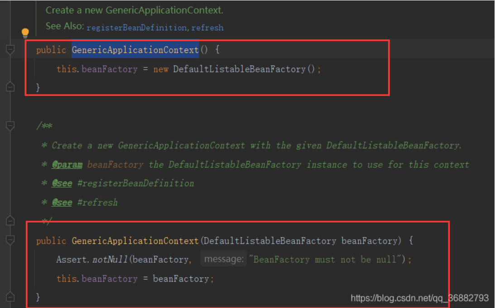
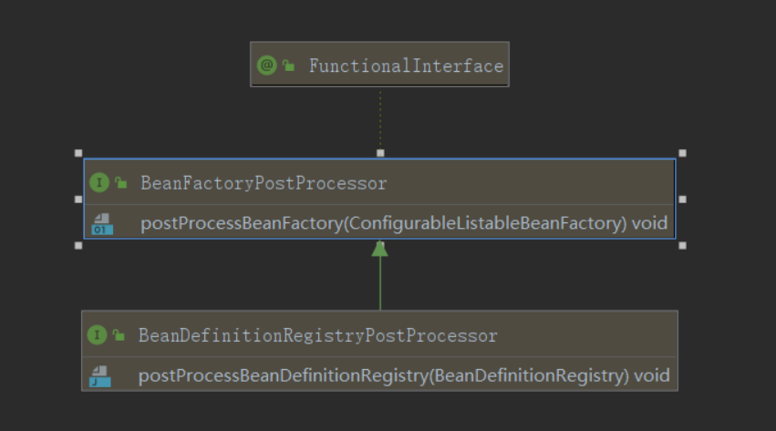
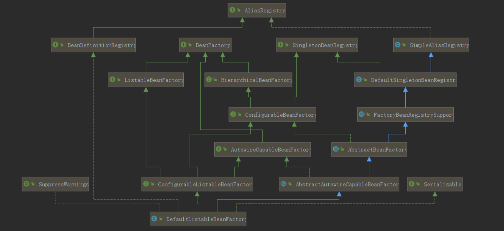
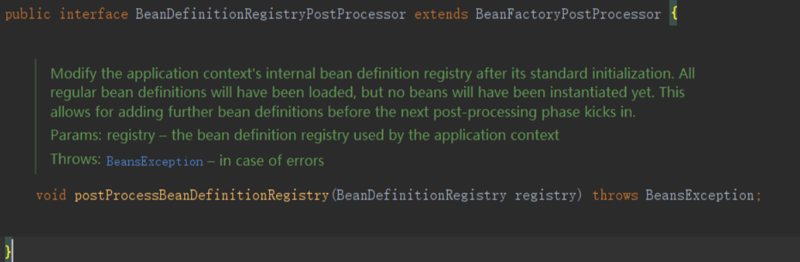
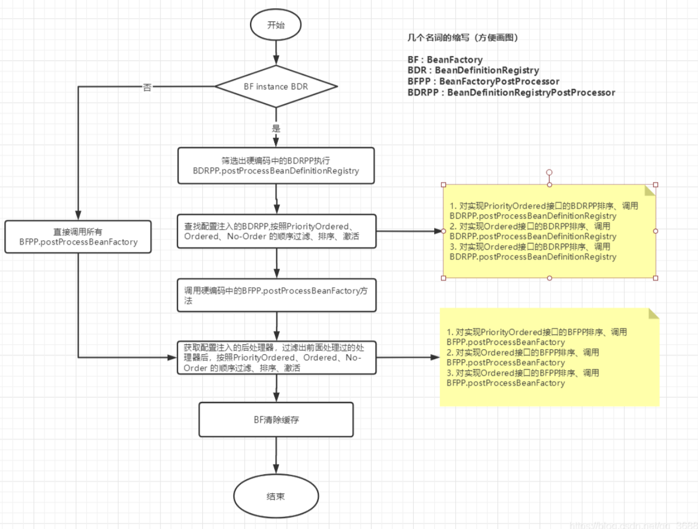

# 准备工作

application.xml

```xml
<?xml version="1.0" encoding="UTF-8"?>
<beans xmlns="http://www.springframework.org/schema/beans"
	   xmlns:xsi="http://www.w3.org/2001/XMLSchema-instance"
	   xsi:schemaLocation="http://www.springframework.org/schema/beans http://www.springframework.org/schema/beans/spring-beans.xsd">
	<bean id="book" class="com.sp.Book">
		<property name="id" value="1"/>
		<property name="name" value="java virtual machine"/>
		<property name="price" value="99.9"/>
		<property name="author" value="sz"/>
	</bean>
</beans>
```


MyTest.java

```java
import org.springframework.context.ApplicationContext;
import org.springframework.context.annotation.AnnotationConfigApplicationContext;
import org.springframework.context.support.ClassPathXmlApplicationContext;

public class MyTest {
   public static void main(String[] args) {
      System.out.println("----------------------------------------------------------------");
//    ApplicationContext context = new AnnotationConfigApplicationContext(MyConfig.class);
//    User user = (User) context.getBean("user");
//    System.out.println(user);

      ApplicationContext ctx = new ClassPathXmlApplicationContext("classpath*:application.xml");
      Book book = (Book) ctx.getBean("book");
      System.out.println(book);
   }
}
```

调用关系：

```python
MyTest#main{ApplicationContext ctx = new ClassPathXmlApplicationContext("classpath*:application.xml");}
ClassPathXmlApplicationContext extends AbstractXmlApplicationContext#ClassPathXmlApplicationContext(xxx){setLocaltion()  refresh()}
ClassPathXmlApplicationContext#refresh()
```


# Spring源码分析一：容器的刷新 - refresh()

## refresh概述

通过构造方法ClassPathXmlApplicationContext.java，加载配置文件

```java
public class ClassPathXmlApplicationContext extends AbstractXmlApplicationContext{
	public ClassPathXmlApplicationContext(
      String[] configLocations, boolean refresh, @Nullable ApplicationContext parent)
      throws BeansException {

       super(parent);
       setConfigLocations(configLocations);
       if (refresh) {
          refresh();//调用父类AbstractXmlApplicationContext的refresh方法。
       }
    }    
}
```


整体代码， `refresh()` 的方法很清晰，因为他将所有的功能封装到了各个方法中。

```java
@Override
public void refresh() throws BeansException, IllegalStateException {
	synchronized (this.startupShutdownMonitor) {
		// 准备刷新上下文环境。作用就是初始化一些状态和属性，为后面的工作做准备。
		prepareRefresh();
		// 初始化beanFactory，如果需要读取XML配置，也是在这一步完成的。
		ConfigurableListableBeanFactory beanFactory = obtainFreshBeanFactory();
		// 对beanFactory 进行各种功能填充
		prepareBeanFactory(beanFactory);
		try {
			// 对 BeanFactory 做额外处理。默认没有实现
			postProcessBeanFactory(beanFactory);
			// 激活各种BeanFactory后处理器
			invokeBeanFactoryPostProcessors(beanFactory);
			// 注册并创建拦截bean创建的bean处理器
			registerBeanPostProcessors(beanFactory);
			// 为上下文初始化Message源，即不同语言的消息体，国际化处理
			initMessageSource();
			// 初始化应用消息广播器，并放入"applicationEventMulticaster" bean 中
			initApplicationEventMulticaster();
			// 留给子类来初始化其他的bean
			onRefresh();
			// 在所有注册的bean中查找listener bean，并注册到消息广播器中
			registerListeners();
			// 初始化剩下的单实例(非惰性)
			finishBeanFactoryInitialization(beanFactory);
			// 完成刷新过程，通知生命周期处理器 lifecycleProcesseor  刷新过程，同时发出ContextRefreshEvent 通知别人。	
			finishRefresh();
		}
		
		... 省略无关代码	
}
```

- prepareRefresh ： 初始化前的准备工作，例如对系统属性或者环境变量进行准备及验证。在某些情况下项目的使用需要读取某些系统变量，那么在启动时候，就可以通过准备函数来进行参数的校验。
- obtainFreshBeanFactory ：初始化BeanFactory，并进行XML 文件读取（如果需要的话）。 这一步之后ApplicationContext就具有BeanFactory 所提供的功能，也就是可以进行Bean的提取等基础操作了。
- prepareBeanFactory ：对BeanFactory 进行各种功能填充。
- postProcessBeanFactory ： 对 BeanFactory 做额外处理。默认没有实现
- invokeBeanFactoryPostProcessors ： 激活各种BeanFactory 处理器(调用了各种BeanFactoryPostProcessor)。其中最为关键的是 
- ConfigurationClassPostProcessor ，在这里完成了配置类的解析，生成的注入容器中的bean 的 BeanDefinition。
- registerBeanPostProcessors ：注册和创建拦截bean创建的bean处理器。BeanPostProcessor 在这一步已经完成了创建。
- initMessageSource ：为上下文初始化Message 源，即对不同语言的消息体进行国际化处理
- initApplicationEventMulticaster ：初始化应用消息广播器，并放入"applicationEventMulticaster" bean 中
- onRefresh ：留给子类来初始化其他bean
- registerListeners ：在所有注册的bean中查找listener bean，注册到消息广播器中
- finishBeanFactoryInitialization ：初始化剩下的实例(非惰性)，在这里调用了getBean方法，创建了非惰性的bean实例
- finishRefresh ：完成刷新过程，通知生命周期处理器 lifecycleProcesseor 刷新过程，同时发出ContextRefreshEvent 通知别人。

## refresh详述

### 1. 准备环境 - prepareRefresh()

初始化一些状态和属性，为后面的工作做准备。

```java
protected void prepareRefresh() {
	// Switch to active.
	// 设置启动时间，激活刷新状态
	this.startupDate = System.currentTimeMillis();
	this.closed.set(false);
	this.active.set(true);

	if (logger.isDebugEnabled()) {
		if (logger.isTraceEnabled()) {
			logger.trace("Refreshing " + this);
		}
		else {
			logger.debug("Refreshing " + getDisplayName());
		}
	}

	// Initialize any placeholder property sources in the context environment.
	// 留给子类覆盖
	initPropertySources();

	// Validate that all properties marked as required are resolvable:
	// see ConfigurablePropertyResolver#setRequiredProperties
	// 验证需要的属性文件是否都已经放入环境中
	getEnvironment().validateRequiredProperties();

	// Store pre-refresh ApplicationListeners...
	// 初始化一些属性
	if (this.earlyApplicationListeners == null) {
		this.earlyApplicationListeners = new LinkedHashSet<>(this.applicationListeners);
	}
	else {
		// Reset local application listeners to pre-refresh state.
		this.applicationListeners.clear();
		this.applicationListeners.addAll(this.earlyApplicationListeners);
	}

	// Allow for the collection of early ApplicationEvents,
	// to be published once the multicaster is available...
	this.earlyApplicationEvents = new LinkedHashSet<>();
}
```


这里需要注意的两个方法：

- initPropertySources() ：这个方法是为了给用户自己实现初始化逻辑，可以初始化一些属性资源。因此Spring并没有实现这个方法。
- validateRequiredProperties() ：这个方法是对一些启动必须的属性的验证。

我们可以通过实现或者继承 ApplicationContext 来重写这两个方法，从而完成一些基本属性的校验。


### 2. 加载BeanFactory#obtainFreshBeanFactory()

`obtainFreshBeanFactory()` 从字面意思就是获取BeanFactory。经过这个方法，BeanFactory 就已经被创建完成。

具体代码如下：

```java
protected ConfigurableListableBeanFactory obtainFreshBeanFactory() {
    refreshBeanFactory();
    return getBeanFactory();
}
```

而实际上将 BeanFactory的创建委托给了 refreshBeanFactory() 方法，refreshBeanFactory() 方法被两个类实现AbstractRefreshableApplicationContext 和 GenericApplicationContext。我们这里分析的是 GenericApplicationContext 实现。
GenericApplicationContext.refreshBeanFactory() 的实现如下：

```java
protected final void refreshBeanFactory() throws IllegalStateException {
	// CAS 设置将刷新状态置为 true
	if (!this.refreshed.compareAndSet(false, true)) {
		throw new IllegalStateException(
				"GenericApplicationContext does not support multiple refresh attempts: just call 'refresh' once");
	}
	// 设置序列id
	this.beanFactory.setSerializationId(getId());
}

...
@Override
public final ConfigurableListableBeanFactory getBeanFactory() {
	return this.beanFactory;
}
```

这里可以看到，GenericApplicationContext 中的实现非常简单。只是简单的将刷新状态置为true。
需要注意的是 this.beanFactory 的实际类型为 DefaultListableBeanFactory。在GenericApplicationContext 的构造函数中进行了对象创建或指定。如下：



### 3. 功能扩展 - prepareBeanFactory()

在步骤2已经获得了beanfactory, 现在对其进行扩展，prepareBeanFactory(beanFactry ) 对beanFactry 做了一些准备工作，设置了一些属性来扩展功能。

我们这里看 AbstractApplicationContext#prepareBeanFactory 的实现。具体代码如下：

```java
protected void prepareBeanFactory(ConfigurableListableBeanFactory beanFactory) {
	// Tell the internal bean factory to use the context's class loader etc.
	// 设置当前beanFactory 的classLoader 为当前context 的classLoader
	beanFactory.setBeanClassLoader(getClassLoader());
	// 设置beanFactory 的表达式语言处理器，Spring3 增加了表达式语言的支持
	// 默认可以使用 #{bean.xxx}的形式来调用处理相关属性。
	beanFactory.setBeanExpressionResolver(new StandardBeanExpressionResolver(beanFactory.getBeanClassLoader()));
	// 为beanFactory 增加一个默认的propertyEditor，这个主要是针对bean的属性等设置管理的一个工具
	beanFactory.addPropertyEditorRegistrar(new ResourceEditorRegistrar(this, getEnvironment()));	
	// Configure the bean factory with context callbacks.
	// 添加BeanPostProcessor
	beanFactory.addBeanPostProcessor(new ApplicationContextAwareProcessor(this));
	// 设置了几个忽略自动装配的接口
	beanFactory.ignoreDependencyInterface(EnvironmentAware.class);
	beanFactory.ignoreDependencyInterface(EmbeddedValueResolverAware.class);
	beanFactory.ignoreDependencyInterface(ResourceLoaderAware.class);
	beanFactory.ignoreDependencyInterface(ApplicationEventPublisherAware.class);
	beanFactory.ignoreDependencyInterface(MessageSourceAware.class);
	beanFactory.ignoreDependencyInterface(ApplicationContextAware.class);

	// BeanFactory interface not registered as resolvable type in a plain factory.
	// MessageSource registered (and found for autowiring) as a bean.
	// 设置了几个自动装配的特殊规则
	beanFactory.registerResolvableDependency(BeanFactory.class, beanFactory);
	beanFactory.registerResolvableDependency(ResourceLoader.class, this);
	beanFactory.registerResolvableDependency(ApplicationEventPublisher.class, this);
	beanFactory.registerResolvableDependency(ApplicationContext.class, this);

	// Register early post-processor for detecting inner beans as ApplicationListeners.
	beanFactory.addBeanPostProcessor(new ApplicationListenerDetector(this));
	
	// Detect a LoadTimeWeaver and prepare for weaving, if found.
	// 增加对 AspectJ的支持
	if (beanFactory.containsBean(LOAD_TIME_WEAVER_BEAN_NAME)) {
		beanFactory.addBeanPostProcessor(new LoadTimeWeaverAwareProcessor(beanFactory));
		// Set a temporary ClassLoader for type matching.
		beanFactory.setTempClassLoader(new ContextTypeMatchClassLoader(beanFactory.getBeanClassLoader()));
	}

	// Register default environment beans.
	// 添加默认的系统环境bean
	if (!beanFactory.containsLocalBean(ENVIRONMENT_BEAN_NAME)) {
		beanFactory.registerSingleton(ENVIRONMENT_BEAN_NAME, getEnvironment());
	}
	if (!beanFactory.containsLocalBean(SYSTEM_PROPERTIES_BEAN_NAME)) {
		beanFactory.registerSingleton(SYSTEM_PROPERTIES_BEAN_NAME, getEnvironment().getSystemProperties());
	}
	if (!beanFactory.containsLocalBean(SYSTEM_ENVIRONMENT_BEAN_NAME)) {
		beanFactory.registerSingleton(SYSTEM_ENVIRONMENT_BEAN_NAME, getEnvironment().getSystemEnvironment());
	}
}
```

上面函数中主要对几个方面进行了扩展：

- 增加 SpEL 语言的支持
- 增加对属性编辑器的支持
- 增加对一些内置类，比如 EnvironmentAware、EmbeddedValueResolverAware等。
- 设置了依赖功能可忽略的接口
- 注册一些固定依赖的属性
- 增加 AspectJ 的支持
- 将相关环境变量及属性注册以单例模式注册

#### 3.1. SpEL 的支持

SpEL 使用 #{…} 作为界定符，所有在大括号里面的字符都被认为是SpEL，使用格式如下：

```xml
<bean id="demoB" name="demoB" class="com.kingfish.springbootdemo.replace.DemoB">
    <property name="demoA" value="#{demoA}"/>
</bean>
```

相当于

```xml
<bean id="demoA" name="demoA" class="com.kingfish.springbootdemo.replace.DemoA" ></bean>
<bean id="demoB" name="demoB" class="com.kingfish.springbootdemo.replace.DemoB">
    <property name="demoA" value="#{demoA}"/>
</bean>
```

在上面的代码中可以通过如下的代码注册语言解析器，就可以对SpEL 进行解析了。

```java
beanFactory.setBeanExpressionResolver(new StandardBeanExpressionResolver(beanFactory.getBeanClassLoader()));
```

其解析过程是在 bean 初始化的属性注入阶段(AbstractAutowireCapableBeanFactory#populateBean) 中调用了 applyPropertyValues(beanName, mbd, bw, pvs); 方法。在这个方法中，会通过构造BeanDefinitionValueResolver 类型实例 valueResolver 来进行属性值的解析，同时也是在这个步骤中一般通过 AbstractBeanFactory 中的 evaluateBeanDefinitionString 方法完成了SpEL的解析。

```java
protected Object evaluateBeanDefinitionString(@Nullable String value, @Nullable BeanDefinition beanDefinition) {
	if (this.beanExpressionResolver == null) {
		return value;
	}

	Scope scope = null;
	if (beanDefinition != null) {
		String scopeName = beanDefinition.getScope();
		if (scopeName != null) {
			scope = getRegisteredScope(scopeName);
		}
	}
	return this.beanExpressionResolver.evaluate(value, new BeanExpressionContext(this, scope));
}
```

当调用这个方法时会判断 是否存在语言解析器，如果存在则调用语言解析器的方法进行解析，解析的过程是在 Spring的expression 的包内，应用语言解析器的调用主要是在解析依赖注册bean 的时候，以及在完成bean的初始化和属性获取后进行属性填充的时候。


### 4. postProcessBeanFactory

AbstractApplicationContext#postProcessBeanFactory 为对 并没有实现。如下

```java
protected void postProcessBeanFactory(ConfigurableListableBeanFactory beanFactory) {}
```

而在Springboot2.x 版本中，其实现如下：
AnnotationConfigServletWebServerApplicationContext#postProcessBeanFactory

```java
@Override
protected void postProcessBeanFactory(ConfigurableListableBeanFactory beanFactory) {
	super.postProcessBeanFactory(beanFactory);
	// 扫描 指定 目录下的bean并注册
	if (this.basePackages != null && this.basePackages.length > 0) {
		this.scanner.scan(this.basePackages);
	}
	// 扫描指定注解下的bean 并注册
	if (!this.annotatedClasses.isEmpty()) {
		this.reader.register(ClassUtils.toClassArray(this.annotatedClasses));
	}
}
```

需要注意的是 `basePackages` 和 `annotatedClasses` 默认都为空。即如果需要执行这一段逻辑，我们需要在指定 `basePackages` 和 `annotatedClasses` 后重新刷新容器。

### 5. 激活 BeanFactory 的后处理器 -invokeBeanFactoryPostProcessors

BeanFactory 作为Spring中容器功能的基础，用于存放所有已经加载的bean，为了保证程序的可扩展性，Spring 针对BeanFactory 做了大量的扩展，如PostProcessor。

这一步的功能主要是激活各种 BeanFactoryPostProcessors。

```java
// Invoke factory processors registered as beans in the context.
invokeBeanFactoryPostProcessors(beanFactory);
```

由于篇幅问题，该部分的分析具体请看：[Spring源码分析二：BeanFactoryPostProcessor 的处理]

### 6. BeanPostProcessor 的注册 - registerBeanPostProcessors

这一部分的部分叙述内容和 invokeBeanFactoryPostProcessors 的分析有关联，建议看完 invokeBeanFactoryPostProcessors 方法的分析再来看此部分。

这里的分析和 invokeBeanFactoryPostProcessors 方法中类似，但是相比之下更加简单。因为这里不需要考虑硬编码的问题。 registerBeanPostProcessors 将 BeanPostProcessor 初始化后并将其 保存到了AbstractBeanFactory#beanPostProcessors，方便之后对 BeanPostProcessor 的调用。下面来看看代码：

```java
public static void registerBeanPostProcessors(
		ConfigurableListableBeanFactory beanFactory, AbstractApplicationContext applicationContext) {
	// 获取所有后处理器的name
	String[] postProcessorNames = beanFactory.getBeanNamesForType(BeanPostProcessor.class, true, false);

	// Register BeanPostProcessorChecker that logs an info message when
	// a bean is created during BeanPostProcessor instantiation, i.e. when
	// a bean is not eligible for getting processed by all BeanPostProcessors.
	int beanProcessorTargetCount = beanFactory.getBeanPostProcessorCount() + 1 + postProcessorNames.length;
	// BeanPostProcessorChecker 是一个普通的信息打印
	//可能会有些情况当Spring 的配置中的后处理器还没有被注册就已经开始了bean的实例化，便会打印出BeanPostProcessorChecker 中设定的信息
	beanFactory.addBeanPostProcessor(new BeanPostProcessorChecker(beanFactory, beanProcessorTargetCount));

	// Separate between BeanPostProcessors that implement PriorityOrdered,
	// Ordered, and the rest.
	// 保存实现了PriorityOrderd 接口的 后处理器
	List<BeanPostProcessor> priorityOrderedPostProcessors = new ArrayList<>();
	// 保存MergedBeanDefinitionPostProcessor 后处理器
	List<BeanPostProcessor> internalPostProcessors = new ArrayList<>();	
	// 保存实现了Orderd 接口的 后处理器
	List<String> orderedPostProcessorNames = new ArrayList<>();
	// 保存没有实现任何排序接口的后处理器
	List<String> nonOrderedPostProcessorNames = new ArrayList<>();
	// 按照规则筛选出不同的后处理器保存到集合中
	for (String ppName : postProcessorNames) {
		if (beanFactory.isTypeMatch(ppName, PriorityOrdered.class)) {
			
			BeanPostProcessor pp = beanFactory.getBean(ppName, BeanPostProcessor.class);
			priorityOrderedPostProcessors.add(pp);
			if (pp instanceof MergedBeanDefinitionPostProcessor) {
				internalPostProcessors.add(pp);
			}
		}
		else if (beanFactory.isTypeMatch(ppName, Ordered.class)) {
			orderedPostProcessorNames.add(ppName);
		}
		else {
			nonOrderedPostProcessorNames.add(ppName);
		}
	}

	// First, register the BeanPostProcessors that implement PriorityOrdered.
	// 对实现了PriorityOrderd 接口的 后处理器 进行排序
	sortPostProcessors(priorityOrderedPostProcessors, beanFactory);
	// 注册，实际上就是保存到 AbstractBeanFactory#beanPostProcessors 集合中。在getBean使用的时候直接拿取该属性即可
	registerBeanPostProcessors(beanFactory, priorityOrderedPostProcessors);

	// Next, register the BeanPostProcessors that implement Ordered.
	// 下面逻辑类似
	List<BeanPostProcessor> orderedPostProcessors = new ArrayList<>(orderedPostProcessorNames.size());
	for (String ppName : orderedPostProcessorNames) {
		BeanPostProcessor pp = beanFactory.getBean(ppName, BeanPostProcessor.class);
		orderedPostProcessors.add(pp);
		if (pp instanceof MergedBeanDefinitionPostProcessor) {
			internalPostProcessors.add(pp);
		}
	}
	sortPostProcessors(orderedPostProcessors, beanFactory);
	registerBeanPostProcessors(beanFactory, orderedPostProcessors);

	// Now, register all regular BeanPostProcessors.
	List<BeanPostProcessor> nonOrderedPostProcessors = new ArrayList<>(nonOrderedPostProcessorNames.size());
	for (String ppName : nonOrderedPostProcessorNames) {
		// 创建了 BeanPostProcessor 实例
		BeanPostProcessor pp = beanFactory.getBean(ppName, BeanPostProcessor.class);
		nonOrderedPostProcessors.add(pp);
		if (pp instanceof MergedBeanDefinitionPostProcessor) {
			internalPostProcessors.add(pp);
		}
	}
	registerBeanPostProcessors(beanFactory, nonOrderedPostProcessors);

	// Finally, re-register all internal BeanPostProcessors.
	sortPostProcessors(internalPostProcessors, beanFactory);
	// 这里并不是重复注册， registerBeanPostProcessors 方法会先移除已存在的 BeanPostProcessor 随后重新加入。
	registerBeanPostProcessors(beanFactory, internalPostProcessors);

	// Re-register post-processor for detecting inner beans as ApplicationListeners,
	// moving it to the end of the processor chain (for picking up proxies etc).
	beanFactory.addBeanPostProcessor(new ApplicationListenerDetector(applicationContext));
}
```

相较于invokeBeanFactoryPostProcessors 方法，这里并没有考虑打硬编码的后处理器的顺序问题。其原因在于invokeBeanFactoryPostProcessors 中不仅要实现BeanFactoryPostProcessor的注册功能，还需要完成激活（执行对应方法）操作，所以需要载入配置中的定义并进行激活。而对于BeanPostProcessor 并不需要马上调用，并且硬编码方式实现的功能是将后处理器提取并调用，这里了并不需要调用，所以不需要考虑硬编码问题。这里只需要将配置文件中的BeanPostProcessor 创建之后出来并注册进行BeanFactory 中即可。需要注意 ： 这里虽然没有调用 BeanPostProcessor，但是 BeanPostProcessor 的实例已经通过 beanFactory.getBean 创建完成。

### 7. 初始化消息资源 -initMessageSource

这里的作用很明显就是提取配置中定义的MessageSource，并将其记录在Spring容器中，也就是AbstractApplicationContext中。如果用户没有设置资源文件，Spring提供了默认的配置 DelegatingMessageSource。

代码逻辑也很简单：在这里Spring 通过 beanFactory.getBean(MESSAGE_SOURCE_BEAN_NAME, MessageSource.class); 来获取名称为MESSAGE_SOURCE_BEAN_NAME (messageSource) 的bean作为 资源文件。这里也体现出了Spring “约束大于规定”的原则。

```java
protected void initMessageSource() {
	ConfigurableListableBeanFactory beanFactory = getBeanFactory();
	if (beanFactory.containsLocalBean(MESSAGE_SOURCE_BEAN_NAME)) {
		// 获取自定义资源文件。这里可以看出使用了硬编码，默认资源文件为messageSource，否则便获取不到自定义配置资源
		this.messageSource = beanFactory.getBean(MESSAGE_SOURCE_BEAN_NAME, MessageSource.class);
		// Make MessageSource aware of parent MessageSource.
		if (this.parent != null && this.messageSource instanceof HierarchicalMessageSource) {
			HierarchicalMessageSource hms = (HierarchicalMessageSource) this.messageSource;
			if (hms.getParentMessageSource() == null) {
				// Only set parent context as parent MessageSource if no parent MessageSource
				// registered already.
				hms.setParentMessageSource(getInternalParentMessageSource());
			}
		}
		if (logger.isTraceEnabled()) {
			logger.trace("Using MessageSource [" + this.messageSource + "]");
		}
	}
	else {
		// Use empty MessageSource to be able to accept getMessage calls.
		// 如果用户没有配置，则使用默认的的资源文件
		DelegatingMessageSource dms = new DelegatingMessageSource();
		dms.setParentMessageSource(getInternalParentMessageSource());
		this.messageSource = dms;
		beanFactory.registerSingleton(MESSAGE_SOURCE_BEAN_NAME, this.messageSource);
		if (logger.isTraceEnabled()) {
			logger.trace("No '" + MESSAGE_SOURCE_BEAN_NAME + "' bean, using [" + this.messageSource + "]");
		}
	}
}
```

### 8. 初始化事件监听 - initApplicationEventMulticaster

**`initApplicationEventMulticaster` 的方法比较简单，考虑了两种情况：**

1. 如果用户自定义了事件广播器，在使用用户自定义的事件广播器
2. 如果用户没有自定义事件广播器，则使用默认的 `ApplicationEventMulticaster`

```java
protected void initApplicationEventMulticaster() {
	ConfigurableListableBeanFactory beanFactory = getBeanFactory();
	// 如果用户自定义了事件广播器，则使用用户自定义
	if (beanFactory.containsLocalBean(APPLICATION_EVENT_MULTICASTER_BEAN_NAME)) {
		this.applicationEventMulticaster =
				beanFactory.getBean(APPLICATION_EVENT_MULTICASTER_BEAN_NAME, ApplicationEventMulticaster.class);
		if (logger.isTraceEnabled()) {
			logger.trace("Using ApplicationEventMulticaster [" + this.applicationEventMulticaster + "]");
		}
	}
	else {
		// 否则使用默认的事件广播器 SimpleApplicationEventMulticaster
		this.applicationEventMulticaster = new SimpleApplicationEventMulticaster(beanFactory);
		beanFactory.registerSingleton(APPLICATION_EVENT_MULTICASTER_BEAN_NAME, this.applicationEventMulticaster);
		if (logger.isTraceEnabled()) {
			logger.trace("No '" + APPLICATION_EVENT_MULTICASTER_BEAN_NAME + "' bean, using " +
					"[" + this.applicationEventMulticaster.getClass().getSimpleName() + "]");
		}
	}
}
```


在 SimpleApplicationEventMulticaster 中有一段代码如下，可以看到，当Spring事件产生的时候，默认会使用SimpleApplicationEventMulticaster#multicastEvent 方法来广播事件，遍历所有的监听器，并使用监听器中的 onApplicationEvent 方法来进行监听事件的处理(通过 invokeListener 方法激活监听方法)。而对于每个监听器来说，其实都可以获取到产生的事件，但使用进行处理由监听器自己决定。

```java
@Override
public void multicastEvent(final ApplicationEvent event, @Nullable ResolvableType eventType) {
	ResolvableType type = (eventType != null ? eventType : resolveDefaultEventType(event));
	Executor executor = getTaskExecutor();
	for (ApplicationListener<?> listener : getApplicationListeners(event, type)) {
		if (executor != null) {
			executor.execute(() -> invokeListener(listener, event));
		}
		else {
			invokeListener(listener, event);
		}
	}
}
```

### 9. onRefresh();

```java
onRefresh();
```

在Springboot 中会刷新 调用 `ServletWebServerApplicationContext#onRefresh` 方法。

```java
protected void onRefresh() {
	super.onRefresh();//调用了 `GenericWebApplicationContext` 中的实现也就是初始化一下主题资源。
	try {
		createWebServer();//这里会启动Tomcat服务器
	}
	catch (Throwable ex) {
		throw new ApplicationContextException("Unable to start web server", ex);
	}
}
```


其中
`super.onRefresh();` 调用了 `GenericWebApplicationContext` 中的实现也就是初始化一下主题资源。

```java
@Override
@Override
protected void onRefresh() {
    this.themeSource = UiApplicationContextUtils.initThemeSource(this);
}
```

但是在 createWebServer(); 中会启动Tomcat服务器

```java
private void createWebServer() {
	WebServer webServer = this.webServer;
	ServletContext servletContext = getServletContext();
	if (webServer == null && servletContext == null) {
		// 获取 webServer 工厂类，因为webServer 的提供者有多个：JettyServletWebServerFactory、TomcatServletWebServerFactory、UndertowServletWebServerFactory
		ServletWebServerFactory factory = getWebServerFactory();
		// 获取webserver。其中启动了tomcat
		this.webServer = factory.getWebServer(getSelfInitializer());
	}
	else if (servletContext != null) {
		try {
			getSelfInitializer().onStartup(servletContext);
		}
		catch (ServletException ex) {
			throw new ApplicationContextException("Cannot initialize servlet context", ex);
		}
	}
	// 初始化资源
	initPropertySources();
}
```


### 10. 注册监听器 - registerListeners()

**注册监听器的方法实现非常简单，分为如下几步**

1. 注册硬编码注册的监听器
2. 注册配置注册的监听器
3. 发布早先的监听事件

```java
protected void registerListeners() {
	// Register statically specified listeners first.
	// 硬编码方式注册的监听器处理
	for (ApplicationListener<?> listener : getApplicationListeners()) {
		getApplicationEventMulticaster().addApplicationListener(listener);
	}

	// Do not initialize FactoryBeans here: We need to leave all regular beans
	// uninitialized to let post-processors apply to them!
	// 配置文件注册的监听处理器
	String[] listenerBeanNames = getBeanNamesForType(ApplicationListener.class, true, false);
	for (String listenerBeanName : listenerBeanNames) {
		getApplicationEventMulticaster().addApplicationListenerBean(listenerBeanName);
	}

	// Publish early application events now that we finally have a multicaster...
	// 发布之前保存的需要发布的事件
	Set<ApplicationEvent> earlyEventsToProcess = this.earlyApplicationEvents;
	this.earlyApplicationEvents = null;
	if (earlyEventsToProcess != null) {
		for (ApplicationEvent earlyEvent : earlyEventsToProcess) {
			getApplicationEventMulticaster().multicastEvent(earlyEvent);
		}
	}
}
```

### 11. BeanFactory的收尾工作 - finishBeanFactoryInitialization

这一步的目的是 结束BeanFactory 的初始化工作，其中包括如下几步 ：

1. 对 ConversionService 的设置。通过 ConversionService 的配置可以很轻松完成一些类型转换工作。
2. 冻结所有的bean定义 。到这一步，也就说所有的bean定义已经定型了，不可被修改了，也正式可以缓存bean的元数据了。
3. 初始化剩下的非惰性单实例。ApplicationContext 实现的默认行为就是启动时将所有单例 bean提前进行实例化。提前实例化意味着作为初始化过程的一部分，ApplicationContext 实例会创建并配置所有的单例bean。而这个实例化的过程就是在 preInstantiateSingletons 中完成的。

关于 getBean 方法的逻辑，请阅 Spring 源码分析三 ：bean的加载① - doGetBean概述

代码如下：

```java
protected void finishBeanFactoryInitialization(ConfigurableListableBeanFactory beanFactory) {
	// Initialize conversion service for this context.
	// 1. 对 ConversionService 的设置
	// 如果 BeanFactory 中加载了beanName 为 ConversionService 的bean，并且类型是 ConversionService。那么将其设置为 conversionService
	if (beanFactory.containsBean(CONVERSION_SERVICE_BEAN_NAME) &&
			beanFactory.isTypeMatch(CONVERSION_SERVICE_BEAN_NAME, ConversionService.class)) {
		beanFactory.setConversionService(
				beanFactory.getBean(CONVERSION_SERVICE_BEAN_NAME, ConversionService.class));
	}

	// Register a default embedded value resolver if no bean post-processor
	// (such as a PropertyPlaceholderConfigurer bean) registered any before:
	// at this point, primarily for resolution in annotation attribute values.
	if (!beanFactory.hasEmbeddedValueResolver()) {
		beanFactory.addEmbeddedValueResolver(strVal -> getEnvironment().resolvePlaceholders(strVal));
	}

	// Initialize LoadTimeWeaverAware beans early to allow for registering their transformers early.
	String[] weaverAwareNames = beanFactory.getBeanNamesForType(LoadTimeWeaverAware.class, false, false);
	// 开始调用 getBean 方法初始化LoadTimeWeaverAware 
	for (String weaverAwareName : weaverAwareNames) {
		getBean(weaverAwareName);
	}

	// Stop using the temporary ClassLoader for type matching.
	beanFactory.setTempClassLoader(null);

	// Allow for caching all bean definition metadata, not expecting further changes.
	// 2. 冻结所有的bean定义，说明注册的bean定义将不被修改或任何进一步的处理
	beanFactory.freezeConfiguration();

	// Instantiate all remaining (non-lazy-init) singletons.
	// 3. 初始化剩下的非惰性单实例
	beanFactory.preInstantiateSingletons();
}
```

这里我们需要特别关注一下 `DefaultListableBeanFactory#preInstantiateSingletons`，在这里面，容器创建了所有的非惰性单实例。（之所以不创建原型bean，是因为原型bean没必要进行缓存，每次使用直接创建即可）

```java
@Override
public void preInstantiateSingletons() throws BeansException {
	if (logger.isTraceEnabled()) {
		logger.trace("Pre-instantiating singletons in " + this);
	}

	// Iterate over a copy to allow for init methods which in turn register new bean definitions.
	// While this may not be part of the regular factory bootstrap, it does otherwise work fine.
	// 获取所有 beanName
	List<String> beanNames = new ArrayList<>(this.beanDefinitionNames);

	// Trigger initialization of all non-lazy singleton beans...
	for (String beanName : beanNames) {
		// 获取合并后的 BeanDefinition
		RootBeanDefinition bd = getMergedLocalBeanDefinition(beanName);
		// 非抽象 && 单例 && 非惰性加载
		if (!bd.isAbstract() && bd.isSingleton() && !bd.isLazyInit()) {
			// 判断是否是  FactoryBean 类型
			if (isFactoryBean(beanName)) {
				// 如果是 Factorybean 则 拼接 & 前缀获取bean 
				Object bean = getBean(FACTORY_BEAN_PREFIX + beanName);
				if (bean instanceof FactoryBean) {
				// 判断是否要立即初始化Bean。对于 FactoryBean，可能并不需要立即初始化其getObject 方法代理的对象。
					final FactoryBean<?> factory = (FactoryBean<?>) bean;
					boolean isEagerInit;
					if (System.getSecurityManager() != null && factory instanceof SmartFactoryBean) {
						isEagerInit = AccessController.doPrivileged((PrivilegedAction<Boolean>)
										((SmartFactoryBean<?>) factory)::isEagerInit,
								getAccessControlContext());
					}
					else {
						isEagerInit = (factory instanceof SmartFactoryBean &&
								((SmartFactoryBean<?>) factory).isEagerInit());
					}
					// 如果需要立即初始化，则初始化bean
					if (isEagerInit) {
						getBean(beanName);
					}
				}
			}
			else {
			// 非 FactoryBean 类型直接获取bean
				getBean(beanName);
			}
		}
	}

	// Trigger post-initialization callback for all applicable beans...
	// 触发所有适用bean的初始化后回调。 这里实际上是触发 SmartInitializingSingleton#afterSingletonsInstantiated 方法
	for (String beanName : beanNames) {
		Object singletonInstance = getSingleton(beanName);
		if (singletonInstance instanceof SmartInitializingSingleton) {
			final SmartInitializingSingleton smartSingleton = (SmartInitializingSingleton) singletonInstance;
			if (System.getSecurityManager() != null) {
				AccessController.doPrivileged((PrivilegedAction<Object>) () -> {
					smartSingleton.afterSingletonsInstantiated();
					return null;
				}, getAccessControlContext());
			}
			else {
				smartSingleton.afterSingletonsInstantiated();
			}
		}
	}
}
```

### 12. 完成刷新 - finishRefresh()

在 Spring 中还提供了 Lifecycle 接口，Lifecycle 接口包含 start、stop 方法，实现此接口后Spring会保证在启动的时候调用其 start 方法开始生命周期，并在Spring关闭的时候调用stop方法来结束生命周期，通常用来配置后台程序，在启动后一直运行(如对MQ进行轮询等)。而ApplicationContext 的初始化最后证实保证了这一功能的实现。

```java
protected void finishRefresh() {
	// Clear context-level resource caches (such as ASM metadata from scanning).
	// 清除资源缓存
	clearResourceCaches();	
	// Initialize lifecycle processor for this context.
	// 当Application 启动或停止时，会通过 LifecycleProcessor 来与所有声明的bean周期做状态更新，
	// 而在LifecycleProcessor 的使用前首先需要初始化，这里进行了LifecycleProcessor  的初始化。
	initLifecycleProcessor();

	// Propagate refresh to lifecycle processor first.
	// 启动所有实现了Lifecycle 接口的bean
	getLifecycleProcessor().onRefresh();

	// Publish the final event.
	// 当完成ApplicationContext 初始化的时候，要通过Spring 中的事件发布机制来发出ContextRefreshedEvent 的事件，以保证对应的监听器可以做进一步的逻辑处理。
	publishEvent(new ContextRefreshedEvent(this));

	// Participate in LiveBeansView MBean, if active.
	// 注册 ApplicationContext
	LiveBeansView.registerApplicationContext(this);
}
```


# Spring源码分析二：BeanFactoryPostProcessor 的处理

本文衍生篇：

1. [Spring 源码分析衍生篇八 ：ConfigurationClassPostProcessor 上篇](https://blog.csdn.net/qq_36882793/article/details/106558290)
2. [Spring 源码分析衍生篇九 ：ConfigurationClassPostProcessor 下篇](https://blog.csdn.net/qq_36882793/article/details/106652607)

实现IOC的两个核心后处理器 ：

ConfigurationClassPostProcessor 解析配置类(这里的配置类不仅仅局限于@Configuration 注解，还包括 @Import、 @ImportResource 等注解)，将解析到的需要注入到Spring容器中的bean的BeanDefinition保存起来
AutowiredAnnotationBeanPostProcessor 解析bean中的 需要自动注入的bean @Autowired 和 @Inject @Value注解。

## BeanFactoryPostProcessor & BeanDefinitionRegistryPostProcessor

由于 invokeBeanFactoryPostProcessors 方法中主要就是对BeanFactoryPostProcessor 的处理，所以这里简单的介绍一下 BeanFactoryPostProcessor 及其子接口 BeanDefinitionRegistryPostProcessor。其结构如下图：



BeanFactoryPostProcessor 相比较于 BeanPostProcessor 方法是很简单的，只有一个方法，其子接口也就一个方法。但是他们俩的功能又是类似的，区别就是作用域并不相同。BeanFactoryPostProcessor的作用域范围是容器级别的。它只和你使用的容器有关。如果你在容器中定义一个BeanFactoryPostProcessor ，它仅仅对此容器中的bean进行后置处理。BeanFactoryPostProcessor 不会对定义在另一个容器中的bean进行后置处理，即使这两个容器都在同一容器中。
BeanFactoryPostProcessor 可以对 bean的定义(配置元数据)进行处理。Spring IOC 容器允许 BeanFactoryPostProcessor 在容器实际实例化任何其他bean之前读取配置元数据，并有可能修改它，也即是说 BeanFactoryPostProcessor 是直接修改了bean的定义，BeanPostProcessor 则是对bean创建过程中进行干涉。

BeanDefinitionRegistryPostProcessor 和 BeanFactoryPostProcessor 的区别在于：

- BeanDefinitionRegistryPostProcessor .postProcessBeanDefinitionRegistry 方法针对是BeanDefinitionRegistry类型的ConfigurableListableBeanFactory，可以实现对BeanDefinition的增删改查等操作，但是对于非 ConfigurableListableBeanFactory 类型的BeanFactory，并不起作用。

- BeanFactoryPostProcessor .postProcessBeanFactory 针对的是所有的BeanFactory。

- postProcessBeanDefinitionRegistry 的调用时机在postProcessBeanFactory 之前。


## BeanFactory

需要注意的是，我们这里的 BeanFactory 实际类型是 DefaultListableBeanFactory。这一点在 Spring源码分析一：容器的刷新 - refresh() 中已经得到证实。

下面我们看看 DefaultListableBeanFactory 的结构图如下，可以看到DefaultListableBeanFactory 实现了 BeanDefinitionRegistry 接口。这点在下面的分析中会用到。




invokeBeanFactoryPostProcessors 方法的作用是激活BeanFactoryPostProcessor 和 BeanDefinitionRegistryPostProcessor 。为了更好的了解下面的代码，我们先了解几个代码中的规则：

1. BeanFactoryPostProcessor 在本次分析中分为两种类型： BeanFactoryPostProcessor 和其子接口 BeanDefinitionRegistryPostProcessor 。BeanDefinitionRegistryPostProcessor 相较于 BeanFactoryPostProcessor ，增加了一个方法如下。



需要注意的是，BeanDefinitionRegistryPostProcessor#postProcessBeanDefinitionRegistry 这个方法仅仅针对于 BeanDefinitionRegistry 类型的 BeanFactory 生效，这一点根据其入参就可以看到。
总结一下即 ： BeanFactoryPostProcessor 针对所有的 BeanFactory ，即对于所有类型的BeanFactory 都会调用其方法；BeanDefinitionRegistryPostProcessor 仅对 BeanDefinitionRegistry 子类的BeanFactory 起作用，非BeanDefinitionRegistry类型则直接处理即可。

2. BeanFactoryPostProcessor 的注入分为两种方式：
   - 配置注入方式：即通过注解或者xml的方式动态的注入到容器中的BeanFactoryPostProcessor
   - 硬编码注入方式: 这种方式是直接调用 AbstractApplicationContext#addBeanFactoryPostProcessor 方法将 BeanFactoryPostProcessor 添加到 AbstractApplicationContext#beanFactoryPostProcessors 属性中。

3. 硬编码注入的`BeanFactoryPostProcessor` 并不需要也不支持接口排序，而配置注入的方式因为Spring无法保证加载的顺序，所以通过支持PriorityOrdered、Ordered排序接口的排序。

4. 在下面代码分析中会由四个集合
   - regularPostProcessors ： 记录通过硬编码方式注册的BeanFactoryPostProcessor 类型的处理器
   - registryProcessors：记录通过硬编码方式注册的BeanDefinitionRegistryPostProcessor 类型的处理器
   - currentRegistryProcessors ： 记录通过配置方式注册的 BeanDefinitionRegistryPostProcessor 类型的处理器
   - processedBeans ： 记录当前已经处理过的BeanFactoryPostProcessor 和 BeanDefinitionRegistryPostProcessor

其实调用顺序可以归纳为： 硬编码先于配置，postProcessBeanDefinitionRegistry 先于postProcessBeanFactory

下面我们来看具体代码：
AbstractApplicationContext#invokeBeanFactoryPostProcessors 方法内容如下

```java
protected void invokeBeanFactoryPostProcessors(ConfigurableListableBeanFactory beanFactory) {
	PostProcessorRegistrationDelegate.invokeBeanFactoryPostProcessors(beanFactory, getBeanFactoryPostProcessors());

	// Detect a LoadTimeWeaver and prepare for weaving, if found in the meantime
	// (e.g. through an @Bean method registered by ConfigurationClassPostProcessor)
	if (beanFactory.getTempClassLoader() == null && beanFactory.containsBean(LOAD_TIME_WEAVER_BEAN_NAME)) {
		beanFactory.addBeanPostProcessor(new LoadTimeWeaverAwareProcessor(beanFactory));
		beanFactory.setTempClassLoader(new ContextTypeMatchClassLoader(beanFactory.getBeanClassLoader()));
	}
}
```

可以看到主要功能还是在PostProcessorRegistrationDelegate.invokeBeanFactoryPostProcessors(beanFactory, getBeanFactoryPostProcessors()); 这一句上。我们先来看看 getBeanFactoryPostProcessors() 得到的是什么

## getBeanFactoryPostProcessors()

```java
private final List<BeanFactoryPostProcessor> beanFactoryPostProcessors = new ArrayList<>();
	
@Override
public void addBeanFactoryPostProcessor(BeanFactoryPostProcessor postProcessor) {
	Assert.notNull(postProcessor, "BeanFactoryPostProcessor must not be null");
	this.beanFactoryPostProcessors.add(postProcessor);
}

/**
 * Return the list of BeanFactoryPostProcessors that will get applied
 * to the internal BeanFactory.
 */
public List<BeanFactoryPostProcessor> getBeanFactoryPostProcessors() {
	return this.beanFactoryPostProcessors;
}
```

可以看到 getBeanFactoryPostProcessors() 方法仅仅是将 beanFactoryPostProcessors 集合返回了出去而已。那么 beanFactoryPostProcessors 集合是通过 set方法添加的。这就是我们上面提到过的，beanFactoryPostProcessors 实际上是 硬编码形式注册的BeanDefinitionRegistryPostProcessor 类型的处理器集合。

## invokeBeanFactoryPostProcessors

通过上一步，我们可以知道 入参中的 beanFactoryPostProcessors 集合是硬编码注册的 集合。对于下面的分析我们就好理解了。

下面代码主要是对于 BeanDefinitionRegistry 类型 BeanFactory的处理以及 BeanFactoryPostProcessor 调用顺序问题的处理。实际上并不复杂。

```java
public static void invokeBeanFactoryPostProcessors(
		ConfigurableListableBeanFactory beanFactory, List<BeanFactoryPostProcessor> beanFactoryPostProcessors) {

	// Invoke BeanDefinitionRegistryPostProcessors first, if any.
	Set<String> processedBeans = new HashSet<>();
	// 对BeanDefinitionRegistry类型的处理，这里是交由BeanDefinitionRegistryPostProcessor来处理
	// 这里判断BeanFactory 如果是 BeanDefinitionRegistry 子类 则需要进行BeanDefinitionRegistryPostProcessor 的处理，否则直接按照 BeanFactoryPostProcessor处理即可。
	// 关于为什么BeanDefinitionRegistry 比较特殊上面也说过，因为BeanDefinitionRegistryPostProcessor 只能处理 BeanDefinitionRegistry 的子类，所以这里需要区分是否是 BeanDefinitionRegistry 类型
	if (beanFactory instanceof BeanDefinitionRegistry) {
        // 下面逻辑看似复杂，其实就两步：
        // 1. 获取所有硬编码的 BeanDefinitionRegistryPostProcessor 类型，激活postProcessBeanDefinitionRegistry 方法
        // 2. 获取所有配置的BeanDefinitionRegistryPostProcessor，激活postProcessBeanDefinitionRegistry 方法
        
		BeanDefinitionRegistry registry = (BeanDefinitionRegistry) beanFactory;
        // 记录通过硬编码方式注册的BeanFactoryPostProcessor 类型的处理器
		List<BeanFactoryPostProcessor> regularPostProcessors = new ArrayList<>();
      	//  记录通过硬编码方式注册的BeanDefinitionRegistryPostProcessor  类型的处理器
		List<BeanDefinitionRegistryPostProcessor> registryProcessors = new ArrayList<>();
		// 遍历硬编码注册的后处理器(都保存AbstractApplicationContext#beanFactoryPostProcessors 中，这里通过参数beanFactoryPostProcessors传递过来)
		for (BeanFactoryPostProcessor postProcessor : beanFactoryPostProcessors) {
			if (postProcessor instanceof BeanDefinitionRegistryPostProcessor) {
				BeanDefinitionRegistryPostProcessor registryProcessor =
						(BeanDefinitionRegistryPostProcessor) postProcessor;
                // 激活 硬编码的处理器的BeanDefinitionRegistryPostProcessor.postProcessBeanDefinitionRegistry 方法。
				registryProcessor.postProcessBeanDefinitionRegistry(registry);
                // 保存到 registryProcessors中
				registryProcessors.add(registryProcessor);
			}
			else {
                // 非BeanDefinitionRegistryPostProcessor 类型的硬编码注入对象 保存到regularPostProcessors中
				regularPostProcessors.add(postProcessor);
			}
		}

		// Do not initialize FactoryBeans here: We need to leave all regular beans
		// uninitialized to let the bean factory post-processors apply to them!
		// Separate between BeanDefinitionRegistryPostProcessors that implement
		// PriorityOrdered, Ordered, and the rest.
        // 记录通过配置方式注册的 BeanDefinitionRegistryPostProcessor  类型的处理器
		List<BeanDefinitionRegistryPostProcessor> currentRegistryProcessors = new ArrayList<>();
        
        // 获取所有的配置的 BeanDefinitionRegistryPostProcessor 的beanName
		String[] postProcessorNames =
				beanFactory.getBeanNamesForType(BeanDefinitionRegistryPostProcessor.class, true, false);
        // 筛选出 PriorityOrdered 接口的实现类，优先执行
		for (String ppName : postProcessorNames) {
			if (beanFactory.isTypeMatch(ppName, PriorityOrdered.class)) {
                // 记录到currentRegistryProcessors中
				currentRegistryProcessors.add(beanFactory.getBean(ppName, BeanDefinitionRegistryPostProcessor.class));
				processedBeans.add(ppName);
			}
		}
        // 进行排序
		sortPostProcessors(currentRegistryProcessors, beanFactory);
		registryProcessors.addAll(currentRegistryProcessors);
        // 激活 postProcessBeanDefinitionRegistry 方法
		invokeBeanDefinitionRegistryPostProcessors(currentRegistryProcessors, registry);
		currentRegistryProcessors.clear();

		// Next, invoke the BeanDefinitionRegistryPostProcessors that implement Ordered.
		postProcessorNames = beanFactory.getBeanNamesForType(BeanDefinitionRegistryPostProcessor.class, true, false);
         // 筛选出 Ordered 接口的实现类，第二执行
		for (String ppName : postProcessorNames) {
			if (!processedBeans.contains(ppName) && beanFactory.isTypeMatch(ppName, Ordered.class)) {
				currentRegistryProcessors.add(beanFactory.getBean(ppName, BeanDefinitionRegistryPostProcessor.class));
				processedBeans.add(ppName);
			}
		}
        // 排序
		sortPostProcessors(currentRegistryProcessors, beanFactory);
		registryProcessors.addAll(currentRegistryProcessors);
        // 激活
		invokeBeanDefinitionRegistryPostProcessors(currentRegistryProcessors, registry);
		currentRegistryProcessors.clear();

		// Finally, invoke all other BeanDefinitionRegistryPostProcessors until no further ones appear.
        // 最后获取没有实现排序接口的 BeanDefinitionRegistryPostProcessor ，进行激活。
		boolean reiterate = true;
		while (reiterate) {
			reiterate = false;
			postProcessorNames = beanFactory.getBeanNamesForType(BeanDefinitionRegistryPostProcessor.class, true, false);
			for (String ppName : postProcessorNames) {
				if (!processedBeans.contains(ppName)) {
					currentRegistryProcessors.add(beanFactory.getBean(ppName, BeanDefinitionRegistryPostProcessor.class));
					processedBeans.add(ppName);
					reiterate = true;
				}
			}
            // 排序
			sortPostProcessors(currentRegistryProcessors, beanFactory);
			registryProcessors.addAll(currentRegistryProcessors);
            // 激活
			invokeBeanDefinitionRegistryPostProcessors(currentRegistryProcessors, registry);
			currentRegistryProcessors.clear();
		}
		// 到这里，所有的 BeanDefinitionRegistryPostProcessor 的postProcessBeanDefinitionRegistry 都已经激活结束，开始激活 postProcessBeanFactory 方法
        // registryProcessors 记录的是硬编码注入的BeanDefinitionRegistryPostProcessor，这里激活的是 postProcessBeanFactory 方法
		invokeBeanFactoryPostProcessors(registryProcessors, beanFactory);
        // regularPostProcessors 中记录的是 硬编码注入的 BeanFactoryPostProcessor 
		invokeBeanFactoryPostProcessors(regularPostProcessors, beanFactory);
	}

	else {
		// Invoke factory processors registered with the context instance.
        // 如果 beanFactory instanceof BeanDefinitionRegistry = false，那么BeanDefinitionRegistryPostProcessor.的postProcessBeanDefinitionRegistry 并不生效，就直接激活postProcessBeanFactory方法即可。
        // 激活 硬编码注册的 BeanFactoryPostProcessor.postProcessBeanFactory 方法
		invokeBeanFactoryPostProcessors(beanFactoryPostProcessors, beanFactory);
	}
	// 到这一步，所有的硬编码方式注入的后处理器都处理完毕，下面开始处理配置注入的后处理器。

	// 获取所有后处理器的beanName,用于后面处理
	String[] postProcessorNames =
			beanFactory.getBeanNamesForType(BeanFactoryPostProcessor.class, true, false);

	// Separate between BeanFactoryPostProcessors that implement PriorityOrdered,
	// Ordered, and the rest.
	// 创建几个保存不同排序的集合，按照实现的排序接口调用
	List<BeanFactoryPostProcessor> priorityOrderedPostProcessors = new ArrayList<>();
	List<String> orderedPostProcessorNames = new ArrayList<>();
	List<String> nonOrderedPostProcessorNames = new ArrayList<>();
	for (String ppName : postProcessorNames) {
		if (processedBeans.contains(ppName)) {
			// skip - already processed in first phase above
		}
		else if (beanFactory.isTypeMatch(ppName, PriorityOrdered.class)) {
			priorityOrderedPostProcessors.add(beanFactory.getBean(ppName, BeanFactoryPostProcessor.class));
		}
		else if (beanFactory.isTypeMatch(ppName, Ordered.class)) {
			orderedPostProcessorNames.add(ppName);
		}
		else {
			nonOrderedPostProcessorNames.add(ppName);
		}
	}

	// First, invoke the BeanFactoryPostProcessors that implement PriorityOrdered.
	// 排序激活 PriorityOrdered 接口的 后处理器
	sortPostProcessors(priorityOrderedPostProcessors, beanFactory);
	invokeBeanFactoryPostProcessors(priorityOrderedPostProcessors, beanFactory);

	// Next, invoke the BeanFactoryPostProcessors that implement Ordered.
	// 排序激活 Ordered 接口的 后处理器
	List<BeanFactoryPostProcessor> orderedPostProcessors = new ArrayList<>(orderedPostProcessorNames.size());
	for (String postProcessorName : orderedPostProcessorNames) {
		orderedPostProcessors.add(beanFactory.getBean(postProcessorName, BeanFactoryPostProcessor.class));
	}
	sortPostProcessors(orderedPostProcessors, beanFactory);
	invokeBeanFactoryPostProcessors(orderedPostProcessors, beanFactory);

	// Finally, invoke all other BeanFactoryPostProcessors.
	// 排序激活 没有实现排序接口的 后处理器
	List<BeanFactoryPostProcessor> nonOrderedPostProcessors = new ArrayList<>(nonOrderedPostProcessorNames.size());
	for (String postProcessorName : nonOrderedPostProcessorNames) {
		nonOrderedPostProcessors.add(beanFactory.getBean(postProcessorName, BeanFactoryPostProcessor.class));
	}
	invokeBeanFactoryPostProcessors(nonOrderedPostProcessors, beanFactory);

	// Clear cached merged bean definitions since the post-processors might have
	// modified the original metadata, e.g. replacing placeholders in values...
	// 清除缓存。
	beanFactory.clearMetadataCache();
}
```

下面有一个简单的流程图：




