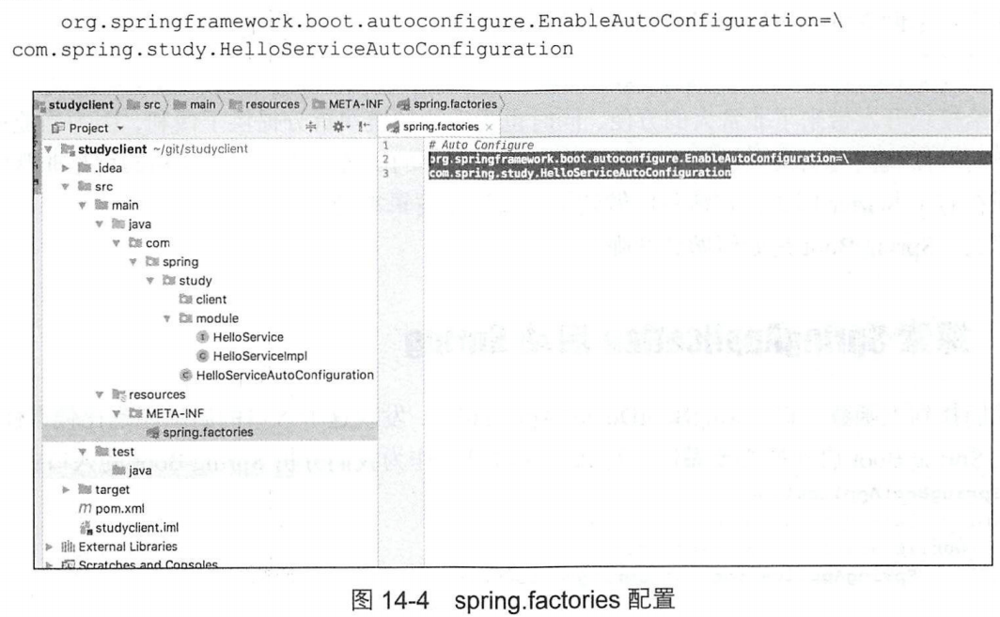
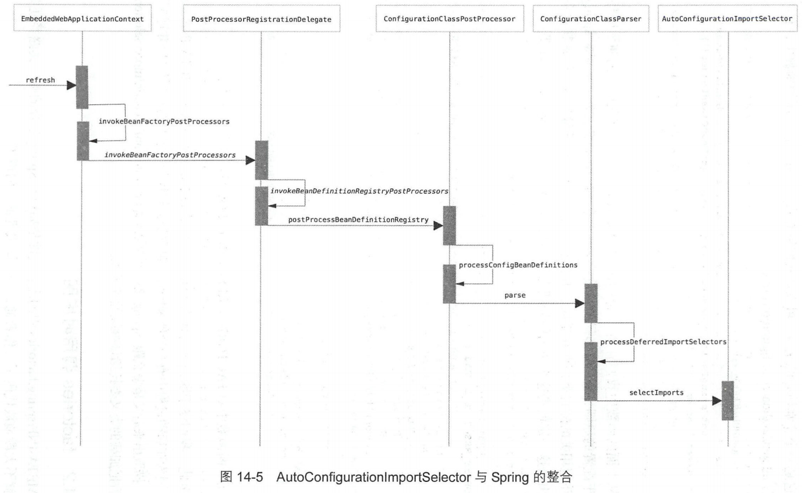
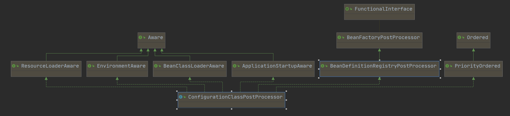

# 第10章 Spring事务

​		Spring声明式事务让我们从复杂的事务处理中得到解脱，使我们再也不需要去处理获得连接、关闭连接、事务提交和回滚等操作，再也不需要在与事务相关的方法中处理大量的try ...catch...finally代码。Spring 中事务的使用虽然已经相对简单得多，但是，还是有很多的使用及配置规则，有兴趣的读者可以自己查阅相关资料进行深入研究，这里只列举出最常用的使用方法。
同样，我们还是以最简单的示例来进行直观地介绍。

## 10.1 JDBC方式下的事务使用示例

1．创建数据表结构

```sql
CREATE TABLE 'user' (
'id' int (11)NOT NULL auto_increment,' name' varchar (255)default NULL,
'age' int (l1)default NULL,
'sex' varchar (255) default NULL,PRIMARYKEY( 'id' )
)ENGINE=InnoDB DEFAULT CHARSET=utf8;
```

2．创建对应数据表的PO

```java
public class User {
private int id;
private String name;private int age;
private String sex;
//省略set/get方法
}

```


3．创建表与实体间的映射


```java
public class UserRowMapper implements RowMapper {
@override
public Object mapRow (ResultSet set, int index) throws SQLException {
User person = new User(set.getInt ("id"), set.getString ( "name"), set
.getInt ( "age" ), set.getstring ( "sex" ) );
return person;
}

```

4．创建数据操作接口

```java
@Transactional (propagation=Propagation.REQUIRED)
public interface UserService {
public void save (User user) throws Exception;
}


```

5．创建数据操作接口实现类

```java
public class UserServiceImpl implements UserService {
    private JdbcTemplate jdbcTemplate;
    //设置数据源
    public void setDataSource(DataSource dataSource){
    this.jdbcTemplate = new JdbcTemplate(dataSource);
    public void save(User user) throws Exception{
    jdbcTemplate.update("insert into user(name ,age ,sex) values ( ?,?,?)",
        new Object[]{
            user.getName(), 
            user.getAge(),
            user.getSex()
        }, 
        new int[]{
            java.sql.Types.VARCHAR,
            java.sql.Types.INTEGER,
            java.sql.Types.VARCHAR
        });
    //事务测试，加上这句代码则数据不会保存到数据库中
    throw new RuntimeException("aa");
}
```

6．创建Spring配置文件

```xml
<!--开启事务-->
<tx:annotation-driven transaction-manager="transactionManager" />
<bean id="transactionManager" class="org.Springframework.jdbc.datasource.DataSourceTransactionManager">
    <property name="dataSource" ref="dataSource"/>
</bean>
<!--配置数据源-->
<bean id="dataSource" class="org.apache.commons.dbcp.BasicDataSource" destroy-method="close">
	<property name="driverClassName" value="com.mysgl.jdbc.Driver"/>
    ...
</bean>
```

7．测试

```java
public static void main (String[] args) throws Exception {
    ApplicationContext act = new ClassPathXmlApplicationContext ( "bean.xml");
        UserService userService = (UserService)act.getBean("userService")
        User user = new User();
        user.setName("张三ccc");
        user.setAge (20);
        user.setsex ("男");
        //保存一条记录
        userService.save (user);
    }
}
```


# 第14章 SpringBoot体系原理

​		Spring Boot是由Pivotal团队提供的全新框架，其设计目的是用来简化新Spring应用的初始搭建以及开发过程。该框架使用了特定的方式来进行配置，从而使开发人员不再需要定义样板化的配置。通过这种方式，Spring Boot 将致力于在蓬勃发展的快速应用开发领域(RapidApplication Development)成为领导者。
Spring Boot特点如下:

- 创建独立的 Spring应用程序;
- 嵌入的Tomcat，无须部署WAR文件;简化 Maven配置;
- 自动配置Spring;
- 提供生产就绪型功能，如指标、健康检查和外部配置;绝对没有代码生成，以及对XML没有配置要求。

​		当然，这样的介绍似乎太过于官方化，好像并没有帮助我们理解Spring Boot到底做了什么，我们不妨通过一个小例子来快速了解 Spring Boot。
首先我们搭建一个maven工程，pom如下:


```xml
<?xml version="1.0" encoding="UTF-8"?>
<project xmlns="http://maven.apache.org/POM/4.0.0"
		xmins :xsi="http://www.w3.org/2001/XMLSchema-instance"
		xsi:schemaLocation="http://maven.apache.org/POM/4.0.0 http://maven.apache.org/xsd/maven-4.0.0.xsd">
    <parent>
        <groupId>org.springframework.boot</groupId>
	    <artifactId>spring-boot-starter-parent</artifactId>
        <version>2.0.1.RELEASE</version>
        <relativePath/>
    </parent>
    <modelversion>4.0.0</modelversion>
    <groupId>com. springstudy</groupId>
    <artifactId>study-web</artifactId>
    <version>1.0-SNAPSHOT</version>
    <dependencies>
        <dependency>
            <groupId>org.springframework.boot</groupId>
            <artifactId>spring-boot-starter-web</artifactId>
    	</dependency>
    </dependencies>
    <build>
        <plugins>
            <plugin>
                <groupId>org.springframework.boot</groupId>
                <artifactId>spring-boot-maven-plugin</artifactId>
            </plugin>
        </plugins>
    </build>
</project>
```

​		然后我们建立一个controller类:

```java
package com.springstudy.controller;
import com. spring.study.module.HelloService;
import org.springframework.beans.factory.annotation.Autowired;import org.springframework.web.bind.annotation.RequestMapping;import org.springframework.web.bind.annotation.RestController;
@RestController
public class TestController {
    @RequestMapping("/")
    string home(){
        return "helloworld";
    }
}
```

​		最后我们再加入启动整个项目的main函数:

```java
package com.springstudy;
import org.springframework.boot.SpringApplication;
import org.springframework.boot.autoconfigure.SpringBootApplication;
@SpringBootApplication
public class SpringBootDemo1Application {
    public static void main (string[]args) {
        SpringApplication.run(SpringBootDemolApplication.class, args);
    }
}
```

​		以上就是我们要准备的示例的所有内容，最后我们尝试启动main函数并在浏览器中输入localhost :8080，发现浏览器显示如图14-1所示的界面。


​		这一切都似乎完全超乎了我们的预料,按照之前的经验,如果要构建这样一套MVC体系,似乎是非常麻烦的，至少要引入一大堆的pom依赖，同时，最为神奇的是整个过程中我们似乎根本没有启动过Tomcat，但是当我们运行函数的时候Tomcat居然自动起来了，而且还能通过浏览器访问，这一切都是怎么回事呢?这里留下悬念，我们稍后探索。
​		当然，如果你认为Spring Boot仅仅是封装了Tomcat那就大错特错了，一个流行的框架一定是一个理念的创新，它绝对不是一个简简单单的封装就能搞的定的。
​		在我们正式进入Spring Boot的原理探索之前，首先我们还是尝试去下载及安装其源码。

## 14.1 Spring Boot源码安装

​		同样，Spring Boot通过Github维护，我们打开Github 官网，输入 spring-boot, 安装步骤同spring，不再详细介绍。

## 14.2 第一个 Starter

​		在我看来，Spring Boot之所以流行，是因为spring starter模式的提出。spring starter的出现，可以让模块开发更加独立化，相互间依赖更加松散以及可以更加方便地集成。从前言中介绍的例子来看，正是由于在pom文件中引入了下述代码:
```xml
<dependency>
    <groupId>org.springframework.boot</groupId>
    <artifactId>spring-boot-starter-web</artifactId>
</dependency>
```

​		这就让Spring自动化地帮我们做了非常多的事情，当然现阶段我们去分析 spring-boot-starter-web 的实现原理似乎跨越还有些大，我们可以从一个更为简单的例子来看。
​		同样，为了不跟之前的 Web 工程混淆，我们另建一个maven工程，pom如下:

```xml
<?xml version="1.0" encoding="UTF-8"?>
<project xmlns="http://maven.apache.org /POM / 4.0.0"
        xmlns:xsi="http://www.w3.org/2001/XMLSchema-instance"
        xsi:schemaLocation="http://maven.apache.org/POM/4.0.0 http://maven.apache.org/xsd/maven-4.0.0.xsd">
    <modelversion>4.0.0</modelVersion>
    <groupId>com.springstudy</groupId>
    <artifactId>study-client-starter</artifactId>
    <version>1.0-SNAPSHOT</version>
    <dependencies>
        <dependency>
            <groupId>org.springframework.boot</groupId>
            <artifactId>spring-boot-autoconfigure</artifactId>
        </dependency>
    </dependencies>
    <dependencyManagement>
        <dependencies>
            <dependency>
                <!-- Import dependency management from Spring Boot -->
                <groupId>org.springframework.boot</groupid>
                <artifactId>spring-boot-dependencies</artifactId>
                <version>2.0.1.RELEASE</version>
                <type>pom</type>
                <scope>import</scope>
            </dependency>
        </dependencies>
    </dependencyManagement>
</project>
```

​		然后我们定义一个接口，可以认为它是当前独立业务开发模块对外暴露的可以直接调用的接口，如下:

```java
package com.spring.study.module;
public interface Helloservice{
	public string sayHello();
}
```

​		我们对这个接口做一个简单的实现，返回hello字符串:package com.spring.study.module;
```java
import org.springframework.stereotype.component;
@Component
public class HelloServiceImpl implements HelloService {
    public string sayHello(){
    	return "hello!!";
    }
}
```

​		以上实现为了尽量屏蔽Spring Boot 基础理论以外的东西，把演示设计得尽量简单，如果是真实的业务，这个接口以及接口实现可能会非常复杂，甚至还会间接依赖于非常多的其他的bean。它基本上就是一个独立的业务模块，当然这个模块并不是自己部署，而是运行在依赖它的主函数中。如果我们开发到这种程度，想要主函数感知的话也不是不可以，但是至少要让主工程知道当前业务的 bean路径并加入 scan列表中，否则在Spring启动的过程中没有办法把client中所有的bean载入 Spring容器，逻辑也就没法生效了，但是，随着业务的增长，模块也会越来越多、越来越分散，大量的配置在主函数中维护，这会造成主函数非常臃肿及冲突严重，而且根据职责划分原则，以上的例子中主模块只关心自己是否使用外部依赖的模块以及对应的接口就好了,再去让主模块感知对应的路径等细节信息显然是不合适的。于是乎,在Spring Boot出来之前我们会尝试把Scan等配置项写人XML里面，然后让主函数直接引用配置项，这样，主函数知道的事情就进一步减少了，但是还有没有更好的解决方式呢,或者，还有没有更好的办法能让主函数做更少的事情呢?Spring Boot做到了这一点,继续追加代码,添加自动配置项:

```java
package com.spring.study;
import org.springframework.context.annotation.ComponentScan;
import org.springframework.context.annotation.Configuration;
@Configuration
@Componentscan({"com.spring.study.module"})
public class HelloserviceAutoConfiguration{
    
}
```

​		我们发现，在 HelloServiceAutoConfiguration类中并没有逻辑实现，它存在的目的仅仅是通过注解进行配置的声明，我们可以在ComponentScan中加人这个模块的容器扫描路径。
​		当然，如果仅仅是到此，Starter还是没有开发完成，还需要最后一步，那就是户明这个配置文件的路径，在Spring 的跟路径下建立. META-INF/spring.factories文件，并声明配置项路径:



​		到此，一个标准的Starter就开发完成了，它有什么用或者说它怎么使用呢?我们来看一下它的使用方式。
修改前言中的Web工程,加入依赖:

```xml
<dependency>
	<groupId>com.springstudy</ groupId>
	<artifactId>study-client-starter</artifactId>
	<version>1.0-SNAPSHOT</version>
</dependency>
```

​		同时，更改Controller逻辑，将模块的逻辑引入，如下所示:

```java
package com.springstudy.controller;
import com.spring.study.module.Helloservice;
import org.springframework.beans.factory.annotation.Autowired;
import org.springframework.web.bind.annotation.RequestMapping;
import org.springframework.web.bind.annotation.RestController;
@RestController
public class TestController{
    @Autowired
    private He11oservice helloservice;
    @RequestMapping("/")string home(){
        return helloservice.sayHello();
    }
}
```

​			读者会发现，我们刚才开发的Starter对于使用者来说非常的方便，除了在pom 中引入依赖,什么都不做就可以直接使用模块内部的接口注入:
```java
@Autowired
private Helloservice helloService;
```

​		这给模块开发带来了非常大的方便，同时也为后续的模块拆分提供了便利，因为当业务逐渐复杂的时候我们会引入大量的中间件，而这些中间件的配置、依赖、以及初始化是非常麻烦的,现在有了Starter模式，它帮我们做到了只关注于逻辑本身。
​		那么，Spring Boot是如何做到的呢?


## 14.3 探索SpringApplication启动Spring

​		我们找到主函数入口SpringBootDemolApplication，发现这个人口的启动还是比较奇怪的,这也是Spring Boot启动的必要做法，那么，这也可以作为我们分析Spring Boot的入口:

```java
@SpringBootApplication
public class SpringBootDemo1Application {
	public static void main (string[] args){
		SpringApplication.run(SpringBootDemolApplication.class,args);
    }
}
```

​		当顺着SpringApplication.run方法进人的时候我们找到了SpringApplication的一个看似核心逻辑的方法:

```java
public ConfigurableApplicationContext run(String... args) {
    StopWatch stopWatch = new StopWatch();
    stopWatch.start();
    DefaultBootstrapContext bootstrapContext = createBootstrapContext();
    ConfigurableApplicationContext context = null;
    configureHeadlessProperty();
    SpringApplicationRunListeners listeners = getRunListeners(args);
    listeners.starting(bootstrapContext, this.mainApplicationClass);
    try {
        ApplicationArguments applicationArguments = new DefaultApplicationArguments(args);
        ConfigurableEnvironment environment = prepareEnvironment(listeners, bootstrapContext, applicationArguments);
        configureIgnoreBeanInfo(environment);
        Banner printedBanner = printBanner(environment);
        context = createApplicationContext();//重点
        context.setApplicationStartup(this.applicationStartup);
        prepareContext(bootstrapContext, context, environment, listeners, applicationArguments, printedBanner);
        refreshContext(context);//重点:refresh 扩展属性的加载
        afterRefresh(context, applicationArguments);
        stopWatch.stop();
        if (this.logStartupInfo) {
            new StartupInfoLogger(this.mainApplicationClass).logStarted(getApplicationLog(), stopWatch);
        }
        listeners.started(context);
        callRunners(context, applicationArguments);
    }...
    return context;
}
```

​		如果读者看过之前的内容,就会知道,我们曾经在第5章介绍过Spring完整的初始化方案，其中就最为核心的就是 SpringContext 的创建、初始化、刷新等。那么我们可以直接进入查看其中的逻辑，同时，Spring作为一个全球都在使用的框架，会有非常多的需要考虑的问题，我们在阅读源码的过程中只需要关系核心的主流程，了解其工作原理，并在阅读的过程中感受它的代码风格以及设计理念就好了，如果真的追求理解每一行代码真的是非常耗时的一件事情，毕竟我们阅读源码的目的大多数是成长而不是真的要去维护Spring。

### 14.3.1 SpringContext创建

SpringApplication.java

```java
protected ConfigurableApplicationContext createApplicationContext () {
    Class<?> contextclass = this.applicationContextClass;
    if (contextclass ==null) {
        try {
        contextClass = Class.forName(this.webEnvironment?DEFAULT_WEB_CONTEXT_CLAsS : DEFAULT_CONTExT_CLASS);
        catch (ClassNotFoundException ex){
	        throw new IllegalstateException(ex) ;
    }
}
return (ConfigurableApplicationContext) BeanUtils.instantiate (contextClass)
```

​		这个函数似乎没有什么特别之处，无非就是实例化一个 ApplicationContext，因为ApplicationContext是Spring存在的基础。而对应的SpringContext候选类如下:

- public static final string DEFAULT_wEB_CONTEXT_CLASS 

= "org.springframework." + "boot.context.embedded.AnnotationConfigEmbeddedwebApplicationContext" ;

- private static final String[] WEB_BNVIRONMENT_CLASSES 

= ( "javax.servlet.Servlet",+ "org.springframework.web.context.ConfigurablewebApplicationContext"};

​		这里有个关键的判断，this.webEnvironment，如果读者没有看过代码很容易会忽略，但是这里将成为在前言中提到的Spring 如何自动化启动Tomcat 的关键,我们将会在后续章节详细介绍。


### 14.3.2 Bean的加载

SpringApplication.java

```java
private void prepareContext(DefaultBootstrapContext bootstrapContext, ConfigurableApplicationContext context,
			ConfigurableEnvironment environment, SpringApplicationRunListeners listeners,
			ApplicationArguments applicationArguments, Banner printedBanner) {
    context.setEnvironment(environment);
    postProcessApplicationContext(context);
    applyInitializers(context);
    listeners.contextPrepared(context);
    bootstrapContext.close(context);
    if (this.logStartupInfo) {
        logStartupInfo(context.getParent() == null);
        logStartupProfileInfo(context);
    }
    // Add boot specific singleton beans
    ConfigurableListableBeanFactory beanFactory = context.getBeanFactory();
    beanFactory.registerSingleton("springApplicationArguments", applicationArguments);
    if (printedBanner != null) {
        beanFactory.registerSingleton("springBootBanner", printedBanner);
    }
    if (beanFactory instanceof DefaultListableBeanFactory) {
        ((DefaultListableBeanFactory) beanFactory).setAllowBeanDefinitionOverriding(this.allowBeanDefinitionOverriding);
    }
    if (this.lazyInitialization) {
        context.addBeanFactoryPostProcessor(new LazyInitializationBeanFactoryPostProcessor());
    }
    context.addBeanFactoryPostProcessor(new PropertySourceOrderingBeanFactoryPostProcessor(context));
    // Load the sources
    Set<Object> sources = getAllSources();
    Assert.notEmpty(sources, "Sources must not be empty");
    load(context, sources.toArray(new Object[0]));//关键
    listeners.contextLoaded(context);
}
```

​		这里面的 load 函数是我们比较感兴趣的,代码如下:

SpringApplication.java

```java
protected void load(ApplicationContext context, Object[] sources) {
    if (logger.isDebugEnabled()) {
        logger.debug("Loading source " + StringUtils.arrayToCommaDelimitedString(sources));
    }
    BeanDefinitionLoader loader = createBeanDefinitionLoader(getBeanDefinitionRegistry(context), sources);
    if (this.beanNameGenerator != null) {
        loader.setBeanNameGenerator(this.beanNameGenerator);
    }
    if (this.resourceLoader != null) {
        loader.setResourceLoader(this.resourceLoader);
    }
    if (this.environment != null) {
        loader.setEnvironment(this.environment);
    }
    loader.load();//BeanDefinitionLoader
}
```

​		相信当读者看到 BeanDefinitionLoader这个类的时候基本上就已经知道后续的逻辑了,bean的加载作为本书中最核心的部分早在第1章就已经开始分析了。

### 14.3.3 Spring扩展属性的加载

```java
protected void refresh(ApplicationContext applicationContext){
	Assert.isInstanceOf(AbstractapplicationContext.class,applicationContext);
    ((AbstractApplicationContext) applicationContext).refresh();
}
```

​		对于Spring 的扩展属性加载则更为简单，因为这些都是Spring本身原有的东西Spring Boot, 仅仅是使用refresh激活下而已，如果读者想回顾refresh的详细逻辑,可以回到第5章进一步查看。

### 14.3.4 总结

​		分析下来，Spring Boot的启动并不是我们想象的那么神秘，按照约定大于配置的原则，内置了Spring原有的启动类，并在启动的时候启动及刷新，仅此而已。
org.springframework.context.annotation.AnnotationConfigApplicationContext


## 14.4 Starter自动化配置原理

​		我们已经知道了Spring Boot如何启动Spring，但是目前为止我们并没有揭开Spring Boot的面纱,究竟Starter 是如何生效的呢?这些逻辑现在看来只能体现在注解SpringBootApplication本身了。
​		继续追查代码，看一看SpringBootApplication注解内容:

```java
@Target(ElementType.TYPE)
@Retention(RetentionPolicy.RUNTIME)
@Documented
@Inherited
@SpringBootConfiguration
@EnableAutoConfiguration//重点
@ComponentScan(excludeFilters = { @Filter(type = FilterType.CUSTOM, classes = TypeExcludeFilter.class),
		@Filter(type = FilterType.CUSTOM, classes = AutoConfigurationExcludeFilter.class) })
public @interface SpringBootApplication {
	...
}
```

​		这其中我们更关注SpringBootApplication 上的注解内容，因为注解具有传递性，EnableAutoConfiguration是个非常特别的注解，它是Spring Boot 的全局开关，如果把这个注解去掉，则一切Starter都会失效，这就是约定大于配置的潜规则，那么，Spring Boot的核心很可能就藏在这个注解里面:

```java
@Target(ElementType.TYPE)
@Retention(RetentionPolicy.RUNTIME)
@Documented
@Inherited
@AutoConfigurationPackage
@Import(AutoConfigurationImportSelector.class)
public @interface EnableAutoConfiguration {
    ...
}
```

​		EnableAutoConfigurationImportSelector作为Starter自动化导入的关键选项终于浮现出来，那么Spring是怎么识别并让这个注解起作用的呢?我们看到这个类中只有一个方法,那么只要看一看到底是哪个方法调用了它，就可以顺藤摸瓜找到最终的调用点。EnableAutoConfigurationImportSelector作为Starter自动化导入的关键选项终于浮现出来，那么Spring是怎么识别并让这个注解起作用的呢?我们看到这个类中只有一个方法,那么只要看一看到底是哪个方法调用了它，就可以顺藤摸瓜找到最终的调用点。

```java
public class EnableAutoConfigurationImportSelector extends AutoConfigurationImportSelector (
    @override
    protected boolean isEnabled (AnnotationMetadata metadata){
        if (getClass().equals(EnableAutoConfigurationImportSelector.class)){
            return getEnvironment().getProperty(EnableAutoConfiguration.ENABLED_OVERRIDE_PROPERTY，Boolean.class, true);
        }
        return true;
    }
}
```

### 14.4.1 spring.factories的加载

​		顺着思路反向查找，看一看究竟是谁在哪里调用了isEnabled函数，强大的编译器很容器帮我们定位到了AutoConfigurationImportSelector类的方法:

AutoConfigurationImportSelector.java

```java
@Override
public String[] selectImports(AnnotationMetadata annotationMetadata) {
    if (!isEnabled(annotationMetadata)) {
        return NO_IMPORTS;
    }
    AutoConfigurationEntry autoConfigurationEntry = getAutoConfigurationEntry(annotationMetadata);
    return StringUtils.toStringArray(autoConfigurationEntry.getConfigurations());
}
protected AutoConfigurationEntry getAutoConfigurationEntry(AnnotationMetadata annotationMetadata) {
    if (!isEnabled(annotationMetadata)) {
        return EMPTY_ENTRY;
    }
    AnnotationAttributes attributes = getAttributes(annotationMetadata);
    List<String> configurations = getCandidateConfigurations(annotationMetadata, attributes);
    configurations = removeDuplicates(configurations);
    Set	<String> exclusions = getExclusions(annotationMetadata, attributes);
    checkExcludedClasses(configurations, exclusions);
    configurations.removeAll(exclusions);
    configurations = getConfigurationClassFilter().filter(configurations);
    fireAutoConfigurationImportEvents(configurations, exclusions);
    return new AutoConfigurationEntry(configurations, exclusions);
}
```

​		它是一个非常核心的函数，可以帮我们解释很多问题。在上面的函数中，有一个是我们比较关注的getCandidateConfigurations函数:

```java
protected List<String> getCandidateConfigurations(AnnotationMetadata metadata, AnnotationAttributes attributes) {
    List<String> configurations = SpringFactoriesLoader.loadFactoryNames(getSpringFactoriesLoaderFactoryClass(),
                                                                         getBeanClassLoader());
    Assert.notEmpty(configurations, "No auto configuration classes found in META-INF/spring.factories. If you "
                    + "are using a custom packaging, make sure that file is correct.");
    return configurations;
}
```

​		从上面的函数中我们看到了META-INF/spring.factories，在我们之前演示的环节，按照约定大于配置的原则，Starter 如果要生效则必须要在META-INF 文件下下建立spring.factories文件，并把相关的配置类声明在里面，虽然这仅仅是一个报错异常提示，但是其实我们已经可以推断出来这一定就是这个逻辑的处理之处，继续进入SpringFactoriesLoader类:

```java
public static List<String> loadFactoryNames(Class<?> factoryType, @Nullable ClassLoader classLoader) {
    ClassLoader classLoaderToUse = classLoader;
    if (classLoaderToUse == null) {
        classLoaderToUse = SpringFactoriesLoader.class.getClassLoader();
    }
    String factoryTypeName = factoryType.getName();
    return loadSpringFactories(classLoaderToUse).getOrDefault(factoryTypeName, Collections.emptyList());
}

private static Map<String, List<String>> loadSpringFactories(ClassLoader classLoader) {
    Map<String, List<String>> result = cache.get(classLoader);
    if (result != null) {
        return result;
    }
    result = new HashMap<>();
    try {
        Enumeration<URL> urls = classLoader.getResources(FACTORIES_RESOURCE_LOCATION);
        while (urls.hasMoreElements()) {
            URL url = urls.nextElement();
            UrlResource resource = new UrlResource(url);
            Properties properties = PropertiesLoaderUtils.loadProperties(resource);
            for (Map.Entry<?, ?> entry : properties.entrySet()) {
                String factoryTypeName = ((String) entry.getKey()).trim();
                String[] factoryImplementationNames =
                    StringUtils.commaDelimitedListToStringArray((String) entry.getValue());
                for (String factoryImplementationName : factoryImplementationNames) {
                    result.computeIfAbsent(factoryTypeName, key -> new ArrayList<>())
                        .add(factoryImplementationName.trim());
                }
            }
        }
        // Replace all lists with unmodifiable lists containing unique elements
        result.replaceAll((factoryType, implementations) -> implementations.stream().distinct()
                          .collect(Collectors.collectingAndThen(Collectors.toList(), Collections::unmodifiableList)));
        cache.put(classLoader, result);
    }
    catch (IOException ex) {
        throw new IllegalArgumentException("Unable to load factories from location [" +
                                           FACTORIES_RESOURCE_LOCATION + "]", ex);
    }
    return result;
}
```

​		而上面函数中对FACTORIES_RESOURCE_LOCATION的定义为:
​		public static final String FACTORIES_RESOURCE_LOCATION = "META-INF/spring.factories";
​		至此，我们终于明白了为什么Starter的生效必须要依赖于配置 `META-INF/spring.factories`文件,因为在启动过程中有一个硬编码的逻辑就是会扫描各个包中的对应文件,并把配置捞取出来,但是，捞取出来后又是怎么跟Spring 整合的呢?或者说AutoConfigurationImportSelector.selectImports方法后把加载的类又委托给谁继续处理了呢?

### 14.4.2 factories调用时序图

​		META-INF/spring.factories中的配置文件是如何与Spring整合的呢?其路径还是比较深的,这里就不大段地放代码了，作者通过一个图去理清它的逻辑。




​		图14-5中梳理了从EmbeddedWebApplicationContext到AutoConfigurationImportSelector的调用链路，当然这个链路还有非常多的额外分支被忽略。不过至少从上图中我们可以很清晰地看到AutoConfigurationImportSelector与Spring的整合过程，在这个调用链中最核心的就是Spring Boot使用了Spring 提供的BeanDefinitionRegistryPostProcessor扩展点并实现了ConfigurationClassPostProcessor类，从而实现了spring 之上的一系列逻辑扩展，让我们看一下ConfigurationClassPostProcessor的继承关系，如图14-6所示:



​		当然Spring还提供了非常多不同阶段的扩展点,读者可以通过前几章的内容获取详细的扩展点以及实现原理。

### 14.4.3配置类的解析

​		截止到目前我们知道了Starter为什么要求默认将自身入口配置写在 META-INF 文件下的spring.factories文件中，以及 AutoConfigurationImportSelector的上下文调用链路，但是通过AutoConfigurationImportSelector.selectImports方法返回后的配置类又是如何进一步处理的呢?对照图14-5我们抽出 ConfigurationClassParser的processDeferredImportSelectors方法代码查看:


