# 抄书规范

<font color="red">字体3px大小(不设置)，默认无颜色，重点内容红色，不加粗</font>

<font color=""></font>


<center><font color="red" size="8px">Spring源码深度解析</font></center>

# 第1章 Spring整体架构和环境搭

​		Spring是于2003年兴起的一个轻量级的Java开源框架由Rod Johnson在其著作《Expert One-On-One J2EE Development and Design》中阐述的部分理念和原型衍生而米。Spring 是为解决企业应用开发的复杂性而创建的，它使用基本的JavaBean来完成以前只可能由EJB完成的事情。然而，Spring 的用途不仅限于服务器端的开发。从简单性、可测试性和松耦合的角度而言，任何Java应用都可以从 Spring中受益。

## 1.1 Spring的整体架构

​		Spring框架是一个分层架构,它包含一系列的功能要素，并被分为大约20个模块，如图1-1所示。


​		这些模块被总结为以下几部分。

(1) Core Container.

​		Core Container(核心容器）包含有Core、Beans、Context 和 Expression Language模块。

​		Core和Beans模块是框架的基础部分，提供 IoC(反转控制）和依赖注入特性。这里的基础概念是BeanFactory.,它提供对Factory模式的经典实现来消除对程序性单例模式的需要，并真正地允许你从程序逻辑中分离出依赖关系和配置。

- Core模块主要包含Spring框架基本的核心工具类，Spring 的其他组件要都要使用到这个包里的类，Core模块是其他组件的基本核心。当然你也可以在自己的应用系统中使用这些工具类。
- Beans模块是所有应用都要用到的，它包含访问配置文件、创建和管理bean以及进行Inversion of Control/ Dependency Injection ( loC/DI)操作相关的所有类。
- Context模块构建于Core和Beans模块基础之上,提供了一种类似于JNDI注册器的框架式的对象访问方法。Context模块继承了Beans的特性，为Spring核心提供了大量扩展，添加了对国际化(例如资源绑定)、事件传播资源加载和对Context 的透明创建的支持。Context模块同时也支持J2EE的一些特性，例如EJB、JMX和基础的远程处理。ApplicationContext接口是 Context模块的关键。
- Expression Language模块提供了一个强大的表达式语言用于在运行时查询和操纵对象。它是JSP 2.1规范中定义的unifed expression language的一个扩展。该语言支持设置/获取属性的值，属性的分配，方法的调用，访问数组上下文( accessiong the contextof arrays)、容器和索引器、逻辑和算术运算符、命名变量以及从.Spring 的 loC容器中根据名称检索对象。它也支持list投影、选择和一般的list 聚合。

( 2 ) Data Access/Integration。
		Data Access/Integration层包含有JDBC、ORM、OXM、JMS 和 Transaction模块，其中:

- JDBC模块提供了一个JDBC抽象层，它可以消除冗长的JDBC编码和解析数据库厂商特有的错误代码。这个模块包含了Spring对JDBC 数据访问进行封装的所有类。
- ORM模块为流行的对象-关系映射API，如JPA、JDO、Hibernate、iBatis等，提供了一个交互层。利用ORM封装包，可以混合使用所有Spring 提供的特性进行O/R映射。如前边提到的简单声明事务管理。

​		Spring框架插入了若干个ORM框架，从而提供了ORM的对象关系工具，其中包括JDO、Hibernate和 iBatisSQL Map。所有这些都遵从Spring的通用事务和DAO异常层次结构

- OXM模块提供了一个对Object/XML映射实现的抽象层Object/XML映射实现包括JAXB、Castor、XMLBeans、JiBX和XStream。
- JMS (Java Messaging Service)模块主要包含了一些制造和消费消息的特性。
- Transaction模块支持编程和声明性的事务管理，这些事务类必须实现特定的接口，并且对所有的POJO都适用。

( 3 ） Web。
		Web上下文模块建立在应用程序上下文模块之上,为基于Web的应用程序提供了上下文。所以，Spring框架支持与Jakarta Struts的集成。Web模块还简化了处理多部分请求以及将请求参数绑定到域对象的工作。Web层包含了Web、Web-Servlet、Web-Struts和 Web-Porlet模块，具体说明如下。

- Web模块:提供了基础的面向Web的集成特性。例如,多文件上传、使用servlet listeners初始化 IoC容器以及一个面向Web的应用上下文。它还包含Spring 远程支持中 Web的相关部分。
- Web-Servlet模块web.servlet.jar:该模块包含Spring 的model-view-controlle( MVC)实现。Spring 的MVC框架使得模型范围内的代码和web forms之间能够清楚地分离开来，并与Spring框架的其他特性集成在一起。
- Web-Struts模块:该模块提供了对Struts的支持，使得类在Spring应用中能够与一个典型的Struts Web 层集成在一起。注意，该支持在Spring 3.0中是deprecated的。
- Web-Porlet模块:提供了用于Portlet环境和 Web-Servlet模块的MVC 的实现。

(4) AOP。
		AOP模块提供了一个符合AOP联盟标准的面向切面编程的实现，它让你可以定义例如方法拦截器和切点，从而将逻辑代码分开，降低它们之间的耦合性。利用 source-level 的元数据功能，还可以将各种行为信息合并到你的代码中，这有点像.Net技术中的 attribute概念。
通过配置管理特性，Spring AOP模块直接将面向切面的编程功能集成到了Spring框架中,所以可以很容易地使Spring框架管理的任何对象支持AOP。Spring AOP模块为基于Spring 的应用程序中的对象提供了事务管理服务。通过使用Spring AOP，不用依赖EJB组件就可以将声明性事务管理集成到应用程序中。

- Aspects模块提供了对AspectJ的集成支持。

​		Instrumentation模块提供了class instrumentation支持和classloader实现,使得可以在特定的应用服务器上使用。
(5)Test
Test模块支持使用JUnit'和 TestNG对Spring 组件进行测试。

## 1.2 环境搭建

​		要构建Spring源码环境首先要安装GitHub以及Gradle。

### 1.2.1 安装GitHub

​		首先读者需要到GitHub官网去下载安装包。

### 1.2.2 安装 Gradle

​		Gradle是一个基于Groovy的构建工具，它使用Groovy来编写构建脚本，支持依赖管理和多项目创建，类似 Maven，但比其更加简单轻便。Gradle为 Ivy 提供了一个 layer，提供了build-by-convention 集成，而且它还让你获得许多类似 Maven的功能。你可以从<a> http:/www.gradle.org/downloads</a>页面下载 Gradle，下载后将文件解压放到指定目录中（笔者放在了C:\Program Files目录下)，然后开始进行环境变量的配置。
(1根据对应目录创建GRADLE_HOME系统变量。

(2)将系统变量加人到path中。

(3)测试

```cmd
gradle -version //安装成功
```

### 1.2.3 下载源码

```sh
git clone git://github.com/SpringSource/Spring-framework.git
```


# 第2章 容器的基本实现

## 2.1 容器基本用法

​		bean是Spring 中最核心的东西，spring就像个大水桶，bean是里面的水，水桶脱离了水便也没什么用处了，那么我们先看看bean 的定义。

```java
public class MyTestBean {
    private string teststr = "teststr";
    public string getTeststr() {
        return testStr;
        public void setTeststr(String teststr){
            this.testStr = teststr;
        }
    }
}
```

​		很普通，bean没有任何特别之处，的确，Spring 的目的就是让我们的bean能成粹的POJO，这也是Spring所追求的。接下来看看配置文件:
```xml
<?xml version=" 1.0" encoding="UTF-8"?>
<beans xmlns="http://www.Springframework.org/schema/beans"
xmlns:xsi="http://www.w3.org/2001/xMLSchema-instance"
xsi:schemaLocation="http://ww.Springframework.org/schema/beans/http://www.Springframework.org/schema/beans/Spring-beans.xsd">
	<bean id="myTestBean" class="bean.MyTestBean"/ >
</beans>
```

​		在上面的配置中我们看到了bean的声明方式,尽管Spring 中 bean的元素定义着N种属性来支撑我们业务的各种应用，但是我们只要声明成这样，基本上就已经可以满足我们的大多数应用了。好了，你可能觉得还有什么，但是，真没了，Spring的入门示例到这里已经结束，我们可以写测试代码测试了。

```java
@suppresswarnings("deprecation")
public class BeanFactoryTest {
    @Test
    public void testsimpleLoad() {
        BeanFactory bf = new XmlBeanFactory(new ClassPathResource("beanFactoryTest.xml");
        MyTestBean bean = (MyTestBean) bf.getBean("myTestBean");
        assertEquals("testStr", bean.getTeststr());
    }
}
```

​		相信聪明的读者会很快看到我们期望的结果:在 Eclipse中显示了 Green Baro直接使用BeanFactory作为容器对于Spring的使用来说并不多见,甚至是甚少使用,因为在企业级的应用中大多数都会使用的是ApplicationContext，后续章节我们会介绍它们之间的区别，这里只是用于测试，让读者更快更好地分析Spring 的内部原理。

## 2.2 功能分析

​		现在我们可以来好好分析一下上面测试代码的功能,来探索上面的测试代码中Spring究竟帮助我们完成了什么工作?不管之前你是否使用过Spring,当然，你应该使用过的，毕竟本书面用的是对Spring有一定使用经验的读者，你都应该能猜出来，这段测试代码完成的功能无非就是以下几点

(1）读取配置文件beanFactoryTest.xml。
(2）根据beanFactoryTest.xml中的配置找到对应的类的配置,并实例化。
(3）调用实例化后的实例。
为了更清楚地描述,笔者临时画了设计类图，如图2-1所示,如果想完成我们预想的功能,至少需要3个类。

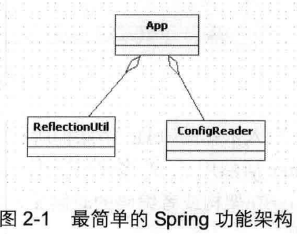

- ConfigReader: 用于读取及验证配置文件。我们要用配置文件里面的东西，当然首先要做的就是读取，然后放置在内存中。
- ReflectionUtil:用于根据配置文件中的配置进行反射实例化。比如在上例中beanFactoryTest.xml出现的<bean id="myTestBean" class="bean.MyTestBean">，我们就可以根据bean.MyTestBean进行实例化。
- App:用于完成整个逻辑的串联。
  按照最原始的思维方式，整个过程无非如此，但是作为一个风靡世界的优秀源码真的就这么简单吗?


## 2.3 工程搭建

​		不如我们首先大致看看Spring 的源码。在 Spring源码中，用于实现上面功能的是org.Springframework.beans.jar，我们看源码的时候要打开这个
能，那就没有必要引入Spring 的其他更多的包，当然Core 是必须的，还有些依赖包如下。

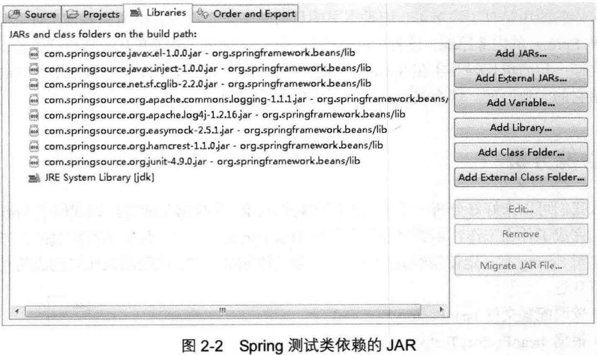

​		引人依赖的 JAR 消除掉所有编译错误后，终于可以看源码了。或许你已经知道了答案，Spring居然用了N多代码实现了这个看似很简单的功能，那么这些代码都是做什么用的呢?Spring在架构或者编码的时候又是如何考虑的呢?带着疑问我们踏上了研读 Spring源码的征程。

## 2.4 Spring的结构组成

​		我们首先尝试梳理一下Spring 的框架结构，从全局的角度了解一下Spring 的结构组成。

### 2.4.1 beans包的层级结构

​		笔者认为阅读源码的最好方法是通过示例跟着操作一遍，虽然有时候或者说大多数时候会被复杂的代码绕来绕去，绕到最后已经不知道自己身在何处了，但是,如果配以UML还是可以搞定的。笔者就是按照自己的思路进行分析,并配合必要的UML,希望读者同样可以跟得上思路。我们先看看整个beans工程的源码结构，如图2-3所示。
beans包中的各个源码包的功能如下。

- src/main/java 用于展现 Spring 的主要逻辑。
- src/main/resources用于存放系统的配置文件。
- src/test/java用于对主要逻辑进行单元测试。
- src/test/resources用于存放测试用的配置文件。

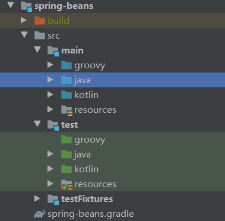

### 2.4.2 核心类介绍

通过beans工程的结构介绍，我们现在对beans 的工程结构有了初步的认识，但是在正式开始源码分析之前,有必要了解一下Spring 中最核心的两个类。

### 1.DefaultListableBeanFactory

​		XmlBeanFactory继承自DefaultListableBeanFactory，而DefaultListableBeanFactory是整个bean加载的核心部分，是Spring注册及加载bean的默认实现，而对于XmlBeanFactory与DefaultListableBeanFactory 不同的地方其实是在XmlBeanFactory 中使用了自定义的XML 读取器XmlBeanDefinitionReader，实现了个性化的 BeanDefinitionReader读取，DefaultListableBeanFactory继承了AbstractAutowireCapableBeanFactory 并实现ConfigurableListableBeanfactory 以从BeanDefinitionRegistry接口。以下是ConfigurableListableBeanFactory 的层次结构图见图（2-4）以及相关类图（见图2-5 )。

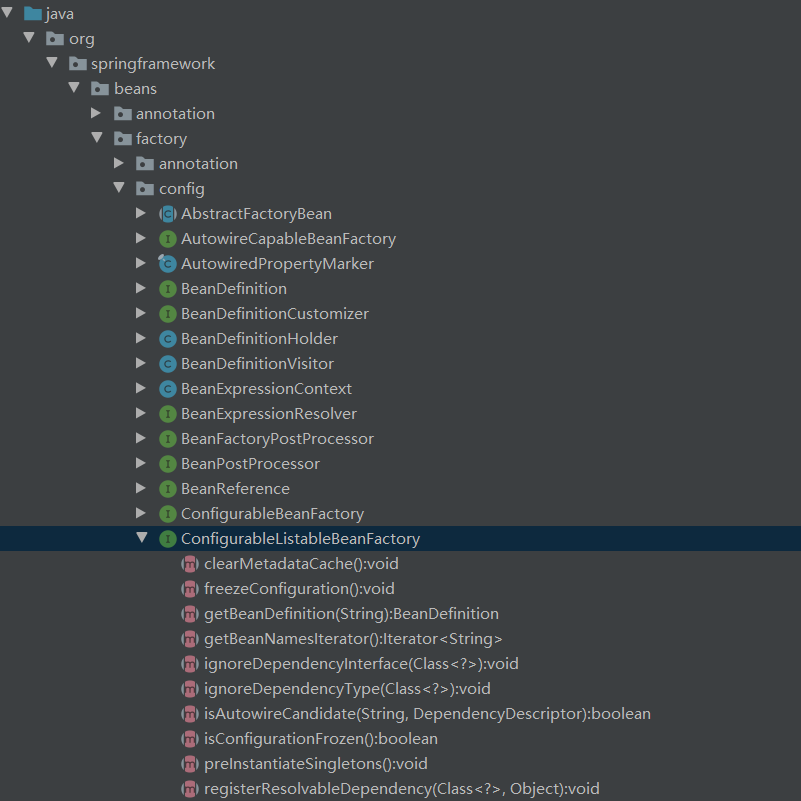 

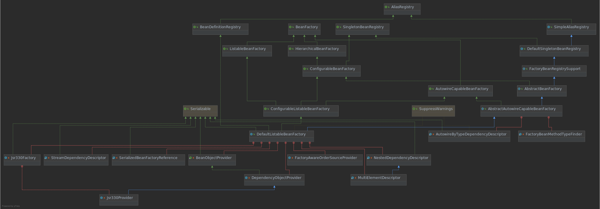

​		从上面的类图以及层次结构图中，我们可以很清晰地从全局角度了解DefaultListableBeanFactory的脉络。如果读者没有了解过Spring源码可能对上面的类图不是很理解，不过没关系，

​		通过后续的学习，你会逐渐了解每个类的作用。那么，让我们先简单地了解一下上面类图中的各个类的作用。

- AliasRegistry:定义对alias的简单增删改等操作。
- SimpleAliasRegistry:主要使用map作为alias 的缓存，并对接口AliasRegistry进行实现。
- SingletonBeanRegistry:定义对单例的注册及获取。
- BeanFactory:定义获取bean 及 bean的各种属性。
- DefaultSingletonBeanRegistry:对接口 SingletonBeanRegistry各函数的实现。
- HierarchicalBeanFactory:继承BeanFactory，也就是在BeanFactory定义的功能的基础上增加了对parentFactory 的支持。
- BeanDefinitionRegistry:定义对 BeanDefinition的各种增删改操作。
- FactoryBeanRegistrySupport:在DefaultSingletonBeanRegistry基础上增加了对 FactoryBean的特殊处理功能。
- ConfigurableListableBeanFactory: BeanFactory配置清单，指定忽略类型及接口等
- DefaultListableBeanFactory:综合上面所有功能，主要是对Bean注册后的处理.

​		XmlBeanFactory对 DefaultListableBeanFactory类进行了扩展，主要用于从XML文档中读取BeanDefinition，对于注册及获取 Bean都是使用从父类DefaultListableBeanFactory继承的方法去实现，而唯独与父类不同的个性化实现就是增加了XmlBeanDefinitionReader类型的reader属性。在XmlBeanFactory 中主要使用reader属性对资源文件进行读取和注册。

### 2.XmIBeanDefinitionReader

​		XML配置文件的读取是Spring中重要的功能，因为Spring 的大部分功能都是以配置作为切人点的,那么我们可以从XmlBeanDefinitionReader中梳理一下资源文件读取、解析及注册的大致脉络，首先我们看看各个类的功能。

- ResourceLoader:定义资源加载器，主要应用于根据给定的资源文件地址返回对应的Resource.
- BeanDefinitionReader:主要定义资源文件读取并转换为BeanDefinition的各个功能。
- EnvironmentCapable:定义获取Environment方法。
- DocumentLoader:定义从资源文件加载到转换为Document的功能。
- AbstractBeanDefinitionReader:对 EnvironmentCapable、BeanDefinitionReader类定义的功能进行实现。
- BeanDefinitionDocumentReader:定义读取Docuemnt 并注册BeanDefinition 功能。BeanDefinitionParserDelegate:定义解析Element 的各种方法。

​		经过以上分析，我们可以梳理出整个XML 配置文件读取的大致流程，如图2-6所示在	中主要包含以下几步的处理。

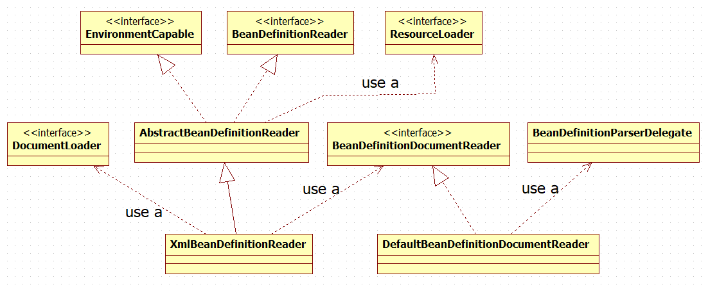


(1)通过继承自AbstractBeanDefinitionReader中的方法，来使用ResourLoader将资源文件路径转换为对应的 Resource文件。
(2)通过DocumentLoader对 Resource文件进行转换，将Resource文件转换为Document文件。
(3)通过实现接口BeanDefinitionDocumentReader 的DefaultBeanDefinitionDocumentReader类对Document进行解析，并使用BeanDefinitionParserDelegate对 Element进行解析。

## 2.5容器的基础 XmlBeanFactory

​		好了，到这里我们已经对Spring的容器功能有了一个大致的了解，尽管你可能还很迷糊,但是不要紧，接下来我们会详细探索每个步骤的实现。再次重申一下代码，我们接下来要深入分析以下功能的代码实现:

```java
BeanFactory bf = new XmlBeanFactory(new ClassPathResource ("beanFactoryTest.xml" ));
```

​		通过XmlBeanFactory初始化时序图（如图2-7所示）我们来看一看上面代码的执行逻辑。

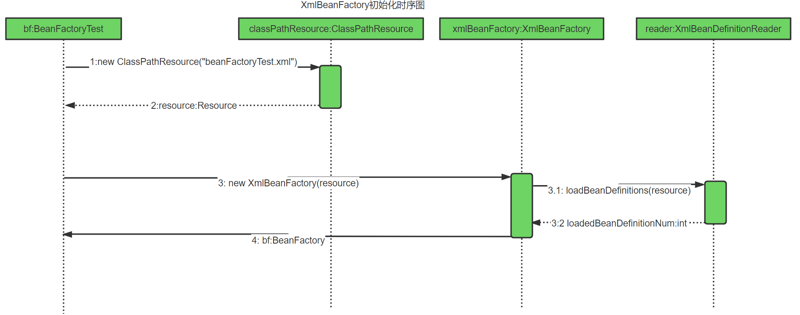

​		时序图从 BeanFactoryTest测试类开始,通过时序图我们可以一目了然地看到整个逻辑处理顺序。在测试的 BeanFactoryTest 中首先调用ClassPathResource的构造函数来构造Resource资源文件的实例对象，这样后续的资源处理就可以用Resource提供的各种服务来操作了，当我们有了Resource后就可以进行XmIBeanFactory 的初始化了。那么Resource资源是如何封装的呢?

### 2.5.1配置文件封装

​		Spring 的配置文件读取是通过ClassPathResource 进行封装的，如new ClassPathResource("beanFactoryTest.xml")，那么ClassPathResource完成了什么功能呢?
​		在Java中，将不同来源的资源抽象成URL，通过注册不同的handler ( URLStreamHandler )来处理不同来源的资源的读取逻辑，一般handler 的类型使用不同前缀（协议，Protocol )来识别，如“file:”、“http:”、“jar:”等，然而 URL没有默认定义相对Classpath或ServletContext等资源的handler，虽然可以注册自己的URLStreamHandler来解析特定的URL前缀（协议),比如“classpath:”，然而这需要了解URL的实现机制，而且 URL也没有提供一些基本的方法，如检查当前资源是否存在、检查当前资源是否可读等方法。因而Spring 对其内部使用到的资源实现了自己的抽象结构: Resource接口来封装底层资源。

```java
public interface InputstreamSource {
    Inputstream getInputStream() throws IOException;
}
public interface Resource extends InputstreamSource {
    boolean exists();
    boolean isReadable();
    boolean isopen();
    URL getURL() throws IOException;
    URI getURI() throws IOException;
    File getFile() throws IOException;
    long lastModified() throws IOException;
    Resource createRelative(string relativePath) throws IOException;
    string getFilename();
    string getDescription();
}
```

​		InputStreamSource封装任何能返回InputStream 的类，比如File、Classpath下的资源和Byte Array等。它只有一个方法定义: getInputStream()，该方法返回一个新的InputStream对象。
​		Resource接口抽象了所有Spring 内部使用到的底层资源:File、URL、Classpath等。首先，它定义了3个判断当前资源状态的方法:存在性( exists)、可读性( isReadable)、是否处于打开状态( isOpen)。另外，Resource接口还提供了不同资源到URL、URI、File类型的转换，以及获取lastModified属性、文件名(不带路径信息的文件名，getFilename())的方法。为了便于操作，Resource还提供了基于当前资源创建一个相对资源的方法:createRelative()。在错误处理中需要详细地打印出错的资源文件，因而 Resource还提供了getDescription()方法用于在错误处理中的打印信息。

​		对不同来源的资源文件都有相应的Resource实现:文件(FileSystemResource )、Classpath资源( ClassPathResource )、URL资源(UrlResource )、InputStream资源(InputStreamResource)、Byte数组( ByteArrayResource )等。相关类图如2-8所示。


在日常的开发工作中，资源文件的加载也是经常用到的，可以直接使用Spring提供的类，比如在希望加载文件时可以使用以下代码:

```java
Resource resource=new ClassPathResource ( "beanFactoryTest.xml");
InputStream inputstream=resource.getInputstream();
```

得到inputStream后,我们就可以按照以前的开发方式进行实现了。并且我们已经可以利用Resource及其子类为我们提供好的诸多特性。有了Resource接口便可以对所有资源文件进行统一处理。至于实现其实是非常简单的，以getInputStream为例, ClassPathResource中的实现方式便是通过class或者classLoader提供的底层方法进行调用，而对于FileSystemResource 的实现其实更简单，直接使用FileInputStream对文件进行实例化。

ClassPathResouce.java

```java
@Override
public InputStream getInputStream() throws IOException {
   InputStream is;
   if (this.clazz != null) {
      is = this.clazz.getResourceAsStream(this.path);
   }
   else if (this.classLoader != null) {
      is = this.classLoader.getResourceAsStream(this.path);
   }
   else {
      is = ClassLoader.getSystemResourceAsStream(this.path);
   }
   if (is == null) {
      throw new FileNotFoundException(getDescription() + " cannot be opened because it does not exist");
   }
   return is;
}
```

FileSystemResource.java

```java
@Override
public InputStream getInputStream() throws IOException {
   try {
      return Files.newInputStream(this.filePath);
   }
   catch (NoSuchFileException ex) {
      throw new FileNotFoundException(ex.getMessage());
   }
}
```

​		当通过Resource相关类完成了对配置文件进行封装后配置文件的读取工作就全权交给XmlBeanDefinitionReader来处理了。
​		了解了Spring 中将配置文件封装为Resource类型的实例方法后，我们就可以继续探寻XmlBeanFactory的初始化过程了，XmlBeanFactory的初始化有若干办法，Spring 中提供了很多的构造函数，在这里分析的是使用Resource实例作为构造函数参数的办法，代码如下:

@Deprecated

XmlBeanFactory.java

```java
public class XmlBeanFactory extends DefaultListableBeanFactory {
   private final XmlBeanDefinitionReader reader = new XmlBeanDefinitionReader(this);
   /**
    * Create a new XmlBeanFactory with the given resource,
    * which must be parsable using DOM.
    * @param resource the XML resource to load bean definitions from
    * @throws BeansException in case of loading or parsing errors
    */
   public XmlBeanFactory(Resource resource) throws BeansException {
      this(resource, null);//调用底下的构造方法
   }
   /**
    * Create a new XmlBeanFactory with the given input stream,
    * which must be parsable using DOM.
    * @param resource the XML resource to load bean definitions from
    * @param parentBeanFactory parent bean factory
    * @throws BeansException in case of loading or parsing errors
    */
   public XmlBeanFactory(Resource resource, BeanFactory parentBeanFactory) throws BeansException {
      super(parentBeanFactory);
      this.reader.loadBeanDefinitions(resource);
   }
}
```

​		上面函数中的代码 this.reader.loadBeanDefinitions(resource)才是资源加载的真正实现，也是我们分析的重点之一。我们可以看到时序图中提到的XmlBeanDefinitionReader加载数据就是在这里完成的,但是在XmlBeanDefinitionReader加载数据前还有一个调用父类构造函数初始化的过程: super(parentBeanFactory)，跟踪代码到父类AbstractAutowireCapableBeanFactory 的构造函数中:

AbstractAutowireCapableBeanFactory.java

```java
/**
 * Create a new AbstractAutowireCapableBeanFactory.
 */
public AbstractAutowireCapableBeanFactory() {
   super();
   ignoreDependencyInterface(BeanNameAware.class);
   ignoreDependencyInterface(BeanFactoryAware.class);
   ignoreDependencyInterface(BeanClassLoaderAware.class);
}
```

​		这里有必要提及一下ignoreDependencyInterface方法。ignoreDependencyInterface的主要功能是忽略给定接口的自动装配功能，那么，这样做的目的是什么呢?会产生什么样的效果呢?

​		举例来说:当A中有属性B，那么当Spring在获取A的 Bean 的时候如果其属性B还没有初始化,那么Spring 会自动初始化B，这也是Spring中提供的一个重要特性。但是，某些情况下，B不会被初始化，其中的一种情况就是B实现了BeanNameAware接口，spring中是这样介绍的:自动装配时忽略给定的依赖接口，典型应用是通过其他方式解析Application 上下文注册依赖，类似于 BeanFactory 通过 BeanFactoryAware进行注入或者ApplicationContext通过ApplicationContextAware进行注入。

### 2.5.2加载Bean

​		之前提到的在XmlBeanFactory构造函数中调用了XmIBeanDefinitionReader类型的reader属性提供的方法 this.reader.loadBeanDefinitions(resource)，而这句代码则是整个资源加载的切人点,我们先来看看这个方法的时序图，如图2-9所示。

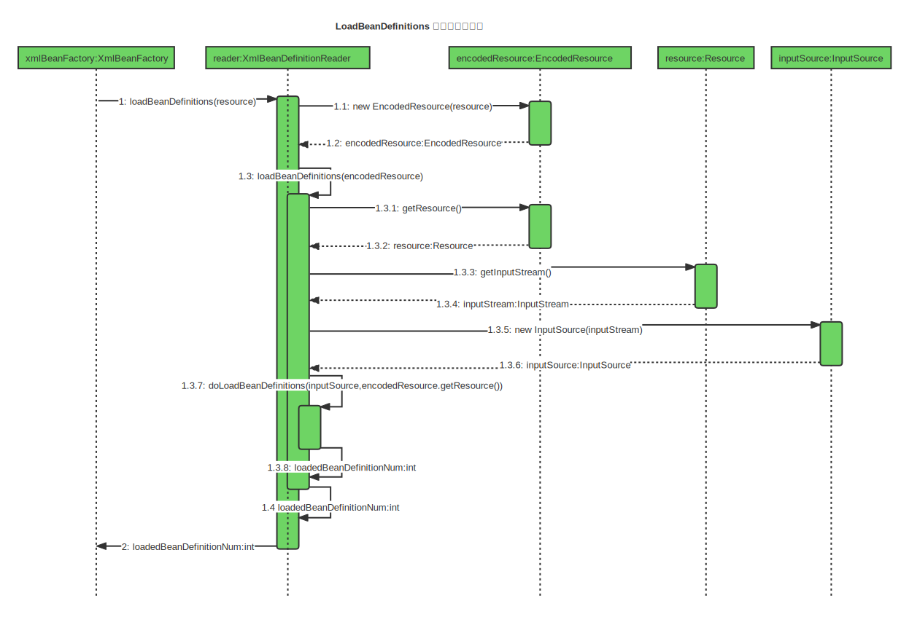

​		看到图2-9我们才知道什么叫山路十八弯，绕了这么半天还没有真正地切人正题，比如加载XML文档和解析注册 Bean，一直还在做准备工作。我们根据上面的时序图来分析一下这里究竟在准备什么?从上面的时序图中我们尝试梳理整个的处理过程如下。
（1）封装资源文件。当进入XmlBeanDefinitionReader后，首先对参数Resource使用EncodedResource类进行封装。
（2）获取输入流。从 Resource中获取对应的 InputStream并构造 InputSource。
（3）通过构造的 InputSource实例和 Resource实例继续调用函数doLoadBeanDefinitionso我们来看一下loadBeanDefinitions函数具体的实现过程:

```java
public int loadBeanDefinitions(Resource resource) throws BeanDefinitionStoreException (
	return loadBeanDefinitions(new EncodedResource (resource)) ;
}
```

​		那么EncodedResource的作用是什么呢?通过名称，我们可以大致推断这个类主要是用于对资源文件的编码进行处理的。其中的主要逻辑体现在getReader()方法中，当设置了编码属性的时候Spring会使用相应的编码作为输入流的编码。
```java
public Reader getReader() throws IOException {
    if (this.charset != null) {
        return new InputStreamReader(this.resource.getInputStream(), this.charset);
    }
    else if (this.encoding != null) {
        return new InputStreamReader(this.resource.getInputStream(), this.encoding);
    }
    else {
        return new InputStreamReader(this.resource.getInputStream());
    }
}
```

​		上面代码构造了一个有编码encoding的InputStreamReader。当构造好encodedResource对象后，再次转入了可复用方法 loadBeanDefinitions(new EncodedResource(resource))。
​		这个方法内部才是真正的数据准备阶段，也就是时序图所描述的逻辑:

```java
/**
 * Load bean definitions from the specified XML file.
 * @param encodedResource the resource descriptor for the XML file,
 * allowing to specify an encoding to use for parsing the file
 * @return the number of bean definitions found
 * @throws BeanDefinitionStoreException in case of loading or parsing errors
 */
public int loadBeanDefinitions(EncodedResource encodedResource) throws BeanDefinitionStoreException {
    Assert.notNull(encodedResource, "EncodedResource must not be null");
    if (logger.isTraceEnabled()) {
        logger.trace("Loading XML bean definitions from " + encodedResource);
    }
    Set<EncodedResource> currentResources = this.resourcesCurrentlyBeingLoaded.get();
    //通过属性记录已经加载过的资源
    if (!currentResources.add(encodedResource)) {
        throw new BeanDefinitionStoreException(
            "Detected cyclic loading of " + encodedResource + " - check your import definitions!");
    }
    //从encodedResource中获取已经封装的Resource对象并再次从Resource中获取其中的inpPutStream
    try (InputStream inputStream = encodedResource.getResource().getInputStream()) {
        //InputSource这个类并不来自于Spring，它的全路径是org.xml.sax.InputSource
        InputSource inputSource = new InputSource(inputStream);
        if (encodedResource.getEncoding() != null) {
            inputSource.setEncoding(encodedResource.getEncoding());
        }
        //真正进入了逻辑核心部分
        return doLoadBeanDefinitions(inputSource, encodedResource.getResource());
    }
    catch (IOException ex) {
        throw new BeanDefinitionStoreException(
            "IOException parsing XML document from " + encodedResource.getResource(), ex);
    }
    finally {
        currentResources.remove(encodedResource);
        if (currentResources.isEmpty()) {
            this.resourcesCurrentlyBeingLoaded.remove();
        }
    }
}
```

​		我们再次整理一下数据准备阶段的逻辑，首先对传入的resource参数做封装，目的是考虑到Resource可能存在编码要求的情况,其次,通过SAX读取XML文件的方式来准备InputSourc对象,最后将准备的数据通过参数传人真正的核心处理部分doLoadBeanDefinitions(inputSourceencodedResource.getResource())。

```java
/**
 * Actually load bean definitions from the specified XML file.
 * @param inputSource the SAX InputSource to read from
 * @param resource the resource descriptor for the XML file
 * @return the number of bean definitions found
 * @throws BeanDefinitionStoreException in case of loading or parsing errors
 * @see #doLoadDocument
 * @see #registerBeanDefinitions
 */
protected int doLoadBeanDefinitions(InputSource inputSource, Resource resource)
      throws BeanDefinitionStoreException {

   try {
      Document doc = doLoadDocument(inputSource, resource); //2 加载XML获取doc
      int count = registerBeanDefinitions(doc, resource);//3 根据doc 注册bean
      if (logger.isDebugEnabled()) {
         logger.debug("Loaded " + count + " bean definitions from " + resource);
      }
      return count;
   }
   catch ...
}
protected Document doLoadDocument(InputSource inputSource, Resource resource) throws Exception {// 1 获取xml验证模式
    return this.documentLoader.loadDocument(inputSource, getEntityResolver(), this.errorHandler,
                                            getValidationModeForResource(resource), isNamespaceAware());
}
protected int getValidationModeForResource(Resource resource) {
    int validationModeToUse = getValidationMode();
    if (validationModeToUse != VALIDATION_AUTO) {
        return validationModeToUse;
    }
    int detectedMode = detectValidationMode(resource);
    if (detectedMode != VALIDATION_AUTO) {
        return detectedMode;
    }
    // Hmm, we didn't get a clear indication... Let's assume XSD,
    // since apparently no DTD declaration has been found up until
    // detection stopped (before finding the document's root tag).
    return VALIDATION_XSD;
}
```

在上面冗长的代码中假如不考虑异常类的代码，其实只做了三件事,这三件事的每一件都必不可少。
(1)获取对XML文件的验证模式。

(2)加载XML文件，并得到对应的Document。

(3)根据返回的Document注册 Bean信息。
这3个步骤支撑着整个Spring 容器部分的实现基础，尤其是第3步对配置文件的解析,逻辑非常的复杂,那么我们先从获取XML文件的验证模式开始讲起。

## 2.6获取XML的验证模式

了解XML文件的读者都应该知道XML文件的验证模式保证了XML文件的正确性,而比较常用的验证模式有两种:DTD和XSD。它们之间什么区别呢?

### 2.6.1 DTD与XSD区别

​		DTD (Document Type Definition)即文档类型定义，是一种 XML约束模式语言，是XML文件的验证机制，属于XML文件组成的一部分。DTD是一种保证XML文档格式正确的有效方法，可以通过比较XML文档和DTD文件来看文档是否符合规范，元素和标签使用是否正确。一个 DTD文档包含:元素的定义规则，元素间关系的定义规则，元素可使用的属性，可使用的实体或符号规则。
要使用DTD验证模式的时候需要在XML文件的头部声明，以下是在Spring 中使用DTD声明方式的代码:

spring-beans.dtd

```xml
<!ELEMENT beans (
	description?,
	(import | alias | bean)*
)>

<!--
	Default values for all bean definitions. Can be overridden at
	the "bean" level. See those attribute definitions for details.
-->
<!ATTLIST beans default-lazy-init (true | false) "false">
<!ATTLIST beans default-merge (true | false) "false">
<!ATTLIST beans default-autowire (no | byName | byType | constructor | autodetect) "no">
<!ATTLIST beans default-init-method CDATA #IMPLIED>
<!ATTLIST beans default-destroy-method CDATA #IMPLIED>

<!--
	Element containing informative text describing the purpose of the enclosing
	element. Always optional.
	Used primarily for user documentation of XML bean definition documents.
-->
<!ELEMENT description (#PCDATA)>
```

​		XML Schema语言就是XSD ( XML Schemas Definition )。XML Schema描述了XML文档的结构。可以用一个指定的XML Schema来验证某个XML文档，以检查该XML文档是否符合其要求。文档设计者可以通过XML Schema指定一个XML文档所允许的结构和内容，并可据此检查一个XML文档是否是有效的。XML Schema本身是一个XML文档，它符合XML语法结构。可以用通用的XML解析器解析它。
​		在使用XML Schema文档对 XML实例文档进行检验，除了要声明名称空间外( xmIns=http://www.Springframework.org/schema/beans )，还必须指定该名称空间所对应的XML Schema文档的存储位置。通过schemaLocation属性来指定名称空间所对应的XML Schema文档的存储位置，它包含两个部分，一部分是名称空间的URI，另一部分就是该名称空间所标识的 XML Schema文件位置或URL地址( xsi:schemaLocation="http://www.Springframework.org/schema/beans http://www.Springframework.org/schema/beans/Spring-beans.xsd )。

```xml
<?xml version="1.0"encoding="UTF-8"?>
<beans xmlns="http:/ /www.Springframework.org/schema/beans"
xmlns:xsi="http: //www .w3.org/2001/xMLSchema-instance"
xsi:schemaLocation="http://www.springframework.org/schema/beanshttp://www.springframework.org/schema/beans/Spring-beans.xsd">
</beans>
```

Spring-beans-3.0.xsd 

```xml
<?xml version="1.0" encoding="UTF-8" standalone="no"?>
<xsd:schema xmlns="http://www.springframework.org/schema/beans"
		xmlns:xsd="http://www.w3.org/2001/XMLSchema"
		targetNamespace="http://www.springframework.org/schema/beans">
	<xsd:import namespace="http://www.w3.org/XML/1998/namespace"/>
	<xsd:annotation>
		<xsd:documentation>
        </xsd:documentation>
    </xsd:annotation>
	...
    ...
	<!-- simple internal types -->
	<xsd:simpleType name="defaultable-boolean">
		<xsd:restriction base="xsd:NMTOKEN">
			<xsd:enumeration value="default"/>
			<xsd:enumeration value="true"/>
			<xsd:enumeration value="false"/>
		</xsd:restriction>
	</xsd:simpleType>

</xsd:schema>

```

​		我们只是简单地介绍一下XML文件的验证模式的相关知识，目的在于让读者对后续知识的理解能有连续性，如果对XML有兴趣的读者可以进一步查阅相关资料。

### 2.6.2 验证模式的读取

​		了解了DTD与XSD的区别后我们再去分析Spring 中对于验证模式的提取就更容易理解了。通过之前的分析我们锁定了Spring通过getValidationModeForResource方法来获取对应资源的的验证模式。

XmlDefinitionReader.java

```java
/**
 * Determine the validation mode for the specified {@link Resource}.
 * If no explicit validation mode has been configured, then the validation
 * mode gets {@link #detectValidationMode detected} from the given resource.
 * <p>Override this method if you would like full control over the validation// 可以自定义
 * mode, even when something other than {@link #VALIDATION_AUTO} was set.
 * @see #detectValidationMode
 */
protected int getvalidationModeForResource(Resource resource){
	int validationModeToUse = getValidationMode ();
	//如果手动指定了验证模式则使用指定的验证模式
    if (validationModeToUse != VALIDATION_AUTO){
        return validationModeToUse;
    }
	//如果未指定则使用自动检测
    int detectedMode = detectvalidationMode(resource);// 会调用XmlValidationModeDetector的detectvalidationMode方法
    if(detectedMode != VALIDATION_A0TO) {
        return detectedMode;
    }
    return VALIDATION_XSD;
}
```

​		方法的实现其实还是很简单的，无非是如果设定了验证模式则使用设定的验证模式(可以通过对调用XmlBeanDefinitionReader 中的setValidationMode方法进行设定)，否则使用自动检测的方式。而自动检测验证模式的功能是在函数detectValidationMode方法中实现的，在detectValidationMode函数中又将自动检测验证模式的工作委托给了专门处理类XmlValidationModeDetector，调用了XmlValidationModeDetector的 detectValidationMode方法，具体代码如下:

```java
public int detectValidationMode(InputStream inputStream) throws IOException {
    // Peek into the file to look for DOCTYPE.
    BufferedReader reader = new BufferedReader(new InputStreamReader(inputStream));
    try {
        boolean isDtdValidated = false;
        String content;
        while ((content = reader.readLine()) != null) {
            content = consumeCommentTokens(content);
            if (this.inComment || !StringUtils.hasText(content)) {
                continue;
            }
            if (hasDoctype(content)) {// 调用底下的方法
                isDtdValidated = true;
                break;
            }
            if (hasOpeningTag(content)) {
                // End of meaningful data...
                break;
            }
        }
        return (isDtdValidated ? VALIDATION_DTD : VALIDATION_XSD);
    }
    catch (CharConversionException ex) {
        // Choked on some character encoding...
        // Leave the decision up to the caller.
        return VALIDATION_AUTO;
    }
    finally {
        reader.close();
    }
}

/**
 * Does the content contain the DTD DOCTYPE declaration?
 */
private boolean hasDoctype(String content) {
    return content.contains(DOCTYPE);
}
```

​		只要我们理解了XSD与 DTD的使用方法，理解上面的代码应该不会太难，Spring用来检测验证模式的办法就是判断是否包含DOCTYPE，如果包含就是DTD，否则就是XSD。

## 2.7 获取Document

​		经过了验证模式准备的步骤就可以进行Document加载了，同样XmlBeanFactoryReader类对于文档读取并没有亲力亲为,而是委托给了DocumentLoader去执行,这里的DocumentLoader是个接口，而真正调用的是DefaultDocumentLoader，解析代码如下:

DefaultDocumentLoader.java

```java
@Override
public Document loadDocument(InputSource inputSource, EntityResolver entityResolver,
      ErrorHandler errorHandler, int validationMode, boolean namespaceAware) throws Exception {

   DocumentBuilderFactory factory = createDocumentBuilderFactory(validationMode, namespaceAware);
   if (logger.isTraceEnabled()) {
      logger.trace("Using JAXP provider [" + factory.getClass().getName() + "]");
   }
   DocumentBuilder builder = createDocumentBuilder(factory, entityResolver, errorHandler);
   return builder.parse(inputSource);
}
```

​		对于这部分代码其实并没有太多可以描述的,因为通过SAX解析XML文档的套路大致都差不多，Spring在这里并没有什么特殊的地方，同样首先创建DocumentBuilderFactory，再通过DocumentBuilderFactory创建 DocumentBuilder，进而解析inputSource来返回Document对象。对此感兴趣的读者可以在网上获取更多的资料。这里有必要提及一下 EntityResolver，对于参数entityResolver，传入的是通过getEntityResolver()函数获取的返回值，如下代码:

XmlBeanDefinitionReader.java

```java
protected Document doLoadDocument(InputSource inputSource, Resource resource) throws Exception {
   return this.documentLoader.loadDocument(inputSource, getEntityResolver(), this.errorHandler,
         getValidationModeForResource(resource), isNamespaceAware());
}
/**
 * Return the EntityResolver to use, building a default resolver
 * if none specified.
 */
protected EntityResolver getEntityResolver() {
    if (this.entityResolver == null) {
        // Determine default EntityResolver to use.
        ResourceLoader resourceLoader = getResourceLoader();
        if (resourceLoader != null) {
            this.entityResolver = new ResourceEntityResolver(resourceLoader);
        }
        else {
            this.entityResolver = new DelegatingEntityResolver(getBeanClassLoader());
        }
    }
    return this.entityResolver;
}
```

那么，EntityResolver 到底是做什么用的呢?

### 2.7.1 EntityResolver 用法

​		在loadDocument方法中涉及一个参数EntityResolver,何为EntityResolver?官网这样解释:如果SAX应用程序需要实现自定义处理外部实体，则必须实现此接口并使用setEntityResolver方法向SAX驱动器注册一个实例。也就是说，对于解析一个XML，SAX首先读取该XML文档上的声明，根据声明去寻找相应的DTD定义，以便对文档进行一个验证。默认的寻找规则,即通过网络（实现上就是声明的 DTD 的URI地址）来下载相应的 DTD声明，并进行认证。下载的过程是一个漫长的过程,而且当网络中断或不可用时,这里会报错,就是因为相应的DTD声明没有被找到的原因。
​		EntityResolver 的作用是项目本身就可以提供一个如何寻找DTD声明的方法，即由程序来实现寻找DTD声明的过程，比如我们将DTD文件放到项目中某处，在实现时直接将此文档读取并返回给SAX即可。这样就避免了通过网络来寻找相应的声明。
首先看entityResolver的接口方法声明:

```java
Inputsource resolveEntity (string publicId，string systemId)
```

这里，它接收两个参数publicld和 systemld，并返回一个inputSource对象。这里我们以特定配置文件来进行讲解。
(1）如果我们在解析验证模式为XSD的配置文件，代码如下:

```xml
<?xml version="1.0" encoding="UTF-8"?>
<beans xmlns="http://www.Springframework.org/schema/beans"
	xmlns:xsi="http://www.w3.org/2001/XMLSchema-instance"
	xsi:schemaLocation="http://www.springframework.org/schema/beans http://vww.Springframework.org/schema/beans/Spring-		beans.xsd">
</beans>
```

读取到以下两个参数。

- publicld: null
- systemld: http://www.Springframework.org/schema/beans/Spring-beans.xsd

(2）如果我们在解析验证模式为DTD的配置文件，代码如下:

```xml
<?xml version="1.0"encoding=UTF一8"?>
<! DOCTYPE beans PUBLIC "-//Spring//DTD BEAN 2.0//ENM"http://ww .Springframework.org/dtd/spring-beans-2.0.dtd">
<beans>
</beans>

```

读取到以下两个参数。

- publicld:-l/Spring//DTD BEAN 2.0//EN
- systemld: http://www.Springframework.org/dtd/Spring-beans-2.0.dtd

​		之前已经提到过，验证文件默认的加载方式是通过URL进行网络下载获取，这样会造成延迟，用户体验也不好，一般的做法都是将验证文件放置在自己的工程里，那么怎么做才能将这个URL转换为自己工程里对应的地址文件呢?我们以加载DTD文件为例来看看Spring 中是如何实现的。根据之前Spring 中通过getEntityResolver()方法对EntityResolver 的获取，我们知道，Spring 中使用DelegatingEntityResolver类为EntityResolver的实现类，resolveEntity实现方法如下:

DelegatingEntityResolver.java

```java
@Override
@Nullable
public InputSource resolveEntity(@Nullable String publicId, @Nullable String systemId)
      throws SAXException, IOException {
   if (systemId != null) {
      if (systemId.endsWith(DTD_SUFFIX)) {
         return this.dtdResolver.resolveEntity(publicId, systemId);
      }
      else if (systemId.endsWith(XSD_SUFFIX)) {
         return this.schemaResolver.resolveEntity(publicId, systemId);
      }
   }
   // Fall back to the parser's default behavior.
   return null;
}
```

​		我们可以看到，对不同的验证模式，Spring使用了不同的解析器解析。这里简单描述一下原理,比如加载DTD类型的BeansDtdResolver的resolveEntity是直接截取systemld最后的xx.dtd然后去当前路径下寻找，而加载XSD类型的PluggableSchemaResolver类的resolveEntity是默认到META-INF/Spring.schemas文件中找到systemid所对应的XSD文件并加载。

BeansDtdResolver.java

```java
private static final String DTD_EXTENSION = ".dtd";
private static final String DTD_NAME = "spring-beans";

@Override
@Nullable
public InputSource resolveEntity(@Nullable String publicId, @Nullable String systemId) throws IOException {
    if (logger.isTraceEnabled()) {
        logger.trace("Trying to resolve XML entity with public ID [" + publicId +
                     "] and system ID [" + systemId + "]");
    }
    if (systemId != null && systemId.endsWith(DTD_EXTENSION)) {
        int lastPathSeparator = systemId.lastIndexOf('/');
        int dtdNameStart = systemId.indexOf(DTD_NAME, lastPathSeparator);
        if (dtdNameStart != -1) {
            String dtdFile = DTD_NAME + DTD_EXTENSION;// spring-beans.dtd
            if (logger.isTraceEnabled()) {
                logger.trace("Trying to locate [" + dtdFile + "] in Spring jar on classpath");
            }
            try {
                Resource resource = new ClassPathResource(dtdFile, getClass());
                InputSource source = new InputSource(resource.getInputStream());
                source.setPublicId(publicId);
                source.setSystemId(systemId);
                if (logger.isTraceEnabled()) {
                    logger.trace("Found beans DTD [" + systemId + "] in classpath: " + dtdFile);
                }
                return source;
            }
            catch (FileNotFoundException ex) {
                if (logger.isDebugEnabled()) {
                    logger.debug("Could not resolve beans DTD [" + systemId + "]: not found in classpath", ex);
                }
            }
        }
    }
    // Fall back to the parser's default behavior.
    return null;
}
```

## 2.8解析及注册BeanDefinitions

​		当把文件转换为Document后，接下来的提取及注册bean就是我们的重头戏。继续上面的分析，当程序已经拥有XML文档文件的 Document实例对象时，就会被引入下面这个方法。

XmlBeanDefinitionReader.java

```java
public int registerBeanDefinitions(Document doc, Resource resource) throws BeanDefinitionStoreException {
    //使用DefaultBeanDefinitionDocumentReader实例化BeanDefinitionDocumentReader
    BeanDefinitionDocumentReader documentReader = createBeanDefinitionDocumentReader();
    //在实例化BeanDefinitionReader时候会将BeanDefinitionRegistry传入，默认使用继承自DefaultListableBeanFactory的子类
	//记录统计前BeanDefinition的加载个数
    int countBefore = getRegistry().getBeanDefinitionCount();
    //加载及注册bean
    documentReader.registerBeanDefinitions(doc, createReaderContext(resource));
    //记录本次加载的BeanDefinition的个数
    return getRegistry().getBeanDefinitionCount() - countBefore;
}
```

​		其中的参数 doc是通过上一节 loadDocument 加载转换出来的。在这个方法中很好地应用了面向对象中单一职责的原则，将逻辑处理委托给单一的类进行处理，而这个逻辑处理类就是BeanDefinitionDocumentReader。BeanDefinitionDocumentReader是一个接口，而实例化的工作是在createBeanDefinitionDocumentReader()中完成的，而通过此方法，BeanDefinitionDocumentReader真正的类型其实已经是DefaultBeanDefinitionDocumentReader了，进入DefaultBeanDefinition DocumentReader后，发现这个方法的重要目的之一就是提取root，以便于再次将root作为参数继续BeanDefinition的注册。

DefaultBeanDefinitionDocumentReader.java

```java
@Override
public void registerBeanDefinitions(Document doc, XmlReaderContext readerContext) {
   this.readerContext = readerContext;
   doRegisterBeanDefinitions(doc.getDocumentElement());//root=doc.getDocumentElement()
}
```

经过艰难险阻，磕磕绊绊，我们终于到了核心逻辑的底部doRegisterBeanDefinitions(root)至少我们在这个方法中看到了希望。
如果说以前一直是XML加载解析的准备阶段,那么doRegisterBeanDefinitions算是真正地开始进行解析了，我们期待的核心部分真正开始了。

DefaultBeanDefinitionDocumentReader.java

```java
/**
 * Register each bean definition within the given root {@code <beans/>} element.
 */
@SuppressWarnings("deprecation")  // for Environment.acceptsProfiles(String...)
protected void doRegisterBeanDefinitions(Element root) {
   // Any nested <beans> elements will cause recursion in this method. In
   // order to propagate and preserve <beans> default-* attributes correctly,
   // keep track of the current (parent) delegate, which may be null. Create
   // the new (child) delegate with a reference to the parent for fallback purposes,
   // then ultimately reset this.delegate back to its original (parent) reference.
   // this behavior emulates a stack of delegates without actually necessitating one.
   BeanDefinitionParserDelegate parent = this.delegate;
    //专门处理解析
   this.delegate = createDelegate(getReaderContext(), root, parent);

   if (this.delegate.isDefaultNamespace(root)) {
      String profileSpec = root.getAttribute(PROFILE_ATTRIBUTE);
      if (StringUtils.hasText(profileSpec)) {
         String[] specifiedProfiles = StringUtils.tokenizeToStringArray(
               profileSpec, BeanDefinitionParserDelegate.MULTI_VALUE_ATTRIBUTE_DELIMITERS);
         // We cannot use Profiles.of(...) since profile expressions are not supported
         // in XML config. See SPR-12458 for details.
         if (!getReaderContext().getEnvironment().acceptsProfiles(specifiedProfiles)) {
            if (logger.isDebugEnabled()) {
               logger.debug("Skipped XML bean definition file due to specified profiles [" + profileSpec +
                     "] not matching: " + getReaderContext().getResource());
            }
            return;
         }
      }
   }
    //解析前置处理，交给子类实现  模板方法，可以进行自定义
   preProcessXml(root);
   parseBeanDefinitions(root, this.delegate);
    //解析后置处理，交给子类实现  模板方法，可以进行自定义
   postProcessXml(root);
   this.delegate = parent;
}
```

​		通过上面的代码我们看到了处理流程，首先是对profile的处理，然后开始进行解析，可是当我们跟进 preProcessXml(root)或者postProcessXml(root)发现代码是空的，既然是空的写着还要有什么用呢?就像面向对象设计方法学中常说的一句话，一个类要么是面向继承的设计的，要么就用final修饰。在 DefaultBeanDefinitionDocumentReader 中并没有用final修饰，所以它是面向继承而设计的。这两个方法正是为子类而设计的，如果读者有了解过设计模式，可以很快速地反映出这是模版方法模式，如果继承自DefaultBeanDefinitionDocumentReader 的子类需要在 Bean解析前后做一些处理的话，那么只需要重写这两个方法就可以了。

### 2.8.1 profile属性的使用(区分各种环境)

​		我们注意到在注册Bean的最开始是对PROFILE_ATTRIBUTE属性的解析，可能对于我们来说,profile属性并不是很常用。让我们先了解一下这个属性。
分析profile前我们先了解下profile 的用法，官方示例代码片段如下:

```xml
<beans xmlns="http://www.Springframework.org/schema/beans"
	xmlns :xsi="http://www.w3.org/2001/XMLSchema-instance" xmlns:jdbc="http://www.Springframework.org/ schema/jdbc"
	xmlns:jee="http://www.Springframework.org/schema/jee" xsi:schemaLocation="...">
    <beans profile="dev" >
    </beans>
    <beans profile="production" >
    </beans>
</beans>
```

集成到Web环境中时,在 web.xml中加入以下代码:
```xml
<context-param>
	<param-name>Spring.profiles.active</param-name>
    <param-value>dev</param-value>
</context-param>
```

​		有了这个特性我们就可以同时在配置文件中部署两套配置来适用于生产环境和开发环境,这样可以方便的进行切换开发、部署环境,最常用的就是更换不同的数据库。
​		了解了profile的使用再来分析代码会清晰得多，首先程序会获取 beans节点是否定义了profile属性，如果定义了则会需要到环境变量中去寻找，所以这里首先断言environment 不可能为空，因为 profile是可以同时指定多个的，需要程序对其拆分，并解析每个profile是都符合环境变量中所定义的,不定义则不会浪费性能去解析。

### 2.8.2解析并注册BeanDefinition

处理了 profile后就可以进行XML的读取了，跟踪代码进入 parseBeanDefinitions(root,this.delegate)。

DefaultBeanDefinitionDocumentReader.java

```java
/**
 * Parse the elements at the root level in the document:
 * "import", "alias", "bean".
 * @param root the DOM root element of the document
 */
protected void parseBeanDefinitions(Element root, BeanDefinitionParserDelegate delegate) {
   if (delegate.isDefaultNamespace(root)) {
      NodeList nl = root.getChildNodes();
      for (int i = 0; i < nl.getLength(); i++) {
         Node node = nl.item(i);
         if (node instanceof Element) {
            Element ele = (Element) node;
            if (delegate.isDefaultNamespace(ele)) {
               parseDefaultElement(ele, delegate);
            }
            else {
               delegate.parseCustomElement(ele);
            }
         }
      }
   }
   else {
      delegate.parseCustomElement(root);
   }
}

private void parseDefaultElement(Element ele, BeanDefinitionParserDelegate delegate) {
   /**
    * import
    */
   if (delegate.nodeNameEquals(ele, IMPORT_ELEMENT)) {
      importBeanDefinitionResource(ele);
   }
   /**
    * alias
    */
   else if (delegate.nodeNameEquals(ele, ALIAS_ELEMENT)) {
      processAliasRegistration(ele);
   }
   /**
    * bean
    */
   else if (delegate.nodeNameEquals(ele, BEAN_ELEMENT)) {
      processBeanDefinition(ele, delegate);
   }
   /**
    * nested<beans>
    */
   else if (delegate.nodeNameEquals(ele, NESTED_BEANS_ELEMENT)) {
      // recurse
      doRegisterBeanDefinitions(ele);
   }
}
```

上面的代码看起来逻辑还是蛮清晰的，因为在Spring 的 XML 配置里面有两大类Bean声明，一个是默认的，如:

```xml
<bean id="test" class="test.TestBean"/>
```

另一类就是自定义的，如:

```xml
<tx:annotation-driven/>
```

而两种方式的读取及解析差别是非常大的，如果采用Spring默认的配置，Spring当然知道该怎么做，但是如果是自定义的，那么就需要用户实现一些接口及配置了。对于根节点或者子节点如果是默认命名空间的话则采用parseDefaultElement方法进行解析，否则使用delegate.parseCustomElement方法对自定义命名空间进行解析。而判断是否默认命名空间还是自定义命名空间的办法其实是使用node.getNamespaceURI()获取命名空间,并与Spring 中固定的命名空间http://www.Springframework.org/schema/beans进行比对。如果一致则认为是默认，否则就认为是自定义。而对于默认标签解析与自定义标签解析我们将会在下一章中进行讨论。


# 第3章 默认标签的解析

​		之前提到过Spring中的标签包括默认标签和自定义标签两种,而两种标签的用法以及解析方式存在着很大的不同，本章节重点带领读者详细分析默认标签的解析过程。
​		默认标签的解析是在parseDefaultElement 函数中进行的，函数中的功能逻辑一目了然,分别对4种不同标签（import、alias、bean和 beans）做了不同的处理。

DefaultBeanDefinitionDocumentReader.java

```java
private void parseDefaultElement(Element ele, BeanDefinitionParserDelegate delegate) {
    /**
	 * import标签的处理
	 */
    if (delegate.nodeNameEquals(ele, IMPORT_ELEMENT)) {
        importBeanDefinitionResource(ele);
    }
    /**
	 * alias标签的处理
	 */
    else if (delegate.nodeNameEquals(ele, ALIAS_ELEMENT)) {
        processAliasRegistration(ele);
    }
    /**
	 * bean标签的处理
	 */
    else if (delegate.nodeNameEquals(ele, BEAN_ELEMENT)) {
        processBeanDefinition(ele, delegate);
    }
    /**
	 * nested   <beans>标签的处理
	 */
    else if (delegate.nodeNameEquals(ele, NESTED_BEANS_ELEMENT)) {
        // recurse 递归
        doRegisterBeanDefinitions(ele);
    }
}
```

## 3.1 bean标签的解析及注册

在4种标签的解析中，对 bean标签的解析最为复杂也最为重要，所以我们从此标签开始深入分析，如果能理解此标签的解析过程，其他标签的解析自然会迎刃而解。首先我们进入函数processBeanDefinition(ele, delegate)。

DefaultBeanDefinitionDocumentReader.java

```java
/**
 * Process the given bean element, parsing the bean definition
 * and registering it with the registry.
 */
protected void processBeanDefinition(Element ele, BeanDefinitionParserDelegate delegate) {
    /**
	 * 解析Element为BeanDefinition，这是重点
	 */
    BeanDefinitionHolder bdHolder = delegate.parseBeanDefinitionElement(ele);
    if (bdHolder != null) {
        bdHolder = delegate.decorateBeanDefinitionIfRequired(ele, bdHolder);
        try {
            // Register the final decorated instance.
            /**
			 * 将BeanDefinition注册到BeanDefinitionMap中，key为beanName
			 */
            BeanDefinitionReaderUtils.registerBeanDefinition(bdHolder, getReaderContext().getRegistry());
        }
        catch (BeanDefinitionStoreException ex) {
            getReaderContext().error("Failed to register bean definition with name '" +
                                     bdHolder.getBeanName() + "'", ele, ex);
        }
        // Send registration event.
        getReaderContext().fireComponentRegistered(new BeanComponentDefinition(bdHolder));
    }
}
```

乍一看，似乎一头雾水，没有以前的函数那样清晰的逻辑。大致的逻辑总结如下。
(1）首先委托BeanDefinitionDelegate类的parseBeanDefinitionElement方法进行元素解析，返回BeanDefinitionHolder类型的实例bdHolder，经过这个方法后，bdHolder实例已经包含我们配置文件中配置的各种属性了，例如class、name、id、alias之类的属性。
(2）当返回的 bdHolder 不为空的情况下若存在默认标签的子节点下再有自定义属性,还需要再次对自定义标签进行解析。
(3）解析完成后，需要对解析后的bdHolder进行注册，同样，注册操作委托给了 BeanDefinitionReaderUtils的 registerBeanDefinition方法。
(4）最后发出响应事件，通知想关的监听器，这个bean已经加载完成了。配合时序图（如图3-1所示)，可能会更容易理解。

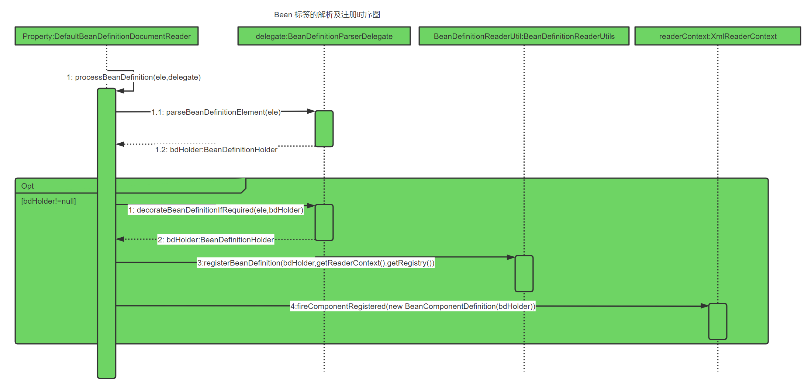


### 3.1.1解析BeanDefinition

​		下面我们就针对各个操作做具体分析。首先我们从元素解析及信息提取开始，也就是

```java
BeanDefinitionHolder bdHolder = delegate.parseBeanDefinitionElement(ele)
```

进入BeanDefinitionDelegate类的parseBeanDefinitionElement方法。

BeanDefinitionParserDelegate.java

```java
/**
 * Parses the supplied {@code <bean>} element. May return {@code null}
 * if there were errors during parse. Errors are reported to the
 * {@link org.springframework.beans.factory.parsing.ProblemReporter}.
 */
@Nullable
public BeanDefinitionHolder parseBeanDefinitionElement(Element ele, @Nullable BeanDefinition containingBean) {
    //获取bead id属性
    String id = ele.getAttribute(ID_ATTRIBUTE);
    //获取name属性
    String nameAttr = ele.getAttribute(NAME_ATTRIBUTE);
    //解析name, 多个别名
    List<String> aliases = new ArrayList<>();
    if (StringUtils.hasLength(nameAttr)) {
        String[] nameArr = StringUtils.tokenizeToStringArray(nameAttr, MULTI_VALUE_ATTRIBUTE_DELIMITERS);
        aliases.addAll(Arrays.asList(nameArr));
    }
    // id属性赋值到beanName变量中，注意不是name属性
    String beanName = id;
    //如果没有id属性，则使用name属性的第一个值
    if (!StringUtils.hasText(beanName) && !aliases.isEmpty()) {
        beanName = aliases.remove(0);
        if (logger.isTraceEnabled()) {
            logger.trace("No XML 'id' specified - using '" + beanName +
                         "' as bean name and " + aliases + " as aliases");
        }
    }
    if (containingBean == null) {
        checkNameUniqueness(beanName, aliases, ele);
    }
    // 解析bean节点为GenericBeanDefinition================重点====================
    AbstractBeanDefinition beanDefinition = parseBeanDefinitionElement(ele, beanName, containingBean);//解析bean的各种属性内容（重点）
    if (beanDefinition != null) {
        if (!StringUtils.hasText(beanName)) {
            try {
                if (containingBean != null) {
                    beanName = BeanDefinitionReaderUtils.generateBeanName(
                        beanDefinition, this.readerContext.getRegistry(), true);
                }
                else {
                    beanName = this.readerContext.generateBeanName(beanDefinition);
                    // Register an alias for the plain bean class name, if still possible,
                    // if the generator returned the class name plus a suffix.
                    // This is expected for Spring 1.2/2.0 backwards compatibility.
                    String beanClassName = beanDefinition.getBeanClassName();
                    if (beanClassName != null &&
                        beanName.startsWith(beanClassName) && beanName.length() > beanClassName.length() &&
                        !this.readerContext.getRegistry().isBeanNameInUse(beanClassName)) {
                        aliases.add(beanClassName);
                    }
                }
                if (logger.isTraceEnabled()) {
                    logger.trace("Neither XML 'id' nor 'name' specified - " +
                                 "using generated bean name [" + beanName + "]");
                }
            }
            catch (Exception ex) {
                error(ex.getMessage(), ele);
                return null;
            }
        }
        String[] aliasesArray = StringUtils.toStringArray(aliases);
        return new BeanDefinitionHolder(beanDefinition, beanName, aliasesArray);
    }
    return null;
}
```

​		以上便是对默认标签解析的全过程了。当然，对Spring的解析犹如洋葱剥皮一样，一层一层地进行，尽管现在只能看到对属性id以及name 的解析，但是很庆幸,思路我们已经了解了。在开始对属性展开全面解析前，Spring在外层又做了一个当前层的功能架构，在当前层完成的主要工作包括如下内容。
(1）提取元素中的id以及name属性。

(2）进一步解析其他所有属性并统一封装至GenericBeanDefinition类型的实例中。

(3）如果检测到bean没有指定beanName，那么使用默认规则为此 Bean生成 beanName

(4）将获取到的信息封装到BeanDefinitionHolder的实例中。
我们进一步地查看步骤（2）中对标签其他属性的解析过程。

BeanDefinitionParserDelegate.java

```java
/**
 * Parse the bean definition itself, without regard to name or aliases. May return
 * {@code null} if problems occurred during the parsing of the bean definition.
 */
@Nullable
public AbstractBeanDefinition parseBeanDefinitionElement(
    Element ele, String beanName, @Nullable BeanDefinition containingBean) {
    this.parseState.push(new BeanEntry(beanName));
    String className = null;
    //解析class属性
    if (ele.hasAttribute(CLASS_ATTRIBUTE)) {
        className = ele.getAttribute(CLASS_ATTRIBUTE).trim();
    }
    String parent = null;
    //解析parent属性
    if (ele.hasAttribute(PARENT_ATTRIBUTE)) {
        parent = ele.getAttribute(PARENT_ATTRIBUTE);
    }
    try {
        //创建用于承载属性的abstractBeanDefinition类型的GenericBeanDefinition
        AbstractBeanDefinition bd = createBeanDefinition(className, parent);
        // 解析<bean>中的各种属性，比如scope，lazy-init等
        parseBeanDefinitionAttributes(ele, beanName, containingBean, bd);
        //提取description
        bd.setDescription(DomUtils.getChildElementValueByTagName(ele, DESCRIPTION_ELEMENT));
        //解析元数据
        parseMetaElements(ele, bd);
        //解析lookup-method属性
        parseLookupOverrideSubElements(ele, bd.getMethodOverrides());
        //解析replace-method属性
        parseReplacedMethodSubElements(ele, bd.getMethodOverrides());
        //解析构造参数
        parseConstructorArgElements(ele, bd);
        //解析property子元素
        parsePropertyElements(ele, bd);
        //解析qualifier子元素
        parseQualifierElements(ele, bd);
        bd.setResource(this.readerContext.getResource());
        bd.setSource(extractSource(ele));
        return bd;
    }
    catch (ClassNotFoundException ex) {
        error("Bean class [" + className + "] not found", ele, ex);
    }
    catch (NoClassDefFoundError err) {
        error("Class that bean class [" + className + "] depends on not found", ele, err);
    }
    catch (Throwable ex) {
        error("Unexpected failure during bean definition parsing", ele, ex);
    }
    finally {
        this.parseState.pop();
    }
    return null;
}
```

​		终于，bean标签的所有属性，不论常用的还是不常用的我们都看到了,尽管有些复杂的属性还需要进一步的解析，不过丝毫不会影响我们兴奋的心情。接下来，我们继续一些复杂标签属性的解析。

#### 1．创建用于属性承载的BeanDefinition

​		BeanDefinition是一个接口，在 Spring中存在三种实现:RootBeanDefinition、ChildBeanDefinition以及GenericBeanDefinition。三种实现均继承了		AbstractBeanDefiniton其中BeanDefinition是配置文件<bean>元素标签在容器中的内部表示形式。<bean>元素标class、scope、lazy-init等配置属性，BeanDefinition则提供了相应的beanClass、scope、lazyInit属性，BeanDefinition和<bean>中的属性是一一对应的。其中RootBeanDefinition是最常用的实现类，它对应一般性的<bean>元素标签，GenericBeanDefinition是自2.5版本以后新加入的bean文件配置属性定义类,是一站式服务类。在配置文件中可以定义父<bean>和子<bean>，父<bean>用 RootBeanDefinition表示，而子<bean>用ChildBeanDefiniton表示，而没有父<bean>的<bean>就使用RootBeanDefinitiot
表示。AbstractBeanDefinition对两者共同的类信息进行抽象。Spring通过 BeanDefinition 将配置文件中的<bean>配置信息转换为容器的内部表示，并将这些BeanDefiniton注册到BeanDefinitonRegistry中。Spring容器的BeanDefinitionRegistry就像是Spring配置信息的内存数据库，主要是以map的形式保存，后续操作直接从 BeanDefinitionRegistry中读取配置信息。它们之间的关系如图3-2所示。

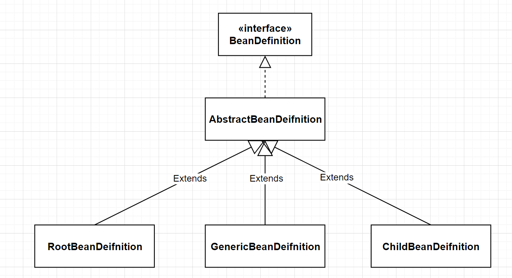


由此可知,要解析属性首先要创建用于承载属性的实例,也就是创建GenericBeanDefinition类型的实例。而代码createBeanDefinition(className, parent)的作用就是实现此功能。

BeanDefinitionParserDelegate.java

```java
protected AbstractBeanDefinition createBeanDefinition(@Nullable String className, @Nullable String parentName)
    throws ClassNotFoundException {
    return BeanDefinitionReaderUtils.createBeanDefinition(
        parentName, className, this.readerContext.getBeanClassLoader());
}
```


BeanDefinitionReaderUtils.java

```java
/**
 * 反射实例化，创建GenericBeanDefinition对象
 */
public static AbstractBeanDefinition createBeanDefinition(
    @Nullable String parentName, @Nullable String className, @Nullable ClassLoader classLoader) throws ClassNotFoundException {

    GenericBeanDefinition bd = new GenericBeanDefinition();
    bd.setParentName(parentName);
    if (className != null) {
        //如果classLoader不为空，则使用以传入的classLoader同一虚拟机加载类对象，否则只是记录className
        if (classLoader != null) {
            //反射:
            bd.setBeanClass(ClassUtils.forName(className, classLoader));
        }
        else {
            bd.setBeanClassName(className);
        }
    }
    return bd;
}
```

#### 2．解析各种属性

当我们创建了bean信息的承载实例后，便可以进行bean信息的各种属性解析了，首先我们进入parseBeanDefinitionAttributes方法。parseBeanDefinitionAttributes方法是对element所有元素属性进行解析:

BeanDefinitionParserDelegate.java

```java
/**
 * Apply the attributes of the given bean element to the given bean * definition.
 * @param ele bean declaration element
 * @param beanName bean name
 * @param containingBean containing bean definition
 * @return a bean definition initialized according to the bean element attributes
 */
// 解析<bean>中的各种属性，比如scope，lazy-init等
public AbstractBeanDefinition parseBeanDefinitionAttributes(Element ele, String beanName,
                                                           @Nullable BeanDefinition containingBean, AbstractBeanDefinition bd) {
    //解析singleton属性
    if (ele.hasAttribute(SINGLETON_ATTRIBUTE)) {
        error("Old 1.x 'singleton' attribute in use - upgrade to 'scope' declaration", ele);
    }
    //解析scope属性
    else if (ele.hasAttribute(SCOPE_ATTRIBUTE)) {
        bd.setScope(ele.getAttribute(SCOPE_ATTRIBUTE));
    }
    else if (containingBean != null) {
        // Take default from containing bean in case of an inner bean definition.
        //在嵌入beandefinition且没有执行scope的情况下，使用父类默认的属性
        bd.setScope(containingBean.getScope());
    }
    //解析abstract属性
    if (ele.hasAttribute(ABSTRACT_ATTRIBUTE)) {
        bd.setAbstract(TRUE_VALUE.equals(ele.getAttribute(ABSTRACT_ATTRIBUTE)));
    }
    //解析lazy-init属性
    String lazyInit = ele.getAttribute(LAZY_INIT_ATTRIBUTE);
    if (isDefaultValue(lazyInit)) {
        lazyInit = this.defaults.getLazyInit();
    }
    //如果没有设置或设置成其他字段都会制成false
    bd.setLazyInit(TRUE_VALUE.equals(lazyInit));
    //解析autowire
    String autowire = ele.getAttribute(AUTOWIRE_ATTRIBUTE);
    bd.setAutowireMode(getAutowireMode(autowire));
    //解析depends-on属性
    if (ele.hasAttribute(DEPENDS_ON_ATTRIBUTE)) {
        String dependsOn = ele.getAttribute(DEPENDS_ON_ATTRIBUTE);
        bd.setDependsOn(StringUtils.tokenizeToStringArray(dependsOn, MULTI_VALUE_ATTRIBUTE_DELIMITERS));
    }
    //解析autowire-candidate属性
    String autowireCandidate = ele.getAttribute(AUTOWIRE_CANDIDATE_ATTRIBUTE);
    if (isDefaultValue(autowireCandidate)) {
        String candidatePattern = this.defaults.getAutowireCandidates();
        if (candidatePattern != null) {
            String[] patterns = StringUtils.commaDelimitedListToStringArray(candidatePattern);
            bd.setAutowireCandidate(PatternMatchUtils.simpleMatch(patterns, beanName));
        }
    }
    else {
        bd.setAutowireCandidate(TRUE_VALUE.equals(autowireCandidate));
    }
    //解析primary属性
    if (ele.hasAttribute(PRIMARY_ATTRIBUTE)) {
        bd.setPrimary(TRUE_VALUE.equals(ele.getAttribute(PRIMARY_ATTRIBUTE)));
    }
    //解析init-mothod属性
    if (ele.hasAttribute(INIT_METHOD_ATTRIBUTE)) {
        String initMethodName = ele.getAttribute(INIT_METHOD_ATTRIBUTE);
        bd.setInitMethodName(initMethodName);
    }
    else if (this.defaults.getInitMethod() != null) {
        bd.setInitMethodName(this.defaults.getInitMethod());
        bd.setEnforceInitMethod(false);
    }
    //解析destroy-method属性
    if (ele.hasAttribute(DESTROY_METHOD_ATTRIBUTE)) {
        String destroyMethodName = ele.getAttribute(DESTROY_METHOD_ATTRIBUTE);
        bd.setDestroyMethodName(destroyMethodName);
    }
    else if (this.defaults.getDestroyMethod() != null) {
        bd.setDestroyMethodName(this.defaults.getDestroyMethod());
        bd.setEnforceDestroyMethod(false);
    }
    //解析factory-method属性
    if (ele.hasAttribute(FACTORY_METHOD_ATTRIBUTE)) {
        bd.setFactoryMethodName(ele.getAttribute(FACTORY_METHOD_ATTRIBUTE));
    }
    //解析factory-bean属性
    if (ele.hasAttribute(FACTORY_BEAN_ATTRIBUTE)) {
        bd.setFactoryBeanName(ele.getAttribute(FACTORY_BEAN_ATTRIBUTE));
    }
    return bd;
}
```

​		我们可以清楚地看到Spring完成了对所有bean属性的解析，这些属性中有很多是我们经常使用的，同时我相信也一定会有或多或少的属性是读者不熟悉或者是没有使用过的，有兴趣的读者可以查阅相关资料进一步了解每个属性。

#### 3．解析子元素meta

在开始解析元数据的分析前，我们先回顾下元数据meta属性的使用。
```xml
<bean id="myTestBean" class="bean.MyTestBean">
	<meta key="testStr" value="aaaaaaaa"/>
</bean>
```

这段代码并不会体现在 MyTestBean的属性当中，而是一个额外的声明，当需要使用里面的信息的时候可以通过BeanDefinition的 getAttribute(key)方法进行获取。对meta属性的解析代码如下:

BeanDefinitionParserDelegate.java

```java
/**
 * Parse the meta elements underneath the given element, if any.
 */
public void parseMetaElements(Element ele, BeanMetadataAttributeAccessor attributeAccessor) {
    //获取当前节点的所有子元素
    NodeList nl = ele.getChildNodes();
    for (int i = 0; i < nl.getLength(); i++) {
        Node node = nl.item(i);
        //提取meta
        if (isCandidateElement(node) && nodeNameEquals(node, META_ELEMENT)) {
            Element metaElement = (Element) node;
            //通过key value 构造 BeanMetadataAttribute
            String key = metaElement.getAttribute(KEY_ATTRIBUTE);
            String value = metaElement.getAttribute(VALUE_ATTRIBUTE);
            BeanMetadataAttribute attribute = new BeanMetadataAttribute(key, value);
            attribute.setSource(extractSource(metaElement));
            //记录信息 
            attributeAccessor.addMetadataAttribute(attribute);
        }
    }
}
```

#### 4．解析子元素lookup-method

​		同样，子元素lookup-method 似乎并不是很常用，但是在呆些时候匕的佣定非N月BP属性，通常我们称它为获取器注入。引用《Spring in Action》中的一句话:获取器注入是一种特殊的方法注入，它是把一个方法声明为返回某种类型的 bean，但实际要返回的 bean是在配置文件里面配置的，此方法可用在设计有些可插拔的功能上，解除程序依赖。我们看看具体的应用。

(1)首先我们创建一个父类。
```java
package test. lookup.bean;
public class User{
	public void showMe (){
		System.out.println("i am user" );
    }
}
```

(2)创建其子类并覆盖showMe方法。
```java
package test. lookup.bean;
public class Teacher extends User{
    public void showMe(){
        System.out.println ( "i am Teacher");
    }
}
```

(3）创建调用方法。
```java
public abstract class GetBeanTest {
    public void showMe(){
        this.getBean().showMe () ;
    }
    public abstract User getBean ();
}
```

( 4）创建测试方法。
```java
package test. lookup;
import org.Springframework.context.ApplicationContext;
import org.Springframework.context.support.classPathxmlApplicationContext;
import test.lookup.app.GetBeanTest;
public class Main {
	public static void main (String[] args){
		Applicationcontext bf = new ClassPathXmlApplicationContext ("test/lookup/lookupTest.xml");
		GetBeanTest test=(GetBeanTest) bf.getBean ( "getBeanTest");
		test.showMe();
	}
}
```

​		到现在为止，除了配置文件外，整个测试方法就完成了，如果之前没有接触过获取器注入的读者们可能会有疑问:抽象方法还没有被实现，怎么可以直接调用呢?答案就在Spring为我们提供的获取器中，我们看看配置文件是怎么配置的。

```xml
<?xml version="1.0" encoding="UTF-8"?>
<beans xmlns="http://www.Springframework.org/schema/beans"
	xmlns:xsi="http://www.w3.org/2001/XMLSchema-instance"
	xsi;schemaLocation="http: //ww.Springframework.org/schema/beans http://www.Springframework.org/scherna/beans/Spring-beans.xsd">
    <bean id="getBeanTest" class="test.lookup.app. GetBeanTest">
    	<lookup-method name="getBean" bean="teacher" />
    </bean>
    <bean id="teacher" class="test.lookup.bean.Teacher" />
</beans>
```

在配置文件中，我们看到了源码解析中提到的 lookup-method子元素，这个配置完成的功能是动态地将teacher所代表的bean作为getBean的返回值，运行测试方法我们会看到控制台上的输出:
i am Teacher
当我们的业务变更或者在其他情况下，teacher 里面的业务逻辑已经不再符合我们的业务要求，需要进行替换怎么办呢?这是我们需要增加新的逻辑类:

```java
package test.lookup.bean;
public class student extends User {
    public void showMe () {
        System.out.println ("i am student") ;
    }
}
```

同时修改配置文件:
```xml
<?xnl version="1.0"encoding="UTF-8"?>
<beans xmlns="http://www.Springframework.ora/schema/beans"0
	xmlns:xsi="http://www.w3.org/2001/XMLSchema-instance"
	xsi:schemaLocation="http://www.Springframework.org/schema/beans http://ww.Springframework.org/schema/beans/Spring-beans.xsd">
    <bean id="getBeanTest" class="test.lookup.app.GetBeanTest">
	    <lookup-method name="getBean" bean="student"/>
    </bean>
    <bean id="teacher" class="test.lookup.bean.Teacher"/>
    <bean id="student" class="test.lookup.bean.Student"/>
</ beans>
```

再次运行测试类，你会发现不一样的结果:i am Student
至此，我们已经初步了解了lookup-method子元素所提供的大致功能，相信这时再次去看它的属性提取源码会觉得更有针对性。

```java
public void parseLookupOverrideSubElements(Element beanEle，MethodOverrides overrides) {
	NodeList nl = beanEle.getChildNodes () ;
	for (int i= 0; i <nl.getLength() ; i++){
		Node node = nl.item(i) ;
        //仅当在Spring默认bean的子元素下且为<lookup-method时有效
        if(isCandidateElement (node) && nodeNameEquals(node, LOOKUP.METHOD_ELEMENT)){
        	Element ele =(Element) node;//获取要修饰的方法
        	String methodName = ele.getAttribute(NAME_ATTRIBUTE);//获取配置返回的bean
        	String beanRef = ele.getAttribute (BEAN_ELEMENT);
        	Lookupoverride override = new LookupOverride (methodName,beanRef);override.setsource (extractsource(ele));
        	overrides.addoverride (override);
        }
    }
}
```

上面的代码很眼熟，似乎与parseMetaElements的代码大同小异。最大的区别在于if判断中的节点名称在这里被修改为了LOOKUP_METHOD_ELEMENT。还有，在数据存储上面通过使用LookupOverride类型的实体类来进行数据承载，并记录在 AbstractBeanDefinition中的methodOverrides属性中。


#### 5．解析子元素replaced-method

​		这个方法主要是对bean中 replaced-method子元素的提取，在开始提取分析之前我们还是预先介绍下这个元素的用法。
​		方法替换:可以在运行时用新的方法替换现有的方法。与之前的look-up 不同的是，replaced-method不但可以动态地替换返回实体 bean，而且还能动态地更改原有方法的逻辑。我们来看看使用示例。
(1）在changeMe中完成某个业务逻辑。

```java
public class TestChangeMethod {
    public void changeMe(){
        System.out.println("changeMe");
    }
}
```

(2)在运营一段时间后需要改变原有的业务逻辑。
```java
public class TestMethodReplacer implements MethodReplacer{
    @override
    public 0bject reimplement(Object obj，Method method，0bject[] args) throws Throwable {
	    System.out.println("我替换了原有的方法");
        return null;
    }
}
```

(3）使替换后的类生效。
```xml
<?xml version="1.0" encoding="UTF-8"?>
<beans xmlns="http://www.Springframework.org/schema/beans"
    	xmlns:xsi="http://www.w3.org/2001/XMLSchema-instance"
    	xsi:schemaLocation="http://wwa.Springframework.org/schema/beans http://www.Springframework.org/schema/beans/Spring-beans.xsd">
    <bean id="testChangeMethod" class="test.replacemethod.TestChangeMethod">
	    <replaced-method name="changeMe" replacer="replacer"/>
    </bean>
    <bean id="replacer" class="test.replacemethod.TestMethodReplacer"/>
</beans>
```

(4）测试。
```java
public static void main (String[]args) {
	ApplicationContext bf = new ClassPathXmlApplicationContext("test/replacemethod/replaceMethodTest.xml");
	TestChangeMethod test=(TestChangeMethod) bf.getBean ("testChangeMethod");
	test.changeMe();
}
```

​		好了,运行测试类就可以看到预期的结果了,控制台成功打印出“我替换了原有的方法”，也就是说我们做到了动态替换原有方法，知道了这个元素的用法，我们再次来看元素的提取过程:

BeanDefinitionParserDelegate.java

```java
/**
 * Parse replaced-method sub-elements of the given bean element.
 */
public void parseReplacedMethodSubElements(Element beanEle, MethodOverrides overrides) {
   NodeList nl = beanEle.getChildNodes();
   for (int i = 0; i < nl.getLength(); i++) {
      Node node = nl.item(i);
       //仅当在spring默认bean的子元素下且为replace-method时有效
      if (isCandidateElement(node) && nodeNameEquals(node, REPLACED_METHOD_ELEMENT)) {
         Element replacedMethodEle = (Element) node;
          //要替换的旧的方法
         String name = replacedMethodEle.getAttribute(NAME_ATTRIBUTE);
          //用来替换的新的方法
         String callback = replacedMethodEle.getAttribute(REPLACER_ATTRIBUTE);
         ReplaceOverride replaceOverride = new ReplaceOverride(name, callback);
         // Look for arg-type match elements.
         List<Element> argTypeEles = DomUtils.getChildElementsByTagName(replacedMethodEle, ARG_TYPE_ELEMENT);
         for (Element argTypeEle : argTypeEles) {
             //记录参数
            String match = argTypeEle.getAttribute(ARG_TYPE_MATCH_ATTRIBUTE);
            match = (StringUtils.hasText(match) ? match : DomUtils.getTextValue(argTypeEle));
            if (StringUtils.hasText(match)) {
               replaceOverride.addTypeIdentifier(match);
            }
         }
         replaceOverride.setSource(extractSource(replacedMethodEle));
         overrides.addOverride(replaceOverride);
      }
   }
}
```

​		我们可以看到无论是look-up还是replaced-method都是构造了一个MethodOverride，并最终记录在了AbstractBeanDefinition中的 methodOverrides属性中。而这个属性如何使用以完成它所提供的功能我们会在后续的章节进行详细地介绍。


#### 6．解析子元素constructor-arg

对构造函数的解析是非常常用的，同时也是非常复杂的，也相信大家对构造函数的配置都不陌生,举个简单的小例子:
```xml
<beans>
<!--默认的情况下是按照参数的顺序注人，当指定index索引后就可以改变注人参数的顺序-->
    <bean id="helloBean" class="com.HelloBean">
        <constructor-arg index="0">
        	<value>郝佳</value>
        </constructor-arg>
        <constructor-arg index="1">
            <value>你好</value>
        </constructor-arg>
    </bean>
    ...
</beans>
```

​		上面的配置是Spring构造函数配置中最基础的配置，实现的功能就是对HelloBean自动寻找对应的构造函数，并在初始化的时候将设置的参数传入进去。那么让我们来看看具体的XML解析过程。
​		对于constructor-arg子元素的解析，Spring是通过parseConstructorArgElements 函数来实现的，具体的代码如下:

BeanDefinitionParserDelegate.java

```java
/**
 * Parse constructor-arg sub-elements of the given bean element.
 */
public void parseConstructorArgElements(Element beanEle, BeanDefinition bd) {
    NodeList nl = beanEle.getChildNodes();
    for (int i = 0; i < nl.getLength(); i++) {
        Node node = nl.item(i);
        if (isCandidateElement(node) && nodeNameEquals(node, CONSTRUCTOR_ARG_ELEMENT)) {
            //真正的解析construct-arg
            parseConstructorArgElement((Element) node, bd);
        }
    }
}
```

这个结构似乎我们可以想象得到，遍历所有子元素，也就是提取所有constructor-arg，然后进行解析，但是具体的解析却被放置在了另个函数 parseConstructorArgElement中，具体代码如下:

BeanDefinitionParserDelegate.java

```java
/**
 * Parse a constructor-arg element.
 */
public void parseConstructorArgElement(Element ele, BeanDefinition bd) {
    //提取index属性
   String indexAttr = ele.getAttribute(INDEX_ATTRIBUTE);
    //提取type属性
   String typeAttr = ele.getAttribute(TYPE_ATTRIBUTE);
    //提取name属性
   String nameAttr = ele.getAttribute(NAME_ATTRIBUTE);
   if (StringUtils.hasLength(indexAttr)) {
      try {
         int index = Integer.parseInt(indexAttr);
         if (index < 0) {
            error("'index' cannot be lower than 0", ele);
         }
         else {
            try {
               this.parseState.push(new ConstructorArgumentEntry(index));
                //解析element对应的属性元素
               Object value = parsePropertyValue(ele, bd, null);
               ConstructorArgumentValues.ValueHolder valueHolder = new ConstructorArgumentValues.ValueHolder(value);
               if (StringUtils.hasLength(typeAttr)) {
                  valueHolder.setType(typeAttr);
               }
               if (StringUtils.hasLength(nameAttr)) {
                  valueHolder.setName(nameAttr);
               }
               valueHolder.setSource(extractSource(ele));
                //不允许重复指定相同的参数
               if (bd.getConstructorArgumentValues().hasIndexedArgumentValue(index)) {
                  error("Ambiguous constructor-arg entries for index " + index, ele);
               }
               else {
                  bd.getConstructorArgumentValues().addIndexedArgumentValue(index, valueHolder);
               }
            }
            finally {
               this.parseState.pop();
            }
         }
      }
      catch (NumberFormatException ex) {
         error("Attribute 'index' of tag 'constructor-arg' must be an integer", ele);
      }
   }
   else {//没有index属性，则忽略属性，自动寻找
      try {
         this.parseState.push(new ConstructorArgumentEntry());
         Object value = parsePropertyValue(ele, bd, null);
         ConstructorArgumentValues.ValueHolder valueHolder = new ConstructorArgumentValues.ValueHolder(value);
         if (StringUtils.hasLength(typeAttr)) {
            valueHolder.setType(typeAttr);
         }
         if (StringUtils.hasLength(nameAttr)) {
            valueHolder.setName(nameAttr);
         }
         valueHolder.setSource(extractSource(ele));
         bd.getConstructorArgumentValues().addGenericArgumentValue(valueHolder);
      }
      finally {
         this.parseState.pop();
      }
   }
}
```

上面一段看似复杂的代码让很多人失去了耐心，但是，涉及的逻辑其实并不复杂，首先是提取constructor-arg 上必要的属性( index、type、name )。
如果配置中指定了index属性，那么操作步骤如下。

(1)解析constructor-arg 的子元素。
(2)使用ConstructorArgumentValues.ValueHolder类型来封装解析出来的元素。
(3)将type、name 和 index属性一并封装在ConstructorArgumentValues.ValueHolder类型中并添加至当前BeanDefinition的constructorArgumentValues的indexedArgumentValues属性中。

如果没有指定index属性,那么操作步骤如下。
(1) 解析constructor-arg 的子元素。
(2)使用ConstructorArgumentValues.ValueHolder类型来封装解析出来的元素。
(3)将type、name和index属性一并封装在ConstructorArgumentValues.ValueHolder类型中并添加至当前BeanDefinition的constructorArgumentValues的genericArgumentValues属性中。
可以看到，对于是否制定index属性来讲，Spring 的处理流程是不同的，关键在于属性信息被保存的位置。
那么了解了整个流程后，我们尝试着进一步了解解析构造函数配置中子元素的过程，进人parsePropertyValue:

```java
/**
 * Get the value of a property element. May be a list etc.
 * Also used for constructor arguments, "propertyName" being null in this case.
 */
@Nullable
public Object parsePropertyValue(Element ele, BeanDefinition bd, @Nullable String propertyName) {
   String elementName = (propertyName != null ?
         "<property> element for property '" + propertyName + "'" :
         "<constructor-arg> element");

   // Should only have one child element: ref, value, list, etc.
    //一个属性只能对应一种类型 ref, value, list等
   NodeList nl = ele.getChildNodes();
   Element subElement = null;
   for (int i = 0; i < nl.getLength(); i++) {
      Node node = nl.item(i);
       // description和meta类型的元素不处理
      if (node instanceof Element && !nodeNameEquals(node, DESCRIPTION_ELEMENT) &&
            !nodeNameEquals(node, META_ELEMENT)) {
         // Child element is what we're looking for.
         if (subElement != null) {
            error(elementName + " must not contain more than one sub-element", ele);
         }
         else {
            subElement = (Element) node;
         }
      }
   }
	//解析constructor-arg上的ref属性
   boolean hasRefAttribute = ele.hasAttribute(REF_ATTRIBUTE);
	//解析constructor-arg上的value属性
   boolean hasValueAttribute = ele.hasAttribute(VALUE_ATTRIBUTE);
   if ((hasRefAttribute && hasValueAttribute) ||
         ((hasRefAttribute || hasValueAttribute) && subElement != null)) {
      error(elementName +
            " is only allowed to contain either 'ref' attribute OR 'value' attribute OR sub-element", ele);
   }

   if (hasRefAttribute) {
      String refName = ele.getAttribute(REF_ATTRIBUTE);
      if (!StringUtils.hasText(refName)) {
         error(elementName + " contains empty 'ref' attribute", ele);
      }
      RuntimeBeanReference ref = new RuntimeBeanReference(refName);
      ref.setSource(extractSource(ele));
      return ref;
   }
   else if (hasValueAttribute) {
      TypedStringValue valueHolder = new TypedStringValue(ele.getAttribute(VALUE_ATTRIBUTE));
      valueHolder.setSource(extractSource(ele));
      return valueHolder;
   }
   else if (subElement != null) {
      return parsePropertySubElement(subElement, bd);
   }
   else {
      // Neither child element nor "ref" or "value" attribute found.
      error(elementName + " must specify a ref or value", ele);
      return null;
   }
}
```

从代码上来看，对构造函数中属性元素的解析，经历了以下几个过程。

(1)略过description或者meta。
(2)提取constructor-arg上的ref和 value属性，以便于根据规则验证正确性，其规则为在constructor-arg上不存在以下情况。同时既有ref属性又有value属性。
存在ref属性或者value属性且又有子元素。
(3) ref属性的处理。使用RuntimeBeanReference封装对应的ref名称，如:

```xml
<constructor-arg ref="a" >
```

(4 ) value属性的处理。使用TypedStringValue封装，例如:
```xml
<constructor-arg value="a" >
```

(5)子元素的处理。例如:
```xml
<constructor-arg>
    <map>
		<entry key="key" value="value"/>
    </map>
</constructor-arg>
```

而对于子元素的处理，例如这里提到的在构造函数中又嵌入了子元素map是怎么实现的呢? parsePropertySubElement中实现了对各种子元素的分类处理。

BeanDefinitionParserDelegate.java

```java
/**
 * Parse a value, ref or collection sub-element of a property or
 * constructor-arg element.
 * @param ele subelement of property element; we don't know which yet
 * @param bd the current bean definition (if any)
 */
@Nullable
public Object parsePropertySubElement(Element ele, @Nullable BeanDefinition bd) {
   return parsePropertySubElement(ele, bd, null);
}

/**
 * Parse a value, ref or collection sub-element of a property or
 * constructor-arg element.
 * @param ele subelement of property element; we don't know which yet
 * @param bd the current bean definition (if any)
 * @param defaultValueType the default type (class name) for any
 * {@code <value>} tag that might be created
 */
@Nullable
public Object parsePropertySubElement(Element ele, @Nullable BeanDefinition bd, @Nullable String defaultValueType) {
   if (!isDefaultNamespace(ele)) {
      return parseNestedCustomElement(ele, bd);
   }
   else if (nodeNameEquals(ele, BEAN_ELEMENT)) {
      BeanDefinitionHolder nestedBd = parseBeanDefinitionElement(ele, bd);
      if (nestedBd != null) {
         nestedBd = decorateBeanDefinitionIfRequired(ele, nestedBd, bd);
      }
      return nestedBd;
   }
   else if (nodeNameEquals(ele, REF_ELEMENT)) {
      // A generic reference to any name of any bean.
      String refName = ele.getAttribute(BEAN_REF_ATTRIBUTE);
      boolean toParent = false;
      if (!StringUtils.hasLength(refName)) {
         // A reference to the id of another bean in a parent context.
         //解析parent
         refName = ele.getAttribute(PARENT_REF_ATTRIBUTE);
         toParent = true;
         if (!StringUtils.hasLength(refName)) {
            error("'bean' or 'parent' is required for <ref> element", ele);
            return null;
         }
      }
      if (!StringUtils.hasText(refName)) {
         error("<ref> element contains empty target attribute", ele);
         return null;
      }
      RuntimeBeanReference ref = new RuntimeBeanReference(refName, toParent);
      ref.setSource(extractSource(ele));
      return ref;
   }
    //解析id-ref
   else if (nodeNameEquals(ele, IDREF_ELEMENT)) {
      return parseIdRefElement(ele);
   }
    //解析value
   else if (nodeNameEquals(ele, VALUE_ELEMENT)) {
      return parseValueElement(ele, defaultValueType);
   }
    //解析null
   else if (nodeNameEquals(ele, NULL_ELEMENT)) {
      // It's a distinguished null value. Let's wrap it in a TypedStringValue
      // object in order to preserve the source location.
      TypedStringValue nullHolder = new TypedStringValue(null);
      nullHolder.setSource(extractSource(ele));
      return nullHolder;
   }
    //解析array
   else if (nodeNameEquals(ele, ARRAY_ELEMENT)) {
      return parseArrayElement(ele, bd);
   }
    //解析list
   else if (nodeNameEquals(ele, LIST_ELEMENT)) {
      return parseListElement(ele, bd);
   }
    //解析set
   else if (nodeNameEquals(ele, SET_ELEMENT)) {
      return parseSetElement(ele, bd);
   }
    //解析map
   else if (nodeNameEquals(ele, MAP_ELEMENT)) {
      return parseMapElement(ele, bd);
   }
    //解析props
   else if (nodeNameEquals(ele, PROPS_ELEMENT)) {
      return parsePropsElement(ele);
   }
   else {
      error("Unknown property sub-element: [" + ele.getNodeName() + "]", ele);
      return null;
   }
}
```

​		可以看到，在上面的函数中实现了所有可支持的子类的分类处理，到这里，我们已经大致理清构造函数的解析流程，至于再深入的解析读者有兴趣可以自己去探索。

#### 7．解析子元素property

parsePropertyElement函数完成了对property属性的提取，property使用方式如下:

```xml
<bean id="test" class="test.Testclass">
	<property name="testStr" value="aaa"/>
</bean>
```

或者

```xml
<bean id="a">
	<property name="p">
        <list>
            <value>aa</value><value>bb</value>
        </list>
	</property>
</bean>
```

而具体的解析过程如下:

BeanDefinitionParserDelegate.java

```java
/**
 * Parse property sub-elements of the given bean element.
 */
public void parsePropertyElements(Element beanEle, BeanDefinition bd) {
   NodeList nl = beanEle.getChildNodes();
   for (int i = 0; i < nl.getLength(); i++) {
      Node node = nl.item(i);
      if (isCandidateElement(node) && nodeNameEquals(node, PROPERTY_ELEMENT)) {
         parsePropertyElement((Element) node, bd);
      }
   }
}
```

有了之前分析构造函数的经验，这个函数我们并不难理解，无非是提取所有property 的子元素，然后调用parsePropertyElement处理，parsePropertyElement代码如下:

```java
/**
 * Parse a property element.
 */
public void parsePropertyElement(Element ele, BeanDefinition bd) {
    //获取name
   String propertyName = ele.getAttribute(NAME_ATTRIBUTE);
   if (!StringUtils.hasLength(propertyName)) {
      error("Tag 'property' must have a 'name' attribute", ele);
      return;
   }
   this.parseState.push(new PropertyEntry(propertyName));
   try {
       //不许多次对同一属性配置
      if (bd.getPropertyValues().contains(propertyName)) {
         error("Multiple 'property' definitions for property '" + propertyName + "'", ele);
         return;
      }
      Object val = parsePropertyValue(ele, bd, propertyName);
      PropertyValue pv = new PropertyValue(propertyName, val);
      parseMetaElements(ele, pv);
      pv.setSource(extractSource(ele));
      bd.getPropertyValues().addPropertyValue(pv);
   }
   finally {
      this.parseState.pop();
   }
}
```

可以看到上面函数与构造函数注入方式不同的是将返回值使用PropertyValue进行封装,并记录在了BeanDefinition中的propertyValues属性中。

#### 8．解析子元素qualifier

对于qualifier元素的获取，我们接触更多的是注解的形式，在使用Spring框架中进行自动注入时，Spring容器中匹配的候选Bean数目必须有且仅有一个。当找不到一个匹配的Bean时，Spring容器将抛出 BeanCreationException异常，并指出必须至少拥有一个匹配的 Bean, Spring 允许我们通过Qualifier指定注入 Bean 的名称，这样歧义就消除了，而对于配置方式使用如:
```xml
<bean id="myTestBean" class="bean.MyTestBean">
	<qualifier type="org.Springframework.beans.factory.annotation.Qualifier" value="qf"/>
</bean>
```

其解析过程与之前大同小异，这里不再重复叙述。

### 3.1.2 AbstractBeanDefinition属性

​		至此我们便完成了对XML文档到GenericBeanDefinition的转换，也就是说到这里XML中所有的配置都可以在GenericBeanDefinition的实例类中找到对应的配置。

​		GenericBeanDefinition只是子类实现，而大部分的通用属性都保存在了AbstractBeanDefinition中，那么我们再次通过AbstractBeanDefinition 的属性来回顾一下我们都解析了哪些对应的配置。

```java
public class GenericBeanDefinition extends AbstractBeanDefinition {}

public abstract class AbstractBeanDefinition extends BeanMetadataAttributeAccessor
      implements BeanDefinition, Cloneable {
	...
    //bean的作用范围，对应scope属性  singleton  prototype
   @Nullable
   private String scope = SCOPE_DEFAULT;
   private boolean abstractFlag = false;
	//是否懒加载
   @Nullable
   private Boolean lazyInit;
   private int autowireMode = AUTOWIRE_NO;
   private int dependencyCheck = DEPENDENCY_CHECK_NONE;
   @Nullable
   private String[] dependsOn;
   private boolean autowireCandidate = true;
   private boolean primary = false;
   private final Map<String, AutowireCandidateQualifier> qualifiers = new LinkedHashMap<>();
   @Nullable
   private Supplier<?> instanceSupplier;
   private boolean nonPublicAccessAllowed = true;
   private boolean lenientConstructorResolution = true;
   @Nullable
   private String factoryBeanName;
   @Nullable
   private String factoryMethodName;
   @Nullable
   private ConstructorArgumentValues constructorArgumentValues;
   @Nullable
   private MutablePropertyValues propertyValues;
   private MethodOverrides methodOverrides = new MethodOverrides();
    //init-method
   @Nullable
   private String initMethodName;
    //destroy-method
   @Nullable
   private String destroyMethodName;
   private boolean enforceInitMethod = true;
   private boolean enforceDestroyMethod = true;
    //是否用户定义的而不是程序本身定义的，创建aop时候为true.程序设置
   private boolean synthetic = false;
   private int role = BeanDefinition.ROLE_APPLICATION;
    //bean的描述
   @Nullable
   private String description;
    //bean定义的资源
   @Nullable
   private Resource resource;
}
```

### 3.1.3 解析默认标签中的自定义标签元素

​		到这里我们已经完成了分析默认标签的解析与提取过程，或许涉及的内容太多，我们已经忘了我们从哪个函数开始的了，我们再次回顾下默认标签解析函数的起始函数:DefaultBeanDefinitionDocumentReader.java

```java
/**
 * Process the given bean element, parsing the bean definition
 * and registering it with the registry.
 */
protected void processBeanDefinition(Element ele, BeanDefinitionParserDelegate delegate) {
   /**
    * 解析Element为BeanDefinition，这是重点
    */
   BeanDefinitionHolder bdHolder = delegate.parseBeanDefinitionElement(ele);
   if (bdHolder != null) {
      bdHolder = delegate.decorateBeanDefinitionIfRequired(ele, bdHolder);
      try {
         // Register the final decorated instance.
         /**
          * 将BeanDefinition注册到BeanDefinitionMap中，key为beanName
          */
         BeanDefinitionReaderUtils.registerBeanDefinition(bdHolder, getReaderContext().getRegistry());
      }
      catch (BeanDefinitionStoreException ex) {
         getReaderContext().error("Failed to register bean definition with name '" +
               bdHolder.getBeanName() + "'", ele, ex);
      }
      // Send registration event.
      getReaderContext().fireComponentRegistered(new BeanComponentDefinition(bdHolder));
   }
}
```

​		我们已经用了大量的篇幅分析了BeanDefinitionHolder bdHolder = delegate.parseBeanDefinitionElement(ele)这句代码，接下来，我们要进行bdHolder=delegate.decorateBeanDefinitionIfRequired(ele,bdHolder)代码的分析，首先大致了解下这句代码的作用，其实我们可以从语义上分析:如果需要的话就对beanDefinition 进行装饰,那这句代码到底什么功能呢？其实这句代码适用于这样的场景，如:
```xml
<bean id="test" class="test.MyClass">
	<mybean : user username="aaa"/>
</bean>
```

​		当Spring 中的 bean使用的是默认的标签配置，但是其中的子元素却使用了自定义的配置时，这句代码便会起作用了。可能有人会有疑问，之前讲过，对bean 的解析分为两种类型，一种是默认类型的解析，另一种是自定义类型的解析，这不正是自定义类型的解析吗?为什么会在默认类型解析中单独添加一个方法处理呢?确实，这个问题很让人迷惑，但是，不知道聪明的读者是否有发现，这个自定义类型并不是以 Bean的形式出现的呢?我们之前讲过的两种类型的不同处理只是针对 Bean的，这里我们看到，这个自定义类型其实是属性。我们继续分析下这段代码的逻辑。

BeanDefinitionParserDelegate.java

```java
public BeanDefinitionHolder decorateBeanDefinitionIfRequired(Element ele,BeanDefinitionHolderdefinitionHolder) {
	return decorateBeanDefinitionIfRequired(ele，definitionHolder，null);
)
```

​		这里将函数中第三个参数设置为空，那么第三个参数是做什么用的呢?什么情况下不为空呢?其实这第三个参数是父类bean，当对某个嵌套配置进行分析时，这里需要传递父类beanDefinition。分析源码得知这里传递的参数其实是为了使用父类的scope属性，以备子类若没有设置scope 时默认使用父类的属性，这里分析的是顶层配置，所以传递null。将第三个参数设置为空后进一步跟踪函数:

BeanDefinitionParserDelegate.java

```java
/**
 * Decorate the given bean definition through a namespace handler, if applicable.
 * @param ele the current element
 * @param originalDef the current bean definition
 * @param containingBd the containing bean definition (if any)
 * @return the decorated bean definition
 */
public BeanDefinitionHolder decorateBeanDefinitionIfRequired(
      Element ele, BeanDefinitionHolder originalDef, @Nullable BeanDefinition containingBd) {

   BeanDefinitionHolder finalDefinition = originalDef;

   // Decorate based on custom attributes first.
   NamedNodeMap attributes = ele.getAttributes();
    //遍历所有的属性，看是否有适用于修饰的属性
   for (int i = 0; i < attributes.getLength(); i++) {
      Node node = attributes.item(i);
      finalDefinition = decorateIfRequired(node, finalDefinition, containingBd);
   }

   // Decorate based on custom nested elements.
   NodeList children = ele.getChildNodes();
     //遍历所有子节点，看是否有适用于修饰的子元素
   for (int i = 0; i < children.getLength(); i++) {
      Node node = children.item(i);
      if (node.getNodeType() == Node.ELEMENT_NODE) {
         finalDefinition = decorateIfRequired(node, finalDefinition, containingBd);
      }
   }
   return finalDefinition;
}
```

上面的代码，我们看到函数分别对元素的所有属性以及子节点进行了decoratelfRequired函数的调用,我们继续跟踪代码:

BeanDefinitionParserDelegate.java

```java
/**
 * Decorate the given bean definition through a namespace handler,
 * if applicable.
 * @param node the current child node
 * @param originalDef the current bean definition
 * @param containingBd the containing bean definition (if any)
 * @return the decorated bean definition
 */
public BeanDefinitionHolder decorateIfRequired(
      Node node, BeanDefinitionHolder originalDef, @Nullable BeanDefinition containingBd) {
	//获取自定义标签的命名空间
   String namespaceUri = getNamespaceURI(node);
   if (namespaceUri != null && !isDefaultNamespace(namespaceUri)) {
       //根据命名空间找到对应的处理器
      NamespaceHandler handler = this.readerContext.getNamespaceHandlerResolver().resolve(namespaceUri);
      if (handler != null) {
         BeanDefinitionHolder decorated =
               handler.decorate(node, originalDef, new ParserContext(this.readerContext, this, containingBd));
         if (decorated != null) {
            return decorated;
         }
      }
      else if (namespaceUri.startsWith("http://www.springframework.org/schema/")) {
         error("Unable to locate Spring NamespaceHandler for XML schema namespace [" + namespaceUri + "]", node);
      }
      else {
         // A custom namespace, not to be handled by Spring - maybe "xml:...".
         if (logger.isDebugEnabled()) {
            logger.debug("No Spring NamespaceHandler found for XML schema namespace [" + namespaceUri + "]");
         }
      }
   }
   return originalDef;
}
```

​		程序走到这里，条理其实已经非常清楚了，首先获取属性或者元素的命名空间,以此来判断该元素或者属性是否适用于自定义标签的解析条件，找出自定义类型所对应的NamespaceHandler并进行进一步解析。在自定义标签解析的章节我们会重点讲解，这里暂时先略过。
​		我们总结下 decorateBeanDefinitionIfRequired方法的作用，在decorateBeanDefinitionIfRequired中我们可以看到对于程序默认的标签的处理其实是直接略过的，因为默认的标签到这里已经被处理完了，这里只对自定义的标签或者说对bean 的自定义属性感兴趣。在方法中实现了寻找自定义标签并根据自定义标签寻找命名空间处理器，并进行进一步的解析。

### 3.1.4 注册解析的 BeanDefinition

​		对于配置文件，解析也解析完了，装饰也装饰完了，对于得到的beanDinition已经可以满足后续的使用要求了，唯一还剩下的工作就是注册了，也就是processBeanDefinition函数中的BeanDefinitionReaderUtils.registerBeanDefinition(bdHolder，getReaderContext().getRegistry))代码的解析了。

BeanDefinitionReaderUtils.java

```java
public static void registerBeanDefinition(
      BeanDefinitionHolder definitionHolder, BeanDefinitionRegistry registry)
      throws BeanDefinitionStoreException {

   // Register bean definition under primary name.
    //使用beanName作为唯一标识注册
   String beanName = definitionHolder.getBeanName();
   registry.registerBeanDefinition(beanName, definitionHolder.getBeanDefinition());

   // Register aliases for bean name, if any.
    //注册所有的别名
   String[] aliases = definitionHolder.getAliases();
   if (aliases != null) {
      for (String alias : aliases) {
         registry.registerAlias(beanName, alias);
      }
   }
}
```

从上面的代码可以看出，解析的 beanDefinition都会被注册到 BeanDefinitionRegistry类型的实例registry中，而对于beanDefinition的注册分成了两部分:通过beanName的注册以及通过别名的注册。

#### 1．通过beanName 注册 BeanDefinition

​		对于beanDefinition 的注册，或许很多人认为的方式就是将beanDefinition直接放入 map中就好了，使用beanName作为key。确实，Spring 就是这么做的，只不过除此之外，它还做了点别的事情。

DefaultListableBeanFactory.java

```java
@Override
public void registerBeanDefinition(String beanName, BeanDefinition beanDefinition)
      throws BeanDefinitionStoreException {

   Assert.hasText(beanName, "Bean name must not be empty");
   Assert.notNull(beanDefinition, "BeanDefinition must not be null");

   if (beanDefinition instanceof AbstractBeanDefinition) {
      try {
           /*
			*注册前的最后一次校验，这里的校验不同于之前的XML文件校验，
			*主要是对于AbstractBeanDefinition属性中的methodOverrides校验，
			*校验methodOverrides是否与工厂方法并存或者methodOverrides对应的方法根本不存在
			*/
         ((AbstractBeanDefinition) beanDefinition).validate();
      }
      catch (BeanDefinitionValidationException ex) {
         throw new BeanDefinitionStoreException(beanDefinition.getResourceDescription(), beanName,
               "Validation of bean definition failed", ex);
      }
   }

   BeanDefinition existingDefinition = this.beanDefinitionMap.get(beanName);
   if (existingDefinition != null) {
      if (!isAllowBeanDefinitionOverriding()) {
         throw new BeanDefinitionOverrideException(beanName, beanDefinition, existingDefinition);
      }
      else if (existingDefinition.getRole() < beanDefinition.getRole()) {
         // e.g. was ROLE_APPLICATION, now overriding with ROLE_SUPPORT or ROLE_INFRASTRUCTURE
         if (logger.isInfoEnabled()) {
            logger.info("Overriding user-defined bean definition for bean '" + beanName +
                  "' with a framework-generated bean definition: replacing [" +
                  existingDefinition + "] with [" + beanDefinition + "]");
         }
      }
      else if (!beanDefinition.equals(existingDefinition)) {
         if (logger.isDebugEnabled()) {
            logger.debug("Overriding bean definition for bean '" + beanName +
                  "' with a different definition: replacing [" + existingDefinition +
                  "] with [" + beanDefinition + "]");
         }
      }
      else {
         if (logger.isTraceEnabled()) {
            logger.trace("Overriding bean definition for bean '" + beanName +
                  "' with an equivalent definition: replacing [" + existingDefinition +
                  "] with [" + beanDefinition + "]");
         }
      }
      this.beanDefinitionMap.put(beanName, beanDefinition);//ConcurrentHashMap::beanDefinitionMap
   }
   else {
      if (hasBeanCreationStarted()) {
         // Cannot modify startup-time collection elements anymore (for stable iteration)
          //因为beanDefinitionMap是全局变量，这里定会存在并发访问的情况
          
          /*
      		//Map of bean definition objects, keyed by bean name.
      		这不是ConcurrentHashMap吗 为啥还要加锁?锁住的是这个块儿，块内同步
			private final Map<String, BeanDefinition> beanDefinitionMap = new ConcurrentHashMap<>(256);
          */
         synchronized (this.beanDefinitionMap) {
            this.beanDefinitionMap.put(beanName, beanDefinition);
            List<String> updatedDefinitions = new ArrayList<>(this.beanDefinitionNames.size() + 1);
            updatedDefinitions.addAll(this.beanDefinitionNames);
            updatedDefinitions.add(beanName);
            this.beanDefinitionNames = updatedDefinitions;
            removeManualSingletonName(beanName);
         }
      }
      else {
         // Still in startup registration phase
         this.beanDefinitionMap.put(beanName, beanDefinition);
         this.beanDefinitionNames.add(beanName);
         removeManualSingletonName(beanName);
      }
      this.frozenBeanDefinitionNames = null;
   }

   if (existingDefinition != null || containsSingleton(beanName)) {
      resetBeanDefinition(beanName);
   }
   else if (isConfigurationFrozen()) {
      clearByTypeCache();
   }
}
```

上面的代码中我们看到，在对于bean 的注册处理方式上，主要进行了几个步骤。
(1)对AbstractBeanDefinition的校验。在解析XML文件的时候我们提过校验，但是此校验非彼校验，之前的校验时针对于XML格式的校验，而此时的校验时针是对于 AbstractBeanDefinition的methodOverrides属性的。
(2)对beanName已经注册的情况的处理。如果设置了不允许bean的覆盖，则需要抛出异常，否则直接覆盖。
(3）加入map缓存。
(4）清除解析之前留下的对应beanName 的缓存。

#### 2．通过别名注册BeanDefinition

在理解了注册bean的原理后，理解注册别名的原理就容易多了。

SimpleAliasRegistry.java

```java
@Override
public void registerAlias(String name, String alias) {
   Assert.hasText(name, "'name' must not be empty");
   Assert.hasText(alias, "'alias' must not be empty");
   synchronized (this.aliasMap) {
      if (alias.equals(name)) {
         this.aliasMap.remove(alias);
         if (logger.isDebugEnabled()) {
            logger.debug("Alias definition '" + alias + "' ignored since it points to same name");
         }
      }
      else {
         String registeredName = this.aliasMap.get(alias);
         if (registeredName != null) {
            if (registeredName.equals(name)) {
               // An existing alias - no need to re-register
               return;
            }
            if (!allowAliasOverriding()) {
               throw new IllegalStateException("Cannot define alias '" + alias + "' for name '" +
                     name + "': It is already registered for name '" + registeredName + "'.");
            }
            if (logger.isDebugEnabled()) {
               logger.debug("Overriding alias '" + alias + "' definition for registered name '" +
                     registeredName + "' with new target name '" + name + "'");
            }
         }
         checkForAliasCircle(name, alias);
         this.aliasMap.put(alias, name);
         if (logger.isTraceEnabled()) {
            logger.trace("Alias definition '" + alias + "' registered for name '" + name + "'");
         }
      }
   }
}
```

由以上代码中可以得知注册alias 的步骤如下。
(1) alias与beanName相同情况处理。若alias与 beanName并名称相同则不需要处理并删除掉原有alias。

(2) alias覆盖处理。若aliasName已经使用并已经指向了另一beanName则需要用户的设置进行处理。

(3) alias循环检查。当A->B存在时，若再次出现A->C->B时候则会抛出异常

(4）注册alias。

### 3.1.5通知监听器解析及注册完成

通过代码getReaderContext().fireComponentRegistered(new BeanComponentDefinition(bdHolder))完成此工作，这里的实现只为扩展，当程序开发人员需要对注册BeanDefinition 事件进行监听时可以通过注册监听器的方式并将处理逻辑写入监听器中，目前在 Spring 中并没有对此事件做任何逻辑处理。
