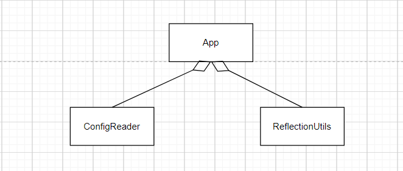
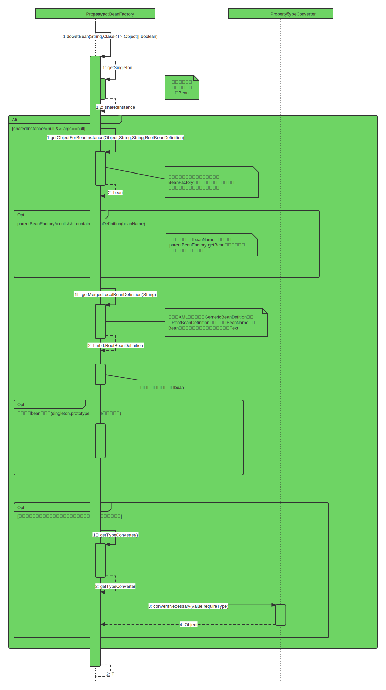
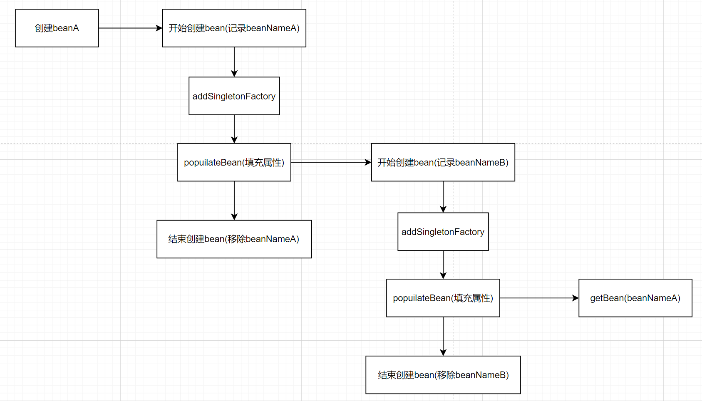

# 抄书规范

<font color="red">字体3px大小(不设置)，默认无颜色，重点内容红色，不加粗</font>

<font color=""></font>


<center><font color="red" size="8px">Spring源码深度解析</font></center>

# 第1章 Spring整体架构和环境搭

​		Spring是于2003年兴起的一个轻量级的Java开源框架由Rod Johnson在其著作《Expert One-On-One J2EE Development and Design》中阐述的部分理念和原型衍生而米。Spring 是为解决企业应用开发的复杂性而创建的，它使用基本的JavaBean来完成以前只可能由EJB完成的事情。然而，Spring 的用途不仅限于服务器端的开发。从简单性、可测试性和松耦合的角度而言，任何Java应用都可以从 Spring中受益。

## 1.1 Spring的整体架构

​		Spring框架是一个分层架构,它包含一系列的功能要素，并被分为大约20个模块，如图1-1所示。


​		这些模块被总结为以下几部分。

(1) Core Container.

​		Core Container(核心容器）包含有Core、Beans、Context 和 Expression Language模块。

​		Core和Beans模块是框架的基础部分，提供 IoC(反转控制）和依赖注入特性。这里的基础概念是BeanFactory.,它提供对Factory模式的经典实现来消除对程序性单例模式的需要，并真正地允许你从程序逻辑中分离出依赖关系和配置。

- Core模块主要包含Spring框架基本的核心工具类，Spring 的其他组件要都要使用到这个包里的类，Core模块是其他组件的基本核心。当然你也可以在自己的应用系统中使用这些工具类。
- Beans模块是所有应用都要用到的，它包含访问配置文件、创建和管理bean以及进行Inversion of Control/ Dependency Injection ( loC/DI)操作相关的所有类。
- Context模块构建于Core和Beans模块基础之上,提供了一种类似于JNDI注册器的框架式的对象访问方法。Context模块继承了Beans的特性，为Spring核心提供了大量扩展，添加了对国际化(例如资源绑定)、事件传播资源加载和对Context 的透明创建的支持。Context模块同时也支持J2EE的一些特性，例如EJB、JMX和基础的远程处理。ApplicationContext接口是 Context模块的关键。
- Expression Language模块提供了一个强大的表达式语言用于在运行时查询和操纵对象。它是JSP 2.1规范中定义的unifed expression language的一个扩展。该语言支持设置/获取属性的值，属性的分配，方法的调用，访问数组上下文( accessiong the contextof arrays)、容器和索引器、逻辑和算术运算符、命名变量以及从.Spring 的 loC容器中根据名称检索对象。它也支持list投影、选择和一般的list 聚合。

( 2 ) Data Access/Integration。
		Data Access/Integration层包含有JDBC、ORM、OXM、JMS 和 Transaction模块，其中:

- JDBC模块提供了一个JDBC抽象层，它可以消除冗长的JDBC编码和解析数据库厂商特有的错误代码。这个模块包含了Spring对JDBC 数据访问进行封装的所有类。
- ORM模块为流行的对象-关系映射API，如JPA、JDO、Hibernate、iBatis等，提供了一个交互层。利用ORM封装包，可以混合使用所有Spring 提供的特性进行O/R映射。如前边提到的简单声明事务管理。

​		Spring框架插入了若干个ORM框架，从而提供了ORM的对象关系工具，其中包括JDO、Hibernate和 iBatisSQL Map。所有这些都遵从Spring的通用事务和DAO异常层次结构

- OXM模块提供了一个对Object/XML映射实现的抽象层Object/XML映射实现包括JAXB、Castor、XMLBeans、JiBX和XStream。
- JMS (Java Messaging Service)模块主要包含了一些制造和消费消息的特性。
- Transaction模块支持编程和声明性的事务管理，这些事务类必须实现特定的接口，并且对所有的POJO都适用。

( 3 ） Web。
		Web上下文模块建立在应用程序上下文模块之上,为基于Web的应用程序提供了上下文。所以，Spring框架支持与Jakarta Struts的集成。Web模块还简化了处理多部分请求以及将请求参数绑定到域对象的工作。Web层包含了Web、Web-Servlet、Web-Struts和 Web-Porlet模块，具体说明如下。

- Web模块:提供了基础的面向Web的集成特性。例如,多文件上传、使用servlet listeners初始化 IoC容器以及一个面向Web的应用上下文。它还包含Spring 远程支持中 Web的相关部分。
- Web-Servlet模块web.servlet.jar:该模块包含Spring 的model-view-controlle( MVC)实现。Spring 的MVC框架使得模型范围内的代码和web forms之间能够清楚地分离开来，并与Spring框架的其他特性集成在一起。
- Web-Struts模块:该模块提供了对Struts的支持，使得类在Spring应用中能够与一个典型的Struts Web 层集成在一起。注意，该支持在Spring 3.0中是deprecated的。
- Web-Porlet模块:提供了用于Portlet环境和 Web-Servlet模块的MVC 的实现。

(4) AOP。
		AOP模块提供了一个符合AOP联盟标准的面向切面编程的实现，它让你可以定义例如方法拦截器和切点，从而将逻辑代码分开，降低它们之间的耦合性。利用 source-level 的元数据功能，还可以将各种行为信息合并到你的代码中，这有点像.Net技术中的 attribute概念。
通过配置管理特性，Spring AOP模块直接将面向切面的编程功能集成到了Spring框架中,所以可以很容易地使Spring框架管理的任何对象支持AOP。Spring AOP模块为基于Spring 的应用程序中的对象提供了事务管理服务。通过使用Spring AOP，不用依赖EJB组件就可以将声明性事务管理集成到应用程序中。

- Aspects模块提供了对AspectJ的集成支持。

​		Instrumentation模块提供了class instrumentation支持和classloader实现,使得可以在特定的应用服务器上使用。
(5)Test
Test模块支持使用JUnit'和 TestNG对Spring 组件进行测试。

## 1.2 环境搭建

​		要构建Spring源码环境首先要安装GitHub以及Gradle。

### 1.2.1 安装GitHub

​		首先读者需要到GitHub官网去下载安装包。

### 1.2.2 安装 Gradle

​		Gradle是一个基于Groovy的构建工具，它使用Groovy来编写构建脚本，支持依赖管理和多项目创建，类似 Maven，但比其更加简单轻便。Gradle为 Ivy 提供了一个 layer，提供了build-by-convention 集成，而且它还让你获得许多类似 Maven的功能。你可以从<a> http:/www.gradle.org/downloads</a>页面下载 Gradle，下载后将文件解压放到指定目录中（笔者放在了C:\Program Files目录下)，然后开始进行环境变量的配置。
(1根据对应目录创建GRADLE_HOME系统变量。

(2)将系统变量加人到path中。

(3)测试

```cmd
gradle -version //安装成功
```

### 1.2.3 下载源码

```sh
git clone git://github.com/SpringSource/Spring-framework.git
```


# 第2章 容器的基本实现

## 2.1 容器基本用法

​		bean是Spring 中最核心的东西，spring就像个大水桶，bean是里面的水，水桶脱离了水便也没什么用处了，那么我们先看看bean 的定义。

```java
public class MyTestBean {
    private string teststr = "teststr";
    public string getTeststr() {
        return testStr;
        public void setTeststr(String teststr){
            this.testStr = teststr;
        }
    }
}
```

​		很普通，bean没有任何特别之处，的确，Spring 的目的就是让我们的bean能成粹的POJO，这也是Spring所追求的。接下来看看配置文件:
```xml
<?xml version=" 1.0" encoding="UTF-8"?>
<beans xmlns="http://www.Springframework.org/schema/beans"
xmlns:xsi="http://www.w3.org/2001/xMLSchema-instance"
xsi:schemaLocation="http://ww.Springframework.org/schema/beans http://www.Springframework.org/schema/beans/Spring-beans.xsd">
	<bean id="myTestBean" class="bean.MyTestBean"/ >
</beans>
```

​		在上面的配置中我们看到了bean的声明方式,尽管Spring 中 bean的元素定义着N种属性来支撑我们业务的各种应用，但是我们只要声明成这样，基本上就已经可以满足我们的大多数应用了。好了，你可能觉得还有什么，但是，真没了，Spring的入门示例到这里已经结束，我们可以写测试代码测试了。

```java
@suppresswarnings("deprecation")
public class BeanFactoryTest {
    @Test
    public void testsimpleLoad() {
        BeanFactory bf = new XmlBeanFactory(new ClassPathResource("beanFactoryTest.xml");
        MyTestBean bean = (MyTestBean) bf.getBean("myTestBean");
        assertEquals("testStr", bean.getTeststr());
    }
}
```

​		相信聪明的读者会很快看到我们期望的结果:在 Eclipse中显示了 Green Baro直接使用BeanFactory作为容器对于Spring的使用来说并不多见,甚至是甚少使用,因为在企业级的应用中大多数都会使用的是ApplicationContext，后续章节我们会介绍它们之间的区别，这里只是用于测试，让读者更快更好地分析Spring 的内部原理。

## 2.2 功能分析

​		现在我们可以来好好分析一下上面测试代码的功能,来探索上面的测试代码中Spring究竟帮助我们完成了什么工作?不管之前你是否使用过Spring,当然，你应该使用过的，毕竟本书面用的是对Spring有一定使用经验的读者，你都应该能猜出来，这段测试代码完成的功能无非就是以下几点

(1）读取配置文件beanFactoryTest.xml。
(2）根据beanFactoryTest.xml中的配置找到对应的类的配置,并实例化。
(3）调用实例化后的实例。
为了更清楚地描述,笔者临时画了设计类图，如图2-1所示,如果想完成我们预想的功能,至少需要3个类。



- ConfigReader: 用于读取及验证配置文件。我们要用配置文件里面的东西，当然首先要做的就是读取，然后放置在内存中。
- ReflectionUtils:用于根据配置文件中的配置进行反射实例化。比如在上例中beanFactoryTest.xml出现的<bean id="myTestBean" class="bean.MyTestBean">，我们就可以根据bean.MyTestBean进行实例化。
- App:用于完成整个逻辑的串联。
  按照最原始的思维方式，整个过程无非如此，但是作为一个风靡世界的优秀源码真的就这么简单吗?


## 2.3 工程搭建

​		不如我们首先大致看看Spring 的源码。在 Spring源码中，用于实现上面功能的是org.Springframework.beans.jar，我们看源码的时候要打开这个
能，那就没有必要引入Spring 的其他更多的包，当然Core 是必须的，还有些依赖包如下。


​		引人依赖的 JAR 消除掉所有编译错误后，终于可以看源码了。或许你已经知道了答案，Spring居然用了N多代码实现了这个看似很简单的功能，那么这些代码都是做什么用的呢?Spring在架构或者编码的时候又是如何考虑的呢?带着疑问我们踏上了研读 Spring源码的征程。

## 2.4 Spring的结构组成

​		我们首先尝试梳理一下Spring 的框架结构，从全局的角度了解一下Spring 的结构组成。

### 2.4.1 beans包的层级结构

​		笔者认为阅读源码的最好方法是通过示例跟着操作一遍，虽然有时候或者说大多数时候会被复杂的代码绕来绕去，绕到最后已经不知道自己身在何处了，但是,如果配以UML还是可以搞定的。笔者就是按照自己的思路进行分析,并配合必要的UML,希望读者同样可以跟得上思路。我们先看看整个beans工程的源码结构，如图2-3所示。
beans包中的各个源码包的功能如下。

- src/main/java 用于展现 Spring 的主要逻辑。
- src/main/resources用于存放系统的配置文件。
- src/test/java用于对主要逻辑进行单元测试。
- src/test/resources用于存放测试用的配置文件。


### 2.4.2 核心类介绍

通过beans工程的结构介绍，我们现在对beans 的工程结构有了初步的认识，但是在正式开始源码分析之前,有必要了解一下Spring 中最核心的两个类。

### 1.DefaultListableBeanFactory

​		XmlBeanFactory继承自DefaultListableBeanFactory，而DefaultListableBeanFactory是整个bean加载的核心部分，是Spring注册及加载bean的默认实现，而对于XmlBeanFactory与DefaultListableBeanFactory 不同的地方其实是在XmlBeanFactory 中使用了自定义的XML 读取器XmlBeanDefinitionReader，实现了个性化的 BeanDefinitionReader读取，DefaultListableBeanFactory继承了AbstractAutowireCapableBeanFactory 并实现ConfigurableListableBeanfactory 以从BeanDefinitionRegistry接口。以下是ConfigurableListableBeanFactory 的层次结构图见图（2-4）以及相关类图（见图2-5 )。

 


​		从上面的类图以及层次结构图中，我们可以很清晰地从全局角度了解DefaultListableBeanFactory的脉络。如果读者没有了解过Spring源码可能对上面的类图不是很理解，不过没关系，

​		通过后续的学习，你会逐渐了解每个类的作用。那么，让我们先简单地了解一下上面类图中的各个类的作用。

- AliasRegistry:定义对alias的简单增删改等操作。
- SimpleAliasRegistry:主要使用map作为alias 的缓存，并对接口AliasRegistry进行实现。
- SingletonBeanRegistry:定义对单例的注册及获取。
- BeanFactory:定义获取bean 及 bean的各种属性。
- DefaultSingletonBeanRegistry:对接口 SingletonBeanRegistry各函数的实现。
- HierarchicalBeanFactory:继承BeanFactory，也就是在BeanFactory定义的功能的基础上增加了对parentFactory 的支持。
- BeanDefinitionRegistry:定义对 BeanDefinition的各种增删改操作。
- FactoryBeanRegistrySupport:在DefaultSingletonBeanRegistry基础上增加了对 FactoryBean的特殊处理功能。
- ConfigurableListableBeanFactory: BeanFactory配置清单，指定忽略类型及接口等
- DefaultListableBeanFactory:综合上面所有功能，主要是对Bean注册后的处理.

​		XmlBeanFactory对 DefaultListableBeanFactory类进行了扩展，主要用于从XML文档中读取BeanDefinition，对于注册及获取 Bean都是使用从父类DefaultListableBeanFactory继承的方法去实现，而唯独与父类不同的个性化实现就是增加了XmlBeanDefinitionReader类型的reader属性。在XmlBeanFactory 中主要使用reader属性对资源文件进行读取和注册。

### 2.XmIBeanDefinitionReader

​		XML配置文件的读取是Spring中重要的功能，因为Spring 的大部分功能都是以配置作为切人点的,那么我们可以从XmlBeanDefinitionReader中梳理一下资源文件读取、解析及注册的大致脉络，首先我们看看各个类的功能。

- ResourceLoader:定义资源加载器，主要应用于根据给定的资源文件地址返回对应的Resource.
- BeanDefinitionReader:主要定义资源文件读取并转换为BeanDefinition的各个功能。
- EnvironmentCapable:定义获取Environment方法。
- DocumentLoader:定义从资源文件加载到转换为Document的功能。
- AbstractBeanDefinitionReader:对 EnvironmentCapable、BeanDefinitionReader类定义的功能进行实现。
- BeanDefinitionDocumentReader:定义读取Docuemnt 并注册BeanDefinition 功能。
- BeanDefinitionParserDelegate:定义解析Element 的各种方法。

​		经过以上分析，我们可以梳理出整个XML 配置文件读取的大致流程，如图2-6所示在	中主要包含以下几步的处理。


(1)通过继承自AbstractBeanDefinitionReader中的方法，来使用ResourLoader将资源文件路径转换为对应的 Resource文件。
(2)通过DocumentLoader对 Resource文件进行转换，将Resource文件转换为Document文件。
(3)通过实现接口BeanDefinitionDocumentReader 的DefaultBeanDefinitionDocumentReader类对Document进行解析，并使用BeanDefinitionParserDelegate对 Element进行解析。

## 2.5容器的基础 XmlBeanFactory

​		好了，到这里我们已经对Spring的容器功能有了一个大致的了解，尽管你可能还很迷糊,但是不要紧，接下来我们会详细探索每个步骤的实现。再次重申一下代码，我们接下来要深入分析以下功能的代码实现:

```java
BeanFactory bf = new XmlBeanFactory(new ClassPathResource ("beanFactoryTest.xml" ));
```

​		通过XmlBeanFactory初始化时序图（如图2-7所示）我们来看一看上面代码的执行逻辑。


​		时序图从 BeanFactoryTest测试类开始,通过时序图我们可以一目了然地看到整个逻辑处理顺序。在测试的 BeanFactoryTest 中首先调用ClassPathResource的构造函数来构造Resource资源文件的实例对象，这样后续的资源处理就可以用Resource提供的各种服务来操作了，当我们有了Resource后就可以进行XmIBeanFactory 的初始化了。那么Resource资源是如何封装的呢?

### 2.5.1配置文件封装

​		Spring 的配置文件读取是通过ClassPathResource 进行封装的，如new ClassPathResource("beanFactoryTest.xml")，那么ClassPathResource完成了什么功能呢?
​		在Java中，将不同来源的资源抽象成URL，通过注册不同的handler ( URLStreamHandler )来处理不同来源的资源的读取逻辑，一般handler 的类型使用不同前缀（协议，Protocol )来识别，如“file:”、“http:”、“jar:”等，然而 URL没有默认定义相对Classpath或ServletContext等资源的handler，虽然可以注册自己的URLStreamHandler来解析特定的URL前缀（协议),比如“classpath:”，然而这需要了解URL的实现机制，而且 URL也没有提供一些基本的方法，如检查当前资源是否存在、检查当前资源是否可读等方法。因而Spring 对其内部使用到的资源实现了自己的抽象结构: Resource接口来封装底层资源。

```java
public interface InputstreamSource {
    Inputstream getInputStream() throws IOException;
}
public interface Resource extends InputstreamSource {
    boolean exists();
    boolean isReadable();
    boolean isopen();
    URL getURL() throws IOException;
    URI getURI() throws IOException;
    File getFile() throws IOException;
    long lastModified() throws IOException;
    Resource createRelative(string relativePath) throws IOException;
    string getFilename();
    string getDescription();
}
```

​		InputStreamSource封装任何能返回InputStream 的类，比如File、Classpath下的资源和Byte Array等。它只有一个方法定义: getInputStream()，该方法返回一个新的InputStream对象。
​		Resource接口抽象了所有Spring 内部使用到的底层资源:File、URL、Classpath等。首先，它定义了3个判断当前资源状态的方法:存在性( exists)、可读性( isReadable)、是否处于打开状态( isOpen)。另外，Resource接口还提供了不同资源到URL、URI、File类型的转换，以及获取lastModified属性、文件名(不带路径信息的文件名，getFilename())的方法。为了便于操作，Resource还提供了基于当前资源创建一个相对资源的方法:createRelative()。在错误处理中需要详细地打印出错的资源文件，因而 Resource还提供了getDescription()方法用于在错误处理中的打印信息。

​		对不同来源的资源文件都有相应的Resource实现:文件(FileSystemResource )、Classpath资源( ClassPathResource )、URL资源(UrlResource )、InputStream资源(InputStreamResource)、Byte数组( ByteArrayResource )等。相关类图如2-8所示。


在日常的开发工作中，资源文件的加载也是经常用到的，可以直接使用Spring提供的类，比如在希望加载文件时可以使用以下代码:

```java
Resource resource=new ClassPathResource ( "beanFactoryTest.xml");
InputStream inputstream=resource.getInputstream();
```

得到inputStream后,我们就可以按照以前的开发方式进行实现了。并且我们已经可以利用Resource及其子类为我们提供好的诸多特性。有了Resource接口便可以对所有资源文件进行统一处理。至于实现其实是非常简单的，以getInputStream为例, ClassPathResource中的实现方式便是通过class或者classLoader提供的底层方法进行调用，而对于FileSystemResource 的实现其实更简单，直接使用FileInputStream对文件进行实例化。

ClassPathResouce.java

```java
@Override
public InputStream getInputStream() throws IOException {
   InputStream is;
   if (this.clazz != null) {
      is = this.clazz.getResourceAsStream(this.path);
   }
   else if (this.classLoader != null) {
      is = this.classLoader.getResourceAsStream(this.path);
   }
   else {
      is = ClassLoader.getSystemResourceAsStream(this.path);
   }
   if (is == null) {
      throw new FileNotFoundException(getDescription() + " cannot be opened because it does not exist");
   }
   return is;
}
```

FileSystemResource.java

```java
@Override
public InputStream getInputStream() throws IOException {
   try {
      return Files.newInputStream(this.filePath);
   }
   catch (NoSuchFileException ex) {
      throw new FileNotFoundException(ex.getMessage());
   }
}
```

​		当通过Resource相关类完成了对配置文件进行封装后配置文件的读取工作就全权交给XmlBeanDefinitionReader来处理了。
​		了解了Spring 中将配置文件封装为Resource类型的实例方法后，我们就可以继续探寻XmlBeanFactory的初始化过程了，XmlBeanFactory的初始化有若干办法，Spring 中提供了很多的构造函数，在这里分析的是使用Resource实例作为构造函数参数的办法，代码如下:

@Deprecated

XmlBeanFactory.java

```java
public class XmlBeanFactory extends DefaultListableBeanFactory {
   private final XmlBeanDefinitionReader reader = new XmlBeanDefinitionReader(this);
   /**
    * Create a new XmlBeanFactory with the given resource,
    * which must be parsable using DOM.
    * @param resource the XML resource to load bean definitions from
    * @throws BeansException in case of loading or parsing errors
    */
   public XmlBeanFactory(Resource resource) throws BeansException {
      this(resource, null);//调用底下的构造方法
   }
   /**
    * Create a new XmlBeanFactory with the given input stream,
    * which must be parsable using DOM.
    * @param resource the XML resource to load bean definitions from
    * @param parentBeanFactory parent bean factory
    * @throws BeansException in case of loading or parsing errors
    */
   public XmlBeanFactory(Resource resource, BeanFactory parentBeanFactory) throws BeansException {
      super(parentBeanFactory);
      this.reader.loadBeanDefinitions(resource);
   }
}
```

​		上面函数中的代码 this.reader.loadBeanDefinitions(resource)才是资源加载的真正实现，也是我们分析的重点之一。我们可以看到时序图中提到的XmlBeanDefinitionReader加载数据就是在这里完成的,但是在XmlBeanDefinitionReader加载数据前还有一个调用父类构造函数初始化的过程: super(parentBeanFactory)，跟踪代码到父类AbstractAutowireCapableBeanFactory 的构造函数中:

AbstractAutowireCapableBeanFactory.java

```java
/**
 * Create a new AbstractAutowireCapableBeanFactory.
 */
public AbstractAutowireCapableBeanFactory() {
   super();
   ignoreDependencyInterface(BeanNameAware.class);
   ignoreDependencyInterface(BeanFactoryAware.class);
   ignoreDependencyInterface(BeanClassLoaderAware.class);
}
```

​		这里有必要提及一下ignoreDependencyInterface方法。ignoreDependencyInterface的主要功能是忽略给定接口的自动装配功能，那么，这样做的目的是什么呢?会产生什么样的效果呢?

​		举例来说:当A中有属性B，那么当Spring在获取A的 Bean 的时候如果其属性B还没有初始化,那么Spring 会自动初始化B，这也是Spring中提供的一个重要特性。但是，某些情况下，B不会被初始化，其中的一种情况就是B实现了BeanNameAware接口，spring中是这样介绍的:自动装配时忽略给定的依赖接口，典型应用是通过其他方式解析Application 上下文注册依赖，类似于 BeanFactory 通过 BeanFactoryAware进行注入或者ApplicationContext通过ApplicationContextAware进行注入。

### 2.5.2加载Bean

​		之前提到的在XmlBeanFactory构造函数中调用了XmIBeanDefinitionReader类型的reader属性提供的方法 this.reader.loadBeanDefinitions(resource)，而这句代码则是整个资源加载的切人点,我们先来看看这个方法的时序图，如图2-9所示。


​		看到图2-9我们才知道什么叫山路十八弯，绕了这么半天还没有真正地切人正题，比如加载XML文档和解析注册 Bean，一直还在做准备工作。我们根据上面的时序图来分析一下这里究竟在准备什么?从上面的时序图中我们尝试梳理整个的处理过程如下。
（1）封装资源文件。当进入XmlBeanDefinitionReader后，首先对参数Resource使用EncodedResource类进行封装。
（2）获取输入流。从 Resource中获取对应的 InputStream并构造 InputSource。
（3）通过构造的 InputSource实例和 Resource实例继续调用函数doLoadBeanDefinitionso我们来看一下loadBeanDefinitions函数具体的实现过程:

```java
public int loadBeanDefinitions(Resource resource) throws BeanDefinitionStoreException (
	return loadBeanDefinitions(new EncodedResource (resource)) ;
}
```

​		那么EncodedResource的作用是什么呢?通过名称，我们可以大致推断这个类主要是用于对资源文件的编码进行处理的。其中的主要逻辑体现在getReader()方法中，当设置了编码属性的时候Spring会使用相应的编码作为输入流的编码。
```java
public Reader getReader() throws IOException {
    if (this.charset != null) {
        return new InputStreamReader(this.resource.getInputStream(), this.charset);
    }
    else if (this.encoding != null) {
        return new InputStreamReader(this.resource.getInputStream(), this.encoding);
    }
    else {
        return new InputStreamReader(this.resource.getInputStream());
    }
}
```

​		上面代码构造了一个有编码encoding的InputStreamReader。当构造好encodedResource对象后，再次转入了可复用方法 loadBeanDefinitions(new EncodedResource(resource))。
​		这个方法内部才是真正的数据准备阶段，也就是时序图所描述的逻辑:

```java
/**
 * Load bean definitions from the specified XML file.
 * @param encodedResource the resource descriptor for the XML file,
 * allowing to specify an encoding to use for parsing the file
 * @return the number of bean definitions found
 * @throws BeanDefinitionStoreException in case of loading or parsing errors
 */
public int loadBeanDefinitions(EncodedResource encodedResource) throws BeanDefinitionStoreException {
    Assert.notNull(encodedResource, "EncodedResource must not be null");
    if (logger.isTraceEnabled()) {
        logger.trace("Loading XML bean definitions from " + encodedResource);
    }
    Set<EncodedResource> currentResources = this.resourcesCurrentlyBeingLoaded.get();
    //通过属性记录已经加载过的资源
    if (!currentResources.add(encodedResource)) {
        throw new BeanDefinitionStoreException(
            "Detected cyclic loading of " + encodedResource + " - check your import definitions!");
    }//解析import的时候应该会对引用的文件进行加载
    //从encodedResource中获取已经封装的Resource对象并再次从Resource中获取其中的inpPutStream
    try (InputStream inputStream = encodedResource.getResource().getInputStream()) {
        //InputSource这个类并不来自于Spring，它的全路径是org.xml.sax.InputSource
        InputSource inputSource = new InputSource(inputStream);
        if (encodedResource.getEncoding() != null) {
            inputSource.setEncoding(encodedResource.getEncoding());
        }
        //真正进入了逻辑核心部分
        return doLoadBeanDefinitions(inputSource, encodedResource.getResource());
    }
    catch (IOException ex) {
        throw new BeanDefinitionStoreException(
            "IOException parsing XML document from " + encodedResource.getResource(), ex);
    }
    finally {
        currentResources.remove(encodedResource);
        if (currentResources.isEmpty()) {
            this.resourcesCurrentlyBeingLoaded.remove();
        }
    }
}
```

​		我们再次整理一下数据准备阶段的逻辑，首先对传入的resource参数做封装，目的是考虑到Resource可能存在编码要求的情况,其次,通过SAX读取XML文件的方式来准备InputSource对象,最后将准备的数据通过参数传人真正的核心处理部分doLoadBeanDefinitions(inputSourceencodedResource.getResource())。

```java
/**
 * Actually load bean definitions from the specified XML file.
 * @param inputSource the SAX InputSource to read from
 * @param resource the resource descriptor for the XML file
 * @return the number of bean definitions found
 * @throws BeanDefinitionStoreException in case of loading or parsing errors
 * @see #doLoadDocument
 * @see #registerBeanDefinitions
 */
protected int doLoadBeanDefinitions(InputSource inputSource, Resource resource)
      throws BeanDefinitionStoreException {

   try {
      Document doc = doLoadDocument(inputSource, resource); //2 加载XML获取doc
      int count = registerBeanDefinitions(doc, resource);//3 根据doc 注册bean
      if (logger.isDebugEnabled()) {
         logger.debug("Loaded " + count + " bean definitions from " + resource);
      }
      return count;
   }
   catch ...
}
protected Document doLoadDocument(InputSource inputSource, Resource resource) throws Exception {// 1 获取xml验证模式
    return this.documentLoader.loadDocument(inputSource, 
                                            getEntityResolver(), 
                                            this.errorHandler,
                                            getValidationModeForResource(resource), 
                                            isNamespaceAware());
}
protected int getValidationModeForResource(Resource resource) {
    int validationModeToUse = getValidationMode();
    if (validationModeToUse != VALIDATION_AUTO) {
        return validationModeToUse;
    }
    int detectedMode = detectValidationMode(resource);
    if (detectedMode != VALIDATION_AUTO) {
        return detectedMode;
    }
    // Hmm, we didn't get a clear indication... Let's assume XSD,
    // since apparently no DTD declaration has been found up until
    // detection stopped (before finding the document's root tag).
    return VALIDATION_XSD;
}
```

在上面冗长的代码中假如不考虑异常类的代码，其实只做了三件事,这三件事的每一件都必不可少。
(1)获取对XML文件的验证模式。

(2)加载XML文件，并得到对应的Document。

(3)根据返回的Document注册 Bean信息。
这3个步骤支撑着整个Spring 容器部分的实现基础，尤其是第3步对配置文件的解析,逻辑非常的复杂,那么我们先从获取XML文件的验证模式开始讲起。

## 2.6获取XML的验证模式

了解XML文件的读者都应该知道XML文件的验证模式保证了XML文件的正确性,而比较常用的验证模式有两种:DTD和XSD。它们之间什么区别呢?

### 2.6.1 DTD与XSD区别

​		DTD (Document Type Definition)即文档类型定义，是一种 XML约束模式语言，是XML文件的验证机制，属于XML文件组成的一部分。DTD是一种保证XML文档格式正确的有效方法，可以通过比较XML文档和DTD文件来看文档是否符合规范，元素和标签使用是否正确。一个 DTD文档包含:元素的定义规则，元素间关系的定义规则，元素可使用的属性，可使用的实体或符号规则。
要使用DTD验证模式的时候需要在XML文件的头部声明，以下是在Spring 中使用DTD声明方式的代码:

spring-beans.dtd

```xml
<!ELEMENT beans (
	description?,
	(import | alias | bean)*
)>

<!--
	Default values for all bean definitions. Can be overridden at
	the "bean" level. See those attribute definitions for details.
-->
<!ATTLIST beans default-lazy-init (true | false) "false">
<!ATTLIST beans default-merge (true | false) "false">
<!ATTLIST beans default-autowire (no | byName | byType | constructor | autodetect) "no">
<!ATTLIST beans default-init-method CDATA #IMPLIED>
<!ATTLIST beans default-destroy-method CDATA #IMPLIED>

<!--
	Element containing informative text describing the purpose of the enclosing
	element. Always optional.
	Used primarily for user documentation of XML bean definition documents.
-->
<!ELEMENT description (#PCDATA)>
```

​		XML Schema语言就是XSD ( XML Schemas Definition )。XML Schema描述了XML文档的结构。可以用一个指定的XML Schema来验证某个XML文档，以检查该XML文档是否符合其要求。文档设计者可以通过XML Schema指定一个XML文档所允许的结构和内容，并可据此检查一个XML文档是否是有效的。XML Schema本身是一个XML文档，它符合XML语法结构。可以用通用的XML解析器解析它。
​		在使用XML Schema文档对 XML实例文档进行检验，除了要声明名称空间外( xmIns=http://www.Springframework.org/schema/beans )，还必须指定该名称空间所对应的XML Schema文档的存储位置。通过schemaLocation属性来指定名称空间所对应的XML Schema文档的存储位置，它包含两个部分，一部分是名称空间的URI，另一部分就是该名称空间所标识的 XML Schema文件位置或URL地址( xsi:schemaLocation="http://www.Springframework.org/schema/beans http://www.Springframework.org/schema/beans/Spring-beans.xsd )。

```xml
<?xml version="1.0"encoding="UTF-8"?>
<beans xmlns="http:/ /www.Springframework.org/schema/beans"
	xmlns:xsi="http: //www .w3.org/2001/XMLSchema-instance"
	xsi:schemaLocation="http://www.springframework.org/schema/beans http://www.springframework.org/schema/beans/Spring-beans.xsd">
</beans>
```

Spring-beans-3.0.xsd 

```xml
<?xml version="1.0" encoding="UTF-8" standalone="no"?>
<xsd:schema xmlns="http://www.springframework.org/schema/beans"
		xmlns:xsd="http://www.w3.org/2001/XMLSchema"
		targetNamespace="http://www.springframework.org/schema/beans">
	<xsd:import namespace="http://www.w3.org/XML/1998/namespace"/>
	<xsd:annotation>
		<xsd:documentation>
        </xsd:documentation>
    </xsd:annotation>
	...
    ...
	<!-- simple internal types -->
	<xsd:simpleType name="defaultable-boolean">
		<xsd:restriction base="xsd:NMTOKEN">
			<xsd:enumeration value="default"/>
			<xsd:enumeration value="true"/>
			<xsd:enumeration value="false"/>
		</xsd:restriction>
	</xsd:simpleType>

</xsd:schema>

```

​		我们只是简单地介绍一下XML文件的验证模式的相关知识，目的在于让读者对后续知识的理解能有连续性，如果对XML有兴趣的读者可以进一步查阅相关资料。

### 2.6.2 验证模式的读取

​		了解了DTD与XSD的区别后我们再去分析Spring 中对于验证模式的提取就更容易理解了。通过之前的分析我们锁定了Spring通过getValidationModeForResource方法来获取对应资源的的验证模式。

XmlDefinitionReader.java

```java
/**
 * Determine the validation mode for the specified {@link Resource}.
 * If no explicit validation mode has been configured, then the validation
 * mode gets {@link #detectValidationMode detected} from the given resource.
 * <p>Override this method if you would like full control over the validation// 可以自定义
 * mode, even when something other than {@link #VALIDATION_AUTO} was set.
 * @see #detectValidationMode
 */
protected int getvalidationModeForResource(Resource resource){
	int validationModeToUse = getValidationMode ();
	//如果手动指定了验证模式则使用指定的验证模式
    if (validationModeToUse != VALIDATION_AUTO){
        return validationModeToUse;
    }
	//如果未指定则使用自动检测
    int detectedMode = detectvalidationMode(resource);// 会调用XmlValidationModeDetector的detectvalidationMode方法
    if(detectedMode != VALIDATION_A0TO) {
        return detectedMode;
    }
    return VALIDATION_XSD;
}
```

​		方法的实现其实还是很简单的，无非是如果设定了验证模式则使用设定的验证模式(可以通过对调用XmlBeanDefinitionReader 中的setValidationMode方法进行设定)，否则使用自动检测的方式。而自动检测验证模式的功能是在函数detectValidationMode方法中实现的，在detectValidationMode函数中又将自动检测验证模式的工作委托给了专门处理类XmlValidationModeDetector，调用了XmlValidationModeDetector的 detectValidationMode方法，具体代码如下:

```java
public int detectValidationMode(InputStream inputStream) throws IOException {
    // Peek into the file to look for DOCTYPE.
    BufferedReader reader = new BufferedReader(new InputStreamReader(inputStream));
    try {
        boolean isDtdValidated = false;
        String content;
        while ((content = reader.readLine()) != null) {
            content = consumeCommentTokens(content);
            if (this.inComment || !StringUtils.hasText(content)) {
                continue;
            }
            if (hasDoctype(content)) {// 调用底下的方法
                isDtdValidated = true;
                break;
            }
            if (hasOpeningTag(content)) {
                // End of meaningful data...
                break;
            }
        }
        return (isDtdValidated ? VALIDATION_DTD : VALIDATION_XSD);
    }
    catch (CharConversionException ex) {
        // Choked on some character encoding...
        // Leave the decision up to the caller.
        return VALIDATION_AUTO;
    }
    finally {
        reader.close();
    }
}

/**
 * Does the content contain the DTD DOCTYPE declaration?
 */
private boolean hasDoctype(String content) {
    return content.contains(DOCTYPE);
}
```

​		只要我们理解了XSD与 DTD的使用方法，理解上面的代码应该不会太难，Spring用来检测验证模式的办法就是判断是否包含DOCTYPE，如果包含就是DTD，否则就是XSD。

## 2.7 获取Document

​		经过了验证模式准备的步骤就可以进行Document加载了，同样XmlBeanFactoryReader类对于文档读取并没有亲力亲为,而是委托给了DocumentLoader去执行,这里的DocumentLoader是个接口，而真正调用的是DefaultDocumentLoader，解析代码如下:

DefaultDocumentLoader.java

```java
@Override
public Document loadDocument(InputSource inputSource, 
                             EntityResolver entityResolver,
                             ErrorHandler errorHandler, 
                             int validationMode, 
                             boolean namespaceAware) throws Exception {
   DocumentBuilderFactory factory = createDocumentBuilderFactory(validationMode, namespaceAware);
   if (logger.isTraceEnabled()) {
      logger.trace("Using JAXP provider [" + factory.getClass().getName() + "]");
   }
   DocumentBuilder builder = createDocumentBuilder(factory, entityResolver, errorHandler);
   return builder.parse(inputSource);
}
```

​		对于这部分代码其实并没有太多可以描述的,因为通过SAX解析XML文档的套路大致都差不多，Spring在这里并没有什么特殊的地方，同样首先创建DocumentBuilderFactory，再通过DocumentBuilderFactory创建 DocumentBuilder，进而解析inputSource来返回Document对象。对此感兴趣的读者可以在网上获取更多的资料。这里有必要提及一下 EntityResolver，对于参数entityResolver，传入的是通过getEntityResolver()函数获取的返回值，如下代码:

XmlBeanDefinitionReader.java

```java
protected Document doLoadDocument(InputSource inputSource, Resource resource) throws Exception {
   return this.documentLoader.loadDocument(inputSource, 
                                           getEntityResolver(), 
                                           this.errorHandler,
                                           getValidationModeForResource(resource), 
                                           isNamespaceAware());
}
/**
 * Return the EntityResolver to use, building a default resolver
 * if none specified.
 */
protected EntityResolver getEntityResolver() {
    if (this.entityResolver == null) {
        // Determine default EntityResolver to use.
        ResourceLoader resourceLoader = getResourceLoader();
        if (resourceLoader != null) {
            this.entityResolver = new ResourceEntityResolver(resourceLoader);
        }
        else {
            this.entityResolver = new DelegatingEntityResolver(getBeanClassLoader());
        }
    }
    return this.entityResolver;
}
```

那么，EntityResolver 到底是做什么用的呢?

### 2.7.1 EntityResolver 用法

​		在loadDocument方法中涉及一个参数EntityResolver,何为EntityResolver?官网这样解释:如果SAX应用程序需要实现自定义处理外部实体，则必须实现此接口并使用setEntityResolver方法向SAX驱动器注册一个实例。也就是说，对于解析一个XML，SAX首先读取该XML文档上的声明，根据声明去寻找相应的DTD定义，以便对文档进行一个验证。默认的寻找规则,即通过网络（实现上就是声明的 DTD 的URI地址）来下载相应的 DTD声明，并进行认证。下载的过程是一个漫长的过程,而且当网络中断或不可用时,这里会报错,就是因为相应的DTD声明没有被找到的原因。
​		EntityResolver 的作用是项目本身就可以提供一个如何寻找DTD声明的方法，即由程序来实现寻找DTD声明的过程，比如我们将DTD文件放到项目中某处，在实现时直接将此文档读取并返回给SAX即可。这样就避免了通过网络来寻找相应的声明。
首先看entityResolver的接口方法声明:

```java
Inputsource resolveEntity (string publicId，string systemId)
```

这里，它接收两个参数publicld和 systemld，并返回一个inputSource对象。这里我们以特定配置文件来进行讲解。
(1）如果我们在解析验证模式为XSD的配置文件，代码如下:

```xml
<?xml version="1.0" encoding="UTF-8"?>
<beans xmlns="http://www.Springframework.org/schema/beans"
	xmlns:xsi="http://www.w3.org/2001/XMLSchema-instance"
	xsi:schemaLocation="http://www.springframework.org/schema/beans http://vww.Springframework.org/schema/beans/Spring-		beans.xsd">
</beans>
```

读取到以下两个参数。

- publicld: null
- systemld: http://www.Springframework.org/schema/beans/Spring-beans.xsd

(2）如果我们在解析验证模式为DTD的配置文件，代码如下:

```xml
<?xml version="1.0"encoding=UTF一8"?>
<! DOCTYPE beans PUBLIC "-//Spring//DTD BEAN 2.0//ENM"http://ww .Springframework.org/dtd/spring-beans-2.0.dtd">
<beans>
</beans>

```

读取到以下两个参数。

- publicld:-l/Spring//DTD BEAN 2.0//EN
- systemld: http://www.Springframework.org/dtd/Spring-beans-2.0.dtd

​		之前已经提到过，验证文件默认的加载方式是通过URL进行网络下载获取，这样会造成延迟，用户体验也不好，一般的做法都是将验证文件放置在自己的工程里，那么怎么做才能将这个URL转换为自己工程里对应的地址文件呢?我们以加载DTD文件为例来看看Spring 中是如何实现的。根据之前Spring 中通过getEntityResolver()方法对EntityResolver 的获取，我们知道，Spring 中使用DelegatingEntityResolver类为EntityResolver的实现类，resolveEntity实现方法如下:

DelegatingEntityResolver.java

```java
@Override
@Nullable
public InputSource resolveEntity(@Nullable String publicId, @Nullable String systemId)
      throws SAXException, IOException {
   if (systemId != null) {
      if (systemId.endsWith(DTD_SUFFIX)) {
         return this.dtdResolver.resolveEntity(publicId, systemId);
      }
      else if (systemId.endsWith(XSD_SUFFIX)) {
         return this.schemaResolver.resolveEntity(publicId, systemId);
      }
   }
   // Fall back to the parser's default behavior.
   return null;
}
```

​		我们可以看到，对不同的验证模式，Spring使用了不同的解析器解析。这里简单描述一下原理,比如加载DTD类型的BeansDtdResolver的resolveEntity是直接截取systemld最后的xx.dtd然后去当前路径下寻找，而加载XSD类型的PluggableSchemaResolver类的resolveEntity是默认到META-INF/Spring.schemas文件中找到systemid所对应的XSD文件并加载。

BeansDtdResolver.java

```java
private static final String DTD_EXTENSION = ".dtd";
private static final String DTD_NAME = "spring-beans";

@Override
@Nullable
public InputSource resolveEntity(@Nullable String publicId, @Nullable String systemId) throws IOException {
    if (logger.isTraceEnabled()) {
        logger.trace("Trying to resolve XML entity with public ID [" + publicId +
                     "] and system ID [" + systemId + "]");
    }
    if (systemId != null && systemId.endsWith(DTD_EXTENSION)) {
        int lastPathSeparator = systemId.lastIndexOf('/');
        int dtdNameStart = systemId.indexOf(DTD_NAME, lastPathSeparator);
        if (dtdNameStart != -1) {
            String dtdFile = DTD_NAME + DTD_EXTENSION;// spring-beans.dtd
            if (logger.isTraceEnabled()) {
                logger.trace("Trying to locate [" + dtdFile + "] in Spring jar on classpath");
            }
            try {
                Resource resource = new ClassPathResource(dtdFile, getClass());
                InputSource source = new InputSource(resource.getInputStream());
                source.setPublicId(publicId);
                source.setSystemId(systemId);
                if (logger.isTraceEnabled()) {
                    logger.trace("Found beans DTD [" + systemId + "] in classpath: " + dtdFile);
                }
                return source;
            }
            catch (FileNotFoundException ex) {
                if (logger.isDebugEnabled()) {
                    logger.debug("Could not resolve beans DTD [" + systemId + "]: not found in classpath", ex);
                }
            }
        }
    }
    // Fall back to the parser's default behavior.
    return null;
}
```

## 2.8解析及注册BeanDefinitions

​		当把文件转换为Document后，接下来的提取及注册bean就是我们的重头戏。继续上面的分析，当程序已经拥有XML文档文件的 Document实例对象时，就会被引入下面这个方法。

XmlBeanDefinitionReader.java

```java
public int registerBeanDefinitions(Document doc, Resource resource) throws BeanDefinitionStoreException {
    //使用DefaultBeanDefinitionDocumentReader实例化BeanDefinitionDocumentReader
    BeanDefinitionDocumentReader documentReader = createBeanDefinitionDocumentReader();
    //在实例化BeanDefinitionReader时候会将BeanDefinitionRegistry传入，默认使用继承自DefaultListableBeanFactory的子类
	//记录统计前BeanDefinition的加载个数
    int countBefore = getRegistry().getBeanDefinitionCount();
    //加载及注册bean
    documentReader.registerBeanDefinitions(doc, createReaderContext(resource));
    //记录本次加载的BeanDefinition的个数
    return getRegistry().getBeanDefinitionCount() - countBefore;
}
```

​		其中的参数 doc是通过上一节 loadDocument 加载转换出来的。在这个方法中很好地应用了面向对象中单一职责的原则，将逻辑处理委托给单一的类进行处理，而这个逻辑处理类就是BeanDefinitionDocumentReader。BeanDefinitionDocumentReader是一个接口，而实例化的工作是在createBeanDefinitionDocumentReader()中完成的，而通过此方法，BeanDefinitionDocumentReader真正的类型其实已经是DefaultBeanDefinitionDocumentReader了，进入DefaultBeanDefinitionDocumentReader后，发现这个方法的重要目的之一就是提取root，以便于再次将root作为参数继续BeanDefinition的注册。

DefaultBeanDefinitionDocumentReader.java

```java
@Override
public void registerBeanDefinitions(Document doc, XmlReaderContext readerContext) {
   this.readerContext = readerContext;
   doRegisterBeanDefinitions(doc.getDocumentElement());//root=doc.getDocumentElement()， 并且root应该指的是<beans>标签
}
```

​		经过艰难险阻，磕磕绊绊，我们终于到了核心逻辑的底部doRegisterBeanDefinitions(root)至少我们在这个方法中看到了希望。
如果说以前一直是XML加载解析的准备阶段,那么doRegisterBeanDefinitions算是真正地开始进行解析了，我们期待的核心部分真正开始了。

DefaultBeanDefinitionDocumentReader.java

```java
/**
 * Register each bean definition within the given root {@code <beans/>} element.
 */
@SuppressWarnings("deprecation")  // for Environment.acceptsProfiles(String...)
protected void doRegisterBeanDefinitions(Element root) {
   // Any nested <beans> elements will cause recursion in this method. In
   // order to propagate and preserve <beans> default-* attributes correctly,
   // keep track of the current (parent) delegate, which may be null. Create
   // the new (child) delegate with a reference to the parent for fallback purposes,
   // then ultimately reset this.delegate back to its original (parent) reference.
   // this behavior emulates a stack of delegates without actually necessitating one.
   BeanDefinitionParserDelegate parent = this.delegate;//后面this.delegate=parent恢复过来
    //专门处理解析
   this.delegate = createDelegate(getReaderContext(), root, parent);

   if (this.delegate.isDefaultNamespace(root)) {
      String profileSpec = root.getAttribute(PROFILE_ATTRIBUTE);//PROFILE_ATTRIBUTE = "profile"
      if (StringUtils.hasText(profileSpec)) {
         String[] specifiedProfiles = StringUtils.tokenizeToStringArray(
               profileSpec, BeanDefinitionParserDelegate.MULTI_VALUE_ATTRIBUTE_DELIMITERS);
         // We cannot use Profiles.of(...) since profile expressions are not supported
         // in XML config. See SPR-12458 for details.
         if (!getReaderContext().getEnvironment().acceptsProfiles(specifiedProfiles)) {
            if (logger.isDebugEnabled()) {
               logger.debug("Skipped XML bean definition file due to specified profiles [" + profileSpec +
                     "] not matching: " + getReaderContext().getResource());
            }
            return;
         }
      }
   }
    //解析前置处理，交给子类实现  模板方法，可以进行自定义
   preProcessXml(root);
   parseBeanDefinitions(root, this.delegate);// 核心部分，解析注册beanDefinition,然后又分为默认标签和自定义标签
    //解析后置处理，交给子类实现  模板方法，可以进行自定义
   postProcessXml(root);
   this.delegate = parent;
}
```

​		通过上面的代码我们看到了处理流程，首先是对profile的处理，然后开始进行解析，可是当我们跟进 preProcessXml(root)或者postProcessXml(root)发现代码是空的，既然是空的写着还要有什么用呢?就像面向对象设计方法学中常说的一句话，一个类要么是面向继承的设计的，要么就用final修饰。在 DefaultBeanDefinitionDocumentReader 中并没有用final修饰，所以它是面向继承而设计的。这两个方法正是为子类而设计的，如果读者有了解过设计模式，可以很快速地反映出这是模版方法模式，如果继承自DefaultBeanDefinitionDocumentReader 的子类需要在 Bean解析前后做一些处理的话，那么只需要重写这两个方法就可以了。

### 2.8.1 profile属性的使用(区分各种环境)

​		我们注意到在注册Bean的最开始是对PROFILE_ATTRIBUTE属性的解析，可能对于我们来说,profile属性并不是很常用。让我们先了解一下这个属性。
分析profile前我们先了解下profile 的用法，官方示例代码片段如下:

```xml
<beans xmlns="http://www.Springframework.org/schema/beans"
	xmlns :xsi="http://www.w3.org/2001/XMLSchema-instance" xmlns:jdbc="http://www.Springframework.org/schema/jdbc"
	xmlns:jee="http://www.Springframework.org/schema/jee" xsi:schemaLocation="...">
    <beans profile="dev" >
    </beans>
    <beans profile="production">
    </beans>
</beans>
```

集成到Web环境中时,在 web.xml中加入以下代码:
```xml
<context-param>
	<param-name>Spring.profiles.active</param-name>
    <param-value>dev</param-value>
</context-param>
```

​		有了这个特性我们就可以同时在配置文件中部署两套配置来适用于生产环境和开发环境,这样可以方便的进行切换开发、部署环境,最常用的就是更换不同的数据库。
​		了解了profile的使用再来分析代码会清晰得多，首先程序会获取 beans节点是否定义了profile属性，如果定义了则会需要到环境变量中去寻找，所以这里首先断言environment 不可能为空，因为 profile是可以同时指定多个的，需要程序对其拆分，并解析每个profile是都符合环境变量中所定义的,不定义则不会浪费性能去解析。

### 2.8.2解析并注册BeanDefinition

​		处理了 profile后就可以进行XML的读取了，跟踪代码进入 parseBeanDefinitions(root,this.delegate)。

DefaultBeanDefinitionDocumentReader.java

```java
/**
 * Parse the elements at the root level in the document:
 * "import", "alias", "bean".
 * @param root the DOM root element of the document
 */
protected void parseBeanDefinitions(Element root, BeanDefinitionParserDelegate delegate) {
   if (delegate.isDefaultNamespace(root)) {//tag1
      NodeList nl = root.getChildNodes();//处理root的子节点  (root不需要处理吗)
      for (int i = 0; i < nl.getLength(); i++) {
         Node node = nl.item(i);
         if (node instanceof Element) {
            Element ele = (Element) node;
            if (delegate.isDefaultNamespace(ele)) {//tag2 //默认标签比如bean import等，是处于默认的命名空间defaultNameSpace
               parseDefaultElement(ele, delegate);//解析注册默认标签
            }
            else {
               delegate.parseCustomElement(ele);//解析注册自定义标签
            }
         }
      }
   }
   else {
      delegate.parseCustomElement(root);
   }
}
// Element是父接口，root为根的，每个节点有具体Element子类的类型，构成一个树，属于组合模式。
// tag1 tag2两次都进行判断 是因为父标签是默认类型，子元素可以是自定义的

private void parseDefaultElement(Element ele, BeanDefinitionParserDelegate delegate) {
   /**
    * import
    */
   if (delegate.nodeNameEquals(ele, IMPORT_ELEMENT)) {
      importBeanDefinitionResource(ele);
   }
   /**
    * alias
    */
   else if (delegate.nodeNameEquals(ele, ALIAS_ELEMENT)) {
      processAliasRegistration(ele);
   }
   /**
    * bean
    */
   else if (delegate.nodeNameEquals(ele, BEAN_ELEMENT)) {
      processBeanDefinition(ele, delegate);
   }
   /**
    * nested<beans>
    */
   else if (delegate.nodeNameEquals(ele, NESTED_BEANS_ELEMENT)) {
      // recurse，  如果<beans>xx   <beans>yy</beans>  </beans>,beans内部还有beans, 就可以将内部视为root 递归的解析
      doRegisterBeanDefinitions(ele);
   }
}
```

​		上面的代码看起来逻辑还是蛮清晰的，因为在Spring 的 XML 配置里面有两大类Bean声明，一个是默认的，如:

```xml
<bean id="test" class="test.TestBean"/>
```

​		另一类就是自定义的，如:

```xml
<tx:annotation-driven/>
```

​		而两种方式的读取及解析差别是非常大的，如果采用Spring默认的配置，Spring当然知道该怎么做，但是如果是自定义的，那么就需要用户实现一些接口及配置了。对于根节点或者子节点如果是默认命名空间的话则采用parseDefaultElement方法进行解析，否则使用delegate.parseCustomElement方法对自定义命名空间进行解析。而判断是否默认命名空间还是自定义命名空间的办法其实是使用node.getNamespaceURI()获取命名空间,并与Spring 中固定的命名空间http://www.Springframework.org/schema/beans进行比对。如果一致则认为是默认，否则就认为是自定义。而对于默认标签解析与自定义标签解析我们将会在下一章中进行讨论。


# 第3章 默认标签的解析

​		之前提到过Spring中的标签包括默认标签和自定义标签两种,而两种标签的用法以及解析方式存在着很大的不同，本章节重点带领读者详细分析默认标签的解析过程。
​		默认标签的解析是在parseDefaultElement 函数中进行的，函数中的功能逻辑一目了然,分别对4种不同标签（import、alias、bean和 beans）做了不同的处理。

DefaultBeanDefinitionDocumentReader.java

```java
private void parseDefaultElement(Element ele, BeanDefinitionParserDelegate delegate) {
    /**
	 * import标签的处理
	 */
    if (delegate.nodeNameEquals(ele, IMPORT_ELEMENT)) {
        importBeanDefinitionResource(ele);
    }
    /**
	 * alias标签的处理
	 */
    else if (delegate.nodeNameEquals(ele, ALIAS_ELEMENT)) {
        processAliasRegistration(ele);
    }
    /**
	 * bean标签的处理
	 */
    else if (delegate.nodeNameEquals(ele, BEAN_ELEMENT)) {
        processBeanDefinition(ele, delegate);
    }
    /**
	 * nested   <beans>标签的处理
	 */
    else if (delegate.nodeNameEquals(ele, NESTED_BEANS_ELEMENT)) {
        // recurse 递归
        doRegisterBeanDefinitions(ele);
    }
}
```

## 3.1 bean标签的解析及注册

​		在4种标签的解析中，对 bean标签的解析最为复杂也最为重要，所以我们从此标签开始深入分析，如果能理解此标签的解析过程，其他标签的解析自然会迎刃而解。首先我们进入函数processBeanDefinition(ele, delegate)。

DefaultBeanDefinitionDocumentReader.java

```java
/**
 * Process the given bean element, parsing the bean definition
 * and registering it with the registry.
 */
protected void processBeanDefinition(Element ele, BeanDefinitionParserDelegate delegate) {
    /**
	 * 解析Element为BeanDefinition，这是重点
	 */
    BeanDefinitionHolder bdHolder = delegate.parseBeanDefinitionElement(ele);
    if (bdHolder != null) {
        bdHolder = delegate.decorateBeanDefinitionIfRequired(ele, bdHolder);
        try {
            // Register the final decorated instance.
            /**
			 * 将BeanDefinition注册到BeanDefinitionMap中，key为beanName
			 */
            BeanDefinitionReaderUtils.registerBeanDefinition(bdHolder, getReaderContext().getRegistry());
        }
        catch (BeanDefinitionStoreException ex) {
            getReaderContext().error("Failed to register bean definition with name '" +
                                     bdHolder.getBeanName() + "'", ele, ex);
        }
        // Send registration event.
        getReaderContext().fireComponentRegistered(new BeanComponentDefinition(bdHolder));
    }
}
```

乍一看，似乎一头雾水，没有以前的函数那样清晰的逻辑。大致的逻辑总结如下。
(1）首先委托BeanDefinitionDelegate类的parseBeanDefinitionElement方法进行元素解析，返回BeanDefinitionHolder类型的实例bdHolder，经过这个方法后，bdHolder实例已经包含我们配置文件中配置的各种属性了，例如class、name、id、alias之类的属性。
(2）当返回的 bdHolder 不为空的情况下若存在默认标签的子节点下再有自定义属性,还需要再次对自定义标签进行解析。
(3）解析完成后，需要对解析后的bdHolder进行注册，同样，注册操作委托给了 BeanDefinitionReaderUtils的 registerBeanDefinition方法。
(4）最后发出响应事件，通知想关的监听器，这个bean已经加载完成了。配合时序图（如图3-1所示)，可能会更容易理解。


### 3.1.1解析BeanDefinition

​		下面我们就针对各个操作做具体分析。首先我们从元素解析及信息提取开始，也就是

```java
BeanDefinitionHolder bdHolder = delegate.parseBeanDefinitionElement(ele)
```

进入BeanDefinitionDelegate类的parseBeanDefinitionElement方法。

BeanDefinitionParserDelegate.java

```java
/**
 * Parses the supplied {@code <bean>} element. May return {@code null}
 * if there were errors during parse. Errors are reported to the
 * {@link org.springframework.beans.factory.parsing.ProblemReporter}.
 */
@Nullable
public BeanDefinitionHolder parseBeanDefinitionElement(Element ele, @Nullable BeanDefinition containingBean) {
    //获取bead id属性
    String id = ele.getAttribute(ID_ATTRIBUTE);
    //获取name属性
    String nameAttr = ele.getAttribute(NAME_ATTRIBUTE);
    //解析name, 多个别名
    List<String> aliases = new ArrayList<>();
    if (StringUtils.hasLength(nameAttr)) {
        String[] nameArr = StringUtils.tokenizeToStringArray(nameAttr, MULTI_VALUE_ATTRIBUTE_DELIMITERS);
        aliases.addAll(Arrays.asList(nameArr));
    }
    // id属性赋值到beanName变量中，注意不是name属性
    String beanName = id;
    //如果没有id属性，则使用name属性的第一个值
    if (!StringUtils.hasText(beanName) && !aliases.isEmpty()) {
        beanName = aliases.remove(0);
        if (logger.isTraceEnabled()) {
            logger.trace("No XML 'id' specified - using '" + beanName +
                         "' as bean name and " + aliases + " as aliases");
        }
    }
    if (containingBean == null) {
        checkNameUniqueness(beanName, aliases, ele);
    }
    // 解析bean节点为GenericBeanDefinition================重点====================
    AbstractBeanDefinition beanDefinition = parseBeanDefinitionElement(ele, beanName, containingBean);//解析bean的各种属性内容（重点）
    if (beanDefinition != null) {
        if (!StringUtils.hasText(beanName)) {
            try {
                if (containingBean != null) {
                    beanName = BeanDefinitionReaderUtils.generateBeanName(
                        beanDefinition, this.readerContext.getRegistry(), true);
                }
                else {
                    beanName = this.readerContext.generateBeanName(beanDefinition);
                    // Register an alias for the plain bean class name, if still possible,
                    // if the generator returned the class name plus a suffix.
                    // This is expected for Spring 1.2/2.0 backwards compatibility.
                    String beanClassName = beanDefinition.getBeanClassName();
                    if (beanClassName != null &&
                        beanName.startsWith(beanClassName) && 
                        beanName.length() > beanClassName.length() &&
                        !this.readerContext.getRegistry().isBeanNameInUse(beanClassName)) {
                        aliases.add(beanClassName);
                    }
                }
                if (logger.isTraceEnabled()) {
                    logger.trace("Neither XML 'id' nor 'name' specified - " +
                                 "using generated bean name [" + beanName + "]");
                }
            }
            catch (Exception ex) {
                error(ex.getMessage(), ele);
                return null;
            }
        }
        String[] aliasesArray = StringUtils.toStringArray(aliases);
        return new BeanDefinitionHolder(beanDefinition, beanName, aliasesArray);
    }
    return null;
}
```

​		以上便是对默认标签解析的全过程了。当然，对Spring的解析犹如洋葱剥皮一样，一层一层地进行，尽管现在只能看到对属性id以及name 的解析，但是很庆幸,思路我们已经了解了。在开始对属性展开全面解析前，Spring在外层又做了一个当前层的功能架构，在当前层完成的主要工作包括如下内容。
(1）提取元素中的id以及name属性。

(2）进一步解析其他所有属性并统一封装至GenericBeanDefinition类型的实例中。

(3）如果检测到bean没有指定beanName，那么使用默认规则为此 Bean生成 beanName

(4）将获取到的信息封装到BeanDefinitionHolder的实例中。
我们进一步地查看步骤（2）中对标签其他属性的解析过程。

BeanDefinitionParserDelegate.java

```java
/**
 * Parse the bean definition itself, without regard to name or aliases. May return
 * {@code null} if problems occurred during the parsing of the bean definition.
 */
@Nullable
public AbstractBeanDefinition parseBeanDefinitionElement(
    Element ele, String beanName, @Nullable BeanDefinition containingBean) {
    this.parseState.push(new BeanEntry(beanName));
    String className = null;
    //解析class属性
    if (ele.hasAttribute(CLASS_ATTRIBUTE)) {
        className = ele.getAttribute(CLASS_ATTRIBUTE).trim();
    }
    String parent = null;
    //解析parent属性
    if (ele.hasAttribute(PARENT_ATTRIBUTE)) {
        parent = ele.getAttribute(PARENT_ATTRIBUTE);
    }
    try {
        //创建用于承载属性的abstractBeanDefinition类型的GenericBeanDefinition
        AbstractBeanDefinition bd = createBeanDefinition(className, parent);//设置了className
        // 解析<bean>中的各种属性，比如scope，lazy-init等
        parseBeanDefinitionAttributes(ele, beanName, containingBean, bd);//<bean id="" name="" scope="" init-method=""></bean>
        
        
        /*
         *以下其它都是<bean>的子标签<bean><xxx></xxx></bean>
         */
        //提取description
        bd.setDescription(DomUtils.getChildElementValueByTagName(ele, DESCRIPTION_ELEMENT));
        //解析元数据
        parseMetaElements(ele, bd);
        //解析lookup-method属性
        parseLookupOverrideSubElements(ele, bd.getMethodOverrides());
        //解析replace-method属性
        parseReplacedMethodSubElements(ele, bd.getMethodOverrides());
        //解析构造参数
        parseConstructorArgElements(ele, bd);
        //解析property子元素
        parsePropertyElements(ele, bd);
        //解析qualifier子元素
        parseQualifierElements(ele, bd);
        bd.setResource(this.readerContext.getResource());
        bd.setSource(extractSource(ele));
        return bd;
    }
    catch (ClassNotFoundException ex) {
        error("Bean class [" + className + "] not found", ele, ex);
    }
    catch (NoClassDefFoundError err) {
        error("Class that bean class [" + className + "] depends on not found", ele, err);
    }
    catch (Throwable ex) {
        error("Unexpected failure during bean definition parsing", ele, ex);
    }
    finally {
        this.parseState.pop();
    }
    return null;
}
```

​		终于，bean标签的所有属性，不论常用的还是不常用的我们都看到了,尽管有些复杂的属性还需要进一步的解析，不过丝毫不会影响我们兴奋的心情。接下来，我们继续一些复杂标签属性的解析。

#### 1．创建用于属性承载的BeanDefinition

​		BeanDefinition是一个接口，在 Spring中存在三种实现:RootBeanDefinition、ChildBeanDefinition以及GenericBeanDefinition。三种实现均继承了		AbstractBeanDefiniton其中BeanDefinition是配置文件<bean>元素标签在容器中的内部表示形式。<bean>元素标class、scope、lazy-init等配置属性，BeanDefinition则提供了相应的beanClass、scope、lazyInit属性，BeanDefinition和<bean>中的属性是一一对应的。其中RootBeanDefinition是最常用的实现类，它对应一般性的<bean>元素标签，GenericBeanDefinition是自2.5版本以后新加入的bean文件配置属性定义类,是一站式服务类。在配置文件中可以定义父<bean>和子<bean>，父<bean>用 RootBeanDefinition表示，而子<bean>用ChildBeanDefiniton表示，而没有父<bean>的<bean>就使用RootBeanDefinitiot表示。AbstractBeanDefinition对两者共同的类信息进行抽象。Spring通过 BeanDefinition 将配置文件中的<bean>配置信息转换为容器的内部表示，并将这些BeanDefiniton注册到BeanDefinitonRegistry中。Spring容器的BeanDefinitionRegistry就像是Spring配置信息的内存数据库，主要是以map的形式保存，后续操作直接从 BeanDefinitionRegistry中读取配置信息。它们之间的关系如图3-2所示。


由此可知,要解析属性首先要创建用于承载属性的实例,也就是创建GenericBeanDefinition类型的实例。而代码createBeanDefinition(className, parent)的作用就是实现此功能。

BeanDefinitionParserDelegate.java

```java
protected AbstractBeanDefinition createBeanDefinition(@Nullable String className, @Nullable String parentName)
    throws ClassNotFoundException {
    return BeanDefinitionReaderUtils.createBeanDefinition(
        parentName, className, this.readerContext.getBeanClassLoader());
}
```


BeanDefinitionReaderUtils.java

```java
/**
 * 反射实例化，创建GenericBeanDefinition对象
 */
public static AbstractBeanDefinition createBeanDefinition(
    @Nullable String parentName, @Nullable String className, @Nullable ClassLoader classLoader) throws ClassNotFoundException {

    GenericBeanDefinition bd = new GenericBeanDefinition();
    bd.setParentName(parentName);
    if (className != null) {
        //如果classLoader不为空，则使用以传入的classLoader同一虚拟机加载类对象，否则只是记录className
        if (classLoader != null) {
            //反射:
            bd.setBeanClass(ClassUtils.forName(className, classLoader));
        }
        else {
            bd.setBeanClassName(className);
        }
    }
    return bd;
}
```

#### 2．解析各种属性

​		当我们创建了bean信息的承载实例后，便可以进行bean信息的各种属性解析了，首先我们进入parseBeanDefinitionAttributes方法。parseBeanDefinitionAttributes方法是对element所有元素属性进行解析:

BeanDefinitionParserDelegate.java

```java
/**
 * Apply the attributes of the given bean element to the given bean * definition.
 * @param ele bean declaration element
 * @param beanName bean name
 * @param containingBean containing bean definition
 * @return a bean definition initialized according to the bean element attributes
 */
// 解析<bean>中的各种属性，比如scope，lazy-init等
public AbstractBeanDefinition parseBeanDefinitionAttributes(Element ele, String beanName,
                                                           @Nullable BeanDefinition containingBean, AbstractBeanDefinition bd) {
    //解析singleton属性
    if (ele.hasAttribute(SINGLETON_ATTRIBUTE)) {
        error("Old 1.x 'singleton' attribute in use - upgrade to 'scope' declaration", ele);
    }
    //解析scope属性
    else if (ele.hasAttribute(SCOPE_ATTRIBUTE)) {
        bd.setScope(ele.getAttribute(SCOPE_ATTRIBUTE));
    }
    else if (containingBean != null) {
        // Take default from containing bean in case of an inner bean definition.
        //在嵌入beandefinition且没有执行scope的情况下，使用父类默认的属性
        bd.setScope(containingBean.getScope());
    }
    //解析abstract属性
    if (ele.hasAttribute(ABSTRACT_ATTRIBUTE)) {
        bd.setAbstract(TRUE_VALUE.equals(ele.getAttribute(ABSTRACT_ATTRIBUTE)));
    }
    //解析lazy-init属性
    String lazyInit = ele.getAttribute(LAZY_INIT_ATTRIBUTE);
    if (isDefaultValue(lazyInit)) {
        lazyInit = this.defaults.getLazyInit();
    }
    //如果没有设置或设置成其他字段都会制成false
    bd.setLazyInit(TRUE_VALUE.equals(lazyInit));
    //解析autowire
    String autowire = ele.getAttribute(AUTOWIRE_ATTRIBUTE);
    bd.setAutowireMode(getAutowireMode(autowire));
    //解析depends-on属性
    if (ele.hasAttribute(DEPENDS_ON_ATTRIBUTE)) {
        String dependsOn = ele.getAttribute(DEPENDS_ON_ATTRIBUTE);
        bd.setDependsOn(StringUtils.tokenizeToStringArray(dependsOn, MULTI_VALUE_ATTRIBUTE_DELIMITERS));
    }
    //解析autowire-candidate属性
    String autowireCandidate = ele.getAttribute(AUTOWIRE_CANDIDATE_ATTRIBUTE);
    if (isDefaultValue(autowireCandidate)) {
        String candidatePattern = this.defaults.getAutowireCandidates();
        if (candidatePattern != null) {
            String[] patterns = StringUtils.commaDelimitedListToStringArray(candidatePattern);
            bd.setAutowireCandidate(PatternMatchUtils.simpleMatch(patterns, beanName));
        }
    }
    else {
        bd.setAutowireCandidate(TRUE_VALUE.equals(autowireCandidate));
    }
    //解析primary属性
    if (ele.hasAttribute(PRIMARY_ATTRIBUTE)) {
        bd.setPrimary(TRUE_VALUE.equals(ele.getAttribute(PRIMARY_ATTRIBUTE)));
    }
    //解析init-mothod属性
    if (ele.hasAttribute(INIT_METHOD_ATTRIBUTE)) {
        String initMethodName = ele.getAttribute(INIT_METHOD_ATTRIBUTE);
        bd.setInitMethodName(initMethodName);
    }
    else if (this.defaults.getInitMethod() != null) {
        bd.setInitMethodName(this.defaults.getInitMethod());
        bd.setEnforceInitMethod(false);
    }
    //解析destroy-method属性
    if (ele.hasAttribute(DESTROY_METHOD_ATTRIBUTE)) {
        String destroyMethodName = ele.getAttribute(DESTROY_METHOD_ATTRIBUTE);
        bd.setDestroyMethodName(destroyMethodName);
    }
    else if (this.defaults.getDestroyMethod() != null) {
        bd.setDestroyMethodName(this.defaults.getDestroyMethod());
        bd.setEnforceDestroyMethod(false);
    }
    //解析factory-method属性
    if (ele.hasAttribute(FACTORY_METHOD_ATTRIBUTE)) {
        bd.setFactoryMethodName(ele.getAttribute(FACTORY_METHOD_ATTRIBUTE));
    }
    //解析factory-bean属性
    if (ele.hasAttribute(FACTORY_BEAN_ATTRIBUTE)) {
        bd.setFactoryBeanName(ele.getAttribute(FACTORY_BEAN_ATTRIBUTE));
    }
    return bd;
}
```

​		我们可以清楚地看到Spring完成了对所有bean属性的解析，这些属性中有很多是我们经常使用的，同时我相信也一定会有或多或少的属性是读者不熟悉或者是没有使用过的，有兴趣的读者可以查阅相关资料进一步了解每个属性。

#### 3．解析子元素meta

在开始解析元数据的分析前，我们先回顾下元数据meta属性的使用。
```xml
<bean id="myTestBean" class="bean.MyTestBean">
	<meta key="testStr" value="aaaaaaaa"/>
</bean>
```

这段代码并不会体现在 MyTestBean的属性当中，而是一个额外的声明，当需要使用里面的信息的时候可以通过BeanDefinition的 getAttribute(key)方法进行获取。对meta属性的解析代码如下:

BeanDefinitionParserDelegate.java

```java
/**
 * Parse the meta elements underneath the given element, if any.
 */
public void parseMetaElements(Element ele, BeanMetadataAttributeAccessor attributeAccessor) {
    //获取当前节点的所有子元素
    NodeList nl = ele.getChildNodes();
    for (int i = 0; i < nl.getLength(); i++) {
        Node node = nl.item(i);
        //提取meta
        if (isCandidateElement(node) && nodeNameEquals(node, META_ELEMENT)) {
            Element metaElement = (Element) node;
            //通过key value 构造 BeanMetadataAttribute
            String key = metaElement.getAttribute(KEY_ATTRIBUTE);
            String value = metaElement.getAttribute(VALUE_ATTRIBUTE);
            BeanMetadataAttribute attribute = new BeanMetadataAttribute(key, value);
            attribute.setSource(extractSource(metaElement));
            //记录信息 
            attributeAccessor.addMetadataAttribute(attribute);
        }
    }
}
```

#### 4．解析子元素lookup-method

​		同样，子元素lookup-method 似乎并不是很常用，但是在有些时候它确实非常有用的属性，通常我们称它为获取器注入。引用《Spring in Action》中的一句话:获取器注入是一种特殊的方法注入，它是把一个方法声明为返回某种类型的 bean，但实际要返回的 bean是在配置文件里面配置的，此方法可用在设计有些可插拔的功能上，解除程序依赖。我们看看具体的应用。

(1)首先我们创建一个父类。
```java
package test.lookup.bean;
public class User{
	public void showMe (){
		System.out.println("i am user" );
    }
}
```

(2)创建其子类并覆盖showMe方法。
```java
package test. lookup.bean;
public class Teacher extends User{
    public void showMe(){
        System.out.println ( "i am Teacher");
    }
}
```

(3）创建调用方法。
```java
public abstract class GetBeanTest {
    public void showMe(){
        this.getBean().showMe () ;
    }
    public abstract User getBean ();
}
```

( 4）创建测试方法。
```java
package test. lookup;
import org.Springframework.context.ApplicationContext;
import org.Springframework.context.support.classPathxmlApplicationContext;
import test.lookup.app.GetBeanTest;
public class Main {
	public static void main (String[] args){
		Applicationcontext bf = new ClassPathXmlApplicationContext ("test/lookup/lookupTest.xml");
		GetBeanTest test=(GetBeanTest) bf.getBean ( "getBeanTest");
		test.showMe();
	}
}
```

​		到现在为止，除了配置文件外，整个测试方法就完成了，如果之前没有接触过获取器注入的读者们可能会有疑问:抽象方法还没有被实现，怎么可以直接调用呢?答案就在Spring为我们提供的获取器中，我们看看配置文件是怎么配置的。

```xml
<?xml version="1.0" encoding="UTF-8"?>
<beans xmlns="http://www.Springframework.org/schema/beans"
	xmlns:xsi="http://www.w3.org/2001/XMLSchema-instance"
	xsi;schemaLocation="http: //ww.Springframework.org/schema/beans http://www.Springframework.org/scherna/beans/Spring-beans.xsd">
    <bean id="getBeanTest" class="test.lookup.app. GetBeanTest">
    	<lookup-method name="getBean" bean="teacher" />
    </bean>
    <bean id="teacher" class="test.lookup.bean.Teacher" />
</beans>
```

​		在配置文件中，我们看到了源码解析中提到的 lookup-method子元素，这个配置完成的功能是动态地将teacher所代表的bean作为getBean的返回值，运行测试方法我们会看到控制台上的输出:
i am Teacher
当我们的业务变更或者在其他情况下，teacher 里面的业务逻辑已经不再符合我们的业务要求，需要进行替换怎么办呢?这是我们需要增加新的逻辑类:

```java
package test.lookup.bean;
public class student extends User {
    public void showMe () {
        System.out.println ("i am student") ;
    }
}
```

同时修改配置文件:
```xml
<?xnl version="1.0"encoding="UTF-8"?>
<beans xmlns="http://www.Springframework.ora/schema/beans"0
	xmlns:xsi="http://www.w3.org/2001/XMLSchema-instance"
	xsi:schemaLocation="http://www.Springframework.org/schema/beans http://ww.Springframework.org/schema/beans/Spring-beans.xsd">
    <bean id="getBeanTest" class="test.lookup.app.GetBeanTest">
	    <lookup-method name="getBean" bean="student"/>
    </bean>
    <bean id="teacher" class="test.lookup.bean.Teacher"/>
    <bean id="student" class="test.lookup.bean.Student"/>
</ beans>
```

再次运行测试类，你会发现不一样的结果:i am Student
至此，我们已经初步了解了lookup-method子元素所提供的大致功能，相信这时再次去看它的属性提取源码会觉得更有针对性。

```java
public void parseLookupOverrideSubElements(Element beanEle，MethodOverrides overrides) {
	NodeList nl = beanEle.getChildNodes () ;
	for (int i= 0; i <nl.getLength() ; i++){
		Node node = nl.item(i) ;
        //仅当在Spring默认bean的子元素下且为<lookup-method时有效
        if(isCandidateElement (node) && nodeNameEquals(node, LOOKUP.METHOD_ELEMENT)){
        	Element ele =(Element) node;//获取要修饰的方法
        	String methodName = ele.getAttribute(NAME_ATTRIBUTE);//获取配置返回的bean
        	String beanRef = ele.getAttribute (BEAN_ELEMENT);
        	Lookupoverride override = new LookupOverride (methodName,beanRef);override.setsource (extractsource(ele));
        	overrides.addoverride (override);
        }
    }
}
```

上面的代码很眼熟，似乎与parseMetaElements的代码大同小异。最大的区别在于if判断中的节点名称在这里被修改为了LOOKUP_METHOD_ELEMENT。还有，在数据存储上面通过使用LookupOverride类型的实体类来进行数据承载，并记录在 AbstractBeanDefinition中的methodOverrides属性中。


#### 5．解析子元素replaced-method

​		这个方法主要是对bean中 replaced-method子元素的提取，在开始提取分析之前我们还是预先介绍下这个元素的用法。
​		方法替换:可以在运行时用新的方法替换现有的方法。与之前的look-up 不同的是，replaced-method不但可以动态地替换返回实体 bean，而且还能动态地更改原有方法的逻辑。我们来看看使用示例。
(1）在changeMe中完成某个业务逻辑。

```java
public class TestChangeMethod {
    public void changeMe(){
        System.out.println("changeMe");
    }
}
```

(2)在运营一段时间后需要改变原有的业务逻辑。
```java
public class TestMethodReplacer implements MethodReplacer{
    @override
    public 0bject reimplement(Object obj，Method method，0bject[] args) throws Throwable {
	    System.out.println("我替换了原有的方法");
        return null;
    }
}
```

(3）使替换后的类生效。
```xml
<?xml version="1.0" encoding="UTF-8"?>
<beans xmlns="http://www.Springframework.org/schema/beans"
    	xmlns:xsi="http://www.w3.org/2001/XMLSchema-instance"
    	xsi:schemaLocation="http://wwa.Springframework.org/schema/beans http://www.Springframework.org/schema/beans/Spring-beans.xsd">
    <bean id="testChangeMethod" class="test.replacemethod.TestChangeMethod">
	    <replaced-method name="changeMe" replacer="replacer"/>
    </bean>
    <bean id="replacer" class="test.replacemethod.TestMethodReplacer"/>
</beans>
```

(4）测试。
```java
public static void main (String[]args) {
	ApplicationContext bf = new ClassPathXmlApplicationContext("test/replacemethod/replaceMethodTest.xml");
	TestChangeMethod test=(TestChangeMethod) bf.getBean ("testChangeMethod");
	test.changeMe();
}
```

​		好了,运行测试类就可以看到预期的结果了,控制台成功打印出“我替换了原有的方法”，也就是说我们做到了动态替换原有方法，知道了这个元素的用法，我们再次来看元素的提取过程:

BeanDefinitionParserDelegate.java

```java
/**
 * Parse replaced-method sub-elements of the given bean element.
 */
public void parseReplacedMethodSubElements(Element beanEle, MethodOverrides overrides) {
   NodeList nl = beanEle.getChildNodes();
   for (int i = 0; i < nl.getLength(); i++) {
      Node node = nl.item(i);
       //仅当在spring默认bean的子元素下且为replace-method时有效
      if (isCandidateElement(node) && nodeNameEquals(node, REPLACED_METHOD_ELEMENT)) {
         Element replacedMethodEle = (Element) node;
          //要替换的旧的方法
         String name = replacedMethodEle.getAttribute(NAME_ATTRIBUTE);
          //用来替换的新的方法
         String callback = replacedMethodEle.getAttribute(REPLACER_ATTRIBUTE);
         ReplaceOverride replaceOverride = new ReplaceOverride(name, callback);
         // Look for arg-type match elements.
         List<Element> argTypeEles = DomUtils.getChildElementsByTagName(replacedMethodEle, ARG_TYPE_ELEMENT);
         for (Element argTypeEle : argTypeEles) {
             //记录参数
            String match = argTypeEle.getAttribute(ARG_TYPE_MATCH_ATTRIBUTE);
            match = (StringUtils.hasText(match) ? match : DomUtils.getTextValue(argTypeEle));
            if (StringUtils.hasText(match)) {
               replaceOverride.addTypeIdentifier(match);
            }
         }
         replaceOverride.setSource(extractSource(replacedMethodEle));
         overrides.addOverride(replaceOverride);
      }
   }
}
```

​		我们可以看到无论是look-up还是replaced-method都是构造了一个MethodOverride，并最终记录在了AbstractBeanDefinition中的 methodOverrides属性中。而这个属性如何使用以完成它所提供的功能我们会在后续的章节进行详细地介绍。


#### 6．解析子元素constructor-arg

对构造函数的解析是非常常用的，同时也是非常复杂的，也相信大家对构造函数的配置都不陌生,举个简单的小例子:
```xml
<beans>
<!--默认的情况下是按照参数的顺序注人，当指定index索引后就可以改变注人参数的顺序-->
    <bean id="helloBean" class="com.HelloBean">
        <constructor-arg index="0">
        	<value>郝佳</value>
        </constructor-arg>
        <constructor-arg index="1">
            <value>你好</value>
        </constructor-arg>
    </bean>
    ...
</beans>
```

​		上面的配置是Spring构造函数配置中最基础的配置，实现的功能就是对HelloBean自动寻找对应的构造函数，并在初始化的时候将设置的参数传入进去。那么让我们来看看具体的XML解析过程。
​		对于constructor-arg子元素的解析，Spring是通过parseConstructorArgElements 函数来实现的，具体的代码如下:

BeanDefinitionParserDelegate.java

```java
/**
 * Parse constructor-arg sub-elements of the given bean element.
 */
public void parseConstructorArgElements(Element beanEle, BeanDefinition bd) {
    NodeList nl = beanEle.getChildNodes();
    for (int i = 0; i < nl.getLength(); i++) {
        Node node = nl.item(i);
        if (isCandidateElement(node) && nodeNameEquals(node, CONSTRUCTOR_ARG_ELEMENT)) {
            //真正的解析construct-arg
            parseConstructorArgElement((Element) node, bd);
        }
    }
}
```

这个结构似乎我们可以想象得到，遍历所有子元素，也就是提取所有constructor-arg，然后进行解析，但是具体的解析却被放置在了另个函数 parseConstructorArgElement中，具体代码如下:

BeanDefinitionParserDelegate.java

```java
/**
 * Parse a constructor-arg element.
 */
public void parseConstructorArgElement(Element ele, BeanDefinition bd) {
    //提取index属性
   String indexAttr = ele.getAttribute(INDEX_ATTRIBUTE);
    //提取type属性
   String typeAttr = ele.getAttribute(TYPE_ATTRIBUTE);
    //提取name属性
   String nameAttr = ele.getAttribute(NAME_ATTRIBUTE);
   if (StringUtils.hasLength(indexAttr)) {
      try {
         int index = Integer.parseInt(indexAttr);
         if (index < 0) {
            error("'index' cannot be lower than 0", ele);
         }
         else {
            try {
               this.parseState.push(new ConstructorArgumentEntry(index));
                //解析element对应的属性元素
               Object value = parsePropertyValue(ele, bd, null);
               ConstructorArgumentValues.ValueHolder valueHolder = new ConstructorArgumentValues.ValueHolder(value);
               if (StringUtils.hasLength(typeAttr)) {
                  valueHolder.setType(typeAttr);
               }
               if (StringUtils.hasLength(nameAttr)) {
                  valueHolder.setName(nameAttr);
               }
               valueHolder.setSource(extractSource(ele));
                //不允许重复指定相同的参数
               if (bd.getConstructorArgumentValues().hasIndexedArgumentValue(index)) {
                  error("Ambiguous constructor-arg entries for index " + index, ele);
               }
               else {
                  bd.getConstructorArgumentValues().addIndexedArgumentValue(index, valueHolder);
               }
            }
            finally {
               this.parseState.pop();
            }
         }
      }
      catch (NumberFormatException ex) {
         error("Attribute 'index' of tag 'constructor-arg' must be an integer", ele);
      }
   }
   else {//没有index属性，则忽略属性，自动寻找
      try {
         this.parseState.push(new ConstructorArgumentEntry());
         Object value = parsePropertyValue(ele, bd, null);
         ConstructorArgumentValues.ValueHolder valueHolder = new ConstructorArgumentValues.ValueHolder(value);
         if (StringUtils.hasLength(typeAttr)) {
            valueHolder.setType(typeAttr);
         }
         if (StringUtils.hasLength(nameAttr)) {
            valueHolder.setName(nameAttr);
         }
         valueHolder.setSource(extractSource(ele));
         bd.getConstructorArgumentValues().addGenericArgumentValue(valueHolder);
      }
      finally {
         this.parseState.pop();
      }
   }
}
```

上面一段看似复杂的代码让很多人失去了耐心，但是，涉及的逻辑其实并不复杂，首先是提取constructor-arg 上必要的属性( index、type、name )。
如果配置中指定了index属性，那么操作步骤如下。

(1)解析constructor-arg 的子元素。
(2)使用ConstructorArgumentValues.ValueHolder类型来封装解析出来的元素。
(3)将type、name 和 index属性一并封装在ConstructorArgumentValues.ValueHolder类型中并添加至当前BeanDefinition的constructorArgumentValues的indexedArgumentValues属性中。

如果没有指定index属性,那么操作步骤如下。
(1) 解析constructor-arg 的子元素。
(2)使用ConstructorArgumentValues.ValueHolder类型来封装解析出来的元素。
(3)将type、name和index属性一并封装在ConstructorArgumentValues.ValueHolder类型中并添加至当前BeanDefinition的constructorArgumentValues的genericArgumentValues属性中。
可以看到，对于是否制定index属性来讲，Spring 的处理流程是不同的，关键在于属性信息被保存的位置。
那么了解了整个流程后，我们尝试着进一步了解解析构造函数配置中子元素的过程，进人parsePropertyValue:

```java
/**
 * Get the value of a property element. May be a list etc.
 * Also used for constructor arguments, "propertyName" being null in this case.
 */
@Nullable
public Object parsePropertyValue(Element ele, BeanDefinition bd, @Nullable String propertyName) {
   String elementName = (propertyName != null ?
         "<property> element for property '" + propertyName + "'" :
         "<constructor-arg> element");

   // Should only have one child element: ref, value, list, etc.
    //一个属性只能对应一种类型 ref, value, list等
   NodeList nl = ele.getChildNodes();
   Element subElement = null;
   for (int i = 0; i < nl.getLength(); i++) {
      Node node = nl.item(i);
       // description和meta类型的元素不处理
      if (node instanceof Element && !nodeNameEquals(node, DESCRIPTION_ELEMENT) &&
            !nodeNameEquals(node, META_ELEMENT)) {
         // Child element is what we're looking for.
         if (subElement != null) {
            error(elementName + " must not contain more than one sub-element", ele);
         }
         else {
            subElement = (Element) node;
         }
      }
   }
	//解析constructor-arg上的ref属性
   boolean hasRefAttribute = ele.hasAttribute(REF_ATTRIBUTE);
	//解析constructor-arg上的value属性
   boolean hasValueAttribute = ele.hasAttribute(VALUE_ATTRIBUTE);
   if ((hasRefAttribute && hasValueAttribute) ||
         ((hasRefAttribute || hasValueAttribute) && subElement != null)) {
      error(elementName +
            " is only allowed to contain either 'ref' attribute OR 'value' attribute OR sub-element", ele);
   }

   if (hasRefAttribute) {
      String refName = ele.getAttribute(REF_ATTRIBUTE);
      if (!StringUtils.hasText(refName)) {
         error(elementName + " contains empty 'ref' attribute", ele);
      }
      RuntimeBeanReference ref = new RuntimeBeanReference(refName);
      ref.setSource(extractSource(ele));
      return ref;
   }
   else if (hasValueAttribute) {
      TypedStringValue valueHolder = new TypedStringValue(ele.getAttribute(VALUE_ATTRIBUTE));
      valueHolder.setSource(extractSource(ele));
      return valueHolder;
   }
   else if (subElement != null) {
      return parsePropertySubElement(subElement, bd);
   }
   else {
      // Neither child element nor "ref" or "value" attribute found.
      error(elementName + " must specify a ref or value", ele);
      return null;
   }
}
```

从代码上来看，对构造函数中属性元素的解析，经历了以下几个过程。

(1)略过description或者meta。
(2)提取constructor-arg上的ref和 value属性，以便于根据规则验证正确性，其规则为在constructor-arg上不存在以下情况。同时既有ref属性又有value属性。
存在ref属性或者value属性且又有子元素。
(3) ref属性的处理。使用RuntimeBeanReference封装对应的ref名称，如:

```xml
<constructor-arg ref="a" >
```

(4 ) value属性的处理。使用TypedStringValue封装，例如:
```xml
<constructor-arg value="a" >
```

(5)子元素的处理。例如:
```xml
<constructor-arg>
    <map>
		<entry key="key" value="value"/>
    </map>
</constructor-arg>
```

而对于子元素的处理，例如这里提到的在构造函数中又嵌入了子元素map是怎么实现的呢? parsePropertySubElement中实现了对各种子元素的分类处理。

BeanDefinitionParserDelegate.java

```java
/**
 * Parse a value, ref or collection sub-element of a property or
 * constructor-arg element.
 * @param ele subelement of property element; we don't know which yet
 * @param bd the current bean definition (if any)
 */
@Nullable
public Object parsePropertySubElement(Element ele, @Nullable BeanDefinition bd) {
   return parsePropertySubElement(ele, bd, null);
}

/**
 * Parse a value, ref or collection sub-element of a property or
 * constructor-arg element.
 * @param ele subelement of property element; we don't know which yet
 * @param bd the current bean definition (if any)
 * @param defaultValueType the default type (class name) for any
 * {@code <value>} tag that might be created
 */
@Nullable
public Object parsePropertySubElement(Element ele, @Nullable BeanDefinition bd, @Nullable String defaultValueType) {
   if (!isDefaultNamespace(ele)) {
      return parseNestedCustomElement(ele, bd);
   }
   else if (nodeNameEquals(ele, BEAN_ELEMENT)) {
      BeanDefinitionHolder nestedBd = parseBeanDefinitionElement(ele, bd);
      if (nestedBd != null) {
         nestedBd = decorateBeanDefinitionIfRequired(ele, nestedBd, bd);
      }
      return nestedBd;
   }
   else if (nodeNameEquals(ele, REF_ELEMENT)) {
      // A generic reference to any name of any bean.
      String refName = ele.getAttribute(BEAN_REF_ATTRIBUTE);
      boolean toParent = false;
      if (!StringUtils.hasLength(refName)) {
         // A reference to the id of another bean in a parent context.
         //解析parent
         refName = ele.getAttribute(PARENT_REF_ATTRIBUTE);
         toParent = true;
         if (!StringUtils.hasLength(refName)) {
            error("'bean' or 'parent' is required for <ref> element", ele);
            return null;
         }
      }
      if (!StringUtils.hasText(refName)) {
         error("<ref> element contains empty target attribute", ele);
         return null;
      }
      RuntimeBeanReference ref = new RuntimeBeanReference(refName, toParent);
      ref.setSource(extractSource(ele));
      return ref;
   }
    //解析id-ref
   else if (nodeNameEquals(ele, IDREF_ELEMENT)) {
      return parseIdRefElement(ele);
   }
    //解析value
   else if (nodeNameEquals(ele, VALUE_ELEMENT)) {
      return parseValueElement(ele, defaultValueType);
   }
    //解析null
   else if (nodeNameEquals(ele, NULL_ELEMENT)) {
      // It's a distinguished null value. Let's wrap it in a TypedStringValue
      // object in order to preserve the source location.
      TypedStringValue nullHolder = new TypedStringValue(null);
      nullHolder.setSource(extractSource(ele));
      return nullHolder;
   }
    //解析array
   else if (nodeNameEquals(ele, ARRAY_ELEMENT)) {
      return parseArrayElement(ele, bd);
   }
    //解析list
   else if (nodeNameEquals(ele, LIST_ELEMENT)) {
      return parseListElement(ele, bd);
   }
    //解析set
   else if (nodeNameEquals(ele, SET_ELEMENT)) {
      return parseSetElement(ele, bd);
   }
    //解析map
   else if (nodeNameEquals(ele, MAP_ELEMENT)) {
      return parseMapElement(ele, bd);
   }
    //解析props
   else if (nodeNameEquals(ele, PROPS_ELEMENT)) {
      return parsePropsElement(ele);
   }
   else {
      error("Unknown property sub-element: [" + ele.getNodeName() + "]", ele);
      return null;
   }
}
```

​		可以看到，在上面的函数中实现了所有可支持的子类的分类处理，到这里，我们已经大致理清构造函数的解析流程，至于再深入的解析读者有兴趣可以自己去探索。

#### 7．解析子元素property

parsePropertyElement函数完成了对property属性的提取，property使用方式如下:

```xml
<bean id="test" class="test.Testclass">
	<property name="testStr" value="aaa"/>
</bean>
```

或者

```xml
<bean id="a">
	<property name="p">
        <list>
            <value>aa</value><value>bb</value>
        </list>
	</property>
</bean>
```

而具体的解析过程如下:

BeanDefinitionParserDelegate.java

```java
/**
 * Parse property sub-elements of the given bean element.
 */
public void parsePropertyElements(Element beanEle, BeanDefinition bd) {
   NodeList nl = beanEle.getChildNodes();
   for (int i = 0; i < nl.getLength(); i++) {
      Node node = nl.item(i);
      if (isCandidateElement(node) && nodeNameEquals(node, PROPERTY_ELEMENT)) {
         parsePropertyElement((Element) node, bd);
      }
   }
}
```

有了之前分析构造函数的经验，这个函数我们并不难理解，无非是提取所有property 的子元素，然后调用parsePropertyElement处理，parsePropertyElement代码如下:

```java
/**
 * Parse a property element.
 */
public void parsePropertyElement(Element ele, BeanDefinition bd) {
    //获取name
   String propertyName = ele.getAttribute(NAME_ATTRIBUTE);
   if (!StringUtils.hasLength(propertyName)) {
      error("Tag 'property' must have a 'name' attribute", ele);
      return;
   }
   this.parseState.push(new PropertyEntry(propertyName));
   try {
       //不许多次对同一属性配置
      if (bd.getPropertyValues().contains(propertyName)) {
         error("Multiple 'property' definitions for property '" + propertyName + "'", ele);
         return;
      }
      Object val = parsePropertyValue(ele, bd, propertyName);
      PropertyValue pv = new PropertyValue(propertyName, val);
      parseMetaElements(ele, pv);
      pv.setSource(extractSource(ele));
      bd.getPropertyValues().addPropertyValue(pv);
   }
   finally {
      this.parseState.pop();
   }
}
```

可以看到上面函数与构造函数注入方式不同的是将返回值使用PropertyValue进行封装,并记录在了BeanDefinition中的propertyValues属性中。

#### 8．解析子元素qualifier

对于qualifier元素的获取，我们接触更多的是注解的形式，在使用Spring框架中进行自动注入时，Spring容器中匹配的候选Bean数目必须有且仅有一个。当找不到一个匹配的Bean时，Spring容器将抛出 BeanCreationException异常，并指出必须至少拥有一个匹配的 Bean, Spring 允许我们通过Qualifier指定注入 Bean 的名称，这样歧义就消除了，而对于配置方式使用如:
```xml
<bean id="myTestBean" class="bean.MyTestBean">
	<qualifier type="org.Springframework.beans.factory.annotation.Qualifier" value="qf"/>
</bean>
```

其解析过程与之前大同小异，这里不再重复叙述。

### 3.1.2 AbstractBeanDefinition属性

​		至此我们便完成了对XML文档到GenericBeanDefinition的转换，也就是说到这里XML中所有的配置都可以在GenericBeanDefinition的实例类中找到对应的配置。

​		GenericBeanDefinition只是子类实现，而大部分的通用属性都保存在了AbstractBeanDefinition中，那么我们再次通过AbstractBeanDefinition 的属性来回顾一下我们都解析了哪些对应的配置。

```java
public class GenericBeanDefinition extends AbstractBeanDefinition {}

public abstract class AbstractBeanDefinition extends BeanMetadataAttributeAccessor
      implements BeanDefinition, Cloneable {
	...
    //bean的作用范围，对应scope属性  singleton  prototype
   @Nullable
   private String scope = SCOPE_DEFAULT;
   private boolean abstractFlag = false;
	//是否懒加载
   @Nullable
   private Boolean lazyInit;
   private int autowireMode = AUTOWIRE_NO;
   private int dependencyCheck = DEPENDENCY_CHECK_NONE;
   @Nullable
   private String[] dependsOn;
   private boolean autowireCandidate = true;
   private boolean primary = false;
   private final Map<String, AutowireCandidateQualifier> qualifiers = new LinkedHashMap<>();
   @Nullable
   private Supplier<?> instanceSupplier;
   private boolean nonPublicAccessAllowed = true;
   private boolean lenientConstructorResolution = true;
   @Nullable
   private String factoryBeanName;
   @Nullable
   private String factoryMethodName;
   @Nullable
   private ConstructorArgumentValues constructorArgumentValues;
   @Nullable
   private MutablePropertyValues propertyValues;
   private MethodOverrides methodOverrides = new MethodOverrides();
    //init-method
   @Nullable
   private String initMethodName;
    //destroy-method
   @Nullable
   private String destroyMethodName;
   private boolean enforceInitMethod = true;
   private boolean enforceDestroyMethod = true;
    //是否用户定义的而不是程序本身定义的，创建aop时候为true.程序设置
   private boolean synthetic = false;
   private int role = BeanDefinition.ROLE_APPLICATION;
    //bean的描述
   @Nullable
   private String description;
    //bean定义的资源
   @Nullable
   private Resource resource;
}
```

### 3.1.3 解析默认标签中的自定义标签元素

​		到这里我们已经完成了分析默认标签的解析与提取过程，或许涉及的内容太多，我们已经忘了我们从哪个函数开始的了，我们再次回顾下默认标签解析函数的起始函数:

DefaultBeanDefinitionDocumentReader.java

```java
/**
 * Process the given bean element, parsing the bean definition
 * and registering it with the registry.
 */
protected void processBeanDefinition(Element ele, BeanDefinitionParserDelegate delegate) {
   /**
    * 解析Element为BeanDefinition，这是重点
    */
   BeanDefinitionHolder bdHolder = delegate.parseBeanDefinitionElement(ele);
   if (bdHolder != null) {
      bdHolder = delegate.decorateBeanDefinitionIfRequired(ele, bdHolder);
      try {
         // Register the final decorated instance.
         /**
          * 将BeanDefinition注册到BeanDefinitionMap中，key为beanName
          */
         BeanDefinitionReaderUtils.registerBeanDefinition(bdHolder, getReaderContext().getRegistry());
      }
      catch (BeanDefinitionStoreException ex) {
         getReaderContext().error("Failed to register bean definition with name '" +
               bdHolder.getBeanName() + "'", ele, ex);
      }
      // Send registration event.
      getReaderContext().fireComponentRegistered(new BeanComponentDefinition(bdHolder));
   }
}
```

​		我们已经用了大量的篇幅分析了BeanDefinitionHolder bdHolder = delegate.parseBeanDefinitionElement(ele)这句代码，接下来，我们要进行bdHolder=delegate.decorateBeanDefinitionIfRequired(ele,bdHolder)代码的分析，首先大致了解下这句代码的作用，其实我们可以从语义上分析:如果需要的话就对beanDefinition 进行装饰,那这句代码到底什么功能呢？其实这句代码适用于这样的场景，如:
```xml
<bean id="test" class="test.MyClass">
	<mybean : user username="aaa"/>
</bean>
```

​		当Spring 中的 bean使用的是默认的标签配置，但是其中的子元素却使用了自定义的配置时，这句代码便会起作用了。可能有人会有疑问，之前讲过，对bean 的解析分为两种类型，一种是默认类型的解析，另一种是自定义类型的解析，这不正是自定义类型的解析吗?为什么会在默认类型解析中单独添加一个方法处理呢?确实，这个问题很让人迷惑，但是，不知道聪明的读者是否有发现，这个自定义类型并不是以 Bean的形式出现的呢?我们之前讲过的两种类型的不同处理只是针对 Bean的，这里我们看到，这个自定义类型其实是属性。我们继续分析下这段代码的逻辑。

BeanDefinitionParserDelegate.java

```java
public BeanDefinitionHolder decorateBeanDefinitionIfRequired(Element ele,BeanDefinitionHolder definitionHolder) {
	return decorateBeanDefinitionIfRequired(ele，definitionHolder，null);
)
```

​		这里将函数中第三个参数设置为空，那么第三个参数是做什么用的呢?什么情况下不为空呢?其实这第三个参数是父类bean，当对某个嵌套配置进行分析时，这里需要传递父类beanDefinition。分析源码得知这里传递的参数其实是为了使用父类的scope属性，以备子类若没有设置scope 时默认使用父类的属性，这里分析的是顶层配置，所以传递null。将第三个参数设置为空后进一步跟踪函数:

BeanDefinitionParserDelegate.java

```java
/**
 * Decorate the given bean definition through a namespace handler, if applicable.
 * @param ele the current element
 * @param originalDef the current bean definition
 * @param containingBd the containing bean definition (if any)
 * @return the decorated bean definition
 */
public BeanDefinitionHolder decorateBeanDefinitionIfRequired(
      Element ele, BeanDefinitionHolder originalDef, @Nullable BeanDefinition containingBd) {

   BeanDefinitionHolder finalDefinition = originalDef;

   // Decorate based on custom attributes first.
   NamedNodeMap attributes = ele.getAttributes();
    //遍历所有的属性，看是否有适用于修饰的属性
   for (int i = 0; i < attributes.getLength(); i++) {
      Node node = attributes.item(i);
      finalDefinition = decorateIfRequired(node, finalDefinition, containingBd);
   }

   // Decorate based on custom nested elements.
   NodeList children = ele.getChildNodes();
     //遍历所有子节点，看是否有适用于修饰的子元素
   for (int i = 0; i < children.getLength(); i++) {
      Node node = children.item(i);
      if (node.getNodeType() == Node.ELEMENT_NODE) {
         finalDefinition = decorateIfRequired(node, finalDefinition, containingBd);
      }
   }
   return finalDefinition;
}
```

上面的代码，我们看到函数分别对元素的所有属性以及子节点进行了decoratelfRequired函数的调用,我们继续跟踪代码:

BeanDefinitionParserDelegate.java

```java
/**
 * Decorate the given bean definition through a namespace handler,
 * if applicable.
 * @param node the current child node
 * @param originalDef the current bean definition
 * @param containingBd the containing bean definition (if any)
 * @return the decorated bean definition
 */
public BeanDefinitionHolder decorateIfRequired(
      Node node, BeanDefinitionHolder originalDef, @Nullable BeanDefinition containingBd) {
	//获取自定义标签的命名空间
   String namespaceUri = getNamespaceURI(node);
   if (namespaceUri != null && !isDefaultNamespace(namespaceUri)) {
       //根据命名空间找到对应的处理器
      NamespaceHandler handler = this.readerContext.getNamespaceHandlerResolver().resolve(namespaceUri);
      if (handler != null) {
         BeanDefinitionHolder decorated =
               handler.decorate(node, originalDef, new ParserContext(this.readerContext, this, containingBd));
         if (decorated != null) {
            return decorated;
         }
      }
      else if (namespaceUri.startsWith("http://www.springframework.org/schema/")) {
         error("Unable to locate Spring NamespaceHandler for XML schema namespace [" + namespaceUri + "]", node);
      }
      else {
         // A custom namespace, not to be handled by Spring - maybe "xml:...".
         if (logger.isDebugEnabled()) {
            logger.debug("No Spring NamespaceHandler found for XML schema namespace [" + namespaceUri + "]");
         }
      }
   }
   return originalDef;
}
```

​		程序走到这里，条理其实已经非常清楚了，首先获取属性或者元素的命名空间,以此来判断该元素或者属性是否适用于自定义标签的解析条件，找出自定义类型所对应的NamespaceHandler并进行进一步解析。在自定义标签解析的章节我们会重点讲解，这里暂时先略过。
​		我们总结下 decorateBeanDefinitionIfRequired方法的作用，在decorateBeanDefinitionIfRequired中我们可以看到对于程序默认的标签的处理其实是直接略过的，因为默认的标签到这里已经被处理完了，这里只对自定义的标签或者说对bean 的自定义属性感兴趣。在方法中实现了寻找自定义标签并根据自定义标签寻找命名空间处理器，并进行进一步的解析。

### 3.1.4 注册解析的 BeanDefinition

​		对于配置文件，解析也解析完了，装饰也装饰完了，对于得到的beanDinition已经可以满足后续的使用要求了，唯一还剩下的工作就是注册了，也就是processBeanDefinition函数中的BeanDefinitionReaderUtils.registerBeanDefinition(bdHolder，getReaderContext().getRegistry))代码的解析了。

BeanDefinitionReaderUtils.java

```java
public static void registerBeanDefinition(
      BeanDefinitionHolder definitionHolder, BeanDefinitionRegistry registry)
      throws BeanDefinitionStoreException {

   // Register bean definition under primary name.
    //使用beanName作为唯一标识注册
   String beanName = definitionHolder.getBeanName();
   registry.registerBeanDefinition(beanName, definitionHolder.getBeanDefinition());

   // Register aliases for bean name, if any.
    //注册所有的别名
   String[] aliases = definitionHolder.getAliases();
   if (aliases != null) {
      for (String alias : aliases) {
         registry.registerAlias(beanName, alias);
      }
   }
}
```

从上面的代码可以看出，解析的 beanDefinition都会被注册到 BeanDefinitionRegistry类型的实例registry中，而对于beanDefinition的注册分成了两部分:通过beanName的注册以及通过别名的注册。

#### 1．通过beanName 注册 BeanDefinition

​		对于beanDefinition 的注册，或许很多人认为的方式就是将beanDefinition直接放入 map中就好了，使用beanName作为key。确实，Spring 就是这么做的，只不过除此之外，它还做了点别的事情。

DefaultListableBeanFactory.java

```java
@Override
public void registerBeanDefinition(String beanName, BeanDefinition beanDefinition)
      throws BeanDefinitionStoreException {

   Assert.hasText(beanName, "Bean name must not be empty");
   Assert.notNull(beanDefinition, "BeanDefinition must not be null");

   if (beanDefinition instanceof AbstractBeanDefinition) {
      try {
           /*
			*注册前的最后一次校验，这里的校验不同于之前的XML文件校验，
			*主要是对于AbstractBeanDefinition属性中的methodOverrides校验，
			*校验methodOverrides是否与工厂方法并存或者methodOverrides对应的方法根本不存在
			*/
         ((AbstractBeanDefinition) beanDefinition).validate();
      }
      catch (BeanDefinitionValidationException ex) {
         throw new BeanDefinitionStoreException(beanDefinition.getResourceDescription(), beanName,
               "Validation of bean definition failed", ex);
      }
   }

   BeanDefinition existingDefinition = this.beanDefinitionMap.get(beanName);
   if (existingDefinition != null) {
      if (!isAllowBeanDefinitionOverriding()) {
         throw new BeanDefinitionOverrideException(beanName, beanDefinition, existingDefinition);
      }
      else if (existingDefinition.getRole() < beanDefinition.getRole()) {
         // e.g. was ROLE_APPLICATION, now overriding with ROLE_SUPPORT or ROLE_INFRASTRUCTURE
         if (logger.isInfoEnabled()) {
            logger.info("Overriding user-defined bean definition for bean '" + beanName +
                  "' with a framework-generated bean definition: replacing [" +
                  existingDefinition + "] with [" + beanDefinition + "]");
         }
      }
      else if (!beanDefinition.equals(existingDefinition)) {
         if (logger.isDebugEnabled()) {
            logger.debug("Overriding bean definition for bean '" + beanName +
                  "' with a different definition: replacing [" + existingDefinition +
                  "] with [" + beanDefinition + "]");
         }
      }
      else {
         if (logger.isTraceEnabled()) {
            logger.trace("Overriding bean definition for bean '" + beanName +
                  "' with an equivalent definition: replacing [" + existingDefinition +
                  "] with [" + beanDefinition + "]");
         }
      }
      this.beanDefinitionMap.put(beanName, beanDefinition);//ConcurrentHashMap::beanDefinitionMap
   }
   else {
      if (hasBeanCreationStarted()) {
         // Cannot modify startup-time collection elements anymore (for stable iteration)
          //因为beanDefinitionMap是全局变量，这里定会存在并发访问的情况
          
          /*
      		//Map of bean definition objects, keyed by bean name.
      		这不是ConcurrentHashMap吗 为啥还要加锁?锁住的是这个块儿，块内同步
			private final Map<String, BeanDefinition> beanDefinitionMap = new ConcurrentHashMap<>(256);
          */
         synchronized (this.beanDefinitionMap) {
            this.beanDefinitionMap.put(beanName, beanDefinition);
            List<String> updatedDefinitions = new ArrayList<>(this.beanDefinitionNames.size() + 1);
            updatedDefinitions.addAll(this.beanDefinitionNames);
            updatedDefinitions.add(beanName);
            this.beanDefinitionNames = updatedDefinitions;
            removeManualSingletonName(beanName);
         }
      }
      else {
         // Still in startup registration phase
         this.beanDefinitionMap.put(beanName, beanDefinition);
         this.beanDefinitionNames.add(beanName);
         removeManualSingletonName(beanName);
      }
      this.frozenBeanDefinitionNames = null;
   }

   if (existingDefinition != null || containsSingleton(beanName)) {
      resetBeanDefinition(beanName);
   }
   else if (isConfigurationFrozen()) {
      clearByTypeCache();
   }
}
```

上面的代码中我们看到，在对于bean 的注册处理方式上，主要进行了几个步骤。
(1)对AbstractBeanDefinition的校验。在解析XML文件的时候我们提过校验，但是此校验非彼校验，之前的校验时针对于XML格式的校验，而此时的校验时针是对于 AbstractBeanDefinition的methodOverrides属性的。
(2)对beanName已经注册的情况的处理。如果设置了不允许bean的覆盖，则需要抛出异常，否则直接覆盖。
(3）加入map缓存。
(4）清除解析之前留下的对应beanName 的缓存。

#### 2．通过别名注册BeanDefinition

在理解了注册bean的原理后，理解注册别名的原理就容易多了。

SimpleAliasRegistry.java

```java
@Override
public void registerAlias(String name, String alias) {
   Assert.hasText(name, "'name' must not be empty");
   Assert.hasText(alias, "'alias' must not be empty");
   synchronized (this.aliasMap) {
      if (alias.equals(name)) {
         this.aliasMap.remove(alias);
         if (logger.isDebugEnabled()) {
            logger.debug("Alias definition '" + alias + "' ignored since it points to same name");
         }
      }
      else {
         String registeredName = this.aliasMap.get(alias);
         if (registeredName != null) {
            if (registeredName.equals(name)) {
               // An existing alias - no need to re-register
               return;
            }
            if (!allowAliasOverriding()) {
               throw new IllegalStateException("Cannot define alias '" + alias + "' for name '" +
                     name + "': It is already registered for name '" + registeredName + "'.");
            }
            if (logger.isDebugEnabled()) {
               logger.debug("Overriding alias '" + alias + "' definition for registered name '" +
                     registeredName + "' with new target name '" + name + "'");
            }
         }
         checkForAliasCircle(name, alias);
         this.aliasMap.put(alias, name);
         if (logger.isTraceEnabled()) {
            logger.trace("Alias definition '" + alias + "' registered for name '" + name + "'");
         }
      }
   }
}
```

由以上代码中可以得知注册alias 的步骤如下。
(1) alias与beanName相同情况处理。若alias与 beanName并名称相同则不需要处理并删除掉原有alias。

(2) alias覆盖处理。若aliasName已经使用并已经指向了另一beanName则需要用户的设置进行处理。

(3) alias循环检查。当A->B存在时，若再次出现A->C->B时候则会抛出异常

(4）注册alias。

### 3.1.5通知监听器解析及注册完成

​		通过代码getReaderContext().fireComponentRegistered(new BeanComponentDefinition(bdHolder))完成此工作，这里的实现只为扩展，当程序开发人员需要对注册BeanDefinition 事件进行监听时可以通过注册监听器的方式并将处理逻辑写入监听器中，目前在 Spring 中并没有对此事件做任何逻辑处理。


## 3.2 alias标签的解析

​		通过上面较长的篇幅我们终于分析完了默认标签中对bean标签的处理，那么我们之前提到过，对配置文件的解析包括对import标签、alias标签、bean标签、beans标签的处理，现在我们已经完成了最重要也是最核心的功能，其他的解析步骤也都是围绕第3个解析而进行的。在分析了第3个解析步骤后，再回过头来看看对alias标签的解析。
​		在对bean进行定义时，除了使用 id属性来指定名称之外，为了提供多个名称，可以使用alias标签来指定。而所有的这些名称都指向同一个bean，在某些情况下提供别名非常有用，比如为了让应用的每一个组件能更容易地对公共组件进行引用。然而，在定义 bean 时就指定所有的别名并不是总是恰当的。有时我们期望能在当前位置为那些在别处定义的bean引人别名。在 XML配置文件中，可用单独的<alias/>元素来完成bean别名的定义。如配置文件中定义了一个JavaBean:

```xml
<bean id="testBean" class="com.test.TestBean"/>
```

​		要给这个 JavaBean增加别名，以方便不同对象来调用。我们就可以直接使用bean标签中的name属性:
```xml
<bean id="testBean" name="testBean,testBean2" class="com.test.TestBean"/>
```

​		同样，Spring 还有另外一种声明别名的方式:
```xml
<bean id="testBean" class="com.test.TestBean"/>
<alias name="testBean" alias="testBean,testBean2"/>
```

​		考虑一个更为具体的例子，组件A在 XML配置文件中定义了一个名为componentA 的DataSource类型的 bean，但组件B却想在其XML文件中以componentB命名来引用此 bean而且在主程序MyApp的XML配置文件中，希望以myApp 的名字来引用此 bean。最后容器加载3个XML文件来生成最终的ApplicationContext。在此情形下，可通过在配置文件中添加下列alias元素来实现:

```xml
<alias name="componentA" alias="componentB"/>
<alias name="componentA" alias="myApp"/>
```

​		这样一来，每个组件及主程序就可通过唯一名字来引用同一个数据源而互不干扰。
​		在之前的章节已经讲过了对于bean中 name元素的解析,那么我们现在再来深入分析下对于alias标签的解析过程。

DefaultBeanDefinitionDocumentReader.java

```java
/**
 * Process the given alias element, registering the alias with the registry.
 */
protected void processAliasRegistration(Element ele) {
    //获取beanName
   String name = ele.getAttribute(NAME_ATTRIBUTE);
    //获取alias
   String alias = ele.getAttribute(ALIAS_ATTRIBUTE);
   boolean valid = true;
   if (!StringUtils.hasText(name)) {
      getReaderContext().error("Name must not be empty", ele);
      valid = false;
   }
   if (!StringUtils.hasText(alias)) {
      getReaderContext().error("Alias must not be empty", ele);
      valid = false;
   }
   if (valid) {
      try {
          //注册alias
         getReaderContext().getRegistry().registerAlias(name, alias);
      }
      catch (Exception ex) {
         getReaderContext().error("Failed to register alias '" + alias +
               "' for bean with name '" + name + "'", ele, ex);
      }
       //通知监听器做响应处理
      getReaderContext().fireAliasRegistered(name, alias, extractSource(ele));
   }
}
```

​		可以发现，跟之前讲过的 bean 中的 alias解析大同小异，都是将别名与beanName组成一对注册至registry 中。这里不再赘述。

## 3.3 import标签的解析

​		对于Spring配置文件的编写，经力过大项目的人，都有那种恐惧心里，通过分模块是个好的方法，但是怎么分那就仁者见仁，智者见智了。使用import是个好办法，例如我们可以构造这样的Spring 配置文件:
applicationContext.xml

```xml
<?xml version="1.0"encoding="gb2312">
<!DOCTYPE beans PUBLIc "-//Spring//DrD BEAN//EN""http://www.Springframework.org/dtd/Spring-beans.dtd">
<beans>
	<import resource="customerContext.xml"/>
	<import resource="systemContext.xml"/>
</beans>
```

​		applicationContext.xml文件中使用import 的方式导入别的模块的配置文件，有新模块加入的时候，那就可以简单修改这个文件进行导入就行了。这样大大简化了配置后期维护的复杂度，并使配置模块化，易于管理。我们来看看Spring 是如何解析import 配置文件的呢?

DefaultBeanDefinitionDocumentReader.java

```java
/**
 * Parse an "import" element and load the bean definitions
 * from the given resource into the bean factory.
 */
protected void importBeanDefinitionResource(Element ele) {
    //获取resource
   String location = ele.getAttribute(RESOURCE_ATTRIBUTE);
    //如果不存在resource 就返回 
   if (!StringUtils.hasText(location)) {
      getReaderContext().error("Resource location must not be empty", ele);
      return;
   }
   // Resolve system properties: e.g. "${user.dir}"
    //解析系统属性，格式如：${user.dir}
   location = getReaderContext().getEnvironment().resolveRequiredPlaceholders(location);
   Set<Resource> actualResources = new LinkedHashSet<>(4);
   // Discover whether the location is an absolute or relative URI
   boolean absoluteLocation = false;
   try {
       //判断uri是相对还是绝对路径
      absoluteLocation = ResourcePatternUtils.isUrl(location) || ResourceUtils.toURI(location).isAbsolute();
   }
   catch (URISyntaxException ex) {
      // cannot convert to an URI, considering the location relative
      // unless it is the well-known Spring prefix "classpath*:"
   }
   // Absolute or relative?
   if (absoluteLocation) {
      try {
          //如果是绝对路径就直接加载配置文件
         int importCount = getReaderContext().getReader().loadBeanDefinitions(location, actualResources);
         if (logger.isTraceEnabled()) {
            logger.trace("Imported " + importCount + " bean definitions from URL location [" + location + "]");
         }
      }
      catch (BeanDefinitionStoreException ex) {
         getReaderContext().error(
               "Failed to import bean definitions from URL location [" + location + "]", ele, ex);
      }
   }
   else {
      // No URL -> considering resource location as relative to the current file.
      try {
         int importCount;
          //如果是相对路径，就计算出它的绝对路径
          //Resource存在多个子实现类，如VfsResource、FileSystemResource等，
		  //而每个resource的createRelative方式实现都不一样，所以这里先使用子类的方法尝试解析
         Resource relativeResource = getReaderContext().getResource().createRelative(location);
         if (relativeResource.exists()) {
            importCount = getReaderContext().getReader().loadBeanDefinitions(relativeResource);
            actualResources.add(relativeResource);
         }
         else {
             //如果解析不成功，则使用默认的解析器ResourcePatternResolver进行解析
            String baseLocation = getReaderContext().getResource().getURL().toString();
            importCount = getReaderContext().getReader().loadBeanDefinitions(
                  StringUtils.applyRelativePath(baseLocation, location), actualResources);
         }
         if (logger.isTraceEnabled()) {
            logger.trace("Imported " + importCount + " bean definitions from relative location [" + location + "]");
         }
      }
      catch (IOException ex) {
         getReaderContext().error("Failed to resolve current resource location", ele, ex);
      }
      catch (BeanDefinitionStoreException ex) {
         getReaderContext().error(
               "Failed to import bean definitions from relative location [" + location + "]", ele, ex);
      }
   }
    //析后进行监听器激活处理
   Resource[] actResArray = actualResources.toArray(new Resource[0]);
   getReaderContext().fireImportProcessed(location, actResArray, extractSource(ele));
}
```

上面的代码不难，相信配合注释会很好理解，我们总结一下大致流程便于读者更好地梳理,在解析<import>标签时，Spring进行解析的步骤大致如下。
(1）获取resource属性所表示的路径。

(2）解析路径中的系统属性,格式如“${user.dir}”。( 3)判定location是绝对路径还是相对路径。

(4）如果是绝对路径则递归调用bean的解析过程，进行另一次的解析。

(5）如果是相对路径则计算出绝对路径并进行解析。

(6）通知监听器，解析完成。


3.4嵌入式lbeans标签的解析
对于嵌入式的beans标签，相信大家使用过或者至少接触过，非常类似于 import标签所提供的功能，使用如下:

```xml
<?xml version="1.0"encoding="UTF-8"?>
<beans xmlns="http://www.Springframework.org/schema/beans"
xmlns:xsi="http://www.w3.org/2001/XMLSchema-instance"
xsi:schemaLocation="http://www.Springframework.org/schema/beans http://ww.Springframework.org/schema/beans/Spring-beans.xsd">
	<bean id="aa" class="test.aa"/>
    <beans></beans>
</ beans>
```

​		对于嵌入式beans标签来讲，并没有太多可讲，与单独的配置文件并没有太大的差别，无非是递归调用beans的解析过程，相信读者根据之前讲解过的内容已经有能力理解其中的奥秘了。


# 第4章 自定义标签的解析

​		在之前的章节中，我们提到了在Spring中存在默认标签与自定义标签两种，而在上一章节中我们分析了Spring中对默认标签的解析过程，相信大家一定已经有所感悟。那么，现在将开始新的里程，分析Spring中自定义标签的加载过程。同样，我们还是先再次回顾一下，当完成从配置文件到Document 的转换并提取对应的root后，将开始了所有元素的解析，而在这一过程中便开始了默认标签与自定义标签两种格式的区分，函数如下:

DefaultBeanDefinitionDocumentReader.java

```java
// doRegisterBeanDefinitions->parseBeanDefinitions
/**
 * Parse the elements at the root level in the document:
 * "import", "alias", "bean".
 * @param root the DOM root element of the document
 */
protected void parseBeanDefinitions(Element root, BeanDefinitionParserDelegate delegate) {
   if (delegate.isDefaultNamespace(root)) {
      NodeList nl = root.getChildNodes();
      for (int i = 0; i < nl.getLength(); i++) {
         Node node = nl.item(i);
         if (node instanceof Element) {
            Element ele = (Element) node;
            if (delegate.isDefaultNamespace(ele)) {
                //处理默认标签
               parseDefaultElement(ele, delegate);
            }
            else {
                //处理自定义标签
               delegate.parseCustomElement(ele);
            }
         }
      }
   }
   else {
      delegate.parseCustomElement(root);
   }
}
```

​		在本章中，所有的功能都是围绕其中的一句代码delegate.parseCustomElement(root)开展的。从上面的函数我们可以看出，当Spring 拿到一个元素时，首先要做的是根据命名空间解析，如果是默认的命名空间，则使用parseDefaultElement方法进行元素解析，否则使用parseCustomElement方法进行解析。在分析自定义标签的解析过程前，我们先了解一下自定义标签的使用过程。

## 4.1 自定义标签使用

​		在很多情况下，我们需要为系统提供可配置化支持，简单的做法可以直接基于Spring 的标准bean来配置，但配置较为复杂或者需要更多丰富控制的时候，会显得非常笨拙。一般的做法会用原生态的方式去解析定义好的XML文件，然后转化为配置对象。这种方式当然可以解决所有问题，但实现起来比较繁琐，特别是在配置非常复杂的时候，解析工作是一个不得不考虑的负担。Spring提供了可扩展Schema的支持，这是一个不错的折中方案，扩展Spring 自定义标签配置大致需要以下几个步骤（前提是要把 Spring 的Core包加入项目中)。

- 创建一个需要扩展的组件。
- 定义一个XSD文件描述组件内容。
- 创建一个文件，实现 BeanDefinitionParser 接口，用来解析XSD文件中的定义和组件定义。
- 创建一个Handler文件，扩展自NamespaceHandlerSupport，目的是将组件注册到Spring容器。
- 编写Spring.handlers和Spring.schemas文件。

​		现在我们就按照上面的步骤带领读者一步步地体验自定义标签的过程。
(1)首先我们创建一个普通的 POJO，这个POJO 没有任何特别之处，只是用来接收配置文件。

```java
package test.customtag;
public class User {
    private string userName;
    private string email;
    //省略set/get方法
}
```

(2）定义一个XSD文件描述组件内容。

```xml
<?xml version="1.o”encoding="UTF一8"?>
<schema xmlns="http://www.w3.org/2001/XMLSchema" targetNamespace="http://www.lexueba.com/schema/user"
        xmlns:tns="http://www.lexueba.com/schema/user" elementFormDefault="qualified">
    <element name="user">
        <complexType>
            <attribute name="id" type="string"/ >
            <attribute name-"userName" type="string"/>
            <attribute name= "email" type="string"/>
        </complexType>
    </element>
</schema>
```

​		在上面的XSD文件中描述了一个新的targetNamespace，并在这个空间中定义了一个name为user的element，user有3个属性id、userName和 email，其中 email 的类型为string。这3个类主要用于验证 Spring 配置文件中自定义格式。XSD文件是XML DTD 的替代者，使用XML Schema语言进行编写，这里对XSD Schema不做太多解释，有兴趣的读者可以参考相关的资料。
(3)创建一个文件，实现 BeanDefinitionParser接口，用来解析XSD 文件中的定义和组件定义。

```java
package test.customtag;
import org.Springframework.beans.factory.support.BeanDefinitionBuilder;
import org.Springframework.beans.factory.xml.AbstractSingleBeanDefinitionParser;
import org.Springframework.util.StringUtils;
import org.w3c.dom.Element;
public class UserBeanDefinitionParser extends AbstractSingleBeanDefinitionParser {
    //Element对应的类
    protected Class getBeanClass (Element element) {
        return User.class;
    }
    //从element中解析并提取对应的元素
    protected void doParse (Element element,BeanDefinitionBuilder bean){
	    string userName = element.getAttribute ( "userName");
    	String email =element.getAttribute ( "email");
	    //将提取的数据放入到BeanDefinitionBuilder中，待到完成所有bean 的解析后统一注册到beanFactory中
        if(StringUtils.hasText(userName)){
            bean.addPropertyvalue("userName", userName);
        }
        if (StringUtils.hasText (email)) {
            bean.addPropertyValue("email",email);
        }
    }
}
```

(4）创建一个 Handler 文件，扩展自 NamespaceHandlerSupport，目的是将组件注册到Spring容器。
```java
package test.customtag;
import org.Springframework.beans.factory.xml.NamespaceHandlerSupport;
public class MyNamespaceHandler extends NamespaceHandlerSupport {
    public void init(){
	    registerBeanDefinitionParser ("user",new UserBeanDefinitionParser());
    }
}
```

以上代码很简单，无非是当遇到自定义标签<user:aaa 这样类似于以user 开头的元素,就会把这个元素扔给对应的UserBeanDefinitionParser去解析。
(5）编写Spring.handlers和 Spring.schemas文件，默认位置是在工程的/META-INF/文件夹下,当然，你可以通过Spring 的扩展或者修改源码的方式改变路径。

- Spring.handlers。
  http://www.lexueba.com/schema/user=test.customtag.MyNamespaceHandler
- Spring.schemas。
  http://www.lexueba.com/schema/user.xsd=META-INF/Spring-test.xsd

​		到这里，自定义的配置就结束了，而Spring 加载自定义的大致流程是遇到自定义标签然后就去Spring.handlers和 Spring.schemas中去找对应的handler和 XSD默认位置是/META-INF/下，进而有找到对应的handler 以及解析元素的Parser，从而完成了整个自定义元素的解析，也就是说自定义与Spring 中默认的标准配置不同在于Spring将自定义标签解析的工作委托给了用户去实现。
(6）创建测试配置文件,在配置文件中引人对应的命名空间以及XSD后,便可以直接使用自定义标签了。

```xml
<beans xmlns="http://www.Springframework.org/schema/bean
	xmlns:xsi="http://www.w3.org/2001/XMLSchema-instance"
    xmlns:myname="http://www.lexueba.com/schema/user"
	xsi:schemaLocation="http://www.springframework.org/schema/beans http://www.Springframework.org/schema /beans/Spring-beans-2.0.xsd http://www.lexueba.com/schema/user http://www.lexueba.com/schema/user.xsd">
	<myname:user id="testbean" userName="aaa" email="bbb"/>
</beans>
```

(7）测试。
```java
public static void main (String [] args) {
ApplicationContext bf = new ClassPathXmlApplicationContext("test/customtag/test.xml");
	User user= (User) bf.getBean("testbean");
	System.out.println (user.getUserName() +"," +user.getEmail());
}
```

​		不出意外的话,你应该看到了我们期待的结果，控制台上打印出了:aaa , bbb
​		在上面的例子中，我们实现了通过自定义标签实现了通过属性的方式将user类型的 Bean赋值，在Spring中自定义标签非常常用，例如我们熟知的事务标签:tx(<tx:annotation-driven>)。

## 4.2 自定义标签解析

​		了解了自定义标签的使用后，我们带着强烈的好奇心来探究一下自定义标签的解析过程。

BeanDefinitionParserDelegate.java

```java
/**
 * Parse a custom element (outside of the default namespace).
 * @param ele the element to parse
 * @return the resulting bean definition
 */
@Nullable
public BeanDefinition parseCustomElement(Element ele) {
   return parseCustomElement(ele, null);
}

/**
 * Parse a custom element (outside of the default namespace).
 * @param ele the element to parse
 * @param containingBd the containing bean definition (if any)
 * @return the resulting bean definition
 */
//containingBd 为父类bean，对顶层元素的解析应该设置为null
@Nullable
public BeanDefinition parseCustomElement(Element ele, @Nullable BeanDefinition containingBd) {
    //获取命名空间
   String namespaceUri = getNamespaceURI(ele);
   if (namespaceUri == null) {
      return null;
   }
    //根据命名空间找到对应的namespacehandler
   NamespaceHandler handler = this.readerContext.getNamespaceHandlerResolver().resolve(namespaceUri);
   if (handler == null) {
      error("Unable to locate Spring NamespaceHandler for XML schema namespace [" + namespaceUri + "]", ele);
      return null;
   }
    //调用自定义的namespacehandler进行解析
   return handler.parse(ele, new ParserContext(this.readerContext, this, containingBd));
}
```

​		相信了解了自定义标签的使用方法后,或多或少会对自定义标签的实现过程有一个自己的想法。其实思路非常的简单，无非是根据对应的 bean获取对应的命名空间,根据命名空间解析对应的处理器，然后根据用户自定义的处理器进行解析。可是有些事情说起来简单做起来难,我们先看看如何获取命名空间吧。

### 4.2.1 获取标签的命名空间

​		标签的解析是从命名空间的提起开始的，无论是区分Spring 中默认标签和自定义标签还是区分自定义标签中不同标签的处理器都是以标签所提供的命名空间为基础的，而至于如何提取对应元素的命名空间其实并不需要我们亲自去实现，在 org.w3c.dom.Node 中已经提供了方法供我们直接调用:

```java
public string getNamespaceURI (Node node) {
	return node.getNamespaceURI();
)
```


### 4.2.2 提取自定义标签处理器

​		有了命名空间，就可以进行NamespaceHandler 的提取了，继续之前的parseCustomElement函数的跟踪，分析 NamespaceHandler handler = this.readerContext.getNamespaceHandlerResolver).resolve(namespaceUri),在 readerContext初始化的时候其属性namespaceHandlerResolver已经被初始
化为了DefaultNamespaceHandlerResolver 的实例，所以，这里调用的 resolve方法其实调用的是DefaultNamespaceHandlerResolver类中的方法。我们进入DefaultNamespaceHandlerResolver 的resolve方法进行查看。

DefaultNamespaceHandlerResolver .java

```java
/**
 * Locate the {@link NamespaceHandler} for the supplied namespace URI
 * from the configured mappings.
 * @param namespaceUri the relevant namespace URI
 * @return the located {@link NamespaceHandler}, or {@code null} if none found
 */
@Override
@Nullable
public NamespaceHandler resolve(String namespaceUri) {
    //获得已配置的handler映射
   Map<String, Object> handlerMappings = getHandlerMappings();
    //根据命名空间找到handler
   Object handlerOrClassName = handlerMappings.get(namespaceUri);
   if (handlerOrClassName == null) {
      return null;
   }
    //已经做过解析的情况，保存在缓存中的就是具体的handler, 
   else if (handlerOrClassName instanceof NamespaceHandler) {
      return (NamespaceHandler) handlerOrClassName;
   }
   else {
       //如果没有解析过，在缓存中的 就是字符串，是对应的类路径（那什么时候加入类路径到缓存中的呢?可能是配置文件）
      String className = (String) handlerOrClassName;
      try {
          //类路径反射得到类
         Class<?> handlerClass = ClassUtils.forName(className, this.classLoader);
         if (!NamespaceHandler.class.isAssignableFrom(handlerClass)) {
            throw new FatalBeanException("Class [" + className + "] for namespace [" + namespaceUri +
                  "] does not implement the [" + NamespaceHandler.class.getName() + "] interface");
         }
          //根据类，实例化得到handler对象
         NamespaceHandler namespaceHandler = (NamespaceHandler) BeanUtils.instantiateClass(handlerClass);
         namespaceHandler.init();
          //放到缓存中
         handlerMappings.put(namespaceUri, namespaceHandler);
         return namespaceHandler;
      }
      catch (ClassNotFoundException ex) {
         throw new FatalBeanException("Could not find NamespaceHandler class [" + className +
               "] for namespace [" + namespaceUri + "]", ex);
      }
      catch (LinkageError err) {
         throw new FatalBeanException("Unresolvable class definition for NamespaceHandler class [" +
               className + "] for namespace [" + namespaceUri + "]", err);
      }
   }
}
```

​		上面的函数清晰地阐述了解析自定义 NamespaceHandler 的过程，通过之前的示例程序我们了解到如果要使用自定义标签,那么其中一项必不可少的操作就是在Spring.handlers文件中配置命名空间与命名空间处理器的映射关系。只有这样，Spring 才能根据映射关系找到匹配的处理器,而寻找匹配的处理器就是在上面函数中实现的，当获取到自定义的 NamespaceHandler之后就可以进行处理器初始化并解析了。我们不妨再次回忆一下示例中对于命名空间处理器的内容:
```java
public class MyNamespaceHandler extends NamespaceHandlerSupport{
    public void init(){
        registerBeanDefinitionParser ("user",new UserBeanDefinitionParser());
    }
}
```

​		当得到自定义命名空间处理后会马上执行 namespaceHandler.init()来进行自定义 BeanDefinitionParser 的注册。在这里，你可以注册多个标签解析器，当前示例中只有支持<myname:user的写法，你也可以在这里注册多个解析器，如<myname:A、<myname:B等，使得 myname的命名空间中可以支持多种标签解析。注册后，命名空间处理器就可以根据标签的不同来调用不同的解析器进行解析。那么，根据上面的函数与之前介绍过的例子，我们基本上可以推断getHandlerMappings 的主要功能就是读取Spring.handlers配置文件并将配置文件缓存在map 中。

DefaultNamespaceHandlerResolver .java

```java
/**
 * Load the specified NamespaceHandler mappings lazily.
 */
private Map<String, Object> getHandlerMappings() {
   Map<String, Object> handlerMappings = this.handlerMappings;
    //如果没有缓存，就加入缓存
   if (handlerMappings == null) {
      synchronized (this) {
         handlerMappings = this.handlerMappings;
         if (handlerMappings == null) {
            if (logger.isTraceEnabled()) {
               logger.trace("Loading NamespaceHandler mappings from [" + this.handlerMappingsLocation + "]");
            }
            try {
                //this.handlerMappingsLocation在初始化时候已经初始化为了META-INF/Spring.handlers
               Properties mappings =
                     PropertiesLoaderUtils.loadAllProperties(this.handlerMappingsLocation, this.classLoader);
               if (logger.isTraceEnabled()) {
                  logger.trace("Loaded NamespaceHandler mappings: " + mappings);
               }
               handlerMappings = new ConcurrentHashMap<>(mappings.size());
                //将properties格式文件合并到map格式的handlerMappings
               CollectionUtils.mergePropertiesIntoMap(mappings, handlerMappings);
               this.handlerMappings = handlerMappings;
            }
            catch (IOException ex) {
               throw new IllegalStateException(
                     "Unable to load NamespaceHandler mappings from location [" + this.handlerMappingsLocation + "]", ex);
            }
         }
      }
   }
   return handlerMappings;
}
```

​		同我们想象的一样，借助了工具类PropertiesLoaderUtils对属性 handlerMappingsLocation进行了配置文件的读取，handlerMappingsLocation被默认初始化为“META-INF/Spring.handlers"。

### 4.2.3 标签解析

​		得到了解析器以及要分析的元素后，Spring就可以将解析工作委托给自定义解析器去解析了。在 Spring 中的代码为:

```java
return handler.parse(ele, new ParserContext(this.readerContext, this, containingBd));
```

​		以之前提到的示例进行分析，此时的handler已经被实例化成为了我们自定义的MyNamespaceHandler了,而MyNamespaceHandler也已经完成了初始化的工作，但是在我们实现的自定义命名空间处理器中并没有实现 parse方法，所以推断，这个方法是父类中的实现,查看父类NamespaceHandlerSupport中的parse方法。
NamespaceHandlerSupport.java

```java
public BeanDefinition parse(Element element，ParserContext parserContext) {
	//寻找解析器并进行解析操作
	return findParserForBlement(element, parserContext).parse(element, parserContext);
}
```

​		解析过程中首先是寻找元素对应的解析器，进而调用解析器中的 parse方法，那么结合示例来讲，其实就是首先获取在MyNameSpaceHandler类中的 init方法中注册的对应的UserBeanDefinitionParser实例，并调用parse方法进一步解析。

NamespaceHandlerSupport.java

```java
/**
 * Locates the {@link BeanDefinitionParser} from the register implementations using
 * the local name of the supplied {@link Element}.
 */
@Nullable
private BeanDefinitionParser findParserForElement(Element element, ParserContext parserContext) {
    //获取元素名称，也就是<myname:user中的user,若在示例中，此时localName为user
   String localName = parserContext.getDelegate().getLocalName(element);
    //根据user找到对应的解析器，也就是在registerBeanDefinitionParser("user",new UserBeanDefinitionParser());注册的解析器
   BeanDefinitionParser parser = this.parsers.get(localName);
   if (parser == null) {
      parserContext.getReaderContext().fatal(
            "Cannot locate BeanDefinitionParser for element [" + localName + "]", element);
   }
   return parser;
}
```

对于parse的方法的处理

AbstractBeanDefinitionParser.java

```java
@Override
@Nullable
public final BeanDefinition parse(Element element, ParserContext parserContext) {
   AbstractBeanDefinition definition = parseInternal(element, parserContext);
   if (definition != null && !parserContext.isNested()) {
      try {
         String id = resolveId(element, definition, parserContext);
         if (!StringUtils.hasText(id)) {
            parserContext.getReaderContext().error(
                  "Id is required for element '" + parserContext.getDelegate().getLocalName(element)
                        + "' when used as a top-level tag", element);
         }
         String[] aliases = null;
         if (shouldParseNameAsAliases()) {
            String name = element.getAttribute(NAME_ATTRIBUTE);
            if (StringUtils.hasLength(name)) {
               aliases = StringUtils.trimArrayElements(StringUtils.commaDelimitedListToStringArray(name));
            }
         }
          //将AbstractBeanDefinition转换为BeanDefinitionHolder并注册
         BeanDefinitionHolder holder = new BeanDefinitionHolder(definition, id, aliases);
         registerBeanDefinition(holder, parserContext.getRegistry());
         if (shouldFireEvents()) {
             //需要通知监听器则进行处理
            BeanComponentDefinition componentDefinition = new BeanComponentDefinition(holder);
            postProcessComponentDefinition(componentDefinition);
            parserContext.registerComponent(componentDefinition);
         }
      }
      catch (BeanDefinitionStoreException ex) {
         String msg = ex.getMessage();
         parserContext.getReaderContext().error((msg != null ? msg : ex.toString()), element);
         return null;
      }
   }
   return definition;
}
```

​		虽说是对自定义配置文件的解析，但是，我们可以看到，在这个函数中大部分的代码是用来处理将解析后的AbstractBeanDefinition 转化为BeanDefinitionHolder 并注册的功能，而真正去做解析的事情委托给了函数parseInternal，正是这句代码调用了我们自定义的解析函数。在parseInternal 中并不是直接调用自定义的doParse函数，而是进行了一系列的数据准备，包括对beanClass、scope、lazyInit等属性的准备。			

AbstractSingleBeanDefinitionParser.java

```java
/**
 * Creates a {@link BeanDefinitionBuilder} instance for the
 * {@link #getBeanClass bean Class} and passes it to the
 * {@link #doParse} strategy method.
 * @param element the element that is to be parsed into a single BeanDefinition
 * @param parserContext the object encapsulating the current state of the parsing process
 * @return the BeanDefinition resulting from the parsing of the supplied {@link Element}
 * @throws IllegalStateException if the bean {@link Class} returned from
 * {@link #getBeanClass(org.w3c.dom.Element)} is {@code null}
 * @see #doParse
 */
@Override
protected final AbstractBeanDefinition parseInternal(Element element, ParserContext parserContext) {
   BeanDefinitionBuilder builder = BeanDefinitionBuilder.genericBeanDefinition();
   String parentName = getParentName(element);
   if (parentName != null) {
      builder.getRawBeanDefinition().setParentName(parentName);
   }
    //获取自定义标签中的class ,此时会调用自定义解析器如UserBeanDefinitionParser中的getBeanClass方法。
   Class<?> beanClass = getBeanClass(element);
   if (beanClass != null) {
      builder.getRawBeanDefinition().setBeanClass(beanClass);
   }
   else {
       //若子类没有重写getBeanclass方法则尝试检查子类是否重写getBeanClassName方法
      String beanClassName = getBeanClassName(element);
      if (beanClassName != null) {
         builder.getRawBeanDefinition().setBeanClassName(beanClassName);
      }
   }
   builder.getRawBeanDefinition().setSource(parserContext.extractSource(element));
   BeanDefinition containingBd = parserContext.getContainingBeanDefinition();
    //若存在父类则使用父类的scope属性
   if (containingBd != null) {
      // Inner bean definition must receive same scope as containing bean.
      builder.setScope(containingBd.getScope());
   }
    //配置延迟加载
   if (parserContext.isDefaultLazyInit()) {
      // Default-lazy-init applies to custom bean definitions as well.
      builder.setLazyInit(true);
   }
    //调用子类重写的doParse方法进行解析
   doParse(element, parserContext, builder);
   return builder.getBeanDefinition();
}

protected void doParse(Element element,ParserContext parserContext，BeanDefinitionBuilder builder) {
	doParse (element, builder);
}
```

​		回顾一下全部的自定义标签处理过程，虽然在实例中我们定义UserBeanDefinitionParser,但是在其中我们只是做了与自己业务逻辑相关的部分。不过我们没做但是并不代表没有，在这个处理过程中同样也是按照Spring 中默认标签的处理方式进行，包括创建BeanDefinition 以及进行相应默认属性的设置，对于这些工作Spring 都默默地帮我们实现了，只是暴露出一些接口来供用户实现个性化的业务。通过对本章的了解，相信读者对Spring 中自定义标签的使用以及在解析自定义标签过程中Spn也就是说到现在为止我们已经理解了Spring 将beanIAhean完成了Spring 中全部的解析工作，也就是说到现在为止我们已经文件到加载到内存中的全过程，而接下来的任务便是如何使用这些bean,下一章将介绍 bean的加载。


# 第5章 bean 的加载

​		经过前面的分析,我们终于结束了对XML配置文件的解析,接下来将会面临更大的挑战,就是对bean加载的探索。bean加载的功能实现远比 bean的解析要复杂得多，同样，我们还是以本书开篇的示例为基础，对于加载bean的功能，在Spring 中的调用方式为:
```java
MyTestBean bean=(MyTestBean)bf.getBean("myTestBean")
```

这句代码实现了什么样的功能呢?我们可以先快速体验一下Spring中代码是如何实现的。

AbstractBeanFactory.java

继承关系：XMLBeanFactory -> DefaultListableBeanFactory -> AbstractAutowireCapableBeanFactory -> AbstractBeanFactory

```java
@Override
public Object getBean(String name) throws BeansException {
    return doGetBean(name, null, null, false);
}
/**
 * Return an instance, which may be shared or independent, of the specified bean.
 * @param name the name of the bean to retrieve
 * @param requiredType the required type of the bean to retrieve
 * @param args arguments to use when creating a bean instance using explicit arguments
 * (only applied when creating a new instance as opposed to retrieving an existing one)
 * @param typeCheckOnly whether the instance is obtained for a type check,
 * not for actual use
 * @return an instance of the bean
 * @throws BeansException if the bean could not be created
 */
protected <T> T doGetBean(
      String name, @Nullable Class<T> requiredType, @Nullable Object[] args, boolean typeCheckOnly)
      throws BeansException {
	//获取对应的beanName
   String beanName = transformedBeanName(name);
   Object bean;

   // Eagerly check singleton cache for manually registered singletons.
    /**
      * 检查缓存中或实例工厂中是否有对应的实例，
      * 因为在创建单例bean的时候会存在依赖注入的情况，而创建依赖的时候为了避免循环依赖，
      * Spring创建bean的原则是不等bean创建完成就会将创建bean的ObjectFactory提早曝光，也就是加入到ObjectFactory加入到缓存中，
      * 一旦下个bean创建的时候需要依赖上个bean则直接使用ObjectFactory
      */ 
    //直接尝试从缓存获取或者singletonFactories中的ObjectFactory中获取
   Object sharedInstance = getSingleton(beanName);
   if (sharedInstance != null && args == null) {
      if (logger.isTraceEnabled()) {
         if (isSingletonCurrentlyInCreation(beanName)) {
            logger.trace("Returning eagerly cached instance of singleton bean '" + beanName +
                  "' that is not fully initialized yet - a consequence of a circular reference");
         }
         else {
            logger.trace("Returning cached instance of singleton bean '" + beanName + "'");
         }
      }
       //返回对应的实例，有时候存在诸如BeanFactory 的情况并不是直接返回实例本身而是返回指定方法返回的实例
      bean = getObjectForBeanInstance(sharedInstance, name, beanName, null);
   }else {
      // Fail if we're already creating this bean instance:
      // We're assumably within a circular reference.
        //只有在单例情况才会尝试解决循环依赖，原型模式情况下，如果存在
		//A中有B的属性,B中有A的属性，那么当依赖注入的时候，就会产生当A还未创建完的时候因为
        //对于B的创建再次返回创建A，造成循环依赖，也就是下面的情况
		//isPrototypeCurrentlyInCreation (beanName)为true
      if (isPrototypeCurrentlyInCreation(beanName)) {//获取bean的时候，如果发现这个bean正在被创建，并且是prototype 就抛异常
         throw new BeanCurrentlyInCreationException(beanName);
      }

      // Check if bean definition exists in this factory.
       //如果 beanDefinitionMap中也就是在所有已经加载的类中不包括 beanName则尝试从parentBeanFactory中检测
      BeanFactory parentBeanFactory = getParentBeanFactory();
      if (parentBeanFactory != null && !containsBeanDefinition(beanName)) {
         // Not found -> check parent.
         String nameToLookup = originalBeanName(name);
         if (parentBeanFactory instanceof AbstractBeanFactory) {
            return ((AbstractBeanFactory) parentBeanFactory).doGetBean(nameToLookup, requiredType, args, typeCheckOnly);
         }
         else if (args != null) {//递归到parentBeanFactory寻找
            // Delegation to parent with explicit args.
            return (T) parentBeanFactory.getBean(nameToLookup, args);
         }
         else if (requiredType != null) {
            // No args -> delegate to standard getBean method.
            return parentBeanFactory.getBean(nameToLookup, requiredType);
         }
         else {
            return (T) parentBeanFactory.getBean(nameToLookup);
         }
      }
		//如果不仅仅是类型检查，则是创建bean，需要记录
      if (!typeCheckOnly) {
         markBeanAsCreated(beanName);
      }

      try {
          //将存储XML 配置文件的GernericBeanDefinition转换为RootBeanDefinition，如果指定BeanName是子Bean的话同时会合并父类的相关属性
         RootBeanDefinition mbd = getMergedLocalBeanDefinition(beanName);
         checkMergedBeanDefinition(mbd, beanName, args);
         // Guarantee initialization of beans that the current bean depends on.
          //如果存在依赖，则需要递归实例化依赖的bean
         String[] dependsOn = mbd.getDependsOn();
         if (dependsOn != null) {
            for (String dep : dependsOn) {
               if (isDependent(beanName, dep)) {
                  throw new BeanCreationException(mbd.getResourceDescription(), beanName,
                        "Circular depends-on relationship between '" + beanName + "' and '" + dep + "'");
               }
                //缓存依赖调用
               registerDependentBean(dep, beanName);
               try {
                  getBean(dep);
               }
               catch (NoSuchBeanDefinitionException ex) {
                  throw new BeanCreationException(mbd.getResourceDescription(), beanName,
                        "'" + beanName + "' depends on missing bean '" + dep + "'", ex);
               }
            }
         }

         // Create bean instance.
          //实例化以来的bean就可以实例化mbd本身了
          //singleton模式的创建
         if (mbd.isSingleton()) {
            sharedInstance = getSingleton(beanName, () -> {
               try {
                  return createBean(beanName, mbd, args);
               }
               catch (BeansException ex) {
                  // Explicitly remove instance from singleton cache: It might have been put there
                  // eagerly by the creation process, to allow for circular reference resolution.
                  // Also remove any beans that received a temporary reference to the bean.
                  destroySingleton(beanName);
                  throw ex;
               }
            });
            bean = getObjectForBeanInstance(sharedInstance, name, beanName, mbd);
         }
		//prototype模式的bean
         else if (mbd.isPrototype()) {
            // It's a prototype -> create a new instance.
            Object prototypeInstance = null;
            try {
               beforePrototypeCreation(beanName);
               prototypeInstance = createBean(beanName, mbd, args);
            }
            finally {
               afterPrototypeCreation(beanName);
            }
            bean = getObjectForBeanInstance(prototypeInstance, name, beanName, mbd);
         }
		//指定scope上实例化bean
         else {
            String scopeName = mbd.getScope();
            if (!StringUtils.hasLength(scopeName)) {
               throw new IllegalStateException("No scope name defined for bean '" + beanName + "'");
            }
            Scope scope = this.scopes.get(scopeName);
            if (scope == null) {
               throw new IllegalStateException("No Scope registered for scope name '" + scopeName + "'");
            }
            try {
               Object scopedInstance = scope.get(beanName, () -> {
                  beforePrototypeCreation(beanName);
                  try {
                     return createBean(beanName, mbd, args);
                  }
                  finally {
                     afterPrototypeCreation(beanName);
                  }
               });
               bean = getObjectForBeanInstance(scopedInstance, name, beanName, mbd);
            }
            catch (IllegalStateException ex) {
               throw new BeanCreationException(beanName,
                     "Scope '" + scopeName + "' is not active for the current thread; consider " +
                     "defining a scoped proxy for this bean if you intend to refer to it from a singleton",
                     ex);
            }
         }
      }
      catch (BeansException ex) {
         cleanupAfterBeanCreationFailure(beanName);
         throw ex;
      }
   }

   // Check if required type matches the type of the actual bean instance.
    //检查需要的类型是否符合bean的实际类型
   if (requiredType != null && !requiredType.isInstance(bean)) {
      try {
         T convertedBean = getTypeConverter().convertIfNecessary(bean, requiredType);
         if (convertedBean == null) {
            throw new BeanNotOfRequiredTypeException(name, requiredType, bean.getClass());
         }
         return convertedBean;
      }
      catch (TypeMismatchException ex) {
         if (logger.isTraceEnabled()) {
            logger.trace("Failed to convert bean '" + name + "' to required type '" +
                  ClassUtils.getQualifiedName(requiredType) + "'", ex);
         }
         throw new BeanNotOfRequiredTypeException(name, requiredType, bean.getClass());
      }
   }
   return (T) bean;
}
```

​		仅从代码量上就能看出来bean 的加载经历了一个相当复杂的过程，其中涉及各种各样的考虑。相信读者细心阅读上面的代码，并参照部分代码注释，是可以粗略地了解整个Spring加载bean的过程。对于加载过程中所涉及的步骤大致如下。
(1）转换对应beanName。
​		或许很多人不理解转换对应beanName是什么意思，传入的参数name不就是beanName吗?其实不是，这里传入的参数可能是别名，也可能是 FactoryBean，所以需要进行一系列的解析，这些解析内容包括如下内容。

- 去除FactoryBean的修饰符，也就是如果name="&aa"，那么会首先去除&而使name="aa"
- 取指定alias 所表示的最终beanName，例如别名A指向名称为B的bean 则返回B;若别名A指向别名B,别名B又指向名称为C的bean则返回C。

(2）尝试从缓存中加载单例。
		单例在Spring 的同一个容器内只会被创建一次，后续再获取 bean,就直接从单例缓存中获取了。当然这里也只是尝试加载，首先尝试从缓存中加载，如果加载不成功则再次尝试从
singletonFactories中加载。因为在创建单例bean的时候会存在依赖注入的情况，而在创建依赖的时候为了避免循环依赖,在Spring中创建bean 的原则是不等bean创建完成就会将创建bean的ObjectFactory 提早曝光加入到缓存中，一旦下一个bean创建时候需要依赖上一个bean则直接使用ObjectFactory（后面章节会对循环依赖重点讲解)
 ( 3 ) bean的实例化。
		如果从缓存中得到了bean的原始状态,则需要对bean进行实例化。这里有必要强调一下，缓存中记录的只是最原始的 bean 状态，并不一定是我们最终想要的bean。举个例于，假如找们需要对工厂bean进行处理，那么这里得到的其实是工厂bean 的初始状态，但是我们真正需要的是工厂bean中定义的factory-method方法中返回的 bean，而 getObjectForBeanInstance就是完成这个工作的，后续会详细讲解。

(4）原型模式的依赖检查。
		只有在单例情况下才会尝试解决循环依赖，如果存在A中有B的属性,B中有A的属性，那么当依赖注入的时候，就会产生当A还未创建完的时候因为对于B的创建再次返回创建A,造成循环依赖，也就是情况: isPrototypeCurrentlyInCreation(beanName)判断true,
( 5)检测parentBeanFactory。
		从代码上看，如果缓存没有数据的话直接转到父类工厂上去加载了，这是为什么呢?可能读者忽略了一个很重要的判断条件: parentBeanFactory != null && !containsBean Definition(beanName)，parentBeanFactory != null。parentBeanFactory 如果为空，则其他一切都是浮云，这个没什么说的，但是!containsBeanDefinition(beanName)就比较重要了，它是在检测如果当前加载的XML 配置文件中不包含beanName所对应的配置，就只能到parentBeanFactory去尝试下了，然后再去递归的调用getBean方法。
(6）将存储XML 配置文件的GernericBeanDefinition转换为RootBeanDefinition
		因为从XML 配置文件中读取到的Bean信息是存储在GernericBeanDefinition中的，但是所有的 Bean后续处理都是针对于 RootBeanDefinition 的，所以这里需要进行一个转换，转换的同时如果父类bean不为空的话,则会一并合并父类的属性。
(7）寻找依赖。
		因为bean的初始化过程中很可能会用到某些属性，而某些属性很可能是动态配置的，并且配置成依赖于其他的bean，那么这个时候就有必要先加载依赖的 bean，所以，在Spring 的加载顺序中，在初始化某一个bean的时候首先会初始化这个bean所对应的依赖。
( 8）针对不同的scope进行bean的创建。
		我们都知道，在Spring 中存在着不同的scope，其中默认的是singleton，但是还有些其他的配置诸如prototype、request之类的。在这个步骤中，Spring 会根据不同的配置进行不同的初始化策略。
(9)类型转换。
		程序到这里返回bean后已经基本结束了,通常对该方法的调用参数requiredType是为空的,但是可能会存在这样的情况，返回的 bean其实是个String，但是requiredType却传人Integer类型,那么这时候本步骤就会起作用了，它的功能是将返回的 bean转换为requiredType所指定的类型。当然，String转换为Integer是最简单的一种转换，在Spring 中提供了各种各样的转换器，用户也可以自己扩展转换器来满足需求。
经过上面的步骤后bean 的加载就结束了，这个时候就可以返回我们所需要的 bean了,图5-1直观地反映了整个过程。其中最重要的就是步骤(8)针对不同的scope进行 bean的创建，你会看到各种常用的Spring特性在这里的实现。
		在细化分析各个步骤提供的功能前，我们有必要先了解下FactoryBean 的用法。




## 5.1 FactoryBean的使用

​		一般情况下，Spring通过反射机制利用 bean的 class 属性指定实现类来实例化bean 。在某些情况下，实例化 bean过程比较复杂，如果按照传统的方式，则需要在<bean>中提供大量的配置信息，配置方式的灵活性是受限的，这时采用编码的方式可能会得到一个简单的方案。Spring 为此提供了一个org.Springframework.bean.factory.FactoryBean的工厂类接口，用户可以通过实现该接口定制实例化 bean的逻辑。
​		FactoryBean接口对于Spring 框架来说占有重要的地位，Spring自身就提供了70多个FactoryBean的实现。它们隐藏了实例化一些复杂bean的细节,给上层应用带来了便利。从Spring3.0开始，FactoryBean开始支持泛型，即接口声明改为FactoryBean<T>的形式:

```java
package org.Springframework.beans.factory;
public interface FactoryBean<T> {
	T getObject() throws Exception;
    Class<?>getobjectType();
	boolean isSingleton();
}
```

在该接口中还定义了以下3个方法。

- T getObject():返回由FactoryBean创建的bean实例如果isSingleton(返回 true,则该实例会放到Spring容器中单实例缓存池中。
- boolean isSingleton():返回由FactoryBean创建的bean实例的作用域是singleton还是prototype。
- Class<T> getObjectType():返回FactoryBean创建的bean类型。

​		当配置文件中<bean>的 class属性配置的实现类是FactoryBean 时，通过 getBean()方法返回的不是 FactoryBean本身，而是 FactoryBean#getObject()方法所返回的对象，相当于FactoryBean#getObject()代理了getBean()方法。例如:如果使用传统方式配置下面Car 的<bean>时，Car的每个属性分别对应一个<property>元素标签。

```java
publicclass Car {
	private int maxSpeed;
    private string brand;
    private double price;
//    get/set方法
}
```

如果用FactoryBean的方式实现就会灵活一些，下例通过逗号分割符的方式一次性地为Car的所有属性指定配置值:

```java
public class CarFactoryBean implements FactoryBean<Car> {
    private string carInfo;
    public Car getObject()throws Exception {
        Car car =new Car();
        String [infos = carInfo.split(",");
        car.setBrand (infos[0]);
        car.setMaxSpeed(Integer.valueof(infos[1]));
        car.setPrice(Double.valueof(infos[2 ]));
        return car;
    }
    public Class<car> getobjectType(){
        returnCar.class;
    }
    publicboolean issingleton(){
        return false;
    }
    public string getCarInfo() {
        return this.carInfo ;
    //接受逗号分割符设置属性信息
    publicvoid setCarInfo (string carInfo ){
        this.carInfo = carInfo;
    }
}
```

​		有了这个CarFactoryBean后，就可以在配置文件中使用下面这种自定义的配置方式配置Car Bean 了:
```xml
<bean id="car" class="com.test.factorybean.CarFactoryBean"carInfo="超级跑车,400,2000000"/>
```

​		当调用getBean("car")时，Spring通过反射机制发现 CarFactoryBean实现了FactoryBean的接口，这时Spring容器就调用接口方法 CarFactoryBean#getObject()方法返回。如果希望获取CarFactoryBean 的实例，则需要在使用getBean(beanName)方法时在beanName前显示的加上"&”前缀，例如 getBean("&car")。

## 5.2 缓存中获取单例bean

​		介绍过FactoryBean的用法后，我们就可以了解bean加载的过程了。前面已经提到过，单例在 Spring 的同一个容器内只会被创建一次,后续再获取bean直接从缓存中获取，当然这里也只是尝试加载,首先尝试从缓存中加载,然后再次尝试从singletonFactories中加载，因为在创建单例bean的时候会存在依赖注入的情况，而在创建依赖的时候为了避免循环依赖，Spring创建bean 的原则是不等bean 创建完成就将创建bean的ObjectFactory提早加入到缓存中，一旦下一个bean创建时需要依赖上个bean，则直接使用ObjectFactory。

AbstractBeanFactory.java

```java
@Override
@Nullable
public Object getSingleton(String beanName) {
    //参数true设置标识允许早期依赖
   return getSingleton(beanName, true);
}
/**
 * Return the (raw) singleton object registered under the given name.
 * <p>Checks already instantiated singletons and also allows for an early
 * reference to a currently created singleton (resolving a circular reference).
 * @param beanName the name of the bean to look for
 * @param allowEarlyReference whether early references should be created or not
 * @return the registered singleton object, or {@code null} if none found
 */
@Nullable
protected Object getSingleton(String beanName, boolean allowEarlyReference) {
    // Quick check for existing instance without full singleton lock
    //检查缓存中是否存在实例
    Object singletonObject = this.singletonObjects.get(beanName);
    if (singletonObject == null && isSingletonCurrentlyInCreation(beanName)) {
        singletonObject = this.earlySingletonObjects.get(beanName);
        if (singletonObject == null && allowEarlyReference) {
            //如果为空，则锁定全局变量进行处理
            synchronized (this.singletonObjects) {
                // Consistent creation of early reference within full singleton lock
                singletonObject = this.singletonObjects.get(beanName);
                if (singletonObject == null) {
                    //如果bean此时正在加载则不处理
                    singletonObject = this.earlySingletonObjects.get(beanName);
                    if (singletonObject == null) {//为空，说明不是正在加载
				//当某些方法需要提前初始化的时候则会调用addSingletonFactory方法将对应的objectFactory初始化策略存储在singletonFactories
                        ObjectFactory<?> singletonFactory = this.singletonFactories.get(beanName);
                        if (singletonFactory != null) {
                            //调用预先设定的getobject方法
                            singletonObject = singletonFactory.getObject();
                            //记录在缓存中，earlySingletonobjects和singletonFactories互斥，只能同时存在于一个里面
                            this.earlySingletonObjects.put(beanName, singletonObject);
                            this.singletonFactories.remove(beanName);
                        }
                    }
                }
            }
        }
    }
    return singletonObject;
}
```

​		这个方法因为涉及循环依赖的检测，以及涉及很多变量的记录存取，所以让很多读者摸不着头脑。这个方法首先尝试从singletonObjects里面获取实例,如果获取不到再从 earlySingletonObjects里面获取，如果还获取不到，再尝试从 singletonFactories里面获取 beanName对应的ObjectFactory，然后调用这个ObjectFactory 的getObject 来创建bean，并放到 earlySingletonObjects里面去，并且从singletonFacotories里面remove掉这个ObjectFactory,而对于后续的所有内存操作都只为了循环依赖检测时候使用，也就是在allowEarlyReference为true的情况下才会使用。这里涉及用于存储bean的不同的map，可能让读者感到崩溃，简单解释如下。

- singletonObjects:用于保存BeanName和创建bean实例之间的关系，bean name --> beaninstance。
- singletonFactories:用于保存BeanName和创建bean的工厂之间的关系，bean name -->ObjectFactory。
- earlySingletonObjects:也是保存BeanName和创建bean实例之间的关系，与singletonObjects 的不同之处在于，当一个单例bean被放到这里面后，那么当 bean还在创建过程中，就可以通过getBean方法获取到了，其目的是用来检测循环引用。
- registeredSingletons:用来保存当前所有已注册的bean。

## 5.3 从bean的实例中获取对象

​		在getBean方法中，getObjectForBeanInstance是个高频率使用的方法，无论是从缓存中获得 bean还是根据不同的scope策略加载bean。总之，我们得到bean的实例后要做的第一步就是调用这个方法来检测一下正确性，其实就是用于检测当前bean是否是 FactoryBean类型的 bean，如果是，那么需要调用该bean对应的FactoryBean实例中的 getObject()作为返回值。
​		无论是从缓存中获取到的bean还是通过不同的scope策略加载的bean都只是最原始的bean状态，并不一定是我们最终想要的 bean。举个例子，假如我们需要对工厂bean进行处理，那么这里得到的其实是工厂 bean 的初始状态，但是我们真正需要的是工厂 bean中定义的factory-method方法中返回的 bean。而 getObiectForBeanInstance方法就是完成这个工作的。

AbstractBeanFactory.java

```java
/**
 * Get the object for the given bean instance, either the bean
 * instance itself or its created object in case of a FactoryBean.
 * @param beanInstance the shared bean instance
 * @param name the name that may include factory dereference prefix
 * @param beanName the canonical bean name
 * @param mbd the merged bean definition
 * @return the object to expose for the bean
 */
protected Object getObjectForBeanInstance(Object beanInstance, String name, String beanName, @Nullable RootBeanDefinition mbd) {
   // Don't let calling code try to dereference the factory if the bean isn't a factory.
   if (BeanFactoryUtils.isFactoryDereference(name)) {//间接引用
      if (beanInstance instanceof NullBean) {
         return beanInstance;
      }
       //如果指定的name是工厂相关(以&为前缀)且beanInstance又不是FactoryBean类型则验证不通过
      if (!(beanInstance instanceof FactoryBean)) {
         throw new BeanIsNotAFactoryException(beanName, beanInstance.getClass());
      }
      if (mbd != null) {
         mbd.isFactoryBean = true;
      }
      return beanInstance;
   }

   // Now we have the bean instance, which may be a normal bean or a FactoryBean.
   // If it's a FactoryBean, we use it to create a bean instance, unless the
   // caller actually wants a reference to the factory.
    //现在我们有了个bean 的实例，这个实例可能会是正常的bean或者是FactoryBean
	//如果是FactoryBean我们使用它创建实例，但是如果用户想要直接获取工厂实例而不是工厂的getobject方法对应的实例那么传入的name应该加入前缀&
   if (!(beanInstance instanceof FactoryBean)) {// 不是FactoryBean直接返回，（那就是正常的bean）
      return beanInstance;
   }
   //是beanfactory
   Object object = null;
   if (mbd != null) {
      mbd.isFactoryBean = true;
   }
   else {
      object = getCachedObjectForFactoryBean(beanName);
   }
   if (object == null) {
      // Return bean instance from factory.
      FactoryBean<?> factory = (FactoryBean<?>) beanInstance;
      // Caches object obtained from FactoryBean if it is a singleton.
       //containsBeanDefinition检测beanDefinitionMap 中也就是在所有已经加载的类中检测是否定义beanName
      if (mbd == null && containsBeanDefinition(beanName)) {
         //将存储XML配置文件的 GernericBeanDefiniti转换为RootBeanDefinition,如果指定BeanName是子Bean的话同时会合并父类的相关属性
         mbd = getMergedLocalBeanDefinition(beanName);
      }
       //是否是用户定义的而不是应用程序本身定义的
      boolean synthetic = (mbd != null && mbd.isSynthetic());
      object = getObjectFromFactoryBean(factory, beanName, !synthetic);//重点  synthetic标记shouldPostProcess
   }
   return object;
}
```

从上面的代码来看，其实这个方法并没有什么重要的信息，大多是些辅助代码以及一些功能性的判断，而真正的核心代码却委托给了getObjectFromFactoryBean，我们来看看getObjectForBeanInstance中的所做的工作。
(1)   对 FactoryBean正确性的验证。

(2)   对非FactoryBean不做任何处理。(那就是正常的bean直接返回)

(3）对bean进行转换。（强制类型转换为BeanFactory类型）

(4）将从Factory中解析bean 的工作委托给getObjectFromFactoryBean。

FactoryBeanRegistrySupport.java （AbstractBeanFactory的父类）

```java
/**
 * Obtain an object to expose from the given FactoryBean.
 * @param factory the FactoryBean instance
 * @param beanName the name of the bean
 * @param shouldPostProcess whether the bean is subject to post-processing
 * @return the object obtained from the FactoryBean
 * @throws BeanCreationException if FactoryBean object creation failed
 * @see org.springframework.beans.factory.FactoryBean#getObject()
 */
protected Object getObjectFromFactoryBean(FactoryBean<?> factory, String beanName, boolean shouldPostProcess) {
    //如果是单例模式
   if (factory.isSingleton() && containsSingleton(beanName)) {
      synchronized (getSingletonMutex()) {
         Object object = this.factoryBeanObjectCache.get(beanName);
         if (object == null) {
            object = doGetObjectFromFactoryBean(factory, beanName);//真正执行获取Object的
            // Only post-process and store if not put there already during getObject() call above
            // (e.g. because of circular reference processing triggered by custom getBean calls)
            Object alreadyThere = this.factoryBeanObjectCache.get(beanName);//再判断一次，如果缓存中已经有了没
            if (alreadyThere != null) {//已经有了，就赋值给object 返回
               object = alreadyThere;
            }
            else {//没有的话，判断是否需要后置处理
               if (shouldPostProcess) {
                  if (isSingletonCurrentlyInCreation(beanName)) {
                     // Temporarily return non-post-processed object, not storing it yet..
                     return object;
                  }
                   //创建单例的前处理
                  beforeSingletonCreation(beanName);
                  try {
                     object = postProcessObjectFromFactoryBean(object, beanName);
                  }
                  catch (Throwable ex) {
                     throw new BeanCreationException(beanName,
                           "Post-processing of FactoryBean's singleton object failed", ex);
                  }
                  finally {
                     afterSingletonCreation(beanName);
                  }
               }
               if (containsSingleton(beanName)) {
                  this.factoryBeanObjectCache.put(beanName, object);//加入到缓存，下次直接获取，可以保证全局唯一（单例）
               }
            }
         }
         return object;
      }
   }
   else {
      Object object = doGetObjectFromFactoryBean(factory, beanName);
      if (shouldPostProcess) {
         try {
            object = postProcessObjectFromFactoryBean(object, beanName);
         }
         catch (Throwable ex) {
            throw new BeanCreationException(beanName, "Post-processing of FactoryBean's object failed", ex);
         }
      }
      return object;
   }
}
```

​		返回的 bean 如果是单例的，那就必须要保证全局唯一，同时，也因为是单例的，所以不必重复创建，可以使用缓存来提高性能，也就是说已经加载过就要记录下来以便于下次复用，否则的话就直接获取了。在doGetObjectFromFactoryBean方法中我们终于看到了我们想要看到的方法，也就是object=factory.getObject()，是的，就是这句代码，我们的历程犹如剥洋葱一样，一层一层的直到最内部的代码实现，虽然很简单。

FactoryBeanRegistrySupport.java 

```java
/**
 * Obtain an object to expose from the given FactoryBean.
 * @param factory the FactoryBean instance
 * @param beanName the name of the bean
 * @return the object obtained from the FactoryBean
 * @throws BeanCreationException if FactoryBean object creation failed
 * @see org.springframework.beans.factory.FactoryBean#getObject()
 */
private Object doGetObjectFromFactoryBean(FactoryBean<?> factory, String beanName) throws BeanCreationException {
   Object object;
   try {
       //权限验证
      if (System.getSecurityManager() != null) {
         AccessControlContext acc = getAccessControlContext();
         try {
            object = AccessController.doPrivileged((PrivilegedExceptionAction<Object>) factory::getObject, acc);
         }
         catch (PrivilegedActionException pae) {
            throw pae.getException();
         }
      }
      else {
          //重点方法，调用getObject
         object = factory.getObject();
      }
   }
   catch (FactoryBeanNotInitializedException ex) {
      throw new BeanCurrentlyInCreationException(beanName, ex.toString());
   }
   catch (Throwable ex) {
      throw new BeanCreationException(beanName, "FactoryBean threw exception on object creation", ex);
   }

   // Do not accept a null value for a FactoryBean that's not fully
   // initialized yet: Many FactoryBeans just return null then.
   if (object == null) {
      if (isSingletonCurrentlyInCreation(beanName)) {
         throw new BeanCurrentlyInCreationException(
               beanName, "FactoryBean which is currently in creation returned null from getObject");
      }
      object = new NullBean();
   }
   return object;
}
```

​		上面我们已经讲述了FactoryBean的调用方法，如果 bean声明为FactoryBean类型，则当提取 bean时提取的并不是FactoryBean，而是 FactoryBean中对应的getObject方法返回的bean,而doGetObjectFromFactoryBean 正是实现这个功能的。

​		接下来看看后置处理的操作，这个又是做什么用的呢?于是我们跟踪进入 AbstractAutowireCapableBeanFactory类的postProcessObjectFromFactoryBean方法:

AbstractAutowireCapableBeanFactory.java

```java
@Override
protected Object postProcessObjectFromFactoryBean(Object object, String beanName) {
   return applyBeanPostProcessorsAfterInitialization(object, beanName);
}

@Override
public Object applyBeanPostProcessorsAfterInitialization(Object existingBean, String beanName)
    throws BeansException {

    Object result = existingBean;
    for (BeanPostProcessor processor : getBeanPostProcessors()) {
        Object current = processor.postProcessAfterInitialization(result, beanName);
        if (current == null) {
            return result;
        }
        result = current;
    }
    return result;
}
```

​		对于后处理器的使用我们还未过多接触，后续章节会使用大量篇幅介绍，这里，我们只需了解在Spring 获取 bean 的规则中有这样一条:尽可能保证所有bean初始化后都会调用注册的BeanPostProcessor 的 postProcessAfterInitialization方法进行处理，在实际开发过程中大可以针对此特性设计自己的业务逻辑。

## 5.4 获取单例

​		之前我们讲解了从缓存中获取单例的过程,那么，如果缓存中不存在已经加载的单例bean就需要从头开始bean的加载过程了，而Spring 中使用getSingleton 的重载方法实现 bean 的加载过程。

DefaultSingletonBeanRegistry.java

```java
public Object getSingleton(String beanName, ObjectFactory<?> singletonFactory) {
   Assert.notNull(beanName, "Bean name must not be null");
    //全局变量 需要同步
   synchronized (this.singletonObjects) {
       //首先检查对应的bean是否已经加载过,因为singleton模式其实就是复用以创建的bean,所以这一步是必须的
      Object singletonObject = this.singletonObjects.get(beanName);
      if (singletonObject == null) {//如果为空才可以进行singleto的bean的初始化
         if (this.singletonsCurrentlyInDestruction) {
            throw new BeanCreationNotAllowedException(beanName,
                  "Singleton bean creation not allowed while singletons of this factory are in destruction " +
                  "(Do not request a bean from a BeanFactory in a destroy method implementation!)");
         }
         if (logger.isDebugEnabled()) {
            logger.debug("Creating shared instance of singleton bean '" + beanName + "'");
         }
         beforeSingletonCreation(beanName);
         boolean newSingleton = false;
         boolean recordSuppressedExceptions = (this.suppressedExceptions == null);
         if (recordSuppressedExceptions) {
            this.suppressedExceptions = new LinkedHashSet<>();
         }
         try {
             //初始化bean
            singletonObject = singletonFactory.getObject();
            newSingleton = true;
         }
         catch (IllegalStateException ex) {
            // Has the singleton object implicitly appeared in the meantime ->
            // if yes, proceed with it since the exception indicates that state.
            singletonObject = this.singletonObjects.get(beanName);
            if (singletonObject == null) {
               throw ex;
            }
         }
         catch (BeanCreationException ex) {
            if (recordSuppressedExceptions) {
               for (Exception suppressedException : this.suppressedExceptions) {
                  ex.addRelatedCause(suppressedException);
               }
            }
            throw ex;
         }
         finally {
            if (recordSuppressedExceptions) {
               this.suppressedExceptions = null;
            }
            afterSingletonCreation(beanName);
         }
         if (newSingleton) {
             //加入缓存
            addSingleton(beanName, singletonObject);
         }
      }
      return singletonObject;
   }
}
```

​		上述代码中其实是使用了回调方法，使得程序可以在单例创建的前后做一些准备及处理操作，而真正的获取单例bean 的方法其实并不是在此方法中实现的，其实现逻辑是在ObjectFactory类型的实例singletonFactory中实现的。而这些准备及处理操作包括如下内容。
(1) 检查缓存是否已经加载过。

(2) 若没有加载,则记录beanName的正在加载状态。

(3) 加载单例前记录加载状态。
		可能你会觉得 beforeSingletonCreation方法是个空实现，里面没有任何逻辑，但其实不是,这个函数中做了一个很重要的操作:记录加载状态，也就是通过 this.singletonsCurrentlyInCreation.add(beanName)将当前正要创建的bean记录在缓存中，这样便可以对循环依赖进行检测。

```java
protected void beforeSingletonCreation(String beanName) {
   if (!this.inCreationCheckExclusions.contains(beanName) && !this.singletonsCurrentlyInCreation.add(beanName)) {
      throw new BeanCurrentlyInCreationException(beanName);
   }
}
```

(4) 通过调用参数传入的ObjectFactory 的个体 Object方法实例化beano

(5) 加载单例后的处理方法调用。同步骤(3)的记录加载状态相似，当bean加载结束后需要移除缓存中对该bean的正在加载状态的记录。

```java
protected void afterSingletonCreation(String beanName) {
   if (!this.inCreationCheckExclusions.contains(beanName) && !this.singletonsCurrentlyInCreation.remove(beanName)) {
      throw new IllegalStateException("Singleton '" + beanName + "' isn't currently in creation");
   }
}
```

(6) 将结果记录至缓存并删除加载bean过程中所记录的各种辅助状态。

```java
protected void addSingleton(String beanName, Object singletonObject) {
   synchronized (this.singletonObjects) {
      this.singletonObjects.put(beanName, singletonObject);
      this.singletonFactories.remove(beanName);
      this.earlySingletonObjects.remove(beanName);
      this.registeredSingletons.add(beanName);
   }
}
```

(7）返回处理结果。
		虽然我们已经从外部了解了加载bean的逻辑架构，但现在我们还并没有开始对bean加载功能的探索，之前提到过，bean的加载逻辑其实是在传入的
ObjectFactory类型的参数singletonFactory中定义的，我们反推参数的获取，得到如下代码:

AbstractBeanFactory.java  片段

```java
if (mbd.isSingleton()) {
   sharedInstance = getSingleton(beanName, () -> {
      try {
         return createBean(beanName, mbd, args);
      }
      catch (BeansException ex) {
         // Explicitly remove instance from singleton cache: It might have been put there
         // eagerly by the creation process, to allow for circular reference resolution.
         // Also remove any beans that received a temporary reference to the bean.
         destroySingleton(beanName);
         throw ex;
      }
   });
   bean = getObjectForBeanInstance(sharedInstance, name, beanName, mbd);
}
```

ObjectFactory 的核心部分其实只是调用了createBean的方法，所以我们还需要到createBean方法中追寻真理。

## 5.5 准备创建bean

​		我们不可能指望在一个函数中完成一个复杂的逻辑，而且我们跟踪了这么多Spring代码，经历了这么多函数，或多或少也发现了一些规律:一个真正干活的函数其实是以do开头的,比如 doGetObjectFromFactoryBean;而给我们错觉的函数，比如getObjectFromFactoryBean,其实只是从全局角度去做些统筹的工作。这个规则对于createBean也不例外，那么让我们看看在createBean函数中做了哪些准备工作。

AbstractAutowireCapableBeanFactory.java   继承关系： AbstractAutowireCapableBeanFactory->AbstractBeanFactory

```java
@Override
protected Object createBean(String beanName, RootBeanDefinition mbd, @Nullable Object[] args)
    throws BeanCreationException {
    if (logger.isTraceEnabled()) {
        logger.trace("Creating instance of bean '" + beanName + "'");
    }
    RootBeanDefinition mbdToUse = mbd;
    // Make sure bean class is actually resolved at this point, and
    // clone the bean definition in case of a dynamically resolved Class
    // which cannot be stored in the shared merged bean definition.
    Class<?> resolvedClass = resolveBeanClass(mbd, beanName);
    if (resolvedClass != null && !mbd.hasBeanClass() && mbd.getBeanClassName() != null) {
        mbdToUse = new RootBeanDefinition(mbd);
        mbdToUse.setBeanClass(resolvedClass);
    }
    // Prepare method overrides.
    try {
        //验证及准备覆盖的方法  跟replace  lookup相关
        mbdToUse.prepareMethodOverrides();
    }
    catch (BeanDefinitionValidationException ex) {
        throw new BeanDefinitionStoreException(mbdToUse.getResourceDescription(),
                                               beanName, "Validation of method overrides failed", ex);
    }
    try {
        // Give BeanPostProcessors a chance to return a proxy instead of the target bean instance.
        //给BeanPostProcessors 一个机会来返回代理来替代真正的实例
        Object bean = resolveBeforeInstantiation(beanName, mbdToUse);
        if (bean != null) {
            return bean;
        }
    }
    catch (Throwable ex) {
        throw new BeanCreationException(mbdToUse.getResourceDescription(), beanName,
                                        "BeanPostProcessor before instantiation of bean failed", ex);
    }
    try {
        Object beanInstance = doCreateBean(beanName, mbdToUse, args);//真正创建bean的方法
        if (logger.isTraceEnabled()) {
            logger.trace("Finished creating instance of bean '" + beanName + "'");
        }
        return beanInstance;
    }
    catch (BeanCreationException | ImplicitlyAppearedSingletonException ex) {
        // A previously detected exception with proper bean creation context already,
        // or illegal singleton state to be communicated up to DefaultSingletonBeanRegistry.
        throw ex;
    }
    catch (Throwable ex) {
        throw new BeanCreationException(
            mbdToUse.getResourceDescription(), beanName, "Unexpected exception during bean creation", ex);
    }
}
```

从代码中我们可以总结出函数完成的具体步骤及功能。

(1) 根据设置的class属性或者根据className来解析
(2) 对override属性进行标记及验证。
		很多读者可能会不知道这个方法的作用，因为在Spring 的配置里面根本就没有诸如override-method之类的配置，那么这个方法到底是干什么用的呢?
		其实在 Spring 中确实没有override-method这样的配置，但是如果读过前面的部分,可能会有所发现，在Spring配置中是存在lookup-method和 replace-method 的，而这两个配置的加载其实就是将配置统一存放在BeanDefinition中的methodOverrides属性里,而这个函数的操作其实也就是针对于这两个配置的。
(3) 应用初始化前的后处理器，解析指定bean是否存在初始化前的短路操作。

(4) 创建bean。
我们首先查看下对override属性标记及验证的逻辑实现

### 5.5.1处理ovverride属性

查看源码中AbstractBeanDefinition类的 prepareMethodOverrides方法:

AbstractBeanDefinition.java

```java
public void prepareMethodOverrides() throws BeanDefinitionValidationException {
   // Check that lookup methods exist and determine their overloaded status.
   if (hasMethodOverrides()) {
      getMethodOverrides().getOverrides().forEach(this::prepareMethodOverride);
   }
}

**
 * Validate and prepare the given method override.
 * Checks for existence of a method with the specified name,
 * marking it as not overloaded if none found.
 * @param mo the MethodOverride object to validate
 * @throws BeanDefinitionValidationException in case of validation failure
 */
protected void prepareMethodOverride(MethodOverride mo) throws BeanDefinitionValidationException {
     //获取对应类中对应方法名的个数
    int count = ClassUtils.getMethodCountForName(getBeanClass(), mo.getMethodName());
    if (count == 0) {
        throw new BeanDefinitionValidationException(
            "Invalid method override: no method with name '" + mo.getMethodName() +
            "' on class [" + getBeanClassName() + "]");
    }
    else if (count == 1) {
        // Mark override as not overloaded, to avoid the overhead of arg type checking.
        //标记Methodoverride暂未被覆盖，避免参数类型检查的开销。
        mo.setOverloaded(false);
    }
}
```

​		通过以上两个函数的代码你能体会到它所要实现的功能吗?之前反复提到过,在 Spring配置中存在lookup-method和 replace-method两个配置功能，而这两个配置的加载其实就是将配置统一存放在BeanDefinition中的methodOverrides属性里，这两个功能实现原理其实是在 bean实例化的时候如果检测到存在methodOverrides属性，会动态地为当前bean生成代理并使用对应的拦截器为bean做增强处理，相关逻辑实现在 bean的实例化部分详细介绍。
​		但是，这里要提到的是，对于方法的匹配来讲，如果一个类中存在若干个重载方法,那么,在函数调用及增强的时候还需要根据参数类型进行匹配，来最终确认当前调用的到底定哪于函数。但是，Spring将一部分匹配工作在这里元成了，如果当前类的方法只有一个，那么就设置该方法没有被重载，这样在后续调用的时候便可以直接使用找到的方法，而不需要进行方法的参数匹配验证了，而且还可以提前对方法存在性进行验证，正可谓一箭双雕。

### 5.5.2实例化的前置处理

​		在真正调用doCreate方法创建bean的实例前使用了这样一个方法resolveBeforeInstantiation(beanNane，mbd)对 BeanDefinigiton中的属性做些前置处理。当然，无论其中是否有相应的逻辑实现我们都可以理解，因为真正逻辑实现前后留有处理函数也是可扩展的一种体现，但是，这并不是最重要的，在函数中还提供了一个短路判断，这才是最为关键的部分。

```java
if(bean != null) {
	return bean;
}
```

​		当经过前置处理后返回的结果如果不为空，那么会直接略过后续的 Bean 的创建而直接返回结果。这一特性虽然很容易被忽略，但是却起着至关重要的作用，我们熟知的**AOP**功能就是基于这里的判断的。

AbstractAutowireCapableBeanFactory.java

```java
protected Object resolveBeforeInstantiation(String beanName, RootBeanDefinition mbd) {
   Object bean = null;
    //如果没有被解析
   if (!Boolean.FALSE.equals(mbd.beforeInstantiationResolved)) {
      // Make sure bean class is actually resolved at this point.
      if (!mbd.isSynthetic() && hasInstantiationAwareBeanPostProcessors()) {
         Class<?> targetType = determineTargetType(beanName, mbd);
         if (targetType != null) {
            bean = applyBeanPostProcessorsBeforeInstantiation(targetType, beanName);
            if (bean != null) {
               bean = applyBeanPostProcessorsAfterInitialization(bean, beanName);
            }
         }
      }
      mbd.beforeInstantiationResolved = (bean != null);
   }
   return bean;
}
```

​		此方法中最吸引我们的无疑是两个方法 applyBeanPostProcessorsBeforeInstantiation以及applyBeanPostProcessorsA fterInitialization。两个方法实现的非常简单，无非是对后处理器中的所有InstantiationAwareBeanPostProcessor类型的后处理器进行postProcessBeforeInstantiation方法和 BeanPostProcessor的 postProcessAfterInitialization方法的调用。
1．实例化前的后处理器应用
​		bean 的实例化前调用，也就是将AbsractBeanDefinition转换为BeanWrapper前的处理。给子类一个修改 BeanDefinition的机会，也就是说当程序经历过这个方法之后，bean可能已经不是我们认为的bean了，而是或许成为了一个经过处理的代理bean,可能是通过cglib生成的，也可能是通过其它技术生成的。这在第7章中会详细介绍，我们只需要知道，在 bean 的实例化前会调用后处理器的方法进行处理。

```java
@Nullable
protected Object applyBeanPostProcessorsBeforeInstantiation(Class<?> beanClass, String beanName) {
   for (BeanPostProcessor bp : getBeanPostProcessors()) {
      if (bp instanceof InstantiationAwareBeanPostProcessor) {
         InstantiationAwareBeanPostProcessor ibp = (InstantiationAwareBeanPostProcessor) bp;
         Object result = ibp.postProcessBeforeInstantiation(beanClass, beanName);
         if (result != null) {
            return result;
         }
      }
   }
   return null;
}
```

2．实例化后的后处理器应用
在讲解从缓存中获取单例bean 的时候就提到过，Spring 中的规则是在bean 的初始化后尽可能保证将注册的后处理器的postProcessAfterInitialization方法应用到该bean 中，因为如果返回的 bean不为空，那么便不会再次经历普通bean 的创建过程，所以只能在这里应用后处理器的postProcessAfterInitialization方法。

```java
@Override
public Object applyBeanPostProcessorsAfterInitialization(Object existingBean, String beanName)
      throws BeansException {

   Object result = existingBean;
   for (BeanPostProcessor processor : getBeanPostProcessors()) {
      Object current = processor.postProcessAfterInitialization(result, beanName);
      if (current == null) {
         return result;
      }
      result = current;
   }
   return result;
}
```

## 5.6 循环依赖

​		实例化 bean是一个非常复杂的过程，而其中最比较难以理解的就是对循环依赖的解决，不管之前读者有没有对循环依赖方面的研究，这里有必要先对此知识点稍作回顾。

### 5.6.1 什么是循环依赖

​		循环依赖就是循环引用，就是两个或多个bean相互之间的持有对方，比如 CircleA 引用CircleB，CircleB引用CircleC，CircleC引用 CircleA，则它们最终反映为一个环。此处不是循环调用.循环调用是方法之间的环调用。

​		循环调用是无法解决的，除非有终结条件，否则就是死循环，最终导致内存溢出错误。

### 5.6.2 Spring如何解决循环依赖

​		Spring容器循环依赖包括构造器循环依赖和 setter循环依赖，那 Spring容器如何解决循环依赖呢?首先让我们来定义循环引用类:

```java
public class TestA {
    private TestB testB;
    public void a(){
        testB.b () ;
    }
    public TestB getTestB(){
        return testB;
    }
    public void setTestB(TestB testB) {
        this.testB = testB;
    public class TestB {
        private Testc testC;
    public void b(){
        testc.c();
    }
    public Testc getTestc() {
        return testC;
    }
    public void setTestC(Testc testc) {
        this.testC = testc;
    }
    public class Testc {
        private TestA testA;
    }
    public void c(){
        testA.a();
    }
    public TestA getTestA(){
        return testA;
    }
    public void setTestA(TestA testA) {
        this.testA = testA;
    }
}
```

在 Spring 中将循环依赖的处理分成了3种情况。

1．构造器循环依赖
		表示通过构造器注入构成的循环依赖，此依赖是无法解决的，只能抛出 BeanCurrentlyInCreationException异常表示循环依赖。

​		如在创建TestA类时，构造器需要TestB类，那将去创建TestB，在创建TestB类时又发现需要TestC类，则又去创建TestC，最终在创建TestC时发现又需要TestA，从而形成一个环，没办法创建。
​		Spring容器将每一个正在创建的 bean标识符放在一个“当前创建bean池”中，bean标识符在创建过程中将一直保持在这个池中，因此如果在创建bean
过程中发现自己已经在“当前创建bean池”里时，将抛出 BeanCurrentlyInCreationException异常表示循环依赖;而对于创建完毕的 bean将从“当前创建bean池”中清除掉。我们通过一个直观的测试用例来进行分析。

(1）创建配置文件。
```xml
<bean id="testA" class="com.bean.TestA">
	<constructor-arg index="0" ref="testB"/>
</bean>
<bean id="testB" class="com.bean.TestB">
	<constructor-arg index="0" ref="testC"/>
</bean>
<bean id="testc" class="com.bean.TestC">
	<constructor-arg index="0" ref="testA"/>
</bean>
```

(2）创建测试用例。
```java
Test(expected = BeancurrentlyInCreationException.class)public void testCircleByConstructor() throws Throwable{
    try {
        new ClassPathXmlApplicationContext ( "test.xml");
    }catch(Exception e){
    //因为要在创建testC时抛出;
    Throwable el = e.getCause().getCause().getCause();
    throw el;
}
```

针对以上代码的分析如下。

- Spring 容器创建“testA” bean，首先去“当前创建bean池”查找是否当前bean 正在创建，如果没发现，则继续准备其需要的构造器参数“testB”，并将“testA”标识符放到“当前创建bean池”。
- Spring 容器创建“testB” bean，首先去“当前创建bean池”查找是否当前bean正在创建，如果没发现，则继续准备其需要的构造器参数“testC”，并将“testB”标识符放到“当前创建bean池”。
- Spring 容器创建“testC” bean，首先去“当前创建bean池”查找是否当前bean 正在创建，如果没发现，则继续准备其需要的构造器参数“testA”，并将“testC”标识符放到“当前创建Bean池”。
- 到此为止 Spring容器要去创建“testA"bean，发现该bean标识符在“当前创建bean池”中，因为表示循环依赖，抛出 BeanCurrentlyInCreationException。

2. setter循环依赖

​		表示通过 setter注入方式构成的循环依赖。对于setter注入造成的依赖是通过Spring 容器提前暴露刚完成构造器注入但未完成其他步骤（如setter 注入)的 bean来完成的，而且只能解决单例作用域的bean循环依赖。通过提前暴露一个单例工厂方法，从而使其他bean能引用到该bean，如下代码所示:
```java
addSingletonFactory(beanName,new ObjectFactory(){
	public Object getobject() throws BeansException {
		return getEarlyBeanReference(beanName,mbd,bean);
	}
);
```

具体步骤如下。
( 1 ) Spring 容器创建单例“testA” bean，首先根据无参构造器创建bean，并暴露一个“ObjectFactory”用于返回一个提前暴露一个创建中的 bean，并将“testA”标识符放到“当前创建bean池”，然后进行setter注入“testB”。
( 2 ) Spring 容器创建单例“testB”bean，首先根据无参构造器创建bean，并暴露一个“ObjectFactory”用于返回一个提前暴露一个创建中的bean，并将“testB”标识符放到“当前创建bean池”，然后进行setter注入“circle”。
( 3 ) Spring容器创建单例“testC”bean，首先根据无参构造器创建bean，并暴露一个“ObjectFactory”用于返回一个提前暴露一个创建中的 bean，并将“testC”标识符放到“当前创建 bean池”，然后进行setter注人“testA”。进行注人“testA”时由于提前暴露了“ObjectFactory"工厂，从而使用它返回提前暴露一个创建中的 bean。
(4）最后在依赖注入“testB”和“testA”，完成setter注入。

3. prototype范围的依赖处理

​		对于“prototype”作用域bean，Spring容器无法完成依赖注入，因为Spring容器不进行缓存“prototype”作用域的 bean，因此无法提前暴露一个创建中的bean。示例如下:
(1）创建配置文件。

```xml
<bean id="testA" class="com.bean.circleA" scope="prototype">
	<property name="testB" ref="testB"/>
</bean>
<bean id="testB" class="com.bean.CircleB" scope="prototype">
	<property name="testc"ref="testc"/>
</bean>
<bean id="testc" class="com.bean.CircleC" scope="prototype">
	<property name="testA" ref="testA"/>
</bean>
```

(2 ）创建测试用例。
```java
@Test (expected = BeancurrentlyIncreationException.class)
public void testCircleBySetterAndPrototype () throws Throwable {
    try {
        classPathXmlApplicationcontext ctx = new ClassPathXmlApplicationContext("testPrototype.xml");
        system.out.println(ctx.getBean("testA"));
    }catch (Exception e) {
        Throwable el = e.getCause().getCause().getCause();
        throw el;
    }
}
```

​		对于“singleton”作用域bean，可以通过“setAllowCircularReferences(false);”来禁用循环引用。

## 5.7 创建bean

​		介绍了循环依赖以及Spring中的循环依赖的处理方式后，我们继续5.5小节的内容。当经历过resolveBeforeInstantiation方法后，程序有两个选择，如果创建了代理或者说重写了InstantiationAwareBeanPostProcessor的 postProcessBeforeInstantiation方法并在方法 postProcessBeforeInstantiation 中改变了bean，则直接返回就可以了，否则需要进行常规 bean 的创建。而这常规 bean的创建就是在doCreateBean中完成的。

AbstractAutowareCapableBeanFactory.java

```java
/**
 * Actually create the specified bean. Pre-creation processing has already happened
 * at this point, e.g. checking {@code postProcessBeforeInstantiation} callbacks.
 * <p>Differentiates between default bean instantiation, use of a
 * factory method, and autowiring a constructor.
 * @param beanName the name of the bean
 * @param mbd the merged bean definition for the bean
 * @param args explicit arguments to use for constructor or factory method invocation
 * @return a new instance of the bean
 * @throws BeanCreationException if the bean could not be created
 * @see #instantiateBean
 * @see #instantiateUsingFactoryMethod
 * @see #autowireConstructor
 */
protected Object doCreateBean(String beanName, RootBeanDefinition mbd, @Nullable Object[] args)
      throws BeanCreationException {
   // Instantiate the bean.
   BeanWrapper instanceWrapper = null;
   if (mbd.isSingleton()) {
      instanceWrapper = this.factoryBeanInstanceCache.remove(beanName);
   }
   if (instanceWrapper == null) {
       //根据指定bean使用对应的策略创建新的实例，如:工厂方法、构造函数自动注人、简单初始化
      instanceWrapper = createBeanInstance(beanName, mbd, args);
   }
   Object bean = instanceWrapper.getWrappedInstance();
   Class<?> beanType = instanceWrapper.getWrappedClass();
   if (beanType != NullBean.class) {
      mbd.resolvedTargetType = beanType;
   }
   // Allow post-processors to modify the merged bean definition.
   synchronized (mbd.postProcessingLock) {
      if (!mbd.postProcessed) {
         try {
             //应用MergedBeanDefinitionPostProcessor
            applyMergedBeanDefinitionPostProcessors(mbd, beanType, beanName);
         }
         catch (Throwable ex) {
            throw new BeanCreationException(mbd.getResourceDescription(), beanName,
                  "Post-processing of merged bean definition failed", ex);
         }
         mbd.postProcessed = true;
      }
   }
   // Eagerly cache singletons to be able to resolve circular references
   // even when triggered by lifecycle interfaces like BeanFactoryAware.
	//是否需要提早曝光:单例&允许循环依赖&当前bean正在创建中，检测循环依赖
   boolean earlySingletonExposure = (mbd.isSingleton() && this.allowCircularReferences &&
         isSingletonCurrentlyInCreation(beanName));
   if (earlySingletonExposure) {
      if (logger.isTraceEnabled()) {
         logger.trace("Eagerly caching bean '" + beanName +
               "' to allow for resolving potential circular references");
      }
       //为避免后期循环依赖，可以在bean初始化完成前将创建实例的objectFactory加入工厂
      addSingletonFactory(beanName, () -> getEarlyBeanReference(beanName, mbd, bean));
       // 这里使用了lamda表达式，实际是对ObjectFactory中getObject方法的实现，返回bean
       /*
       addSingletonFactory(beanName, new ObjectFactory(){
     		public Object getObject()throws Exception{
                //对 bean再一次依赖引用，主要应用SmartInstantiationAwareBeanPostProcessor,
                //其中我们熟知的AOP就是在这里将advice 动态织入bean中，若没有则直接返回bean,不做任何处理
                getEarlyBeanReference(beanName, mbd, bean)
            }
       });
       */
   }
   // Initialize the bean instance.
   Object exposedObject = bean;
   try {
       try {
	  //对bean进行填充，将各个属性值注入，其中，可能存在依赖于其他bean 的属性，则会递归初始依赖bean
      populateBean(beanName, mbd, instanceWrapper);
       //调用初始化方法，比如init-method
      exposedObject = initializeBean(beanName, exposedObject, mbd);
   }
   catch (Throwable ex) {
      if (ex instanceof BeanCreationException && beanName.equals(((BeanCreationException) ex).getBeanName())) {
         throw (BeanCreationException) ex;
      }
      else {
         throw new BeanCreationException(
               mbd.getResourceDescription(), beanName, "Initialization of bean failed", ex);
      }
   }
   if (earlySingletonExposure) {
      Object earlySingletonReference = getSingleton(beanName, false);
       //earlySingletonReference只有在检测到有循环依赖的时候才不会为空
      if (earlySingletonReference != null) {
          //如果exposedObject没有在初始化方法中被改变，也就是没有被增强
         if (exposedObject == bean) {
            exposedObject = earlySingletonReference;
         }
         else if (!this.allowRawInjectionDespiteWrapping && hasDependentBean(beanName)) {
            String[] dependentBeans = getDependentBeans(beanName);
            Set<String> actualDependentBeans = new LinkedHashSet<>(dependentBeans.length);
            for (String dependentBean : dependentBeans) {
                //检测依赖
               if (!removeSingletonIfCreatedForTypeCheckOnly(dependentBean)) {
                  actualDependentBeans.add(dependentBean);
               }
            }
            /*
             *因为bean创建后其所依赖的bean一定是已经创建的，
             *actualDependentBeans不为空则表示当前bean创建后其依赖的bean 却没有没全部创建完，也就是说存在循环依赖
             */
            if (!actualDependentBeans.isEmpty()) {
               throw new BeanCurrentlyInCreationException(beanName,
                     "Bean with name '" + beanName + "' has been injected into other beans [" +
                     StringUtils.collectionToCommaDelimitedString(actualDependentBeans) +
                     "] in its raw version as part of a circular reference, but has eventually been " +
                     "wrapped. This means that said other beans do not use the final version of the " +
                     "bean. This is often the result of over-eager type matching - consider using " +
                     "'getBeanNamesForType' with the 'allowEagerInit' flag turned off, for example.");
            }
         }
      }
   }
   // Register bean as disposable.
   try {
       //根据scopse注册bean
      registerDisposableBeanIfNecessary(beanName, bean, mbd);
   }
   catch (BeanDefinitionValidationException ex) {
      throw new BeanCreationException(
            mbd.getResourceDescription(), beanName, "Invalid destruction signature", ex);
   }
   return exposedObject;
}
```

尽管日志与异常的内容非常重要，但是在阅读源码的时候似乎大部分人都会直接忽略掉。在此不深入探讨日志及异常的设计，我们看看整个函数的概要思路。
(1) 如果是单例则需要首先清除缓存。

(2) 实例化bean，将 BeanDefinition转换为BeanWrapper。转换是一个复杂的过程，但是我们可以尝试概括大致的功能，如下所示。如果存在工厂方法则使用工厂方法进行初始化。一个类有多个构造函数，每个构造函数都有不同的参数，所以需要根据参数锁定构造函数并进行初始化。如果既不存在工厂方法也不存在带有参数的构造函数，则使用默认的构造函数进行bean的实例化。

(3) MergedBeanDefinitionPostProcessor 的应用。bean合并后的处理，Autowired注解正是通过此方法实现诸如类型的预解析。

(4) 依赖处理。在Spring 中会有循环依赖的情况，例如，当A中含有B的属性，而B中又含有A的属性时就会构成一个循环依赖，此时如果A和B都是单例，那么在Spring 中的处理方式就是当创建B的时候，涉及自动注入A的步骤时，并不是直接去再次创建A，而是通过放入缓存中的ObjectFactory来创建实例,这样就解决了循环依赖的问题。

(5) 属性填充。将所有属性填充至bean 的实例中。

(6) 循环依赖检查。之前有提到过，在Sping 中解决循环依赖只对单例有效，而对于prototype的 bean，Spring没有好的解决办法，唯一要做的就是抛出异常。在这个步骤里面会检测已经加载的bean是否已经出现了依赖循环,并判断是否需要抛出异常。

(7) 注册 DisposableBean。如果配置了destroy-method，这里需要注册以便于在销毁时候调用。

(8) 完成创建并返回。可以看到上面的步骤非常的繁琐，每一步骤都使用了大量的代码来完成其功能最复杂也是最难以理解的当属循环依赖的处理，在真正进入doCreateBean前我们有必要先了解下循环依赖。

### 5.7.1 创建bean的实例

​		当我们了解了循环依赖以后就可以深人分析创建bean 的每个步骤了，首先我们从createBeanInstance开始。

AbstractAutowareCapableBeanFactory.java

```java
/**
 * Create a new instance for the specified bean, using an appropriate instantiation strategy:
 * factory method, constructor autowiring, or simple instantiation.
 * @param beanName the name of the bean
 * @param mbd the bean definition for the bean
 * @param args explicit arguments to use for constructor or factory method invocation
 * @return a BeanWrapper for the new instance
 * @see #obtainFromSupplier
 * @see #instantiateUsingFactoryMethod
 * @see #autowireConstructor
 * @see #instantiateBean
 */
protected BeanWrapper createBeanInstance(String beanName, RootBeanDefinition mbd, @Nullable Object[] args) {
   // Make sure bean class is actually resolved at this point.
    //解析class
   Class<?> beanClass = resolveBeanClass(mbd, beanName);
   if (beanClass != null && !Modifier.isPublic(beanClass.getModifiers()) && !mbd.isNonPublicAccessAllowed()) {
      throw new BeanCreationException(mbd.getResourceDescription(), beanName,
            "Bean class isn't public, and non-public access not allowed: " + beanClass.getName());
   }

   Supplier<?> instanceSupplier = mbd.getInstanceSupplier();
   if (instanceSupplier != null) {
      return obtainFromSupplier(instanceSupplier, beanName);
   }
	//如果工厂方法不为空，则使用工厂方法初始化策略
   if (mbd.getFactoryMethodName() != null) {
      return instantiateUsingFactoryMethod(beanName, mbd, args);
   }
   // Shortcut when re-creating the same bean...
   boolean resolved = false;
   boolean autowireNecessary = false;
   if (args == null) {
      synchronized (mbd.constructorArgumentLock) {
          //一个类有多个构造函数，每个构造函数都有不同的参数，所以调用前需要先根据参数锁定构造函数或对应的工厂方法
         if (mbd.resolvedConstructorOrFactoryMethod != null) {
            resolved = true;
            autowireNecessary = mbd.constructorArgumentsResolved;
         }
      }
   }
    //如果已经解析过则使用解析好的构造函数方法不需要再次锁定
   if (resolved) {
       //构造函数自动注入
      if (autowireNecessary) {
         return autowireConstructor(beanName, mbd, null, null);
      }
      else {
          //使用默认构造函数构造
         return instantiateBean(beanName, mbd);
      }
   }

   // Candidate constructors for autowiring?
   Constructor<?>[] ctors = determineConstructorsFromBeanPostProcessors(beanClass, beanName);
   if (ctors != null || mbd.getResolvedAutowireMode() == AUTOWIRE_CONSTRUCTOR ||
         mbd.hasConstructorArgumentValues() || !ObjectUtils.isEmpty(args)) {
      return autowireConstructor(beanName, mbd, ctors, args);
   }

   // Preferred constructors for default construction?
   ctors = mbd.getPreferredConstructors();
   if (ctors != null) {
      return autowireConstructor(beanName, mbd, ctors, null);
   }

   // No special handling: simply use no-arg constructor.
   return instantiateBean(beanName, mbd);
}
```

​		虽然代码中实例化的细节非常复杂，但是在 createBeanIntance方法中我们还是可以清晰地看到实例化的逻辑的。
(1）如果在RootBeanDefinition中存在factoryMethodName属性，或者说在配置文件中配置了factory-method，那么Spring 会尝试使用instantiateUsingFactoryMethod(beanName,mbd, args)方法根据RootBeanDefinition 中的配置生成bean的实例。
(2）解析构造函数并进行构造函数的实例化。因为一个bean对应的类中可能会有多个构造函数，而每个构造函数的参数不同，Spring在根据参数及类型去判断最终会使用哪个构造函数进行实例化。但是，判断的过程是个比较消耗性能的步骤，所以采用缓存机制，如果已经解析过则不需要重复解析而是直接从RootBeanDefinition中的属性resolvedConstructorOrFactoryMethod缓存的值去取，否则需要再次解析，并将解析的结果添加至RootBeanDefinition中的属性resolvedConstructorOrFactoryMethod 中。

#### 1. autowireConstructor

​		对于实例的创建Spring 中分成了两种情况，一种是通用的实例化，另一种是带有参数的实例化。带有参数的实例化过程相当复杂，因为存在着不确定性，所以在判断对应参数上做了大量工作。

ConstructorResolver.java

```java
/**
 * "autowire constructor" (with constructor arguments by type) behavior.
 * Also applied if explicit constructor argument values are specified,
 * matching all remaining arguments with beans from the bean factory.
 * <p>This corresponds to constructor injection: In this mode, a Spring
 * bean factory is able to host components that expect constructor-based
 * dependency resolution.
 * @param beanName the name of the bean
 * @param mbd the merged bean definition for the bean
 * @param chosenCtors chosen candidate constructors (or {@code null} if none)
 * @param explicitArgs argument values passed in programmatically via the getBean method,
 * or {@code null} if none (-> use constructor argument values from bean definition)
 * @return a BeanWrapper for the new instance
 */
public BeanWrapper autowireConstructor(String beanName, 
                                       RootBeanDefinition mbd,
								       @Nullable Constructor<?>[] chosenCtors, 
                                       @Nullable Object[] explicitArgs) {
   BeanWrapperImpl bw = new BeanWrapperImpl();
   this.beanFactory.initBeanWrapper(bw);
   Constructor<?> constructorToUse = null;
   ArgumentsHolder argsHolderToUse = null;
   Object[] argsToUse = null;
	//explicitArgs通过getBean方法传入，如果getBean方法指定参数的时候，则直接使用
   if (explicitArgs != null) {
      argsToUse = explicitArgs;
   }
    //如果getBean没有指定，就从配置文件中解析
   else {
      Object[] argsToResolve = null;
       //尝试从缓存中获取
      synchronized (mbd.constructorArgumentLock) {
         constructorToUse = (Constructor<?>) mbd.resolvedConstructorOrFactoryMethod;
         if (constructorToUse != null && mbd.constructorArgumentsResolved) {
            // Found a cached constructor...
             //从缓存中获取
            argsToUse = mbd.resolvedConstructorArguments;
            if (argsToUse == null) {
                //配置的构造函数参数
               argsToResolve = mbd.preparedConstructorArguments;
            }
         }
      }
       //如果缓存中存在
      if (argsToResolve != null) {
          //解析参数类型，如给定方法的构造函数A(int,int)则通过此方法后就会把配置中的("1","1")转换为（ 1,1)
		  //缓存中的值可能是原始值也可能是最终值
         argsToUse = resolvePreparedArguments(beanName, mbd, bw, constructorToUse, argsToResolve);
      }
   }
	//没有缓存
   if (constructorToUse == null || argsToUse == null) {
      // Take specified constructors, if any.
      Constructor<?>[] candidates = chosenCtors;
      if (candidates == null) {
         Class<?> beanClass = mbd.getBeanClass();
         try {
            candidates = (mbd.isNonPublicAccessAllowed() ?
                  beanClass.getDeclaredConstructors() : beanClass.getConstructors());
         }
         catch (Throwable ex) {
            throw new BeanCreationException(mbd.getResourceDescription(), beanName,
                  "Resolution of declared constructors on bean Class [" + beanClass.getName() +
                  "] from ClassLoader [" + beanClass.getClassLoader() + "] failed", ex);
         }
      }

      if (candidates.length == 1 && explicitArgs == null && !mbd.hasConstructorArgumentValues()) {
         Constructor<?> uniqueCandidate = candidates[0];
         if (uniqueCandidate.getParameterCount() == 0) {
            synchronized (mbd.constructorArgumentLock) {
               mbd.resolvedConstructorOrFactoryMethod = uniqueCandidate;
               mbd.constructorArgumentsResolved = true;
               mbd.resolvedConstructorArguments = EMPTY_ARGS;
            }
            bw.setBeanInstance(instantiate(beanName, mbd, uniqueCandidate, EMPTY_ARGS));
            return bw;
         }
      }

      // Need to resolve the constructor.
      boolean autowiring = (chosenCtors != null ||
            mbd.getResolvedAutowireMode() == AutowireCapableBeanFactory.AUTOWIRE_CONSTRUCTOR);
      ConstructorArgumentValues resolvedValues = null;

      int minNrOfArgs;
      if (explicitArgs != null) {
         minNrOfArgs = explicitArgs.length;
      }
      else {
          //提取配置文件中的配置的构造函数参数
         ConstructorArgumentValues cargs = mbd.getConstructorArgumentValues();
          //用于承载解析后的构造函数的参数
         resolvedValues = new ConstructorArgumentValues();
          //能解析到的参数的个数
         minNrOfArgs = resolveConstructorArguments(beanName, mbd, bw, cargs, resolvedValues);
      }
	//排序给定的构造函数，public构造函数优先参数数量降序、非public构造函数参数数量降序
      AutowireUtils.sortConstructors(candidates);
      int minTypeDiffWeight = Integer.MAX_VALUE;
      Set<Constructor<?>> ambiguousConstructors = null;
      LinkedList<UnsatisfiedDependencyException> causes = null;

      for (Constructor<?> candidate : candidates) {
         int parameterCount = candidate.getParameterCount();
		//如果已经找到选用的构造函数或者需要的参数个数小于当前的构造函数参数个数则终止,因为已经按照参数个数降序排列
         if (constructorToUse != null && argsToUse != null && argsToUse.length > parameterCount) {
            // Already found greedy constructor that can be satisfied ->
            // do not look any further, there are only less greedy constructors left.
            break;
         }
          //参数个数不相等
         if (parameterCount < minNrOfArgs) {
            continue;
         }

         ArgumentsHolder argsHolder;
         Class<?>[] paramTypes = candidate.getParameterTypes();
          //有参数则根据值构造对应参数类型的参数
         if (resolvedValues != null) {
            try {
                //注释上获取参数名称
               String[] paramNames = ConstructorPropertiesChecker.evaluate(candidate, parameterCount);
               if (paramNames == null) {
                   //获取参数名称探索器
                  ParameterNameDiscoverer pnd = this.beanFactory.getParameterNameDiscoverer();
                  if (pnd != null) {
                      //获取指定构造函数的参数名称
                     paramNames = pnd.getParameterNames(candidate);
                  }
               }
                //根据名称和数据类型创建参数持有者
               argsHolder = createArgumentArray(beanName, mbd, resolvedValues, bw, paramTypes, paramNames,
                     getUserDeclaredConstructor(candidate), autowiring, candidates.length == 1);
            }
            catch (UnsatisfiedDependencyException ex) {
               if (logger.isTraceEnabled()) {
                  logger.trace("Ignoring constructor [" + candidate + "] of bean '" + beanName + "': " + ex);
               }
               // Swallow and try next constructor.
               if (causes == null) {
                  causes = new LinkedList<>();
               }
               causes.add(ex);
               continue;
            }
         }
         else {
            // Explicit arguments given -> arguments length must match exactly.
            if (parameterCount != explicitArgs.length) {
               continue;
            }
             //构造函数没有参数的情况
            argsHolder = new ArgumentsHolder(explicitArgs);
         }
		//探测是否有不确定性的构造函数存在，例如不同构造函数的参数为父子关系
         int typeDiffWeight = (mbd.isLenientConstructorResolution() ?
               argsHolder.getTypeDifferenceWeight(paramTypes) : argsHolder.getAssignabilityWeight(paramTypes));
         // Choose this constructor if it represents the closest match.
          //如果它代表着当前最接近的匹配则选择作为构造函数
         if (typeDiffWeight < minTypeDiffWeight) {
            constructorToUse = candidate;
            argsHolderToUse = argsHolder;
            argsToUse = argsHolder.arguments;
            minTypeDiffWeight = typeDiffWeight;
            ambiguousConstructors = null;
         }
         else if (constructorToUse != null && typeDiffWeight == minTypeDiffWeight) {
            if (ambiguousConstructors == null) {
               ambiguousConstructors = new LinkedHashSet<>();
               ambiguousConstructors.add(constructorToUse);
            }
            ambiguousConstructors.add(candidate);
         }
      }

      if (constructorToUse == null) {
         if (causes != null) {
            UnsatisfiedDependencyException ex = causes.removeLast();
            for (Exception cause : causes) {
               this.beanFactory.onSuppressedException(cause);
            }
            throw ex;
         }
         throw new BeanCreationException(mbd.getResourceDescription(), beanName,
               "Could not resolve matching constructor on bean class [" + mbd.getBeanClassName() + "] " +
               "(hint: specify index/type/name arguments for simple parameters to avoid type ambiguities)");
      }
      else if (ambiguousConstructors != null && !mbd.isLenientConstructorResolution()) {
         throw new BeanCreationException(mbd.getResourceDescription(), beanName,
               "Ambiguous constructor matches found on bean class [" + mbd.getBeanClassName() + "] " +
               "(hint: specify index/type/name arguments for simple parameters to avoid type ambiguities): " +
               ambiguousConstructors);
      }

      if (explicitArgs == null && argsHolderToUse != null) {
          //将解析的构造函数加人缓存
         argsHolderToUse.storeCache(mbd, constructorToUse);
      }
   }

   Assert.state(argsToUse != null, "Unresolved constructor arguments");
    //将构建的实例加入 BeanWrapper中
   bw.setBeanInstance(instantiate(beanName, mbd, constructorToUse, argsToUse));
   return bw;
}
```

​		逻辑很复杂，函数代码量很大，不知道你是否坚持读完了整个函数并理解了整个功能呢?这里要先吐个槽，笔者觉得这个函数的写法完全不符合Spring 的一贯风格，如果你一直跟随笔者的分析思路到这里，相信你或多或少对Spring的编码风格有所了解，Spring 的一贯做法是将复杂的逻辑分解，分成N个小函数的嵌套，每一层都是对下一层逻辑的总结及概要，这样使得每一层的逻辑会变得简单容易理解。在上面的函数中，包含着很多的逻辑实现，笔者觉得至少应该将逻辑封装在不同函数中而使得在autowireConstructor中的逻辑清晰明了。
我们总览一下整个函数,其实现的功能考虑了以下几个方面。
(1) 构造函数参数的确定。

- 根据explicitArgs参数判断。

如果传入的参数 explicitArgs不为空，那边可以直接确定参数，因为explicitArgs参数是在调用Bean 的时候用户指定的，在 BeanFactory类中存在这样的方法:

```java
object getBean(String name,0bject.. . args) throws BeansException;
```

​		在获取 bean 的时候,用户不但可以指定bean的名称还可以指定bean所对应类的构造函数或者工厂方法的方法参数，主要用于静态工厂方法的调用，而这里是需要给定完全匹配的参数的，所以，便可以判断，如果传入参数 explicitArgs不为空，则可以确定构造函数参数就是它。

- 缓存中获取。

除此之外，确定参数的办法如果之前已经分析过，也就是说构造函数参数已经记录在缓存中，那么便可以直接拿来使用。而且，这里要提到的是，在缓存中缓存的可能是参数的最终类型也可能是参数的初始类型，例如:构造函数参数要求的是 int类型，但是原始的参数值可能是String类型的“1”，那么即使在缓存中得到了参数，也需要经过类型转换器的过滤以确保参数类型与对应的构造函数参数类型完全对应。

- 配置文件获取。

​	如果不能根据传入的参数explicitArgs确定构造函数的参数也无法在缓存中得到相关信息，那么只能开始新一轮的分析了。
​	分析从获取配置文件中配置的构造函数信息开始，经过之前的分析，我们知道，Spring 中配置文件中的信息经过转换都会通过BeanDefinition实例承载，也就是参数mbd中包含，那么可以通过调用mbd.getConstructorArgumentValues()来获取配置的构造函数信息。有了配置中的信息便可以获取对应的参数值信息了，获取参数值的信息包括直接指定值，如:直接指定构造函数中某个值为原始类型String 类型，或者是一个对其他bean 的引用，而这一处理委托给resolveConstructorArguments方法,并返回能解析到的参数的个数。

(2）构造函数的确定。
		经过了第一步后已经确定了构造函数的参数，接下来的任务就是根据构造函数参数在所有构造函数中锁定对应的构造函数，而匹配的方法就是根据参数个数匹配，所以在匹配之前需要先对构造函数按照public构造函数优先参数数量降序、非public构造函数参数数量降序。这样可以在遍历的情况下迅速判断排在后面的构造函数参数个数是否符合条件。
		由于在配置文件中并不是唯一限制使用参数位置索引的方式去创建，同样还支持指定参数名称进行设定参数值的情况，如<constructor-arg name="a">，那么这种情况就需要首先确定构造函数中的参数名称。
获取参数名称可以有两种方式，一种是通过注解的方式直接获取，另一种就是使用Spring中提供的工具类 ParameterNameDiscoverer来获取。构造函数、参数名称、参数类型、参数值都确定后就可以锁定构造函数以及转换对应的参数类型了。

(3）根据确定的构造函数转换对应的参数类型。
		主要是使用Spring中提供的类型转换器或者用户提供的自定义类型转换器进行转换。

(4）构造函数不确定性的验证。
		当然，有时候即使构造函数、参数名称、参数类型、参数值都确定后也不一定会直接锁定构造函数，不同构造函数的参数为父子关系，所以Spring在最后又做了一次验证。

(5）根据实例化策略以及得到的构造函数及构造函数参数实例化Bean。后面章节中将进行讲解。

#### 2. instantiateBean

​		经历了带有参数的构造函数的实例构造，相信你会非常轻松愉快地理解不带参数的构造函数的实例化过程。

AbstractAutowireCapableBeanFactory.java

```java
protected BeanWrapper instantiateBean(String beanName, RootBeanDefinition mbd) {
   try {
      Object beanInstance;
      if (System.getSecurityManager() != null) {
         beanInstance = AccessController.doPrivileged(
               (PrivilegedAction<Object>) () -> getInstantiationStrategy().instantiate(mbd, beanName, this),
               getAccessControlContext());
      }
      else {
         beanInstance = getInstantiationStrategy().instantiate(mbd, beanName, this);
      }
      BeanWrapper bw = new BeanWrapperImpl(beanInstance);
      initBeanWrapper(bw);
      return bw;
   }
   catch (Throwable ex) {
      throw new BeanCreationException(
            mbd.getResourceDescription(), beanName, "Instantiation of bean failed", ex);
   }
}
```

​		你会发现，此方法并没有什么实质性的逻辑，带有参数的实例构造中，Spring把精力都放在了构造函数以及参数的匹配上，所以如果没有参数的话那将是非常简单的一件事，直接调用实例化策略进行实例化就可以了。

#### 3. 实例化策略

​		实例化过程中反复提到过实例化策略，那这又是做什么用的呢?其实，经过前面的分析，我们已经得到了足以实例化的所有相关信息，完全可以使用最简单的反射方法直接反射来构造实例对象,但是 Spring却并没有这么做。

SimpleInstantiationStrategy.java

```java
@Override
public Object instantiate(RootBeanDefinition bd, @Nullable String beanName, BeanFactory owner) {
   // Don't override the class with CGLIB if no overrides.
    //如果有需要覆盖或者动态替换的方法则当然需要使用cglib进行动态代理，因为可以在创建代理的同时将动态方法织入类中，
	//但是如果没有需要动态改变得方法，为了方便直接反射就可以了
   if (!bd.hasMethodOverrides()) {
      Constructor<?> constructorToUse;
      synchronized (bd.constructorArgumentLock) {
         constructorToUse = (Constructor<?>) bd.resolvedConstructorOrFactoryMethod;
         if (constructorToUse == null) {
            final Class<?> clazz = bd.getBeanClass();
            if (clazz.isInterface()) {
               throw new BeanInstantiationException(clazz, "Specified class is an interface");
            }
            try {
               if (System.getSecurityManager() != null) {
                  constructorToUse = AccessController.doPrivileged(
                        (PrivilegedExceptionAction<Constructor<?>>) clazz::getDeclaredConstructor);
               }
               else {
                  constructorToUse = clazz.getDeclaredConstructor();
               }
               bd.resolvedConstructorOrFactoryMethod = constructorToUse;
            }
            catch (Throwable ex) {
               throw new BeanInstantiationException(clazz, "No default constructor found", ex);
            }
         }
      }
      return BeanUtils.instantiateClass(constructorToUse);
   }
   else {
      // Must generate CGLIB subclass.  动态代理
      return instantiateWithMethodInjection(bd, beanName, owner);
   }
}
```

instantiateWithMethodInjection(xxx) 最后调用了Cglib的instantiate方法

CglibSubclassingInstantiationStrategy.java

```java
public Object instantiate(@Nullable Constructor<?> ctor, Object... args) {
   Class<?> subclass = createEnhancedSubclass(this.beanDefinition);
   Object instance;
   if (ctor == null) {
      instance = BeanUtils.instantiateClass(subclass);
   }
   else {
      try {
         Constructor<?> enhancedSubclassConstructor = subclass.getConstructor(ctor.getParameterTypes());
         instance = enhancedSubclassConstructor.newInstance(args);
      }
      catch (Exception ex) {
         throw new BeanInstantiationException(this.beanDefinition.getBeanClass(),
               "Failed to invoke constructor for CGLIB enhanced subclass [" + subclass.getName() + "]", ex);
      }
   }
   // SPR-10785: set callbacks directly on the instance instead of in the
   // enhanced class (via the Enhancer) in order to avoid memory leaks.
   Factory factory = (Factory) instance;
   factory.setCallbacks(new Callback[] {NoOp.INSTANCE,
         new LookupOverrideMethodInterceptor(this.beanDefinition, this.owner),
         new ReplaceOverrideMethodInterceptor(this.beanDefinition, this.owner)});
   return instance;
}
```

​		看了上面两个函数后似乎我们已经感受到了Spring 的良苦用心以及为了能更方便地使用Spring而做了大量的工作。程序中，首先判断如果 beanDefinition.getMethodOverrides()为空也就是用户没有使用replace或者lookup 的配置方法，那么直接使用反射的方式，简单快捷，但是如果使用了这两个特性,在直接使用反射的方式创建实例就不妥了,因为需要将这两个配置提供的功能切人进去，所以就必须要使用动态代理的方式将包含两个特性所对应的逻辑的拦截增强器设置进去,这样才可以保证在调用方法的时候会被相应的拦截器增强，返回值为包含拦截器的代理实例。
​		对于拦截器的处理方法非常简单，不再详细介绍，如果读者有兴趣，可以仔细研读第7章中关于AOP的介绍,对动态代理方面的知识会有更详细地介绍。

### 5.7.2 记录创建bean的ObjectFactory

​		在doCreate函数中有这样一段代码:

AbstractAutowireCapableBeanFactory.java

```java
boolean earlySingletonExposure = (mbd.isSingleton() && this.allowCircularReferences &&
				isSingletonCurrentlyInCreation(beanName));
if (earlySingletonExposure) {
    if (logger.isTraceEnabled()) {
        logger.trace("Eagerly caching bean '" + beanName +
                     "' to allow for resolving potential circular references");
    }
    addSingletonFactory(beanName, () -> getEarlyBeanReference(beanName, mbd, bean));
}

/* addSingletonFactory(beanName, () -> getEarlyBeanReference(beanName, mbd, bean)); 
//为避免后期循环依赖，可以在bean初始化完成前将创建实例的objectFactory加人工厂
addSingletonFactory(beanName,new 0bjectFactory() {
	public 0bject getObject ( ) throws BeansException {
	    //对bean再一次依赖引用，主要应用SmartInstantiationAware BeanPostProcessor,
    	//其中我们熟知的AOP就是在这里将advice动态织人bean中，若没有则直接返回bean，不做任何处理
	    return getEarlyBeanReference (beanName, mbd, bean);
    }
});
*/
```

​		这段代码不是很复杂，但是很多人不是太理解这段代码的作用，而且，这段代码仅从此函数中去理解也很难弄懂其中的含义，我们需要从全局的角度去思考
Spring的依赖解决办法。

- earlySingletonExposure:从字面的意思理解就是提早曝光的单例，我们暂不定义它的学名叫什么，我们感兴趣的是有哪些条件影响这个值。
- mbd.isSingleton():没有太多可以解释的，此 RootBeanDefinition代表的是否是单例。
- this.allowCircularReferences:是否允许循环依赖，很抱歉并没有找到在配置文件中

​		如何配置，但是在AbstractRefreshableApplicationContext中提供了设置函数，可以通过硬编码的方式进行设置或者可以通过自定义命名空间进行配置，其中硬编码的方式代码如下。
```java
ClassPathXmlApplicationContext bf =new ClassPathXmlApplicationContext ("aspectTest.xml");
bf.setAllowBeanDefinitionoverriding (false);
```

- isSingletonCurrentlyInCreation(beanName):该bean是否在创建中。在Spring中，会有个专门的属性默认为DefaultSingletonBeanRegistry的singletonsCurrentlyInCreation来记录bean的加载状态，在bean开始创建前会将beanName记录在属性中，在bean创建结束后会将beanName从属性中移除。那么我们跟随代码一路走来可是对这个属性的记录并没有多少印象，这个状态是在哪里记录的呢?不同scope 的记录位置并不一样，我们以singleton为例,在singleton下记录属性的函数是在DefaultSingletonBeanRegistry类的public Object getSingleton(String beanrNinl, onGreation(beanName)中，在这两段函的beforeSingletonCreation(beanName)和afterSingletonCreation函数中分别this.singletonsCurrentlyInCreation.add(beanName)与this.singletonsCurrentlyInCreation.remove(beanName)来进行状态的记录与移除。

​		经过以上分析我们了解变量earlySingletonExposure是否是单例、是否允许循环依赖、是否对应的 bean正在创建的条件的综合。当这3个条件都满足时会执行addSingletonFactory操作，那么加入 SingletonFactory的作用是什么呢?又是在什么时候调用呢?

​		我们还是以最简单AB循环依赖为例,类A中含有属性类B,而类B中又会含有属性类A,那么初始化beanA的过程如图5-3所示。



​																							图5-3处理循环依赖

​		图5-3中展示了创建 beanA 的流程，图中我们看到，在创建A的时候首先会记录类A所对应的beanName,并将beanA的创建工厂加入缓存中,而在对A的属性填充也就是调用populate方法的时候又会再一次的对B进行递归创建。同样的，因为在B中同样存在A属性，因此在实例化B的的populate方法中又会再次地初始化B，也就是图形的最后，调用getBean(A)。关键是在这里，有心的同学可以去找找这个代码的实现方式，我们之前已经讲过,在这个函数中并不是直接去实例化A,而是先去检测缓存中是否有已经创建好的对应的bean,或者是否已经创建好的ObjectFactory，而此时对于A的ObjectFactory 我们早已经创建，所以便不会再去向后执行，而是直接调用ObjectFactory去创建A。这里最关键的是ObjectFactory的实现。

```java
addSingletonFactory(beanName,new 0bjectFactory() {
	public 0bject getObject ( ) throws BeansException {
	    //对bean再一次依赖引用，主要应用SmartInstantiationAware BeanPostProcessor,
    	//其中我们熟知的AOP就是在这里将advice动态织人bean中，若没有则直接返回bean，不做任何处理
	    return getEarlyBeanReference (beanName, mbd, bean);
    }
});
```

其中getEarlyBeanReference的代码如下:

AbstractAutowireCapableBeanFactory.java

```java
protected Object getEarlyBeanReference(String beanName, RootBeanDefinition mbd, Object bean) {
   Object exposedObject = bean;
   if (!mbd.isSynthetic() && hasInstantiationAwareBeanPostProcessors()) {
      for (BeanPostProcessor bp : getBeanPostProcessors()) {
         if (bp instanceof SmartInstantiationAwareBeanPostProcessor) {
            SmartInstantiationAwareBeanPostProcessor ibp = (SmartInstantiationAwareBeanPostProcessor) bp;
            exposedObject = ibp.getEarlyBeanReference(exposedObject, beanName);
         }
      }
   }
   return exposedObject;
}
```

​		在getEarlyBeanReference函数中并没有太多的逻辑处理，或者说除了后处理器的调用外没有别的处理工作，根据以上分析，基本可以理清Spring 处理循环依赖的解决办法，在B中创建依赖A时通过ObjectFactory 提供的实例化方法来中断A中的属性填充，使B中持有的A仅仅是刚刚初始化并没有填充任何属性的A，而这正初始化A的步骤还是在最开始创建A的时候进行的,但是因为A与B中的A所表示的属性地址是一样的所以在A中创建好的属性填充自然可以通过B中的A获取,这样就解决了循环依赖的问题。

### 5.7.3 属性注入

​		在了解循环依赖的时候，我们曾经反复提到了populateBean这个函数，也多少了解了这个函数的主要功能就是属性填充,那么究竟是如何实现填充的呢?

AbstractAutowireCapableBeanFactory.java

```java
protected void populateBean(String beanName, RootBeanDefinition mbd, @Nullable BeanWrapper bw) {
   if (bw == null) {//bean为空
      if (mbd.hasPropertyValues()) {//但是参数不为空  抛异常
         throw new BeanCreationException(
               mbd.getResourceDescription(), beanName, "Cannot apply property values to null instance");
      }
      else {//没有需要注入的属性
         // Skip property population phase for null instance.
         return;
      }
   }

   // Give any InstantiationAwareBeanPostProcessors the opportunity to modify the
   // state of the bean before properties are set. This can be used, for example,
   // to support styles of field injection.
    //给InstantiationAwareBeanPostProcessors最后一次机会在属性设置前来改变bean
    //如:可以用来支持属性注入的类型
   if (!mbd.isSynthetic() && hasInstantiationAwareBeanPostProcessors()) {
      for (BeanPostProcessor bp : getBeanPostProcessors()) {
         if (bp instanceof InstantiationAwareBeanPostProcessor) {
            InstantiationAwareBeanPostProcessor ibp = (InstantiationAwareBeanPostProcessor) bp;
             //返回值为是否继续填充bean
            if (!ibp.postProcessAfterInstantiation(bw.getWrappedInstance(), beanName)) {
               return;
            }
         }
      }
   }
   PropertyValues pvs = (mbd.hasPropertyValues() ? mbd.getPropertyValues() : null);
   int resolvedAutowireMode = mbd.getResolvedAutowireMode();
   if (resolvedAutowireMode == AUTOWIRE_BY_NAME || resolvedAutowireMode == AUTOWIRE_BY_TYPE) {
      MutablePropertyValues newPvs = new MutablePropertyValues(pvs);
      // Add property values based on autowire by name if applicable.
       //根据名称自动注入
      if (resolvedAutowireMode == AUTOWIRE_BY_NAME) {
         autowireByName(beanName, mbd, bw, newPvs);
      }
      // Add property values based on autowire by type if applicable.
       //根据属性自动注入
      if (resolvedAutowireMode == AUTOWIRE_BY_TYPE) {
         autowireByType(beanName, mbd, bw, newPvs);
      }
      pvs = newPvs;
   }
	//后处理器已经初始化
   boolean hasInstAwareBpps = hasInstantiationAwareBeanPostProcessors();
    //需要依赖检查
   boolean needsDepCheck = (mbd.getDependencyCheck() != AbstractBeanDefinition.DEPENDENCY_CHECK_NONE);
   PropertyDescriptor[] filteredPds = null;
   if (hasInstAwareBpps) {
      if (pvs == null) {
         pvs = mbd.getPropertyValues();
      }
      for (BeanPostProcessor bp : getBeanPostProcessors()) {
         if (bp instanceof InstantiationAwareBeanPostProcessor) {
            InstantiationAwareBeanPostProcessor ibp = (InstantiationAwareBeanPostProcessor) bp;
             //对所需要依赖检查的属性进行后置处理
            PropertyValues pvsToUse = ibp.postProcessProperties(pvs, bw.getWrappedInstance(), beanName);
            if (pvsToUse == null) {
               if (filteredPds == null) {
                  filteredPds = filterPropertyDescriptorsForDependencyCheck(bw, mbd.allowCaching);
               }
               pvsToUse = ibp.postProcessPropertyValues(pvs, filteredPds, bw.getWrappedInstance(), beanName);
               if (pvsToUse == null) {
                  return;
               }
            }
            pvs = pvsToUse;
         }
      }
   }
    //依赖检查，对应depends-on属性，3.0已经弃用此属性
   if (needsDepCheck) {
      if (filteredPds == null) {
         filteredPds = filterPropertyDescriptorsForDependencyCheck(bw, mbd.allowCaching);
      }
      checkDependencies(beanName, mbd, filteredPds, pvs);
   }
   if (pvs != null) {
       //将属性应用到bean中
      applyPropertyValues(beanName, mbd, bw, pvs);
   }
}
```

在populateBean 函数中提供了这样的处理流程。
(1) InstantiationAwareBeanPostProcessor 处理器的postProcessAfterInstantiation函数的应用，此函数可以控制程序是否继续进行属性填充。
(2) 根据注入类型( byName/byType)，提取依赖的 bean,并统一存入Property Values 中。
(3）应用InstantiationAwareBeanPostProcessor处理器的post
性获取完毕填充前对属性的再次处理，典型应用是 RequiredAnnotationBeanPostProcessor类中对属性的验证。
(4) 将所有PropertyValues 中的属性填充至BeanWrapper 中。
		在上面的步骤中有几个地方是我们比较感兴趣的，它们分别是依赖注人( autowireByName/autowireByType）以及属性填充，那么，接下来进一步分析这几个功能的实现细节。

#### 1. autowireByName

​		上文提到根据注人类型(byName/byType )，提取依赖的bean，并统一存入 PropertyValues中，那么我们首先了解下byName 功能是如何实现的。

AbstractAutowireCapableBeanFactory.java

```java
protected void autowireByName(String beanName, AbstractBeanDefinition mbd, BeanWrapper bw, MutablePropertyValues pvs) {
   //寻找bw中需要依赖注入的属性
    String[] propertyNames = unsatisfiedNonSimpleProperties(mbd, bw);
   for (String propertyName : propertyNames) {
      if (containsBean(propertyName)) {
          //递归初始化相关的bean
         Object bean = getBean(propertyName);
         pvs.add(propertyName, bean);
          //注册依赖
         registerDependentBean(propertyName, beanName);
         if (logger.isTraceEnabled()) {
            logger.trace("Added autowiring by name from bean name '" + beanName +
                  "' via property '" + propertyName + "' to bean named '" + propertyName + "'");
         }
      }
      else {
         if (logger.isTraceEnabled()) {
            logger.trace("Not autowiring property '" + propertyName + "' of bean '" + beanName +
                  "' by name: no matching bean found");
         }
      }
   }
}
```

​		如果读者之前了解了autowire的使用方法，相信理解这个函数的功能不会太困难，无非是在传入的参数pvs中找出已经加载的 bean，并递归实例化，进而加入到pvs 中。

#### 2. autowireByType

​		autowireByType与 autowireByName对于我们理解与使用来说复杂程度都很相似，但是其实现功能的复杂度却完全不一样。

AbstractAutowireCapableBeanFactory.java

```java
protected void autowireByType(String beanName, AbstractBeanDefinition mbd, BeanWrapper bw, MutablePropertyValues pvs) {
   TypeConverter converter = getCustomTypeConverter();
   if (converter == null) {
      converter = bw;
   }

   Set<String> autowiredBeanNames = new LinkedHashSet<>(4);
    //寻找bw中需要依赖注入的属性
   String[] propertyNames = unsatisfiedNonSimpleProperties(mbd, bw);
   for (String propertyName : propertyNames) {
      try {
         PropertyDescriptor pd = bw.getPropertyDescriptor(propertyName);
         // Don't try autowiring by type for type Object: never makes sense,
         // even if it technically is a unsatisfied, non-simple property.
         if (Object.class != pd.getPropertyType()) {
             //探测指定属性的set方法
            MethodParameter methodParam = BeanUtils.getWriteMethodParameter(pd);
            // Do not allow eager init for type matching in case of a prioritized post-processor.
            boolean eager = !(bw.getWrappedInstance() instanceof PriorityOrdered);
            DependencyDescriptor desc = new AutowireByTypeDependencyDescriptor(methodParam, eager);
             //解析指定beanName 的属性所匹配的值，并把解析到的属性名称存储在autowiredBeanNames中，当属性存在多个封装bean时如:
			 //@Autowired private List<A> aList;将会找到所有匹配A类型的bean并将其注入
            Object autowiredArgument = resolveDependency(desc, beanName, autowiredBeanNames, converter);//resolveDependency重点
            if (autowiredArgument != null) {
               pvs.add(propertyName, autowiredArgument);
            }
            for (String autowiredBeanName : autowiredBeanNames) {
                //注册依赖
               registerDependentBean(autowiredBeanName, beanName);
               if (logger.isTraceEnabled()) {
                  logger.trace("Autowiring by type from bean name '" + beanName + "' via property '" +
                        propertyName + "' to bean named '" + autowiredBeanName + "'");
               }
            }
            autowiredBeanNames.clear();
         }
      }
      catch (BeansException ex) {
         throw new UnsatisfiedDependencyException(mbd.getResourceDescription(), beanName, propertyName, ex);
      }
   }
}
```

​		实现根据名称自动匹配的第一步就是寻找bw中需要依赖注人的属性，同样对于根据类型自动匹配的实现来讲第一步也是寻找bw中需要依赖注入的属性，然后遍历这些属性并寻找类型匹配的bean，其中最复杂的就是寻找类型匹配的bean。同时，Spring 中提供了对集合的类型注入的支持,如使用注解的方式:
```java
@Autowired
private List<Test> tests;
```

​		Spring将会把所有与Test 匹配的类型找出来并注入到 tests属性中，正是由于这一因素,所以在autowireByType函数中，新建了局部遍历autowiredBeanNames，用于存储所有依赖的bean，如果只是对非集合类的属性注入来说，此属性并无用处。
​		对于寻找类型匹配的逻辑实现封装在了resolveDependency 函数中。

DefaultListableBeanFactory.java

```java
public Object resolveDependency(DependencyDescriptor descriptor, 
                                @Nullable String requestingBeanName,
                                @Nullable Set<String> autowiredBeanNames, 
                                @Nullable TypeConverter typeConverter) throws BeansException {
   descriptor.initParameterNameDiscovery(getParameterNameDiscoverer());
   if (Optional.class == descriptor.getDependencyType()) {
      return createOptionalDependency(descriptor, requestingBeanName);
   }
    //0bjectFactory类注入的特殊处理
   else if (ObjectFactory.class == descriptor.getDependencyType() ||
         ObjectProvider.class == descriptor.getDependencyType()) { 
      return new DependencyObjectProvider(descriptor, requestingBeanName);
   }
    //javaxInjectProviderClass类注入的特殊处理
   else if (javaxInjectProviderClass == descriptor.getDependencyType()) {
      return new Jsr330Factory().createDependencyProvider(descriptor, requestingBeanName);
   }
   else {
       //通用逻辑
      Object result = getAutowireCandidateResolver().getLazyResolutionProxyIfNecessary(descriptor, requestingBeanName);
      if (result == null) {
         result = doResolveDependency(descriptor, requestingBeanName, autowiredBeanNames, typeConverter);
      }
      return result;
   }
}
//这里跟之前的版本不一样，之前的版本判断了 Class<?> type = descriptor.getDependencyType();中的type是数组，集合，map等类型，做了不同的处理
@Nullable
public Object doResolveDependency(DependencyDescriptor descriptor, 
                                  @Nullable String beanName,
                                  @Nullable Set<String> autowiredBeanNames, 
                                  @Nullable TypeConverter typeConverter) throws BeansException {
   InjectionPoint previousInjectionPoint = ConstructorResolver.setCurrentInjectionPoint(descriptor);
   try {
      Object shortcut = descriptor.resolveShortcut(this);
      if (shortcut != null) {
         return shortcut;
      }

      Class<?> type = descriptor.getDependencyType();
       /*
        *用于支持Spring中新增的注解@Value
        */
      Object value = getAutowireCandidateResolver().getSuggestedValue(descriptor);
      if (value != null) {
         if (value instanceof String) {
            String strVal = resolveEmbeddedValue((String) value);
            BeanDefinition bd = (beanName != null && containsBean(beanName) ?
                  getMergedBeanDefinition(beanName) : null);
            value = evaluateBeanDefinitionString(strVal, bd);
         }
         TypeConverter converter = (typeConverter != null ? typeConverter : getTypeConverter());
         try {
            return converter.convertIfNecessary(value, type, descriptor.getTypeDescriptor());
         }
         catch (UnsupportedOperationException ex) {
            // A custom TypeConverter which does not support TypeDescriptor resolution...
            return (descriptor.getField() != null ?
                  converter.convertIfNecessary(value, type, descriptor.getField()) :
                  converter.convertIfNecessary(value, type, descriptor.getMethodParameter()));
         }
      }

      Object multipleBeans = resolveMultipleBeans(descriptor, beanName, autowiredBeanNames, typeConverter);
      if (multipleBeans != null) {
         return multipleBeans;
      }
      Map<String, Object> matchingBeans = findAutowireCandidates(beanName, type, descriptor);
      //如果autowire的require属性为true而找到的匹配项却为空则只能抛出异常
       if (matchingBeans.isEmpty()) {
         if (isRequired(descriptor)) {
            raiseNoMatchingBeanFound(type, descriptor.getResolvableType(), descriptor);
         }
         return null;
      }
      String autowiredBeanName;
      Object instanceCandidate;
      if (matchingBeans.size() > 1) {
         autowiredBeanName = determineAutowireCandidate(matchingBeans, descriptor);
         if (autowiredBeanName == null) {
            if (isRequired(descriptor) || !indicatesMultipleBeans(type)) {
               return descriptor.resolveNotUnique(descriptor.getResolvableType(), matchingBeans);
            }
            else {
               // In case of an optional Collection/Map, silently ignore a non-unique case:
               // possibly it was meant to be an empty collection of multiple regular beans
               // (before 4.3 in particular when we didn't even look for collection beans).
               return null;
            }
         }
         instanceCandidate = matchingBeans.get(autowiredBeanName);
      }
      else {
         // We have exactly one match.
         Map.Entry<String, Object> entry = matchingBeans.entrySet().iterator().next();
         autowiredBeanName = entry.getKey();
         instanceCandidate = entry.getValue();
      }

      if (autowiredBeanNames != null) {
         autowiredBeanNames.add(autowiredBeanName);
      }
      if (instanceCandidate instanceof Class) {
         instanceCandidate = descriptor.resolveCandidate(autowiredBeanName, type, this);
      }
      Object result = instanceCandidate;
      if (result instanceof NullBean) {
         if (isRequired(descriptor)) {
            raiseNoMatchingBeanFound(type, descriptor.getResolvableType(), descriptor);
         }
         result = null;
      }
      if (!ClassUtils.isAssignableValue(type, result)) {
         throw new BeanNotOfRequiredTypeException(autowiredBeanName, type, instanceCandidate.getClass());
      }
      return result;
   }
   finally {
      ConstructorResolver.setCurrentInjectionPoint(previousInjectionPoint);
   }
}
```

​		寻找类型的匹配执行顺序时，首先尝试使用解析器进行解析，如果解析器没有成功解析，那么可能是使用默认的解析器没有做任何处理，或者是使用了自定义的解析器，但是对于集合等类型来说并不在解析范围之内，所以再次对不同类型进行不同情况的处理，虽说对于不同类型处理方式不一致，但是大致的思路还是很相似的，所以函数中只对数组类型进行了详细地注释。

#### 3. applyPropertyValues

​		程序运行到这里，已经完成了对所有注入属性的获取，但是获取的属性是以Property Values形式存在的,还并没有应用到已经实例化的bean中，这
一工作是在applyPropertyValues中。

AbstractAutowireCapableBeanFactory.java

```java
protected void applyPropertyValues(String beanName, BeanDefinition mbd, BeanWrapper bw, PropertyValues pvs) {
   if (pvs.isEmpty()) {
      return;
   }

   if (System.getSecurityManager() != null && bw instanceof BeanWrapperImpl) {
      ((BeanWrapperImpl) bw).setSecurityContext(getAccessControlContext());
   }

   MutablePropertyValues mpvs = null;
   List<PropertyValue> original;

   if (pvs instanceof MutablePropertyValues) {
      mpvs = (MutablePropertyValues) pvs;
       //如果mpvs 中的值已经被转换为对应的类型那么可以直接设置到beanwapper中
      if (mpvs.isConverted()) {
         // Shortcut: use the pre-converted values as-is.
         try {
            bw.setPropertyValues(mpvs);
            return;
         }
         catch (BeansException ex) {
            throw new BeanCreationException(
                  mbd.getResourceDescription(), beanName, "Error setting property values", ex);
         }
      }
      original = mpvs.getPropertyValueList();
   }
   else {
        //如果pvs并不是使用MutablePropertyvalues封装的类型,那么直接使用原始的属性获取方法
      original = Arrays.asList(pvs.getPropertyValues());
   }
	//获取对应的解析器
   TypeConverter converter = getCustomTypeConverter();
   if (converter == null) {
      converter = bw;
   }
   BeanDefinitionValueResolver valueResolver = new BeanDefinitionValueResolver(this, beanName, mbd, converter);
   // Create a deep copy, resolving any references for values.
   List<PropertyValue> deepCopy = new ArrayList<>(original.size());
   boolean resolveNecessary = false;
    //遍历属性，将属性转换为对应类的对应属性的类型
   for (PropertyValue pv : original) {
      if (pv.isConverted()) {
         deepCopy.add(pv);
      }
      else {
         String propertyName = pv.getName();
         Object originalValue = pv.getValue();
         if (originalValue == AutowiredPropertyMarker.INSTANCE) {
            Method writeMethod = bw.getPropertyDescriptor(propertyName).getWriteMethod();
            if (writeMethod == null) {
               throw new IllegalArgumentException("Autowire marker for property without write method: " + pv);
            }
            originalValue = new DependencyDescriptor(new MethodParameter(writeMethod, 0), true);
         }
         Object resolvedValue = valueResolver.resolveValueIfNecessary(pv, originalValue);
         Object convertedValue = resolvedValue;
         boolean convertible = bw.isWritableProperty(propertyName) &&
               !PropertyAccessorUtils.isNestedOrIndexedProperty(propertyName);
         if (convertible) {
            convertedValue = convertForProperty(resolvedValue, propertyName, bw, converter);
         }
         // Possibly store converted value in merged bean definition,
         // in order to avoid re-conversion for every created bean instance.
         if (resolvedValue == originalValue) {
            if (convertible) {
               pv.setConvertedValue(convertedValue);
            }
            deepCopy.add(pv);
         }
         else if (convertible && originalValue instanceof TypedStringValue &&
               !((TypedStringValue) originalValue).isDynamic() &&
               !(convertedValue instanceof Collection || ObjectUtils.isArray(convertedValue))) {
            pv.setConvertedValue(convertedValue);
            deepCopy.add(pv);
         }
         else {
            resolveNecessary = true;
            deepCopy.add(new PropertyValue(pv, convertedValue));
         }
      }
   }
   if (mpvs != null && !resolveNecessary) {
      mpvs.setConverted();
   }

   // Set our (possibly massaged) deep copy.
   try {
      bw.setPropertyValues(new MutablePropertyValues(deepCopy));
   }
   catch (BeansException ex) {
      throw new BeanCreationException(
            mbd.getResourceDescription(), beanName, "Error setting property values", ex);
   }
}
```

### 5.7.4 初始化bean

​		大家应该记得在bean 配置时bean 中有一个init-method的属性，这个属性的作用是在bean实例化前调用init-method指定的方法来根据用户业方进行相应的实例化，我们现在就已经进入这个方法了,首先看一下这个方法的执行位置，Spring中程序已经执行过bean的实例化，并且进行了属性的填充，而就在这时将会调用用户设定的初始化方法。

AbstractAutowireCapableBeanFactory.java

```java
protected Object initializeBean(String beanName, Object bean, @Nullable RootBeanDefinition mbd) {
    if (System.getSecurityManager() != null) {
        AccessController.doPrivileged((PrivilegedAction<Object>) () -> {
            invokeAwareMethods(beanName, bean);
            return null;
        }, getAccessControlContext());
    }
    else {
        invokeAwareMethods(beanName, bean);
    }
    Object wrappedBean = bean;
    if (mbd == null || !mbd.isSynthetic()) {
        //应用后处理器
        wrappedBean = applyBeanPostProcessorsBeforeInitialization(wrappedBean, beanName);
    }
    try {
        //激活用户自定义的init方法
        invokeInitMethods(beanName, wrappedBean, mbd);
    }
    catch (Throwable ex) {
        throw new BeanCreationException(
            (mbd != null ? mbd.getResourceDescription() : null),
            beanName, "Invocation of init method failed", ex);
    }
    if (mbd == null || !mbd.isSynthetic()) {
        //后处理器的应用
        wrappedBean = applyBeanPostProcessorsAfterInitialization(wrappedBean, beanName);
    }
    return wrappedBean;
}
```

虽然说此函数的主要目的是进行客户设定的初始化方法的调用，但是除此之外还有些其他必要的工作。

#### 1．激活Aware方法

​		在分析其原理之前，我们先了解一下Aware 的使用。Spring 中提供一些Aware相关接口,比如BeanFactoryAware、ApplicationContextAware、ResourceLoaderAware、ServletContextAware等,实现这些 Aware接口的 bean在被初始之后，可以取得一些相对应的资源，例如实现BeanFactoryAware 的 bean 在初始后，Spring 容器将会注人 BeanFactory的实例，而实现ApplicationContextAware的bean，在 bean被初始后，将会被注入ApplicationContext 的实例等。我们首先通过示例方法来了解一下Aware的使用。

(1）定义普通bean。
```java
public class Hello {
    public void say(){
        System.out.println("hello");
    }
}
```

(2）定义 BeanFactoryAware类型的bean。
```java
public class Test implements BeanFactoryAware {
	private BeanFactory beanFactory;
	//声明bean的时候Spring会自动注人BeanFactoryoverride
	public void setBeanFactory(BeanFactory beanFactory) throws BeansException {
        this.beanFactory =beanFactory;
	}
	public void testAware(){
		//通过hello这个bean id从beanFactory获取实例
		Hello hello =(Hello) beanFactory.getBean("hello");
        hello.say();
    }
}
```

(3）使用main方法测试。
```java
public static void main (String [] s){
	ApplicationContext ctx = new ClassPathXmlApplicationContext("applicationContext.xml");
    Test test =( Test) ctx.getBean("test");
	test.testAware();
}
```

运行测试类，控制台输出:hello

​		按照上面的方法我们可以获取到Spring 中 BeanFactory，并且可以根据BeanFactory获取所有bean，以及进行相关设置。当然还有其他 Aware的使用方法都大同小异，看一下 Spring的实现方式，相信读者便会使用了。

AbstractAutowireCapableBeanFactory.java

```java
private void invokeAwareMethods(String beanName, Object bean) {
    if (bean instanceof Aware) {
        if (bean instanceof BeanNameAware) {
            ((BeanNameAware) bean).setBeanName(beanName);
        }
        if (bean instanceof BeanClassLoaderAware) {
            ClassLoader bcl = getBeanClassLoader();
            if (bcl != null) {
                ((BeanClassLoaderAware) bean).setBeanClassLoader(bcl);
            }
        }
        if (bean instanceof BeanFactoryAware) {
            ((BeanFactoryAware) bean).setBeanFactory(AbstractAutowireCapableBeanFactory.this);
        }
    }
}
```

代码简单得已经没有什么好说的了。读者可以自己尝试使用别的Aware，都比较简单。

#### 2．处理器的应用

​		BeanPostProcessor相信大家都不陌生，这是Spring中开放式架构中一个必不可少的亮点,给用户充足的权限去更改或者扩展 Spring，而除了BeanPostProcessor外还有很多其他的PostProcessor，当然大部分都是以此为基础，继承自BeanPostProcessor。BeanPostPTOCeSS0F H使用位置就是这里,在调用客户自定义初始化方法前以及调用自定义初始化方法后分别会调用BeanPostProcessor的 postProcessBeforeInitialization和 postProcessAfterInitialization方法，使用户可以根据自己的业务需求进行响应的处理。

AbstractAutowireCapableBeanFactory.java

```java
@Override
public Object applyBeanPostProcessorsBeforeInitialization(Object existingBean, String beanName)
    throws BeansException {
    Object result = existingBean;
    for (BeanPostProcessor processor : getBeanPostProcessors()) {
        Object current = processor.postProcessBeforeInitialization(result, beanName);
        if (current == null) {
            return result;
        }
        result = current;
    }
    return result;
}
@Override
public Object applyBeanPostProcessorsAfterInitialization(Object existingBean, String beanName)
    throws BeansException {
    Object result = existingBean;
    for (BeanPostProcessor processor : getBeanPostProcessors()) {
        Object current = processor.postProcessAfterInitialization(result, beanName);
        if (current == null) {
            return result;
        }
        result = current;
    }
    return result;
}
```

#### 3．激活自定义的init方法

​		客户定制的初始化方法除了我们熟知的使用配置init-method外，还有使自定义的bean 实现 InitializingBean接口，并在afterPropertiesSet中实现自己的初始化业务逻辑。init-method 与afterPropertiesSet都是在初始化 bean时执行,执行顺序是afterPropertiesSet先执行，而 init-method后执行。在invokeInitMethods方法中就实现了这两个步骤的初始化方法调用。

AbstractAutowireCapableBeanFactory.java

```java
protected void invokeInitMethods(String beanName, Object bean, @Nullable RootBeanDefinition mbd)
      throws Throwable {
    //首先会检查是否是InitializingBean，如果是的话需要调用afterPropertiesset方法
   boolean isInitializingBean = (bean instanceof InitializingBean);
   if (isInitializingBean && (mbd == null || !mbd.isExternallyManagedInitMethod("afterPropertiesSet"))) {
      if (logger.isTraceEnabled()) {
         logger.trace("Invoking afterPropertiesSet() on bean with name '" + beanName + "'");
      }
      if (System.getSecurityManager() != null) {
         try {
            AccessController.doPrivileged((PrivilegedExceptionAction<Object>) () -> {
               ((InitializingBean) bean).afterPropertiesSet();
               return null;
            }, getAccessControlContext());
         }
         catch (PrivilegedActionException pae) {
            throw pae.getException();
         }
      }
      else {
          //属性初始化后的处理
         ((InitializingBean) bean).afterPropertiesSet();
      }
   }

   if (mbd != null && bean.getClass() != NullBean.class) {
      String initMethodName = mbd.getInitMethodName();
      if (StringUtils.hasLength(initMethodName) &&
            !(isInitializingBean && "afterPropertiesSet".equals(initMethodName)) &&
            !mbd.isExternallyManagedInitMethod(initMethodName)) {
          //调用自定义初始化方法
         invokeCustomInitMethod(beanName, bean, mbd);//根据mbd中的initMethodName获取初始化的方法，反射。
      }
   }
}
```

### 5.7.5 注册DisposableBean

​		Spring 中不但提供了对于初始化方法的扩展入口，同样也提供了销毁方法的扩展入口，对于销毁方法的扩展，除了我们熟知的配置属性 destroy-method方法外，用户还可以注册后处理器DestructionAwareBeanPostProcessor来统一处理 bean的销毁方法，代码如下:

AbstractAutowireCapableBeanFactory.java

```java
protected void registerDisposableBeanIfNecessary(String beanName, Object bean, RootBeanDefinition mbd) {
   AccessControlContext acc = (System.getSecurityManager() != null ? getAccessControlContext() : null);
   if (!mbd.isPrototype() && requiresDestruction(bean, mbd)) {
      if (mbd.isSingleton()) {
         // Register a DisposableBean implementation that performs all destruction
         // work for the given bean: DestructionAwareBeanPostProcessors,
         // DisposableBean interface, custom destroy method.
       /*
        *单例模式下注册需要销毁的bean，此方法中会处理实现DisposableBean的 bean,*并且对所有的bean 使用DestructionAwareBeanPostProcessors处理
        *DisposableBean DestructionAwareBeanPostProcessors,
        */
         registerDisposableBean(beanName,
               new DisposableBeanAdapter(bean, beanName, mbd, getBeanPostProcessors(), acc));
      }
      else {
         // A bean with a custom scope...
           /*
			*自定义scope的处理*
			*/
         Scope scope = this.scopes.get(mbd.getScope());
         if (scope == null) {
            throw new IllegalStateException("No Scope registered for scope name '" + mbd.getScope() + "'");
         }
         scope.registerDestructionCallback(beanName,
               new DisposableBeanAdapter(bean, beanName, mbd, getBeanPostProcessors(), acc));
      }
   }
}
```

# 第6章 容器的功能扩展

​		经过前面几章的分析，相信大家已经对Spring 中的容器功能有了简单的了解，在前面的章节中我们一直以 BeanFacotry 接口以及它的默认实现类XmlBeanFactory为例进行分析，但是，Spring 中还提供了另一个接口 ApplicationContext，用于扩展BeanFacotry中现有的功能。
​		ApplicationContext和 BeanFacotry两者都是用于加载Bean的，但是相比之下,ApplicationContext 提供了更多的扩展功能，简单一点说: ApplicationContext包含BeanFactory的所有功能。通常建议比 BeanFactory优先，除非在一些限制的场合，比如字节长度对内存有很大的影响时(Applet )。绝大多数“典型的”企业应用和系统，ApplicationContext就是你需要使用的。
​		那么究竟ApplicationContext比 BeanFactory 多出了哪些功能呢? 首先我们来看看使用两个不同的类去加载配置文件在写法上的不同。

- 使用 BeanFactory方式加载XML。

```java
BeanFactory bf = new XmlBeanFactory(new ClassPathResource("beanFactoryTest.xml") ;
```

- 使用ApplicationContext方式加载XML。

```java
ApplicationContext bf = new ClassPathXmlApplicationContext ("beanFactoryTest.xml");
```

同样，我们还是以ClassPathXmlApplicationContext作为切入点，开始对整体功能进行分析。

ClassPathXmlApplicationContext.java

```java
public ClassPathXmlApplicationContext(
      String[] configLocations, boolean refresh, @Nullable ApplicationContext parent)
      throws BeansException {
   super(parent);
   setConfigLocations(configLocations);
   if (refresh) {
      refresh();
   }
}
```

设置路径是必不可少的步骤，ClassPathXmlApplicationContext中可以将配置文件路径以数组的方式传入，ClassPathXmlApplicationContext可以对数组进行解析并进行加载。而对于解析及功能实现都在refresh()中实现。

## 6.1设置配置路径

❤️ClassPathXmlApplicationContext->AbstractXmlApplicationContext->AbstractRefreshableConfigApplicationContext->AbstractRefreshableApplicationContext->AbstractApplicationContext

----


在ClassPathXmlApplicationContext 中支持多个配置文件以数组方式同时传入:

AbstractRefreshableConfigApplicationContext.java

```java
public void setConfigLocations(@Nullable String... locations) {
   if (locations != null) {
      Assert.noNullElements(locations, "Config locations must not be null");
      this.configLocations = new String[locations.length];
      for (int i = 0; i < locations.length; i++) {
         this.configLocations[i] = resolvePath(locations[i]).trim();
      }
   }
   else {
      this.configLocations = null;
   }
}
```

此函数主要用于解析给定的路径数组，当然，如果数组中包含特殊符号，如${var}，那么在resolvePath中会搜寻匹配的系统变量并替换。

## 6.2扩展功能

​		设置了路径之后，便可以根据路径做配置文件的解析以及各种功能的实现了。可以说refresh 函数中包含了几乎 ApplicationContext中提供的全部功能，而且此函数中逻辑非常清晰明了．使我们很容易分析对应的层次及逻辑。


```java
@Override
public void refresh() throws BeansException, IllegalStateException {
   synchronized (this.startupShutdownMonitor) {
      // 准备刷新上下文环境
      prepareRefresh();

      // Tell the subclass to refresh the internal bean factory.
      // 初始化beanFactory，如果需要读取XML配置，也是在这一步完成的。
      ConfigurableListableBeanFactory beanFactory = obtainFreshBeanFactory();

      // Prepare the bean factory for use in this context.
      // 对beanFactory 进行各种功能填充
      prepareBeanFactory(beanFactory);

      try {
         // Allows post-processing of the bean factory in context subclasses.
         /**
          * 对 BeanFactory 做额外处理。默认没有实现
          */
         postProcessBeanFactory(beanFactory);

         // Invoke factory processors registered as beans in the context.
         // 激活各种BeanFactory后处理器
         invokeBeanFactoryPostProcessors(beanFactory);

         // Register bean processors that intercept bean creation.
         /**
          * 注册并创建拦截bean创建的bean处理器
             */

         registerBeanPostProcessors(beanFactory);

         // Initialize message source for this context.
         // 为上下文初始化Message源，即不同语言的消息体，国际化处理
         initMessageSource();

         // Initialize event multicaster for this context.
         // 初始化应用消息广播器，并放入"applicationEventMulticaster" bean 中
         initApplicationEventMulticaster();

         // Initialize other special beans in specific context subclasses.
         // 留给子类来初始化其他的bean
         onRefresh();

         // Check for listener beans and register them.
         // 在所有注册的bean中查找listener bean，并注册到消息广播器中
         registerListeners();

         // Instantiate all remaining (non-lazy-init) singletons.
         // 初始化剩下的单实例(非惰性)
         finishBeanFactoryInitialization(beanFactory);

         // Last step: publish corresponding event.
         // 完成刷新过程，通知生命周期处理器 lifecycleProcesseor  刷新过程，同时发出ContextRefreshEvent 通知别人。
         finishRefresh();
      }

      catch (BeansException ex) {
         if (logger.isWarnEnabled()) {
            logger.warn("Exception encountered during context initialization - " +
                  "cancelling refresh attempt: " + ex);
         }

         // Destroy already created singletons to avoid dangling resources.
         destroyBeans();

         // Reset 'active' flag.
         cancelRefresh(ex);

         // Propagate exception to caller.
         throw ex;
      }

      finally {
         // Reset common introspection caches in Spring's core, since we
         // might not ever need metadata for singleton beans anymore...
         resetCommonCaches();
      }
   }
}
```

下面概括一下ClassPathXmlApplicationContext初始化的步骤，并从中解释一下它为我们提供的功能。
(1) 初始化前的准备工作，例如对系统属性或者环境变量进行准备及验证。
		在某种情况下项目的使用需要读取某些系统变量，而这个变量的设置很可能会影响着系统的正确性，那么ClassPathXmlApplicationContext为我们提供的这个准备函数就显得非常必要，它可以在 Spring启动的时候提前对必须的变量进行存在性验证。
(2) 初始化 BeanFactory，并进行XML文件读取。
		之前有提到ClassPathXmlApplicationContext包含着BeanFactory所提供的一切特征，那么在这一步骤中将会复用 BeanFactory 中的配置文件读取解析及其他功能，这一步之后，ClassPathXmlApplicationContext '实际上就已经包含了BeanFactory 所提供的功能，也就是可以进行Bean的提取等基础操作了。
(3) 对 BeanFactory进行各种功能填充。
@Qualifier 与@Autowired应该是大家非常熟悉的注解,那么这两个注解正是在这一步骤中增加的支持。
(4) 子类覆盖方法做额外的处理。
		Spring 之所以强大，为世人所推崇，除了它功能上为大家提供了便例外，还有一方面是它的完美架构，开放式的架构让使用它的程序员很容易根据业务需要扩展已经存在的功能。这种开放式的设计在Spring 中随处可见，例如在本例中就提供了一个空的函数实现 postProcessBeanFactory来方便程序员在业务上做进一步扩展。
(5）激活各种 BeanFactory处理器。
(6）注册拦截bean创建的 bean处理器，这里只是注册，真正的调用是在getBean时候。(7）为上下文初始化 Message源，即对不同语言的消息体进行国际化处理。
(8）初始化应用消息广播器，并放入“applicationEventMulticaster”bean中。(9）留给子类来初始化其他的bean。
(10) 在所有注册的 bean中查找listener bean，注册到消息广播器中。

(11)初始化剩下的单实例（非惰性的)。
(12) 完成刷新过程，通知生命周期处理器lifecycleProcessor刷新过程，同时发出ContextRefreshEvent通知别人。

## 6.3 环境准备

​	prepareRefresh函数主要是做些准备工作，例如对系统属性及环境变量的初始化及验证。

```java
protected void prepareRefresh() {
   // Switch to active.
   this.startupDate = System.currentTimeMillis();
   this.closed.set(false);
   this.active.set(true);
   if (logger.isDebugEnabled()) {
      if (logger.isTraceEnabled()) {
         logger.trace("Refreshing " + this);
      }
      else {
         logger.debug("Refreshing " + getDisplayName());
      }
   }
   // Initialize any placeholder property sources in the context environment.
    //留给子类覆盖
   initPropertySources();
   // Validate that all properties marked as required are resolvable:
   // see ConfigurablePropertyResolver#setRequiredProperties
    //验证需要的属性文件是否已经放到环境中
   getEnvironment().validateRequiredProperties();
   // Store pre-refresh ApplicationListeners...
   if (this.earlyApplicationListeners == null) {
      this.earlyApplicationListeners = new LinkedHashSet<>(this.applicationListeners);
   }
   else {
      // Reset local application listeners to pre-refresh state.
      this.applicationListeners.clear();
      this.applicationListeners.addAll(this.earlyApplicationListeners);
   }
   // Allow for the collection of early ApplicationEvents,
   // to be published once the multicaster is available...
   this.earlyApplicationEvents = new LinkedHashSet<>();
}
```

​		网上有人说其实这个函数没什么用,因为最后两句代码才是最为关键的,但是却没有什么逻辑处理，initPropertySources是空的，没有任何逻辑，而getEnvironment().validateRequiredProperties也因为没有需要验证的属性而没有做任何处理。其实这都是因为没有彻底理解才会这么说，这个函数如果用好了作用还是挺大的。那么，该怎么用呢?我们先探索下各个函数的作用。
(1) initPropertySources 正符合Spring的开放式结构设计，给用户最大扩展Spring的能力。用户可以根据自身的需要重写initPropertySources方法，并在方法中进行个性化的属性处理及设置。
(2) validateRequiredProperties则是对属性进行验证，那么如何验证呢?我们举个融合两句代码的小例子来帮助大家理解。
假如现在有这样一个需求，工程在运行过程中用到的某个设置(例如 VAR)是从系统环境变量中取得的，而如果用户没有在系统环境变量中配置这个参数，那么工程可能不会工作。这一要求可能会有各种各样的解决办法，当然，在Spring 中可以这样做，你可以直接修改Spring的源码，例如修改 ClassPathXmlApplicationContext。当然,最好的办法还是对源码进行扩展，我们可以自定义类:

```java
public class MyClassPathXmlApplicationContext extends ClassPathXmlApplicationContext{
	public MyClassPathXmlApplicationContext(String... configLocations ){
		super(configLocations);
    }
	protected void initPropertySources() {//添加验证要求
		getEnvironment().setRequiredProperties("VAR");
    }
}
```

​		我们自定义了继承自ClassPathXmlApplicationContext的 MyClassPathXmlApplicationContext,并重写了initPropertySources方法,在方法中添加了我们
的个性化需求,那么在验证的时候也就是程序走到getEnvironment().validateRequiredProperties()代码的时候,如果系统并没有检测到对应 VAR的环境变量，那么将抛出异常。当然我们还需要在使用的时候替换掉原有的ClassPathXmlApplicationContext:

```java
public static void main (String[] args) {
	ApplicationContext bf = new MyClassPathXm1ApplicationContext("test/customtag/test.xml");
	User user=(User) bf.getBean("testbean");
}
```

