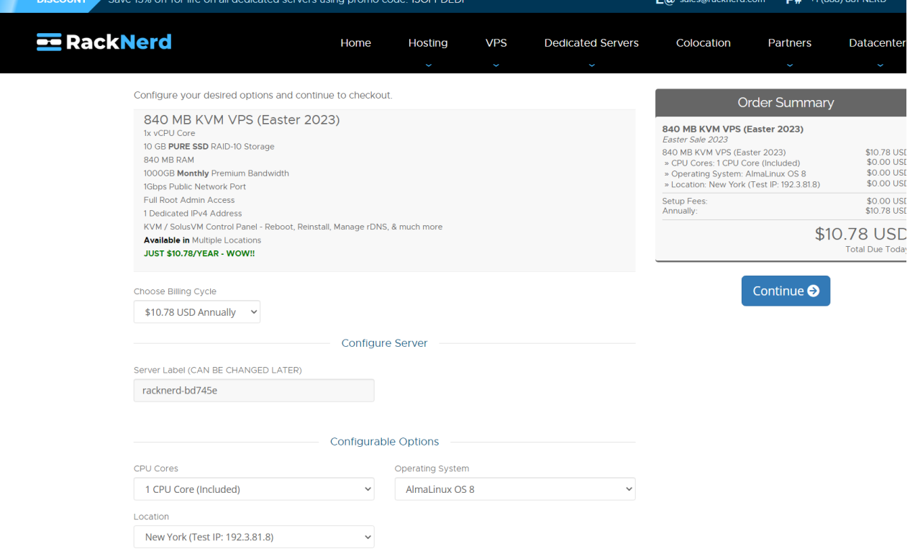
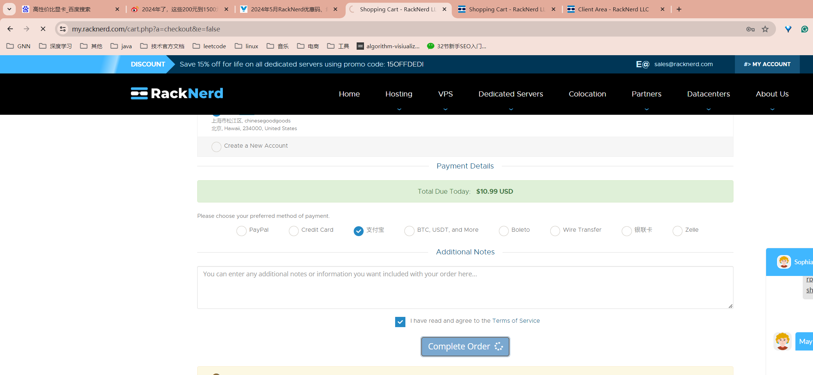

# 选购vps

网址：https://www.vpsgo.com/racknerd-coupons.html



18455730857@@139.com

sz962464




# 接收邮件

Hello 中 孙 (无), 

Thank you for your KVM VPS order with RackNerd! In this email you will find the 

login details so that you can begin utilizing your service with us. This email 

will contain your KVM VPS root info, as well as SolusVM credentials (NerdVM 

control panel). 

If you have just placed your order, **please allow up to 10 minutes for your 

server to be installed before attempting to use it.** 

**Server Details 

**============================= 

840 MB KVM VPS (Easter 2023) 

IP Address: 107.172.196.152 

Extra IP Address: 

Username: root 

Root Password: yq4vhW7RK3tE3GL25e 

SSH Port 22 

You can access it using any SSH program such as PuTTY.**>> SolusVM Control Panel Access (NerdVM) << 

**============================= 

SolusVM Credentials are as follows. Please use SolusVM if you need to restart, 

console or re-install your VPS. 

[https://nerdvm.racknerd.com/] 

(https://appmail.mail.10086.cn/m6/html/redirect.html? 

url=https%3A%2F%2Fnerdvm.racknerd.com%2F) 

Username: vmuser120191 

Password: 9a94c429d5 *(If you already have access to the control panel please use 

your existing password)* 

**24x7 Technical Support** 

============================= 

RackNerd support specialists are available 24/7 to assist you via our support 

ticket system. You can open a ticket at 

[https://my.racknerd.com/submitticket.php] 

(https://appmail.mail.10086.cn/m6/html/redirect.html? 

url=https%3A%2F%2Fmy.racknerd.com%2Fsubmitticket.php) 

Please include any necessary information in order to provide you with faster 

service. 

============================ 

**Thrilled about our service? Have friends who could use our service? How about 

making residual income? Affiliate Partners! Earn 15% Recurring Commission.** 

============================= 

RackNerd provides a recurring revenue-share with our affiliate program. Unlike 

other companies who provide a one-time payout, RackNerd provides a recurring 

commission structure so that our affiliates also get compensated beyond the 

initial sign-up period. 

RackNerd provides affiliate payouts via PayPal or account credit - your choice. 

By partnering with RackNerd, you will earn 15% recurring commission by referring 

customers. Want to learn more? [CLICK HERE] 

(https://appmail.mail.10086.cn/m6/html/redirect.html? 

url=https%3A%2F%2Fwww.racknerd.com%2Faffiliates) 

============================ 

Thanks! 

\--- 

Your RackNerd Team 

Introducing Infrastructure Stability 

https://www.racknerd.com/ 

Dedicated Servers, Private Cloud, DRaaS, Colocation & VPS 

Email: support@racknerd.com 

Toll Free: +1 (888) 881-NERD


# 重装系统

https://nerdvm.racknerd.com/

账号登录（不是主机服务器）：

Username: vmuser120191

Password: 9a94c429d5


# 远程连接

IP Address: 107.175.111.42

Username: root
Root Password: 51dai5LTyH17nlJLR3
SSH Port 22


# 安装v2ray

https://www.pinzixing.com/1160.html

```bash
# 启动系统之后，执行下面两个命令
# 1.安装curl
apt-get update -y && apt-get install curl -y
# 2.通过curl安装v2ray
bash <(curl -s -L https://git.io/v2ray.sh)
```

安装完成即出现：

```text
-------------- VMess-TCP-21162.json -------------
协议 (protocol)         = vmess
地址 (address)          = 107.175.111.42
端口 (port)             = 21162
用户ID (id)             = 92c7c358-a443-4118-913b-b5b4f3f84c2b
传输协议 (network)      = tcp
伪装类型 (type)         = none
vmess://eyJ2IjoyLCJwcyI6IjIzM2JveS10Y3AtMTA3LjE3NS4xMTEuNDIiLCJhZGQiOiIxMDcuMTc1LjExMS40MiIsInBvcnQiOiIyMTE2MiIsImlkIjoiOTJjN2MzNTgtYTQ0My00MTE4LTkxM2ItYjViNGYzZjg0YzJiIiwiYWlkIjoiMCIsIm5ldCI6InRjcCIsInR5cGUiOiJub25lIiwicGF0aCI6IiJ9
```


# 网速优化

```bash
# 直接执行
v2ray bbr
```


# 安装执行记录

........... V2Ray script by 233boy ..........

14:08:34) 开始安装...
14:08:34) 下载 V2Ray 脚本 > https://github.com/233boy/v2ray/releases/latest/download/code.zip
14:08:34) 下载 V2Ray > https://github.com/v2fly/v2ray-core/releases/latest/download/v2ray-linux-64.zip
14:08:34) 安装依赖包 > unzip jq qrencode
14:08:48) 生成配置文件...

使用协议: VMess-TCP
-------------- VMess-TCP-65435.json -------------
协议 (protocol)         = vmess
地址 (address)          = 107.172.196.179
端口 (port)             = 65435
用户ID (id)             = bcc6a21d-01ed-4570-8c19-87840a6bfec6
传输协议 (network)      = tcp
伪装类型 (type)         = none
------------- 链接 (URL) -------------
vmess://eyJ2IjoyLCJwcyI6IjIzM2JveS10Y3AtMTA3LjE3Mi4xOTYuMTc5IiwiYWRkIjoiMTA3LjE3Mi4xOTYuMTc5IiwicG9ydCI6IjY1NDM1IiwiaWQiOiJiY2M2YTIxZC0wMWVkLTQ1NzAtOGMxOS04Nzg0MGE2YmZlYzYiLCJuZXQiOiJ0Y3AiLCJ0eXBlIjoibm9uZSIsInBhdGgiOiIifQ==
------------- END -------------
关注(tg): https://t.me/tg2333
文档(doc): https://233boy.com/v2ray/v2ray-script/
推广(ads): 机场推荐(V2Ray services): https://getjms.com/


 ```bash
 # 直接执行
 v2ray add kcpd
 ```


执行完出现

```text
-------------- VMess-mKCP-dynamic-port-12874.json -------------
协议 (protocol)         = vmess
地址 (address)          = 107.175.111.42
端口 (port)             = 12874 & 动态端口: 14878-15955
用户ID (id)             = 06166e91-b4a8-44e5-96e4-bf06b95b32f6
传输协议 (network)      = kcp
伪装类型 (type)         = wireguard
mKCP seed               = 06166e91-b4a8-44e5-96e4-bf06b95b32f6
------------- 链接 (URL) -------------
vmess://eyJ2IjoyLCJwcyI6IjIzM2JveS1rY3AtMTA3LjE3NS4xMTEuNDIiLCJhZGQiOiIxMDcuMTc1LjExMS40MiIsInBvcnQiOiIxMjg3NCIsImlkIjoiMDYxNjZlOTEtYjRhOC00NGU1LTk2ZTQtYmYwNmI5NWIzMmY2IiwiYWlkIjoiMCIsIm5ldCI6ImtjcCIsInR5cGUiOiJ3aXJlZ3VhcmQiLCJwYXRoIjoiMDYxNjZlOTEtYjRhOC00NGU1LTk2ZTQtYmYwNmI5NWIzMmY2In0=
```


```text
pw:C58fv7744YlkLyQIXk

vmess:vmess://eyJ2IjoyLCJwcyI6IjIzM2JveS10Y3AtMTA3LjE3NC4zOS40OCIsImFkZCI6IjEwNy4xNzQuMzkuNDgiLCJwb3J0IjoiMzg2MDIiLCJpZCI6IjUwZTc0MDFkLTY2YjUtNDZjNC04ODY1LTkzNzc2M2IwY2FmZiIsImFpZCI6IjAiLCJuZXQiOiJ0Y3AiLCJ0eXBlIjoibm9uZSIsInBhdGgiOiIifQ==


协议 (protocol)         = vmess
地址 (address)          = 107.174.39.48
端口 (port)             = 19988 & 动态端口: 20998-21784
用户ID (id)             = e4bf05d0-0a8e-44d2-9102-689c52ab9d65
传输协议 (network)      = kcp
伪装类型 (type)         = wireguard
mKCP seed               = e4bf05d0-0a8e-44d2-9102-689c52ab9d65
------------- 链接 (URL) -------------
vmess://eyJ2IjoyLCJwcyI6IjIzM2JveS1rY3AtMTA3LjE3NC4zOS40OCIsImFkZCI6IjEwNy4xNzQuMzkuNDgiLCJwb3J0IjoiMTk5ODgiLCJpZCI6ImU0YmYwNWQwLTBhOGUtNDRkMi05MTAyLTY4OWM1MmFiOWQ2NSIsImFpZCI6IjAiLCJuZXQiOiJrY3AiLCJ0eXBlIjoid2lyZWd1YXJkIiwicGF0aCI6ImU0YmYwNWQwLTBhOGUtNDRkMi05MTAyLTY4OWM1MmFiOWQ2NSJ9

```

