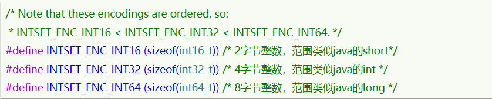
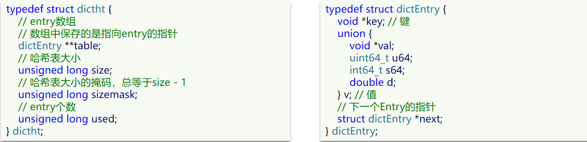
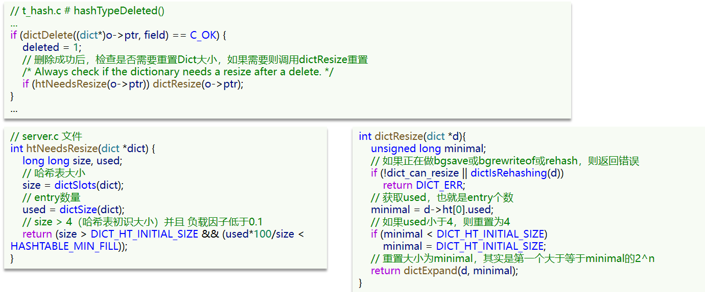
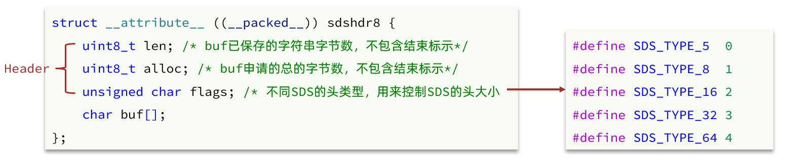
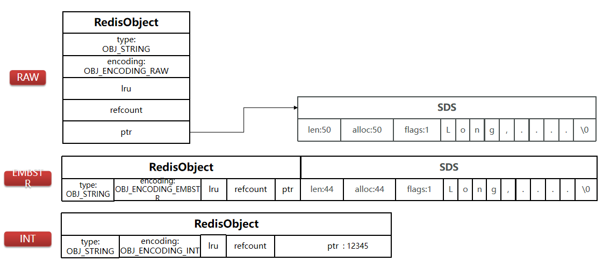
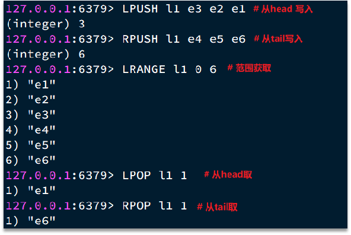
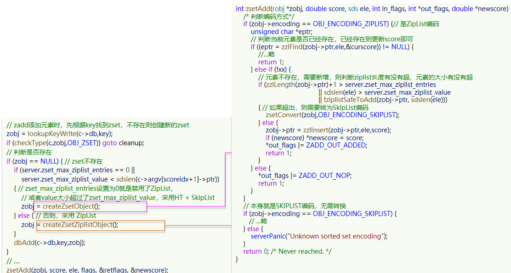
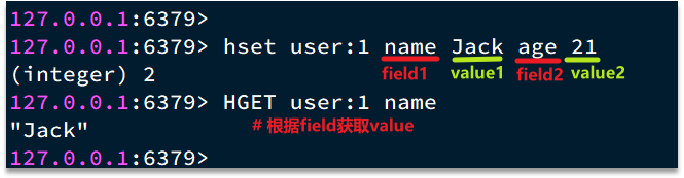
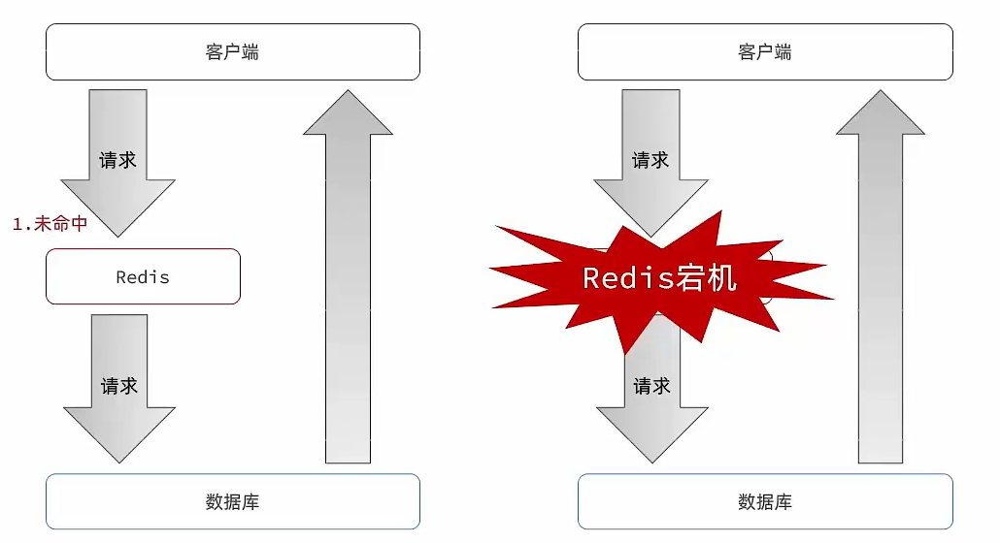
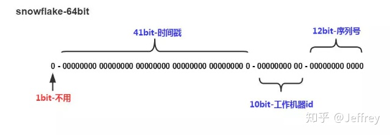

# Java基础

## 注解

## lamda表达式

```java
Thread thread = new Thread(() -> {
     System.out.println(123);
});
thread.start();
```


## Stream流  

## 函数式接口

```java
		/**
         * lamda 表达式中的参数类型可以不写，因为泛型指定了
         */

//    1. 消费型Consumer:有参数， 没有返回值
        Consumer<String> c1 = (s)->{System.out.println(s);};
        Consumer<String> c2 = (String s)->{System.out.println(s.length());};
        c1.andThen(c2).accept("hello world");
        System.out.println("----------------------------------------");

//    2. 供应型Supplier:没有参数，有返回值
        Supplier<Integer> s1 = ()->{
            return new Random().nextInt(2);
        };
        Integer integer = s1.get();
        System.out.println(integer);
        System.out.println("----------------------------------------");

//    3. 功能型Function:有参数，有返回值
        Function<String, Integer> f1 = (String s)->{return Integer.valueOf(s);};
        Integer integer1 = f1.apply("123");
        System.out.println(integer1);
        System.out.println("----------------------------------------");

//    4. 断言型Predicate:有参数，有返回值，返回类型bool
        Predicate<String> p1 = (s)->{return s.contains("123");};
        boolean b = p1.test("abcd12345");
        System.out.println(b);
        System.out.println("----------------------------------------");

        // 两个参数的情形
        BiFunction<Integer, Integer, Integer> add = (x, y) -> x + y;
        System.out.println(add.apply(10, 10));
```


## 集合:CopyOnWriteArraylist

## HashMap

## ConcurrentHashMap

## 线程池

## ThreadLocal

## AQS ReentrantLock


# JVM

## synchronized 锁升级

- 偏向锁：大多数情况下，锁不是竞争关系，而是同一个线程获取同一把锁，所以引入偏向锁。一个线程获取锁之后，对象回头会记录线程的id，以后该线程获取锁时，不用cas加锁解锁，只要测试下id是否等于该线程id，等于就表示获取锁，不等于就要看标志位是不是偏向锁，是偏向锁，就使用cas将对象头的偏向锁指向当前线程。缺点：如果线程存在竞争，锁撤销会有消耗
- 轻量级锁：获取锁时，会在当前线程的栈帧中创建锁记录空间，将对象的mark work复制到记录空间，然后尝试cas将对象头的markword替换为指向所记录的指针，成功表示获取锁，失败使用自旋竞争获取锁。缺点：自旋消耗cpu
- 重量级锁：没自旋，不会消耗cpu。缺点：线程阻塞，响应时间慢。

## JVM内存

## 垃圾回收算法 收集器：CMS G1

## 创建对象过程

### 类加载检查

Java虚拟机（jvm）**在读取一条new指令时候，首先检查能否在[常量池](https://so.csdn.net/so/search?q=常量池&spm=1001.2101.3001.7020)中定位到这个类的符号引用，并且检查这个符号引用代表的类**是否被加载、解析和初始化。如果没有，则会先执行相应的类加载过程。

### 内存分配

开始为新生的对象分配内存。该对象所需的内存大小在类加载完成后便可确定，因此为每个对象分配的内存大小是确定的。

### 初始化默认值

虚拟机需要将分配到的内存空间都进行初始化（即给一些默认值），这将做是为了保证对象实例的字段在Java代码中可以在不赋初值的情况下使用。程序可以访问到这些字段对用数据类型的默认值。

### 设置对象头

初始化完成后，虚拟机对对象进行一些简单设置，如标记该对象是哪个类的实例，这个对象的hash码，该对象所处的年龄段等等（这些可以理解为对象实例的基本信息）。这些信息被写在对象头中。jvm根据当前的运行状态，会给出不同的设置方式。

### 执行初始化方法

在（4）完成后，最后执行由开发人员编写的对象的初始化方法，把对象按照开发人员的设计进行初始化，一个对象便创建出来了。

## 类加载过程

[类加载]: https://segmentfault.com/a/1190000021363597


### 整体流程

加载、验证、准备、初始化和卸载这5个阶段的顺序是确定的，类的加载过程必须按照这种顺序按部就班地开始，而解析阶段则不一定：它在某些情况下可以在初始化阶段之后再开始，这是为了支持Java语言的运行时绑定（也称为动态绑定或晚期绑定）。注意，这里笔者写的是按部就班地“开始”，而不是按部就班地“进行”或“完成”，强调这点是因为这些阶段通常都是互相交叉地混合式进行的，通常会在一个阶段执行的过程中调用、激活另外一个阶段。 

什么情况下需要开始类加载过程的第一个阶段：加载？Java虚拟机规范中并没有进行强制约束，这点可以交给虚拟机的具体实现来自由把握。但是对于初始化阶段，虚拟机规范则是严格规定了有且只有5种情况必须立即对类进行“初始化”（而加载、验证、准备自然需要在此之前开始）： 

1）遇到new、getstatic、putstatic或invokestatic这4条字节码指令时，如果类没有进行过初始化，则需要先触发其初始化。生成这4条指令的最常见的Java代码场景是：使用new 关键字实例化对象的时候、读取或设置一个类的静态字段（被final修饰、已在编译期把结果放入常量池的静态字段除外）的时候，以及调用一个类的静态方法的时候。

2）使用java.lang.reflect包的方法对类进行反射调用的时候，如果类没有进行过初始化，则需要先触发其初始化。 

3）当初始化一个类的时候，如果发现其父类还没有进行过初始化，则需要先触发其 父类的初始化。 

4）当虚拟机启动时，用户需要指定一个要执行的主类（包含main()方法的那个类），虚拟机会先初始化这个主类。 


### 加载

在加载阶段，虚拟机需要完成以下3件事情： 

1）通过一个类的全限定名来获取定义此类的二进制字节流。 

2）将这个字节流所代表的静态存储结构转化为方法区的运行时数据结构。 

3）在内存中生成一个代表这个类的java.lang.Class对象，作为方法区这个类的各种数据的访问入口

### 验证

验证是连接阶段的第一步，这一阶段的目的是为了确保Class文件的字节流中包含的信息符合当前虚拟机的要求，并且不会危害虚拟机自身的安全。 

1. 文件格式验证

2. 元数据验证（实现方法  是否有父类 父类是否final等）

3. 字节码验证

4. 符号引用验证

### 准备

准备阶段是正式为类变量分配内存并设置类变量初始值的阶段，这些变量所使用的内存都将在方法区中进行分配。这个阶段中有两个容易产生混淆的概念需要强调一下，首先，这时候进行内存分配的仅包括类变量（被static修饰的变量），而不包括实例变量，实例变量将会在对象实例化时随着对象一起分配在Java堆中。其次，这里所说的初始值“通常情况”下是数据类型的零值，假设一个类变量的定义为：

```java
public static int value=123;
```

那变量value在准备阶段过后的初始值为0而不是123，因为这时候尚未开始执行任何Java方法，而把value赋值为123的putstatic指令是程序被编译后，存放于类构造器＜clinit＞()方法之中，所以把value赋值为123的动作将在初始化阶段才会执行。

### 解析

解析阶段是虚拟机将常量池内的符号引用替换为直接引用的过程

**符号引用**（Symbolic References）：符号引用以一组符号来描述所引用的目标，符号可以是任何形式的字面量，只要使用时能无歧义地定位到目标即可。符号引用与虚拟机实现的内存布局无关，引用的目标并不一定已经加载到内存中。各种虚拟机实现的内存布局可以各不相同，但是它们能接受的符号引用必须都是一致的，因为符号引用的字面量形式明确定义在Java虚拟机规范的Class文件格式中。 

**直接引用**（Direct References）：直接引用可以是直接指向目标的指针、相对偏移量或是一个能间接定位到目标的句柄。直接引用是和虚拟机实现的内存布局相关的，同一个符号引用在不同虚拟机实例上翻译出来的直接引用一般不会相同。如果有了直接引用，那引用的目标必定已经在内存中存在。 

### 初始化

前面的类加载过程中，除了在加载阶段用户应用程序可以通过自定义类加载器参与之外，其余动作完全由虚拟机主导和控制。到了初始化阶段，才真正开始执行类中定义的Java程序代码（或者说是字节码）。 

在准备阶段，变量已经赋过一次系统要求的初始值，而在初始化阶段，则根据程序员通过程序制定的主观计划去初始化类变量和其他资源，或者可以从另外一个角度来表达： 

初始化阶段是执行类构造器＜clinit＞()方法的过程。我们在下文会讲解＜clinit＞()方法是怎么生成的，在这里，我们先看一下＜clinit＞()方法执行过程中一些可能会影响程序运行行为的特点和细节，这部分相对更贴近于普通的程序开发人员[1]。 

＜clinit＞()方法是由编译器自动收集类中的所有类变量的赋值动作和静态语句块 static{}块）中的语句合并产生的，编译器收集的顺序是由语句在源文件中出现的顺序所决定的，＜clinit＞()方法对于类或接口来说并不是必需的，如果一个类中没有静态语句块，也没有对变量的赋值操作，那么编译器可以不为这个类生成＜clinit＞()方法。

# JMM


# IO

## NIO


# Redis

单机的Redis存在四大问题：


## 1.Redis持久化

Redis有两种持久化方案：

- RDB持久化
- AOF持久化


### 1.1.RDB持久化

RDB全称Redis Database Backup file（Redis数据备份文件），也被叫做Redis数据快照。简单来说就是把内存中的所有数据都记录到磁盘中。当Redis实例故障重启后，从磁盘读取快照文件，恢复数据。快照文件称为RDB文件，默认是保存在当前运行目录。

#### 1.1.1.执行时机

RDB持久化在四种情况下会执行：

- 执行save命令
- 执行bgsave命令
- Redis停机时
- 触发RDB条件时


**1）save命令**

执行下面的命令，可以立即执行一次RDB：


save命令会导致主进程执行RDB，这个过程中其它所有命令都会被阻塞。只有在数据迁移时可能用到。


**2）bgsave命令**

下面的命令可以异步执行RDB：


这个命令执行后会开启独立进程完成RDB，主进程可以持续处理用户请求，不受影响。


**3）停机时**

Redis停机时会执行一次save命令，实现RDB持久化。


**4）触发RDB条件**

Redis内部有触发RDB的机制，可以在redis.conf文件中找到，格式如下：

```properties
# 900秒内，如果至少有1个key被修改，则执行bgsave ， 如果是save "" 则表示禁用RDB
save 900 1  
save 300 10  
save 60 10000 
```


RDB的其它配置也可以在redis.conf文件中设置：

```properties
# 是否压缩 ,建议不开启，压缩也会消耗cpu，磁盘的话不值钱
rdbcompression yes

# RDB文件名称
dbfilename dump.rdb  

# 文件保存的路径目录
dir ./ 
```


#### 1.1.2.RDB原理

bgsave开始时会fork主进程得到子进程，子进程共享主进程的内存数据。完成fork后读取内存数据并写入 RDB 文件。

fork采用的是copy-on-write技术：

- 当主进程执行读操作时，访问共享内存；
- 当主进程执行写操作时，则会拷贝一份数据，执行写操作。


#### 1.1.3.小结

RDB方式bgsave的基本流程？

- fork主进程得到一个子进程，共享内存空间
- 子进程读取内存数据并写入新的RDB文件
- 用新RDB文件替换旧的RDB文件

RDB会在什么时候执行？save 60 1000代表什么含义？

- 默认是服务停止时
- 代表60秒内至少执行1000次修改则触发RDB

RDB的缺点？

- RDB执行间隔时间长，两次RDB之间写入数据有丢失的风险
- fork子进程、压缩、写出RDB文件都比较耗时


### 1.2.AOF持久化


#### 1.2.1.AOF原理

AOF全称为Append Only File（追加文件）。Redis处理的每一个写命令都会记录在AOF文件，可以看做是命令日志文件。


#### 1.2.2.AOF配置

AOF默认是关闭的，需要修改redis.conf配置文件来开启AOF：

```properties
# 是否开启AOF功能，默认是no
appendonly yes
# AOF文件的名称
appendfilename "appendonly.aof"
```


AOF的命令记录的频率也可以通过redis.conf文件来配：

```properties
# 表示每执行一次写命令，立即记录到AOF文件
appendfsync always 
# 写命令执行完先放入AOF缓冲区，然后表示每隔1秒将缓冲区数据写到AOF文件，是默认方案
appendfsync everysec 
# 写命令执行完先放入AOF缓冲区，由操作系统决定何时将缓冲区内容写回磁盘
appendfsync no
```


三种策略对比：


#### 1.2.3.AOF文件重写

因为是记录命令，AOF文件会比RDB文件大的多。而且AOF会记录对同一个key的多次写操作，但只有最后一次写操作才有意义。通过执行bgrewriteaof命令，可以让AOF文件执行重写功能，用最少的命令达到相同效果。


如图，AOF原本有三个命令，但是`set num 123 和 set num 666`都是对num的操作，第二次会覆盖第一次的值，因此第一个命令记录下来没有意义。

所以重写命令后，AOF文件内容就是：`mset name jack num 666`


Redis也会在触发阈值时自动去重写AOF文件。阈值也可以在redis.conf中配置：

```properties
# AOF文件比上次文件 增长超过多少百分比则触发重写
auto-aof-rewrite-percentage 100
# AOF文件体积最小多大以上才触发重写 
auto-aof-rewrite-min-size 64mb 
```


### 1.3.RDB与AOF对比

RDB和AOF各有自己的优缺点，如果对数据安全性要求较高，在实际开发中往往会**结合**两者来使用。


## 2.Redis主从

### 2.1.搭建主从架构

单节点Redis的并发能力是有上限的，要进一步提高Redis的并发能力，就需要搭建主从集群，实现读写分离。


### 2.2.主从数据同步原理

#### 2.2.1.全量同步

主从第一次建立连接时，会执行**全量同步**，将master节点的所有数据都拷贝给slave节点，流程：


这里有一个问题，master如何得知salve是第一次来连接呢？？

有几个概念，可以作为判断依据：

- **Replication Id**：简称replid，是数据集的标记，id一致则说明是同一数据集。每一个master都有唯一的replid，slave则会继承master节点的replid
- **offset**：偏移量，随着记录在repl_baklog中的数据增多而逐渐增大。slave完成同步时也会记录当前同步的offset。如果slave的offset小于master的offset，说明slave数据落后于master，需要更新。

因此slave做数据同步，必须向master声明自己的replication id 和offset，master才可以判断到底需要同步哪些数据。


因为slave原本也是一个master，有自己的replid和offset，当第一次变成slave，与master建立连接时，发送的replid和offset是自己的replid和offset。

master判断发现slave发送来的replid与自己的不一致，说明这是一个全新的slave，就知道要做全量同步了。

master会将自己的replid和offset都发送给这个slave，slave保存这些信息。以后slave的replid就与master一致了。

因此，**master判断一个节点是否是第一次同步的依据，就是看replid是否一致**。

如图：


完整流程描述：

- slave节点请求增量同步
- master节点判断replid，发现不一致，拒绝增量同步
- master将完整内存数据生成RDB，发送RDB到slave
- slave清空本地数据，加载master的RDB
- master将RDB期间的命令记录在repl_baklog，并持续将log中的命令发送给slave
- slave执行接收到的命令，保持与master之间的同步


#### 2.2.2.增量同步

全量同步需要先做RDB，然后将RDB文件通过网络传输个slave，成本太高了。因此除了第一次做全量同步，其它大多数时候slave与master都是做**增量同步**。

什么是增量同步？就是只更新slave与master存在差异的部分数据。如图：


那么master怎么知道slave与自己的数据差异在哪里呢?


#### 2.2.3.repl_backlog原理

master怎么知道slave与自己的数据差异在哪里呢?

这就要说到全量同步时的repl_baklog文件了。

这个文件是一个固定大小的数组，只不过数组是环形，也就是说**角标到达数组末尾后，会再次从0开始读写**，这样数组头部的数据就会被覆盖。

repl_baklog中会记录Redis处理过的命令日志及offset，包括master当前的offset，和slave已经拷贝到的offset：

 

slave与master的offset之间的差异，就是salve需要增量拷贝的数据了。

随着不断有数据写入，master的offset逐渐变大，slave也不断的拷贝，追赶master的offset：

 


直到数组被填满：

 

此时，如果有新的数据写入，就会覆盖数组中的旧数据。不过，旧的数据只要是绿色的，说明是已经被同步到slave的数据，即便被覆盖了也没什么影响。因为未同步的仅仅是红色部分。


但是，如果slave出现网络阻塞，导致master的offset远远超过了slave的offset： 

 

如果master继续写入新数据，其offset就会覆盖旧的数据，直到将slave现在的offset也覆盖：

 


棕色框中的红色部分，就是尚未同步，但是却已经被覆盖的数据。此时如果slave恢复，需要同步，却发现自己的offset都没有了，无法完成增量同步了。只能做全量同步。


### 2.3.主从同步优化

主从同步可以保证主从数据的一致性，非常重要。

可以从以下几个方面来优化Redis主从就集群：

- 在master中配置repl-diskless-sync yes启用无磁盘复制，避免全量同步时的磁盘IO。
- Redis单节点上的内存占用不要太大，减少RDB导致的过多磁盘IO
- 适当提高repl_baklog的大小，发现slave宕机时尽快实现故障恢复，尽可能避免全量同步
- 限制一个master上的slave节点数量，如果实在是太多slave，则可以采用主-从-从链式结构，减少master压力

主从从架构图：


### 2.4.小结

简述全量同步和增量同步区别？

- 全量同步：master将完整内存数据生成RDB，发送RDB到slave。后续命令则记录在repl_baklog，逐个发送给slave。
- 增量同步：slave提交自己的offset到master，master获取repl_baklog中从offset之后的命令给slave

什么时候执行全量同步？

- slave节点第一次连接master节点时
- slave节点断开时间太久，repl_baklog中的offset已经被覆盖时

什么时候执行增量同步？

- slave节点断开又恢复，并且在repl_baklog中能找到offset时


## 3.Redis哨兵

Redis提供了哨兵（Sentinel）机制来实现主从集群的自动故障恢复。

### 3.1.哨兵原理

#### 3.1.1.集群结构和作用

哨兵的结构如图：


哨兵的作用如下：

- **监控**：Sentinel 会不断检查您的master和slave是否按预期工作
- **自动故障恢复**：如果master故障，Sentinel会将一个slave提升为master。当故障实例恢复后也以新的master为主
- **通知**：Sentinel充当Redis客户端的服务发现来源，当集群发生故障转移时，会将最新信息推送给Redis的客户端


#### 3.1.2.集群监控原理

Sentinel基于心跳机制监测服务状态，每隔1秒向集群的每个实例发送ping命令：

•主观下线：如果某sentinel节点发现某实例未在规定时间响应，则认为该实例**主观下线**。

•客观下线：若超过指定数量（quorum）的sentinel都认为该实例主观下线，则该实例**客观下线**。quorum值最好超过Sentinel实例数量的一半。


#### 3.1.3.集群故障恢复原理

一旦发现master故障，sentinel需要在salve中选择一个作为新的master，选择依据是这样的：

- 首先会判断slave节点与master节点断开时间长短，如果超过指定值（down-after-milliseconds * 10）则会排除该slave节点
- 然后判断slave节点的slave-priority值，越小优先级越高，如果是0则永不参与选举
- 如果slave-prority一样，则判断slave节点的offset值，越大说明数据越新，优先级越高
- 最后是判断slave节点的运行id大小，越小优先级越高。


当选出一个新的master后，该如何实现切换呢？

流程如下：

- sentinel给备选的slave1节点发送slaveof no one命令，让该节点成为master
- sentinel给所有其它slave发送slaveof 192.168.150.101 7002 命令，让这些slave成为新master的从节点，开始从新的master上同步数据。
- 最后，sentinel将故障节点标记为slave，当故障节点恢复后会自动成为新的master的slave节点


#### 3.1.4.小结

Sentinel的三个作用是什么？

- 监控
- 故障转移
- 通知

Sentinel如何判断一个redis实例是否健康？

- 每隔1秒发送一次ping命令，如果超过一定时间没有相向则认为是主观下线
- 如果大多数sentinel都认为实例主观下线，则判定服务下线

故障转移步骤有哪些？

- 首先选定一个slave作为新的master，执行slaveof no one
- 然后让所有节点都执行slaveof 新master
- 修改故障节点配置，添加slaveof 新master


## 4.Redis分片集群

### 4.1.搭建分片集群

主从和哨兵可以解决高可用、高并发读的问题。但是依然有两个问题没有解决：

- 海量数据存储问题

- 高并发写的问题

使用分片集群可以解决上述问题，如图:


分片集群特征：

- 集群中有多个master，每个master保存不同数据

- 每个master都可以有多个slave节点

- master之间通过ping监测彼此健康状态

- 客户端请求可以访问集群任意节点，最终都会被转发到正确节点


### 4.2.散列插槽

#### 4.2.1.插槽原理

Redis会把每一个master节点映射到0~16383共16384个插槽（hash slot）上，查看集群信息时就能看到：


数据key不是与节点绑定，而是与插槽绑定。redis会根据key的有效部分计算插槽值，分两种情况：

- key中包含"{}"，且“{}”中至少包含1个字符，“{}”中的部分是有效部分
- key中不包含“{}”，整个key都是有效部分


例如：key是num，那么就根据num计算，如果是{itcast}num，则根据itcast计算。计算方式是利用CRC16算法得到一个hash值，然后对16384取余，得到的结果就是slot值。

 

如图，在7001这个节点执行set a 1时，对a做hash运算，对16384取余，得到的结果是15495，因此要存储到7003节点。

到了7003后，执行`get num`时，对num做hash运算，对16384取余，得到的结果是2765，因此需要切换到7001节点


#### 4.2.1.小结

Redis如何判断某个key应该在哪个实例？

- 将16384个插槽分配到不同的实例
- 根据key的有效部分计算哈希值，对16384取余
- 余数作为插槽，寻找插槽所在实例即可

如何将同一类数据固定的保存在同一个Redis实例？

- 这一类数据使用相同的有效部分，例如key都以{typeId}为前缀

## 5.原理篇-Redis数据结构

### 5.1 Redis数据结构-动态字符串

我们都知道Redis中保存的Key是字符串，value往往是字符串或者字符串的集合。可见字符串是Redis中最常用的一种数据结构。

不过Redis没有直接使用C语言中的字符串，因为C语言字符串存在很多问题：
获取字符串长度的需要通过运算
非二进制安全
不可修改
Redis构建了一种新的字符串结构，称为简单动态字符串（Simple Dynamic String），简称SDS。
例如，我们执行命令：


那么Redis将在底层创建两个SDS，其中一个是包含“name”的SDS，另一个是包含“虎哥”的SDS。

Redis是C语言实现的，其中SDS是一个结构体，源码如下：


例如，一个包含字符串“name”的sds结构如下：


SDS之所以叫做动态字符串，是因为它具备动态扩容的能力，例如一个内容为“hi”的SDS：


假如我们要给SDS追加一段字符串“,Amy”，这里首先会申请新内存空间：

如果新字符串小于1M，则新空间为扩展后字符串长度的两倍+1；

如果新字符串大于1M，则新空间为扩展后字符串长度+1M+1。称为内存预分配。


### 5.2 Redis数据结构-intset

IntSet是Redis中set集合的一种实现方式，基于整数数组来实现，并且具备长度可变、有序等特征。
结构如下：


其中的encoding包含三种模式，表示存储的整数大小不同：



为了方便查找，Redis会将intset中所有的整数按照升序依次保存在contents数组中，结构如图：


现在，数组中每个数字都在int16_t的范围内，因此采用的编码方式是INTSET_ENC_INT16，每部分占用的字节大小为：
encoding：4字节
length：4字节
contents：2字节 * 3  = 6字节


我们向该其中添加一个数字：50000，这个数字超出了int16_t的范围，intset会自动升级编码方式到合适的大小。
以当前案例来说流程如下：

* 升级编码为INTSET_ENC_INT32, 每个整数占4字节，并按照新的编码方式及元素个数扩容数组
* 倒序依次将数组中的元素拷贝到扩容后的正确位置
* 将待添加的元素放入数组末尾
* 最后，将inset的encoding属性改为INTSET_ENC_INT32，将length属性改为4


源码如下：


小总结：

Intset可以看做是特殊的整数数组，具备一些特点：

* Redis会确保Intset中的元素唯一、有序
* 具备类型升级机制，可以节省内存空间
* 底层采用二分查找方式来查询

### 5.3 Redis数据结构-Dict

我们知道Redis是一个键值型（Key-Value Pair）的数据库，我们可以根据键实现快速的增删改查。而键与值的映射关系正是通过Dict来实现的。
Dict由三部分组成，分别是：哈希表（DictHashTable）、哈希节点（DictEntry）、字典（Dict）



当我们向Dict添加键值对时，Redis首先根据key计算出hash值（h），然后利用 h & sizemask来计算元素应该存储到数组中的哪个索引位置。我们存储k1=v1，假设k1的哈希值h =1，则1&3 =1，因此k1=v1要存储到数组角标1位置。


Dict由三部分组成，分别是：哈希表（DictHashTable）、哈希节点（DictEntry）、字典（Dict）


**Dict的扩容**

Dict中的HashTable就是数组结合单向链表的实现，当集合中元素较多时，必然导致哈希冲突增多，链表过长，则查询效率会大大降低。
Dict在每次新增键值对时都会检查负载因子（LoadFactor = used/size） ，满足以下两种情况时会触发哈希表扩容：
哈希表的 LoadFactor >= 1，并且服务器没有执行 BGSAVE 或者 BGREWRITEAOF 等后台进程；
哈希表的 LoadFactor > 5 ；




**Dict的rehash**

不管是扩容还是收缩，必定会创建新的哈希表，导致哈希表的size和sizemask变化，而key的查询与sizemask有关。因此必须对哈希表中的每一个key重新计算索引，插入新的哈希表，这个过程称为rehash。过程是这样的：

* 计算新hash表的realeSize，值取决于当前要做的是扩容还是收缩：
  * 如果是扩容，则新size为第一个大于等于dict.ht[0].used + 1的2^n
  * 如果是收缩，则新size为第一个大于等于dict.ht[0].used的2^n （不得小于4）

* 按照新的realeSize申请内存空间，创建dictht，并赋值给dict.ht[1]
* 设置dict.rehashidx = 0，标示开始rehash
* 将dict.ht[0]中的每一个dictEntry都rehash到dict.ht[1]
* 将dict.ht[1]赋值给dict.ht[0]，给dict.ht[1]初始化为空哈希表，释放原来的dict.ht[0]的内存
* 将rehashidx赋值为-1，代表rehash结束
* 在rehash过程中，新增操作，则直接写入ht[1]，查询、修改和删除则会在dict.ht[0]和dict.ht[1]依次查找并执行。这样可以确保ht[0]的数据只减不增，随着rehash最终为空

整个过程可以描述成：


小总结：

Dict的结构：

* 类似java的HashTable，底层是数组加链表来解决哈希冲突
* Dict包含两个哈希表，ht[0]平常用，ht[1]用来rehash

Dict的伸缩：

* 当LoadFactor大于5或者LoadFactor大于1并且没有子进程任务时，Dict扩容
* 当LoadFactor小于0.1时，Dict收缩
* 扩容大小为第一个大于等于used + 1的2^n
* 收缩大小为第一个大于等于used 的2^n
* Dict采用渐进式rehash，每次访问Dict时执行一次rehash
* rehash时ht[0]只减不增，新增操作只在ht[1]执行，其它操作在两个哈希表

### 5.4 Redis数据结构-ZipList

ZipList 是一种特殊的“双端链表” ，由一系列特殊编码的连续内存块组成。可以在任意一端进行压入/弹出操作, 并且该操作的时间复杂度为 O(1)。


| **属性** | **类型** | **长度** | **用途**                                                     |
| -------- | -------- | -------- | ------------------------------------------------------------ |
| zlbytes  | uint32_t | 4 字节   | 记录整个压缩列表占用的内存字节数                             |
| zltail   | uint32_t | 4 字节   | 记录压缩列表表尾节点距离压缩列表的起始地址有多少字节，通过这个偏移量，可以确定表尾节点的地址。 |
| zllen    | uint16_t | 2 字节   | 记录了压缩列表包含的节点数量。 最大值为UINT16_MAX （65534），如果超过这个值，此处会记录为65535，但节点的真实数量需要遍历整个压缩列表才能计算得出。 |
| entry    | 列表节点 | 不定     | 压缩列表包含的各个节点，节点的长度由节点保存的内容决定。     |
| zlend    | uint8_t  | 1 字节   | 特殊值 0xFF （十进制 255 ），用于标记压缩列表的末端。        |

**ZipListEntry**

ZipList 中的Entry并不像普通链表那样记录前后节点的指针，因为记录两个指针要占用16个字节，浪费内存。而是采用了下面的结构：


* previous_entry_length：前一节点的长度，占1个或5个字节。
  * 如果前一节点的长度小于254字节，则采用1个字节来保存这个长度值
  * 如果前一节点的长度大于254字节，则采用5个字节来保存这个长度值，第一个字节为0xfe，后四个字节才是真实长度数据

* encoding：编码属性，记录content的数据类型（字符串还是整数）以及长度，占用1个、2个或5个字节
* contents：负责保存节点的数据，可以是字符串或整数

ZipList中所有存储长度的数值均采用小端字节序，即低位字节在前，高位字节在后。例如：数值0x1234，采用小端字节序后实际存储值为：0x3412

**Encoding编码**

ZipListEntry中的encoding编码分为字符串和整数两种：
字符串：如果encoding是以“00”、“01”或者“10”开头，则证明content是字符串

| **编码**                                             | **编码长度** | **字符串大小**      |
| ---------------------------------------------------- | ------------ | ------------------- |
| \|00pppppp\|                                         | 1 bytes      | <= 63 bytes         |
| \|01pppppp\|qqqqqqqq\|                               | 2 bytes      | <= 16383 bytes      |
| \|10000000\|qqqqqqqq\|rrrrrrrr\|ssssssss\|tttttttt\| | 5 bytes      | <= 4294967295 bytes |

例如，我们要保存字符串：“ab”和 “bc”


 ZipListEntry中的encoding编码分为字符串和整数两种：

* 整数：如果encoding是以“11”开始，则证明content是整数，且encoding固定只占用1个字节

| **编码** | **编码长度** | **整数类型**                                               |
| -------- | ------------ | ---------------------------------------------------------- |
| 11000000 | 1            | int16_t（2 bytes）                                         |
| 11010000 | 1            | int32_t（4 bytes）                                         |
| 11100000 | 1            | int64_t（8 bytes）                                         |
| 11110000 | 1            | 24位有符整数(3 bytes)                                      |
| 11111110 | 1            | 8位有符整数(1 bytes)                                       |
| 1111xxxx | 1            | 直接在xxxx位置保存数值，范围从0001~1101，减1后结果为实际值 |


### 5.5 Redis数据结构-ZipList的连锁更新问题

ZipList的每个Entry都包含previous_entry_length来记录上一个节点的大小，长度是1个或5个字节：
如果前一节点的长度小于254字节，则采用1个字节来保存这个长度值
如果前一节点的长度大于等于254字节，则采用5个字节来保存这个长度值，第一个字节为0xfe，后四个字节才是真实长度数据
现在，假设我们有N个连续的、长度为250~253字节之间的entry，因此entry的previous_entry_length属性用1个字节即可表示，如图所示：


ZipList这种特殊情况下产生的连续多次空间扩展操作称之为连锁更新（Cascade Update）。新增、删除都可能导致连锁更新的发生。

**小总结：**

**ZipList特性：**

* 压缩列表的可以看做一种连续内存空间的"双向链表"
* 列表的节点之间不是通过指针连接，而是记录上一节点和本节点长度来寻址，内存占用较低
* 如果列表数据过多，导致链表过长，可能影响查询性能
* 增或删较大数据时有可能发生连续更新问题

### 5.6 Redis数据结构-QuickList

问题1：ZipList虽然节省内存，但申请内存必须是连续空间，如果内存占用较多，申请内存效率很低。怎么办？

​	答：为了缓解这个问题，我们必须限制ZipList的长度和entry大小。

问题2：但是我们要存储大量数据，超出了ZipList最佳的上限该怎么办？

​	答：我们可以创建多个ZipList来分片存储数据。

问题3：数据拆分后比较分散，不方便管理和查找，这多个ZipList如何建立联系？

​	答：Redis在3.2版本引入了新的数据结构QuickList，它是一个双端链表，只不过链表中的每个节点都是一个ZipList。


为了避免QuickList中的每个ZipList中entry过多，Redis提供了一个配置项：list-max-ziplist-size来限制。
如果值为正，则代表ZipList的允许的entry个数的最大值
如果值为负，则代表ZipList的最大内存大小，分5种情况：

* -1：每个ZipList的内存占用不能超过4kb
* -2：每个ZipList的内存占用不能超过8kb
* -3：每个ZipList的内存占用不能超过16kb
* -4：每个ZipList的内存占用不能超过32kb
* -5：每个ZipList的内存占用不能超过64kb

其默认值为 -2：


以下是QuickList的和QuickListNode的结构源码：


我们接下来用一段流程图来描述当前的这个结构


总结：

QuickList的特点：

* 是一个节点为ZipList的双端链表
* 节点采用ZipList，解决了传统链表的内存占用问题
* 控制了ZipList大小，解决连续内存空间申请效率问题
* 中间节点可以压缩，进一步节省了内存

1.7 Redis数据结构-SkipList

SkipList（跳表）首先是链表，但与传统链表相比有几点差异：
元素按照升序排列存储
节点可能包含多个指针，指针跨度不同。


SkipList（跳表）首先是链表，但与传统链表相比有几点差异：
元素按照升序排列存储
节点可能包含多个指针，指针跨度不同。


SkipList（跳表）首先是链表，但与传统链表相比有几点差异：
元素按照升序排列存储
节点可能包含多个指针，指针跨度不同。


小总结：

SkipList的特点：

* 跳跃表是一个双向链表，每个节点都包含score和ele值
* 节点按照score值排序，score值一样则按照ele字典排序
* 每个节点都可以包含多层指针，层数是1到32之间的随机数
* 不同层指针到下一个节点的跨度不同，层级越高，跨度越大
* 增删改查效率与红黑树基本一致，实现却更简单

### 5.7 Redis数据结构-RedisObject

Redis中的任意数据类型的键和值都会被封装为一个RedisObject，也叫做Redis对象，源码如下：

1、什么是redisObject：
从Redis的使用者的角度来看，⼀个Redis节点包含多个database（非cluster模式下默认是16个，cluster模式下只能是1个），而一个database维护了从key space到object space的映射关系。这个映射关系的key是string类型，⽽value可以是多种数据类型，比如：
string, list, hash、set、sorted set等。我们可以看到，key的类型固定是string，而value可能的类型是多个。
⽽从Redis内部实现的⾓度来看，database内的这个映射关系是用⼀个dict来维护的。dict的key固定用⼀种数据结构来表达就够了，这就是动态字符串sds。而value则比较复杂，为了在同⼀个dict内能够存储不同类型的value，这就需要⼀个通⽤的数据结构，这个通用的数据结构就是robj，全名是redisObject。


Redis的编码方式

Redis中会根据存储的数据类型不同，选择不同的编码方式，共包含11种不同类型：

| **编号** | **编码方式**            | **说明**               |
| -------- | ----------------------- | ---------------------- |
| 0        | OBJ_ENCODING_RAW        | raw编码动态字符串      |
| 1        | OBJ_ENCODING_INT        | long类型的整数的字符串 |
| 2        | OBJ_ENCODING_HT         | hash表（字典dict）     |
| 3        | OBJ_ENCODING_ZIPMAP     | 已废弃                 |
| 4        | OBJ_ENCODING_LINKEDLIST | 双端链表               |
| 5        | OBJ_ENCODING_ZIPLIST    | 压缩列表               |
| 6        | OBJ_ENCODING_INTSET     | 整数集合               |
| 7        | OBJ_ENCODING_SKIPLIST   | 跳表                   |
| 8        | OBJ_ENCODING_EMBSTR     | embstr的动态字符串     |
| 9        | OBJ_ENCODING_QUICKLIST  | 快速列表               |
| 10       | OBJ_ENCODING_STREAM     | Stream流               |

五种数据结构

Redis中会根据存储的数据类型不同，选择不同的编码方式。每种数据类型的使用的编码方式如下：

| **数据类型** | **编码方式**                                       |
| ------------ | -------------------------------------------------- |
| OBJ_STRING   | int、embstr、raw                                   |
| OBJ_LIST     | LinkedList和ZipList(3.2以前)、QuickList（3.2以后） |
| OBJ_SET      | intset、HT                                         |
| OBJ_ZSET     | ZipList、HT、SkipList                              |
| OBJ_HASH     | ZipList、HT                                        |

### 5.8 Redis数据结构-String

String是Redis中最常见的数据存储类型：

其基本编码方式是RAW，基于简单动态字符串（SDS）实现，存储上限为512mb。

如果存储的SDS长度小于44字节，则会采用EMBSTR编码，此时object head与SDS是一段连续空间。申请内存时

只需要调用一次内存分配函数，效率更高。

（1）底层实现⽅式：动态字符串sds 或者 long
String的内部存储结构⼀般是sds（Simple Dynamic String，可以动态扩展内存），但是如果⼀个String类型的value的值是数字，那么Redis内部会把它转成long类型来存储，从⽽减少内存的使用。


如果存储的字符串是整数值，并且大小在LONG_MAX范围内，则会采用INT编码：直接将数据保存在RedisObject的ptr指针位置（刚好8字节），不再需要SDS了。






确切地说，String在Redis中是⽤⼀个robj来表示的。

用来表示String的robj可能编码成3种内部表⽰：OBJ_ENCODING_RAW，OBJ_ENCODING_EMBSTR，OBJ_ENCODING_INT。
其中前两种编码使⽤的是sds来存储，最后⼀种OBJ_ENCODING_INT编码直接把string存成了long型。
在对string进行incr, decr等操作的时候，如果它内部是OBJ_ENCODING_INT编码，那么可以直接行加减操作；如果它内部是OBJ_ENCODING_RAW或OBJ_ENCODING_EMBSTR编码，那么Redis会先试图把sds存储的字符串转成long型，如果能转成功，再进行加减操作。对⼀个内部表示成long型的string执行append, setbit, getrange这些命令，针对的仍然是string的值（即⼗进制表示的字符串），而不是针对内部表⽰的long型进⾏操作。比如字符串”32”，如果按照字符数组来解释，它包含两个字符，它们的ASCII码分别是0x33和0x32。当我们执行命令setbit key 7 0的时候，相当于把字符0x33变成了0x32，这样字符串的值就变成了”22”。⽽如果将字符串”32”按照内部的64位long型来解释，那么它是0x0000000000000020，在这个基础上执⾏setbit位操作，结果就完全不对了。因此，在这些命令的实现中，会把long型先转成字符串再进行相应的操作。


### 5.9 Redis数据结构-List

Redis的List类型可以从首、尾操作列表中的元素：



哪一个数据结构能满足上述特征？

* LinkedList ：普通链表，可以从双端访问，内存占用较高，内存碎片较多
* ZipList ：压缩列表，可以从双端访问，内存占用低，存储上限低
* QuickList：LinkedList + ZipList，可以从双端访问，内存占用较低，包含多个ZipList，存储上限高

Redis的List结构类似一个双端链表，可以从首、尾操作列表中的元素：

在3.2版本之前，Redis采用ZipList和LinkedList来实现List，当元素数量小于512并且元素大小小于64字节时采用ZipList编码，超过则采用LinkedList编码。

在3.2版本之后，Redis统一采用QuickList来实现List：


### 5.10 Redis数据结构-Set结构

Set是Redis中的单列集合，满足下列特点：

* 不保证有序性
* 保证元素唯一
* 求交集、并集、差集


可以看出，Set对查询元素的效率要求非常高，思考一下，什么样的数据结构可以满足？
HashTable，也就是Redis中的Dict，不过Dict是双列集合（可以存键、值对）

Set是Redis中的集合，不一定确保元素有序，可以满足元素唯一、查询效率要求极高。
为了查询效率和唯一性，set采用HT编码（Dict）。Dict中的key用来存储元素，value统一为null。
当存储的所有数据都是整数，并且元素数量不超过set-max-intset-entries时，Set会采用IntSet编码，以节省内存


结构如下：

​	

### 5.11 Redis数据结构-ZSET

ZSet也就是SortedSet，其中每一个元素都需要指定一个score值和member值：

* 可以根据score值排序后
* member必须唯一
* 可以根据member查询分数


因此，zset底层数据结构必须满足键值存储、键必须唯一、可排序这几个需求。之前学习的哪种编码结构可以满足？

* SkipList：可以排序，并且可以同时存储score和ele值（member）
* HT（Dict）：可以键值存储，并且可以根据key找value


当元素数量不多时，HT和SkipList的优势不明显，而且更耗内存。因此zset还会采用ZipList结构来节省内存，不过需要同时满足两个条件：

* 元素数量小于zset_max_ziplist_entries，默认值128
* 每个元素都小于zset_max_ziplist_value字节，默认值64

ziplist本身没有排序功能，而且没有键值对的概念，因此需要有zset通过编码实现：

* ZipList是连续内存，因此score和element是紧挨在一起的两个entry， element在前，score在后
* score越小越接近队首，score越大越接近队尾，按照score值升序排列




### 5.12  Redis数据结构-Hash

Hash结构与Redis中的Zset非常类似：

* 都是键值存储
* 都需求根据键获取值
* 键必须唯一

区别如下：

* zset的键是member，值是score；hash的键和值都是任意值
* zset要根据score排序；hash则无需排序

（1）底层实现方式：压缩列表ziplist 或者 字典dict
当Hash中数据项比较少的情况下，Hash底层才⽤压缩列表ziplist进⾏存储数据，随着数据的增加，底层的ziplist就可能会转成dict，具体配置如下：

hash-max-ziplist-entries 512

hash-max-ziplist-value 64

当满足上面两个条件其中之⼀的时候，Redis就使⽤dict字典来实现hash。
Redis的hash之所以这样设计，是因为当ziplist变得很⼤的时候，它有如下几个缺点：

* 每次插⼊或修改引发的realloc操作会有更⼤的概率造成内存拷贝，从而降低性能。
* ⼀旦发生内存拷贝，内存拷贝的成本也相应增加，因为要拷贝更⼤的⼀块数据。
* 当ziplist数据项过多的时候，在它上⾯查找指定的数据项就会性能变得很低，因为ziplist上的查找需要进行遍历。

总之，ziplist本来就设计为各个数据项挨在⼀起组成连续的内存空间，这种结构并不擅长做修改操作。⼀旦数据发⽣改动，就会引发内存realloc，可能导致内存拷贝。

hash结构如下：



zset集合如下：


因此，Hash底层采用的编码与Zset也基本一致，只需要把排序有关的SkipList去掉即可：

Hash结构默认采用ZipList编码，用以节省内存。 ZipList中相邻的两个entry 分别保存field和value

当数据量较大时，Hash结构会转为HT编码，也就是Dict，触发条件有两个：

* ZipList中的元素数量超过了hash-max-ziplist-entries（默认512）
* ZipList中的任意entry大小超过了hash-max-ziplist-value（默认64字节）


## 6 Redis网络模型和内存淘汰策略

### 6.1 、网络模型-Redis是单线程的吗？为什么使用单线程

**Redis到底是单线程还是多线程？**

* 如果仅仅聊Redis的核心业务部分（命令处理），答案是单线程
* 如果是聊整个Redis，那么答案就是多线程

在Redis版本迭代过程中，在两个重要的时间节点上引入了多线程的支持：

* Redis v4.0：引入多线程异步处理一些耗时较旧的任务，例如异步删除命令unlink
* Redis v6.0：在核心网络模型中引入 多线程，进一步提高对于多核CPU的利用率

因此，对于Redis的核心网络模型，在Redis 6.0之前确实都是单线程。是利用epoll（Linux系统）这样的IO多路复用技术在事件循环中不断处理客户端情况。

**为什么Redis要选择单线程？**

* 抛开持久化不谈，Redis是纯  内存操作，执行速度非常快，它的性能瓶颈是网络延迟而不是执行速度，因此多线程并不会带来巨大的性能提升。
* 多线程会导致过多的上下文切换，带来不必要的开销
* 引入多线程会面临线程安全问题，必然要引入线程锁这样的安全手段，实现复杂度增高，而且性能也会大打折扣

### 6.2 、Redis的单线程模型-Redis单线程和多线程网络模型变更


当我们的客户端想要去连接我们服务器，会去先到IO多路复用模型去进行排队，会有一个连接应答处理器，他会去接受读请求，然后又把读请求注册到具体模型中去，此时这些建立起来的连接，如果是客户端请求处理器去进行执行命令时，他会去把数据读取出来，然后把数据放入到client中， clinet去解析当前的命令转化为redis认识的命令，接下来就开始处理这些命令，从redis中的command中找到这些命令，然后就真正的去操作对应的数据了，当数据操作完成后，会去找到命令回复处理器，再由他将数据写出。


Redis基于内存操作，CPU并不是性能瓶颈，Redis的瓶颈是根据机器的内存和网络带宽。在`6.0的版本`中引入了多线程。

这个I/O threads 指的是网络I/O处理方面使用了多线程，如网络数据的读写和协议解析等，这是因为读写网络的read/write在Redis执行期间占用了大部分CPU时间，如果把这部分模块使用多线程方式实现会对性能带来极大地提升。但是Redis执行命令的核心模块还是单线程的。

### 6.3、Redis内存回收-过期key处理

Redis之所以性能强，最主要的原因就是基于内存存储。然而单节点的Redis其内存大小不宜过大，会影响持久化或主从同步性能。
我们可以通过修改配置文件来设置Redis的最大内存：


当内存使用达到上限时，就无法存储更多数据了。为了解决这个问题，Redis提供了一些策略实现内存回收：

内存过期策略

在学习Redis缓存的时候我们说过，可以通过expire命令给Redis的key设置TTL（存活时间）：


可以发现，当key的TTL到期以后，再次访问name返回的是nil，说明这个key已经不存在了，对应的内存也得到释放。从而起到内存回收的目的。

Redis本身是一个典型的key-value内存存储数据库，因此所有的key、value都保存在之前学习过的Dict结构中。不过在其database结构体中，有两个Dict：一个用来记录key-value；另一个用来记录key-TTL。


这里有两个问题需要我们思考：
Redis是如何知道一个key是否过期呢？

利用两个Dict分别记录key-value对及key-ttl对

是不是TTL到期就立即删除了呢？

**惰性删除**

惰性删除：顾明思议并不是在TTL到期后就立刻删除，而是在访问一个key的时候，检查该key的存活时间，如果已经过期才执行删除。


**周期删除**

周期删除：顾明思议是通过一个定时任务，周期性的抽样部分过期的key，然后执行删除。执行周期有两种：
Redis服务初始化函数initServer()中设置定时任务，按照server.hz的频率来执行过期key清理，模式为SLOW
Redis的每个事件循环前会调用beforeSleep()函数，执行过期key清理，模式为FAST

周期删除：顾明思议是通过一个定时任务，周期性的抽样部分过期的key，然后执行删除。执行周期有两种：
Redis服务初始化函数initServer()中设置定时任务，按照server.hz的频率来执行过期key清理，模式为SLOW
Redis的每个事件循环前会调用beforeSleep()函数，执行过期key清理，模式为FAST

SLOW模式规则：

* 执行频率受server.hz影响，默认为10，即每秒执行10次，每个执行周期100ms。
* 执行清理耗时不超过一次执行周期的25%.默认slow模式耗时不超过25ms
* 逐个遍历db，逐个遍历db中的bucket，抽取20个key判断是否过期
* 如果没达到时间上限（25ms）并且过期key比例大于10%，再进行一次抽样，否则结束
* FAST模式规则（过期key比例小于10%不执行 ）：
* 执行频率受beforeSleep()调用频率影响，但两次FAST模式间隔不低于2ms
* 执行清理耗时不超过1ms
* 逐个遍历db，逐个遍历db中的bucket，抽取20个key判断是否过期
  如果没达到时间上限（1ms）并且过期key比例大于10%，再进行一次抽样，否则结束

小总结：

RedisKey的TTL记录方式：

在RedisDB中通过一个Dict记录每个Key的TTL时间

过期key的删除策略：

惰性清理：每次查找key时判断是否过期，如果过期则删除

<font color="red">定期清理：定期抽样部分key，判断是否过期，如果过期则删除。</font>
定期清理的两种模式：

SLOW模式执行频率默认为10，每次不超过25ms

FAST模式执行频率不固定，但两次间隔不低于2ms，每次耗时不超过1ms

### 6.4、Redis内存回收-内存淘汰策略

内存淘汰：就是当Redis内存使用达到设置的上限时，主动挑选部分key删除以释放更多内存的流程。Redis会在处理客户端命令的方法processCommand()中尝试做内存淘汰：


 淘汰策略

Redis支持8种不同策略来选择要删除的key：

* noeviction： **不淘汰任何key**，但是内存满时不允许写入新数据，默认就是这种策略。

* volatile-ttl： 对设置了TTL的key**，比较key的剩余TTL值，**TTL越小越先被淘汰

  

* allkeys-random：对全体key ，**随机进行淘汰**。也就是直接从db->dict中随机挑选

* volatile-random：对设置了TTL的key ，随机进行淘汰。也就是从db->expires中随机挑选。


* allkeys-lru： 对全体key，基于LRU算法进行淘汰
* volatile-lru： 对设置了TTL的key，基于LRU算法进行淘汰


* allkeys-lfu： 对全体key，基于**LFU**算法进行淘汰
* volatile-lfu： 对设置了TTL的key，基于LFU算法进行淘汰
  比较容易混淆的有两个：
  * LRU（Least Recently Used），最少最近使用。用当前时间减去最后一次访问时间，这个值越大则淘汰优先级越高。
  * LFU（Least Frequently Used），最少频率使用。会统计每个key的访问频率，值越小淘汰优先级越高。

Redis的数据都会被封装为RedisObject结构：


LFU的访问次数之所以叫做逻辑访问次数，是因为并不是每次key被访问都计数，而是通过运算：

* 生成0~1之间的随机数R
* 计算 (旧次数 * lfu_log_factor + 1)，记录为P
* 如果 R < P ，则计数器 + 1，且最大不超过255
* 访问次数会随时间衰减，距离上一次访问时间每隔 lfu_decay_time 分钟，计数器 -1

最后用一副图来描述当前的这个流程吧


## 7 分布式缓存

### 7.1 缓存穿透问题的解决思路

**<font color="red">缓存穿透 ：缓存穿透是指客户端请求的数据在缓存中和数据库中都不存在，这样缓存永远不会生效，这些请求都会打到数据库。</font>**

常见的解决方案有两种：

* 缓存空对象
  * 优点：实现简单，维护方便
  * 缺点：
    * 额外的内存消耗
    * 可能造成短期的不一致
* 布隆过滤
  * 优点：内存占用较少，没有多余key
  * 缺点：
    * 实现复杂
    * 存在误判可能


**缓存空对象思路分析：**当我们客户端访问不存在的数据时，先请求redis，但是此时redis中没有数据，此时会访问到数据库，但是数据库中也没有数据，这个数据穿透了缓存，直击数据库，我们都知道数据库能够承载的并发不如redis这么高，如果大量的请求同时过来访问这种不存在的数据，这些请求就都会访问到数据库，简单的解决方案就是哪怕这个数据在数据库中也不存在，我们也把这个数据存入到redis中去，这样，下次用户过来访问这个不存在的数据，那么在redis中也能找到这个数据就不会进入到缓存了


**布隆过滤：**布隆过滤器其实采用的是哈希思想来解决这个问题，通过一个庞大的二进制数组，走哈希思想去判断当前这个要查询的这个数据是否存在，如果布隆过滤器判断存在，则放行，这个请求会去访问redis，哪怕此时redis中的数据过期了，但是数据库中一定存在这个数据，在数据库中查询出来这个数据后，再将其放入到redis中，

假设布隆过滤器判断这个数据不存在，则直接返回

这种方式优点在于节约内存空间，存在误判，误判原因在于：布隆过滤器走的是哈希思想，只要哈希思想，就可能存在哈希冲突


### 7.2 缓存雪崩问题及解决思路

缓存雪崩是指在同一时段大量的缓存key同时失效或者Redis服务宕机，导致大量请求到达数据库，带来巨大压力。

解决方案：

* 给不同的Key的TTL添加随机值
* 利用Redis集群提高服务的可用性
* 给缓存业务添加降级限流策略
* 给业务添加多级缓存



### 7.3 缓存击穿问题及解决思路

<font color="red">缓存击穿问题也叫热点Key问题，就是一个被高并发访问并且缓存重建业务较复杂的key突然失效了，无数的请求访问会在瞬间给数据库带来巨大的冲击。</font>

常见的解决方案有两种：

* 互斥锁
* 逻辑过期

逻辑分析：假设线程1在查询缓存之后，本来应该去查询数据库，然后把这个数据重新加载到缓存的，此时只要线程1走完这个逻辑，其他线程就都能从缓存中加载这些数据了，但是假设在线程1没有走完的时候，后续的线程2，线程3，线程4同时过来访问当前这个方法， 那么这些线程都不能从缓存中查询到数据，那么他们就会同一时刻来访问查询缓存，都没查到，接着同一时间去访问数据库，同时的去执行数据库代码，对数据库访问压力过大


解决方案一、使用锁来解决：

因为锁能实现互斥性。假设线程过来，只能一个人一个人的来访问数据库，从而避免对于数据库访问压力过大，但这也会影响查询的性能，因为此时会让查询的性能从并行变成了串行，我们可以采用tryLock方法 + double check来解决这样的问题。

假设现在线程1过来访问，他查询缓存没有命中，但是此时他获得到了锁的资源，那么线程1就会一个人去执行逻辑，假设现在线程2过来，线程2在执行过程中，并没有获得到锁，那么线程2就可以进行到休眠，直到线程1把锁释放后，线程2获得到锁，然后再来执行逻辑，此时就能够从缓存中拿到数据了。


解决方案二、逻辑过期方案

方案分析：我们之所以会出现这个缓存击穿问题，主要原因是在于我们对key设置了过期时间，假设我们不设置过期时间，其实就不会有缓存击穿的问题，但是不设置过期时间，这样数据不就一直占用我们内存了吗，我们可以采用逻辑过期方案。

我们把过期时间设置在 redis的value中，注意：这个过期时间并不会直接作用于redis，而是我们后续通过逻辑去处理。假设线程1去查询缓存，然后从value中判断出来当前的数据已经过期了，此时线程1去获得互斥锁，那么其他线程会进行阻塞，获得了锁的线程他会开启一个 线程去进行 以前的重构数据的逻辑，直到新开的线程完成这个逻辑后，才释放锁， 而线程1直接进行返回，假设现在线程3过来访问，由于线程线程2持有着锁，所以线程3无法获得锁，线程3也直接返回数据，只有等到新开的线程2把重建数据构建完后，其他线程才能走返回正确的数据。

这种方案巧妙在于，异步的构建缓存，缺点在于在构建完缓存之前，返回的都是脏数据。


进行对比

**互斥锁方案：**由于保证了互斥性，所以数据一致，且实现简单，因为仅仅只需要加一把锁而已，也没其他的事情需要操心，所以没有额外的内存消耗，缺点在于有锁就有死锁问题的发生，且只能串行执行性能肯定受到影响

**逻辑过期方案：** 线程读取过程中不需要等待，性能好，有一个额外的线程持有锁去进行重构数据，但是在重构数据完成前，其他的线程只能返回之前的数据，且实现起来麻烦


## 8 分布式锁

https://blog.csdn.net/a745233700/article/details/88084219

### 8.1 什么是分布式锁

1. 什么是分布式锁：

​	分布式锁，即[分布式系统](https://so.csdn.net/so/search?q=分布式系统&spm=1001.2101.3001.7020)中的锁。在单体应用中我们通过锁解决的是**控制共享资源访问**的问题，而分布式锁，就是解决了**分布式系统中控制共享资源访问**的问题。与单体应用不同的是，分布式系统中竞争共享资源的最小粒度从线程升级成了进程。

2. 分布式锁应该具备哪些条件：

- 在分布式系统环境下，一个方法在同一时间只能被一个机器的一个线程执行
- 高可用的获取锁与释放锁
- 高性能的获取锁与释放锁
- 具备可重入特性（可理解为重新进入，由多于一个任务并发使用，而不必担心数据错误）
- 具备锁失效机制，即自动解锁，防止死锁
- 具备非阻塞锁特性，即没有获取到锁将直接返回获取锁失败

3. 分布式锁的实现方式：

- 基于数据库实现分布式锁
- 基于Zookeeper实现分布式锁
- 基于reids实现分布式锁

2、基于数据库排他锁：

### 8.2 基于MySql的InnoDB引擎

可以使用以下方法来实现加锁操作：

```java
public void lock(){
    connection.setAutoCommit(false)
    int count = 0;
    while(count < 4){
        try{
            select * from lock where lock_name=xxx for update;
            if(结果不为空){
                //代表获取到锁
                return;
            }
        }catch(Exception e){
 
        }
        //为空或者抛异常的话都表示没有获取到锁
        sleep(1000);
        count++;
    }
    throw new LockException();
}
```


在查询语句后面增加for update，数据库会在查询过程中给数据库表增加排他锁。获得排它锁的线程即可获得分布式锁，当获得锁之后，可以执行方法的业务逻辑，执行完方法之后，释放锁connection.commit()。当某条记录被加上排他锁之后，其他线程无法获取排他锁并被阻塞。

基于数据库锁的优缺点：

上面两种方式都是依赖数据库表，一种是通过表中的记录判断当前是否有锁存在，另外一种是通过数据库的排他锁来实现分布式锁。

- 优点是直接借助数据库，简单容易理解。
- 缺点是操作数据库需要一定的开销，性能问题需要考虑。

三、基于Zookeeper的分布式锁：
基于zookeeper临时有序节点可以实现的分布式锁。每个客户端对某个方法加锁时，在zookeeper上的与该方法对应的指定节点的目录下，生成一个唯一的瞬时有序节点。 判断是否获取锁的方式很简单，只需要判断有序节点中序号最小的一个。 当释放锁的时候，只需将这个瞬时节点删除即可。同时，其可以避免服务宕机导致的锁无法释放，而产生的死锁问题。 （第三方库有 Curator，Curator提供的InterProcessMutex是分布式锁的实现）

Zookeeper实现的分布式锁存在两个个缺点：

（1）性能上可能并没有缓存服务那么高，因为每次在创建锁和释放锁的过程中，都要动态创建、销毁瞬时节点来实现锁功能。ZK中创建和删除节点只能通过Leader服务器来执行，然后将数据同步到所有的Follower机器上。

（2）zookeeper的并发安全问题：因为可能存在网络抖动，客户端和ZK集群的session连接断了，zk集群以为客户端挂了，就会删除临时节点，这时候其他客户端就可以获取到分布式锁了。

### 8.3 基于redis的分布式锁：

```xml
redis命令说明：
（1）setnx命令：set if not exists，当且仅当 key 不存在时，将 key 的值设为 value。若给定的 key 已经存在，则 SETNX 不做任何动作。
返回1，说明该进程获得锁，将 key 的值设为 value
返回0，说明其他进程已经获得了锁，进程不能进入临界区。
命令格式：setnx lock.key lock.value
（2）get命令：获取key的值，如果存在，则返回；如果不存在，则返回nil
命令格式：get lock.key
（3）getset命令：该方法是原子的，对key设置newValue这个值，并且返回key原来的旧值。
命令格式：getset lock.key newValue
（4）del命令：删除redis中指定的key
命令格式：del lock.key
```

#### 方案一：基于set命令的分布式锁

1、加锁：使用setnx进行加锁，当该指令返回1时，说明成功获得锁

2、解锁：当得到锁的线程执行完任务之后，使用del命令释放锁，以便其他线程可以继续执行setnx命令来获得锁

```note
（1）存在的问题：假设线程获取了锁之后，在执行任务的过程中挂掉，来不及显示地执行del命令释放锁，那么竞争该锁的线程都会执行不了，产生死锁的情况。

（2）解决方案：设置锁超时时间
```


3、设置锁超时时间：setnx 的 key 必须设置一个超时时间，以保证即使没有被显式释放，这把锁也要在一定时间后自动释放。可以使用expire命令设置锁超时时间

```note
（1）存在问题：
setnx 和 expire 不是原子性的操作，假设某个线程执行setnx 命令，成功获得了锁，但是还没来得及执行expire 命令，服务器就挂掉了，这样一来，这把锁就没有设置过期时间了，变成了死锁，别的线程再也没有办法获得锁了。
（2）解决方案：redis的set命令支持在获取锁的同时设置key的过期时间
```

4、使用set命令加锁并设置锁过期时间：

命令格式：set <lock.key> <lock.value> nx ex <expireTime>

详情参考redis使用文档：http://doc.redisfans.com/string/set.html

```note
（1）存在问题：
	a.假如线程A成功得到了锁，并且设置的超时时间是 30 秒。如果某些原因导致线程 A 执行的很慢，过了 30 秒都没执行完，这时候锁过期自动释放，线程 B 得到了锁。
	b.随后，线程A执行完任务，接着执行del指令来释放锁。但这时候线程 B 还没执行完，线程A实际上删除的是线程B加的锁。
（2）解决方案：
可以在 del 释放锁之前做一个判断，验证当前的锁是不是自己加的锁。在加锁的时候把当前的线程 ID 当做value，并在删除之前验证 key 对应的 value 是不是自己线程的 ID。但是，这样做其实隐含了一个新的问题，get操作、判断和释放锁是两个独立操作，不是原子性。对于非原子性的问题，我们可以使用Lua脚本来确保操作的原子性
```


5、锁续期：（这种机制类似于redisson的看门狗机制，文章后面会详细说明）

虽然步骤4避免了线程A误删掉key的情况，但是同一时间有 A，B 两个线程在访问代码块，仍然是不完美的。怎么办呢？我们可以让获得锁的线程开启一个守护线程，用来给快要过期的锁“续期”。

① 假设线程A执行了29 秒后还没执行完，这时候守护线程会执行 expire 指令，为这把锁续期 20 秒。守护线程从第 29 秒开始执行，每 20 秒执行一次。

② 情况一：当线程A执行完任务，会显式关掉守护线程。

③ 情况二：如果服务器忽然断电，由于线程 A 和守护线程在同一个进程，守护线程也会停下。这把锁到了超时的时候，没人给它续命，也就自动释放了。


#### 方案二：基于setnx、get、getset的分布式锁

1、实现原理：

（1）setnx(lockkey, 当前时间+过期超时时间) ，如果返回1，则获取锁成功；如果返回0则没有获取到锁，转向步骤(2)

（2）get(lockkey)获取值oldExpireTime ，并将这个value值与当前的系统时间进行比较，如果小于当前系统时间，则认为这个锁已经超时，可以允许别的请求重新获取，转向步骤(3)

（3）计算新的过期时间 newExpireTime=当前时间+锁超时时间，然后getset(lockkey, newExpireTime) 会返回当前lockkey的值currentExpireTime

（4）判断 currentExpireTime 与 oldExpireTime 是否相等，如果相等，说明当前getset设置成功，获取到了锁。如果不相等，说明这个锁又被别的请求获取走了，那么当前请求可以直接返回失败，或者继续重试。

（5）在获取到锁之后，当前线程可以开始自己的业务处理，当处理完毕后，比较自己的处理时间和对于锁设置的超时时间，如果小于锁设置的超时时间，则直接执行del命令释放锁（释放锁之前需要判断持有锁的线程是不是当前线程）；如果大于锁设置的超时时间，则不需要再锁进行处理。

**2、代码实现：**

（1）获取锁的实现方式：

```java
public boolean lock(long acquireTimeout, TimeUnit timeUnit) throws InterruptedException {
    acquireTimeout = timeUnit.toMillis(acquireTimeout);
    long acquireTime = acquireTimeout + System.currentTimeMillis();
    //使用J.U.C的ReentrantLock
    threadLock.tryLock(acquireTimeout, timeUnit);
    try {
    	//循环尝试
        while (true) {
        	//调用tryLock
            boolean hasLock = tryLock();
            if (hasLock) {
                //获取锁成功
                return true;
            } else if (acquireTime < System.currentTimeMillis()) {
                break;
            }
            Thread.sleep(sleepTime);
        }
    } finally {
        if (threadLock.isHeldByCurrentThread()) {
            threadLock.unlock();
        }
    }
 
    return false;
}
 
public boolean tryLock() {
 
    long currentTime = System.currentTimeMillis();
    String expires = String.valueOf(timeout + currentTime);
    //设置互斥量
    if (redisHelper.setNx(mutex, expires) > 0) {
    	//获取锁，设置超时时间
        setLockStatus(expires);
        return true;
    } else {
        String currentLockTime = redisUtil.get(mutex);
        //检查锁是否超时
        if (Objects.nonNull(currentLockTime) && Long.parseLong(currentLockTime) < currentTime) {
            //获取旧的锁时间并设置互斥量
            String oldLockTime = redisHelper.getSet(mutex, expires);
            //旧值与当前时间比较
            if (Objects.nonNull(oldLockTime) && Objects.equals(oldLockTime, currentLockTime)) {
            	//获取锁，设置超时时间
                setLockStatus(expires);
                return true;
            }
        }
 
        return false;
    }
}
```

tryLock方法中，主要逻辑如下：lock调用tryLock方法，参数为获取的超时时间与单位，线程在超时时间内，获取锁操作将自旋在那里，直到该自旋锁的保持者释放了锁。

（2）释放锁的实现方式：

```java
public boolean unlock() {
    //只有锁的持有线程才能解锁
    if (lockHolder == Thread.currentThread()) {
        //判断锁是否超时，没有超时才将互斥量删除
        if (lockExpiresTime > System.currentTimeMillis()) {
            redisHelper.del(mutex);
            logger.info("删除互斥量[{}]", mutex);
        }
        lockHolder = null;
        logger.info("释放[{}]锁成功", mutex);
 
        return true;
    } else {
        throw new IllegalMonitorStateException("没有获取到锁的线程无法执行解锁操作");
    }
}
```

```note
存在问题：
（1）这个锁的核心是基于System.currentTimeMillis()，如果多台服务器时间不一致，那么问题就出现了，但是这个bug完全可以从服务器运维层面规避的，而且如果服务器时间不一样的话，只要和时间相关的逻辑都是会出问题的
（2）如果前一个锁超时的时候，刚好有多台服务器去请求获取锁，那么就会出现同时执行redis.getset()而导致出现过期时间覆盖问题，不过这种情况并不会对正确结果造成影响
（3）存在多个线程同时持有锁的情况：如果线程A执行任务的时间超过锁的过期时间，这时另一个线程就可以获得这个锁了，造成多个线程同时持有锁的情况。类似于方案一，可以使用“锁续期”的方式来解决。
```

前两种redis分布式锁的存在的问题
前面两种redis分布式锁的实现方式，如果从“高可用”的层面来看，仍然是有所欠缺，也就是说当 redis 是单点的情况下，当发生故障时，则整个业务的分布式锁都将无法使用。

为了提高可用性，我们可以使用主从模式或者哨兵模式，但在这种情况下仍然存在问题，在主从模式或者哨兵模式下，正常情况下，如果加锁成功了，那么master节点会异步复制给对应的slave节点。但是如果在这个过程中发生master节点宕机，主备切换，slave节点从变为了 master节点，而锁还没从旧master节点同步过来，这就发生了锁丢失，会导致多个客户端可以同时持有同一把锁的问题。来看个图来想下这个过程：


那么，如何避免这种情况呢？redis 官方给出了基于多个 redis 集群部署的高可用分布式锁解决方案：RedLock，在方案三我们就来详细介绍一下。（备注：如果master节点宕机期间，可以容忍多个客户端同时持有锁，那么就不需要redLock）

#### 方案三：基于RedLock的分布式锁

redLock的官方文档地址：https://redis.io/topics/distlock（文章末尾附上对应的翻译截图）

Redlock算法是Redis的作者 Antirez 在单Redis节点基础上引入的高可用模式。Redlock的加锁要结合单节点分布式锁算法共同实现，因为它是RedLock的基础

1、加锁实现原理：

现在假设有5个Redis主节点(大于3的奇数个)，这样基本保证他们不会同时都宕掉，获取锁和释放锁的过程中，客户端会执行以下操作：

（1）获取当前Unix时间，以毫秒为单位，并设置超时时间TTL

TTL 要大于 正常业务执行的时间 + 获取所有redis服务消耗时间 + 时钟漂移

（2）依次尝试从5个实例，使用相同的key和具有唯一性的value获取锁，当向Redis请求获取锁时，客户端应该设置一个网络连接和响应超时时间，这个超时时间应该小于锁的失效时间TTL，这样可以避免客户端死等。比如：TTL为5s，设置获取锁最多用1s，所以如果一秒内无法获取锁，就放弃获取这个锁，从而尝试获取下个锁

（3）客户端 获取所有能获取的锁后的时间 减去 第(1)步的时间，就得到锁的获取时间。锁的获取时间要小于锁失效时间TTL，并且至少从半数以上的Redis节点取到锁，才算获取成功锁

（4）如果成功获得锁，key的真正有效时间 = TTL - 锁的获取时间 - 时钟漂移。比如：TTL 是5s,获取所有锁用了2s，则真正锁有效时间为3s

（5）如果因为某些原因，获取锁失败（没有在半数以上实例取到锁或者取锁时间已经超过了有效时间），客户端应该在所有的Redis实例上进行解锁，无论Redis实例是否加锁成功，因为可能服务端响应消息丢失了但是实际成功了。

设想这样一种情况：客户端发给某个Redis节点的获取锁的请求成功到达了该Redis节点，这个节点也成功执行了SET操作，但是它返回给客户端的响应包却丢失了。这在客户端看来，获取锁的请求由于超时而失败了，但在Redis这边看来，加锁已经成功了。因此，释放锁的时候，客户端也应该对当时获取锁失败的那些Redis节点同样发起请求。实际上，这种情况在异步通信模型中是有可能发生的：客户端向服务器通信是正常的，但反方向却是有问题的。

（6）失败重试：当client不能获取锁时，应该在随机时间后重试获取锁；同时重试获取锁要有一定次数限制；

在随机时间后进行重试，主要是防止过多的客户端同时尝试去获取锁，导致彼此都获取锁失败的问题。


2、RedLock性能及崩溃恢复的相关解决方法：

由于N个Redis节点中的大多数能正常工作就能保证Redlock正常工作，因此理论上它的可用性更高。前面我们说的主从架构下存在的安全性问题，在RedLock中已经不存在了，但如果有节点发生崩溃重启，还是会对锁的安全性有影响的，具体的影响程度跟Redis持久化配置有关：

（1）如果redis没有持久化功能，在clientA获取锁成功后，所有redis重启，clientB能够再次获取到锁，这样违法了锁的排他互斥性；

（2）如果启动AOF永久化存储，事情会好些， 举例：当我们重启redis后，由于redis过期机制是按照unix时间戳走的，所以在重启后，然后会按照规定的时间过期，不影响业务；但是由于AOF同步到磁盘的方式默认是每秒一次，如果在一秒内断电，会导致数据丢失，立即重启会造成锁互斥性失效；但如果同步磁盘方式使用Always(每一个写命令都同步到硬盘)造成性能急剧下降；所以在锁完全有效性和性能方面要有所取舍；

（3）为了有效解决既保证锁完全有效性 和 性能高效问题：antirez又提出了“延迟重启”的概念，redis同步到磁盘方式保持默认的每秒1次，在redis崩溃单机后（无论是一个还是所有），先不立即重启它，而是等待TTL时间后再重启，这样的话，这个节点在重启前所参与的锁都会过期，它在重启后就不会对现有的锁造成影响，缺点是在TTL时间内服务相当于暂停状态；

#### 方案四：基于Redisson看门狗的分布式锁

前面说了，如果某些原因导致持有锁的线程在锁过期时间内，还没执行完任务，而锁因为还没超时被自动释放了，那么就会导致多个线程同时持有锁的现象出现，而为了解决这个问题，可以进行“锁续期”。其实，在JAVA的Redisson包中有一个"看门狗"机制，已经帮我们实现了这个功能。

1、redisson原理：

redisson在获取锁之后，会维护一个看门狗线程，当锁即将过期还没有释放时，不断的延长锁key的生存时间


2、加锁机制：

线程去获取锁，获取成功：执行lua脚本，保存数据到redis数据库。

线程去获取锁，获取失败：一直通过while循环尝试获取锁，获取成功后，执行lua脚本，保存数据到redis数据库。

3、watch dog自动延期机制：

看门狗启动后，对整体性能也会有一定影响，默认情况下看门狗线程是不启动的。如果使用redisson进行加锁的同时设置了锁的过期时间，也会导致看门狗机制失效。

redisson在获取锁之后，会维护一个看门狗线程，在每一个锁设置的过期时间的1/3处，如果线程还没执行完任务，则不断延长锁的有效期。看门狗的检查锁超时时间默认是30秒，可以通过 lockWactchdogTimeout 参数来改变。

加锁的时间默认是30秒，如果加锁的业务没有执行完，那么每隔 30 ÷ 3 = 10秒，就会进行一次续期，把锁重置成30秒，保证解锁前锁不会自动失效。

那万一业务的机器宕机了呢？如果宕机了，那看门狗线程就执行不了了，就续不了期，那自然30秒之后锁就解开了呗。

4、redisson分布式锁的关键点：

a. 对key不设置过期时间，由Redisson在加锁成功后给维护一个watchdog看门狗，watchdog负责定时监听并处理，在锁没有被释放且快要过期的时候自动对锁进行续期，保证解锁前锁不会自动失效

b. 通过Lua脚本实现了加锁和解锁的原子操作

c. 通过记录获取锁的客户端id，每次加锁时判断是否是当前客户端已经获得锁，实现了可重入锁。

5、Redisson的使用：

在方案三中，我们已经演示了基于Redisson的RedLock的使用案例，其实 Redisson 也封装 可重入锁（Reentrant Lock）、公平锁（Fair Lock）、联锁（MultiLock）、红锁（RedLock）、读写锁（ReadWriteLock）、 信号量（Semaphore）、可过期性信号量（PermitExpirableSemaphore）、 闭锁（CountDownLatch）等，具体使用说明可以参考官方文档：Redisson的分布式锁和同步器

## 其他

### 雪花算法，全局唯一id




#### 组成部分（64bit）

**1.第一位** 占用1bit，其值始终是0，没有实际作用。 

**2.时间戳** 占用41bit，精确到毫秒，总共可以容纳约69年的时间。 

**3.工作机器id** 占用10bit，其中高位5bit是数据中心ID，低位5bit是工作节点ID，做多可以容纳1024个节点。

 **4.序列号** 占用12bit，每个节点每毫秒0开始不断累加，最多可以累加到4095，一共可以产生4096个ID。

SnowFlake算法在同一毫秒内最多可以生成多少个全局唯一ID呢：**同一毫秒的ID数量 = 1024 X 4096 = 4194304**

```java
public class SnowflakeIdWorker {
    /**
     * 开始时间截 (2015-01-01)
     */
    private final long twepoch = 1420041600000L;
    /**
     * 机器id所占的位数
     */
    private final long workerIdBits = 5L;
    /**
     * 数据标识id所占的位数
     */
    private final long datacenterIdBits = 5L;
    /**
     * 支持的最大机器id，结果是31 (这个移位算法可以很快的计算出几位二进制数所能表示的最大十进制数)
     */
    private final long maxWorkerId = -1L ^ (-1L << workerIdBits);
    /**
     * 支持的最大数据标识id，结果是31
     */
    private final long maxDatacenterId = -1L ^ (-1L << datacenterIdBits);
    /**
     * 序列在id中占的位数
     */
    private final long sequenceBits = 12L;
    /**
     * 机器ID向左移12位
     */
    private final long workerIdShift = sequenceBits;
    /**
     * 数据标识id向左移17位(12+5)
     */
    private final long datacenterIdShift = sequenceBits + workerIdBits;
    /**
     * 时间截向左移22位(5+5+12)
     */
    private final long timestampLeftShift = sequenceBits + workerIdBits + datacenterIdBits;
    /**
     * 生成序列的掩码，这里为4095 (0b111111111111=0xfff=4095)
     */
    private final long sequenceMask = -1L ^ (-1L << sequenceBits);
    /**
     * 工作机器ID(0~31)
     */
    private long workerId;
    /**
     * 数据中心ID(0~31)
     */
    private long datacenterId;
    /**
     * 毫秒内序列(0~4095)
     */
    private long sequence = 0L;
    /**
     * 上次生成ID的时间截
     */
    private long lastTimestamp = -1L;
    /**
     * 构造函数
     * @param workerId     工作ID (0~31)
     * @param datacenterId 数据中心ID (0~31)
     */
    public SnowflakeIdWorker(long workerId, long datacenterId) {
        if (workerId > maxWorkerId || workerId < 0) {
            throw new IllegalArgumentException(String.format("worker Id can't be greater than %d or less than 0", maxWorkerId));
        }
        if (datacenterId > maxDatacenterId || datacenterId < 0) {
            throw new IllegalArgumentException(String.format("datacenter Id can't be greater than %d or less than 0", maxDatacenterId));
        }
        this.workerId = workerId;
        this.datacenterId = datacenterId;
    }
    /**
     * 获得下一个ID (该方法是线程安全的)
     * @return SnowflakeId
     */
    public synchronized long nextId() {
        long timestamp = timeGen();
        // 如果当前时间小于上一次ID生成的时间戳，说明系统时钟回退过这个时候应当抛出异常
        if (timestamp < lastTimestamp) {
            throw new RuntimeException(
                    String.format("Clock moved backwards.  Refusing to generate id for %d milliseconds", lastTimestamp - timestamp));
        }
        // 如果是同一时间生成的，则进行毫秒内序列
        if (lastTimestamp == timestamp) {
            sequence = (sequence + 1) & sequenceMask;
            // 毫秒内序列溢出
            if (sequence == 0) {
                //阻塞到下一个毫秒,获得新的时间戳
                timestamp = tilNextMillis(lastTimestamp);
            }
        }
        // 时间戳改变，毫秒内序列重置
        else {
            sequence = 0L;
        }
        // 上次生成ID的时间截
        lastTimestamp = timestamp;
        // 移位并通过或运算拼到一起组成64位的ID
        return ((timestamp - twepoch) << timestampLeftShift) //
                | (datacenterId << datacenterIdShift) //
                | (workerId << workerIdShift) //
                | sequence;
    }
    /**
     * 阻塞到下一个毫秒，直到获得新的时间戳
     * @param lastTimestamp 上次生成ID的时间截
     * @return 当前时间戳
     */
    protected long tilNextMillis(long lastTimestamp) {
        long timestamp = timeGen();
        while (timestamp <= lastTimestamp) {
            timestamp = timeGen();
        }
        return timestamp;
    }
    /**
     * 返回以毫秒为单位的当前时间
     * @return 当前时间(毫秒)
     */
    protected long timeGen() {
        return System.currentTimeMillis();
    }

    public static void main(String[] args) throws InterruptedException {
        SnowflakeIdWorker idWorker = new SnowflakeIdWorker(0, 0);
        for (int i = 0; i < 10; i++) {
            long id = idWorker.nextId();
            Thread.sleep(1);
            System.out.println(id);
        }
    }
}
```


### redis事务

- 事务是一个单独的隔离操作：事务中的所有命令都会序列化、按顺序地执行。事务在执行的过程中，不会被其他客户端发送来的命令请求所打断。
- 事务是一个原子操作：事务中的命令要么全部被执行，要么全部都不执行。

一个事务从开始到执行会经历以下三个阶段：

1. 开始事务。

2. 命令入队。

3. 执行事务。

| 1    | [DISCARD](https://www.redis.net.cn/order/3638.html) 取消事务，放弃执行事务块内的所有命令。 |
| ---- | ------------------------------------------------------------ |
| 2    | [EXEC](https://www.redis.net.cn/order/3639.html) **执行所有事务块内的命令。** |
| 3    | [MULTI](https://www.redis.net.cn/order/3640.html) **标记一个事务块的开始。** |
| 4    | [UNWATCH](https://www.redis.net.cn/order/3641.html) **取消 WATCH 命令对所有 key 的监视。** |
| 5    | [WATCH key [key ...\]](https://www.redis.net.cn/order/3642.html) **监视一个(或多个) key ，如果在事务执行之前这个(或这些) key 被其他命令所改动，那么事务将被打断。** |

### stream消息队列

## 解决超卖问题

### 单点登录

1、登录页面提交用户名密码；

2、登录成功后生成token。Token相当于原来的jsessionid，字符串，可以使用uuid；

3、把用户信息保存到redis。Key就是token，value就是TbUser对象转换成json；

4、使用String类型保存Session信息。可以使用“前缀:token”为key ；

5、设置key的过期时间。模拟Session的过期时间。一般半个小时；

6、把token写入Cookie中，每次请求接口都需要带上token，请求通过路由网关进行登录校验，如果登录校验失败则认为是登录失效（Cookie或者Redis中不存在校验信息），将请求打回登录页面重新登录；

7、Cookie需要跨域、设置有效期，关闭浏览器Cookie失效；

8、登录成功。

### 不常用的数据结构

###  为什么插槽是16384个

1. 如果槽位为65536，发送心跳信息的消息头达8k，发送的心跳包过于庞大。在消息头中，最占空间的是`myslots[CLUSTER_SLOTS/8]`。
   当槽位为65536时，这块的大小是:`65536÷8÷1024=8kb`因为每秒钟，redis节点需要发送一定数量的ping消息作为心跳包，如果槽位为65536，这个ping消息的消息头太大了，浪费带宽。
2. redis的集群主节点数量基本不可能超过1000个。集群节点越多，心跳包的消息体内携带的数据越多。如果节点过1000个，也会导致网络拥堵。因此redis作者，不建议redis cluster节点数量超过1000个。那么，对于节点数在1000以内的redis cluster集群，16384个槽位够用了。没有必要拓展到65536个。
3. 槽位越小，节点少的情况下，压缩比高，Redis主节点的配置信息中，它所负责的哈希槽是通过一张bitmap的形式来保存的，在传输过程中，会对bitmap进行压缩，但是如果bitmap的填充率slots / N很高的话(N表示节点数)，bitmap的压缩率就很低。

https://www.cnblogs.com/rjzheng/p/11430592.html

# MySQL

## 锁

### 解决并发事务带来问题的两种解决方式

当一个事务想对这条记录做改动时，首先会看看内存中有没有与这条记录关联的 锁结构 ，当没有的时候就会在内存中生成一个 锁结构 与之关联。比方说事务 T1 要对这条记录做改动，就需要生成一个 锁结构 与之关联：


- trx信息 ：代表这个锁结构是哪个事务生成的。

- is_waiting ：代表当前事务是否在等待。

如图所示，当事务 T1 改动了这条记录后，就生成了一个 锁结构 与该记录关联，因为之前没有别的事务为这条记录加锁，所以 is_waiting 属性就是 false ，我们把这个场景就称之为获取锁成功，或者加锁成功，然后就可以继续执行操作了。

在事务 T1 提交之前，另一个事务 T2 也想对该记录做改动，那么先去看看有没有 锁结构 与这条记录关联，发现有一个 锁结构 与之关联后，然后也生成了一个 锁结构 与这条记录关联，不过锁结构的is_waiting 属性值为 true ，表示当前事务需要等待，我们把这个场景就称之为获取锁失败，或者加锁失败，或者没有成功的获取到锁，画个图表示就是这样：


在事务 T1 提交之后，就会把该事务生成的 锁结构 释放掉，然后看看还有没有别的事务在等待获取锁，发现了事务 T2 还在等待获取锁，所以把事务 T2 对应的锁结构的 is_waiting 属性设置为 false ，然后把该事务对应的线程唤醒，让它继续执行，此时事务 T2 就算获取到锁了。（类似于AQS）

#### 方案一：读操作利用MVCC，写操作进行加锁 。

所谓的 MVCC 我们在前一章有过详细的描述，就是通过生成一个 ReadView ，然后通过 ReadView 找到符合条件的记录版本（历史版本是由 undo日志 构建的），其实就像是在生成 ReadView 的那个时刻做了一次时间静止（就像用相机拍了一个快照），查询语句只能读到在生成 ReadView 之前已提交事务所做的

更改，在生成 ReadView 之前未提交的事务或者之后才开启的事务所做的更改是看不到的。而写操作肯定针对的是最新版本的记录，读记录的历史版本和改动记录的最新版本本身并不冲突，也就是采用MVCC 时， 读-写 操作并不冲突。

```note
我们说过普通的SELECT语句在READ COMMITTED和REPEATABLE READ隔离级别下会使用到MVCC读取记录。在READ COMMITTED隔离级别下，一个事务在执行过程中每次执行SELECT操作时都会生成一个ReadView，ReadView的存在本身就保证了事务不可以读取到未提交的事务所做的更改，也就是避免了脏读现象；REPEATABLE READ隔离级别下，一个事务在执行过程中只有第一次执行SELECT操作才会生成一个ReadView，之后的SELECT操作都复用这个ReadView，这样也就避免了不可重复读和幻读的问题。
```

**一致性读（Consistent Reads）**

事务利用 MVCC 进行的读取操作称之为 一致性读 ，或者 一致性无锁读 ，有的地方也称之为 快照读 。所有普通的 SELECT 语句（ plain SELECT ）在 READ COMMITTED 、 REPEATABLE READ 隔离级别下都算是 一致性读 ，比方说：

```sql
SELECT * FROM t;
SELECT * FROM t1 INNER JOIN t2 ON t1.col1 = t2.col2
```

一致性读 并不会对表中的任何记录做 加锁 操作，其他事务可以自由的对表中的记录做改动。

#### 方案二：读写操作都采用加锁的方式。

<font color="red">**如果我们的一些业务场景不允许读取记录的旧版本，而是每次都必须去读取记录的最新版本**，</font>比方在银行存款的事务中，你需要先把账户的余额读出来，然后将其加上本次存款的数额，最后再写到数据库中。在将账户余额读取出来后，就不想让别的事务再访问该余额，直到本次存款事务执行完成，其他事务才可以访问账户的余额。这样在读取记录的时候也就需要对其进行 加锁 操作，这样也就意味着 读 操作和 写 操作也像 写-写 操作那样排队执行。

```note
我们说脏读的产生是因为当前事务读取了另一个未提交事务写的一条记录，如果另一个事务在写记录的时候就给这条记录加锁，那么当前事务就无法继续读取该记录了，所以也就不会有脏读问题的产生了。不可重复读的产生是因为当前事务先读取一条记录，另外一个事务对该记录做了改动之后并提交之后，当前事务再次读取时会获得不同的值，如果在当前事务读取记录时就给该记录加锁，那么另一个事务就无法修改该记录，自然也不会发生不可重复读了。我们说幻读问题的产生是因为当前事务读取了一个范围的记录，然后另外的事务向该范围内插入了新记录，当前事务再次读取该范围的记录时发现了新插入的新记录，我们把新插入的那些记录称之为幻影记录。采用加锁的方式解决幻读问题就有那么一丢丢麻烦了，因为当前事务在第一次读取记录时那些幻影记录并不存在，所以读取的时候加锁就有点尴尬
```

**锁定读（Locking Reads）/当前读**

并发事务的 读-读 情况并不会引起什么问题，不过对于 写-写 、 读-写 或 写-读 这些情况可能会引起一些问题，需要使用 MVCC 或者 加锁 的方式来解决它们。在使用 加锁 的方式解决问题时，由于既要允许读-读 情况不受影响，又要使 写-写 、 读-写 或 写-读 情况中的操作相互阻塞，所以设计 MySQL 的大叔给锁分了个类：

- 共享锁 ，英文名： Shared Locks ，简称 S锁 。在事务要读取一条记录时，需要先获取该记录的 S锁 。

- 独占锁 ，也常称 排他锁 ，英文名： Exclusive Locks ，简称 X锁 。在事务要改动一条记录时，需要先获取该记录的 X锁 。

假如事务 T1 首先获取了一条记录的 S锁 之后，事务 T2 接着也要访问这条记录：

如果事务 T2 想要再获取一个记录的 S锁 ，那么事务 T2 也会获得该锁，也就意味着事务 T1 和 T2 在该记录上同时持有 S锁 。

如果事务 T2 想要再获取一个记录的 X锁 ，那么此操作会被阻塞，直到事务 T1 提交之后将 S锁 释放掉。

如果事务 T1 首先获取了一条记录的 X锁 之后，那么不管事务 T2 接着想获取该记录的 S锁 还是 X锁 都会被阻塞，直到事务 T1 提交。


<font color="red">我们前边说在采用 加锁 方式解决 脏读 、 不可重复读 、 幻读 这些问题时，读取一条记录时需要获取一下该记录的 S锁 ，其实这是不严谨的，有时候想在读取记录时就获取记录的 X锁 ，来禁止别的事务读写该记录，为此设计 MySQL 的大叔提出了两种比较特殊的 SELECT 语句格式：</font>

- 对读取的记录加 S锁 ：

```sql
 SELECT ... LOCK IN SHARE MODE;
```

- 对读取的记录加 X锁 ：

```sql
 SELECT ... FOR UPDATE;
```

### 写操作

平常所用到的 写操作 无非是 DELETE 、 UPDATE 、 INSERT 这三种：

**DELETE ：**

对一条记录做 DELETE 操作的过程其实是先在 B+ 树中定位到这条记录的位置，然后获取一下这条记录的 X 锁 ，然后再执行 delete mark 操作。我们也可以把这个定位待删除记录在 B+ 树中位置的过程看成是一个获取 X锁 的 锁定读 。

**UPDATE ：**

在对一条记录做 UPDATE 操作时分为三种情况：

1. 如果未修改该记录的键值并且被更新的列占用的存储空间在修改前后未发生变化，则先在 B+ 树中定位到这条记录的位置，然后再获取一下记录的 X锁 ，最后在原记录的位置进行修改操作。其实我们也可以把这个定位待修改记录在 B+ 树中位置的过程看成是一个获取 X锁 的 锁定读 。

2. 如果未修改该记录的键值并且至少有一个被更新的列占用的存储空间在修改前后发生变化，则先在B+ 树中定位到这条记录的位置，然后获取一下记录的 X锁 ，将该记录彻底删除掉（就是把记录彻底移入垃圾链表），最后再插入一条新记录。这个定位待修改记录在 B+ 树中位置的过程看成是一个获取 X 锁的锁定读 ，新插入的记录由 INSERT 操作提供的 隐式锁 进行保护。

3. 如果修改了该记录的键值，则相当于在原记录上做 DELETE 操作之后再来一次 INSERT 操作，加锁操作就需要按照 DELETE 和 INSERT 的规则进行了。

**INSERT ：**

一般情况下，新插入一条记录的操作并不加锁，设计 InnoDB 的大叔通过一种称之为 隐式锁 的东东来保护这条新插入的记录在本事务提交前不被别的事务访问


### 多粒度锁

我们前边提到的 锁 都是针对记录的，也可以被称之为 行级锁 或者 行锁 ，对一条记录加锁影响的也只是这条记录而已，我们就说这个锁的粒度比较细；其实一个事务也可以在 表 级别进行加锁，自然就被称之为 表级锁 或 者 表锁 ，对一个表加锁影响整个表中的记录，我们就说这个锁的粒度比较粗。给表加的锁也可以分为 共享锁（ S锁 ）和 独占锁 （ X锁 ）：

**给表加 S锁 ：**

如果一个事务给表加了 S锁 ，那么：

- 别的事务可以继续获得该表的 S锁

- 别的事务可以继续获得该表中的某些记录的 S锁

- 别的事务不可以继续获得该表的 X锁

- 别的事务不可以继续获得该表中的某些记录的 X锁

**给表加 X锁 ：**

如果一个事务给表加了 X锁 （意味着该事务要独占这个表），那么：

- 别的事务不可以继续获得该表的 S锁

- 别的事务不可以继续获得该表中的某些记录的 S锁

- 别的事务不可以继续获得该表的 X锁

- 别的事务不可以继续获得该表中的某些记录的 X锁

我们在对表加表锁时，怎么知道表中有记录已经被上锁（ 行锁 ）了呢？依次检查每一条数据有没有上锁？那这效率也太慢了吧！遍历是不可能遍历的，这辈子也不可能遍历的，于是乎设计InnoDB 的大叔们提出了一种称之为 意向锁 （英文名： Intention Locks ）的东东：

- 意向共享锁，英文名： Intention Shared Lock ，简称 IS锁 。当事务准备在某条记录上加 S锁 时，需要先在表级别加一个 IS锁 。

- 意向独占锁，英文名： Intention Exclusive Lock ，简称 IX锁 。当事务准备在某条记录上加 X锁 时，需要先在表级别加一个 IX锁 。

<font color="red">总结一下：IS、IX锁是表级锁，它们的提出仅仅为了在之后加表级别的S锁和X锁时可以快速判断表中的记录是否被上锁，以避免用遍历的方式来查看表中有没有上锁的记录，也就是说其实IS锁和IX锁是兼容的，IX锁和IX锁是兼容的。</font>


```note
	在对某个表执行 SELECT 、 INSERT 、 DELETE 、 UPDATE 语句时， InnoDB 存储引擎是不会为这个表添加表级别的 S锁 或者 X锁 的。
	另外，在对某个表执行一些诸如 ALTER TABLE 、 DROP TABLE 这类的 DDL 语句时，其他事务对这个表并发执行诸如 SELECT 、 INSERT 、 DELETE 、 UPDATE 的语句会发生阻塞，同理，某个事务中对某个表执行SELECT 、 INSERT 、 DELETE 、 UPDATE 语句时，在其他会话中对这个表执行 DDL 语句也会发生阻塞。这个过程其实是通过在 server层 使用一种称之为 元数据锁 （英文名： Metadata Locks ，简称 MDL ）东东来实现的，一般情况下也不会使用 InnoDB 存储引擎自己提供的表级别的 S锁 和 X锁 。
	其实这个 InnoDB 存储引擎提供的表级 S锁 或者 X锁 是相当鸡肋，只会在一些特殊情况下，比方说崩溃恢复
过程中用到。
```

### InnoDB中的行级锁

MySQL中都有哪些常用的 行锁类型 ？

**Record Locks ：**

我们前边提到的记录锁就是这种类型，也就是仅仅把一条记录锁上，我决定给这种类型的锁起一个比较不正经的名字： 正经记录锁 （请允许我皮一下，我实在不知道该叫个啥名好）。官方的类型名称为：LOCK_REC_NOT_GAP 。比方说我们把 number 值为 8 的那条记录加一个 正经记录锁 的示意图如下：


```note
正经记录锁是有S锁和X锁之分的，让我们分别称之为S型正经记录锁和X型正经记录锁吧（听起来有点怪怪的），当一个事务获取了一条记录的S型正经记录锁后，其他事务也可以继续获取该记录的S型正经记录锁，但不可以继续获取X型正经记录锁；当一个事务获取了一条记录的 X型正经记录锁后，其他事务既不可以继续获取该记录的S型正经记录锁，也不可以继续获取 X型正经记录锁；
```

**Gap Locks ：**

我们说 MySQL 在 REPEATABLE READ 隔离级别下是可以解决幻读问题的，解决方案有两种，可以使用 MVCC 方案解决，也可以采用 加锁 方案解决。但是在使用 加锁 方案解决时有个大问题，就是事务在第一次执行读取操作时，那些幻影记录尚不存在，我们无法给这些幻影记录加上 正经记录锁 。不过这难不倒设计 InnoDB 的大叔，他们提出了一种称之为 Gap Locks 的锁，官方的类型名称为： LOCK_GAP ，我们也可以简称为 gap锁 。比方说我们把 number 值为 8 的那条记录加一个 gap锁 的示意图如下：


如图中为 number 值为 8 的记录加了 gap锁 ，意味着不允许别的事务在 number 值为 8 的记录前边的 间隙插入新记录，其实就是 number 列的值 (3, 8) 这个区间的新记录是不允许立即插入的。比方说有另外一个事务再想插入一条 number 值为 4 的新记录，它定位到该条新记录的下一条记录的 number 值为8，而这条记录
上又有一个 gap锁 ，所以就会阻塞插入操作，直到拥有这个 gap锁 的事务提交了之后， number 列的值在区间 (3, 8) 中的新记录才可以被插入。<font color="red">这个 gap锁 的提出仅仅是为了防止插入幻影记录而提出的，虽然有 共享gap锁 和 独占gap锁 这样的说法，但是它们起到的作用都是相同的。</font>

不知道大家发现了一个问题没，给一条记录加了 gap锁 只是不允许其他事务往这条记录前边的间隙插入新记录，那对于最后一条记录之后的间隙，也就是 hero 表中 number 值为 20 的记录之后的间隙该咋办呢？也就是说给哪条记录加 gap锁 才能阻止其他事务插入 number 值在 (20, +∞) 这个区间的新记录呢？这时候应该想起我们在前边唠叨 数据页 时介绍的两条伪记录了：

- Infimum 记录，表示该页面中最小的记录。

- Supremum 记录，表示该页面中最大的记录。

为了实现阻止其他事务插入 number 值在 (20, +∞) 这个区间的新记录，我们可以给索引中的最后一条记录，也就是 number 值为 20 的那条记录所在页面的 Supremum 记录加上一个 gap锁 ，画个图就是这样：


这样就可以阻止其他事务插入 number 值在 (20, +∞) 这个区间的新记录。为了大家理解方便，之后的索引示意图中都会把这个 Supremum 记录画出来。

**Next-Key Locks ：**

有时候我们既想锁住某条记录，又想阻止其他事务在该记录前边的 间隙 插入新记录，所以设计 InnoDB 的大叔们就提出了一种称之为 Next-Key Locks 的锁，官方的类型名称为： LOCK_ORDINARY ，我们也可以简称为next-key锁 。比方说我们把 number 值为 8 的那条记录加一个 next-key锁 的示意图如下：


<font color="red">next-key锁 的本质就是一个 正经记录锁 和一个 gap锁 的合体，它既能保护该条记录，又能阻止别的事务将新记录插入被保护记录前边的 间隙 。</font>

**Insert Intention Locks ：**

**隐式锁：**

## 日志

## 索引

## 事务


# RabbitMQ

## 1. 消息应答

消息应答就是:**消费者在接收到消息并且处理该消息之后，告诉 rabbitmq 它已经处理了，rabbitmq 可以把该消息删除了。** 

<font color="red">根据后面的内容，应答的是异步的，所以存在缓冲区，未接收应答也可以继续发消息。为此设置预取值</font>

### 自动应答

消息发送后立即被认为已经传送成功，这种模式需要在**高吞吐量和数据传输安全性方面做权衡**,因为这种模式如果消息在接收到之前，消费者那边出现连接或者 channel 关闭，那么消息就丢失了,当然另一方面这种模式消费者那边可以传递过载的消息，**没有对传递的消息数量进行限制**，当然这样有可能使得消费者这边由于接收太多还来不及处理的消息，导致这些消息的积压，最终使得内存耗尽，最终这些消费者线程被操作系统杀死，**所以这种模式仅适用在消费者可以高效并以某种速率能够处理这些消息的情况下使用**。

### 手动应答

**A**.Channel.basicAck(用于肯定确认)

​	RabbitMQ 已知道该消息并且成功的处理消息，可以将其丢弃了

**B**.Channel.basicNack(用于否定确认) 

**C**.Channel.basicReject(用于否定确认) 

与 Channel.basicNack 相比少一个参数不处理该消息了直接拒绝，可以将其丢弃了

**Multiple 的解释**


true 代表批量应答 channel 上未应答的消息：比如说 channel 上有传送 tag 的消息 5,6,7,8 当前 tag 是 8 那么此时5-8 的这些还未应答的消息都会被确认收到消息应答

false：只会应答 tag=8 的消息 5,6,7 这三个消息依然不会被确认收到消息应答


**消息自动重新入队**

如果消费者由于某些原因失去连接(其通道已关闭，连接已关闭或 TCP 连接丢失)，导致消息未发送 ACK 确认，RabbitMQ 将了解到消息未完全处理，并将对其重新排队。如果此时其他消费者可以处理，它将很快将其重新分发给另一个消费者。这样，即使某个消费者偶尔死亡，也可以确保不会丢失任何消息。

## 2. 持久化

### 队列持久化


即使重启 rabbitmq 队列也依然存在

### 消息持久化


将消息标记为持久化并不能完全保证不会丢失消息。尽管它告诉 RabbitMQ 将消息保存到磁盘，但是这里依然存在当消息刚准备存储在磁盘的时候 但是还没有存储完，消息还在缓存的一个间隔点。此时并没有真正写入磁盘。持久性保证并不强。


## 3. 不公平分发

在最开始的时候我们学习到 RabbitMQ 分发消息采用的轮训分发，但是在某种场景下这种策略并不是很好，比方说有两个消费者在处理任务，其中有个消费者 1 处理任务的速度非常快，而另外一个消费者 2 处理速度却很慢，这个时候我们还是采用轮训分发的化就会到这处理速度快的这个消费者很大一部分时间处于空闲状态，而处理慢的那个消费者一直在干活，这种分配方式在这种情况下其实就不太好，但是RabbitMQ 并不知道这种情况它依然很公平的进行分发。

## 4. 预取值实现不公平分发

<font color="red">本身消息的发送就是异步发送的，所以在任何时候，channel 上肯定不止只有一个消息另外来自消费者的手动确认本质上也是异步的。因此这里就存在一个未确认的消息缓冲区，因此希望开发人员能**限制此缓冲区的大小，以避免缓冲区里面无限制的未确认消息问题**。</font>

这个时候就可以通过使用 basic.qos 方法设置“预取计数”值来完成的。**该值定义通道上允许的未确认消息的最大数量**。一旦数量达到配置的数量，RabbitMQ 将停止在通道上传递更多消息，除非至少有一个未处理的消息被确认，例如，假设在通道上有未确认的消息 5、6、7，8，并且通道的预取计数设置为 4，此时RabbitMQ 将不会在该通道上再传递任何消息，除非至少有一个未应答的消息被 ack。比方说 tag=6 这个消息刚刚被确认 ACK，RabbitMQ 将会感知这个情况到并再发送一条消息。消息应答和 QoS 预取值对用户吞吐量有重大影响。通常，增加预取将提高向消费者传递消息的速度。**虽然自动应答传输消息速率是最佳的，但是，在这种情况下已传递但尚未处理****的消息的数量也会增加，从而增加了消费者的** **RAM** **消耗**(随机存取存储器)应该小心使用具有无限预处理的自动确认模式或手动确认模式，消费者消费了大量的消息如果没有确认的话，会导致消费者连接节点的内存消耗变大，所以找到合适的预取值是一个反复试验的过程，不同的负载该值取值也不同 100 到 300 范围内的值通常可提供最佳的吞吐量，并且不会给消费者带来太大的风险。预取值为 1 是最保守的。当然这将使吞吐量变得很低，特别是消费者连接延迟很严重的情况下，特别是在消费者连接等待时间较长的环境中。对于大多数应用来说，稍微高一点的值将是最佳的。


## 5. 发布确认

### 原理

生产者将信道设置成 confirm 模式，一旦信道进入 confirm 模式，**所有在该信道上面发布的消息都将会被指派一个唯一的 ID**(从 1 开始)，一旦消息被投递到所有匹配的队列之后，broker就会发送一个确认给生产者(包含消息的唯一 ID)，这就使得生产者知道哪一个消息已经正确到达目的队列了，如果消息和队列是可持久化的，那么确认消息会在将消息写入磁盘之后发出，broker 回传给生产者的确认消息中 delivery-tag 域包含了确认消息的序列号，此外 broker 也可以设置basic.ack 的 multiple 域，表示到这个序列号之前的所有消息都已经得到了处理。

confirm 模式最大的好处在于他是异步的，一旦发布一条消息，生产者应用程序就可以在等信道返回确认的同时继续发送下一条消息，当消息最终得到确认之后，生产者应用便可以通过回调方法来处理该确认消息，如果 RabbitMQ 因为自身内部错误导致消息丢失，就会发送一条 nack 消息，生产者应用程序同样可以在回调方法中处理该 nack 消息。

### 单个/批量发布确认（同步确认）

同步确认，缺点：发布一个消息之后只有它被确认发布，后续的消息才能继续发布,waitForConfirmsOrDie(long)这个方法只有在消息被确认的时候才返回，如果在指定时间范围内这个消息没有被确认那么它将抛出异常。速度会慢

```java
try (Channel channel = RabbitMqUtils.getChannel()) {
     String queueName = UUID.randomUUID().toString();
     channel.queueDeclare(queueName, false, false, false, null);
     //开启发布确认
     channel.confirmSelect();
     long begin = System.currentTimeMillis();
     for (int i = 0; i < MESSAGE_COUNT; i++) {
         String message = i + "";
         channel.basicPublish("", queueName, null, message.getBytes());
         //服务端返回 false 或超时时间内未返回，生产者可以消息重发
         boolean flag = channel.waitForConfirms();
         if(flag){//如果添加个计数器  改这里 就成为批量确认
             System.out.println("消息发送成功");
         }
     }
     long end = System.currentTimeMillis();
     System.out.println("发布" + MESSAGE_COUNT + "个单独确认消息,耗时" + (end - begin) + "ms");
 }
```


### 异步确认

利用回调函数来达到消息可靠性传递的，这个中间件也是通过函数回调来保证是否投递成功、

```java
try (Channel channel = RabbitMqUtils.getChannel()) {
    String queueName = UUID.randomUUID().toString();
    channel.queueDeclare(queueName, false, false, false, null);
    //开启发布确认
    channel.confirmSelect();
    /**
    * 线程安全有序的一个哈希表，适用于高并发的情况
    * 1.轻松的将序号与消息进行关联
    * 2.轻松批量删除条目 只要给到序列号
    * 3.支持并发访问
    */
    ConcurrentSkipListMap<Long, String> outstandingConfirms = new 
    ConcurrentSkipListMap<>();
    /**
    * 确认收到消息的一个回调
    * 1.消息序列号
    * 2.true 可以确认小于等于当前序列号的消息
    *   false 确认当前序列号消息
    */
    ConfirmCallback ackCallback = (sequenceNumber, multiple) -> {
        if (multiple) {
            //返回的是小于等于当前序列号的未确认消息 是一个 map
            ConcurrentNavigableMap<Long, String> confirmed = outstandingConfirms.headMap(sequenceNumber, true);
            //清除该部分未确认消息
            confirmed.clear();
        }else{
            //只清除当前序列号的消息
            outstandingConfirms.remove(sequenceNumber);
        }
    };
    
    
    ConfirmCallback nackCallback = (sequenceNumber, multiple) -> {
        String message = outstandingConfirms.get(sequenceNumber);
        System.out.println("发布的消息"+message+"未被确认，序列号"+sequenceNumber);
    };
    
    
    
    /**
    * 添加一个异步确认的监听器
    * 1.确认收到消息的回调
    * 2.未收到消息的回调
    */
    channel.addConfirmListener(ackCallback, nackCallback);
    long begin = System.currentTimeMillis();
    for (int i = 0; i < MESSAGE_COUNT; i++) {
        String message = "消息" + i;
        /**
        * channel.getNextPublishSeqNo()获取下一个消息的序列号
        * 通过序列号与消息体进行一个关联
        * 全部都是未确认的消息体
        */
        outstandingConfirms.put(channel.getNextPublishSeqNo(), message);
        channel.basicPublish("", queueName, null, message.getBytes());
    }
    long end = System.currentTimeMillis();
    System.out.println("发布" + MESSAGE_COUNT + "个异步确认消息,耗时" + (end - begin) + "ms");
}
```

## 6. Exchange

### 绑定（bindingls）

什么是 bingding 呢，binding 其实是 exchange 和 queue 之间的桥梁，它告诉我们 exchange 和那个队列进行了绑定关系。比如说下面这张图告诉我们的就是 X 与 Q1 和 Q2 进行了绑定


### Fanout

Fanout 这种类型非常简单。正如从名称中猜到的那样，它是将接收到的所有消息**广播**到它知道的所有队列中。系统中默认有些 exchange 类型

### Direct

在上面这张图中，我们可以看到 X 绑定了两个队列，绑定类型是 direct。队列 Q1 绑定键为 orange，队列 Q2 绑定键有两个:一个绑定键为 black，另一个绑定键为 green.在这种绑定情况下，生产者发布消息到 exchange 上，绑定键为 orange 的消息会被发布到队列Q1。绑定键为 blackgreen 和的消息会被发布到队列 Q2，其他消息类型的消息将被丢弃。


**多重绑定：**

当然如果 exchange 的绑定类型是 direct，**但是它绑定的多个队列的** **key** **如果都相同**，在这种情况下虽然绑定类型是 direct **但是它表现的就和** **fanout** **有点类似了**，就跟广播差不多。（一个consumer通过channel进行消费的时候，只需要指定队列名称。路由交给bindings）


### Topics

发送到类型是 topic 交换机的消息的 routing_key 不能随意写，必须满足一定的要求，它**必须是一个单词列表，以点号分隔开**。这些单词可以是任意单词，比如说："stock.usd.nyse", "nyse.vmw", "quick.orange.rabbit".这种类型的。当然这个单词列表最多不能超过 255 个字节。

在这个规则列表中，其中有两个替换符是大家需要注意的

***(星号)**可以代替一个单词

**#(井号**)可以替代零个或多个单词


## 7. 死信队列

一般来说，producer 将消息投递到 broker 或者直接到 queue 里了，consumer 从 queue 取出消息进行消费，但某些时候由于特定的**原因导致** **queue** **中的某些消息无法被消费**，这样的消息如果没有后续的处理，就变成了死信，有死信自然就有了死信队列。

应用场景:

为了保证订单业务的消息数据不丢失，需要使用到 RabbitMQ 的死信队列机制，当消息消费发生异常时，将消息投入死信队列中.还有比如说: 用户在商城下单成功并点击去支付后在指定时间未支付时自动失效。

死信的来源：

- 消息 TTL 过期

- 队列达到最大长度(队列满了，无法再添加数据到 mq 中)

- 消息被拒绝(basic.reject 或 basic.nack)并且 requeue=false.（不能重新入队）


## 8. 延迟队列

延时队列,队列内部是有序的，最重要的特性就体现在它的延时属性上，延时队列中的元素是希望在指定时间到了以后或之前取出和处理，简单来说，延时队列就是用来存放需要在指定时间被处理的元素的队列。

### RabbitMQ 中的TTL

TTL 是什么呢？TTL 是 RabbitMQ 中一个消息或者队列的属性，表明一条消息或者该队列中的所有消息的最大存活时间，单位是毫秒。换句话说，如果一条消息设置了 TTL 属性或者进入了设置 TTL 属性的队列，那么这条消息如果在 TTL 设置的时间内没有被消费，则会成为"死信"。如果同时配置了队列的 TTL 和消息的TTL，那么较小的那个值将会被使用，有两种方式设置 TTL。

**消息设置 TTL** 


**队列设置 TTL** 


**重要区别**

<font color="red">如果设置了队列的 TTL 属性，那么一旦消息过期，就会被队列丢弃(如果配置了死信队列被丢到死信队列中)，而第一种方式，消息即使过期，也不一定会被马上丢弃，因为**消息是否过期是在即将投递到消费者之前判定的**，如果当前队列有严重的消息积压情况，则已过期的消息也许还能存活较长时间；另外，还需要注意的一点是，如果不设置 TTL，表示消息永远不会过期，如果将 TTL 设置为 0，则表示除非此时可以直接投递该消息到消费者，否则该消息将会被丢弃。</font>


### 怎么设计


**1. 通过队列TTL**

可以实现，但是每次增加一个业务，就要重新声明一个队列QA. QB. QC

**2. 通过消息TTL**

无法实现，因为TTL是消息投递给消费者时候进行检验的，比如先发一个40s的消息给**QA**，再发一个10s的给**QA**,10s后，10s的过期了， 但是40s的没有死，也没有被消费，那就会赌住了，无法对10s的消息进行检验过期，无法转入死信队列。

**3. 通过插件rabbitmq_delayed_message_exchange**


## 9. 发布确认高级


## 10.其它

### 幂等性

用户对于同一操作发起的一次请求或者多次请求的结果是一致的，不会因为多次点击而产生了副作用。举个最简单的例子，那就是支付，用户购买商品后支付，支付扣款成功，但是返回结果的时候网络异常，此时钱已经扣了，用户再次点击按钮，此时会进行第二次扣款，返回结果成功，用户查询余额发现多扣钱了，流水记录也变成了两条。在以前的单应用系统中，我们只需要把数据操作放入事务中即可，发生错误立即回滚，但是再响应客户端的时候也有可能出现网络中断或者异常等等

**消息重复消费** 

消费者在消费 MQ 中的消息时，MQ 已把消息发送给消费者，消费者在给 MQ 返回 ack 时网络中断，故 MQ 未收到确认信息，该条消息会重新发给其他的消费者，或者在网络重连后再次发送给该消费者，但实际上该消费者已成功消费了该条消息，造成消费者消费了重复的消息。

**解决思路** 

MQ 消费者的幂等性的解决一般使用全局 ID 或者写个唯一标识比如时间戳 或者 UUID 或者订单消费者消费 MQ 中的消息也可利用 MQ 的该 id 来判断，或者可按自己的规则生成一个全局唯一 id，每次消费消息时用该 id 先判断该消息是否已消费过。

**Redis 原子性** 

利用 redis 执行 setnx 命令，天然具有幂等性。从而实现不重复消费

# Tomcat

## 核心架构

tomcat任务：

1.  处理Socket连接，负责网络字节流与Request和Response对象的转化。 

2. 加载和管理Servlet，以及具体处理Request请求。 

因此Tomcat设计了两个核心组件**连接器**（Connector）和**容器**（Container）来分别做这两件事情。连接器负责对外交流，容器负责内部处理。


## 应用层协议和IO模型

- 应用层协议：http1.1  AJP协议 http2

- IO模型：NIO NIO2  APR（C++写的，速度很快，但是要插件）

## 连接器和容器

单独的连接器或者容器都不能对外提供服务，需要把它们组装起来才能工作，组装后这个整体叫作Service组件。这里请你注意，Service本身没有做什 

么重要的事情，只是在连接器和容器外面多包了一层，把它们组装在一起。Tomcat内可能有多个Service，这样的设计也是出于灵活性的考虑。通过在Tomcat中配置多个Service，可以实现通过不同的端口号来访问同一台机器上部署的不同应用。

### 连接器


Coyote:监听端口，接收socket,解析请求，封装成request传给Catalina，Catalina会封装成httpRequest，才能使用

组成：

<font color="red">**EndPoint** </font>

1） EndPoint ： Coyote 通信端点，即通信监听的接口，是具体Socket接收和发送处理器，是对传输层的抽象，因此EndPoint用来实现TCP/IP协议的。 

2） Tomcat 并没有EndPoint 接口，而是提供了一个抽象类AbstractEndpoint ， 里面定义了两个内部类：Acceptor和SocketProcessor。Acceptor用于监听Socket连接请求。**SocketProcessor用于处理接收到的Socket请求，它实现Runnable接口，在Run方法里调用协议处理组件Processor进行处理。为了提高处理能力，SocketProcessor被提交到线程池来执行。**而这个线程池叫作执行器（Executor)，我在后面的专栏会详细介绍Tomcat如何扩展原生的Java线程池。 

<font color="red">**Processor** </font>

Processor ： Coyote 协议处理接口 ，如果说EndPoint是用来实现TCP/IP协议的，那么Processor用来实现HTTP协议，Processor接收来自EndPoint的Socket，读取字节流解析成Tomcat Request和Response对象，并通过Adapter将其提交到容器处理，Processor是对应用层协议的抽象。 

<font color="red">**ProtocolHandler**</font>

ProtocolHandler： Coyote 协议接口， 通过Endpoint 和 Processor ， 实现针对具体协议的处理能力。Tomcat 按照协议和I/O 提供了6个实现类 ： AjpNioProtocol ，AjpAprProtocol， AjpNio2Protocol ， Http11NioProtocol ，Http11Nio2Protocol ，Http11AprProtocol。我们在配tomcat/conf/server.xml 时 ， 至少要指定具体的ProtocolHandler , 当然也可以指定协议名称 ， 如 ： HTTP/1.1 ，如果安装了APR，那么将使用Http11AprProtocol ， 否则使用 Http11NioProtocol 。 

 <font color="red">**Adapter**</font>

由于协议不同，客户端发过来的请求信息也不尽相同，Tomcat定义了自己的Request类来“存放”这些请求信息。ProtocolHandler接口负责解析请求并生成Tomcat Request类。但是这个Request对象不是标准的ServletRequest，也就意味着，不能用TomcatRequest作为参数来调用容器。Tomcat设计者的解决方案是引入CoyoteAdapter，这是适配器模式的经典运用，连接器调用CoyoteAdapter的Sevice方法，传入的是TomcatRequest对象，CoyoteAdapter负责将Tomcat Request转成ServletRequest，再调用容器的Service方法。 

### 容器

核心Catalina


<font color="red">Tomcat为了实现支持多种I/O模型和应用层协议，一个容器可能对接多个连接器，就好比 一个房间有多个门。但是单独的连接器或者容器都不能对外提供服务，需要把它们组装 起来才能工作，组装后这个整体叫作Service组件。这里请你注意，Service本身没有做什 么重要的事情，只是在连接器和容器外面多包了一层，把它们组装在一起。Tomcat内可 能有多个Service，这样的设计也是出于灵活性的考虑。通过在Tomcat中配置多个 Service，可以实现通过不同的端口号来访问同一台机器上部署的不同应用。 </font>


## 启动流程


 

1. 启动tomcat ， 需要调用 bin/startup.bat (在linux 目录下 , 需要调用 bin/startup.sh) 在startup.bat 脚本中, 调用了catalina.bat。 

2. 在catalina.bat 脚本文件中，调用了BootStrap 中的main方法。 

3. 在BootStrap 的main 方法中调用了 init 方法 ， 来创建Catalina 及 初始化类加载器。 

4. 在BootStrap 的main 方法中调用了 load 方法 ， 在其中又调用了Catalina的load方法。
5. 在Catalina 的load 方法中 , 需要进行一些初始化的工作, 并需要构造Digester 对象, 用于解析 XML。 
6. 然后在调用后续组件的初始化操作 。。。 加载Tomcat的配置文件，初始化容器组件 ，监听对应的端口号， 准备接受客户端请求。

## 请求流程

设计了这么多层次的容器，Tomcat是怎么确定每一个请求应该由哪个Wrapper容器里的Servlet来处理的呢？

答案是，Tomcat是用Mapper组件来完成这个任务的。 

Mapper组件的功能就是将用户请求的URL定位到一个Servlet，它的工作原理是： 

Mapper组件里保存了Web应用的配置信息，其实就是容器组件与访问路径的映射关系，比如Host容器里配置的域名、Context容器里的Web应用路径，以及Wrapper容器里Servlet映射的路径，你可以想象这些配置信息就是一个多层次的Map。当一个请求到来时，Mapper组件通过解析请求URL里的域名和路径，再到自己保存的Map里去查找，就能定位到一个Servlet。请你注意，一个请求URL最后只会定位到一个Wrapper容器，也就是一个Servlet。 


 

从Tomcat的设计架构层面来分析Tomcat的请求处理:


1. Connector组件Endpoint中的Acceptor监听客户端套接字连接并接收Socket。 

2. 将连接交给线程池Executor处理，开始执行请求响应任务。 

3. Processor组件读取消息报文，解析请求行、请求体、请求头，封装成Request对象。 

4. Mapper组件根据请求行的URL值和请求头的Host值匹配由哪个Host容器、Context容器、Wrapper容器处理请求。 

5) CoyoteAdaptor组件负责将Connector组件和Engine容器关联起来，把生成的Request对象和响应对象Response传递到Engine容器中，调用 Pipeline。 

6) Engine容器的管道开始处理，管道中包含若干个Valve、每个Valve负责部分处理逻辑。执行完Valve后会执行基础的 Valve--StandardEngineValve，负责调用Host容器的Pipeline。 

7) Host容器的管道开始处理，流程类似，最后执行 Context容器的Pipeline。 

8) Context容器的管道开始处理，流程类似，最后执行 Wrapper容器的Pipeline。 

9) Wrapper容器的管道开始处理，流程类似，最后执行 Wrapper容器对应的Servlet对象的 处理方法。 

## 问题：Tomcat怎么应对并发量高的情况


# Nginx

## 反向代理

暴露的是代理服务器地址，隐藏了真实服务器 IP 地址。


## 负载均衡

负载均衡策略

- 轮询（默认）：每个请求按时间顺序逐一分配到不同的后端服务器，如果后端服务器 down 掉，能自动剔除。

- weight：**weight 代表权重默认为 1,**权重越高被分配的客户端越多****

- ip_hash：每个请求按访问 ip 的 hash 结果分配，这样每个访客固定访问一个后端服务器

-  fair（第三方）：按后端服务器的响应时间来分配请求，响应时间短的优先分配。

## 框架

## 问题：为什么nginx可以处理大量请求，性能这么好


一个 master 和多个 woker 有好处

- 可以使用 nginx –s reload 热部署，利用 nginx 进行热部署操作

- 每个 woker 是独立的进程，如果有其中的一个 woker 出现问题，其他 woker 独立的，继续进行争抢，实现请求过程，不会造成服务中断

# 框架

## SpringCloud

## SpringBoot

### 启动过程

### 注解

### 和Spring的区别

## Spring

### IOC

### AOP

### spring事务

#### 事务原理

在没有Spring存在的时候，事务就已经诞生了。其实框架依赖的还是底层提供的能力，只不过它对这一过程的抽象和复用。
这里我们用底层的API来了解下事务管理的过程(JDBC为例)：

```java
	// 获取mysql数据库连接
	Connection conn = DriverManager.getConnection("xxxx");
    conn.setAutoCommit(false);
	statement = conn.createStatement();
	// 执行sql，返回结果集
	resultSet = statement.executeQuery("xxxx");
	conn.commit(); //提交
	//conn.rollback();//回滚
```

上面是一个原生操作事务的一个例子，这些过程也是Spring事务逃不开的，只不过在为了编程的效率让这一过程自动化或是透明化的你无法感知罢了。
而我们之后做的就是逐步还原这一自动化的过程。底层仍然依赖的是mysql的事务原理。

#### 事务失效的常见情况及其背后的原因

1. 数据库存储引擎不支持

常见的像mySQL的myISAM存储引擎就不支持事务功能。
这很好理解，说到底事务是数据库的功能，如果数据库本身就没有这个功能，那上层再怎么五花八门也是没用的。

2. 未指定RollbackOn，且抛出的异常并非RuntimeException

这个背后的原因我们可以从`DefualtTransactionAttribute`中来找。

```java
    //可见默认触发回滚的异常是RuntimeException和Error
	@Override
	public boolean rollbackOn(Throwable ex) {
		return (ex instanceof RuntimeException || ex instanceof Error);
	}
```

因此阿里巴巴代码规范倡议是显示指定rollbackOn为Exception

3. 同一个类中调用事务方法

这是在Proxy模式下才会失效的。
根据上文我们了解了Spring事务是机遇动态代理的，而当在类当中调用事务的方法时，动态代理是无法生效的，因为此时你拿到的this指向的已经是被代理类(Target)，而非代理类(Proxy)。

4. 非公开方法上的事务

如果你将`@Transactional`注解应用在一个non-public的方法上(即便是protected和defualt的方法)，你会发现事务同样不生效(也是在Proxy模式下)。

有读者可能会疑问，GCLIB的局限应该是在private或是final的方法上，private方法代理失效还能理解，为什么protected和defualt方法也不行呢？
其实，non-public方法失效的真正原因不是动态代理的限制，而是Spring有意为之。
之前我们介绍了`TransactionAttributeSource`会帮助Pointcut匹配类和方法，而在`AnnotationTransactionAttributeSource`中，有一个属性`final boolean publicMethodsOnly`表示是否只允许公有方法。这个属性在默认的构造函数中被设置了true。因此代理只会对public方法生效。
网上找了下Spring这么设计的目的，有说业务类就是应该基于接口方法调用的，因此总为public。也有说这是为了r让CGLIB和JDK dynamic Proxy保持一致。
Emm...我觉得Duck不必。
不过Spring也没有把着属性限制死，如果你真想在non-public的方法上使用自动事务，使点手段修改这个变量即可(例如搞个高优先级的BeanPostProcessor，在通过反射修改这个变量)。但是尽量还是按照规范来吧。

#### 声明式事务和注解式事务的区别

**spring支持编程式事务管理和声明式事务管理两种方式。**

​     编程式事务管理使用TransactionTemplate或者直接使用底层的PlatformTransactionManager。对于编程式事务管理，spring推荐使用TransactionTemplate。

​    **声明式事务管理建立在AOP之上的。其本质是对方法前后进行拦截，然后在目标方法开始之前创建或者加入一个事务，在执行完目标方法之后根据执行情况提交或者回滚事务。声明式事务最大的优点就是不需要通过编程的方式管理事务，这样就不需要在业务逻辑代码中掺杂事务管理的代码，只需在配置文件中做相关的事务规则声明(或通过基于@Transactional注解的方式)，便可以将事务规则应用到业务逻辑中。**

​    显然声明式事务管理要优于编程式事务管理，这正是spring倡导的非侵入式的开发方式。声明式事务管理使业务代码不受污染，一个普通的POJO对象，只要加上注解就可以获得完全的事务支持。和编程式事务相比，声明式事务唯一不足地方是，后者的最细粒度只能作用到方法级别，无法做到像编程式事务那样可以作用到代码块级别。但是即便有这样的需求，也存在很多变通的方法，比如，可以将需要进行事务管理的代码块独立为方法等等。

​     声明式事务管理也有两种常用的方式，一种是基于tx和aop名字空间的xml配置文件，另一种就是基于@Transactional注解。显然基于注解的方式更简单易用，更清爽。

#### 事务的传播机制

https://blog.csdn.net/szy350/article/details/122466050

### 循环依赖


### 注解

### Bean线程安全

1. 如果是prototype的，就是线程安全的，因为每次都会创建一个新的bean

2. 如果是singleton的，就要区分是有状态的和无状态的，比如@Service  @Controller这种的 叫做无状态的，就是安全的，如果是有状态的，需要用户自己取维护bean的线程安全

### 创建Bean的过程

## SpringMVC

### 请求流程


# 设计模式

## 单例模式


### 1、懒汉式（静态变量）

```java
public class SingletonTest1 {
    public static void main(String[] args) {
        Singleton instance = Singleton.getInstance();
        Singleton instance1 = Singleton.getInstance();
        System.out.println(instance==instance1);
    }
}
//饿汉式（静态常量）单例模式
class Singleton{
    //构造器私有化，防止外部new
    private Singleton(){}
    //类内部创建实例对象
    private final static Singleton instance=new Singleton();
    //提供一个共有的静态方法返回对象实例
    public static Singleton getInstance(){
        return instance;
    }
}
```
分析

优点1  简单，类加载的时候创建实例，（基于classloader机制）不会产生线程同步的问题
缺点2  类装在的时候初始化实例，没有达到lazy loading的效果，因为如果因为某些原因导致类装载了  而不是getInstance触发的，一直没有用到实例对象，就会造成资源浪费

### 2、饿汉式（静态代码）

```java
public class SingletonTest2 {
    public static void main(String[] args) {
        Singleton instance = Singleton.getInstance();
        Singleton instance1 = Singleton.getInstance();
        System.out.println(instance==instance1);
    }
}
class Singleton{
    private Singleton(){}
    private static Singleton instance;
    //通过静态代码块实现
    static {
        instance=new Singleton();
    }
    public static Singleton getInstance(){
        return instance;
    }
}
```
分析：

也是类装载的时候就执行静态代码块，可能造成资源浪费


### 3、懒汉式（线程不安全）

```java
public class SingletonTest3 {
    public static void main(String[] args) {
        Singleton instance = Singleton.getInstance();
        Singleton instance1 = Singleton.getInstance();
        System.out.println(instance==instance1);
    }
}
//懒汉式，使用时才进行初始化
class Singleton{
    private Singleton(){}
    private static Singleton instance;
    public static Singleton getInstance(){
        if(instance == null){
            instance=new Singleton();
        }
        return instance;
    }
}
```

分析：

 用到时候才创建，达到了lazy loading的效果，但是只能单线程下使用
 因为如果多个线程同时走到了 if(instance==null)这个语句，多个线程都会new Singleton();   这导致的是错误！！！  不能用


### 4、懒汉式线程同步（效率低）
```java
public class SingletonTest4 {
    public static void main(String[] args) {
        Singleton instance = Singleton.getInstance();
        Singleton instance1 = Singleton.getInstance();
        System.out.println(instance==instance1);
    }
}
//懒汉式，使用时才进行初始化
class Singleton{
    private Singleton(){}
    private static Singleton instance;

    public static synchronized Singleton getInstance(){
        if(instance == null){
            instance=new Singleton();
        }
        return instance;
    }
}
```
分析：

syntronized  同步线程，不会多个线程同时执行这个代码
新的问题：
效率变低，多个线程想获得实例的时候，都要进行线程同步，但是这个方法只执行一次就够了，其他的方法直接return,  也不推荐！

###  5、懒汉式 (双重检查)

```java
public class SingletonTest5 {
    public static void main(String[] args) {
        Singleton instance = Singleton.getInstance();
        Singleton instance1 = Singleton.getInstance();
        System.out.println(instance==instance1);
    }
}
//双重检查
class Singleton{
    private Singleton(){}
    private static volatile Singleton instance;
    public static synchronized Singleton getInstance(){
        if(instance == null){
            synchronized (Singleton.class){
                if(instance == null){
                    instance=new Singleton();
                }
            }
        }
        return instance;
    }
```
分析：同步代码块，只同步创建实例的部分，其他不同步，不会造成浪费，多个线程，只有同时达到第一个 if(instance==null)的时候才会进行线程同步 创建对象


### 6、静态内部类实现

```java
public class SingletonTest6 {
    public static void main(String[] args) {
        Singleton instance = Singleton.getInstance();
        Singleton instance1 = Singleton.getInstance();
        System.out.println(instance==instance1);
        System.out.println(instance);
    }
}
//静态内部类实现
class Singleton{
    private static Singleton instance;
    //防止外部创建实例
    private Singleton(){}
    private static class SingletonInstance{
        private static final Singleton INSTANCE = new Singleton();
    }
    public static synchronized Singleton getInstance(){
        return SingletonInstance.INSTANCE;
    }
}
```
分析：

1. Singleton加载的时候 不会导致内部类SingletonInstance加载，保证了懒加载,调用getInstance的时候才会加载内部类  内部类 延迟加载！
 2. 装载类的时候是线程安全的，所以这种方法是线程安全的（使用了jvm的类装载机制，类初始化的时候别的线程是无法进入的）


### 7、枚举实现（这里实现有问题  我不会）

```java
public class SingletonTest7 {
    public static void main(String[] args) {
        Singleton instance = Singleton.getInstance();
        Singleton instance1 = Singleton.getInstance();
        System.out.println(instance==instance1);
        System.out.println(instance);
    }
}
//使用枚举实现
enum Singleton{
    INSTANCE;
    public static Singleton getInstance(){
        return INSTANCE;
    }
}
```
分析：不仅避免线程同步问题，还能防止反序列化重新创建对象


样例：jdk内部的Runtime类 就是使用饿汉式的单例模式，因为这个类每次都用，所以不会资源浪费

```java

public class Runtime {
    private static Runtime currentRuntime = new Runtime();

    /**
     * Returns the runtime object associated with the current Java application.
     * Most of the methods of class <code>Runtime</code> are instance
     * methods and must be invoked with respect to the current runtime object.
     *
     * @return  the <code>Runtime</code> object associated with the current
     *          Java application.
     */
    public static Runtime getRuntime() {
        return currentRuntime;
    }
    /** Don't let anyone else instantiate this class */
    private Runtime() {}
    ...
}
```

### 使用场景


## 模板方法模式

AQS和ReentrantLock里面，AQS定义了tryAcquire方法和acquire方法，（acquire调用了tryAcquire），但是抛出了异常，ReentrantLock的内部类公平和非公平类都实现了该方法，子类执行acquire实际调用AQS的acquire, acquire调用tryAcquire时候，调用的是子类实现的方法。即父类提供了模板（方法之间的逻辑调用关系），子类进行实现，子类通过模板方法（acquire称作模板方法）完成具体的功能。

## 适配器模式

1. FutureTask类中，实现了runnable接口，并包含了callable对象，run方法调用了call方法，即将callable类型转成了runnable类型

2. tomcat中，coyotee监听socket，将字节流转化为request对象，但是无法直接交给容器，需要通过适配器，转为ServletRequest才能交给servlet容器处理

3. springmvc中，为了实现对多种handler的适配，设计了处理器适配器，将多种类型的controller或者servlet转化为可处理的类型。

   ```note
   Spring创建了一个适配器接口（HandlerAdapter）使得每一种处理器（宽泛的概念Controller，以及HttpRequestHandler，Servlet，等等）有一种对应的适配器实现类，让适配器代替（宽泛的概念Controller，以及HttpRequestHandler，Servlet，等等）执行相应的方法。这样在扩展Controller 时，只需要增加一个适配器类就完成了SpringMVC的扩展了
   ```

## 工厂模式

spring中，不知道

## 代理模式

jdk动态代理，通过实现InvocationHandler接口，获取对象执行invoke方法

# 计算机网络

## 三次握手


**一次握手**:客户端发送带有 SYN（SEQ=x） 标志的数据包 -> 服务端，然后客户端进入 **SYN_SEND** 状态，等待服务器的确认；

**二次握手**:服务端发送带有 SYN+ACK(SEQ=y,ACK=x+1) 标志的数据包 –> 客户端,然后服务端进入 **SYN_RECV** 状态

**三次握手**:客户端发送带有 ACK(ACK=y+1) 标志的数据包 –> 服务端，然后客户端和服务器端都进入**ESTABLISHED** 状态，完成TCP三次握手。


## 四次挥手


**第一次挥手** ：客户端发送一个 FIN（SEQ=X） 标志的数据包->服务端，用来关闭客户端到服务器的数据传送。然后，客户端进入 **FIN-WAIT-1** 状态。

**第二次挥手** ：服务器收到这个 FIN（SEQ=X） 标志的数据包，它发送一个 ACK （SEQ=X+1）标志的数据包->客户端 。然后，此时服务端进入**CLOSE-WAIT**状态，客户端进入**FIN-WAIT-2**状态。

**第三次挥手** ：服务端关闭与客户端的连接并发送一个 FIN (SEQ=y)标志的数据包->客户端请求关闭连接，然后，服务端进入**LAST-ACK**状态。

**第四次挥手** ：客户端发送 ACK (SEQ=y+1)标志的数据包->服务端并且进入**TIME-WAIT**状态，服务端在收到 ACK (SEQ=y+1)标志的数据包后进入 CLOSE 状态。此时，如果客户端等待 **2MSL** 后依然没有收到回复，就证明服务端已正常关闭，随后，客户端也可以关闭连接了。

TCP是全双工通信，可以双向传输数据。任何一方都可以在数据传送结束后发出连接释放的通知，待对方确认后进入半关闭状态。当另一方也没有数据再发送的时候，则发出连接释放通知，对方确认后就完全关闭了 TCP 连接。

举个例子：A 和 B 打电话，通话即将结束后。

1. **第一次挥手** ：A 说“我没啥要说的了”
2. **第二次挥手** ：B 回答“我知道了”，但是 B 可能还会有要说的话，A 不能要求 B 跟着自己的节奏结束通话
3. **第三次挥手** ：于是 B 可能又巴拉巴拉说了一通，最后 B 说“我说完了”
4. **第四次挥手** ：A 回答“知道了”，这样通话才算结束。

# 算法

# 浏览器发送请求整个过程

https://blog.csdn.net/u013243347/article/details/83270789

1. 检查浏览器缓存
2. 检查本地host文件
3. 通过dns解析（dns服务器，通过域名和ip的映射可以找到，如果找不到，就到根服务器请求，递归的查找对应的服务器地址，域名是分级的，这样一层一层去找）
4. 找到服务器，此时是知道ip和端口的，开始建立连接-三次握手
5. 发送请求
6. 接收请求。假如是tomcat服务器（也有肯能是nginx反向代理服务器，需要通过代理服务器给tomcat发请求），coyote监听端口（endpoint,是对tcp传输层是的实现）使用NIO,NIO2,APR模型，然后收到socket交给线程池就行处理，本身实现了runnable接口，run方法进行调用processor封装成request
7. adapter解耦catalina,将request发给catalina
8. 进一步封装httprequest
9. 根据url找到对应的servlet
10. 返回响应


- [ ] mysql是怎样运行的：  索引
- [ ] NIO
- [ ] netty
- [ ] 设计模式
- [ ] 投简历


# 计算机网络

## 应用层

http报文：方法（get/post）+url+http版本+请求体


## 传输层

tcp/udp

1. 三次握手（一次，两次，三次）  四次挥手
2. 滑动窗口，缓存（可以调节大小，进行拥塞控制）。维持序号（控制顺序【发送一个，确认一个，窗口会移动一个】，发送重传【三次接收到同一个序号的请求时，会重传，或者计时器到时，会重传】）+ 一个序号，代表一个字节，但是一段报文由多个字节组成，一次发一段，序号增一段。

https是在tcp基础上，封装一个ssl，进行加密，不属于应用层和传输层。


## 网络层

路由器连接多个局域网，路由表记录多个主机地址，（以太网）。

但是路由表大小限制，地址太多，很多个路由器情况，组成超网。通过子网掩码，记录一组路由器的地址段。

## 数据链路层

多个主机，通过集线器/交换机。组成局域网，局域网内，可以一个主机发送，多个主机接收（优化：记住谁接收，就不用广播）。

## 物理层

两台主机连一起：p2p协议。


